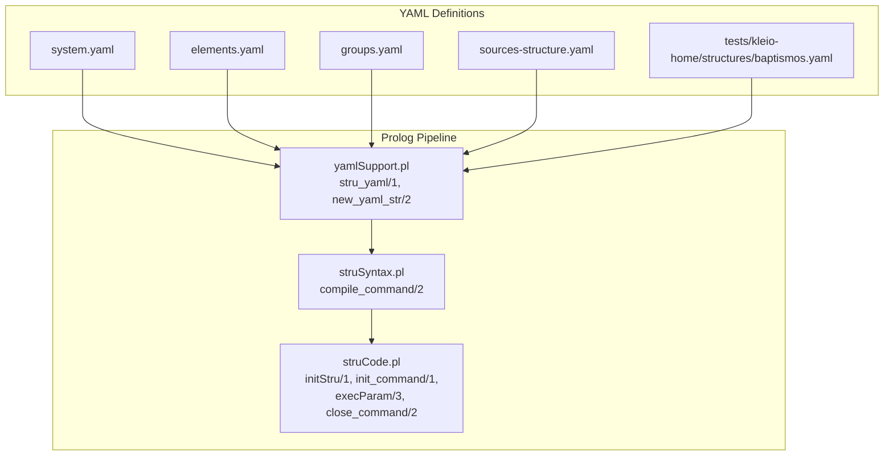
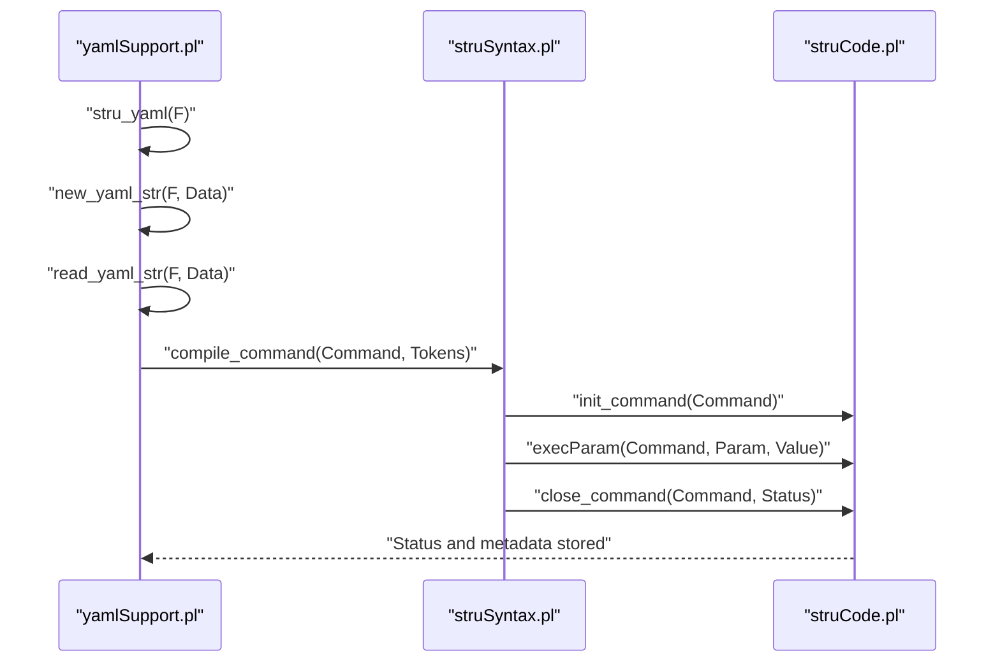
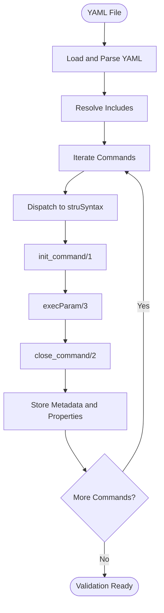
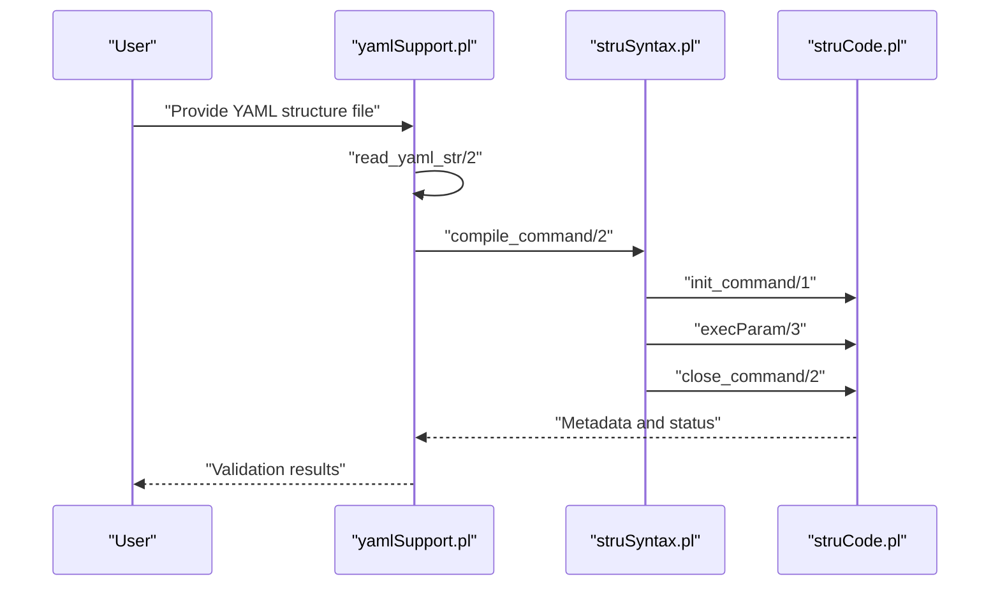
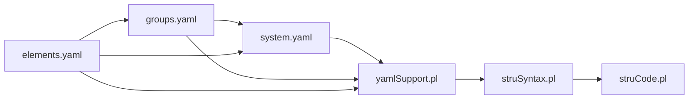

# Structure Definition System

<cite>
**Referenced Files in This Document**
- [src/stru/README.md](file://src/stru/README.md)
- [src/stru/system.yaml](file://src/stru/system.yaml)
- [src/stru/elements.yaml](file://src/stru/elements.yaml)
- [src/stru/groups.yaml](file://src/stru/groups.yaml)
- [src/stru/sources-structure.yaml](file://src/stru/sources-structure.yaml)
- [src/yamlSupport.pl](file://src/yamlSupport.pl)
- [src/struCode.pl](file://src/struCode.pl)
- [src/struSyntax.pl](file://src/struSyntax.pl)
- [tests/kleio-home/structures/baptismos.yaml](file://tests/kleio-home/structures/baptismos.yaml)
</cite>

## Table of Contents
1. [Introduction](#introduction)
2. [Project Structure](#project-structure)
3. [Core Components](#core-components)
4. [Architecture Overview](#architecture-overview)
5. [Detailed Component Analysis](#detailed-component-analysis)
6. [Dependency Analysis](#dependency-analysis)
7. [Performance Considerations](#performance-considerations)
8. [Troubleshooting Guide](#troubleshooting-guide)
9. [Conclusion](#conclusion)
10. [Appendices](#appendices)

## Introduction
This document explains the structure definition system used by Kleio to define schemas and validation rules for historical documents. It covers:
- How .str and .srpt files define schema and validation rules
- Element definitions, attribute types, value constraints, and validation rules
- Group configurations and their role in organizing related elements
- YAML-based structure definitions and how they map to internal Prolog predicates
- The compilation pipeline from structure files to executable validation rules
- Examples for parishes, notaries, and civil registrations
- Inheritance patterns, element relationships, and cross-references
- Validation, error reporting, and debugging techniques

## Project Structure
The structure definition system centers around:
- A base YAML system that aggregates reusable elements and groups
- YAML files that specialize or compose elements and groups for specific domains
- A Prolog pipeline that parses YAML, validates commands, and builds internal structures
- Legacy .str/.srpt files that can be translated into YAML-compatible structures

**Diagram sources**
- [src/stru/system.yaml](file://src/stru/system.yaml#L1-L4)
- [src/stru/elements.yaml](file://src/stru/elements.yaml#L1-L221)
- [src/stru/groups.yaml](file://src/stru/groups.yaml#L1-L259)
- [src/stru/sources-structure.yaml](file://src/stru/sources-structure.yaml#L1-L800)
- [tests/kleio-home/structures/baptismos.yaml](file://tests/kleio-home/structures/baptismos.yaml#L1-L42)
- [src/yamlSupport.pl](file://src/yamlSupport.pl#L28-L43)
- [src/struSyntax.pl](file://src/struSyntax.pl#L48-L58)
- [src/struCode.pl](file://src/struCode.pl#L64-L118)

**Section sources**
- [src/stru/README.md](file://src/stru/README.md#L1-L4)
- [src/stru/system.yaml](file://src/stru/system.yaml#L1-L4)

## Core Components
- YAML structure loader: reads YAML files, resolves includes, and dispatches commands to the Prolog compiler
- Syntax and grammar: validates command names, parameters, and values against a controlled vocabulary
- Command executor: transforms validated definitions into internal structure metadata
- Base definitions: reusable elements and groups that drive domain-specific specializations

Key responsibilities:
- YAML loader: [stru_yaml/1](file://src/yamlSupport.pl#L28-L43), [new_yaml_str/2](file://src/yamlSupport.pl#L36-L43), [read_yaml_str/2](file://src/yamlSupport.pl#L46-L69)
- Command compilation: [compile_command/2](file://src/struSyntax.pl#L48-L58)
- Parameter execution: [execParam/3](file://src/struCode.pl#L169-L185) and specialized handlers for pars/terminus/pars
- Completeness checks: [check_complete/2](file://src/struCode.pl#L306-L321)

**Section sources**
- [src/yamlSupport.pl](file://src/yamlSupport.pl#L28-L137)
- [src/struSyntax.pl](file://src/struSyntax.pl#L48-L135)
- [src/struCode.pl](file://src/struCode.pl#L64-L118)

## Architecture Overview
The pipeline converts YAML structure definitions into internal schema metadata and validation rules.

**Diagram sources**
- [src/yamlSupport.pl](file://src/yamlSupport.pl#L28-L43)
- [src/struSyntax.pl](file://src/struSyntax.pl#L48-L58)
- [src/struCode.pl](file://src/struCode.pl#L91-L118)

## Detailed Component Analysis

### YAML Structure Loader
- Loads a YAML file and initializes the structure processing session
- Resolves include directives and traverses nested files
- Dispatches each YAML command to the Prolog compiler via [process_str_command/2](file://src/yamlSupport.pl#L129-L137)
- Sanitizes values (atoms/lists) for internal processing

Highlights:
- File lifecycle: [stru_yaml/1](file://src/yamlSupport.pl#L28-L43)
- Include resolution: [include_yaml_str/2](file://src/yamlSupport.pl#L189-L192)
- Command dispatch: [process_str_command/2](file://src/yamlSupport.pl#L129-L137)
- Parameter sanitization: [sanitize_value/2](file://src/yamlSupport.pl#L176-L186)

**Section sources**
- [src/yamlSupport.pl](file://src/yamlSupport.pl#L28-L137)

### Syntax and Grammar
- Validates commands and parameters against a keyword dictionary
- Enforces parameter order and value types
- Supports aliases (e.g., “group” for “pars”, “element” for “terminus”)

Highlights:
- Command recognition: [is_kw/2](file://src/struSyntax.pl#L291-L295)
- Parameter validation: [params/2](file://src/struSyntax.pl#L124-L135)
- Value grammars: [val/3](file://src/struSyntax.pl#L138-L180)
- Keyword mapping: [keyword/2](file://src/struSyntax.pl#L317-L354), [engkw/2](file://src/struSyntax.pl#L355-L416)

**Section sources**
- [src/struSyntax.pl](file://src/struSyntax.pl#L124-L180)
- [src/struSyntax.pl](file://src/struSyntax.pl#L291-L354)
- [src/struSyntax.pl](file://src/struSyntax.pl#L355-L416)

### Command Executor
- Initializes and finalizes each command, storing properties and metadata
- Enforces required parameters and marks completeness
- Specialized handlers for group and element definitions

Highlights:
- Initialization: [init_command/1](file://src/struCode.pl#L91-L94)
- Parameter execution: [execParam/3](file://src/struCode.pl#L169-L185)
- Completeness checks: [check_complete/2](file://src/struCode.pl#L306-L321)
- Defaults: [set_defaults/1](file://src/struCode.pl#L128-L146)

**Section sources**
- [src/struCode.pl](file://src/struCode.pl#L91-L118)
- [src/struCode.pl](file://src/struCode.pl#L128-L146)
- [src/struCode.pl](file://src/struCode.pl#L306-L321)

### Base Definitions: Elements and Groups
- Elements define typed attributes and their roles (e.g., identifiers, dates, locations)
- Groups define document structures, containment, ordering, and guarantees

Highlights:
- Elements: [elements.yaml](file://src/stru/elements.yaml#L39-L221)
- Groups: [groups.yaml](file://src/stru/groups.yaml#L32-L259)
- Base system composition: [system.yaml](file://src/stru/system.yaml#L1-L4)

**Section sources**
- [src/stru/elements.yaml](file://src/stru/elements.yaml#L39-L221)
- [src/stru/groups.yaml](file://src/stru/groups.yaml#L32-L259)
- [src/stru/system.yaml](file://src/stru/system.yaml#L1-L4)

### Domain-Specific YAML Examples
- Baptismos schema demonstrates specialized groups and elements for a parish domain

Highlights:
- Includes: [baptismos.yaml](file://tests/kleio-home/structures/baptismos.yaml#L5-L7)
- Group definitions: [bap](file://tests/kleio-home/structures/baptismos.yaml#L22-L31), [b](file://tests/kleio-home/structures/baptismos.yaml#L33-L41)
- Element specializations: [celebrante](file://tests/kleio-home/structures/baptismos.yaml#L10-L11), [anon/mesn/dian](file://tests/kleio-home/structures/baptismos.yaml#L13-L20)

**Section sources**
- [tests/kleio-home/structures/baptismos.yaml](file://tests/kleio-home/structures/baptismos.yaml#L1-L42)

### Legacy .str and .srpt Files
- Legacy structure files can be translated into YAML-compatible structures
- The system supports both classic .str and modern .yaml/.srpt formats

Highlights:
- Preferred format note: [README.md](file://src/stru/README.md#L1-L4)
- Generated structure mapping: [sources-structure.yaml](file://src/stru/sources-structure.yaml#L1-L800)

**Section sources**
- [src/stru/README.md](file://src/stru/README.md#L1-L4)
- [src/stru/sources-structure.yaml](file://src/stru/sources-structure.yaml#L1-L800)

## Architecture Overview
The system translates YAML definitions into internal predicates and metadata for validation and processing.

**Diagram sources**
- [src/yamlSupport.pl](file://src/yamlSupport.pl#L46-L69)
- [src/struSyntax.pl](file://src/struSyntax.pl#L77-L78)
- [src/struCode.pl](file://src/struCode.pl#L91-L118)

## Detailed Component Analysis

### Element Definition System
- Types and constraints: elements declare types (e.g., date, number, string64/256) and identification semantics
- Specialization: elements can derive from base types via “source”
- Identification and cross-reference elements: id, same_as, xsame_as, entity, origin, destination

Examples of element categories:
- Data types: [elements.yaml](file://src/stru/elements.yaml#L39-L52)
- Dates: [elements.yaml](file://src/stru/elements.yaml#L56-L75)
- Identification: [elements.yaml](file://src/stru/elements.yaml#L81-L119)
- Descriptive text: [elements.yaml](file://src/stru/elements.yaml#L160-L164)

Validation rules:
- Required presence: enforced by group guarantees and element identification flags
- Type enforcement: mapped to Prolog types and constraints during compilation

**Section sources**
- [src/stru/elements.yaml](file://src/stru/elements.yaml#L39-L119)
- [src/stru/elements.yaml](file://src/stru/elements.yaml#L160-L164)

### Group Configurations and Organization
- Groups define:
  - Position: positional elements without explicit names
  - Guaranteed: mandatory elements
  - Also: optional elements
  - Part/Contains: child groups allowed
  - Source: inheritance from another group
  - Id prefix: entity id namespace
- Inheritance: groups can extend others; properties merge unless overridden

Examples:
- Top-level: [kleio](file://src/stru/groups.yaml#L32-L40)
- Historical source: [historical-source](file://src/stru/groups.yaml#L42-L56)
- Person groups: [person/female/male](file://src/stru/groups.yaml#L161-L185)
- Event hierarchy: [event/cevent](file://src/stru/groups.yaml#L141-L159)

**Section sources**
- [src/stru/groups.yaml](file://src/stru/groups.yaml#L32-L56)
- [src/stru/groups.yaml](file://src/stru/groups.yaml#L161-L185)
- [src/stru/groups.yaml](file://src/stru/groups.yaml#L141-L159)

### YAML Mapping to Prolog Predicates
- YAML commands map to internal predicates:
  - file → metadata registration
  - include → recursive loading
  - group → group creation and properties
  - element → element creation and properties
- The YAML loader sanitizes values and forwards parameters to the Prolog compiler

References:
- YAML processing: [yamlSupport.pl](file://src/yamlSupport.pl#L46-L137)
- Command mapping: [struSyntax.pl](file://src/struSyntax.pl#L124-L135)

**Section sources**
- [src/yamlSupport.pl](file://src/yamlSupport.pl#L46-L137)
- [src/struSyntax.pl](file://src/struSyntax.pl#L124-L135)

### Compilation Pipeline: From Structure Files to Validation Rules
- YAML loaded and inspected
- Commands compiled and executed
- Required parameters validated
- Metadata stored for downstream processing

**Diagram sources**
- [src/yamlSupport.pl](file://src/yamlSupport.pl#L46-L69)
- [src/struSyntax.pl](file://src/struSyntax.pl#L77-L78)
- [src/struCode.pl](file://src/struCode.pl#L91-L118)

**Section sources**
- [src/yamlSupport.pl](file://src/yamlSupport.pl#L46-L69)
- [src/struSyntax.pl](file://src/struSyntax.pl#L77-L78)
- [src/struCode.pl](file://src/struCode.pl#L91-L118)

### Examples: Parishes, Notaries, Civil Registrations
- Parishes (Baptisms):
  - Specialized groups for variants (e.g., “bap”, “b”)
  - Positional and guaranteed elements tailored to parish records
  - References to actors and witnesses via contained groups
  - Reference: [baptismos.yaml](file://tests/kleio-home/structures/baptismos.yaml#L22-L41)

- Notaries and Civil Registrations:
  - Extend historical-act with specific elements for notarial and civil contexts
  - Use guaranteed elements for act type, date, and parties
  - Leverage inheritance from base groups for reuse

Note: Domain-specific YAML files demonstrate these patterns; adapt group and element definitions to match your domain’s requirements.

**Section sources**
- [tests/kleio-home/structures/baptismos.yaml](file://tests/kleio-home/structures/baptismos.yaml#L22-L41)

### Inheritance Patterns, Relationships, and Cross-References
- Inheritance:
  - Groups inherit properties from a source group
  - Elements can specialize base types via “source”
- Relationships:
  - Entity identification and cross-references via id, same_as, xsame_as, entity
  - Relations connect entities with typed values and destinations
- Containment:
  - Groups can contain other groups (e.g., person, object, geoentity)
  - Arbitrary containment allows flexible substructures

References:
- Group inheritance: [groups.yaml](file://src/stru/groups.yaml#L69-L71), [groups.yaml](file://src/stru/groups.yaml#L149-L159)
- Element specialization: [elements.yaml](file://src/stru/elements.yaml#L24-L36)
- Identification elements: [elements.yaml](file://src/stru/elements.yaml#L81-L119)

**Section sources**
- [src/stru/groups.yaml](file://src/stru/groups.yaml#L69-L71)
- [src/stru/groups.yaml](file://src/stru/groups.yaml#L149-L159)
- [src/stru/elements.yaml](file://src/stru/elements.yaml#L24-L36)
- [src/stru/elements.yaml](file://src/stru/elements.yaml#L81-L119)

## Dependency Analysis
The structure system exhibits layered dependencies:
- YAML files depend on base definitions (elements and groups)
- Domain YAML files depend on localization and actor-related YAML files
- Prolog modules depend on each other for parsing, validation, and storage

**Diagram sources**
- [src/stru/elements.yaml](file://src/stru/elements.yaml#L1-L221)
- [src/stru/groups.yaml](file://src/stru/groups.yaml#L1-L259)
- [src/stru/system.yaml](file://src/stru/system.yaml#L1-L4)
- [src/yamlSupport.pl](file://src/yamlSupport.pl#L1-L26)
- [src/struSyntax.pl](file://src/struSyntax.pl#L1-L43)
- [src/struCode.pl](file://src/struCode.pl#L1-L56)

**Section sources**
- [src/stru/elements.yaml](file://src/stru/elements.yaml#L1-L221)
- [src/stru/groups.yaml](file://src/stru/groups.yaml#L1-L259)
- [src/stru/system.yaml](file://src/stru/system.yaml#L1-L4)
- [src/yamlSupport.pl](file://src/yamlSupport.pl#L1-L26)
- [src/struSyntax.pl](file://src/struSyntax.pl#L1-L43)
- [src/struCode.pl](file://src/struCode.pl#L1-L56)

## Performance Considerations
- Prefer YAML over legacy .str for maintainability and extensibility
- Keep includes minimal and focused to reduce parsing overhead
- Use inheritance to avoid duplication and streamline validation
- Validate early and often to catch errors before downstream processing

## Troubleshooting Guide
Common issues and remedies:
- Unknown command or parameter:
  - Verify spelling and keyword mapping
  - Check [struSyntax.pl](file://src/struSyntax.pl#L124-L135) for supported parameters
- Missing required parameters:
  - Ensure required parameters are present for commands (e.g., nomen, primum for nomino)
  - See [check_complete/2](file://src/struCode.pl#L306-L321)
- Circular or invalid includes:
  - YAML loader prevents reprocessing the same file; ensure include paths resolve correctly
  - See [read_yaml_str/2](file://src/yamlSupport.pl#L46-L69)
- Parameter value type mismatch:
  - Confirm values match expected grammars (lists, names, numbers)
  - See [val/3](file://src/struSyntax.pl#L138-L180)
- Debugging tips:
  - Enable verbose reporting during YAML processing
  - Inspect stored properties and statuses for commands

**Section sources**
- [src/struSyntax.pl](file://src/struSyntax.pl#L124-L135)
- [src/struCode.pl](file://src/struCode.pl#L306-L321)
- [src/yamlSupport.pl](file://src/yamlSupport.pl#L46-L69)
- [src/struSyntax.pl](file://src/struSyntax.pl#L138-L180)

## Conclusion
The structure definition system provides a robust, extensible framework for modeling Kleio schemas. By combining reusable base elements and groups with domain-specific YAML specializations, it enables precise validation and consistent processing of historical documents. The Prolog pipeline ensures correctness through strict syntax validation, parameter enforcement, and metadata storage.

## Appendices

### Appendix A: Base Structure Composition
- Base system aggregates elements and groups:
  - [system.yaml](file://src/stru/system.yaml#L1-L4)
  - [elements.yaml](file://src/stru/elements.yaml#L1-L221)
  - [groups.yaml](file://src/stru/groups.yaml#L1-L259)

**Section sources**
- [src/stru/system.yaml](file://src/stru/system.yaml#L1-L4)
- [src/stru/elements.yaml](file://src/stru/elements.yaml#L1-L221)
- [src/stru/groups.yaml](file://src/stru/groups.yaml#L1-L259)