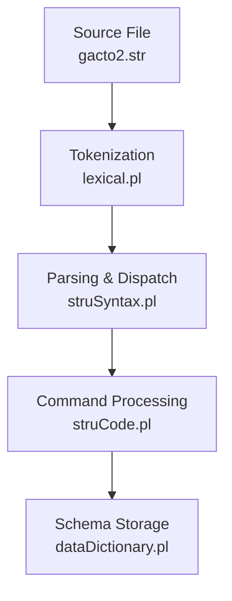
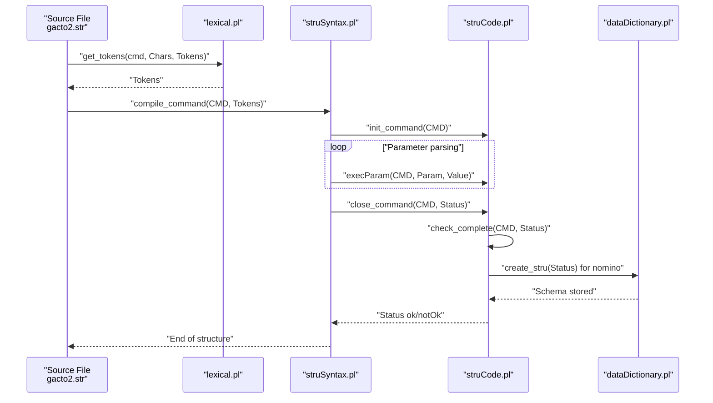
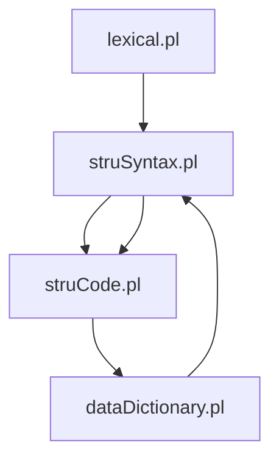

# STR Format

<cite>
**Referenced Files in This Document**
- [gacto2.str](file://src/stru/gacto2.str)
- [struSyntax.pl](file://src/struSyntax.pl)
- [struCode.pl](file://src/struCode.pl)
- [lexical.pl](file://src/lexical.pl)
- [dataDictionary.pl](file://src/dataDictionary.pl)
</cite>

## Table of Contents
1. [Introduction](#introduction)
2. [Project Structure](#project-structure)
3. [Core Components](#core-components)
4. [Architecture Overview](#architecture-overview)
5. [Detailed Component Analysis](#detailed-component-analysis)
6. [Dependency Analysis](#dependency-analysis)
7. [Performance Considerations](#performance-considerations)
8. [Troubleshooting Guide](#troubleshooting-guide)
9. [Conclusion](#conclusion)

## Introduction
This document explains the STR format, the native schema definition language for Kleio structure files. It covers the syntax and semantics of STR commands, focusing on nomino, pars, terminus, and exitus. It describes how the DCG grammar in struSyntax.pl parses STR files and how struCode.pl processes commands through init_command, execParam, and close_command predicates. It documents required parameters (e.g., nomen and primum for nomino), completeness checking via check_complete/2, and how pars defines groups with ordo, ceteri, and fons parameters. It also explains how terminus defines elements with modus, forma, and identificatio. Finally, it traces the processing flow from tokenization in lexical.pl to structure creation in dataDictionary.pl and outlines error handling for malformed STR files.

## Project Structure
The STR format is defined in a dedicated structure file and parsed by a layered pipeline:
- Tokenization: lexical.pl converts raw characters into tokens.
- Parsing: struSyntax.pl uses a DCG grammar to parse STR commands and dispatch to processing.
- Command processing: struCode.pl manages command lifecycle and parameter handling.
- Schema storage: dataDictionary.pl persists the parsed schema and exposes it for downstream use.

**Diagram sources**
- [gacto2.str](file://src/stru/gacto2.str#L1-L120)
- [lexical.pl](file://src/lexical.pl#L42-L74)
- [struSyntax.pl](file://src/struSyntax.pl#L48-L83)
- [struCode.pl](file://src/struCode.pl#L90-L119)
- [dataDictionary.pl](file://src/dataDictionary.pl#L106-L141)

**Section sources**
- [gacto2.str](file://src/stru/gacto2.str#L1-L120)
- [lexical.pl](file://src/lexical.pl#L42-L74)
- [struSyntax.pl](file://src/struSyntax.pl#L48-L83)
- [struCode.pl](file://src/struCode.pl#L90-L119)
- [dataDictionary.pl](file://src/dataDictionary.pl#L106-L141)

## Core Components
- STR commands: nomino, pars, terminus, exitus, and nota (comments).
- Parameters: nomen, primum, modus, antiquum, identificatio, plures, scribe, ordo, ceteri, fons, post, prae, locus, signum, sine, signa, forma, certe, pars, semper, repetitio, nota.
- Required parameters: nomino requires nomen and primum; pars requires nomen; terminus requires nomen; exitus requires nomen.
- Completeness checking: check_complete/2 validates required parameters and marks status.

**Section sources**
- [struSyntax.pl](file://src/struSyntax.pl#L124-L136)
- [struCode.pl](file://src/struCode.pl#L329-L336)
- [struCode.pl](file://src/struCode.pl#L305-L327)

## Architecture Overview
The STR pipeline transforms a human-readable schema into an internal representation and enforces correctness.

**Diagram sources**
- [lexical.pl](file://src/lexical.pl#L42-L74)
- [struSyntax.pl](file://src/struSyntax.pl#L48-L83)
- [struSyntax.pl](file://src/struSyntax.pl#L95-L120)
- [struCode.pl](file://src/struCode.pl#L90-L119)
- [struCode.pl](file://src/struCode.pl#L298-L327)
- [dataDictionary.pl](file://src/dataDictionary.pl#L106-L141)

## Detailed Component Analysis

### STR Commands and Semantics
- nomino: Defines the schema file and its primary document. Required parameters: nomen (schema name), primum (primary document). Defaults include modus, antiquum, scribe, plures.
- pars: Defines groups and their properties. Requires nomen (list of group names). Supports ordo, sequentia, identificatio, signum, fons, prae, post, locus, ceteri, certe, pars, solum, semper, repetitio, nota.
- terminus: Defines elements and their properties. Requires nomen (list of element names). Supports modus, primum, secundum, ordo, fons, prae, post, pars, sine, signa, forma, ceteri, identificatio, cumule, solum, nota.
- exitus: Marks end of schema definition. Requires nomen (must match the nomino nomen).
- nota: Inline documentation/comment.

Examples from gacto2.str illustrate usage patterns:
- nomino defines the schema name and primary document.
- pars defines groups like fonte, pt-acto, person, object, and others, with ordo, ceteri, fons, and other parameters.
- terminus defines elements such as dia, mes, ano, tipo, valor, localizacao, cota, nome, sexo, nomedest, iddest, sumario, fol, folios, etc., with modus, forma, identificatio, and others.

**Section sources**
- [struSyntax.pl](file://src/struSyntax.pl#L124-L136)
- [struCode.pl](file://src/struCode.pl#L133-L146)
- [struCode.pl](file://src/struCode.pl#L169-L186)
- [struCode.pl](file://src/struCode.pl#L193-L213)
- [struCode.pl](file://src/struCode.pl#L243-L263)
- [struCode.pl](file://src/struCode.pl#L282-L287)
- [gacto2.str](file://src/stru/gacto2.str#L436-L449)
- [gacto2.str](file://src/stru/gacto2.str#L456-L461)
- [gacto2.str](file://src/stru/gacto2.str#L798-L803)
- [gacto2.str](file://src/stru/gacto2.str#L800-L804)

### DCG Grammar and Parameter Validation
The DCG grammar in struSyntax.pl:
- Recognizes commands and strips whitespace.
- Validates command names and parameters against keyword tables.
- Enforces parameter ordering and value types.
- Dispatches to struCode.pl via init_command, execParam, and close_command.

Key grammar rules:
- compile_command/2: tokenizes and parses the command line.
- cliocmd/1: recognizes goodCommand, notYet, badCommand, and nota.
- parlist/1: iterates over parameters and invokes execParam.
- param/3: validates parameter names and values.
- val/3: validates values for specific parameters (lists, names, keyword enums).

**Section sources**
- [struSyntax.pl](file://src/struSyntax.pl#L48-L83)
- [struSyntax.pl](file://src/struSyntax.pl#L95-L120)
- [struSyntax.pl](file://src/struSyntax.pl#L124-L181)
- [struSyntax.pl](file://src/struSyntax.pl#L221-L277)

### Command Processing Lifecycle
struCode.pl orchestrates command processing:
- init_command(C): initializes command state, clears previous properties, and sets defaults.
- execParam(C,P,V): applies parameter assignments; validates unknown parameters and enforces dependencies (e.g., pars/fons requires nomen).
- close_command(C,S): finalizes command, runs completeness checks, and triggers schema creation for nomino.
- check_complete(CMD,Result): verifies required parameters and sets status.

Defaults:
- nomino: sets modus, antiquum, scribe, plures defaults.
- pars/terminus: defaults are applied after nomen is known.

**Section sources**
- [struCode.pl](file://src/struCode.pl#L90-L119)
- [struCode.pl](file://src/struCode.pl#L128-L146)
- [struCode.pl](file://src/struCode.pl#L148-L287)
- [struCode.pl](file://src/struCode.pl#L298-L327)
- [struCode.pl](file://src/struCode.pl#L329-L336)

### Required Parameters and Completeness Checking
Required parameters enforced by check_complete/2:
- nomino: nomen, primum
- pars: nomen
- terminus: nomen
- exitus: nomen

Missing required parameters produce errors and set status to notOk.

**Section sources**
- [struCode.pl](file://src/struCode.pl#L329-L336)
- [struCode.pl](file://src/struCode.pl#L305-L327)

### pars: Group Definition and Parameters
pars defines groups and their properties:
- nomen: list of group names.
- ordo/sequentia: ordering behavior.
- identificatio: identification mode.
- signum: identifier prefix.
- fons: source/specialization group.
- prae/post: prefix/suffix behavior.
- locus: positional elements.
- ceteri/certe: optional/mandatory elements.
- pars: included groups.
- solum/semper: containment modes.
- repetitio: repetition behavior.
- nota: documentation.

Processing flow:
- nomen must be processed first; subsequent parameters require nomen.
- Values are stored in dataDictionary via set_groups_prop/3.

**Section sources**
- [struSyntax.pl](file://src/struSyntax.pl#L131-L135)
- [struSyntax.pl](file://src/struSyntax.pl#L147-L161)
- [struCode.pl](file://src/struCode.pl#L193-L213)
- [struCode.pl](file://src/struCode.pl#L208-L213)
- [dataDictionary.pl](file://src/dataDictionary.pl#L335-L345)

### terminus: Element Definition and Parameters
terminus defines elements and their properties:
- nomen: list of element names.
- modus/primum/secundum: type classification.
- ordo: simplex/multiplex.
- fons: source/specialization element.
- prae/post: prefix/suffix behavior.
- pars: included elements.
- sine/signa/forma: formatting and display modes.
- ceteri/identificatio: identification and optional/mandatory behavior.
- cumule/solum: containment modes.
- nota: documentation.

Processing flow:
- nomen must be processed first; subsequent parameters require nomen.
- Values are stored in dataDictionary via set_elements_prop/3.

**Section sources**
- [struSyntax.pl](file://src/struSyntax.pl#L127-L131)
- [struSyntax.pl](file://src/struSyntax.pl#L162-L179)
- [struCode.pl](file://src/struCode.pl#L243-L263)
- [struCode.pl](file://src/struCode.pl#L253-L263)
- [dataDictionary.pl](file://src/dataDictionary.pl#L366-L372)

### exitus: End-of-Definition Marker
- exitus requires nomen equal to the nomino nomen.
- On mismatch, an error is reported.

**Section sources**
- [struSyntax.pl](file://src/struSyntax.pl#L180-L180)
- [struCode.pl](file://src/struCode.pl#L282-L287)

### Tokenization and Error Handling
lexical.pl:
- Tokenizes command lines into tokens (names, numbers, strings, data flags).
- Processes data flags for data files; command files use stricter rules.
- Provides error reporting hooks for unmatched quotes and missing closing quotes.

Error handling in parsing:
- Unknown commands or bad parameters trigger errors.
- Missing equals signs or invalid values are reported.
- Completeness checks flag missing required parameters.

**Section sources**
- [lexical.pl](file://src/lexical.pl#L42-L74)
- [lexical.pl](file://src/lexical.pl#L113-L123)
- [lexical.pl](file://src/lexical.pl#L210-L231)
- [struSyntax.pl](file://src/struSyntax.pl#L52-L59)
- [struSyntax.pl](file://src/struSyntax.pl#L109-L120)
- [struSyntax.pl](file://src/struSyntax.pl#L114-L120)

### Schema Creation and Storage
dataDictionary.pl:
- create_stru/1: asserts the schema predicate and copies nomino properties.
- clean_stru/1: cleans previous definitions and resets properties.
- set_groups_prop/3 and set_elements_prop/3: store group and element properties.
- copy_fons_g/2 and copy_fons_e/2: propagate fons/source properties to derived groups/elements.
- Utility predicates for hierarchy traversal and documentation generation.

**Section sources**
- [dataDictionary.pl](file://src/dataDictionary.pl#L106-L141)
- [dataDictionary.pl](file://src/dataDictionary.pl#L310-L345)
- [dataDictionary.pl](file://src/dataDictionary.pl#L530-L557)

## Dependency Analysis
The STR pipeline exhibits tight coupling among modules:
- lexical.pl depends on chartype and data flags.
- struSyntax.pl depends on lexical.pl and struCode.pl.
- struCode.pl depends on dataDictionary.pl and utilities.
- dataDictionary.pl depends on struSyntax.pl for English keyword mapping and on persistence/utilities for property storage.

**Diagram sources**
- [lexical.pl](file://src/lexical.pl#L42-L74)
- [struSyntax.pl](file://src/struSyntax.pl#L37-L43)
- [struCode.pl](file://src/struCode.pl#L49-L56)
- [dataDictionary.pl](file://src/dataDictionary.pl#L90-L98)

**Section sources**
- [lexical.pl](file://src/lexical.pl#L42-L74)
- [struSyntax.pl](file://src/struSyntax.pl#L37-L43)
- [struCode.pl](file://src/struCode.pl#L49-L56)
- [dataDictionary.pl](file://src/dataDictionary.pl#L90-L98)

## Performance Considerations
- Tokenization and parsing are linear in input length; ensure minimal backtracking in grammar rules.
- Property storage and retrieval rely on indexed properties; keep parameter lists concise.
- Completeness checks are O(k) per command where k is the number of required parameters.
- Consider caching repeated group/element lookups in dataDictionary.pl for large schemas.

## Troubleshooting Guide
Common issues and resolutions:
- Unknown command or parameter: Verify spelling and keyword prefixes; consult keyword tables.
- Missing equals sign: Ensure parameter assignment syntax is correct.
- Missing required parameter: Add nomen/primum for nomino; ensure pars/terminus nomen precedes other parameters.
- fons/source misuse: Ensure fons is defined before use; verify group/element existence.
- exitus mismatch: Confirm nomen equals the nomino nomen.
- Tokenization errors: Check for unmatched quotes or missing closing quotes.

**Section sources**
- [struSyntax.pl](file://src/struSyntax.pl#L52-L59)
- [struSyntax.pl](file://src/struSyntax.pl#L109-L120)
- [struCode.pl](file://src/struCode.pl#L208-L213)
- [struCode.pl](file://src/struCode.pl#L282-L287)
- [lexical.pl](file://src/lexical.pl#L210-L231)

## Conclusion
The STR format provides a declarative schema language for Kleio structures. The pipeline from tokenization to schema storage is robust, with strong parameter validation and completeness checks. Understanding nomino, pars, terminus, and exitus—along with their required parameters and defaults—enables precise and maintainable schema definitions. The provided examples from gacto2.str demonstrate practical usage patterns for groups and elements, while the processing modules ensure correctness and extensibility.