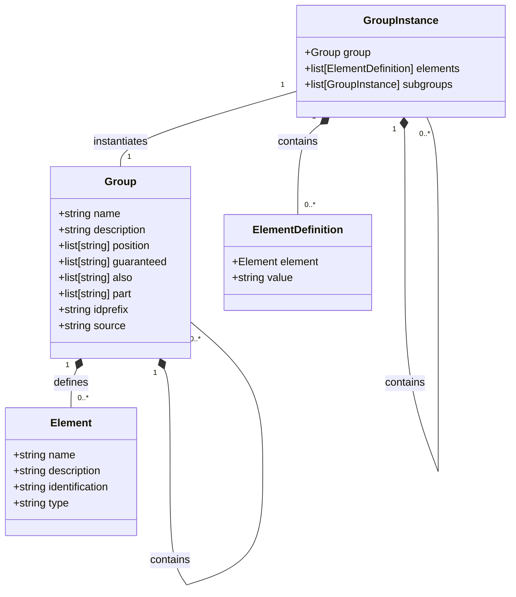
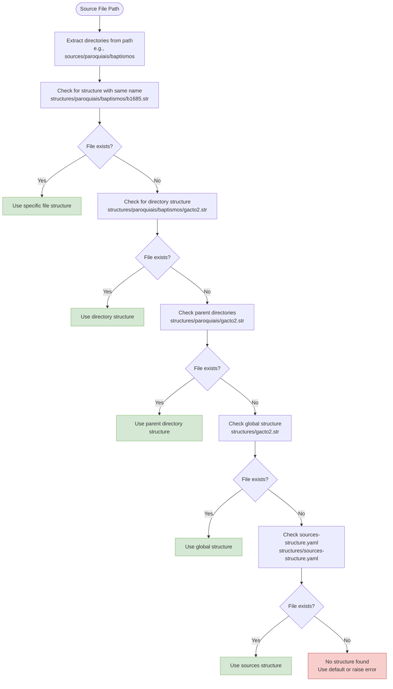

# Structure Files

<cite>
**Referenced Files in This Document**   
- [system.yaml](file://src/stru/system.yaml)
- [sources-structure.yaml](file://src/stru/sources-structure.yaml)
- [gacto2.str](file://src/stru/gacto2.str)
- [elements.yaml](file://src/stru/elements.yaml)
- [groups.yaml](file://src/stru/groups.yaml)
- [apiTranslations.pl](file://src/apiTranslations.pl)
- [kleioFiles.pl](file://src/kleioFiles.pl)
- [yamlSupport.pl](file://src/yamlSupport.pl)
</cite>

## Table of Contents
1. [Introduction](#introduction)
2. [Structure File Formats: STR and YAML](#structure-file-formats-str-and-yaml)
3. [Data Model: Elements and Groups](#data-model-elements-and-groups)
4. [Inheritance Mechanisms](#inheritance-mechanisms)
5. [Structure Resolution Algorithm](#structure-resolution-algorithm)
6. [Best Practices](#best-practices)
7. [Conclusion](#conclusion)

## Introduction
Structure files in the Kleio system serve as schema definitions that guide the translation and normalization of historical source data. These files define the data model for Kleio documents, specifying the elements, groups, and their relationships that constitute valid document structures. The system supports two complementary formats for structure definitions: the native STR format and the programmatic YAML format. This dual-format approach allows for both human-readable configuration and machine-generated schema definitions. The structure resolution system employs a sophisticated matching algorithm to locate the appropriate schema for a given source file by searching through directory hierarchies and fallback paths, ensuring that the correct translation rules are applied based on the source's location and type.

## Structure File Formats: STR and YAML
The Kleio system supports two formats for structure definitions: the native STR format and the programmatic YAML format. The STR format is the original, native format designed for direct human authoring and editing. It uses a specialized syntax with commands like `element`, `part` (for groups), and `database` to define the schema. For example, in `gacto2.str`, elements are defined using `element name=number` and groups using `part name=historical-source`. This format is optimized for readability and direct manipulation by domain experts working with historical sources.

In contrast, the YAML format provides a more structured, programmatic approach to defining schemas that is particularly well-suited for automated generation and version control. The YAML files use a list-based structure with explicit keys for different schema components. For instance, `sources-structure.yaml` defines elements as list items with properties like `name`, `description`, and `identification`. This format enables programmatic generation of structure files through scripts and tools, facilitating integration with modern development workflows. The system can automatically convert between these formats, as evidenced by the presence of both `gacto2.str` and its corresponding `gacto2.str.yaml` file, allowing teams to work with the format that best suits their needs while maintaining interoperability across the system.

**Section sources**
- [gacto2.str](file://src/stru/gacto2.str#L34-L55)
- [sources-structure.yaml](file://src/stru/sources-structure.yaml#L4-L8)

## Data Model: Elements and Groups
The Kleio data model is built upon two fundamental components: elements and groups. Elements represent atomic data fields within the schema, such as `id`, `name`, `date`, and `obs` (observations). These are defined in the base `elements.yaml` file, which establishes the core vocabulary for the system. Each element has properties that define its behavior, such as `identification: yes` for the `id` element, which marks it as a unique identifier, or `type: numerus` for date-related elements like `day`, `month`, and `year`. The system includes various data types like `number`, `string64`, `string256`, and `text` to accommodate different kinds of data with appropriate constraints.

Groups, defined in `groups.yaml`, represent structured collections of elements that correspond to meaningful entities in historical sources. The data model follows a hierarchical composition pattern where complex groups contain simpler ones. For example, the top-level `kleio` group contains `historical-source`, which in turn contains `historical-act` and `event`. Groups have several important properties that define their behavior: `position` specifies the order of elements that can be entered positionally (without explicit names), `guaranteed` lists elements that must be present, `also` lists optional elements, and `part` defines which subgroups can be contained within. This hierarchical structure enables the representation of complex historical documents as nested compositions of acts, persons, places, and other entities, with the `historical-act` group serving as a fundamental building block for records like parish entries and notarial acts.



**Diagram sources **
- [elements.yaml](file://src/stru/elements.yaml#L39-L217)
- [groups.yaml](file://src/stru/groups.yaml#L32-L259)

**Section sources**
- [elements.yaml](file://src/stru/elements.yaml#L39-L217)
- [groups.yaml](file://src/stru/groups.yaml#L32-L259)

## Inheritance Mechanisms
The Kleio structure system implements a sophisticated inheritance mechanism that allows for the extension and specialization of both elements and groups. This inheritance is primarily achieved through the `source` parameter, which establishes a parent-child relationship between schema components. For elements, this mechanism enables language localization and semantic specialization. For example, in `gacto2.str`, Portuguese language elements are defined by inheriting from their base counterparts: `element name=dia; source=day` creates a Portuguese version of the day element. This allows the translation system to recognize `dia` as equivalent to `day` while maintaining language-specific terminology in the source documents.

Group inheritance works similarly but enables more complex structural specializations. The `source` parameter in group definitions allows new groups to inherit all properties from a parent group while optionally overriding specific aspects. For instance, the `event` group is defined with `source=historical-act`, inheriting the core structure of a historical record but specializing it for events mentioned in letters or chronicles rather than formal records. This creates a hierarchy where specialized groups like `cevent` (chronology event) can further inherit from `event`, forming a chain of increasingly specific types. The system also supports aliasing through inheritance, as seen in `groups.yaml` where `ls`, `attr`, and `atr` are all defined as aliases for the `attribute` group, providing multiple names for the same conceptual entity to accommodate different user preferences or historical conventions.

```mermaid
classDiagram
class Element {
+string name
+string description
+string identification
+string type
}
class Group {
+string name
+string description
+list[string] position
+list[string] guaranteed
+list[string] also
+list[string] part
+string idprefix
+string source
}
Element "1" <|-- "1" Dia : inherits from
Element "1" <|-- "1" Mes : inherits from
Element "1" <|-- "1" Ano : inherits from
Group "1" <|-- "1" Event : inherits from
Group "1" <|-- "1" Cevent : inherits from
Group "1" <|-- "1" Female : inherits from
Group "1" <|-- "1" Male : inherits from
Element "dia" --> "day" : source
Element "mes" --> "month" : source
Element "ano" --> "year" : source
Group "event" --> "historical-act" : source
Group "cevent" --> "event" : source
Group "female" --> "person" : source
Group "male" --> "person" : source
note right of Element
Element inheritance enables
language localization and
semantic specialization
end note
note right of Group
Group inheritance enables
structural specialization
and hierarchical organization
end note
```

**Diagram sources **
- [gacto2.str](file://src/stru/gacto2.str#L481-L486)
- [gacto2.str](file://src/stru/gacto2.str#L290-L291)
- [groups.yaml](file://src/stru/groups.yaml#L169-L185)

**Section sources**
- [gacto2.str](file://src/stru/gacto2.str#L481-L486)
- [gacto2.str](file://src/stru/gacto2.str#L290-L291)
- [groups.yaml](file://src/stru/groups.yaml#L169-L185)

## Structure Resolution Algorithm
The Kleio system employs a comprehensive matching algorithm in `apiTranslations.pl` to resolve the appropriate structure file for a given source. This algorithm searches through directory hierarchies and fallback paths to locate the most specific schema available for a source file. The resolution process begins by breaking down the source file's path into directories and then systematically searching for matching structure files according to a prioritized sequence. The algorithm first attempts to find a structure file with the same base name as the source file in the corresponding structures directory, such as matching `sources/baptisms/b1685.cli` with `structures/baptisms/b1685.str`.

When a file-specific structure is not found, the algorithm searches for directory-level structures by traversing parent directories in the source path. For example, a file at `sources/paroquiais/baptismos/b1685.cli` would trigger searches for `structures/paroquiais/baptismos/gacto2.str`, then `structures/paroquiais/gacto2.str`, and finally the global `structures/gacto2.str`. The system also supports the `sources-structure.yaml` fallback, which serves as a repository-wide default schema. This depth-first search through the directory hierarchy ensures that more specific, localized schemas take precedence over general ones, allowing for fine-grained control over translation rules based on the source's organizational context. The resolution process is implemented in the `match_stru_to_file` predicate, which systematically checks various naming patterns and directory combinations to locate the appropriate structure definition.



**Diagram sources **
- [apiTranslations.pl](file://src/apiTranslations.pl#L338-L417)
- [docs/doc/stru_file_location.md](file://docs/doc/stru_file_location.md#L17-L24)

**Section sources**
- [apiTranslations.pl](file://src/apiTranslations.pl#L338-L417)
- [docs/doc/stru_file_location.md](file://docs/doc/stru_file_location.md#L17-L24)

## Best Practices
Organizing structure files effectively requires adherence to several best practices that ensure maintainability, consistency, and scalability. First, structure files should be organized hierarchically to mirror the organization of source files, with directory-specific structures taking precedence over global ones. This approach, as documented in `stru_file_location.md`, allows for both specialized schemas for particular document types and consistent defaults for the entire repository. Versioning structure files using the same system as the source data ensures that translations remain reproducible over time, with changes to schemas being tracked alongside the data they affect.

To avoid naming conflicts, a consistent naming convention should be established, preferably using descriptive names that reflect the content or purpose of the structure. The system's fallback mechanism, which searches for `gacto2.str`, `sources.str`, and `sources-structure.yaml` in sequence, provides flexibility but requires careful coordination to prevent ambiguity. When creating specialized structures, it's recommended to extend existing base structures through inheritance rather than duplicating definitions, which reduces maintenance overhead and ensures consistency. Additionally, the use of YAML format for programmatically generated structures and STR format for manually curated ones can leverage the strengths of each format while maintaining interoperability through the system's automatic conversion capabilities.

**Section sources**
- [docs/doc/stru_file_location.md](file://docs/doc/stru_file_location.md#L17-L30)
- [system.yaml](file://src/stru/system.yaml#L1-L4)

## Conclusion
Structure files are the cornerstone of the Kleio system's ability to translate and normalize historical source data. By defining schemas through elements, groups, and inheritance mechanisms, these files create a flexible yet rigorous framework for representing complex historical documents. The dual support for STR and YAML formats accommodates both human authoring and programmatic generation, while the hierarchical resolution algorithm ensures that the most appropriate schema is applied based on the source's context. This sophisticated system enables researchers to work with diverse historical sources while maintaining data consistency and enabling powerful cross-source analysis. The combination of well-defined data models, inheritance capabilities, and intelligent structure resolution makes the Kleio system particularly well-suited for the challenges of historical data processing and digital humanities research.