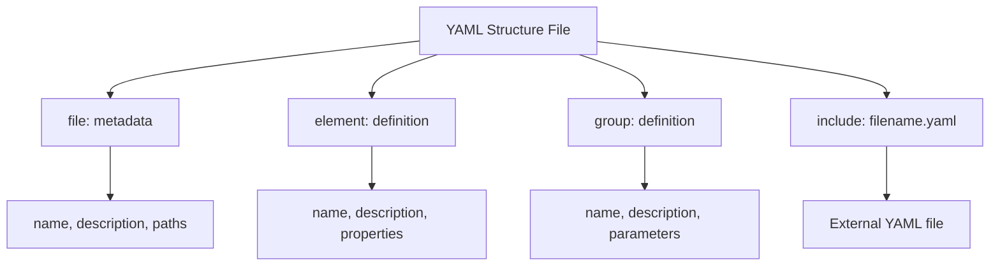
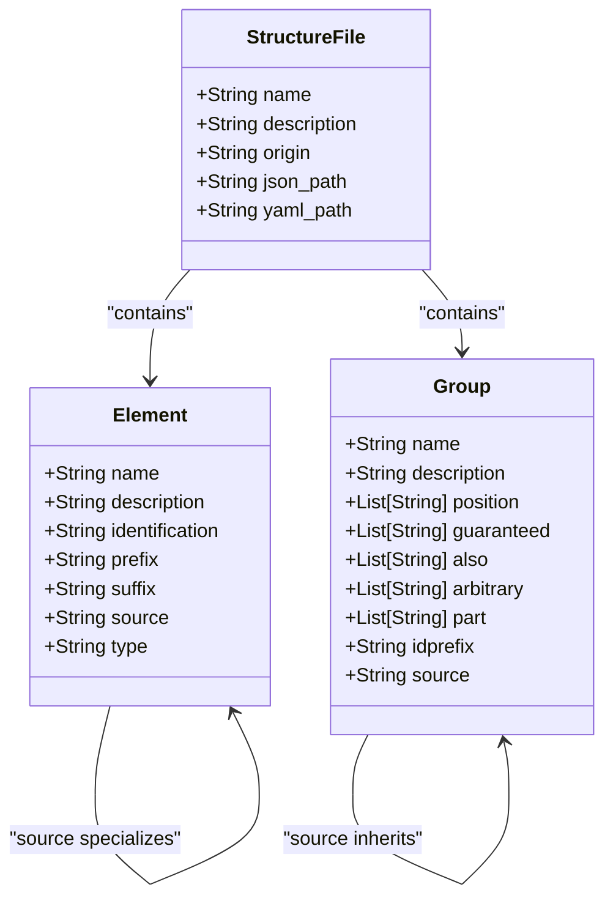
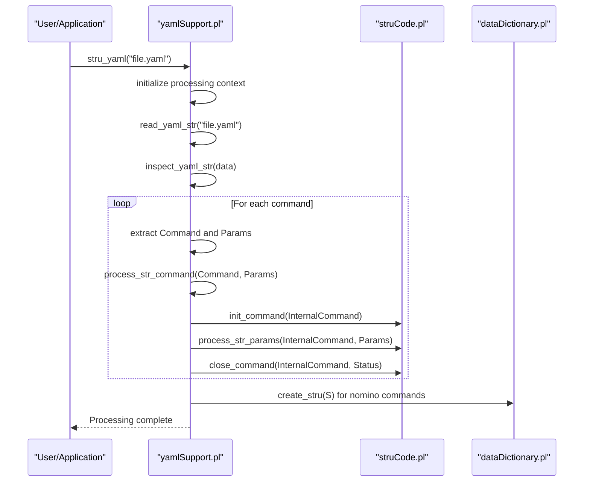
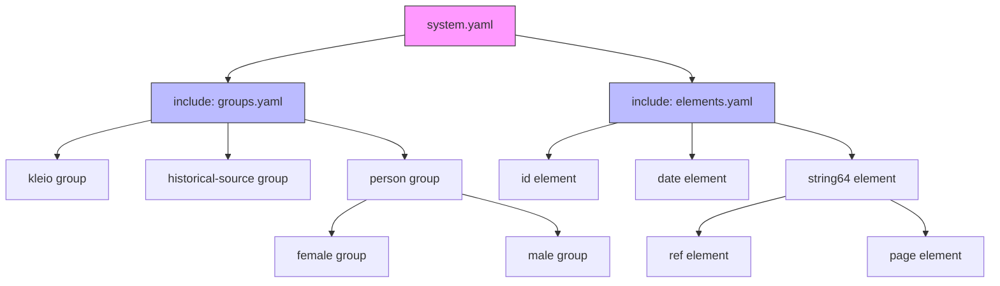
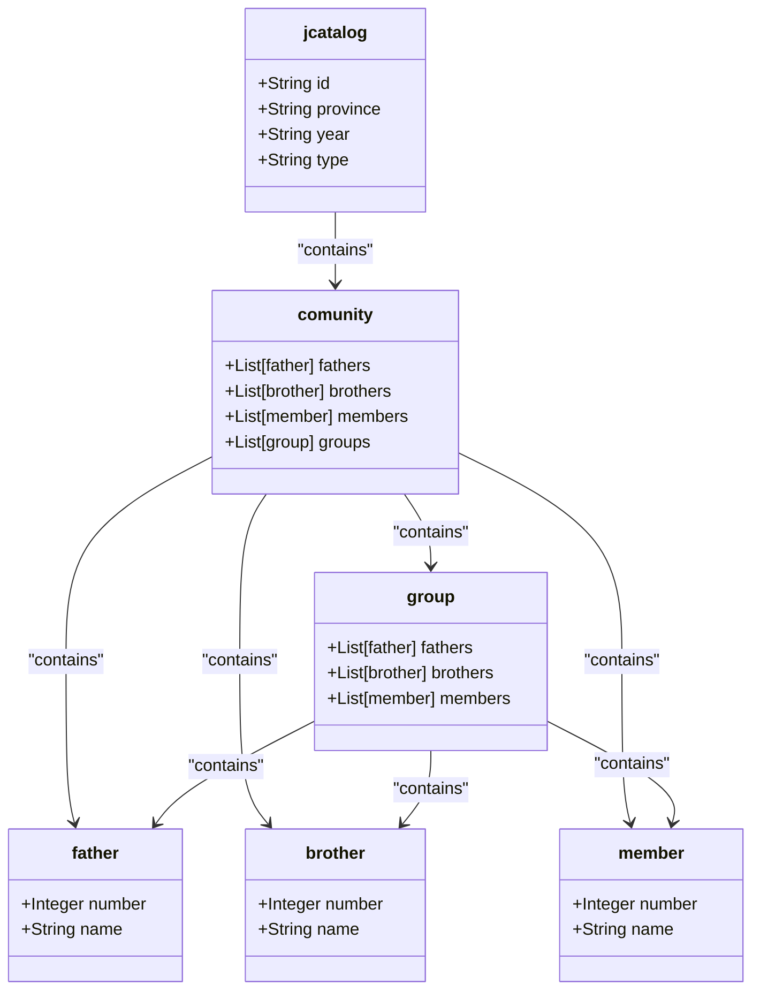

# YAML Format

<cite>
**Referenced Files in This Document**   
- [yamlSupport.pl](file://src/yamlSupport.pl)
- [gacto2.str.yaml](file://src/stru/gacto2.str.yaml)
- [sources-structure.yaml](file://src/stru/sources-structure.yaml)
- [groups.yaml](file://src/stru/groups.yaml)
- [elements.yaml](file://src/stru/elements.yaml)
- [system.yaml](file://src/stru/system.yaml)
- [struCode.pl](file://src/struCode.pl)
- [struSyntax.pl](file://src/struSyntax.pl)
- [jcatalog-structure.yaml](file://tests/kleio-home/sources/reference_sources/yaml/jcatalog-structure.yaml)
- [issue15-structure.yaml](file://tests/kleio-home/sources/test_translations/issue15/issue15-structure.yaml)
</cite>

## Table of Contents
1. [Introduction](#introduction)
2. [YAML Structure File Format](#yaml-structure-file-format)
3. [Core Components of YAML Structure Files](#core-components-of-yaml-structure-files)
4. [Processing YAML Files](#processing-yaml-files)
5. [Modularity and Inheritance](#modularity-and-inheritance)
6. [Advantages of YAML Format](#advantages-of-yaml-format)
7. [Complex Structure Definitions](#complex-structure-definitions)
8. [Conclusion](#conclusion)

## Introduction

The YAML format serves as a programmatically-generated alternative to the traditional STR format for defining Kleio structure files. This document explains how YAML files such as gacto2.str.yaml and sources-structure.yaml represent the same schema information as their STR counterparts but in a more machine-readable and developer-friendly format. The YAML format enables easier programmatic generation, version control, and modular organization of structure definitions through features like includes and inheritance.

**Section sources**
- [yamlSupport.pl](file://src/yamlSupport.pl#L6-L11)
- [gacto2.str.yaml](file://src/stru/gacto2.str.yaml#L1-L5)

## YAML Structure File Format

YAML structure files in the Kleio system follow a specific format that mirrors the functionality of the traditional STR format but with improved readability and maintainability. These files use standard YAML syntax with a list of dictionaries, where each dictionary represents a command or definition in the structure schema.

The top-level structure consists of a sequence of items, each beginning with a dash (-), representing different commands such as file metadata, element definitions, group definitions, and includes. This format allows for clear separation of concerns and hierarchical organization of structure components.

**Diagram sources **
- [gacto2.str.yaml](file://src/stru/gacto2.str.yaml#L1-L800)
- [sources-structure.yaml](file://src/stru/sources-structure.yaml#L1-L800)

**Section sources**
- [gacto2.str.yaml](file://src/stru/gacto2.str.yaml#L1-L20)
- [sources-structure.yaml](file://src/stru/sources-structure.yaml#L1-L20)

## Core Components of YAML Structure Files

YAML structure files are built from several core components that correspond to the commands and definitions in the traditional STR format. The primary top-level keys include groups, elements, and includes, each serving a specific purpose in defining the schema.

The **groups** key defines structural groups that organize related data elements, specifying parameters such as position (order of elements), guaranteed (required elements), also (optional elements), part (subgroups), and idprefix (identifier prefix). The **elements** key defines individual data elements with properties like name, description, identification status, and source specialization. The **file** command provides metadata about the structure file itself, including its name and description.

**Diagram sources **
- [groups.yaml](file://src/stru/groups.yaml#L32-L259)
- [elements.yaml](file://src/stru/elements.yaml#L39-L217)
- [gacto2.str.yaml](file://src/stru/gacto2.str.yaml#L6-L800)

**Section sources**
- [groups.yaml](file://src/stru/groups.yaml#L1-L259)
- [elements.yaml](file://src/stru/elements.yaml#L1-L217)
- [gacto2.str.yaml](file://src/stru/gacto2.str.yaml#L1-L800)

## Processing YAML Files

The system processes YAML files through the yamlSupport.pl module, which converts YAML data into the internal representation used by the translation engine. The processing pipeline begins with the stru_yaml/1 predicate, which initializes the structure processing and sets up the necessary context.

The processing workflow involves reading the YAML file, parsing its contents into Prolog data structures, and then iterating through each command in the YAML list. Each command is processed by the process_str_command/2 predicate, which bridges the YAML representation to the existing STR processing infrastructure in struCode.pl. This allows the YAML format to leverage the established command processing logic while providing a more modern input format.

**Diagram sources **
- [yamlSupport.pl](file://src/yamlSupport.pl#L28-L86)
- [struCode.pl](file://src/struCode.pl#L91-L119)
- [struSyntax.pl](file://src/struSyntax.pl#L48-L83)

**Section sources**
- [yamlSupport.pl](file://src/yamlSupport.pl#L1-L273)
- [struCode.pl](file://src/struCode.pl#L1-L391)
- [struSyntax.pl](file://src/struSyntax.pl#L1-L417)

## Modularity and Inheritance

The YAML format supports modularity through the include mechanism and inheritance through the source/fons system. The include directive allows structure files to incorporate definitions from other YAML files, promoting reuse and organization of common components. This is particularly evident in the system.yaml file, which includes both groups.yaml and elements.yaml to establish a complete structure definition.

The inheritance mechanism, implemented through the source parameter, enables specialization of elements and groups. When a group or element specifies a source, it inherits all properties from the source entity, which can then be overridden or extended. This creates a hierarchy of definitions that supports both code reuse and specialization, as seen in examples like the female and male groups inheriting from the person group.

**Diagram sources **
- [system.yaml](file://src/stru/system.yaml#L1-L4)
- [groups.yaml](file://src/stru/groups.yaml#L32-L259)
- [elements.yaml](file://src/stru/elements.yaml#L39-L217)

**Section sources**
- [system.yaml](file://src/stru/system.yaml#L1-L4)
- [groups.yaml](file://src/stru/groups.yaml#L1-L259)
- [elements.yaml](file://src/stru/elements.yaml#L1-L217)

## Advantages of YAML Format

The YAML format offers several advantages over the traditional STR format, particularly in terms of programmatic generation and version control. As a widely-supported, human-readable data serialization format, YAML is more accessible to developers and integrates better with modern development workflows.

For programmatic generation, YAML's structured format makes it easier to generate structure files automatically from other data sources or through code generation tools. The syntax is less error-prone than the custom STR format and can be validated using standard YAML parsers. For version control, YAML files produce more meaningful diffs in version control systems, making it easier to track changes to structure definitions over time.

The format also supports comments and documentation more naturally than STR files, improving maintainability. Additionally, the use of standard data types and structures makes YAML files more amenable to processing by external tools and integration with other systems.

**Section sources**
- [yamlSupport.pl](file://src/yamlSupport.pl#L6-L11)
- [gacto2.str.yaml](file://src/stru/gacto2.str.yaml#L1-L5)
- [issue15-structure.yaml](file://tests/kleio-home/sources/test_translations/issue15/issue15-structure.yaml#L1-L431)

## Complex Structure Definitions

Complex structure definitions in YAML demonstrate the power of the format for creating sophisticated schemas. The jcatalog-structure.yaml file provides an example of a specialized structure for Jesuit catalogues, showing how the inheritance mechanism can be used to create domain-specific schemas.

This structure defines a jcatalog group that inherits from ulist, with a specific position order and arbitrary comunity subgroups. It also defines comunity and group structures that inherit from attribute-list, creating a hierarchy of related entities. The use of the source parameter allows for specialization while maintaining consistency with the base schema.

Another example is the Portuguese-specific structure in issue15-structure.yaml, which defines localized elements like dia (day), mes (month), ano (year), and data (date) that inherit from their English counterparts. This demonstrates how the fons/source mechanism enables language-specific specializations while preserving the underlying data model.

**Diagram sources **
- [jcatalog-structure.yaml](file://tests/kleio-home/sources/reference_sources/yaml/jcatalog-structure.yaml#L7-L67)
- [issue15-structure.yaml](file://tests/kleio-home/sources/test_translations/issue15/issue15-structure.yaml#L280-L431)

**Section sources**
- [jcatalog-structure.yaml](file://tests/kleio-home/sources/reference_sources/yaml/jcatalog-structure.yaml#L1-L67)
- [issue15-structure.yaml](file://tests/kleio-home/sources/test_translations/issue15/issue15-structure.yaml#L1-L431)

## Conclusion

The YAML format represents a significant advancement in the definition of Kleio structure files, providing a more accessible, maintainable, and extensible alternative to the traditional STR format. By leveraging the widely-adopted YAML standard, the system gains improved support for programmatic generation, version control, and modular design.

The format successfully maps the concepts of the STR format to YAML's data structures while adding valuable features like standardized includes and a clear inheritance mechanism through the source parameter. This enables the creation of complex, hierarchical schemas that can be easily maintained and extended.

The processing infrastructure in yamlSupport.pl seamlessly integrates the YAML format with the existing translation engine, ensuring compatibility with the established system while opening the door to modern development practices. As demonstrated by the various structure files in the codebase, the YAML format supports both simple and complex use cases, making it a robust foundation for future development of the Kleio system.