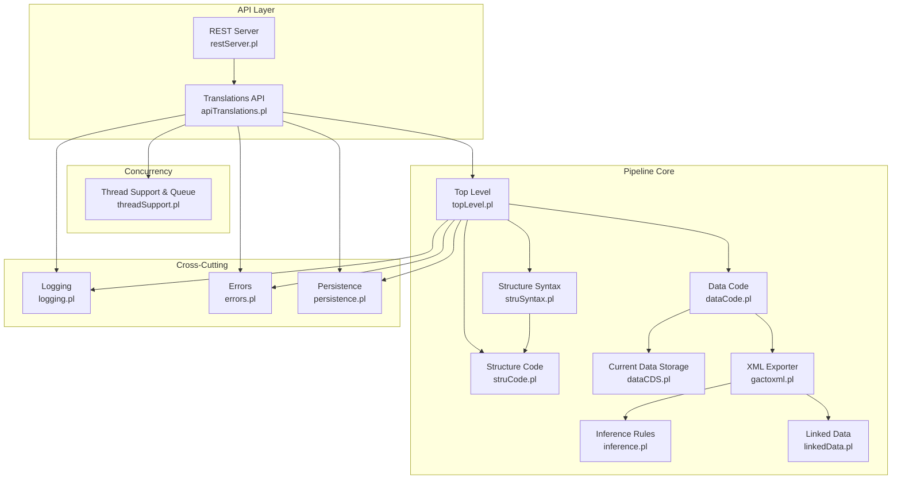
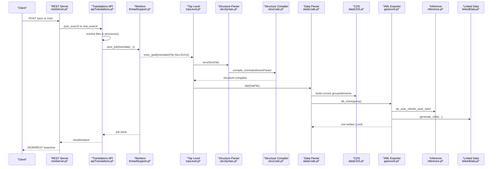
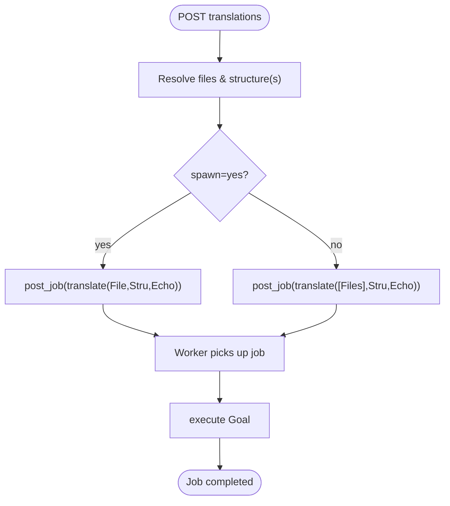
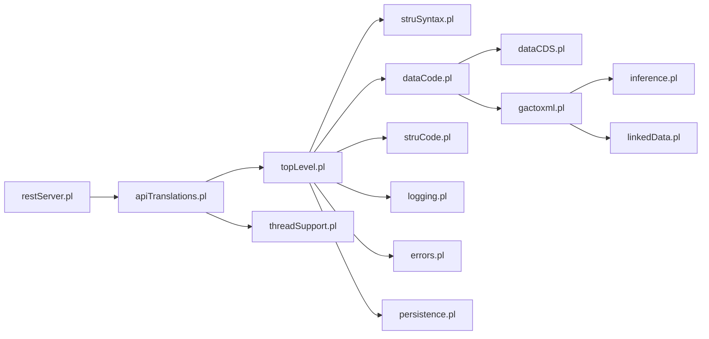

# Translation Pipeline Architecture

<cite>
**Referenced Files in This Document**
- [topLevel.pl](file://src/topLevel.pl)
- [struSyntax.pl](file://src/struSyntax.pl)
- [struCode.pl](file://src/struCode.pl)
- [dataCode.pl](file://src/dataCode.pl)
- [dataCDS.pl](file://src/dataCDS.pl)
- [gactoxml.pl](file://src/gactoxml.pl)
- [inference.pl](file://src/inference.pl)
- [linkedData.pl](file://src/linkedData.pl)
- [apiTranslations.pl](file://src/apiTranslations.pl)
- [threadSupport.pl](file://src/threadSupport.pl)
- [restServer.pl](file://src/restServer.pl)
- [logging.pl](file://src/logging.pl)
- [errors.pl](file://src/errors.pl)
- [persistence.pl](file://src/persistence.pl)
</cite>

## Table of Contents
1. [Introduction](#introduction)
2. [Project Structure](#project-structure)
3. [Core Components](#core-components)
4. [Architecture Overview](#architecture-overview)
5. [Detailed Component Analysis](#detailed-component-analysis)
6. [Dependency Analysis](#dependency-analysis)
7. [Performance Considerations](#performance-considerations)
8. [Troubleshooting Guide](#troubleshooting-guide)
9. [Conclusion](#conclusion)

## Introduction
This document explains the Kleio translation pipeline from source files to XML output. It covers schema validation, syntax analysis, semantic compilation, normalization, inference processing, and XML generation. It also documents parallel job execution, queuing, performance tuning, debugging, logging, monitoring, and linked data integration.

## Project Structure
The pipeline is implemented as a set of Prolog modules:
- Top-level orchestration for structure and data processing
- Schema (structure) parser and compiler
- Data parser and semantic actions
- Exporter that generates XML and performs inference
- REST/JSON-RPC API and worker pool for concurrency
- Logging, error reporting, persistence utilities, and linked data support

**Diagram sources**
- [restServer.pl](file://src/restServer.pl)
- [apiTranslations.pl](file://src/apiTranslations.pl)
- [threadSupport.pl](file://src/threadSupport.pl)
- [topLevel.pl](file://src/topLevel.pl)
- [struSyntax.pl](file://src/struSyntax.pl)
- [struCode.pl](file://src/struCode.pl)
- [dataCode.pl](file://src/dataCode.pl)
- [dataCDS.pl](file://src/dataCDS.pl)
- [gactoxml.pl](file://src/gactoxml.pl)
- [inference.pl](file://src/inference.pl)
- [linkedData.pl](file://src/linkedData.pl)
- [logging.pl](file://src/logging.pl)
- [errors.pl](file://src/errors.pl)
- [persistence.pl](file://src/persistence.pl)

**Section sources**
- [restServer.pl](file://src/restServer.pl)
- [apiTranslations.pl](file://src/apiTranslations.pl)
- [threadSupport.pl](file://src/threadSupport.pl)
- [topLevel.pl](file://src/topLevel.pl)
- [struSyntax.pl](file://src/struSyntax.pl)
- [struCode.pl](file://src/struCode.pl)
- [dataCode.pl](file://src/dataCode.pl)
- [dataCDS.pl](file://src/dataCDS.pl)
- [gactoxml.pl](file://src/gactoxml.pl)
- [inference.pl](file://src/inference.pl)
- [linkedData.pl](file://src/linkedData.pl)
- [logging.pl](file://src/logging.pl)
- [errors.pl](file://src/errors.pl)
- [persistence.pl](file://src/persistence.pl)

## Core Components
- Top-level driver: initializes environment, reads input, tokenizes, parses, and invokes semantic actions.
- Structure compiler: validates and compiles Kleio schema definitions into an internal dictionary.
- Data compiler: parses Kleio data against the compiled schema, builds a Current Data Storage (CDS), and triggers export callbacks.
- XML exporter: writes KLEIO XML, manages IDs, processes same-as linking, and coordinates inference and linked data.
- Inference engine: applies rule-based relations and attributes derived from context and schema.
- Linked data: resolves annotations to external URIs using declared patterns.
- API and workers: expose REST/JSON-RPC endpoints, queue jobs, and execute translations concurrently.
- Cross-cutting: logging, errors, and shared state management.

**Section sources**
- [topLevel.pl](file://src/topLevel.pl)
- [struSyntax.pl](file://src/struSyntax.pl)
- [struCode.pl](file://src/struCode.pl)
- [dataCode.pl](file://src/dataCode.pl)
- [dataCDS.pl](file://src/dataCDS.pl)
- [gactoxml.pl](file://src/gactoxml.pl)
- [inference.pl](file://src/inference.pl)
- [linkedData.pl](file://src/linkedData.pl)
- [apiTranslations.pl](file://src/apiTranslations.pl)
- [threadSupport.pl](file://src/threadSupport.pl)
- [restServer.pl](file://src/restServer.pl)
- [logging.pl](file://src/logging.pl)
- [errors.pl](file://src/errors.pl)
- [persistence.pl](file://src/persistence.pl)

## Architecture Overview
End-to-end flow from request to XML output:

**Diagram sources**
- [restServer.pl](file://src/restServer.pl)
- [apiTranslations.pl](file://src/apiTranslations.pl)
- [threadSupport.pl](file://src/threadSupport.pl)
- [topLevel.pl](file://src/topLevel.pl)
- [struSyntax.pl](file://src/struSyntax.pl)
- [struCode.pl](file://src/struCode.pl)
- [dataCode.pl](file://src/dataCode.pl)
- [dataCDS.pl](file://src/dataCDS.pl)
- [gactoxml.pl](file://src/gactoxml.pl)
- [inference.pl](file://src/inference.pl)
- [linkedData.pl](file://src/linkedData.pl)

## Detailed Component Analysis

### Top-Level Orchestration
- Initializes counters, reports, and values; dispatches structure vs data processing.
- readlines/2 drives lexical analysis and parsing per line.
- processLine/2 routes tokens to compile_data or command compilation.

Key responsibilities:
- File I/O setup and report preparation
- Lexical scanning and tokenization
- Parsing and execution hooks

**Section sources**
- [topLevel.pl](file://src/topLevel.pl)

### Structure Compilation (Schema Validation and Normalization)
- struSyntax.pl defines DCG grammar for structure commands and parameters.
- struCode.pl executes parameter handling, completeness checks, and updates the data dictionary.
- The result is a normalized internal representation used by the data parser and exporter.

Highlights:
- Command recognition and parameter validation
- Group and element creation with inheritance and fons/source propagation
- Generation of auxiliary JSON/YAML artifacts for structures

**Section sources**
- [struSyntax.pl](file://src/struSyntax.pl)
- [struCode.pl](file://src/struCode.pl)

### Data Parsing and Semantic Actions
- dataCode.pl orchestrates group lifecycle: newGroup, flushGroup, makeID, check_elements.
- dataCDS.pl maintains the Current Data Storage (CDS) term with fields for path, elements, entries, aspects, etc.
- On group completion, db_store is invoked to export the group.

Highlights:
- Element verification against schema
- ID generation strategies (explicit or counter-based)
- Aspect handling (core/original/comment)

**Section sources**
- [dataCode.pl](file://src/dataCode.pl)
- [dataCDS.pl](file://src/dataCDS.pl)

### XML Export and Normalization
- gactoxml.pl implements db_init/db_store/db_close and group-specific exporters.
- Writes XML header/footer, manages IDs, prefixes, and metadata.
- Integrates same-as caching and auto-relation processing.

Highlights:
- Group routing via group_export/2
- Attribute and relation serialization
- Integration with mappings and linked data

**Section sources**
- [gactoxml.pl](file://src/gactoxml.pl)

### Inference Processing
- inference.pl contains declarative rules (if ... then ...) generating relations and attributes based on context and schema.
- Auto-relations are triggered during act boundaries and at finalization.

Highlights:
- Pattern matching over sequences and ancestors
- Relation and attribute generation
- Mode selection for auto-relation strategy

**Section sources**
- [inference.pl](file://src/inference.pl)
- [gactoxml.pl](file://src/gactoxml.pl)

### Linked Data Integration
- linkedData.pl stores URL patterns and detects annotations like @shortname:id.
- gactoxml.pl calls generate_xlink to produce URIs for attributes and values.

Highlights:
- Pattern registration via link$ groups
- Annotation detection and URI templating
- Warnings when patterns are missing

**Section sources**
- [linkedData.pl](file://src/linkedData.pl)
- [gactoxml.pl](file://src/gactoxml.pl)

### API, Job Queuing, and Parallel Execution
- restServer.pl exposes REST and JSON-RPC endpoints, decodes requests, and dispatches to API modules.
- apiTranslations.pl resolves files and structures, spawns work, and returns job lists or status.
- threadSupport.pl provides message queue or thread pool modes, tracks queued/processing jobs, and executes goals.

Highlights:
- spawn_work controls single-stru vs multi-stru batching
- translate/3 wraps clio_init, stru, and dat with mutex synchronization
- Status APIs reflect queued/processing states and timestamps

**Diagram sources**
- [apiTranslations.pl](file://src/apiTranslations.pl)
- [threadSupport.pl](file://src/threadSupport.pl)
- [restServer.pl](file://src/restServer.pl)

**Section sources**
- [restServer.pl](file://src/restServer.pl)
- [apiTranslations.pl](file://src/apiTranslations.pl)
- [threadSupport.pl](file://src/threadSupport.pl)

### Error Handling and Reporting
- errors.pl centralizes error/warning emission, counts, and continuation control.
- Reports include file, line numbers, and surrounding lines for context.
- top-level loops stop when max errors reached.

**Section sources**
- [errors.pl](file://src/errors.pl)
- [topLevel.pl](file://src/topLevel.pl)

### Logging and Monitoring
- logging.pl provides structured log levels, file output, and configuration.
- restServer.pl prints server config and activity; apiTranslations.pl logs job details.
- Status APIs expose queued/processing times and translation outcomes.

**Section sources**
- [logging.pl](file://src/logging.pl)
- [restServer.pl](file://src/restServer.pl)
- [apiTranslations.pl](file://src/apiTranslations.pl)

### Persistence and Shared State
- persistence.pl offers thread-local values and shared properties with mutex protection.
- Used for global settings, job tracking, and cross-module communication.

**Section sources**
- [persistence.pl](file://src/persistence.pl)

## Dependency Analysis
High-level module dependencies:

**Diagram sources**
- [restServer.pl](file://src/restServer.pl)
- [apiTranslations.pl](file://src/apiTranslations.pl)
- [threadSupport.pl](file://src/threadSupport.pl)
- [topLevel.pl](file://src/topLevel.pl)
- [struSyntax.pl](file://src/struSyntax.pl)
- [struCode.pl](file://src/struCode.pl)
- [dataCode.pl](file://src/dataCode.pl)
- [dataCDS.pl](file://src/dataCDS.pl)
- [gactoxml.pl](file://src/gactoxml.pl)
- [inference.pl](file://src/inference.pl)
- [linkedData.pl](file://src/linkedData.pl)
- [logging.pl](file://src/logging.pl)
- [errors.pl](file://src/errors.pl)
- [persistence.pl](file://src/persistence.pl)

**Section sources**
- [restServer.pl](file://src/restServer.pl)
- [apiTranslations.pl](file://src/apiTranslations.pl)
- [threadSupport.pl](file://src/threadSupport.pl)
- [topLevel.pl](file://src/topLevel.pl)
- [struSyntax.pl](file://src/struSyntax.pl)
- [struCode.pl](file://src/struCode.pl)
- [dataCode.pl](file://src/dataCode.pl)
- [dataCDS.pl](file://src/dataCDS.pl)
- [gactoxml.pl](file://src/gactoxml.pl)
- [inference.pl](file://src/inference.pl)
- [linkedData.pl](file://src/linkedData.pl)
- [logging.pl](file://src/logging.pl)
- [errors.pl](file://src/errors.pl)
- [persistence.pl](file://src/persistence.pl)

## Performance Considerations
- Concurrency mode: choose between message queue and thread pool via pool_mode.
- Worker count: configure via environment variable for REST server workers.
- Single vs multiple structures: spawn=no batches files under one stru; spawn=yes distributes per-file jobs.
- Mutex usage: stru and dat processing are synchronized per resource to avoid race conditions.
- Caching: translation status cache reduces repeated computations for large sets.

[No sources needed since this section provides general guidance]

## Troubleshooting Guide
- Enable detailed logging and set appropriate log level.
- Inspect .rpt and .err files generated alongside translated sources.
- Use status APIs to determine if files are queued, processing, or translated.
- Check server home page for live activity and configuration summary.
- Validate linked data patterns and annotations when links are missing.

**Section sources**
- [logging.pl](file://src/logging.pl)
- [apiTranslations.pl](file://src/apiTranslations.pl)
- [restServer.pl](file://src/restServer.pl)
- [gactoxml.pl](file://src/gactoxml.pl)
- [linkedData.pl](file://src/linkedData.pl)

## Conclusion
The Kleio translation pipeline integrates schema validation, robust parsing, semantic actions, inference, and XML export within a concurrent, API-driven architecture. Its modular design enables clear separation of concerns, while threading and job queues provide scalability. Linked data and inference enhance expressiveness, and comprehensive logging and status APIs support operational visibility and troubleshooting.