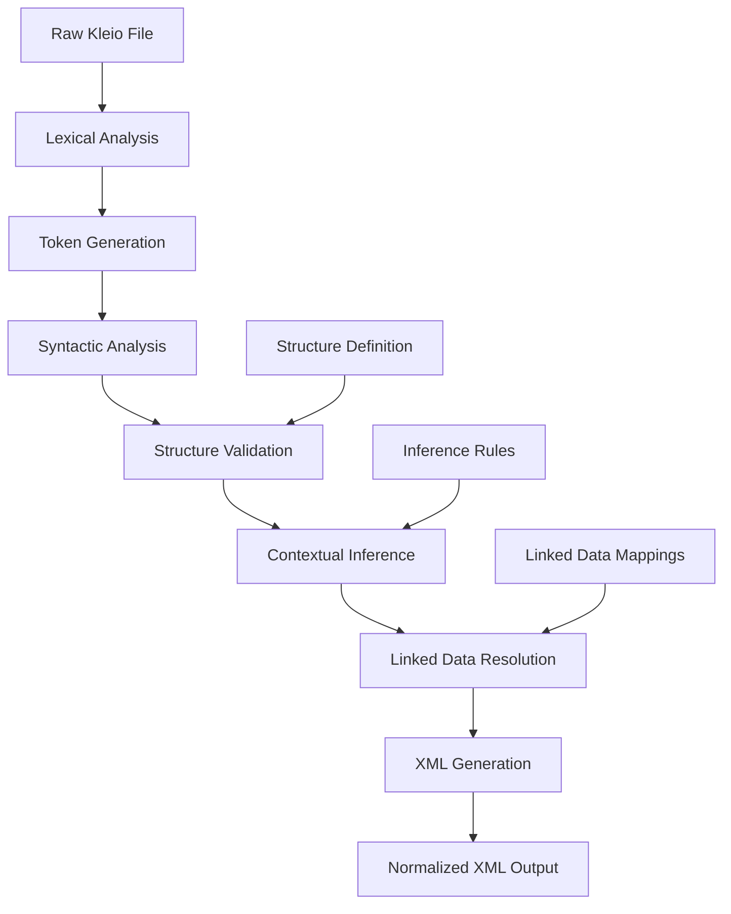

# Translation Process

<cite>
**Referenced Files in This Document**   
- [topLevel.pl](file://src/topLevel.pl)
- [dataSyntax.pl](file://src/dataSyntax.pl)
- [dataCode.pl](file://src/dataCode.pl)
- [gactoxml.pl](file://src/gactoxml.pl)
- [errors.pl](file://src/errors.pl)
- [lexical.pl](file://src/lexical.pl)
- [linkedData.pl](file://src/linkedData.pl)
</cite>

## Table of Contents
1. [Introduction](#introduction)
2. [Translation Pipeline Overview](#translation-pipeline-overview)
3. [Parsing Kleio Syntax](#parsing-kleio-syntax)
4. [Structure Definition Application](#structure-definition-application)
5. [Data Resolution and Linked Data](#data-resolution-and-linked-data)
6. [Contextual Inference Processing](#contextual-inference-processing)
7. [XML Generation Process](#xml-generation-process)
8. [Error Handling Mechanisms](#error-handling-mechanisms)
9. [Performance Considerations](#performance-considerations)
10. [Example Translation Workflow](#example-translation-workflow)

## Introduction
The translation process in Timelink-Kleio transforms raw Kleio (.cli) files into normalized XML output through a systematic pipeline of parsing, structural validation, contextual inference, and rule-based processing. This document details the comprehensive workflow that begins with raw Kleio syntax parsing and culminates in Timelink-compatible XML generation. The process leverages Prolog-based components to orchestrate the transformation, with the topLevel.pl module serving as the central coordinator that integrates parsing (dataSyntax.pl), code generation (dataCode.pl), and XML output (gactoxml.pl). The translation engine applies structure definitions, resolves linked data, performs contextual inferences, and generates properly normalized XML with entity linking, following the architectural principles of the Timelink system.

**Section sources**
- [topLevel.pl](file://src/topLevel.pl#L1-L286)
- [gactoxml.pl](file://src/gactoxml.pl#L1-L800)

## Translation Pipeline Overview
The translation process follows a structured pipeline that transforms Kleio source files into normalized XML through multiple coordinated stages. The workflow begins with the initialization of the translation environment through clio_init/0, which sets up error counters and configuration parameters. The pipeline then processes structure definition files (.str or .yaml) using the stru/1 predicate, which parses and validates the structural schema before handling the actual data files through the dat/1 predicate. During data processing, the system performs lexical analysis to tokenize input, syntactic analysis to validate structure compliance, and semantic processing to extract meaningful data elements. The translation engine maintains a Current Data Structure (CDS) as an intermediate representation, which accumulates parsed data until complete groups are ready for final processing. The pipeline concludes with XML generation through the gactoxml.pl module, which converts the processed data into Timelink-compatible XML format with proper entity relationships and normalization. Throughout this process, the system maintains context through thread-local properties and ensures data integrity through validation at multiple stages.

**Diagram sources**
- [topLevel.pl](file://src/topLevel.pl#L1-L286)
- [dataSyntax.pl](file://src/dataSyntax.pl#L1-L194)
- [gactoxml.pl](file://src/gactoxml.pl#L1-L800)

**Section sources**
- [topLevel.pl](file://src/topLevel.pl#L1-L286)
- [dataSyntax.pl](file://src/dataSyntax.pl#L1-L194)

## Parsing Kleio Syntax
The parsing of Kleio syntax begins with lexical analysis performed by the lexical.pl module, which transforms character streams into meaningful tokens. The get_tokens/3 predicate processes input characters according to their type (letter, digit, space, etc.) and groups them into tokens such as names, numbers, fill spaces, and data flags. Data flags like dollar sign ($), slash (/), equal (=), and semicolon (;) serve as structural markers in Kleio syntax, with their specific meanings defined in the data_flag/2 predicates. The parser handles special constructs including single quotes, double quotes for literal strings, and triple quotes for multiline content. During syntactic analysis in dataSyntax.pl, the compile_data/1 predicate processes token streams through definite clause grammars (DCGs) that recognize Kleio language constructs like groups, elements, aspects, and entries. The parser maintains state through the Current Data Structure (CDS), storing core information, original wording, and comments in separate fields based on the current aspect. Error recovery mechanisms allow the parser to continue processing after encountering syntax errors, while maintaining accurate line number tracking for error reporting.

**Section sources**
- [lexical.pl](file://src/lexical.pl#L1-L492)
- [dataSyntax.pl](file://src/dataSyntax.pl#L1-L194)

## Structure Definition Application
Structure definition application occurs through the stru/1 predicate in topLevel.pl, which processes Kleio structure files (.str or .yaml) to establish the schema for subsequent data processing. When a structure file is processed, the system parses group definitions, element loci, and inheritance relationships that form the structural framework for validating data files. The structure processor creates internal representations of groups and their elements, including certe (required), locus (ordered), and ceteri (optional) element lists that define structural constraints. These definitions are stored in the data dictionary and used during data file processing to validate element names and enforce structural rules. The updatePath/4 predicate in dataCode.pl implements hierarchical path management, linking new groups to the current path based on containment relationships defined in the structure. When processing data files, the verify_element/1 predicate checks that each encountered element belongs to the current group's definition, issuing warnings for unrecognized elements. The system supports abstract groups in structure definitions, allowing concrete person groups to extend abstract male or female templates, which enables gender-specific validation and inference processing during translation.

**Section sources**
- [topLevel.pl](file://src/topLevel.pl#L102-L130)
- [dataCode.pl](file://src/dataCode.pl#L200-L269)

## Data Resolution and Linked Data
Data resolution and linked data processing are handled through the linkedData.pl module, which implements mechanisms for connecting Kleio data to external knowledge sources. The system supports linked data through special group definitions that specify external data sources using the link$ construct, which associates a short name with a URL pattern containing a placeholder ($1) for specific identifiers. During translation, the detect_xlink/3 predicate identifies annotations in the form @shortName:id within element values, extracting both the data source identifier and the specific item ID. The generate_xlink/4 predicate then combines these components with the stored URL pattern to create complete URIs for linked data items. These resolved links are incorporated into the XML output, enabling integration with external knowledge bases like Wikidata. The system maintains a dynamic registry of linked data patterns through thread-local xlink_pattern/2 predicates, allowing multiple external sources to be defined within a single translation session. Error handling includes warnings when attempting to link to undefined data sources, ensuring that linked data references are properly declared before use.

**Section sources**
- [linkedData.pl](file://src/linkedData.pl#L1-L116)
- [gactoxml.pl](file://src/gactoxml.pl#L774-L798)

## Contextual Inference Processing
Contextual inference processing is implemented through the inference.pl module and integrated into the translation pipeline via the gactoxml.pl export module. The system performs automatic relation generation based on the hierarchical path of processed groups, with the do_auto_rels/1 predicate calculating kinship and other relationships when moving up the group hierarchy. The save_group_path/3 predicate maintains a record of the current processing path with assigned IDs, enabling relationship inference between entities in different groups. The set_autorel_mode/1 predicate allows selection between different inference methodologies, including rule-based processing from external files. During person processing, the infer_sex/2 predicate determines gender based on the person group's inheritance from abstract male or female templates, enabling gender-appropriate relationship generation. Attribute caching through assert/1 predicates stores information for later inference processing, while the process_function_in_act/2 predicate handles role-based inferences when entities appear within act contexts. The inference system operates on the principle of generating relationships automatically based on structural position and group semantics, reducing the need for explicit relationship declarations in the source data.

**Section sources**
- [gactoxml.pl](file://src/gactoxml.pl#L346-L355)
- [inference.pl](file://src/inference.pl#L1-L100)

## XML Generation Process
The XML generation process is orchestrated by the gactoxml.pl module, which implements the db_store/0 predicate called by the translation engine when a complete group has been processed. This export module transforms the Current Data Structure (CDS) into Timelink-compatible XML through a series of specialized group processors that handle different entity types. The group_export/2 predicate acts as a dispatch mechanism, routing processing to specific handlers based on group inheritance (e.g., person_export/2 for persons, historical_act_export/2 for acts). Each processor extracts relevant data from the CDS, applies necessary transformations, and generates XML elements with appropriate attributes including IDs, dates, and type information. The system handles special cases like authority registers, historical sources, and geoentities through dedicated export functions. During finalization in db_close/0, the system performs post-processing tasks including automatic relationship generation, linked data resolution, and file management. The generated XML includes metadata about the translation process, source files, and structure definitions, ensuring provenance tracking and reproducibility. The output is written to a .xml file with proper encoding and formatting, while auxiliary files (.ids, .err, .rpt) are created for debugging and auditing purposes.

**Section sources**
- [gactoxml.pl](file://src/gactoxml.pl#L333-L800)
- [dataCode.pl](file://src/dataCode.pl#L69-L70)

## Error Handling Mechanisms
Error handling is implemented through the errors.pl module, which provides comprehensive mechanisms for detecting, reporting, and managing translation errors. The system distinguishes between errors and warnings, with errors potentially terminating translation when the maximum count (default 10) is reached. The error_out/1 and error_out/2 predicates generate detailed error messages that include the source file, line number, and surrounding context to aid debugging. Warning messages through warning_out/1 allow non-critical issues to be reported without stopping translation. The check_continuation/0 predicate monitors error counts and aborts processing when limits are exceeded, preventing cascading failures from severe structural problems. Context information including line numbers and text is preserved through get_prop/2 and set_prop/2 predicates, ensuring accurate error positioning. The perror_count/0 predicate summarizes error and warning statistics at translation completion. Specific error conditions include structure mismatches (unrecognized elements), syntax errors (invalid tokens), and semantic errors (invalid data relationships). The system also handles file operation errors during output generation, with appropriate fallbacks and reporting.

**Section sources**
- [errors.pl](file://src/errors.pl#L1-L220)
- [dataCode.pl](file://src/dataCode.pl#L140-L153)

## Performance Considerations
Performance optimization in the translation process focuses on efficient data structures, incremental processing, and resource management. The Current Data Structure (CDS) uses Prolog records for efficient field access and updates, minimizing memory overhead during parsing. The translation engine processes files line-by-line rather than loading entire files into memory, enabling handling of large documents with limited RAM usage. Path optimization in updatePath/4 minimizes unnecessary backtracking through precedence rules for group containment. The system caches frequently accessed data such as character types and data flags to avoid repeated computation. For large-scale translations, the modular architecture allows parallel processing of independent files, while the use of thread-local storage enables concurrent translations in multi-user environments. Performance bottlenecks typically occur in XML generation and linked data resolution, which can be optimized by batching operations and using efficient string handling. The system includes profiling hooks (commented in dat/1) that can be activated to identify performance-critical sections. Memory usage is managed through careful cleanup of temporary data structures and proper file handling to prevent resource leaks during long-running translation sessions.

**Section sources**
- [dataCode.pl](file://src/dataCode.pl#L87-L97)
- [gactoxml.pl](file://src/gactoxml.pl#L130-L167)

## Example Translation Workflow
An example translation workflow demonstrates the complete process from raw Kleio input to normalized XML output. Starting with a baptism record in b1685.cli, the system first processes the associated structure file (baptismos.str) through stru/1, establishing the schema with groups for baptism, person, father, mother, etc. When processing the data file through dat/1, the lexical analyzer tokenizes lines into components like "baptism$1" (group), "date=24/5/1958" (element), and "child$name=João" (nested element). The syntactic analyzer validates these against the structure definition, creating appropriate CDS entries. Contextual inference automatically generates relationships between the child and parents based on their structural position within the baptism act. Linked data annotations like "@wikidata:Q123" are resolved to full URIs using predefined patterns. Finally, the gactoxml.pl module generates XML with proper hierarchy, IDs, and metadata, producing output where the baptism act contains properly linked person entities with attributes and relationships. Error handling captures any structure mismatches, such as unrecognized elements, providing detailed line-by-line reporting for correction.

**Section sources**
- [topLevel.pl](file://src/topLevel.pl#L141-L159)
- [gactoxml.pl](file://src/gactoxml.pl#L686-L720)