# Translation Workflow

<cite>
**Referenced Files in This Document**
- [apiTranslations.pl](file://src/apiTranslations.pl)
- [threadSupport.pl](file://src/threadSupport.pl)
- [topLevel.pl](file://src/topLevel.pl)
- [struSyntax.pl](file://src/struSyntax.pl)
- [struCode.pl](file://src/struCode.pl)
- [dataSyntax.pl](file://src/dataSyntax.pl)
- [dataCode.pl](file://src/dataCode.pl)
- [dataDictionary.pl](file://src/dataDictionary.pl)
- [mappings.pl](file://src/mappings.pl)
- [inference.pl](file://src/inference.pl)
- [linkedData.pl](file://src/linkedData.pl)
- [clioPP.pl](file://src/clioPP.pl)
- [persistence.pl](file://src/persistence.pl)
- [baptismos.yaml](file://src/stru/gacto2.str)
- [baptismos.cli](file://tests/kleio-home/sources/reference_sources/paroquiais/baptismos/bapt1714.cli)
</cite>

## Table of Contents
1. [Introduction](#introduction)
2. [Project Structure](#project-structure)
3. [Core Components](#core-components)
4. [Architecture Overview](#architecture-overview)
5. [Detailed Component Analysis](#detailed-component-analysis)
6. [Dependency Analysis](#dependency-analysis)
7. [Performance Considerations](#performance-considerations)
8. [Troubleshooting Guide](#troubleshooting-guide)
9. [Conclusion](#conclusion)

## Introduction
This document explains the end-to-end translation workflow that transforms raw Kleio input into structured, validated, mapped, and inferred outputs. It covers the complete pipeline from parsing Kleio structure and data files, through validation and mapping, to inference and linked data enrichment, culminating in final exports and reporting. The document also details concurrency, caching, error handling, and performance considerations for batch and scalable translation processing.

## Project Structure
The translation engine is implemented in layered modules:
- API orchestration and job management
- File-level processing (structure and data)
- Lexical and syntactic parsing
- Intermediate representation and validation
- Mapping and inference engines
- Linked data integration
- Export and pretty-print utilities
- Persistence and threading support

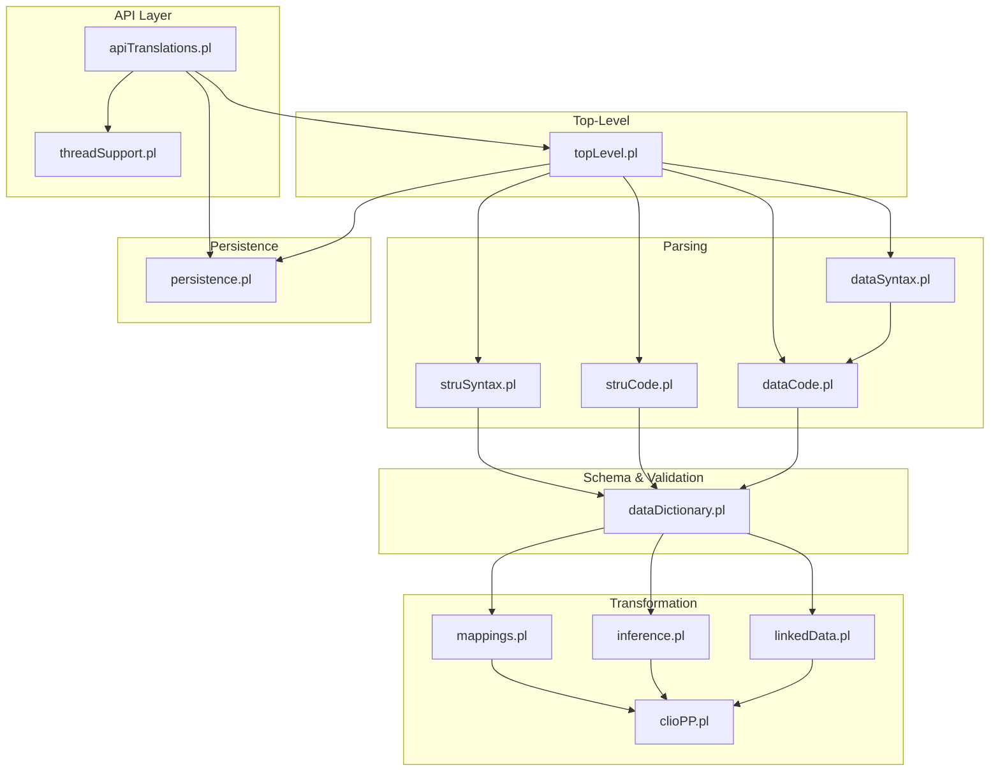

**Diagram sources**
- [apiTranslations.pl](file://src/apiTranslations.pl#L34-L82)
- [threadSupport.pl](file://src/threadSupport.pl#L41-L62)
- [topLevel.pl](file://src/topLevel.pl#L102-L160)
- [struSyntax.pl](file://src/struSyntax.pl#L48-L58)
- [struCode.pl](file://src/struCode.pl#L64-L94)
- [dataSyntax.pl](file://src/dataSyntax.pl#L57-L62)
- [dataCode.pl](file://src/dataCode.pl#L53-L79)
- [dataDictionary.pl](file://src/dataDictionary.pl#L118-L125)
- [mappings.pl](file://src/mappings.pl#L24-L50)
- [inference.pl](file://src/inference.pl#L36-L61)
- [linkedData.pl](file://src/linkedData.pl#L51-L66)
- [clioPP.pl](file://src/clioPP.pl#L90-L130)
- [persistence.pl](file://src/persistence.pl#L42-L61)

**Section sources**
- [apiTranslations.pl](file://src/apiTranslations.pl#L34-L82)
- [topLevel.pl](file://src/topLevel.pl#L102-L160)

## Core Components
- API orchestrator: accepts translation requests, resolves files, selects structure files, spawns jobs, and returns results.
- Parser: handles structure (.str/.yaml) and data (.cli) files via dedicated grammars.
- Schema and validation: builds an internal data dictionary and enforces structural constraints.
- Transformation: applies mapping rules and inference rules to enrich and normalize data.
- Linked data: detects and generates external URIs for cross-references.
- Export/Pretty-print: produces normalized output with explicit IDs for re-import safety.
- Concurrency and persistence: manages worker pools, queues, and shared state.

**Section sources**
- [apiTranslations.pl](file://src/apiTranslations.pl#L34-L82)
- [topLevel.pl](file://src/topLevel.pl#L102-L160)
- [dataDictionary.pl](file://src/dataDictionary.pl#L118-L125)
- [mappings.pl](file://src/mappings.pl#L24-L50)
- [inference.pl](file://src/inference.pl#L36-L61)
- [linkedData.pl](file://src/linkedData.pl#L51-L66)
- [clioPP.pl](file://src/clioPP.pl#L90-L130)
- [threadSupport.pl](file://src/threadSupport.pl#L41-L62)
- [persistence.pl](file://src/persistence.pl#L42-L61)

## Architecture Overview
The translation workflow is a multi-stage pipeline:
1. Request ingestion and job distribution
2. Structure processing (schema compilation)
3. Data processing (syntax parsing, validation, storage)
4. Mapping and inference
5. Linked data enrichment
6. Export and pretty-print
7. Reporting and status updates

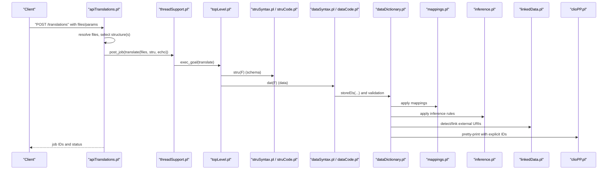

**Diagram sources**
- [apiTranslations.pl](file://src/apiTranslations.pl#L52-L82)
- [threadSupport.pl](file://src/threadSupport.pl#L109-L124)
- [topLevel.pl](file://src/topLevel.pl#L102-L160)
- [struSyntax.pl](file://src/struSyntax.pl#L48-L58)
- [struCode.pl](file://src/struCode.pl#L64-L94)
- [dataSyntax.pl](file://src/dataSyntax.pl#L57-L62)
- [dataCode.pl](file://src/dataCode.pl#L53-L79)
- [dataDictionary.pl](file://src/dataDictionary.pl#L118-L125)
- [mappings.pl](file://src/mappings.pl#L24-L50)
- [inference.pl](file://src/inference.pl#L36-L61)
- [linkedData.pl](file://src/linkedData.pl#L51-L66)
- [clioPP.pl](file://src/clioPP.pl#L90-L130)

## Detailed Component Analysis

### 1) API Orchestration and Job Management
- Accepts translation requests, validates permissions, resolves source paths, and enumerates files (including recursion).
- Selects structure files per file or defaults, and spawns jobs:
  - Parallel mode: distributes individual files to workers.
  - Single-stratum mode: processes multiple files with a single structure file once.
- Provides status queries with caching and filtering, and supports cleaning translation artifacts.

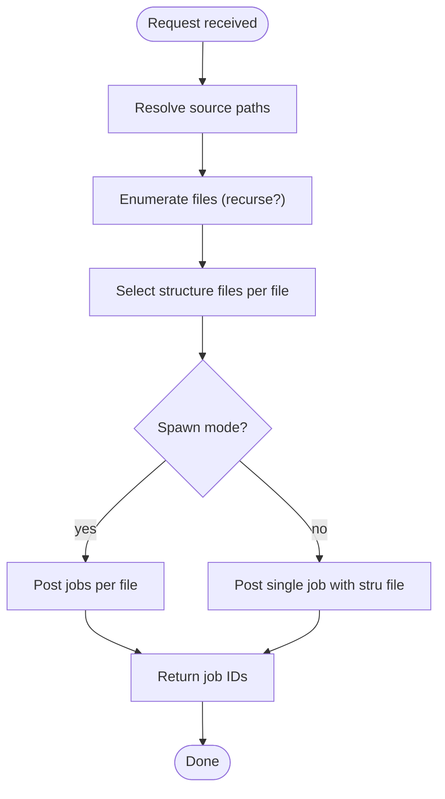

**Diagram sources**
- [apiTranslations.pl](file://src/apiTranslations.pl#L52-L82)
- [apiTranslations.pl](file://src/apiTranslations.pl#L241-L253)
- [apiTranslations.pl](file://src/apiTranslations.pl#L295-L306)

**Section sources**
- [apiTranslations.pl](file://src/apiTranslations.pl#L52-L82)
- [apiTranslations.pl](file://src/apiTranslations.pl#L241-L253)
- [apiTranslations.pl](file://src/apiTranslations.pl#L295-L306)
- [apiTranslations.pl](file://src/apiTranslations.pl#L168-L232)

### 2) Structure Processing (Schema Compilation)
- Reads .str or .yaml structure files and compiles commands into an internal schema representation.
- Uses a DCG grammar to parse commands, enforce parameter completeness, and store properties locally and globally.
- Generates JSON/YAML schema derivatives and documentation.

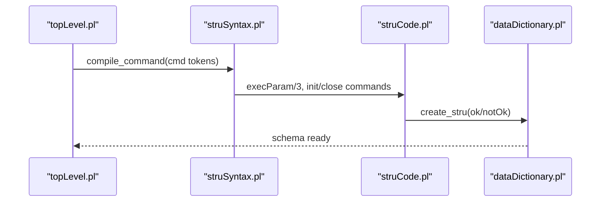

**Diagram sources**
- [topLevel.pl](file://src/topLevel.pl#L102-L130)
- [struSyntax.pl](file://src/struSyntax.pl#L48-L58)
- [struCode.pl](file://src/struCode.pl#L105-L118)
- [dataDictionary.pl](file://src/dataDictionary.pl#L118-L125)

**Section sources**
- [topLevel.pl](file://src/topLevel.pl#L102-L130)
- [struSyntax.pl](file://src/struSyntax.pl#L48-L58)
- [struCode.pl](file://src/struCode.pl#L105-L118)
- [dataDictionary.pl](file://src/dataDictionary.pl#L118-L125)

### 3) Data Processing (Syntax Parsing and Validation)
- Initializes per-file state, resets counters, and opens the data file.
- Lexical analysis converts lines into typed tokens; a DCG grammar parses groups, elements, aspects, and entries.
- Stores parsed constructs into an intermediate CDS (current data structure) and flushes groups to the database on completion.
- Enforces structural constraints (e.g., required elements marked as “certain”) and reports errors.

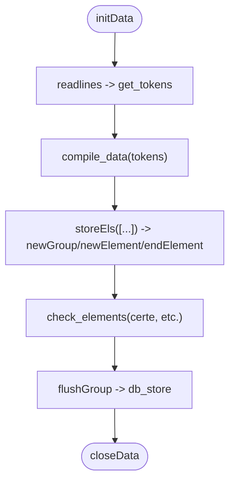

**Diagram sources**
- [topLevel.pl](file://src/topLevel.pl#L139-L160)
- [dataSyntax.pl](file://src/dataSyntax.pl#L57-L62)
- [dataSyntax.pl](file://src/dataSyntax.pl#L65-L111)
- [dataCode.pl](file://src/dataCode.pl#L53-L79)
- [dataCode.pl](file://src/dataCode.pl#L115-L152)

**Section sources**
- [topLevel.pl](file://src/topLevel.pl#L139-L160)
- [dataSyntax.pl](file://src/dataSyntax.pl#L57-L62)
- [dataSyntax.pl](file://src/dataSyntax.pl#L65-L111)
- [dataCode.pl](file://src/dataCode.pl#L53-L79)
- [dataCode.pl](file://src/dataCode.pl#L115-L152)

### 4) Mapping Rules Engine
- Defines mappings between Kleio classes and relational schema attributes.
- Supports class hierarchies, table assignments, and column metadata.
- Applied during data storage to normalize and align entities to target tables.

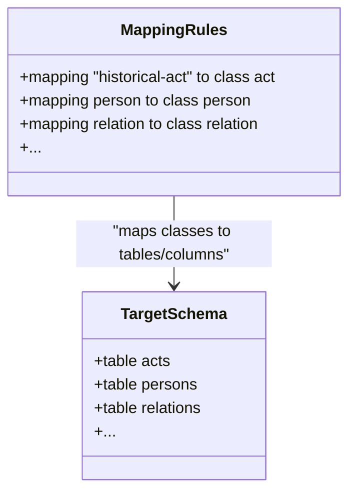

**Diagram sources**
- [mappings.pl](file://src/mappings.pl#L24-L50)
- [mappings.pl](file://src/mappings.pl#L121-L135)
- [mappings.pl](file://src/mappings.pl#L160-L175)

**Section sources**
- [mappings.pl](file://src/mappings.pl#L24-L50)
- [mappings.pl](file://src/mappings.pl#L121-L135)
- [mappings.pl](file://src/mappings.pl#L160-L175)

### 5) Inference Engine
- Encodes domain-specific inference rules to derive relations and attributes automatically.
- Uses path expressions over group sequences and group names to trigger actions (e.g., parent-child, marriage, marital status).
- Supports chaining actions and scoping.

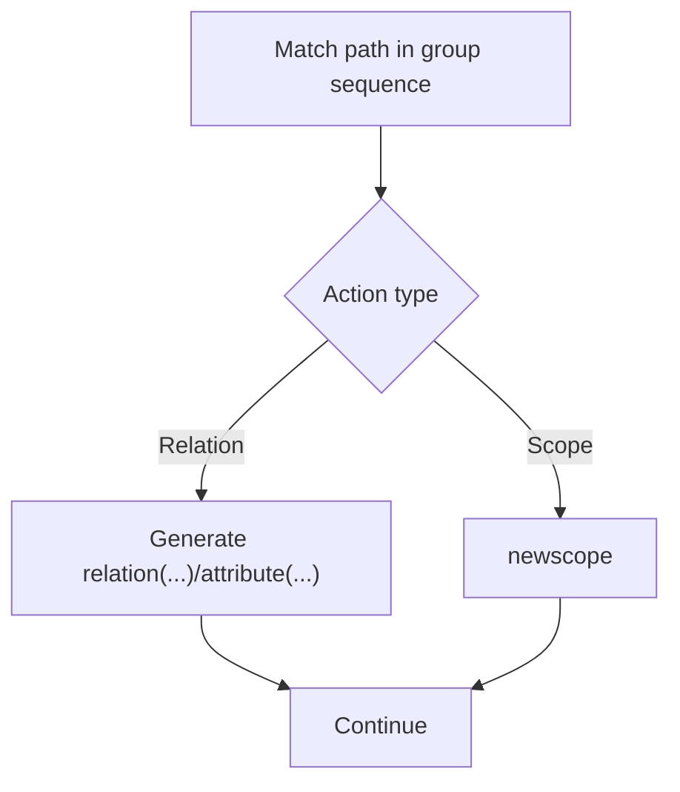

**Diagram sources**
- [inference.pl](file://src/inference.pl#L36-L61)
- [inference.pl](file://src/inference.pl#L107-L134)
- [inference.pl](file://src/inference.pl#L229-L234)

**Section sources**
- [inference.pl](file://src/inference.pl#L36-L61)
- [inference.pl](file://src/inference.pl#L107-L134)
- [inference.pl](file://src/inference.pl#L229-L234)

### 6) Linked Data Integration
- Declares external link patterns (e.g., Wikidata) and detects annotations in comments.
- Generates URIs by substituting placeholders and warns when patterns are missing.

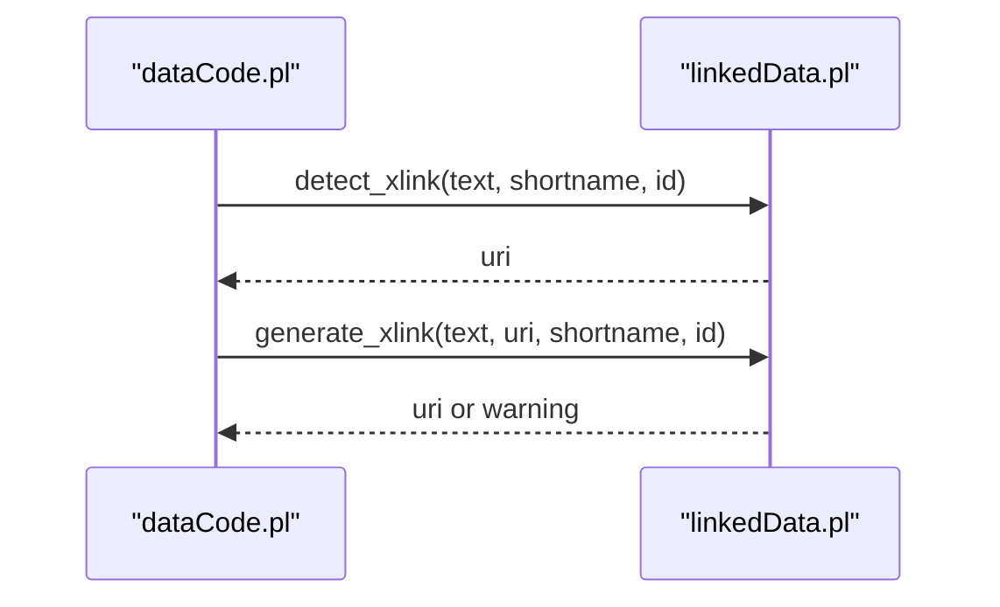

**Diagram sources**
- [linkedData.pl](file://src/linkedData.pl#L73-L78)
- [linkedData.pl](file://src/linkedData.pl#L96-L108)

**Section sources**
- [linkedData.pl](file://src/linkedData.pl#L73-L78)
- [linkedData.pl](file://src/linkedData.pl#L96-L108)

### 7) Export and Pretty-Print
- Produces a normalized copy of the input with explicit IDs to ensure deterministic re-import.
- Handles multi-entry separators and preserves textual aspects.

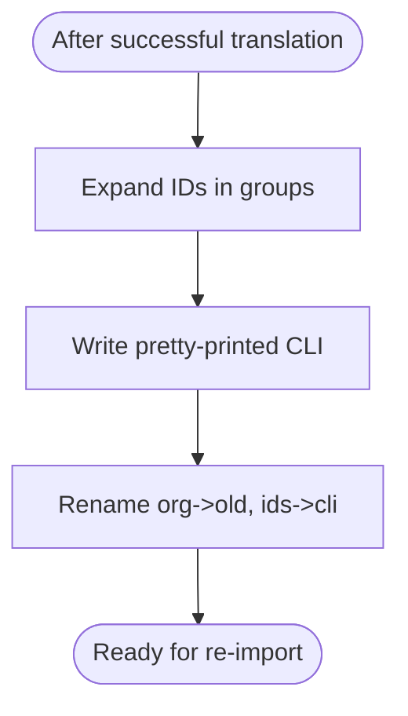

**Diagram sources**
- [clioPP.pl](file://src/clioPP.pl#L90-L130)
- [clioPP.pl](file://src/clioPP.pl#L132-L134)

**Section sources**
- [clioPP.pl](file://src/clioPP.pl#L90-L130)
- [clioPP.pl](file://src/clioPP.pl#L132-L134)

### 8) Multi-Stage Processing and State Management
- Uses thread-local and shared properties to track file states, queued and processing jobs, and per-thread values.
- Ensures synchronization around structure and data file processing.

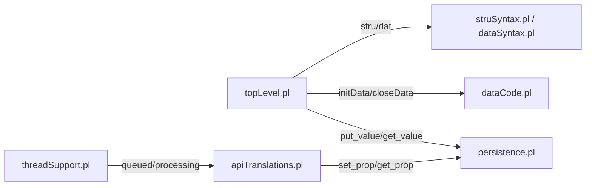

**Diagram sources**
- [persistence.pl](file://src/persistence.pl#L42-L61)
- [persistence.pl](file://src/persistence.pl#L131-L143)
- [threadSupport.pl](file://src/threadSupport.pl#L140-L149)
- [topLevel.pl](file://src/topLevel.pl#L139-L160)
- [dataCode.pl](file://src/dataCode.pl#L53-L79)

**Section sources**
- [persistence.pl](file://src/persistence.pl#L42-L61)
- [persistence.pl](file://src/persistence.pl#L131-L143)
- [threadSupport.pl](file://src/threadSupport.pl#L140-L149)
- [topLevel.pl](file://src/topLevel.pl#L139-L160)
- [dataCode.pl](file://src/dataCode.pl#L53-L79)

### Example: End-to-End Translation of a Single Kleio Document
- Input: a .cli file referencing a structure (e.g., gacto2.str) and containing groups like acts, persons, and attributes.
- Pipeline:
  1. API resolves the .cli and structure files.
  2. Structure file compiled into schema.
  3. Data file lexed and parsed; groups flushed and validated.
  4. Mappings applied to normalize entities.
  5. Inference rules infer relations and attributes.
  6. Linked data patterns detected and URIs generated.
  7. Pretty-print writes a normalized CLI with explicit IDs.
  8. Reports and status updated.

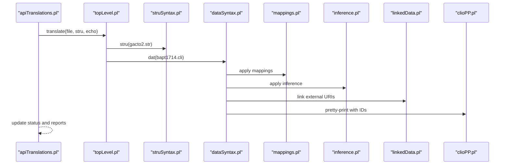

**Diagram sources**
- [apiTranslations.pl](file://src/apiTranslations.pl#L439-L455)
- [topLevel.pl](file://src/topLevel.pl#L102-L160)
- [struSyntax.pl](file://src/struSyntax.pl#L48-L58)
- [dataSyntax.pl](file://src/dataSyntax.pl#L57-L62)
- [mappings.pl](file://src/mappings.pl#L24-L50)
- [inference.pl](file://src/inference.pl#L36-L61)
- [linkedData.pl](file://src/linkedData.pl#L51-L66)
- [clioPP.pl](file://src/clioPP.pl#L90-L130)

**Section sources**
- [apiTranslations.pl](file://src/apiTranslations.pl#L439-L455)
- [topLevel.pl](file://src/topLevel.pl#L102-L160)
- [baptismos.yaml](file://src/stru/gacto2.str#L1-L200)
- [baptismos.cli](file://tests/kleio-home/sources/reference_sources/paroquiais/baptismos/bapt1714.cli#L1-L200)

## Dependency Analysis
- API depends on file resolution, thread pool, and status caching.
- Parsing depends on lexical analysis and grammar modules.
- Data storage depends on the schema dictionary and mapping/inference modules.
- Export depends on pretty-print utilities and file renaming.

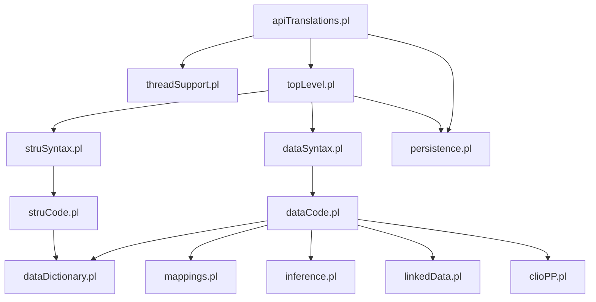

**Diagram sources**
- [apiTranslations.pl](file://src/apiTranslations.pl#L52-L82)
- [threadSupport.pl](file://src/threadSupport.pl#L41-L62)
- [topLevel.pl](file://src/topLevel.pl#L102-L160)
- [struSyntax.pl](file://src/struSyntax.pl#L48-L58)
- [struCode.pl](file://src/struCode.pl#L64-L94)
- [dataSyntax.pl](file://src/dataSyntax.pl#L57-L62)
- [dataCode.pl](file://src/dataCode.pl#L53-L79)
- [dataDictionary.pl](file://src/dataDictionary.pl#L118-L125)
- [mappings.pl](file://src/mappings.pl#L24-L50)
- [inference.pl](file://src/inference.pl#L36-L61)
- [linkedData.pl](file://src/linkedData.pl#L51-L66)
- [clioPP.pl](file://src/clioPP.pl#L90-L130)
- [persistence.pl](file://src/persistence.pl#L42-L61)

**Section sources**
- [apiTranslations.pl](file://src/apiTranslations.pl#L52-L82)
- [topLevel.pl](file://src/topLevel.pl#L102-L160)
- [dataDictionary.pl](file://src/dataDictionary.pl#L118-L125)

## Performance Considerations
- Concurrency
  - Worker pools and message queues distribute jobs across threads; choose spawn/no-spawn based on resource contention and user isolation.
  - Use thread-safe shared properties for inter-thread coordination.
- Memory management
  - Per-thread values minimize contention; shared properties guarded by mutexes.
  - CDS and intermediate buffers are flushed per group to bound memory growth.
- Scalability
  - Batch processing: process multiple files with a single structure pass in single-stratum mode to reduce repeated schema loading.
  - Caching: status cache reduces repeated directory scans and status computations.
- I/O
  - Echo mode increases report verbosity; disable for large batches.
  - Prefer streaming/reporting to avoid loading entire files into memory.

[No sources needed since this section provides general guidance]

## Troubleshooting Guide
- Structure file selection
  - If a requested structure file does not exist, the API throws an error with the offending path.
- Status queries
  - Status cache avoids frequent recomputation; invalidates after age thresholds and file counts.
- Translation artifacts
  - Use cleanup APIs to remove derived files (reports, XML, originals, old versions) for a given path or directory.
- Error reporting
  - Errors and warnings are aggregated per file and surfaced in reports; check rpt and err outputs.

**Section sources**
- [apiTranslations.pl](file://src/apiTranslations.pl#L272-L293)
- [apiTranslations.pl](file://src/apiTranslations.pl#L168-L232)
- [apiTranslations.pl](file://src/apiTranslations.pl#L723-L760)

## Conclusion
The translation workflow integrates robust parsing, schema-driven validation, mapping, inference, and linked data enrichment into a scalable, concurrent pipeline. With clear separation of concerns, persistent state management, and caching, it supports both interactive and batch translation scenarios. The pretty-print export ensures deterministic re-import, while comprehensive error reporting and status APIs enable reliable monitoring and recovery.