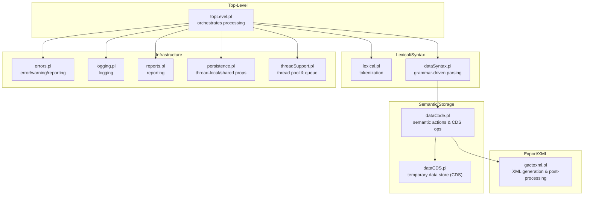
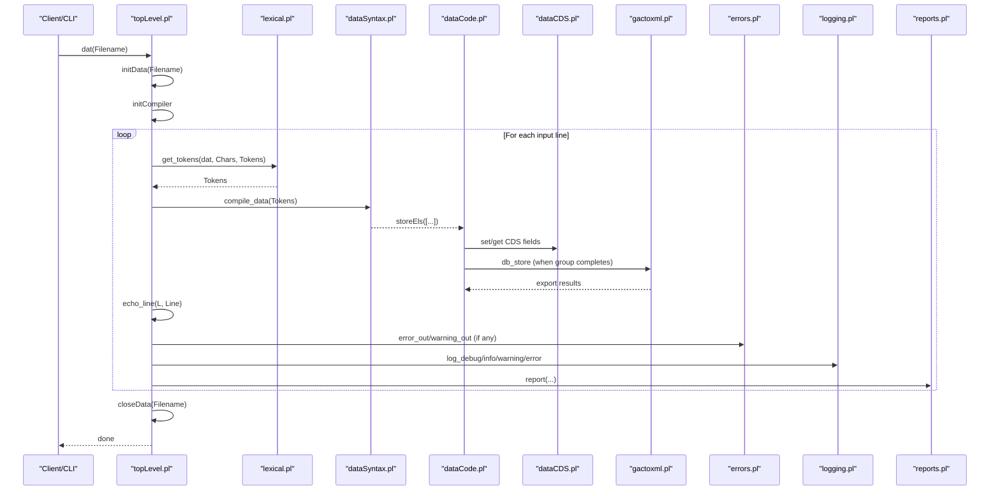
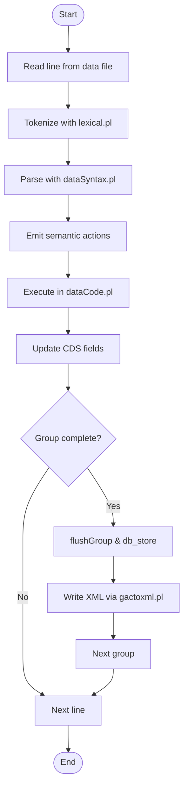
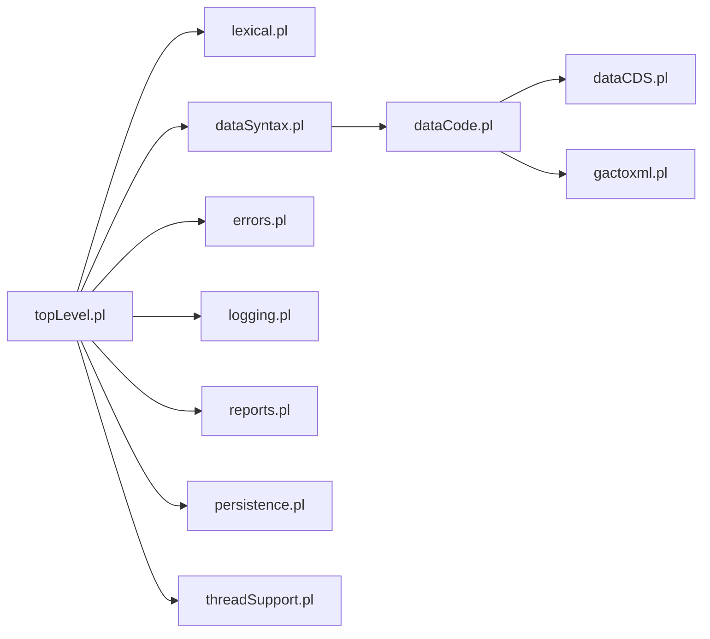

# Data Processing Pipeline

<cite>
**Referenced Files in This Document**
- [topLevel.pl](file://src/topLevel.pl)
- [lexical.pl](file://src/lexical.pl)
- [dataSyntax.pl](file://src/dataSyntax.pl)
- [dataCode.pl](file://src/dataCode.pl)
- [dataCDS.pl](file://src/dataCDS.pl)
- [gactoxml.pl](file://src/gactoxml.pl)
- [errors.pl](file://src/errors.pl)
- [logging.pl](file://src/logging.pl)
- [reports.pl](file://src/reports.pl)
- [persistence.pl](file://src/persistence.pl)
- [threadSupport.pl](file://src/threadSupport.pl)
</cite>

## Table of Contents
1. [Introduction](#introduction)
2. [Project Structure](#project-structure)
3. [Core Components](#core-components)
4. [Architecture Overview](#architecture-overview)
5. [Detailed Component Analysis](#detailed-component-analysis)
6. [Dependency Analysis](#dependency-analysis)
7. [Performance Considerations](#performance-considerations)
8. [Troubleshooting Guide](#troubleshooting-guide)
9. [Conclusion](#conclusion)

## Introduction
This document explains the end-to-end data processing pipeline in timelink-kleio, from raw Kleio input through parsing, semantic analysis, normalization, and final XML generation. It focuses on the roles of:
- dataSyntax.pl: lexical and syntactic parsing of Kleio data lines
- dataCode.pl: semantic processing and temporary data storage (CDS)
- gactoxml.pl: export to XML and related post-processing

It also documents how contextual data is maintained across processing stages, how errors are reported, performance characteristics for large datasets, memory usage patterns, thread safety mechanisms, debugging/logging strategies, and optimization opportunities.

## Project Structure
The pipeline is orchestrated by the top-level controller and integrates lexical analysis, syntax parsing, semantic processing, and export modules.

**Diagram sources**
- [topLevel.pl](file://src/topLevel.pl#L139-L185)
- [lexical.pl](file://src/lexical.pl#L27-L74)
- [dataSyntax.pl](file://src/dataSyntax.pl#L31-L63)
- [dataCode.pl](file://src/dataCode.pl#L49-L70)
- [dataCDS.pl](file://src/dataCDS.pl#L14-L33)
- [gactoxml.pl](file://src/gactoxml.pl#L1-L20)
- [errors.pl](file://src/errors.pl#L1-L20)
- [logging.pl](file://src/logging.pl#L1-L20)
- [reports.pl](file://src/reports.pl#L1-L20)
- [persistence.pl](file://src/persistence.pl#L1-L20)
- [threadSupport.pl](file://src/threadSupport.pl#L1-L20)

**Section sources**
- [topLevel.pl](file://src/topLevel.pl#L139-L185)
- [lexical.pl](file://src/lexical.pl#L27-L74)
- [dataSyntax.pl](file://src/dataSyntax.pl#L31-L63)
- [dataCode.pl](file://src/dataCode.pl#L49-L70)
- [dataCDS.pl](file://src/dataCDS.pl#L14-L33)
- [gactoxml.pl](file://src/gactoxml.pl#L1-L20)
- [errors.pl](file://src/errors.pl#L1-L20)
- [logging.pl](file://src/logging.pl#L1-L20)
- [reports.pl](file://src/reports.pl#L1-L20)
- [persistence.pl](file://src/persistence.pl#L1-L20)
- [threadSupport.pl](file://src/threadSupport.pl#L1-L20)

## Core Components
- Top-level orchestrator: reads files line-by-line, manages initialization and cleanup, and delegates to parser and semantic handlers.
- Lexical analyzer: converts characters into tokens, including special data flags and quoting constructs.
- Syntax parser: applies grammar rules to recognize groups, elements, aspects, and entries; emits semantic actions.
- Semantic engine: maintains a temporary data store (CDS), validates structure compliance, computes IDs, and triggers export.
- Export module: transforms normalized data into XML, manages linked data, and produces artifacts and reports.

Key responsibilities:
- dataSyntax.pl: tokenize and parse Kleio lines into semantic actions
- dataCode.pl: execute semantic actions, manage CDS, enforce structural rules, and call export
- gactoxml.pl: export to XML, manage caches and cross-references, and finalize artifacts

**Section sources**
- [topLevel.pl](file://src/topLevel.pl#L139-L185)
- [lexical.pl](file://src/lexical.pl#L27-L74)
- [dataSyntax.pl](file://src/dataSyntax.pl#L31-L63)
- [dataCode.pl](file://src/dataCode.pl#L49-L70)
- [dataCDS.pl](file://src/dataCDS.pl#L14-L33)
- [gactoxml.pl](file://src/gactoxml.pl#L1-L20)

## Architecture Overview
The pipeline is a staged flow controlled by the top-level reader. Each stage maintains context via persistent properties and thread-local storage.

**Diagram sources**
- [topLevel.pl](file://src/topLevel.pl#L139-L185)
- [lexical.pl](file://src/lexical.pl#L27-L74)
- [dataSyntax.pl](file://src/dataSyntax.pl#L31-L63)
- [dataCode.pl](file://src/dataCode.pl#L74-L110)
- [dataCDS.pl](file://src/dataCDS.pl#L140-L215)
- [gactoxml.pl](file://src/gactoxml.pl#L333-L368)
- [errors.pl](file://src/errors.pl#L77-L114)
- [logging.pl](file://src/logging.pl#L89-L120)
- [reports.pl](file://src/reports.pl#L84-L116)

## Detailed Component Analysis

### Lexical Analysis and Tokenization (lexical.pl)
- Converts input characters into typed tokens for data files, including:
  - Names, numbers, fill/spaces, and data flags
  - Special handling for triple quotes and double quotes
  - Dynamic multiple-entry flag support via data flags
- Provides two tokenization modes: dat and cmd, with grammar-driven parsing.

Operational notes:
- Data flags are configurable and mapped to chartypes
- get_tokens/dat invokes the grammar to produce a token list consumed by the syntax parser

**Section sources**
- [lexical.pl](file://src/lexical.pl#L27-L74)
- [lexical.pl](file://src/lexical.pl#L100-L123)
- [lexical.pl](file://src/lexical.pl#L309-L331)
- [lexical.pl](file://src/lexical.pl#L322-L331)

### Syntax Parsing (dataSyntax.pl)
- Grammar-driven parser that recognizes:
  - Groups, elements, aspects, entries, and core content
  - Triple/double quotes and escape/backslash handling
  - Implicit element naming via locus lists
- Emits semantic actions (predicates) that dataCode executes:
  - newGroup, newElement, endElement, newAspect, newEntry, storeCore
- Maintains quote state (tquote/dquote) and ensures balanced quoting

Processing flow:
- compile_data(Tokens) uses phrase/2 with grammar rules
- storeEls([...]) executes collected actions in order
- Handles EOF and error reporting

**Section sources**
- [dataSyntax.pl](file://src/dataSyntax.pl#L31-L63)
- [dataSyntax.pl](file://src/dataSyntax.pl#L65-L126)
- [dataSyntax.pl](file://src/dataSyntax.pl#L127-L142)
- [dataSyntax.pl](file://src/dataSyntax.pl#L143-L153)

### Semantic Processing and Temporary Storage (dataCode.pl + dataCDS.pl)
- dataCode orchestrates semantic actions:
  - newGroup: initializes or flushes groups, updates path, and validates structure
  - newElement/endElement: tracks current element and entries
  - newAspect/newEntry: switches aspect and finalizes current entry
  - storeCore/storeCoreR: appends core/original/comment entries
  - flushGroup: computes IDs, validates elements, and persists via db_store
- dataCDS provides the Current Data Store (CDS):
  - Fields include cpath, cgroup, cgroupID, elementList, celement, and aspect buffers
  - Record-based variant (CDSR) enables efficient updates without copying entire structures
  - Utilities to get/set fields, compute IDs, and print entries

Context maintenance:
- Path linking: updatePath resolves ancestor relationships and maintains group_path
- Group counters: reset and increment counters for structured validation
- Line context: line number and text are captured for error reporting

**Section sources**
- [dataCode.pl](file://src/dataCode.pl#L74-L110)
- [dataCode.pl](file://src/dataCode.pl#L115-L153)
- [dataCode.pl](file://src/dataCode.pl#L166-L200)
- [dataCode.pl](file://src/dataCode.pl#L201-L274)
- [dataCode.pl](file://src/dataCode.pl#L276-L387)
- [dataCode.pl](file://src/dataCode.pl#L390-L434)
- [dataCode.pl](file://src/dataCode.pl#L445-L471)
- [dataCode.pl](file://src/dataCode.pl#L473-L496)
- [dataCDS.pl](file://src/dataCDS.pl#L140-L215)
- [dataCDS.pl](file://src/dataCDS.pl#L236-L274)
- [dataCDS.pl](file://src/dataCDS.pl#L330-L406)
- [dataCDS.pl](file://src/dataCDS.pl#L445-L506)

### XML Generation and Export (gactoxml.pl)
- Export module interface:
  - db_init: prepares output files, resets caches, and initializes counters
  - db_store: invoked per group; performs auto-relations, linked data, and writes XML
  - db_close: finalizes output, renames files, and reports statistics
- Group routing: group_export dispatches to specialized handlers (e.g., person, object, act, source)
- Thread safety:
  - Declares thread-local predicates for caches and relation tracking
  - Uses shared values for pool mode and counters
- Linked data and cross-reference handling:
  - xlink patterns, same-as caching, and attribute caching
- Reporting and artifact generation:
  - Generates srpt, JSON, and YAML structure artifacts
  - Renames files (.ids -> .cli, .cli -> .org, .old handling)

**Section sources**
- [gactoxml.pl](file://src/gactoxml.pl#L123-L166)
- [gactoxml.pl](file://src/gactoxml.pl#L333-L368)
- [gactoxml.pl](file://src/gactoxml.pl#L168-L189)
- [gactoxml.pl](file://src/gactoxml.pl#L106-L114)
- [gactoxml.pl](file://src/gactoxml.pl#L540-L560)
- [gactoxml.pl](file://src/gactoxml.pl#L560-L620)
- [gactoxml.pl](file://src/gactoxml.pl#L620-L720)
- [gactoxml.pl](file://src/gactoxml.pl#L720-L800)

### Error Reporting and Logging
- errors.pl:
  - error_out/1, error_out/2, warning_out/1, warning_out/2
  - Tracks counts and controls continuation based on max_errors
  - Reports near-line context for diagnostics
- logging.pl:
  - Log levels, destinations, and formatted timestamps
  - Backtrace utilities and thread-safe logging
- reports.pl:
  - Centralized reporting to file and/or console
  - Header and footer formatting, plus predicate execution wrapper

**Section sources**
- [errors.pl](file://src/errors.pl#L77-L114)
- [errors.pl](file://src/errors.pl#L181-L199)
- [logging.pl](file://src/logging.pl#L1-L20)
- [logging.pl](file://src/logging.pl#L89-L120)
- [reports.pl](file://src/reports.pl#L84-L116)

### Context and State Management
- persistence.pl:
  - Thread-local values and properties via put_value/get_value and set_prop/get_prop
  - Shared values and properties for inter-thread coordination
  - Stack-like push/pop and list utilities
- Thread support:
  - threadSupport.pl: worker pools, message queues, and job queuing
  - Thread-local caches declared in gactoxml.pl for relational and cross-reference data

**Section sources**
- [persistence.pl](file://src/persistence.pl#L31-L64)
- [persistence.pl](file://src/persistence.pl#L118-L170)
- [persistence.pl](file://src/persistence.pl#L216-L247)
- [threadSupport.pl](file://src/threadSupport.pl#L1-L20)
- [threadSupport.pl](file://src/threadSupport.pl#L49-L60)
- [gactoxml.pl](file://src/gactoxml.pl#L106-L114)

### End-to-End Data Transformations

#### From Raw Input to XML
- Tokenization: lexical.pl converts characters to tokens, honoring data flags and quotes
- Parsing: dataSyntax.pl recognizes groups/elements/aspects and emits semantic actions
- Semantic normalization: dataCode.pl updates CDS, computes IDs, validates structure, and calls db_store
- XML emission: gactoxml.pl writes XML, manages caches, and finalizes artifacts

**Diagram sources**
- [topLevel.pl](file://src/topLevel.pl#L269-L286)
- [lexical.pl](file://src/lexical.pl#L27-L74)
- [dataSyntax.pl](file://src/dataSyntax.pl#L31-L63)
- [dataCode.pl](file://src/dataCode.pl#L139-L153)
- [gactoxml.pl](file://src/gactoxml.pl#L333-L368)

## Dependency Analysis
The pipeline exhibits layered dependencies with clear separation of concerns.

**Diagram sources**
- [topLevel.pl](file://src/topLevel.pl#L139-L185)
- [lexical.pl](file://src/lexical.pl#L27-L74)
- [dataSyntax.pl](file://src/dataSyntax.pl#L31-L63)
- [dataCode.pl](file://src/dataCode.pl#L49-L70)
- [dataCDS.pl](file://src/dataCDS.pl#L14-L33)
- [gactoxml.pl](file://src/gactoxml.pl#L1-L20)
- [errors.pl](file://src/errors.pl#L1-L20)
- [logging.pl](file://src/logging.pl#L1-L20)
- [reports.pl](file://src/reports.pl#L1-L20)
- [persistence.pl](file://src/persistence.pl#L1-L20)
- [threadSupport.pl](file://src/threadSupport.pl#L1-L20)

**Section sources**
- [topLevel.pl](file://src/topLevel.pl#L139-L185)
- [dataSyntax.pl](file://src/dataSyntax.pl#L31-L63)
- [dataCode.pl](file://src/dataCode.pl#L49-L70)
- [dataCDS.pl](file://src/dataCDS.pl#L14-L33)
- [gactoxml.pl](file://src/gactoxml.pl#L1-L20)
- [errors.pl](file://src/errors.pl#L1-L20)
- [logging.pl](file://src/logging.pl#L1-L20)
- [reports.pl](file://src/reports.pl#L1-L20)
- [persistence.pl](file://src/persistence.pl#L1-L20)
- [threadSupport.pl](file://src/threadSupport.pl#L1-L20)

## Performance Considerations
- Memory usage patterns:
  - CDS holds per-group state; large groups increase memory footprint
  - Record-based CDSR reduces copying overhead during updates
  - Thread-local caches in gactoxml.pl minimize contention but require careful clearing
- Throughput:
  - Tokenization and parsing are linear in input length per line
  - Export is proportional to number of groups and elements
- Concurrency:
  - Worker pools and message queues enable parallel processing of independent jobs
  - Thread-local predicates reduce synchronization overhead
- Optimization opportunities:
  - Batch processing of storeEls to reduce predicate call overhead
  - Reuse of cached structures (e.g., xlink patterns, same-as) to avoid recomputation
  - Limiting max_errors to early termination on severe input corruption
  - Using CDSR setters/getters to minimize property updates

[No sources needed since this section provides general guidance]

## Troubleshooting Guide
- Debugging techniques:
  - Enable logging with set_log_level to capture detailed traces
  - Use echo_line to echo input lines for context
  - Inspect CDS with showCDS/printEntries for current state
  - Utilize error_out with line context to pinpoint issues
- Logging strategies:
  - Use log_debug/log_info/log_warning/log_error for granular visibility
  - Reports to file and console via reports.pl for audit trails
- Common issues and remedies:
  - Unbalanced quotes: verify triple/double quote handling in dataSyntax
  - Structural violations: check verify_element and check_elements in dataCode
  - Missing elements: review locus-based implicit element resolution
  - Export failures: inspect db_store and group_export dispatch

**Section sources**
- [logging.pl](file://src/logging.pl#L89-L120)
- [topLevel.pl](file://src/topLevel.pl#L215-L224)
- [dataCDS.pl](file://src/dataCDS.pl#L500-L574)
- [errors.pl](file://src/errors.pl#L116-L168)
- [reports.pl](file://src/reports.pl#L84-L116)
- [dataSyntax.pl](file://src/dataSyntax.pl#L74-L126)
- [dataCode.pl](file://src/dataCode.pl#L276-L387)

## Conclusion
The timelink-kleio pipeline cleanly separates lexical/tokenization, syntax parsing, semantic normalization, and export. Context is preserved through persistent properties and thread-local storage, while robust error reporting and logging provide actionable diagnostics. For large datasets, leveraging CDSR, worker pools, and caching can significantly improve throughput and memory efficiency.