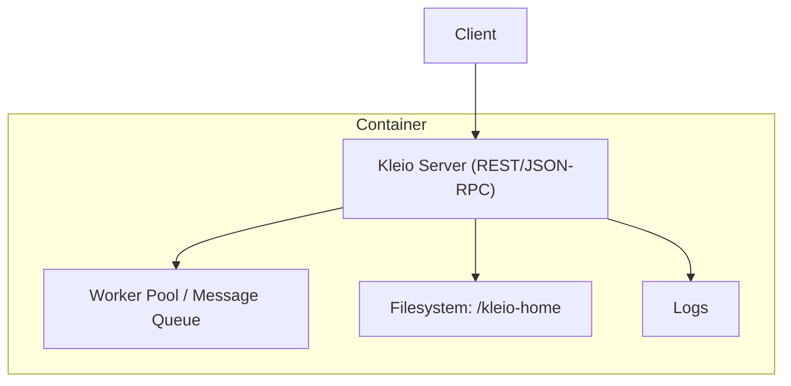
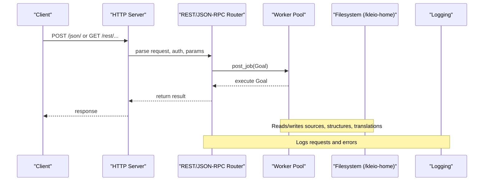
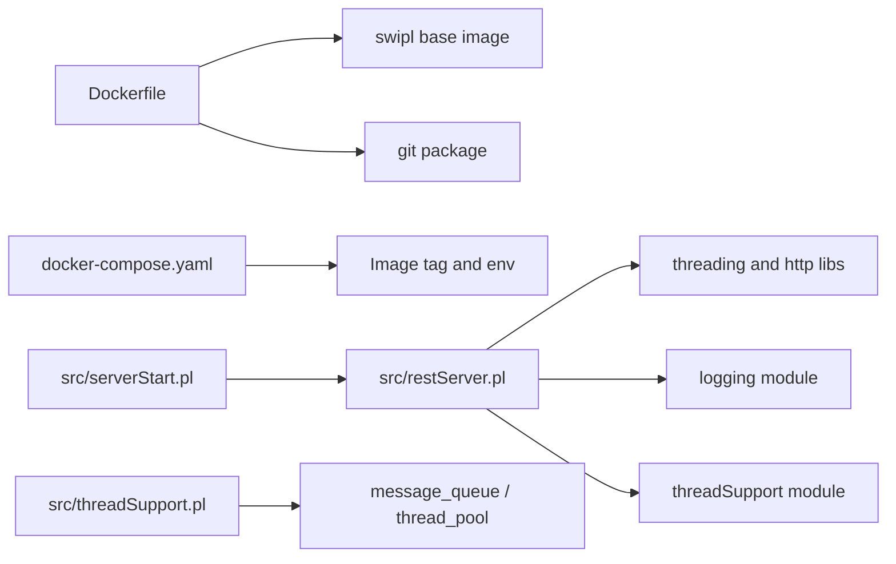

# Deployment and Operations

<cite>
**Referenced Files in This Document**
- [Dockerfile](file://Dockerfile)
- [docker-compose.yaml](file://docker-compose.yaml)
- [.env-sample](file://.env-sample)
- [Makefile](file://Makefile)
- [README.md](file://README.md)
- [src/serverStart.pl](file://src/serverStart.pl)
- [src/restServer.pl](file://src/restServer.pl)
- [src/threadSupport.pl](file://src/threadSupport.pl)
- [src/logging.pl](file://src/logging.pl)
- [src/apiCommon.pl](file://src/apiCommon.pl)
</cite>

## Table of Contents
1. Introduction
2. Project Structure
3. Core Components
4. Architecture Overview
5. Detailed Component Analysis
6. Dependency Analysis
7. Performance Considerations
8. Troubleshooting Guide
9. Conclusion
10. Appendices

## Introduction
This document provides comprehensive deployment and operations guidance for the Kleio translation services. It covers production deployment using Docker containers, environment configuration, scaling considerations, monitoring and logging, performance tuning, resource management, backup and disaster recovery, health checks, operational automation, container orchestration with Docker Compose, Kubernetes deployment patterns, cloud platform integration, capacity planning, load balancing, and high availability configurations.

## Project Structure
The project ships a Prolog-based REST/JSON-RPC server packaged as a Docker image. The runtime entrypoint starts the server process that listens on an HTTP port and exposes REST and JSON-RPC endpoints. Configuration is primarily driven by environment variables and a persistent home directory mounted into the container.

**Diagram sources**
- [Dockerfile:1-22](file://Dockerfile#L1-L22)
- [docker-compose.yaml:1-22](file://docker-compose.yaml#L1-L22)
- [src/serverStart.pl:50-66](file://src/serverStart.pl#L50-L66)
- [src/restServer.pl:330-349](file://src/restServer.pl#L330-L349)
- [src/threadSupport.pl:41-62](file://src/threadSupport.pl#L41-L62)
- [src/logging.pl:132-148](file://src/logging.pl#L132-L148)

**Section sources**
- [Dockerfile:1-22](file://Dockerfile#L1-L22)
- [docker-compose.yaml:1-22](file://docker-compose.yaml#L1-L22)
- [README.md:68-146](file://README.md#L68-L146)

## Core Components
- Container image and entrypoint: The Docker image installs Git, copies the server source, sets log output to stdout, and runs the server forever.
- Orchestration: docker-compose.yaml defines service exposure, volume mapping, user identity, and environment variables.
- Server bootstrap: serverStart.pl initializes debug or production server modes and keeps the process alive.
- HTTP server: restServer.pl implements REST and JSON-RPC handlers, worker pool initialization, CORS, token bootstrap, and request routing.
- Concurrency: threadSupport.pl manages worker pools and job queues.
- Logging: logging.pl writes logs to file or stdout based on configuration.

Key environment variables include KLEIO_SERVER_PORT, KLEIO_EXTERNAL_PORT, KLEIO_SERVER_WORKERS, KLEIO_IDLE_TIMEOUT, KLEIO_ADMIN_TOKEN, KLEIO_CORS_SITES, and KLEIO_HOME_DIR.

**Section sources**
- [Dockerfile:1-22](file://Dockerfile#L1-L22)
- [docker-compose.yaml:1-22](file://docker-compose.yaml#L1-L22)
- [src/serverStart.pl:50-66](file://src/serverStart.pl#L50-L66)
- [src/restServer.pl:175-184](file://src/restServer.pl#L175-L184)
- [src/threadSupport.pl:41-62](file://src/threadSupport.pl#L41-L62)
- [src/logging.pl:132-148](file://src/logging.pl#L132-L148)
- [.env-sample:1-119](file://.env-sample#L1-L119)

## Architecture Overview
The system consists of a single-process server with internal threading for concurrency. Clients interact via REST or JSON-RPC. The server persists state under a mapped home directory and can optionally write logs to stdout or a file.

**Diagram sources**
- [src/restServer.pl:330-349](file://src/restServer.pl#L330-L349)
- [src/restServer.pl:491-515](file://src/restServer.pl#L491-L515)
- [src/threadSupport.pl:104-124](file://src/threadSupport.pl#L104-L124)
- [src/logging.pl:132-148](file://src/logging.pl#L132-L148)

## Detailed Component Analysis

### Container Image and Entrypoint
- Base image: swipl
- Installs git for repository operations
- Copies server source into the image
- Sets KLEIO_LOG_STDOUT=true to stream logs to stdout
- CMD runs the server in a loop

Operational implications:
- Use stdout/stderr for centralized log collection
- Ensure the host has sufficient disk space for /kleio-home
- Tag images with semantic versions for reproducibility

**Section sources**
- [Dockerfile:1-22](file://Dockerfile#L1-L22)

### Docker Compose Orchestration
- Service name: kleio
- Image: configurable via KLEIO_SERVER_IMAGE
- User: configurable via KLEIO_USER to avoid root-owned files
- Volume: KLEIO_HOME_DIR mapped to /kleio-home
- Port mapping: external KLEIO_EXTERNAL_PORT to internal KLEIO_SERVER_PORT
- Environment: KLEIO_DEBUG, KLEIO_SERVER_WORKERS, KLEIO_SERVER_PORT, KLEIO_ADMIN_TOKEN, KLEIO_LOG_STDOUT
- Restart policy: unless-stopped

Best practices:
- Pin image tags in production
- Provide secrets via orchestrator secret stores instead of plain env
- Use named volumes for durability if needed

**Section sources**
- [docker-compose.yaml:1-22](file://docker-compose.yaml#L1-L22)
- [.env-sample:1-119](file://.env-sample#L1-L119)

### Server Bootstrap and Lifecycle
- run_server_forever initializes either debug or production server and sleeps indefinitely
- print_server_config prints version, ports, workers, timeout, CORS, paths, and logging destination
- save_kleio_config writes runtime configuration to .kleio.json inside the home directory

Operational notes:
- Use KLEIO_DEBUG=true for verbose logs during troubleshooting
- Inspect .kleio.json for admin token and URLs after startup
- Stop server via API or orchestrator signals

**Section sources**
- [src/serverStart.pl:50-66](file://src/serverStart.pl#L50-L66)
- [src/restServer.pl:186-226](file://src/restServer.pl#L186-L226)
- [src/restServer.pl:228-267](file://src/restServer.pl#L228-L267)

### REST and JSON-RPC Endpoints
- REST prefix: /rest/
- JSON-RPC endpoint: /json/
- CORS support via KLEIO_CORS_SITES
- Token-based authorization; bootstrap token generation when no tokens exist and admin token not provided
- Home page at root shows status and configuration summary

API surface includes entities such as sources, directories, structures, translations, exports, reports, identifications, versions, tokens, users, and client_log.

**Section sources**
- [src/restServer.pl:304-308](file://src/restServer.pl#L304-L308)
- [src/restServer.pl:389-421](file://src/restServer.pl#L389-L421)
- [src/restServer.pl:424-447](file://src/restServer.pl#L424-L447)
- [src/apiCommon.pl:1-101](file://src/apiCommon.pl#L1-L101)

### Concurrency Model and Scaling
- Workers are created at startup based on KLEIO_SERVER_WORKERS
- Two modes supported: message queue and thread pool
- Jobs are queued and executed asynchronously
- Idle detection supports auto-stop scenarios

Scaling guidance:
- Tune KLEIO_SERVER_WORKERS according to CPU cores and workload characteristics
- Increase KLEIO_IDLE_TIMEOUT for large file transfers
- Monitor queue depth and processing time to right-size workers

**Section sources**
- [src/restServer.pl:175-184](file://src/restServer.pl#L175-L184)
- [src/threadSupport.pl:41-62](file://src/threadSupport.pl#L41-L62)
- [src/threadSupport.pl:104-124](file://src/threadSupport.pl#L104-L124)
- [src/restServer.pl:351-367](file://src/restServer.pl#L351-L367)

### Logging and Observability
- Log levels: emerg, alert, crit, err, warning, notice, info, debug
- Destination: file under KLEIO_CONF_DIR/logs or stdout when configured
- Server prints configuration and counts on the home page
- Shared counters track REST and JSON-RPC request totals

Operational tips:
- Stream logs to stdout for containerized environments
- Centralize logs with a log aggregator
- Set KLEIO_DEBUG=true only when diagnosing issues

**Section sources**
- [src/logging.pl:25-113](file://src/logging.pl#L25-L113)
- [src/logging.pl:132-148](file://src/logging.pl#L132-L148)
- [src/restServer.pl:186-226](file://src/restServer.pl#L186-L226)
- [src/restServer.pl:424-447](file://src/restServer.pl#L424-L447)

### Health Checks and Readiness
- Root path returns HTML with version, time, request counts, and configuration summary
- No dedicated /health endpoint is implemented; use the root path for liveness/readiness probes
- Idle detection predicate exists for auto-stop scenarios

Implementation guidance:
- Configure orchestrators to probe the root path and expect 200 OK
- For readiness, verify that the token database is attached and admin token is available

**Section sources**
- [src/restServer.pl:424-447](file://src/restServer.pl#L424-L447)
- [src/restServer.pl:389-421](file://src/restServer.pl#L389-L421)
- [src/restServer.pl:351-367](file://src/restServer.pl#L351-L367)

### Security and Authentication
- Authorization via bearer tokens
- Admin token can be provided via KLEIO_ADMIN_TOKEN or bootstrapped once
- Upload permissions are enforced per token
- CORS sites configurable via KLEIO_CORS_SITES

Security recommendations:
- Always set KLEIO_ADMIN_TOKEN in production
- Restrict CORS to known origins
- Store tokens securely and rotate regularly

**Section sources**
- [src/restServer.pl:389-421](file://src/restServer.pl#L389-L421)
- [src/restServer.pl:590-600](file://src/restServer.pl#L590-L600)
- [src/restServer.pl:183-184](file://src/restServer.pl#L183-L184)
- [.env-sample:42-50](file://.env-sample#L42-L50)

## Dependency Analysis
The server depends on SWI-Prolog libraries for HTTP, JSON, and threading. External dependencies include Git for repository operations.

**Diagram sources**
- [Dockerfile:1-22](file://Dockerfile#L1-L22)
- [docker-compose.yaml:1-22](file://docker-compose.yaml#L1-L22)
- [src/restServer.pl:131-148](file://src/restServer.pl#L131-L148)
- [src/threadSupport.pl:41-62](file://src/threadSupport.pl#L41-L62)
- [src/serverStart.pl:50-66](file://src/serverStart.pl#L50-L66)

**Section sources**
- [Dockerfile:1-22](file://Dockerfile#L1-L22)
- [src/restServer.pl:131-148](file://src/restServer.pl#L131-L148)
- [src/threadSupport.pl:41-62](file://src/threadSupport.pl#L41-L62)

## Performance Considerations
- Workers: Adjust KLEIO_SERVER_WORKERS to match CPU capacity and expected concurrency. Start with number of cores and tune based on queue depth and latency.
- Timeouts: Increase KLEIO_IDLE_TIMEOUT for large uploads/downloads to avoid premature disconnects.
- Memory: SWI-Prolog stack sizes are configured in the worker pool creation; monitor memory usage and adjust if necessary.
- Disk I/O: Keep /kleio-home on fast storage; consider SSDs for heavy translation workloads.
- Logging: Avoid debug level in production due to overhead; enable selectively.

[No sources needed since this section provides general guidance]

## Troubleshooting Guide
- Verify server configuration by accessing the root path to view version, ports, workers, and logging destination.
- Check logs:
  - If KLEIO_LOG_STDOUT=true, inspect container logs.
  - Otherwise, check the log file under the configured log directory.
- Validate token setup:
  - If KLEIO_ADMIN_TOKEN is unset, ensure the bootstrap token was generated and saved.
- Inspect worker activity:
  - Use shared counters and idle detection to determine if the server is busy.
- Reproduce issues locally:
  - Use Make targets to build and run specific image tags and test suites.

**Section sources**
- [src/restServer.pl:186-226](file://src/restServer.pl#L186-L226)
- [src/restServer.pl:424-447](file://src/restServer.pl#L424-L447)
- [src/restServer.pl:389-421](file://src/restServer.pl#L389-L421)
- [src/restServer.pl:351-367](file://src/restServer.pl#L351-L367)
- [Makefile:165-227](file://Makefile#L165-L227)

## Conclusion
Kleio’s translation services are designed for containerized deployment with clear environment-driven configuration. Production deployments should pin image tags, manage secrets securely, configure CORS and tokens appropriately, and tune workers and timeouts based on workload. Centralized logging and simple health probing via the root endpoint facilitate observability and reliability.

[No sources needed since this section summarizes without analyzing specific files]

## Appendices

### Production Deployment Strategies

- Docker-only
  - Build and push multi-architecture images using Make targets.
  - Run with docker-compose, mounting a persistent home directory and setting required environment variables.
  - Use restart policies and health checks at the orchestrator layer.

- Kubernetes
  - Create a Deployment with replicas scaled to desired concurrency.
  - Mount PersistentVolumeClaims for /kleio-home to persist data across pods.
  - Expose via a Service and Ingress; configure TLS termination at the ingress.
  - Use ConfigMaps for non-secret settings and Secrets for tokens and sensitive values.
  - Add liveness and readiness probes against the root path.
  - Set resource requests/limits aligned with worker count and memory profile.

- Cloud Platforms
  - AWS ECS/Fargate: define task definitions with environment variables and EFS for /kleio-home.
  - Google Cloud Run: mount Cloud Storage via gcsfuse or use sidecar for persistence.
  - Azure Container Apps: use managed disks or blob storage with appropriate drivers.

[No sources needed since this section provides general guidance]

### Environment Configuration Reference
- KLEIO_SERVER_IMAGE: Image to run
- KLEIO_USER: UID:GID to avoid root-owned files
- KLEIO_HOME_DIR: Host path mapped to /kleio-home
- KLEIO_SERVER_PORT: Internal HTTP port
- KLEIO_EXTERNAL_PORT: Mapped external port
- KLEIO_SERVER_WORKERS: Number of concurrent workers
- KLEIO_IDLE_TIMEOUT: Connection keep-alive seconds
- KLEIO_ADMIN_TOKEN: Initial admin token
- KLEIO_CORS_SITES: Allowed CORS origins
- KLEIO_DEBUG: Enable debug logging
- KLEIO_LOG_STDOUT: Stream logs to stdout

**Section sources**
- [.env-sample:1-119](file://.env-sample#L1-L119)
- [docker-compose.yaml:1-22](file://docker-compose.yaml#L1-L22)

### Operational Automation
- Build and tag images:
  - make build-local, make build-multi
- Run servers:
  - make kleio-run-latest, make kleio-run-current, make kleio-run-tag
- Stop servers:
  - make kleio-stop
- Generate tokens:
  - make gen-token
- Bootstrap initial admin token:
  - make bootstrap-token

**Section sources**
- [Makefile:107-163](file://Makefile#L107-L163)
- [Makefile:165-227](file://Makefile#L165-L227)
- [Makefile:229-252](file://Makefile#L229-L252)

### Backup and Disaster Recovery
- Back up /kleio-home regularly, including:
  - Sources and translations
  - Structures and configuration
  - Token database and .kleio.json
- Use consistent snapshots or incremental backups depending on RPO/RTO requirements.
- Test restore procedures periodically to validate integrity.

[No sources needed since this section provides general guidance]

### Capacity Planning and Load Balancing
- Estimate workers based on CPU cores and translation complexity.
- Monitor queue depth and processing times to scale horizontally.
- Place a reverse proxy or ingress in front of multiple replicas for load distribution.
- Use sticky sessions only if necessary; prefer stateless design with shared storage.

[No sources needed since this section provides general guidance]

### High Availability Configurations
- Deploy multiple replicas behind a load balancer.
- Use shared persistent storage for /kleio-home accessible by all replicas.
- Configure rolling updates to maintain availability during upgrades.
- Implement graceful shutdown hooks if needed to finish in-flight jobs.

[No sources needed since this section provides general guidance]