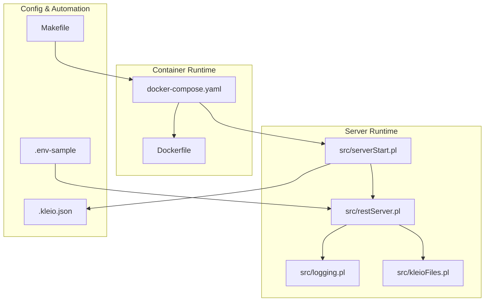
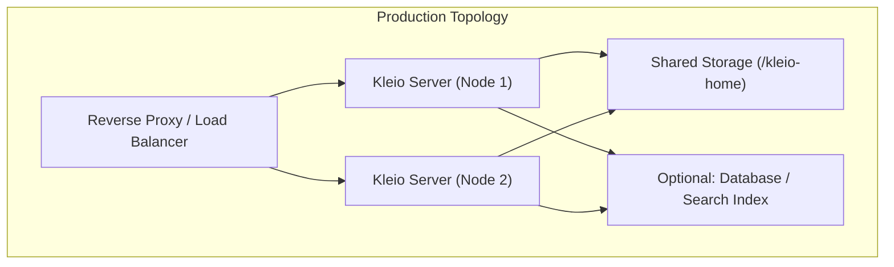
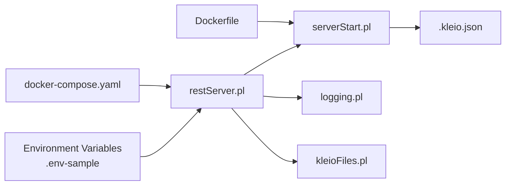
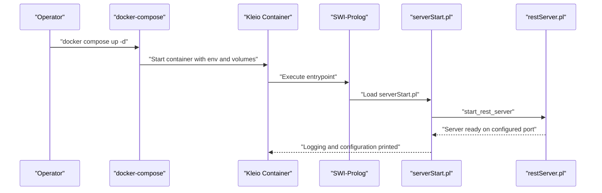

# Deployment and Operations

<cite>
**Referenced Files in This Document**
- [Dockerfile](file://Dockerfile)
- [docker-compose.yaml](file://docker-compose.yaml)
- [.env-sample](file://.env-sample)
- [Makefile](file://Makefile)
- [README.md](file://README.md)
- [src/serverStart.pl](file://src/serverStart.pl)
- [src/restServer.pl](file://src/restServer.pl)
- [src/logging.pl](file://src/logging.pl)
- [src/kleioFiles.pl](file://src/kleioFiles.pl)
- [.kleio.json](file://.kleio.json)
- [tests/scripts/kleio_start_server.sh](file://tests/scripts/kleio_start_server.sh)
- [tests/scripts/kleio_stop_server.sh](file://tests/scripts/kleio_stop_server.sh)
</cite>

## Table of Contents
1. [Introduction](#introduction)
2. [Project Structure](#project-structure)
3. [Core Components](#core-components)
4. [Architecture Overview](#architecture-overview)
5. [Detailed Component Analysis](#detailed-component-analysis)
6. [Dependency Analysis](#dependency-analysis)
7. [Performance Considerations](#performance-considerations)
8. [Troubleshooting Guide](#troubleshooting-guide)
9. [Conclusion](#conclusion)
10. [Appendices](#appendices)

## Introduction
This document provides comprehensive guidance for deploying and operating the Timelink Kleio server in production environments. It covers containerization with Docker, configuration management, volume mounting strategies, production topologies (single-node and clustered), operational procedures for health monitoring and maintenance, configuration of environment variables and SSL, backup and recovery, scaling and performance optimization, and troubleshooting for common operational issues. Security hardening and audit logging practices are included to support compliance requirements.

## Project Structure
The repository includes everything needed to build, run, and operate the Kleio server:
- Containerization: Dockerfile and docker-compose.yaml define the image and runtime orchestration.
- Configuration: .env-sample documents environment variables and defaults.
- Build and automation: Makefile provides targets for building images, tagging, running, and testing.
- Server runtime: src/serverStart.pl and src/restServer.pl implement the REST and JSON-RPC server, environment variable handling, and logging.
- Logging and diagnostics: src/logging.pl manages log destinations and levels; .kleio.json captures runtime configuration and tokens.
- Operational scripts: tests/scripts provide helpers for starting and stopping the server in development/testing contexts.

**Diagram sources**
- [docker-compose.yaml](file://docker-compose.yaml#L1-L22)
- [Dockerfile](file://Dockerfile#L1-L22)
- [src/serverStart.pl](file://src/serverStart.pl#L1-L200)
- [src/restServer.pl](file://src/restServer.pl#L1-L200)
- [src/logging.pl](file://src/logging.pl#L1-L161)
- [src/kleioFiles.pl](file://src/kleioFiles.pl#L1-L200)
- [.env-sample](file://.env-sample#L1-L119)
- [Makefile](file://Makefile#L1-L286)
- [.kleio.json](file://.kleio.json#L1-L13)

**Section sources**
- [Dockerfile](file://Dockerfile#L1-L22)
- [docker-compose.yaml](file://docker-compose.yaml#L1-L22)
- [.env-sample](file://.env-sample#L1-L119)
- [Makefile](file://Makefile#L1-L286)
- [README.md](file://README.md#L68-L146)

## Core Components
- Docker image and containerization
  - Base image: Debian-based SWI-Prolog runtime.
  - Installed tools: Git for repository operations.
  - Working directory and environment: Copies server source into /usr/local/timelink/clio/src and sets KLEIO_LOG_STDOUT to route logs to stdout.
  - Entrypoint: Starts the server via SWI-Prolog with serverStart.pl and run_server_forever.
- Docker Compose orchestration
  - Service definition with image selection via KLEIO_SERVER_IMAGE.
  - Volume mapping: KLEIO_HOME_DIR mounted to /kleio-home inside the container.
  - Port mapping: configurable KLEIO_EXTERNAL_PORT to KLEIO_SERVER_PORT.
  - Environment propagation: KLEIO_DEBUG, KLEIO_SERVER_WORKERS, KLEIO_SERVER_PORT, KLEIO_ADMIN_TOKEN, and KLEIO_LOG_STDOUT.
  - User override: user KLEIO_USER to avoid root-owned files on Linux hosts.
  - Restart policy: unless-stopped.
- Configuration management
  - .env-sample defines environment variables for image selection, endpoints, ports, workers, timeouts, CORS, paths, and debug toggles.
  - Makefile targets automate image building, tagging, running, and testing; also generate tokens and manage bootstrap tokens.
- Server runtime and configuration
  - src/serverStart.pl: starts the REST server and supports debug modes and forever loops.
  - src/restServer.pl: reads environment variables for ports, workers, idle timeout, CORS, and admin token; exposes configuration printing and JSON-RPC handlers.
  - src/logging.pl: manages log destinations (stdout or file), log levels, and formatting.
  - src/kleioFiles.pl: resolves directories for configuration, sources, structures, logs, and tokens; supports file status and cleanup.
  - .kleio.json: records runtime configuration, admin token path, and log location after server initialization.

**Section sources**
- [Dockerfile](file://Dockerfile#L1-L22)
- [docker-compose.yaml](file://docker-compose.yaml#L1-L22)
- [.env-sample](file://.env-sample#L1-L119)
- [Makefile](file://Makefile#L103-L216)
- [src/serverStart.pl](file://src/serverStart.pl#L50-L67)
- [src/restServer.pl](file://src/restServer.pl#L107-L184)
- [src/logging.pl](file://src/logging.pl#L27-L161)
- [src/kleioFiles.pl](file://src/kleioFiles.pl#L16-L33)
- [.kleio.json](file://.kleio.json#L1-L13)

## Architecture Overview
The production runtime architecture centers on a single-node Dockerized server with optional clustering behind a reverse proxy. The server exposes a REST/JSON-RPC API and manages file-based configuration and translation artifacts under /kleio-home.

**Diagram sources**
- [docker-compose.yaml](file://docker-compose.yaml#L1-L22)
- [src/restServer.pl](file://src/restServer.pl#L107-L184)
- [src/kleioFiles.pl](file://src/kleioFiles.pl#L16-L33)

## Detailed Component Analysis

### Docker Containerization
- Image building
  - Base: Debian-based SWI-Prolog image.
  - Tools: Installs Git; cleans package cache to minimize image size.
  - Source inclusion: Copies src tree into /usr/local/timelink/clio/src.
  - Environment: Sets KLEIO_LOG_STDOUT to route logs to stdout.
  - Entrypoint: Launches SWI-Prolog with serverStart.pl and run_server_forever.
- Orchestration with Docker Compose
  - Image selection via KLEIO_SERVER_IMAGE.
  - Volume mapping: KLEIO_HOME_DIR to /kleio-home with cached driver.
  - Port mapping: KLEIO_EXTERNAL_PORT to KLEIO_SERVER_PORT.
  - Environment propagation: KLEIO_DEBUG, KLEIO_SERVER_WORKERS, KLEIO_SERVER_PORT, KLEIO_ADMIN_TOKEN, KLEIO_LOG_STDOUT.
  - User override: user KLEIO_USER to avoid root-owned files on Linux.
  - Restart policy: unless-stopped.

Operational guidance:
- Build locally: make build-local or use docker build with the prepared Dockerfile.
- Multi-platform builds: make build-multi for ARM64 and AMD64 with buildx.
- Tagging: make tag-local-stable or make tag-multi-stable for versioned releases.
- Run with compose: make kleio-run-latest or docker compose up -d after setting .env.

**Section sources**
- [Dockerfile](file://Dockerfile#L1-L22)
- [docker-compose.yaml](file://docker-compose.yaml#L1-L22)
- [Makefile](file://Makefile#L103-L148)

### Configuration Management
Key environment variables and their roles:
- KLEIO_SERVER_IMAGE: Selects the image to run.
- KLEIO_END_POINT: Service endpoint for clients.
- KLEIO_SERVER_PORT: Internal server port (default 8088).
- KLEIO_EXTERNAL_PORT: Host port exposed by Docker (default 8088).
- KLEIO_SERVER_WORKERS: Worker threads for parallel translations.
- KLEIO_IDLE_TIMEOUT: Connection idle timeout in seconds (default 900).
- KLEIO_ADMIN_TOKEN: Admin token for privileged operations.
- KLEIO_CORS_SITES: Allowed origins for CORS; use "*" for all.
- KLEIO_HOME_DIR: Root working directory mapped to /kleio-home.
- KLEIO_CONF_DIR, KLEIO_SOURCE_DIR, KLEIO_STRU_DIR, KLEIO_TOKEN_DB: Paths for configuration, sources, structures, and token database.
- KLEIO_DEFAULT_STRU: Default structure file.
- KLEIO_DEBUG: Enables debug logging.

Notes:
- The server reads these variables at startup and applies defaults when not set.
- KLEIO_LOG_STDOUT is set by the Dockerfile to route logs to stdout for container log collection.

**Section sources**
- [.env-sample](file://.env-sample#L1-L119)
- [src/restServer.pl](file://src/restServer.pl#L107-L184)
- [Dockerfile](file://Dockerfile#L19-L21)

### Production Deployment Topologies
- Single-node deployment
  - Recommended for development, staging, and small-scale production.
  - Use docker-compose with a single service and a local or mounted volume for /kleio-home.
  - Configure KLEIO_EXTERNAL_PORT to match the host port.
- Clustered deployment
  - Scale horizontally behind a reverse proxy or load balancer.
  - Ensure shared storage for /kleio-home across nodes to maintain consistent configuration and translation artifacts.
  - Consider sticky sessions if stateful session behavior is required; otherwise rely on shared storage and idempotent operations.
  - Use KLEIO_SERVER_WORKERS to balance CPU utilization per node.

Security considerations:
- Restrict inbound access to the server port via firewall rules.
- Use HTTPS termination at the reverse proxy with TLS certificates managed externally.
- Enforce CORS policies via KLEIO_CORS_SITES.

**Section sources**
- [docker-compose.yaml](file://docker-compose.yaml#L1-L22)
- [src/restServer.pl](file://src/restServer.pl#L107-L184)

### Operational Procedures
- Health checks
  - REST endpoint: Use the JSON-RPC endpoint to probe availability and basic functionality.
  - Logs: Monitor container logs for errors and warnings; enable KLEIO_DEBUG for verbose logs.
- Monitoring and metrics
  - Collect container logs and integrate with centralized logging (e.g., ELK, Loki).
  - Track CPU, memory, and disk usage of the container and host.
- Maintenance tasks
  - Rotate logs regularly to prevent disk pressure.
  - Clean stale translation artifacts periodically using file management APIs or filesystem cleanup.
  - Validate configuration and structure files under /kleio-home.

**Section sources**
- [src/logging.pl](file://src/logging.pl#L27-L161)
- [src/kleioFiles.pl](file://src/kleioFiles.pl#L111-L144)

### Backup and Recovery
Backup scope:
- Configuration: KLEIO_CONF_DIR and KLEIO_STRU_DIR.
- Sources: KLEIO_SOURCE_DIR.
- Tokens: KLEIO_TOKEN_DB.
- Logs: Optional, depending on retention policy.

Backup strategies:
- File-level snapshots of /kleio-home.
- Periodic tar.gz archives with timestamps.
- Offsite replication to remote storage.

Recovery procedure:
- Restore /kleio-home from the latest backup.
- Verify directory ownership and permissions (especially on Linux hosts).
- Restart the container and confirm service availability.

**Section sources**
- [src/kleioFiles.pl](file://src/kleioFiles.pl#L16-L33)
- [docker-compose.yaml](file://docker-compose.yaml#L12-L13)

### Scaling Strategies and Performance Optimization
- Horizontal scaling
  - Add nodes behind a reverse proxy; ensure shared storage for /kleio-home.
- Vertical scaling
  - Increase KLEIO_SERVER_WORKERS to utilize more CPU cores.
  - Adjust KLEIO_IDLE_TIMEOUT for long-running operations.
- Resource management
  - Limit container CPU/memory via compose or orchestrator settings.
  - Use cached volume drivers for /kleio-home to improve I/O performance.
- Network optimization
  - Place the server close to clients to reduce latency.
  - Use compression and chunked transfer for large XML exports.

**Section sources**
- [docker-compose.yaml](file://docker-compose.yaml#L12-L21)
- [src/restServer.pl](file://src/restServer.pl#L177-L182)
- [Makefile](file://Makefile#L103-L148)

### Security Hardening and Audit Logging
- Access control
  - Set KLEIO_ADMIN_TOKEN at deployment time; rotate tokens regularly.
  - Use API tokens for client applications; enforce token invalidation and regeneration.
- Transport security
  - Terminate TLS at a reverse proxy; configure strong ciphers and protocols.
  - Restrict inbound ports to trusted networks.
- Audit logging
  - Enable KLEIO_DEBUG for detailed logs during incidents; disable in production for performance.
  - Centralize logs and retain them per compliance requirements.
- File system permissions
  - Use user KLEIO_USER to avoid root-owned files on Linux hosts.
  - Ensure /kleio-home is writable by the container user.

**Section sources**
- [.env-sample](file://.env-sample#L42-L46)
- [src/restServer.pl](file://src/restServer.pl#L116-L118)
- [src/logging.pl](file://src/logging.pl#L89-L112)
- [docker-compose.yaml](file://docker-compose.yaml#L7-L10)

## Dependency Analysis
The server’s runtime depends on environment variables, file system locations, and optional external services. The following diagram maps key dependencies:

**Diagram sources**
- [.env-sample](file://.env-sample#L1-L119)
- [src/restServer.pl](file://src/restServer.pl#L107-L184)
- [src/serverStart.pl](file://src/serverStart.pl#L50-L67)
- [src/logging.pl](file://src/logging.pl#L27-L161)
- [src/kleioFiles.pl](file://src/kleioFiles.pl#L16-L33)
- [.kleio.json](file://.kleio.json#L1-L13)
- [docker-compose.yaml](file://docker-compose.yaml#L1-L22)
- [Dockerfile](file://Dockerfile#L1-L22)

**Section sources**
- [src/restServer.pl](file://src/restServer.pl#L107-L184)
- [src/serverStart.pl](file://src/serverStart.pl#L50-L67)
- [src/logging.pl](file://src/logging.pl#L27-L161)
- [src/kleioFiles.pl](file://src/kleioFiles.pl#L16-L33)
- [.kleio.json](file://.kleio.json#L1-L13)
- [docker-compose.yaml](file://docker-compose.yaml#L1-L22)
- [Dockerfile](file://Dockerfile#L1-L22)

## Performance Considerations
- Optimize worker count: Increase KLEIO_SERVER_WORKERS to match CPU cores while avoiding contention.
- Tune timeouts: Raise KLEIO_IDLE_TIMEOUT for clients fetching large XML exports.
- Volume performance: Use cached or delegated volume drivers for /kleio-home.
- Logging overhead: Disable KLEIO_DEBUG in production; enable only during troubleshooting.
- Network: Minimize hops between clients and the server; consider local caching for repeated translations.

[No sources needed since this section provides general guidance]

## Troubleshooting Guide
Common operational issues and resolutions:
- Permission errors on Linux hosts
  - Cause: Container runs as root; files created under /kleio-home are owned by root.
  - Resolution: Set user KLEIO_USER to the current user’s UID:GID in docker-compose.
- Long-running connections timing out
  - Cause: Default KLEIO_IDLE_TIMEOUT too low for large downloads.
  - Resolution: Increase KLEIO_IDLE_TIMEOUT in .env and restart the container.
- Missing admin token
  - Symptom: No KLEIO_ADMIN_TOKEN configured.
  - Resolution: Generate a token with make gen-token and set KLEIO_ADMIN_TOKEN; or use bootstrap token flow documented in the Makefile targets.
- CORS failures
  - Symptom: Cross-origin requests blocked.
  - Resolution: Set KLEIO_CORS_SITES to the appropriate origin(s) or "*" for development.
- Container logs not visible
  - Symptom: Logs not appearing in docker logs.
  - Resolution: Ensure KLEIO_LOG_STDOUT is set (already set by Dockerfile) and that the container is running with stdout enabled.

Development and debugging aids:
- Start a temporary debug server for interactive testing using tests/scripts/kleio_start_server.sh.
- Stop the debug server after idle using tests/scripts/kleio_stop_server.sh.

**Section sources**
- [docker-compose.yaml](file://docker-compose.yaml#L7-L10)
- [src/restServer.pl](file://src/restServer.pl#L177-L184)
- [Makefile](file://Makefile#L151-L152)
- [tests/scripts/kleio_start_server.sh](file://tests/scripts/kleio_start_server.sh#L1-L22)
- [tests/scripts/kleio_stop_server.sh](file://tests/scripts/kleio_stop_server.sh#L1-L6)

## Conclusion
Deploying the Timelink Kleio server in production requires careful attention to containerization, configuration, and operational hygiene. Use the provided Dockerfile and docker-compose.yaml for consistent builds and runtime, manage configuration via .env-sample and Makefile targets, and adopt robust logging, backup, and scaling practices. Harden security with strict access controls, TLS termination, and audit logging, and troubleshoot efficiently using the guidance provided.

[No sources needed since this section summarizes without analyzing specific files]

## Appendices

### Appendix A: Environment Variables Reference
- KLEIO_SERVER_IMAGE: Image to run.
- KLEIO_END_POINT: Service endpoint for clients.
- KLEIO_SERVER_PORT: Internal server port.
- KLEIO_EXTERNAL_PORT: Host port exposed by Docker.
- KLEIO_SERVER_WORKERS: Worker threads.
- KLEIO_IDLE_TIMEOUT: Connection idle timeout.
- KLEIO_ADMIN_TOKEN: Admin token.
- KLEIO_CORS_SITES: Allowed CORS origins.
- KLEIO_HOME_DIR: Root working directory mapped to /kleio-home.
- KLEIO_CONF_DIR, KLEIO_SOURCE_DIR, KLEIO_STRU_DIR, KLEIO_TOKEN_DB: Paths for configuration, sources, structures, and token database.
- KLEIO_DEFAULT_STRU: Default structure file.
- KLEIO_DEBUG: Enable debug logging.

**Section sources**
- [.env-sample](file://.env-sample#L1-L119)
- [src/restServer.pl](file://src/restServer.pl#L107-L184)

### Appendix B: Server Startup Flow

**Diagram sources**
- [docker-compose.yaml](file://docker-compose.yaml#L1-L22)
- [Dockerfile](file://Dockerfile#L19-L21)
- [src/serverStart.pl](file://src/serverStart.pl#L50-L67)
- [src/restServer.pl](file://src/restServer.pl#L186-L200)