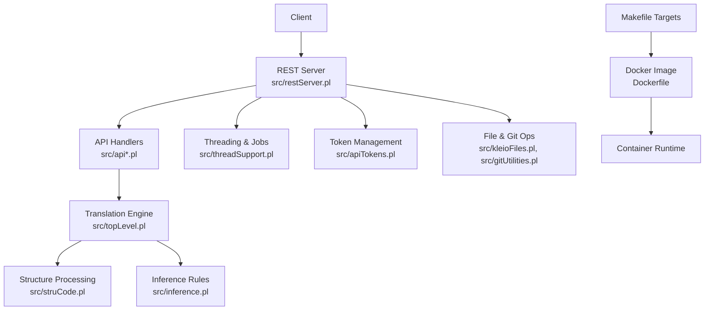
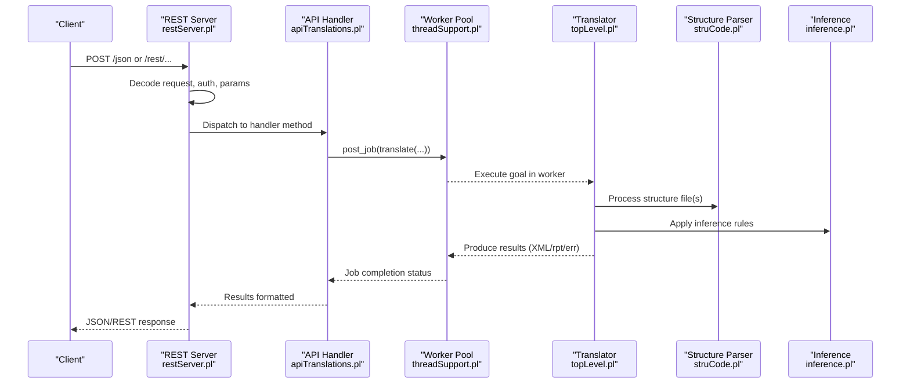
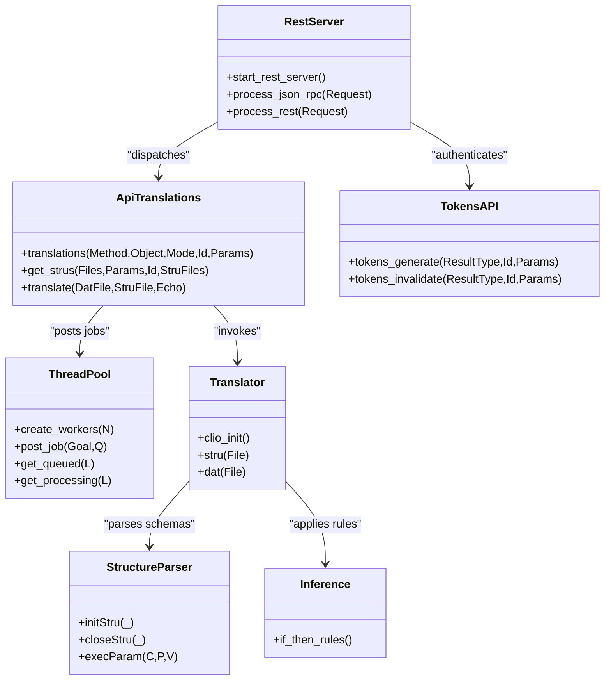

# Developer Guide

<cite>
**Referenced Files in This Document**
- [README.md](file://README.md)
- [README_DEV.md](file://README_DEV.md)
- [Makefile](file://Makefile)
- [Dockerfile](file://Dockerfile)
- [AGENTS.md](file://AGENTS.md)
- [serverStart.pl](file://src/serverStart.pl)
- [restServer.pl](file://src/restServer.pl)
- [topLevel.pl](file://src/topLevel.pl)
- [apiTranslations.pl](file://src/apiTranslations.pl)
- [inference.pl](file://src/inference.pl)
- [struCode.pl](file://src/struCode.pl)
- [threadSupport.pl](file://src/threadSupport.pl)
- [apiTokens.pl](file://src/apiTokens.pl)
- [tests/README.md](file://tests/README.md)
</cite>

## Table of Contents
1. [Introduction](#introduction)
2. [Project Structure](#project-structure)
3. [Core Components](#core-components)
4. [Architecture Overview](#architecture-overview)
5. [Detailed Component Analysis](#detailed-component-analysis)
6. [Dependency Analysis](#dependency-analysis)
7. [Performance Considerations](#performance-considerations)
8. [Troubleshooting Guide](#troubleshooting-guide)
9. [Contribution Guidelines](#contribution-guidelines)
10. [Release Management](#release-management)
11. [Conclusion](#conclusion)

## Introduction
This developer guide explains how to contribute to the Kleio translation system, focusing on architecture, module structure, build and dependency management, coding standards, extending functionality (plugins, API endpoints, translation behavior), debugging and profiling, performance optimization, contribution workflow, pull request procedures, and release management. It also documents agent-like components and autonomous systems within the architecture.

Kleio is a specialized translation service for historical document processing using the Kleio notation. The server exposes REST and JSON-RPC APIs to translate source files, manage files and structures, handle tokens, and integrate with Git.

**Section sources**
- [README.md:1-120](file://README.md#L1-L120)
- [README_DEV.md:1-80](file://README_DEV.md#L1-L80)

## Project Structure
The repository is organized around a SWI-Prolog core under src/, with Docker packaging, Makefile automation, Postman-based API documentation and tests, and comprehensive test suites under tests/. Key directories:
- src/: Core Prolog modules (server, API handlers, translation engine, inference, threading, token management, utilities)
- api/postman/: Postman collections and environment used to generate API docs and run API tests
- docs/: Generated API documentation and additional docs
- tests/: Semantic and API tests, reference data, scripts, and stable/dev code copies
- .devcontainer/, Dockerfile, docker-compose.yaml: Containerization and dev container configuration
- Makefile: Build, tagging, run, test, and release targets

**Diagram sources**
- [restServer.pl:1-120](file://src/restServer.pl#L1-L120)
- [apiTranslations.pl:1-120](file://src/apiTranslations.pl#L1-L120)
- [topLevel.pl:1-120](file://src/topLevel.pl#L1-L120)
- [struCode.pl:1-120](file://src/struCode.pl#L1-L120)
- [inference.pl:1-120](file://src/inference.pl#L1-L120)
- [threadSupport.pl:1-80](file://src/threadSupport.pl#L1-L80)
- [apiTokens.pl:1-80](file://src/apiTokens.pl#L1-L80)
- [Dockerfile:1-22](file://Dockerfile#L1-L22)
- [Makefile:1-120](file://Makefile#L1-L120)

**Section sources**
- [README.md:120-220](file://README.md#L120-L220)
- [README_DEV.md:30-80](file://README_DEV.md#L30-L80)
- [Makefile:1-120](file://Makefile#L1-L120)

## Core Components
- REST/JSON-RPC server: Entry points for HTTP requests, routing, CORS, authentication, and response formatting.
- API handlers: Feature-specific modules (translations, sources, tokens, directories, exports).
- Translation engine: Parses Kleio structures and data, applies normalization and inference, produces XML/JSON outputs.
- Threading and job queue: Worker pool/message queue to process translations concurrently.
- Token management: Generate, validate, and invalidate tokens; bootstrap admin token support.
- File and Git integration: Manage sources, structures, reports, and basic Git operations.

Key responsibilities and interactions are detailed in subsequent sections.

**Section sources**
- [restServer.pl:120-220](file://src/restServer.pl#L120-L220)
- [apiTranslations.pl:1-120](file://src/apiTranslations.pl#L1-L120)
- [threadSupport.pl:1-120](file://src/threadSupport.pl#L1-L120)
- [apiTokens.pl:1-120](file://src/apiTokens.pl#L1-L120)

## Architecture Overview
The system follows a layered architecture:
- Presentation layer: REST and JSON-RPC endpoints
- Service layer: API handlers orchestrate business logic
- Domain layer: Translation engine and inference rules
- Infrastructure layer: File system, Git, threading, persistence, logging

**Diagram sources**
- [restServer.pl:450-600](file://src/restServer.pl#L450-L600)
- [apiTranslations.pl:40-120](file://src/apiTranslations.pl#L40-L120)
- [threadSupport.pl:60-120](file://src/threadSupport.pl#L60-L120)
- [topLevel.pl:120-200](file://src/topLevel.pl#L120-L200)
- [struCode.pl:60-120](file://src/struCode.pl#L60-L120)
- [inference.pl:1-120](file://src/inference.pl#L1-L120)

## Detailed Component Analysis

### REST and JSON-RPC Server
- Provides HTTP handlers for /rest/* and /json/* endpoints.
- Decodes requests, validates tokens, parses parameters, and dispatches to API handlers.
- Supports CORS, time limits, and content-type negotiation.
- Maintains shared counters and idle detection for auto-stop scenarios.

Key behaviors:
- Request decoding and authorization extraction
- Routing via entity/method/object mapping
- JSON-RPC batch/single request handling
- Home page diagnostics and config printing

**Section sources**
- [restServer.pl:300-520](file://src/restServer.pl#L300-L520)
- [restServer.pl:520-700](file://src/restServer.pl#L520-L700)
- [restServer.pl:700-800](file://src/restServer.pl#L700-L800)

### API Translations
- Implements translations GET/POST/DELETE endpoints.
- Resolves structure files per source file or defaults.
- Spawns parallel jobs when requested; otherwise processes sequentially.
- Tracks queued and processing states; provides URLs for reports and exports.

Workflow highlights:
- Authorization checks and path resolution
- Structure selection priority and matching strategies
- Job creation and result conversion
- Status caching for large sets

**Section sources**
- [apiTranslations.pl:35-120](file://src/apiTranslations.pl#L35-L120)
- [apiTranslations.pl:260-420](file://src/apiTranslations.pl#L260-L420)
- [apiTranslations.pl:430-580](file://src/apiTranslations.pl#L430-L580)

### Translation Engine (Top Level)
- Initializes translator, reads and processes structure definitions (.str/.yaml), then translates data files.
- Manages line-by-line parsing, lexical analysis, and syntactic compilation.
- Produces output artifacts (XML, reports, errors) and maintains version/build metadata.

Processing flow:
- clio_init setup
- stru(F) for schema loading and validation
- dat(F) for data translation
- readlines loop with tokenization and processing

**Section sources**
- [topLevel.pl:80-170](file://src/topLevel.pl#L80-L170)
- [topLevel.pl:170-290](file://src/topLevel.pl#L170-L290)

### Structure Processing
- Parses and validates structure commands, stores internal representation, and generates JSON/YAML representations.
- Handles command lifecycle (init, execParam, close) and completeness checks.

Key aspects:
- Command property storage and defaults
- Group and element creation
- Report generation and error counting

**Section sources**
- [struCode.pl:60-120](file://src/struCode.pl#L60-L120)
- [struCode.pl:120-200](file://src/struCode.pl#L120-L200)

### Inference Engine
- Applies declarative rules to infer relationships and attributes based on Kleio patterns.
- Supports complex family relations, marriages, and hierarchical parentage.

Rule characteristics:
- Pattern matching over sequences and group extensions
- Actions to create relations and attributes
- Extensibility through new rule clauses

**Section sources**
- [inference.pl:1-120](file://src/inference.pl#L1-L120)
- [inference.pl:230-340](file://src/inference.pl#L230-L340)

### Threading and Job Queue
- Creates workers using message queues or thread pools.
- Posts jobs, tracks queued/processing states, and executes goals safely.
- Provides visibility into active threads and pool properties.

Operational details:
- Worker modes: message, pool, debug
- Job lifecycle: assert queued, execute, retract processing
- Shared counts and status tracking

**Section sources**
- [threadSupport.pl:30-120](file://src/threadSupport.pl#L30-L120)
- [threadSupport.pl:120-153](file://src/threadSupport.pl#L120-L153)

### Token Management API
- Generates, invalidates tokens, and manages user tokens.
- Validates permissions for API actions and supports bootstrap token flow.

Capabilities:
- tokens_generate with info structure (permissions, scopes)
- tokens_invalidate and users_invalidate
- Integration with server’s default_results formatter

**Section sources**
- [apiTokens.pl:1-120](file://src/apiTokens.pl#L1-L120)

### Server Startup and Configuration
- Starts REST and debug servers, prints configuration, and persists runtime settings.
- Supports MHK integration and local debugging workflows.

Startup features:
- Environment-driven ports, workers, timeouts, CORS
- Bootstrap token generation and admin token handling
- Idle detection and auto-stop helpers

**Section sources**
- [serverStart.pl:1-120](file://src/serverStart.pl#L1-L120)
- [serverStart.pl:120-220](file://src/serverStart.pl#L120-L220)

## Dependency Analysis
High-level dependencies among core modules:

**Diagram sources**
- [restServer.pl:1-120](file://src/restServer.pl#L1-L120)
- [apiTranslations.pl:1-120](file://src/apiTranslations.pl#L1-L120)
- [threadSupport.pl:1-80](file://src/threadSupport.pl#L1-L80)
- [topLevel.pl:1-120](file://src/topLevel.pl#L1-L120)
- [struCode.pl:1-120](file://src/struCode.pl#L1-L120)
- [inference.pl:1-120](file://src/inference.pl#L1-L120)
- [apiTokens.pl:1-120](file://src/apiTokens.pl#L1-L120)

**Section sources**
- [restServer.pl:120-220](file://src/restServer.pl#L120-L220)
- [apiTranslations.pl:120-220](file://src/apiTranslations.pl#L120-L220)
- [threadSupport.pl:80-153](file://src/threadSupport.pl#L80-L153)

## Performance Considerations
- Worker pool sizing: Adjust KLEIO_SERVER_WORKERS to match workload and hardware.
- Timeouts: Configure KLEIO_IDLE_TIMEOUT to balance responsiveness and resource usage.
- Parallelism: Use spawn=yes for directory-wide translations to distribute work across workers.
- Caching: Status cache reduces repeated expensive computations for large sets.
- Logging: Enable KLEIO_DEBUG selectively to avoid overhead in production.
- Profiling: Use SWI-Prolog profiling predicates in development to identify hotspots.

[No sources needed since this section provides general guidance]

## Troubleshooting Guide
Common issues and steps:
- Authentication failures: Verify token validity and permissions; check bootstrap token state.
- Permission errors: Ensure correct KLEIO_HOME_DIR and file access rights.
- Server idle/auto-stop: Confirm no queued or processing jobs before expecting shutdown.
- Translation discrepancies: Run semantic tests and compare diffs; adjust exclude patterns if changes are intentional.
- Debugging: Start debug server, set spy points, and use VSCode Prolog extension.

Useful references:
- Server startup and debugging instructions
- Test suite execution and report inspection
- API testing with Postman/Newman

**Section sources**
- [serverStart.pl:180-260](file://src/serverStart.pl#L180-L260)
- [tests/README.md:200-330](file://tests/README.md#L200-L330)
- [README.md:195-260](file://README.md#L195-L260)

## Contribution Guidelines
Development workflow:
- Local development: Install SWI-Prolog and VSCode with VSC-Prolog extension.
- Start debug server: Load serverStart.pl and call setup_and_run_server with desired options.
- API documentation: Update Postman collection and regenerate docs using postman_doc_gen.
- Testing:
  - Semantic tests: make test-semantics
  - API tests: make test-api (requires newman)
- Code style: Follow existing Prolog conventions; keep modules cohesive and well-documented.

Pull request procedures:
- Create feature branch, implement changes, add/update tests.
- Run full test suite locally; ensure semantic compatibility or update reference outputs intentionally.
- Submit PR with description of changes, rationale, and any configuration impacts.

**Section sources**
- [README.md:147-220](file://README.md#L147-L220)
- [tests/README.md:100-200](file://tests/README.md#L100-L200)

## Release Management
Build and tagging:
- Increment versions: make inc-major | inc-minor
- Build local image: make build-local
- Multi-platform build and push: make build-multi
- Tag images: make tag-multi-latest | tag-multi-stable
- Show current/last build info: make show-current | make show-last

Release sequence:
- Build multi-platform image and push to repository
- Run semantic and API tests
- Update version and tags
- Move current code to tests/stable for future comparisons
- Update release notes and commit

Environment variables:
- KLEIO_ADMIN_TOKEN, KLEIO_HOME_DIR, KLEIO_DEBUG, KLEIO_CORS_SITES, etc.

**Section sources**
- [Makefile:80-160](file://Makefile#L80-L160)
- [Makefile:160-240](file://Makefile#L160-L240)
- [README.md:288-360](file://README.md#L288-L360)

## Conclusion
This guide outlines the Kleio translation system’s architecture, development workflow, and operational practices. By following the provided patterns for extending functionality, managing builds, and running tests, contributors can maintain high quality and reliability while evolving the system.

[No sources needed since this section summarizes without analyzing specific files]