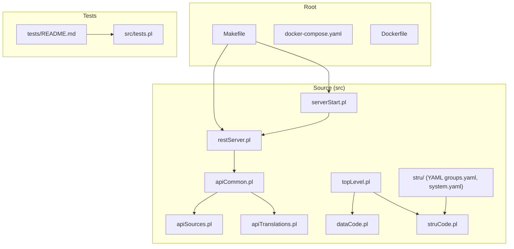
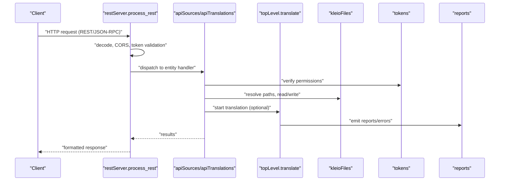
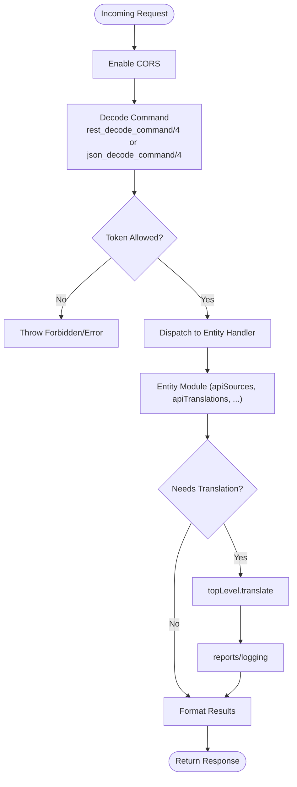
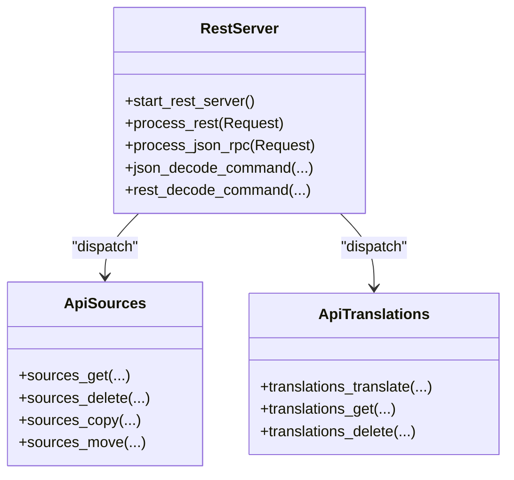
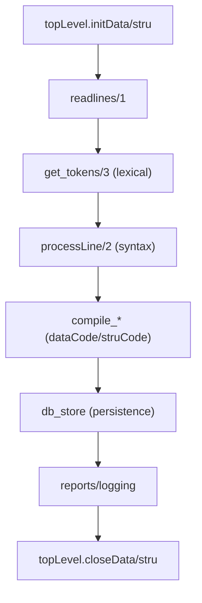
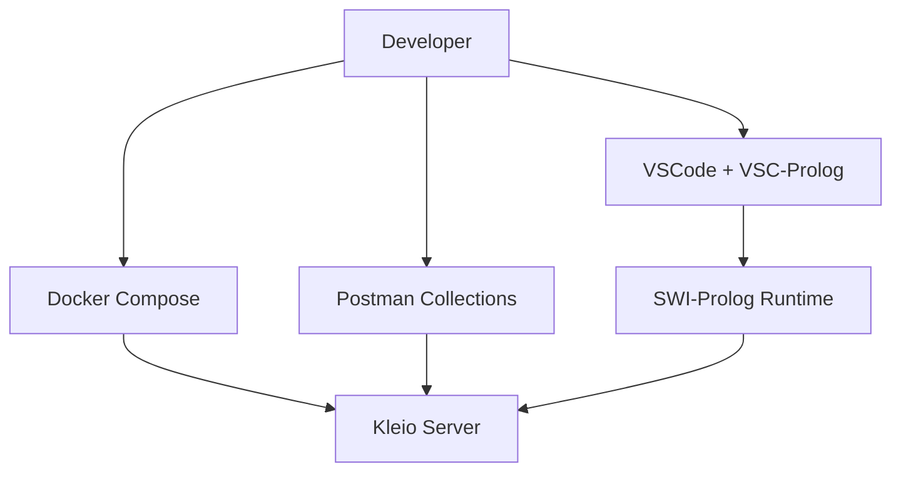
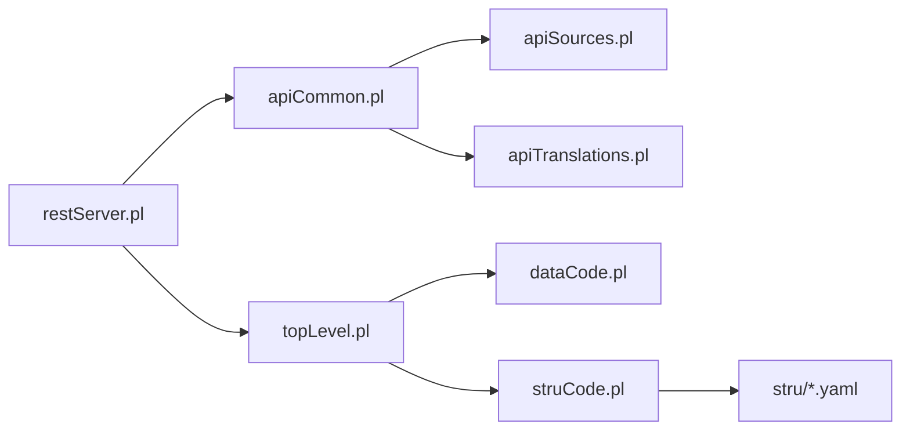

# Development Guide

<cite>
**Referenced Files in This Document**
- [README.md](file://README.md)
- [README_DEV.md](file://README_DEV.md)
- [Makefile](file://Makefile)
- [tests/README.md](file://tests/README.md)
- [src/serverStart.pl](file://src/serverStart.pl)
- [src/restServer.pl](file://src/restServer.pl)
- [src/apiCommon.pl](file://src/apiCommon.pl)
- [src/apiSources.pl](file://src/apiSources.pl)
- [src/apiTranslations.pl](file://src/apiTranslations.pl)
- [src/topLevel.pl](file://src/topLevel.pl)
- [src/dataCode.pl](file://src/dataCode.pl)
- [src/struCode.pl](file://src/struCode.pl)
- [src/stru/README.md](file://src/stru/README.md)
- [src/stru/system.yaml](file://src/stru/system.yaml)
- [src/stru/groups.yaml](file://src/stru/groups.yaml)
- [src/tests.pl](file://src/tests.pl)
</cite>

## Table of Contents
1. [Introduction](#introduction)
2. [Project Structure](#project-structure)
3. [Core Components](#core-components)
4. [Architecture Overview](#architecture-overview)
5. [Detailed Component Analysis](#detailed-component-analysis)
6. [Dependency Analysis](#dependency-analysis)
7. [Performance Considerations](#performance-considerations)
8. [Troubleshooting Guide](#troubleshooting-guide)
9. [Contribution Guidelines](#contribution-guidelines)
10. [Development Environment Setup](#development-environment-setup)
11. [Writing New Features](#writing-new-features)
12. [Testing Strategy](#testing-strategy)
13. [Debugging Techniques](#debugging-techniques)
14. [Code Review and Release Procedures](#code-review-and-release-procedures)
15. [Examples of Common Development Tasks](#examples-of-common-development-tasks)
16. [Best Practices](#best-practices)
17. [Conclusion](#conclusion)

## Introduction
This development guide explains how to contribute to and extend the Timelink Kleio system. It covers the Prolog-based codebase organization, development workflow, contribution guidelines, environment setup, module architecture, testing, debugging, and release procedures. The guide is intended for developers who want to implement new API endpoints, extend the structure definition system, or enhance the translation engine while maintaining code quality and performance.

## Project Structure
The repository is organized around a core Prolog codebase (src/) and comprehensive test suites (tests/). Key areas:
- src/: Prolog modules implementing the REST server, API handlers, translation engine, structure processing, and utilities.
- tests/: Semantic and API test suites, fixtures, and scripts for validating changes.
- docs/: Generated API documentation.
- api/: Postman collections and environments for API testing.
- Root build and orchestration files (Makefile, Dockerfile, docker-compose.yaml).

**Diagram sources**
- [Makefile](file://Makefile#L1-L286)
- [src/restServer.pl](file://src/restServer.pl#L1-L1802)
- [src/serverStart.pl](file://src/serverStart.pl#L1-L445)
- [src/apiCommon.pl](file://src/apiCommon.pl#L1-L89)
- [src/apiSources.pl](file://src/apiSources.pl#L1-L425)
- [src/apiTranslations.pl](file://src/apiTranslations.pl#L1-L779)
- [src/topLevel.pl](file://src/topLevel.pl#L1-L286)
- [src/dataCode.pl](file://src/dataCode.pl#L1-L630)
- [src/struCode.pl](file://src/struCode.pl#L1-L402)
- [src/stru/README.md](file://src/stru/README.md#L1-L4)
- [src/stru/system.yaml](file://src/stru/system.yaml#L1-L4)
- [src/stru/groups.yaml](file://src/stru/groups.yaml#L1-L259)
- [tests/README.md](file://tests/README.md#L1-L200)
- [src/tests.pl](file://src/tests.pl#L1-L103)

**Section sources**
- [README.md](file://README.md#L1-L503)
- [README_DEV.md](file://README_DEV.md#L1-L135)
- [Makefile](file://Makefile#L1-L286)

## Core Components
- REST server and JSON-RPC dispatcher: routes HTTP and JSON-RPC requests to API modules, manages workers, CORS, and token validation.
- API modules: handlers for sources, directories, translations, exports, reports, git operations, tokens, and logs.
- Translation engine: top-level orchestrator for structure and data processing, with lexical analysis, syntax parsing, and compilation.
- Structure processing: YAML/STR schema parsing and validation, group and element definitions.
- Utilities and persistence: logging, token management, counters, reports, and shared state.

Key entry points:
- REST routing and dispatch: [src/restServer.pl](file://src/restServer.pl#L296-L800)
- Server startup and debugging: [src/serverStart.pl](file://src/serverStart.pl#L1-L445)
- API surface aggregation: [src/apiCommon.pl](file://src/apiCommon.pl#L1-L89)
- Translation orchestration: [src/topLevel.pl](file://src/topLevel.pl#L1-L286)
- Data processing pipeline: [src/dataCode.pl](file://src/dataCode.pl#L1-L630)
- Structure processing pipeline: [src/struCode.pl](file://src/struCode.pl#L1-L402)

**Section sources**
- [src/restServer.pl](file://src/restServer.pl#L1-L1802)
- [src/serverStart.pl](file://src/serverStart.pl#L1-L445)
- [src/apiCommon.pl](file://src/apiCommon.pl#L1-L89)
- [src/topLevel.pl](file://src/topLevel.pl#L1-L286)
- [src/dataCode.pl](file://src/dataCode.pl#L1-L630)
- [src/struCode.pl](file://src/struCode.pl#L1-L402)

## Architecture Overview
The system exposes a REST/JSON-RPC API backed by SWI-Prolog modules. Requests are decoded, validated via tokens, dispatched to entity handlers, and results formatted consistently. The translation engine processes Kleio source files and structure definitions, producing normalized data and artifacts.

**Diagram sources**
- [src/restServer.pl](file://src/restServer.pl#L469-L800)
- [src/apiSources.pl](file://src/apiSources.pl#L1-L425)
- [src/apiTranslations.pl](file://src/apiTranslations.pl#L1-L779)
- [src/topLevel.pl](file://src/topLevel.pl#L1-L286)

## Detailed Component Analysis

### REST Server and Dispatch
Responsibilities:
- Define HTTP handlers for REST and JSON-RPC.
- Manage workers, timeouts, CORS, and server configuration.
- Token decoding and permission checks.
- Centralized error handling and result formatting.

Key predicates:
- Server lifecycle: [start_rest_server/0](file://src/restServer.pl#L326-L342), [server/1](file://src/restServer.pl#L344-L349)
- Dispatchers: [process_rest/1](file://src/restServer.pl#L469-L515), [process_json_rpc/1](file://src/restServer.pl#L656-L696)
- Token validation: [rest_decode_command/4](file://src/restServer.pl#L547-L579), [json_decode_command/4](file://src/restServer.pl#L752-L769)

**Diagram sources**
- [src/restServer.pl](file://src/restServer.pl#L469-L800)

**Section sources**
- [src/restServer.pl](file://src/restServer.pl#L1-L1802)

### API Modules Overview
- apiCommon.pl aggregates reexports for all API modules, exposing a unified surface.
- apiSources.pl handles file CRUD, uploads, moves/copies, and directory listings.
- apiTranslations.pl coordinates translation jobs, status queries, and cleanup.

Representative predicates:
- Sources: [sources/5](file://src/apiSources.pl#L28-L178), [sources_get/3](file://src/apiSources.pl#L179-L186)
- Translations: [translations/5](file://src/apiTranslations.pl#L34-L139), [translations_get/3](file://src/apiTranslations.pl#L86-L122)

**Diagram sources**
- [src/restServer.pl](file://src/restServer.pl#L1-L1802)
- [src/apiSources.pl](file://src/apiSources.pl#L1-L425)
- [src/apiTranslations.pl](file://src/apiTranslations.pl#L1-L779)

**Section sources**
- [src/apiCommon.pl](file://src/apiCommon.pl#L1-L89)
- [src/apiSources.pl](file://src/apiSources.pl#L1-L425)
- [src/apiTranslations.pl](file://src/apiTranslations.pl#L1-L779)

### Translation Engine and Processing Pipelines
- topLevel.pl orchestrates structure and data processing, including initialization, line-by-line parsing, and compilation.
- dataCode.pl manages group-level state, element storage, and database callbacks.
- struCode.pl processes structure definitions (YAML/STR), validates commands, and builds internal schema.

**Diagram sources**
- [src/topLevel.pl](file://src/topLevel.pl#L226-L286)
- [src/dataCode.pl](file://src/dataCode.pl#L1-L630)
- [src/struCode.pl](file://src/struCode.pl#L1-L402)

**Section sources**
- [src/topLevel.pl](file://src/topLevel.pl#L1-L286)
- [src/dataCode.pl](file://src/dataCode.pl#L1-L630)
- [src/struCode.pl](file://src/struCode.pl#L1-L402)

### Structure Definition System (YAML/STR)
- YAML schema files define groups, elements, and inheritance relationships.
- struCode.pl interprets schema commands and constructs internal data dictionaries.

Key files:
- [src/stru/README.md](file://src/stru/README.md#L1-L4)
- [src/stru/system.yaml](file://src/stru/system.yaml#L1-L4)
- [src/stru/groups.yaml](file://src/stru/groups.yaml#L1-L259)

**Section sources**
- [src/stru/README.md](file://src/stru/README.md#L1-L4)
- [src/stru/system.yaml](file://src/stru/system.yaml#L1-L4)
- [src/stru/groups.yaml](file://src/stru/groups.yaml#L1-L259)
- [src/struCode.pl](file://src/struCode.pl#L1-L402)

### Conceptual Overview
This section provides a high-level understanding of the system without mapping to specific source files.

[No sources needed since this diagram shows conceptual workflow, not actual code structure]

## Dependency Analysis
The API modules depend on the REST server for decoding and dispatching, and on shared utilities for persistence, logging, and tokens. The translation engine depends on lexical and syntax modules, and on persistence for database storage.

**Diagram sources**
- [src/restServer.pl](file://src/restServer.pl#L1-L1802)
- [src/apiCommon.pl](file://src/apiCommon.pl#L1-L89)
- [src/apiSources.pl](file://src/apiSources.pl#L1-L425)
- [src/apiTranslations.pl](file://src/apiTranslations.pl#L1-L779)
- [src/topLevel.pl](file://src/topLevel.pl#L1-L286)
- [src/dataCode.pl](file://src/dataCode.pl#L1-L630)
- [src/struCode.pl](file://src/struCode.pl#L1-L402)
- [src/stru/groups.yaml](file://src/stru/groups.yaml#L1-L259)

**Section sources**
- [src/restServer.pl](file://src/restServer.pl#L1-L1802)
- [src/apiCommon.pl](file://src/apiCommon.pl#L1-L89)
- [src/apiSources.pl](file://src/apiSources.pl#L1-L425)
- [src/apiTranslations.pl](file://src/apiTranslations.pl#L1-L779)
- [src/topLevel.pl](file://src/topLevel.pl#L1-L286)
- [src/dataCode.pl](file://src/dataCode.pl#L1-L630)
- [src/struCode.pl](file://src/struCode.pl#L1-L402)
- [src/stru/groups.yaml](file://src/stru/groups.yaml#L1-L259)

## Performance Considerations
- Worker threads: Configure via environment variable and adjust for concurrency needs.
- Caching: Translations status caching reduces repeated computation for large directories.
- Multi-worker vs single-worker translation: Choose based on multi-user access patterns.
- Logging levels: Enable debug only when needed to minimize overhead.

[No sources needed since this section provides general guidance]

## Troubleshooting Guide
Common issues and remedies:
- Permission errors in Docker: Run with current user mapping to avoid root-owned files.
- Bootstrap token management: Server generates a bootstrap token at startup; use it to create admin tokens.
- Token database: Ensure token DB is attached and accessible.
- Debugging: Use tspy/trace points and the debug server for interactive debugging.

**Section sources**
- [README.md](file://README.md#L113-L124)
- [src/restServer.pl](file://src/restServer.pl#L394-L422)
- [src/serverStart.pl](file://src/serverStart.pl#L13-L26)

## Contribution Guidelines
- Fork and branch: Work from feature branches; keep master stable.
- Commit messages: Clear, descriptive messages; reference issues.
- Code style: Follow existing patterns; keep modules cohesive.
- Tests: Add unit tests for utilities and plunit tests; ensure semantic and API tests pass.
- Documentation: Update inline docs and API docs when changing behavior.

[No sources needed since this section provides general guidance]

## Development Environment Setup
Tools and prerequisites:
- SWI-Prolog installed locally.
- VSCode with VSC-Prolog extension.
- Docker and Docker Compose for containerized testing.
- Postman for API testing; Newman for CLI test runs.

Local server startup:
- Set admin token and run debug server from VSCode.
- Use provided predicates to run test servers and translate files.

**Section sources**
- [README.md](file://README.md#L147-L179)
- [src/serverStart.pl](file://src/serverStart.pl#L13-L26)
- [src/serverStart.pl](file://src/serverStart.pl#L101-L139)

## Writing New Features
Guidelines:
- Extend API modules by adding new methods and results formatting.
- For structure definitions, add or modify YAML/STR files and update struCode behavior if needed.
- Keep error handling consistent; use centralized return_error/2 and logging.
- Add unit tests for new predicates; integrate with plunit.

**Section sources**
- [src/apiCommon.pl](file://src/apiCommon.pl#L1-L89)
- [src/stru/README.md](file://src/stru/README.md#L1-L4)
- [src/stru/groups.yaml](file://src/stru/groups.yaml#L1-L259)
- [src/tests.pl](file://src/tests.pl#L1-L103)

## Testing Strategy
- Semantic tests: Compare outputs of stable vs. development versions; use filtering to ignore expected differences.
- API tests: Use Postman collections and Newman to validate endpoints.
- Unit tests: PLUnit-based tests for utilities and core predicates.
- Small changes: Use translate_file clauses and run_tests(server) for quick iterations.

**Section sources**
- [tests/README.md](file://tests/README.md#L1-L200)
- [src/serverStart.pl](file://src/serverStart.pl#L427-L445)
- [src/tests.pl](file://src/tests.pl#L1-L103)

## Debugging Techniques
- Interactive debugging: Use tspy/trace points and the debug server.
- Remote debugging: Attach IDE debugger to running containers when integrating with MHK.
- Stack inspection: Use provided predicates to inspect Prolog stacks.

**Section sources**
- [README.md](file://README.md#L181-L239)
- [src/serverStart.pl](file://src/serverStart.pl#L285-L293)

## Code Review and Release Procedures
Release workflow:
- Build multi-platform Docker image.
- Run semantic and API tests.
- Increment version (major/minor/batch).
- Tag and push images; update release notes.
- Move current code to tests/stable for future comparisons.

**Section sources**
- [README.md](file://README.md#L272-L291)
- [Makefile](file://Makefile#L252-L286)

## Examples of Common Development Tasks
- Adding a new API endpoint:
  - Define method in an API module (e.g., apiSources.pl).
  - Implement json_* predicate for JSON-RPC.
  - Add results formatter and register in apiCommon.pl.
- Implementing translation rules:
  - Extend dataCode.pl predicates to handle new element types.
  - Update structure definitions in struCode.pl or YAML.
- Extending the structure definition system:
  - Add group/element definitions in YAML files.
  - Ensure struCode.pl supports new parameters and validations.

**Section sources**
- [src/apiSources.pl](file://src/apiSources.pl#L1-L425)
- [src/apiTranslations.pl](file://src/apiTranslations.pl#L1-L779)
- [src/dataCode.pl](file://src/dataCode.pl#L1-L630)
- [src/stru/groups.yaml](file://src/stru/groups.yaml#L1-L259)

## Best Practices
- Maintain separation of concerns: REST server, API modules, processing engines, and utilities.
- Favor YAML structure definitions for flexibility and readability.
- Use consistent error handling and logging.
- Keep tests comprehensive and automated.
- Optimize for concurrency with worker threads and caching.

[No sources needed since this section provides general guidance]

## Conclusion
This guide outlined how to contribute to and extend Timelink Kleio. By understanding the Prolog module architecture, leveraging the REST/JSON-RPC API, following testing and debugging practices, and adhering to contribution and release procedures, developers can confidently implement new features and maintain system quality.