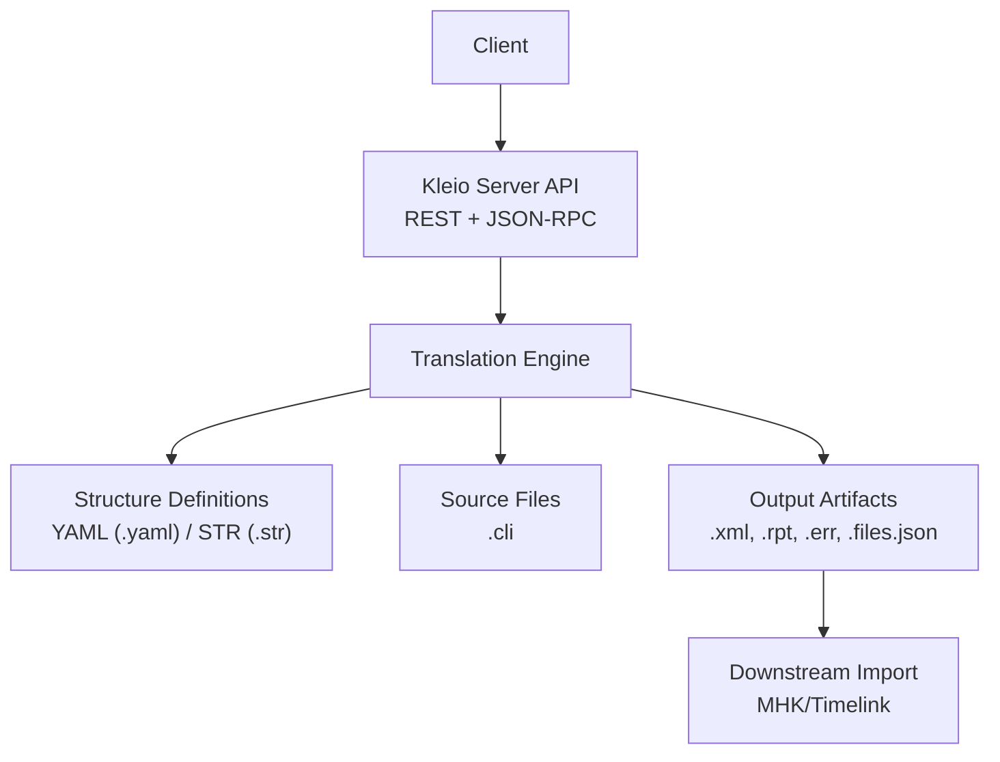
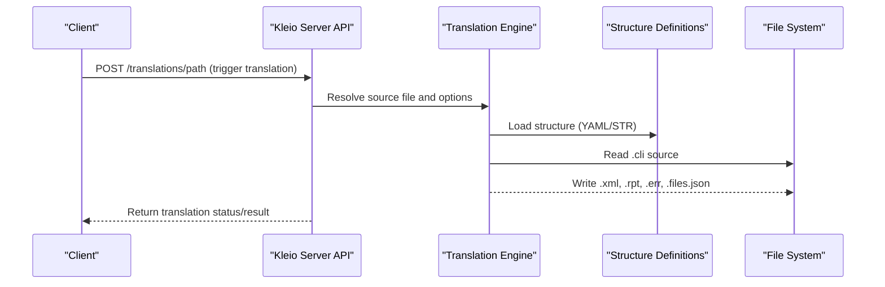
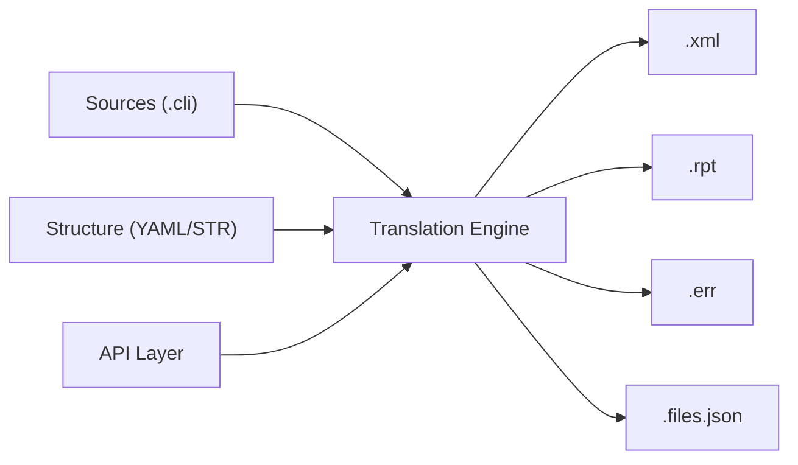

# Examples and Tutorials

<cite>
**Referenced Files in This Document**
- [README.md](file://README.md)
- [client_setup.md](file://docs/doc/client_setup.md)
- [translation_results.md](file://docs/doc/translation_results.md)
- [stru README.md](file://src/stru/README.md)
- [sources-structure.yaml](file://src/stru/sources-structure.yaml)
- [gacto2.str.yaml](file://src/stru/gacto2.str.yaml)
- [bap-com-celebrantes.cli](file://tests/kleio-home/sources/more_sources/paroquiais/baptismos/bap-com-celebrantes.cli)
- [cas1714-1722.cli](file://tests/kleio-home/sources/more_sources/paroquiais/casamentos/cas1714-1722.cli)
- [obitoShort.cli](file://tests/kleio-home/sources/more_sources/paroquiais/obitos/obitoShort.cli)
- [sample-mapping.yml](file://tests/kleio-home/mappings/sample-mapping.yml)
- [person-mapping.yml](file://tests/kleio-home/mappings/person-mapping.yml)
- [api.json](file://api/postman/api.json)
- [apiTranslations.pl](file://src/apiTranslations.pl)
</cite>

## Table of Contents
1. Introduction
2. Project Structure
3. Core Components
4. Architecture Overview
5. Detailed Component Analysis
6. Dependency Analysis
7. Performance Considerations
8. Troubleshooting Guide
9. Conclusion
10. Appendices

## Introduction
This document provides practical examples and tutorials for the Kleio translation system, focusing on historical documents such as baptism records, marriage certificates, and death registrations. It covers workflows from preparing source files to translating them and importing results into downstream systems. You will also find integration examples with external systems, custom mapping implementations, advanced configuration scenarios, best practices for organizing large collections, automation tips, and troubleshooting guidance.

The Kleio server exposes a REST and JSON-RPC API to translate sources, inspect results, export XML, manage files and structures, and perform basic Git operations. The notation is designed for concise transcription of complex historical documents and produces normalized, person-oriented data suitable for import into Timelink/MHK databases.

**Section sources**
- [README.md:1-120](file://README.md#L1-L120)

## Project Structure
At a high level, the repository contains:
- Source code for the Kleio server (SWI-Prolog) under src/
- YAML-based structure definitions under src/stru/
- Sample datasets under tests/kleio-home/sources/
- Mapping examples under tests/kleio-home/mappings/
- API documentation and Postman collection under api/postman/
- Documentation under docs/doc/

[No sources needed since this diagram shows conceptual workflow, not actual code structure]

**Section sources**
- [stru README.md:1-7](file://src/stru/README.md#L1-L7)
- [sources-structure.yaml:1-10](file://src/stru/sources-structure.yaml#L1-L10)

## Core Components
- Kleio Notation and Sources: Human-readable text files describing historical acts and entities using groups and elements.
- Structure Definitions: YAML or STR files that define allowed groups, elements, and constraints used during parsing and validation.
- Translation Engine: Converts .cli sources into normalized XML and auxiliary reports.
- API Layer: Provides endpoints to list sources, trigger translations, retrieve status/results, manage files and structures, and perform Git operations.
- Mappings: Optional YAML mappings to connect source-oriented groups to person-oriented model classes for database import.

Key sample datasets included:
- Baptism records (paroquiais/baptismos/*.cli)
- Marriage records (paroquiais/casamentos/*.cli)
- Death records (paroquiais/obitos/*.cli)

**Section sources**
- [bap-com-celebrantes.cli:1-79](file://tests/kleio-home/sources/more_sources/paroquiais/baptismos/bap-com-celebrantes.cli#L1-L79)
- [cas1714-1722.cli:1-120](file://tests/kleio-home/sources/more_sources/paroquiais/casamentos/cas1714-1722.cli#L1-L120)
- [obitoShort.cli:1-21](file://tests/kleio-home/sources/more_sources/paroquiais/obitos/obitoShort.cli#L1-L21)
- [gacto2.str.yaml:209-330](file://src/stru/gacto2.str.yaml#L209-L330)

## Architecture Overview
The Kleio server orchestrates translation by reading source files and their associated structure definitions, producing normalized XML and reports. Clients interact via REST or JSON-RPC to orchestrate these operations.

**Diagram sources**
- [apiTranslations.pl:85-166](file://src/apiTranslations.pl#L85-L166)
- [translation_results.md:1-46](file://docs/doc/translation_results.md#L1-L46)

## Detailed Component Analysis

### Tutorial 1: Translate a Baptism Record
Goal: Prepare and translate a baptism record, then review outputs.

Steps:
1. Ensure the structure definition is available. The default includes core groups and Portuguese sources.
   - Reference: [sources-structure.yaml:1-10](file://src/stru/sources-structure.yaml#L1-L10)
2. Place your .cli file under a sources directory (e.g., paroquiais/baptismos).
   - Example dataset: [bap-com-celebrantes.cli:1-79](file://tests/kleio-home/sources/more_sources/paroquiais/baptismos/bap-com-celebrantes.cli#L1-L79)
3. Trigger translation via API:
   - Use the translations endpoint to process the path containing the .cli file.
   - Reference implementation: [apiTranslations.pl:85-166](file://src/apiTranslations.pl#L85-L166)
4. Inspect outputs:
   - .xml: Person-oriented data for import
   - .rpt: Human-readable report with error lines
   - .err: Error/warning counts
   - .files.json: Summary including errors/warnings and referenced structure
   - Reference: [translation_results.md:1-46](file://docs/doc/translation_results.md#L1-L46)

Best practices:
- Keep structure definitions close to sources when possible; see stru file location guidance.
- Use prefixes and identifiers consistently to avoid collisions.

**Section sources**
- [sources-structure.yaml:1-10](file://src/stru/sources-structure.yaml#L1-L10)
- [bap-com-celebrantes.cli:1-79](file://tests/kleio-home/sources/more_sources/paroquiais/baptismos/bap-com-celebrantes.cli#L1-L79)
- [translation_results.md:1-46](file://docs/doc/translation_results.md#L1-L46)
- [apiTranslations.pl:85-166](file://src/apiTranslations.pl#L85-L166)

### Tutorial 2: Translate Marriage Certificates
Goal: Process multiple marriage entries and validate results.

Steps:
1. Organize files under paroquiais/casamentos/.
   - Example dataset: [cas1714-1722.cli:1-120](file://tests/kleio-home/sources/more_sources/paroquiais/casamentos/cas1714-1722.cli#L1-L120)
2. Confirm structure definitions include marriage-related groups.
   - Reference: [gacto2.str.yaml:209-330](file://src/stru/gacto2.str.yaml#L209-L330)
3. Trigger translation for the directory or specific file via API.
   - Reference: [apiTranslations.pl:85-166](file://src/apiTranslations.pl#L85-L166)
4. Review .rpt and .err files for issues; fix source annotations if needed.
   - Reference: [translation_results.md:1-46](file://docs/doc/translation_results.md#L1-L46)

Tips:
- Use consistent id attributes for persons to enable linkage across events.
- Leverage obs fields for contextual notes without breaking normalization.

**Section sources**
- [cas1714-1722.cli:1-120](file://tests/kleio-home/sources/more_sources/paroquiais/casamentos/cas1714-1722.cli#L1-L120)
- [gacto2.str.yaml:209-330](file://src/stru/gacto2.str.yaml#L209-L330)
- [translation_results.md:1-46](file://docs/doc/translation_results.md#L1-L46)
- [apiTranslations.pl:85-166](file://src/apiTranslations.pl#L85-L166)

### Tutorial 3: Translate Death Records
Goal: Process obituary/death records and extract key relationships.

Steps:
1. Place .cli files under paroquiais/obitos/.
   - Example dataset: [obitoShort.cli:1-21](file://tests/kleio-home/sources/more_sources/paroquiais/obitos/obitoShort.cli#L1-L21)
2. Validate structure support for death-related groups and elements.
   - Reference: [gacto2.str.yaml:209-330](file://src/stru/gacto2.str.yaml#L209-L330)
3. Run translation and check outputs.
   - Reference: [translation_results.md:1-46](file://docs/doc/translation_results.md#L1-L46)

Notes:
- Relationships like spouse or parents can be captured using rel$ subgroups where supported by the structure.

**Section sources**
- [obitoShort.cli:1-21](file://tests/kleio-home/sources/more_sources/paroquiais/obitos/obitoShort.cli#L1-L21)
- [gacto2.str.yaml:209-330](file://src/stru/gacto2.str.yaml#L209-L330)
- [translation_results.md:1-46](file://docs/doc/translation_results.md#L1-L46)

### Integration Example: External Systems via Linked Data
Kleio supports linking values to external identifiers (e.g., Wikidata). Define link targets at the top-level kleio$ group and annotate element values with @short-name:id references. During translation, these annotations are transformed into attributes suitable for downstream consumption.

Steps:
1. Declare an external target in the kleio$ group using link$.
2. Annotate element values with comments like @wikidata:Q...
3. Translate and verify generated attributes in the output XML.

References:
- Release notes describe linked data notation and transformation behavior.
  - [README.md:440-470](file://README.md#L440-L470)

**Section sources**
- [README.md:440-470](file://README.md#L440-L470)

### Custom Mapping Implementation
Mappings connect source-oriented groups to person-oriented model classes for database import. You can define new classes and map existing groups to them.

Examples:
- Sample mapping defining a custom class and mapping rules:
  - [sample-mapping.yml:1-24](file://tests/kleio-home/mappings/sample-mapping.yml#L1-L24)
- Person mapping extending base classes and attributes:
  - [person-mapping.yml:1-15](file://tests/kleio-home/mappings/person-mapping.yml#L1-L15)

Workflow:
1. Create or edit mapping YAML files under mappings/.
2. Configure the server to use your mappings when generating importable data.
3. Validate mapping effects by reviewing the resulting XML schema and content.

**Section sources**
- [sample-mapping.yml:1-24](file://tests/kleio-home/mappings/sample-mapping.yml#L1-L24)
- [person-mapping.yml:1-15](file://tests/kleio-home/mappings/person-mapping.yml#L1-L15)

### Advanced Configuration Scenarios
- Multiple-entry flag: Set a property to change how multiple entries are separated within fields.
  - [README.md:383-400](file://README.md#L383-L400)
- Structure file location flexibility: Place structure files near sources for easier maintenance.
  - [README.md:483-495](file://README.md#L483-L495)
- Client setup and token management: Obtain kleio_home, kleio_url, and kleio_admin_token for clients.
  - [client_setup.md:1-120](file://docs/doc/client_setup.md#L1-L120)

**Section sources**
- [README.md:383-400](file://README.md#L383-L400)
- [README.md:483-495](file://README.md#L483-L495)
- [client_setup.md:1-120](file://docs/doc/client_setup.md#L1-L120)

### Best Practices for Large Collections
- Organize by source type and locality (e.g., paroquiais/baptismos, paroquiais/casamentos).
- Use consistent prefixes and ids to avoid conflicts and improve traceability.
- Keep structure definitions modular and versioned alongside sources.
- Maintain .files.json artifacts to track which structure was used per translation.

[No sources needed since this section provides general guidance]

### Automated Pipelines
- Use the API to batch-translate directories and poll for status.
- Integrate with CI/CD to run translations on commits and publish reports.
- Leverage caching in the API to efficiently query statuses for large sets.
  - [apiTranslations.pl:85-166](file://src/apiTranslations.pl#L85-L166)

**Section sources**
- [apiTranslations.pl:85-166](file://src/apiTranslations.pl#L85-L166)

### Migration Guides from Other Transcription Systems
- Map legacy field names to Kleio elements using structure definitions and mappings.
- Convert existing IDs to Kleio id attributes to preserve cross-references.
- Validate incremental migrations by comparing .rpt and .err outputs against reference runs.

[No sources needed since this section provides general guidance]

## Dependency Analysis
The translation pipeline depends on:
- Structure definitions (YAML/STR) for validation and normalization
- Source files (.cli) for input data
- API layer for orchestration and status reporting
- Output artifacts (.xml, .rpt, .err, .files.json) for import and inspection

**Diagram sources**
- [apiTranslations.pl:85-166](file://src/apiTranslations.pl#L85-L166)
- [translation_results.md:1-46](file://docs/doc/translation_results.md#L1-L46)

**Section sources**
- [apiTranslations.pl:85-166](file://src/apiTranslations.pl#L85-L166)
- [translation_results.md:1-46](file://docs/doc/translation_results.md#L1-L46)

## Performance Considerations
- Use the API’s status caching for large directories to reduce recomputation.
- Prefer targeted paths to minimize scanning overhead.
- Monitor .files.json for errors/warnings to quickly identify bottlenecks.

[No sources needed since this section provides general guidance]

## Troubleshooting Guide
Common issues and resolutions:
- Errors/warnings in .err and .rpt:
  - Check line numbers reported in .rpt and correct source annotations.
  - Verify structure compatibility for groups/elements used.
- Missing or incorrect structure:
  - Ensure the correct .str or .yaml is referenced and accessible.
- Token and client configuration:
  - Confirm kleio_url and kleio_admin_token are set correctly.
  - Use .kleio.json to discover runtime parameters.

References:
- Translation result artifacts and meanings:
  - [translation_results.md:1-46](file://docs/doc/translation_results.md#L1-L46)
- Client setup and token discovery:
  - [client_setup.md:1-120](file://docs/doc/client_setup.md#L1-L120)

**Section sources**
- [translation_results.md:1-46](file://docs/doc/translation_results.md#L1-L46)
- [client_setup.md:1-120](file://docs/doc/client_setup.md#L1-L120)

## Conclusion
With structured source files, robust YAML/STR definitions, and a flexible API, the Kleio translation system enables efficient processing of historical records. By following the tutorials and best practices here, you can build reliable pipelines for baptisms, marriages, and deaths, integrate with external systems through linked data, and customize mappings for your database needs.

[No sources needed since this section summarizes without analyzing specific files]

## Appendices

### API Quick Start
- Explore endpoints and examples in the Postman collection:
  - [api.json:1-200](file://api/postman/api.json#L1-L200)

**Section sources**
- [api.json:1-200](file://api/postman/api.json#L1-L200)