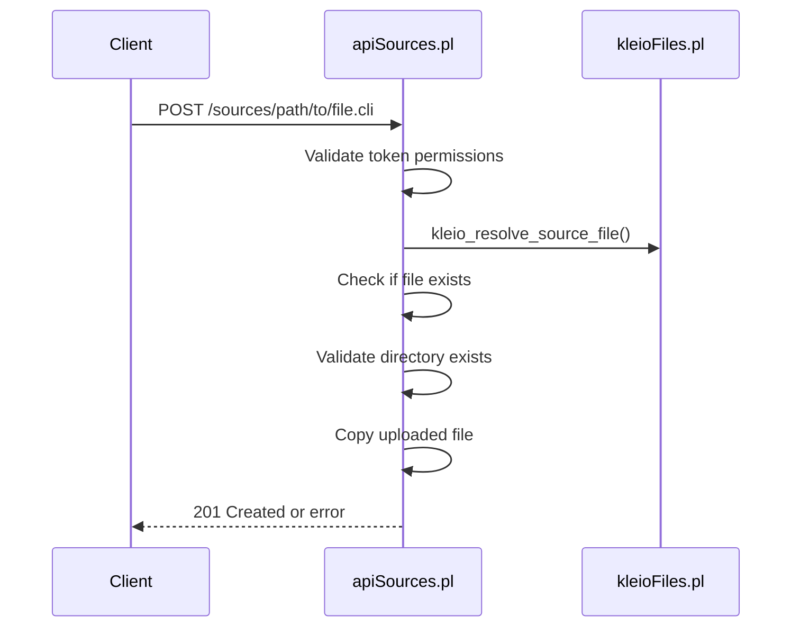
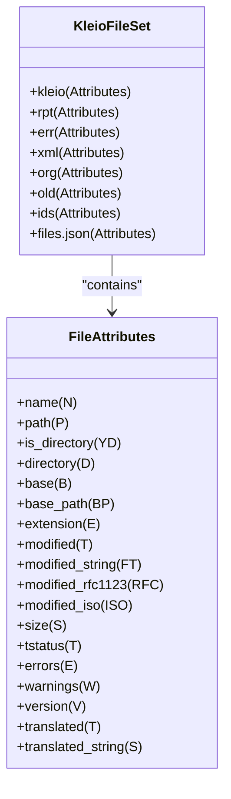
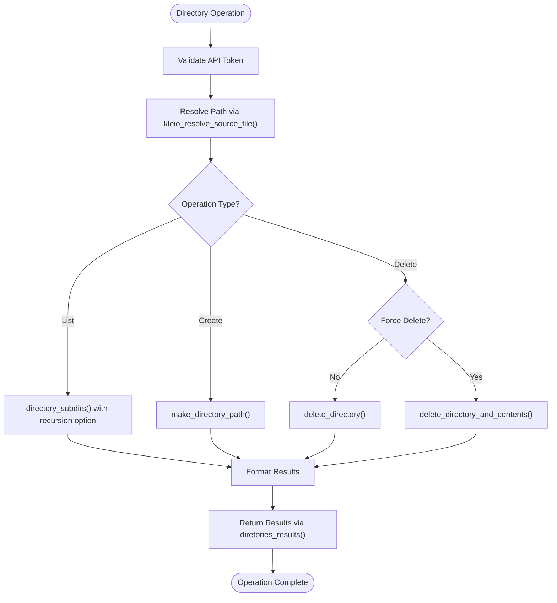
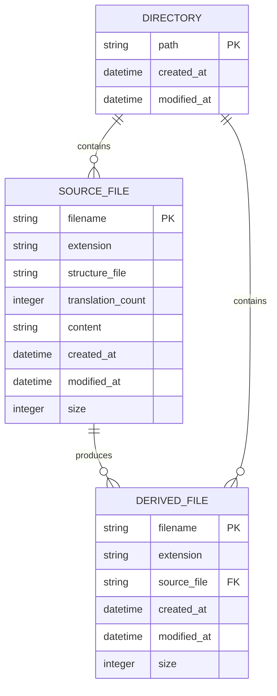
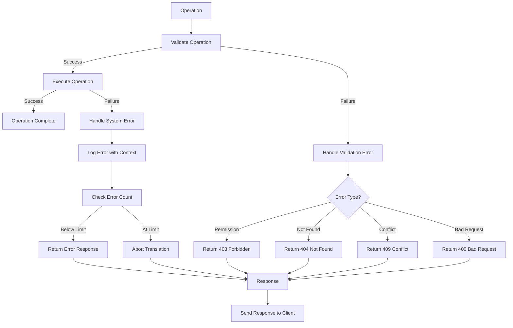

# File Management

<cite>
**Referenced Files in This Document**   
- [apiSources.pl](file://src/apiSources.pl)
- [kleioFiles.pl](file://src/kleioFiles.pl)
- [apiDirectories.pl](file://src/apiDirectories.pl)
- [restServer.pl](file://src/restServer.pl)
- [errors.pl](file://src/errors.pl)
- [logging.pl](file://src/logging.pl)
- [tests/kleio-home/sources/api/issue15/issue15.cli](file://tests/kleio-home/sources/api/issue15/issue15.cli)
- [tests/kleio-home/sources/more_sources/soure/documents/Chancelarias/J5.cli](file://tests/kleio-home/sources/more_sources/soure/documents/Chancelarias/J5.cli)
- [tests/kleio-home/sources/reference_sources/issues/issue1/issue1.cli](file://tests/kleio-home/sources/reference_sources/issues/issue1/issue1.cli)
- [tests/kleio-home/sources/reference_sources/issues/issue10/issue10.cli](file://tests/kleio-home/sources/reference_sources/issues/issue10/issue10.cli)
</cite>

## Table of Contents
1. [Introduction](#introduction)
2. [File Operations via REST API](#file-operations-via-rest-api)
3. [Internal File Representation](#internal-file-representation)
4. [Directory Management](#directory-management)
5. [Storage Mechanisms](#storage-mechanisms)
6. [File Structure and Naming Conventions](#file-structure-and-naming-conventions)
7. [Error Handling](#error-handling)
8. [Permission Management](#permission-management)
9. [Performance Considerations](#performance-considerations)
10. [Troubleshooting Common Issues](#troubleshooting-common-issues)

## Introduction
The timelink-kleio system provides comprehensive file management capabilities for handling source files (.cli) through a REST API interface. This documentation details how source files are managed, including upload, download, deletion, and directory operations. The system supports organizational workflows through structured directory management and integrates with the underlying filesystem for persistent storage. The file operations are designed to support historical data processing workflows, with special attention to error handling, permission management, and performance optimization for bulk operations.

**Section sources**
- [apiSources.pl](file://src/apiSources.pl#L1-L425)
- [kleioFiles.pl](file://src/kleioFiles.pl#L1-L933)

## File Operations via REST API

The timelink-kleio system exposes file operations through a comprehensive REST API that supports standard HTTP methods for managing source files. The API is implemented in the `apiSources.pl` module and provides endpoints for uploading, downloading, deleting, copying, and moving source files.

### Upload Operations
File uploads are performed using HTTP POST requests with multipart encoding. The API validates that the destination file does not already exist when using POST (create operation). The upload process involves:
- Checking API permissions for upload operations
- Resolving the destination path relative to the user's sources directory
- Validating that the target directory exists
- Copying the uploaded file to the destination

**Diagram sources**
- [apiSources.pl](file://src/apiSources.pl#L125-L142)
- [kleioFiles.pl](file://src/kleioFiles.pl#L753-L782)

### Download Operations
File downloads are handled through HTTP GET requests. When requesting a specific file, the API returns the file content directly. For directory requests, the API returns a list of .cli and .kleio files in that directory. The response format depends on the Accept header:
- For `Accept: application/json`, returns a link to download the file
- For other formats, returns the file content directly

The API supports optional parameters:
- `url=yes`: Returns a list of links to retrieve files
- `recurse=yes`: Recursively examines the directory tree

### Delete Operations
File deletion is performed using HTTP DELETE requests. The system handles both file and directory deletion:
- For files: Deletes the source file and all derived artifacts (rpt, err, xml, org, ids, files.json, old)
- For directories: Deletes all files in the directory, with optional recursion into subdirectories

The API prevents deletion of files that are currently being processed or queued for processing.

### Copy and Move Operations
The system supports file copying and moving through specific API patterns:
- **Copy**: POST request with `origin` parameter specifying the source file
- **Move**: PUT request with `origin` parameter specifying the source file

Both operations validate that the destination does not exist and that the target directory is valid.

**Section sources**
- [apiSources.pl](file://src/apiSources.pl#L89-L422)

## Internal File Representation

The system maintains a rich internal representation of files through the `kleio_file_set` predicates in the `kleioFiles.pl` module. Each source file (.cli) is associated with multiple derived files that represent different aspects of the translation process.

### File Set Structure
For each source file, the system manages a set of related files:
- **.cli**: The original source file
- **.rpt**: Report of the translation in human-readable form
- **.err**: Summary of errors and warnings in machine-readable form
- **.xml**: Exported data from the Kleio file
- **.org**: Original file before the first translation (without explicit IDs)
- **.old**: Previous version of the file
- **.ids**: Temporary file for ID management
- **files.json**: JSON representation of file relationships

**Diagram sources**
- [kleioFiles.pl](file://src/kleioFiles.pl#L69-L92)

### File Status Management
The system tracks the translation status of each file through the `kleio_file_status/2` predicate. The status represents the state in the translation pipeline:
- **T**: Needs translation (either no rpt file or existing rpt older than kleio file)
- **E**: Was last translated with errors
- **W**: Was last translated with warnings
- **V**: File has a valid translation and can be imported

The status determination follows a priority order: T > E > W > V, ensuring the most relevant state is reported.

**Section sources**
- [kleioFiles.pl](file://src/kleioFiles.pl#L156-L165)

## Directory Management

Directory operations are handled by the `apiDirectories.pl` module, which provides REST endpoints for listing, creating, copying, and removing directories. These operations support organizational workflows by enabling structured file organization.

### Directory Operations
The API supports the following directory operations:
- **List**: GET request to retrieve subdirectories
- **Create**: POST request to create a new directory
- **Delete**: DELETE request to remove a directory
- **Copy**: POST request with origin parameter to copy a directory

### Directory Listing
The `directories_get` function lists subdirectories under a given path. It supports recursive listing through the `recurse` parameter. The implementation uses the `directory_subdirs/3` predicate to traverse the directory tree.

### Directory Creation and Removal
Directory creation uses `make_directory_path/1` to ensure all parent directories exist. Directory removal can be performed with or without contents:
- Without force parameter: Fails if directory is not empty
- With force parameter: Removes directory and all contents

**Diagram sources**
- [apiDirectories.pl](file://src/apiDirectories.pl#L18-L167)
- [kleioFiles.pl](file://src/kleioFiles.pl#L278-L283)

**Section sources**
- [apiDirectories.pl](file://src/apiDirectories.pl#L1-L167)

## Storage Mechanisms

The timelink-kleio system implements a hierarchical storage mechanism that integrates with the underlying filesystem while providing abstraction layers for security and portability.

### Home Directory Resolution
The system determines the home directory through a cascading resolution process that checks multiple potential locations:
1. Environment variable `KLEIO_HOME_DIR`
2. Standard container mount points (`/kleio-home`, `/timelink-home`, `/mhk-home`)
3. Current directory structure (checking for system, sources/projects, and users directories)
4. Standard subdirectories (`./kleio-home`, `./tests/kleio-home`)
5. User home directory (`~/kleio-home`, `~/timelink-home`)

This flexible resolution allows the system to operate in various deployment environments, from development to production containers.

### Directory Structure
The system expects a specific directory structure within the home directory:
- **system/conf/kleio**: Configuration information and token database
- **sources** or **projects**: Base directory for source files
- **users**: Base directory for user-specific information
- **system/logs/kleio**: Log files directory

Environment variables can override these defaults:
- `KLEIO_SOURCE_DIR`: Source files directory
- `KLEIO_CONF_DIR`: Configuration directory
- `KLEIO_LOG_DIR`: Log files directory
- `KLEIO_STRU_DIR`: Structure files directory

### File Path Resolution
The system uses relative path resolution to maintain security and portability. The `kleio_resolve_source_file/3` predicate converts between relative and absolute paths using token information. This ensures that API responses do not expose absolute filesystem paths, mitigating security risks.

**Section sources**
- [kleioFiles.pl](file://src/kleioFiles.pl#L422-L551)

## File Structure and Naming Conventions

The system follows consistent file structure and naming conventions, as evidenced by the test files in the `tests/kleio-home/sources/` directory.

### Source File Structure
Source files (.cli) follow a hierarchical structure with specific syntax:
- First line specifies the structure file and translation count: `kleio$gacto2.str/translations=9`
- Subsequent lines represent entities with the format: `entity$type$id=value`
- Indentation indicates hierarchical relationships
- Special fields like `obs`, `resumo`, and `loc` provide metadata

### Directory Organization
The test files demonstrate a logical directory organization based on document types and sources:
- **Chancelarias**: Chancery documents organized by identifier (J5, Xpto)
- **baptismos**: Baptism records organized chronologically (b1685.cli, b1686.cli, etc.)
- **casamentos**: Marriage records
- **obitos**: Death records
- **notariais**: Notarial documents
- **paroquiais**: Parochial records

This organization supports workflow efficiency by grouping related documents together.

### Naming Patterns
Common naming patterns include:
- **Chronological naming**: Files named by year (b1685.cli, b1686.cli)
- **Source-based naming**: Files named after source identifiers (J5.cli, Xpto.cli)
- **Issue-based naming**: Test files named after issue numbers (issue15.cli, issue21.cli)
- **Descriptive naming**: Files with descriptive names indicating content (wicki-jesuiten-indienfahrer.cli)

**Diagram sources**
- [tests/kleio-home/sources/more_sources/soure/documents/Chancelarias/J5.cli](file://tests/kleio-home/sources/more_sources/soure/documents/Chancelarias/J5.cli)
- [tests/kleio-home/sources/api/issue15/issue15.cli](file://tests/kleio-home/sources/api/issue15/issue15.cli)
- [tests/kleio-home/sources/reference_sources/issues/issue1/issue1.cli](file://tests/kleio-home/sources/reference_sources/issues/issue1/issue1.cli)

**Section sources**
- [tests/kleio-home/sources/more_sources/soure/documents/Chancelarias/J5.cli](file://tests/kleio-home/sources/more_sources/soure/documents/Chancelarias/J5.cli)
- [tests/kleio-home/sources/api/issue15/issue15.cli](file://tests/kleio-home/sources/api/issue15/issue15.cli)
- [tests/kleio-home/sources/reference_sources/issues/issue1/issue1.cli](file://tests/kleio-home/sources/reference_sources/issues/issue1/issue1.cli)
- [tests/kleio-home/sources/reference_sources/issues/issue10/issue10.cli](file://tests/kleio-home/sources/reference_sources/issues/issue10/issue10.cli)

## Error Handling

The system implements comprehensive error handling for file operations through multiple layers of validation and reporting.

### API-Level Error Handling
The REST API validates operations and returns appropriate HTTP status codes:
- **404 Not Found**: When requested file or directory does not exist
- **403 Forbidden**: When token lacks required permissions
- **400 Bad Request**: When request parameters are invalid
- **409 Conflict**: When destination file already exists

Specific error conditions include:
- Attempting to upload a file that already exists (POST)
- Attempting to update a non-existent file (PUT)
- Attempting to delete a file that is being processed
- Directory operations on non-empty directories without force parameter

### System-Level Error Reporting
The `errors.pl` module provides structured error reporting with context information:
- Error messages include file name and line number
- Context information captures the current and previous line text
- Error counts are maintained and can trigger translation abortion
- Warnings are distinguished from errors in reporting

The system limits the maximum number of errors (default 100) to prevent infinite error loops during translation.

**Diagram sources**
- [apiSources.pl](file://src/apiSources.pl#L89-L177)
- [errors.pl](file://src/errors.pl#L85-L220)

**Section sources**
- [apiSources.pl](file://src/apiSources.pl#L89-L177)
- [errors.pl](file://src/errors.pl#L85-L220)

## Permission Management

The system implements role-based access control through token-based authentication, with different permission levels for file operations.

### Token-Based Permissions
Operations are authorized based on token permissions:
- **files**: Required for GET operations (read access)
- **delete**: Required for DELETE operations
- **upload**: Required for POST and PUT operations (create/update access)
- **mkdir**: Required for directory creation

The `is_api_allowed/2` predicate checks if a token has the required permission for an operation.

### Security Considerations
The system implements several security measures:
- Path resolution prevents directory traversal attacks
- Relative paths in API responses prevent exposure of absolute filesystem structure
- Token-based authentication ensures only authorized users can perform operations
- Permission checks are performed at the API entry point

### Authentication Flow
The authentication process involves:
1. Extracting the authorization token from the request
2. Validating the token against the token database
3. Checking if the token has required permissions for the operation
4. Attaching token information to the request context for path resolution

**Section sources**
- [apiSources.pl](file://src/apiSources.pl#L89-L136)
- [apiDirectories.pl](file://src/apiDirectories.pl#L18-L43)

## Performance Considerations

The system includes several performance optimizations for file operations, particularly important for bulk operations.

### Bulk Operation Efficiency
For directory operations, the system uses efficient filesystem operations:
- **Listing**: Uses shell `find` command with appropriate patterns to efficiently locate files by extension
- **Deletion**: Processes files in batches, collecting results before returning
- **Copying**: Uses direct file copy operations without intermediate buffering

### Caching Mechanisms
The system implements caching for frequently accessed file metadata:
- Error file attributes are cached to avoid repeated parsing
- File status calculations are optimized to minimize filesystem access
- Directory listings can be cached based on modification times

### Concurrency Handling
The system manages concurrent access through:
- Atomic file operations where possible
- Proper error handling for race conditions
- Status tracking to prevent operations on files being processed

For bulk operations involving many files, the system processes files sequentially within a single request but allows multiple requests to be handled concurrently by different server workers.

**Section sources**
- [kleioFiles.pl](file://src/kleioFiles.pl#L219-L224)
- [apiSources.pl](file://src/apiSources.pl#L294-L320)

## Troubleshooting Common Issues

This section addresses common file-related issues and their solutions.

### Encoding Problems
Source files should be UTF-8 encoded. Issues may arise when:
- Files contain non-UTF-8 characters
- Line endings are inconsistent (Windows vs. Unix)
- Byte order marks (BOM) are present

**Solutions**:
- Convert files to UTF-8 encoding
- Standardize line endings to Unix format
- Remove BOM if present

### Path Resolution Errors
Path resolution issues typically occur due to:
- Incorrect token configuration
- Missing directory structure
- Permission issues on directories

**Solutions**:
- Verify token configuration with correct sources path
- Ensure required directories exist and are writable
- Check file permissions on the filesystem

### Concurrency Conflicts
Concurrency issues may arise when:
- Multiple processes attempt to modify the same file
- A file is being processed while deletion is requested
- Directory operations conflict with file operations

**Solutions**:
- Implement proper locking mechanisms
- Check file status before operations
- Use atomic operations where possible
- Implement retry logic for transient conflicts

### Common Error Scenarios
| Error Scenario | Symptoms | Resolution |
|----------------|---------|------------|
| File already exists | 409 Conflict on upload | Use PUT for update or delete first |
| Directory not empty | Delete fails | Use force parameter or delete contents first |
| Permission denied | 403 Forbidden | Check token permissions |
| Path not found | 404 Not Found | Verify path and token configuration |
| Invalid token | 401 Unauthorized | Generate new token with proper permissions |

**Section sources**
- [apiSources.pl](file://src/apiSources.pl#L341-L346)
- [apiDirectories.pl](file://src/apiDirectories.pl#L122-L124)
- [errors.pl](file://src/errors.pl#L85-L220)