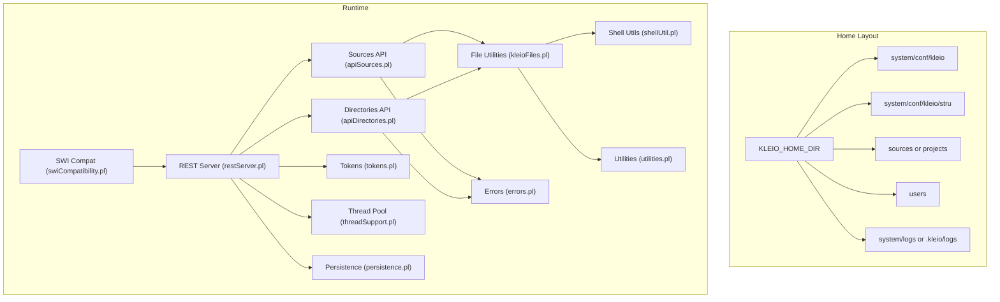
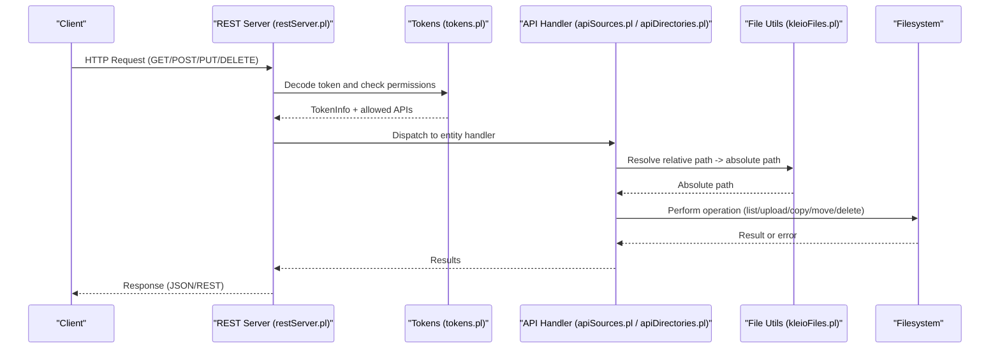
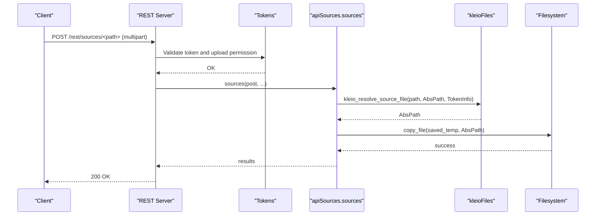
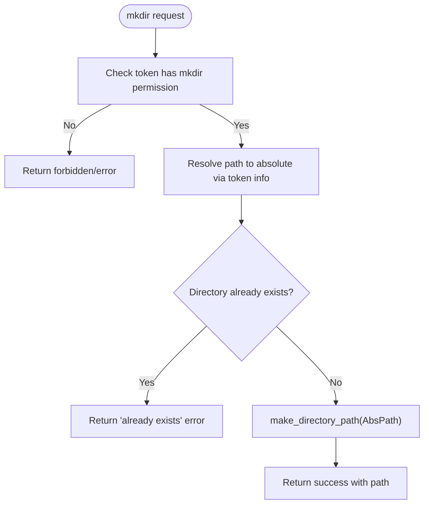
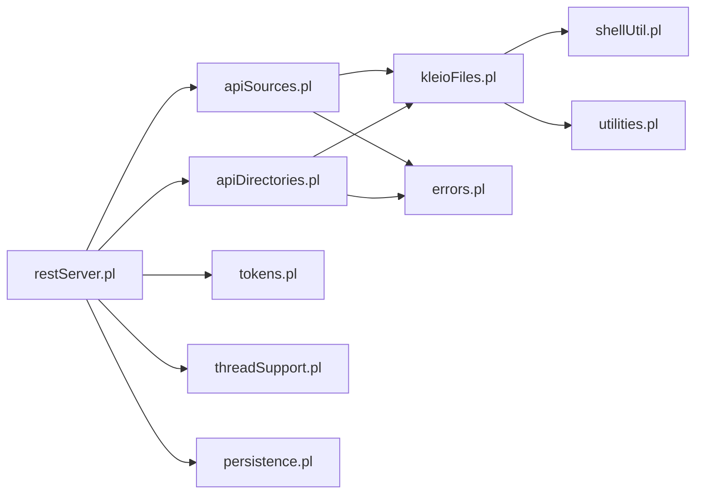

# File Management

<cite>
**Referenced Files in This Document**
- [kleioFiles.pl](file://src/kleioFiles.pl)
- [apiSources.pl](file://src/apiSources.pl)
- [apiDirectories.pl](file://src/apiDirectories.pl)
- [restServer.pl](file://src/restServer.pl)
- [tokens.pl](file://src/tokens.pl)
- [threadSupport.pl](file://src/threadSupport.pl)
- [persistence.pl](file://src/persistence.pl)
- [swiCompatibility.pl](file://src/swiCompatibility.pl)
- [shellUtil.pl](file://src/shellUtil.pl)
- [utilities.pl](file://src/utilities.pl)
- [errors.pl](file://src/errors.pl)
</cite>

## Table of Contents
1. [Introduction](#introduction)
2. [Project Structure](#project-structure)
3. [Core Components](#core-components)
4. [Architecture Overview](#architecture-overview)
5. [Detailed Component Analysis](#detailed-component-analysis)
6. [Dependency Analysis](#dependency-analysis)
7. [Performance Considerations](#performance-considerations)
8. [Troubleshooting Guide](#troubleshooting-guide)
9. [Conclusion](#conclusion)
10. [Appendices](#appendices)

## Introduction
This document explains how Kleio manages files for translation workflows: where source and structure files live, how outputs are organized, how uploads/downloads work securely, how directories are manipulated with permission controls, and how paths are resolved. It also covers backup/recovery guidance, security considerations, file locking, performance for bulk operations and concurrent access, and best practices for organizing large historical collections and integrating version control.

## Project Structure
Kleio organizes data around a “home” directory that contains configuration, sources, structures, logs, and user-specific areas. The server resolves absolute paths from relative paths using token-scoped options to enforce isolation and security.

**Diagram sources**
- [restServer.pl:300-350](file://src/restServer.pl#L300-L350)
- [apiSources.pl:1-120](file://src/apiSources.pl#L1-L120)
- [apiDirectories.pl:1-90](file://src/apiDirectories.pl#L1-L90)
- [kleioFiles.pl:468-772](file://src/kleioFiles.pl#L468-L772)
- [tokens.pl:104-176](file://src/tokens.pl#L104-L176)
- [threadSupport.pl:31-63](file://src/threadSupport.pl#L31-L63)
- [persistence.pl:1-31](file://src/persistence.pl#L1-L31)
- [swiCompatibility.pl:205-230](file://src/swiCompatibility.pl#L205-L230)
- [shellUtil.pl:11-45](file://src/shellUtil.pl#L11-L45)
- [utilities.pl:1-40](file://src/utilities.pl#L1-L40)
- [errors.pl:62-113](file://src/errors.pl#L62-L113)

**Section sources**
- [kleioFiles.pl:468-772](file://src/kleioFiles.pl#L468-L772)
- [restServer.pl:300-350](file://src/restServer.pl#L300-L350)

## Core Components
- Path resolution and home discovery:
  - Home directory detection and defaults for conf, stru, sources, logs, tokens.
  - Relative-to-absolute path resolution scoped by token options.
- Source file management:
  - Upload (POST multipart), update (PUT multipart), copy (POST origin=...), move (PUT origin=...), delete, list, download.
- Directory management:
  - List, create, copy, remove directories with permission checks.
- Output artifacts:
  - For each .cli/.kleio input, related outputs include rpt, err, xml, org, old, ids, files.json.
- Security and permissions:
  - Token-based authorization, upload allowance, and API endpoint scoping.
- Concurrency:
  - Worker pool/message queue for translations; shared properties for caching.
- File locking:
  - Write locks via SWI compatibility layer when opening streams.

**Section sources**
- [kleioFiles.pl:53-131](file://src/kleioFiles.pl#L53-L131)
- [apiSources.pl:89-177](file://src/apiSources.pl#L89-L177)
- [apiDirectories.pl:18-88](file://src/apiDirectories.pl#L18-L88)
- [tokens.pl:249-257](file://src/tokens.pl#L249-L257)
- [threadSupport.pl:31-63](file://src/threadSupport.pl#L31-L63)
- [swiCompatibility.pl:222-230](file://src/swiCompatibility.pl#L222-L230)

## Architecture Overview
The REST/JSON-RPC server receives requests, decodes them, validates tokens, resolves paths within the user’s sandbox, and dispatches to entity handlers. Handlers use kleioFiles utilities for filesystem operations and tokens for authorization.

**Diagram sources**
- [restServer.pl:491-515](file://src/restServer.pl#L491-L515)
- [restServer.pl:547-579](file://src/restServer.pl#L547-L579)
- [tokens.pl:141-176](file://src/tokens.pl#L141-L176)
- [apiSources.pl:89-120](file://src/apiSources.pl#L89-L120)
- [apiDirectories.pl:18-35](file://src/apiDirectories.pl#L18-L35)
- [kleioFiles.pl:772-800](file://src/kleioFiles.pl#L772-L800)

## Detailed Component Analysis

### Path Resolution and Home Discovery
- Home directory is discovered from environment variables and standard locations. Defaults include system/conf/kleio, sources/projects, users, and logs.
- Configuration, token database, default structure, and log directories are resolved with fallbacks and auto-creation where appropriate.
- User-scoped base directories can be derived from token options (e.g., sources(S), structures(S)).
- Relative paths are converted to absolute paths using token info, ensuring clients never receive absolute paths directly.

Key behaviors:
- kleio_home_dir/1: multi-strategy discovery.
- kleio_conf_dir/1, kleio_token_db/1, kleio_default_stru/1, kleio_log_dir/1: deterministic resolution with env overrides.
- kleio_user_source_dir/2, kleio_user_structure_dir/2: compute per-user bases from token options.
- kleio_resolve_source_file/3, kleio_resolve_source_list/3: map relative to absolute and back safely.

**Section sources**
- [kleioFiles.pl:468-772](file://src/kleioFiles.pl#L468-L772)
- [kleioFiles.pl:772-800](file://src/kleioFiles.pl#L772-L800)

### Source File Operations (Upload, Download, Copy, Move, Delete, List)
- GET /rest/sources/path:
  - If path is a file: returns file content (REST) or a download link (JSON).
  - If path is a directory: lists .cli/.kleio files; optional recurse=yes.
- POST /rest/sources/path (multipart): upload new file; fails if destination exists.
- PUT /rest/sources/path (multipart): update existing file; fails if destination does not exist.
- POST /rest/sources/path?origin=...: copy file.
- PUT /rest/sources/path?origin=...: move file (copy then delete original artifacts).
- DELETE /rest/sources/path: delete file or directory (and derived artifacts).

Security:
- Requires token with appropriate API permissions (files, upload, delete).
- Paths are resolved through kleio_resolve_source_file/3 to enforce sandboxing.

Outputs:
- Translation produces associated artifacts: rpt, err, xml, org, old, ids, files.json.

**Section sources**
- [apiSources.pl:89-177](file://src/apiSources.pl#L89-L177)
- [apiSources.pl:212-233](file://src/apiSources.pl#L212-L233)
- [apiSources.pl:257-285](file://src/apiSources.pl#L257-L285)
- [apiSources.pl:287-320](file://src/apiSources.pl#L287-L320)
- [apiSources.pl:324-425](file://src/apiSources.pl#L324-L425)
- [kleioFiles.pl:53-131](file://src/kleioFiles.pl#L53-L131)

#### Sequence: Secure Upload Flow

**Diagram sources**
- [restServer.pl:547-579](file://src/restServer.pl#L547-L579)
- [apiSources.pl:125-143](file://src/apiSources.pl#L125-L143)
- [apiSources.pl:324-352](file://src/apiSources.pl#L324-L352)
- [kleioFiles.pl:772-800](file://src/kleioFiles.pl#L772-L800)

### Directory Operations (List, Create, Copy, Remove)
- GET /rest/directories/path: list immediate subdirectories; recurse=yes for full tree.
- POST /rest/directories/path: create directory.
- POST /rest/directories/path?origin=...: copy directory.
- DELETE /rest/directories/path: remove directory (optionally force contents removal).

Permissions:
- mkdir requires mkdir permission; rmdir requires delete permission.

**Section sources**
- [apiDirectories.pl:18-35](file://src/apiDirectories.pl#L18-L35)
- [apiDirectories.pl:47-70](file://src/apiDirectories.pl#L47-L70)
- [apiDirectories.pl:119-147](file://src/apiDirectories.pl#L119-L147)
- [apiDirectories.pl:161-167](file://src/apiDirectories.pl#L161-L167)

#### Flowchart: Directory Creation

**Diagram sources**
- [apiDirectories.pl:119-129](file://src/apiDirectories.pl#L119-L129)

### Output Artifacts and Status
- kleio_file_set/2 enumerates related artifacts for a given source file:
  - kleio, rpt, err, xml, org, old, ids, files.json.
- kleio_file_status/2 computes status: T (needs translation), E (errors), W (warnings), V (valid), D (directory).
- Attributes include timestamps, sizes, and for err files: errors, warnings, translator version, translated time.

**Section sources**
- [kleioFiles.pl:53-131](file://src/kleioFiles.pl#L53-L131)
- [kleioFiles.pl:167-206](file://src/kleioFiles.pl#L167-L206)
- [kleioFiles.pl:333-415](file://src/kleioFiles.pl#L333-L415)

### Security and Authorization
- Tokens encode username, allowed API endpoints, and constraints (e.g., life_span).
- decode_token/3 validates tokens and returns options including data_dir and stru_dir.
- is_api_allowed/2 checks whether an endpoint is permitted.
- Admin bootstrap token handling supports initial setup.

**Section sources**
- [tokens.pl:104-176](file://src/tokens.pl#L104-L176)
- [tokens.pl:249-257](file://src/tokens.pl#L249-L257)
- [restServer.pl:547-579](file://src/restServer.pl#L547-L579)

### Concurrency and Job Scheduling
- threadSupport creates workers and posts jobs via message queue or thread pool.
- post_job/2 enqueues goals; exec_goal/1 runs them, tracking queued/processing state.
- Useful for parallel translation across many files.

**Section sources**
- [threadSupport.pl:31-63](file://src/threadSupport.pl#L31-L63)
- [threadSupport.pl:104-125](file://src/threadSupport.pl#L104-L125)

### File Locking and Safe Writes
- swiCompatibility opens write streams with lock(write), wait(true) to prevent concurrent writes.
- This ensures safe updates during uploads and translation output generation.

**Section sources**
- [swiCompatibility.pl:222-230](file://src/swiCompatibility.pl#L222-L230)

### Shell Integration and Utilities
- shellUtil provides shell_to_list/3 for executing commands and capturing output safely via temp files.
- utilities provides helper predicates used across modules.

**Section sources**
- [shellUtil.pl:11-45](file://src/shellUtil.pl#L11-L45)
- [utilities.pl:1-40](file://src/utilities.pl#L1-L40)

## Dependency Analysis
High-level dependencies among core components:

**Diagram sources**
- [restServer.pl:151-166](file://src/restServer.pl#L151-L166)
- [apiSources.pl:19-26](file://src/apiSources.pl#L19-L26)
- [apiDirectories.pl:12-15](file://src/apiDirectories.pl#L12-L15)
- [kleioFiles.pl:35-39](file://src/kleioFiles.pl#L35-L39)

**Section sources**
- [restServer.pl:151-166](file://src/restServer.pl#L151-L166)
- [apiSources.pl:19-26](file://src/apiSources.pl#L19-L26)
- [apiDirectories.pl:12-15](file://src/apiDirectories.pl#L12-L15)
- [kleioFiles.pl:35-39](file://src/kleioFiles.pl#L35-L39)

## Performance Considerations
- Bulk listing:
  - Use recurse=no for shallow listings; enable recurse=yes only when necessary.
  - Prefer URL links (url=yes) for large sets to avoid transferring long lists.
- Parallel translations:
  - Use spawn=yes to distribute work across workers; ensure single-worker mode (spawn=no) in multi-user environments to share resources fairly.
- Caching:
  - Translation status responses cache results keyed by path, recurse flag, and token to reduce repeated scans.
- Attribute caching:
  - more_attributes caches err-file metadata keyed by modification time to avoid re-parsing.
- I/O efficiency:
  - Avoid unnecessary stat calls; rely on kleio_file_set/2 which aggregates attributes efficiently.

[No sources needed since this section provides general guidance]

## Troubleshooting Guide
Common issues and diagnostics:
- Forbidden or method_not_allowed:
  - Ensure token includes required API permissions (files, upload, delete, mkdir).
- Not found:
  - Verify path resolution under the user’s sources directory; confirm existence after kleio_resolve_source_file/3.
- Destination exists / directory not empty:
  - For copy/move, destination must not exist; for rmdir, either use force(contents=yes) or clear contents first.
- Upload failures:
  - POST requires non-existing destination; PUT requires existing destination; ensure directory exists before upload.
- Logging:
  - Check server logs configured via KLEIO_LOG_DIR or .kleio/logs.
- Error reporting:
  - errors module tracks counts and context; review reports generated alongside translations.

**Section sources**
- [apiSources.pl:89-177](file://src/apiSources.pl#L89-L177)
- [apiDirectories.pl:119-147](file://src/apiDirectories.pl#L119-L147)
- [errors.pl:62-113](file://src/errors.pl#L62-L113)

## Conclusion
Kleio’s file management layer combines secure path resolution, token-based authorization, robust REST/JSON-RPC APIs, and efficient concurrency patterns. By adhering to the recommended organization and operational guidelines, teams can manage large historical document collections reliably and performantly.

[No sources needed since this section summarizes without analyzing specific files]

## Appendices

### Backup and Recovery Procedures
- Back up:
  - Entire KLEIO_HOME_DIR (including sources, structures, logs, and token_db).
  - Version-controlled repositories under sources should be backed up via their native mechanisms.
- Restore:
  - Restore KLEIO_HOME_DIR and restart the server; tokens will be reattached automatically.
- Incremental strategy:
  - Use git for sources and structures; snapshot logs periodically; maintain periodic snapshots of token_db.

[No sources needed since this section provides general guidance]

### Organizing Large Collections
- Recommended layout:
  - Group by collection type (e.g., paroquiais, notariais) and further by year or series.
  - Keep structure definitions under structures/ and reference them via kleio= parameter or token options.
- Naming conventions:
  - Consistent naming aids find_files_with_extension/2 and globbing.
- Metadata:
  - Maintain identification files and mappings under identifications/ and mappings/ respectively.

[No sources needed since this section provides general guidance]

### Version Control Integration
- Use git for sources and structures; leverage versions_* endpoints for pull/push/commit/status.
- Commit atomic changes per source or small logical groups to ease rollback.
- Tag releases for major structure updates.

[No sources needed since this section provides general guidance]

### Efficient Access Patterns
- Prefer JSON endpoints returning URLs for downloads rather than streaming large files inline.
- Batch operations:
  - Use translations_get with status filters to identify files needing work.
  - Use recurse selectively and paginate client-side if needed.
- Avoid scanning hidden directories; kleio utilities exclude dot-files by default.

[No sources needed since this section provides general guidance]