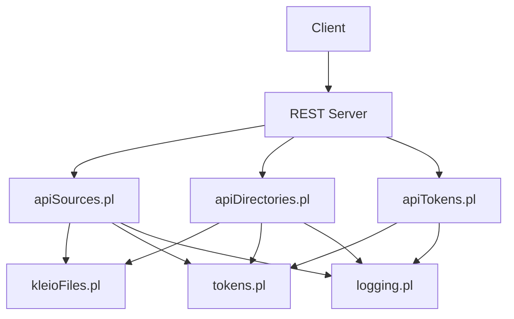
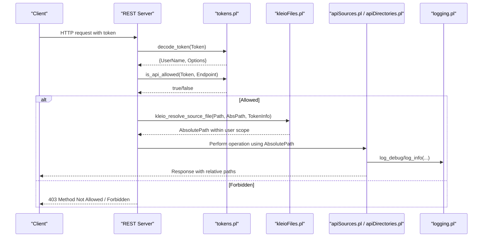
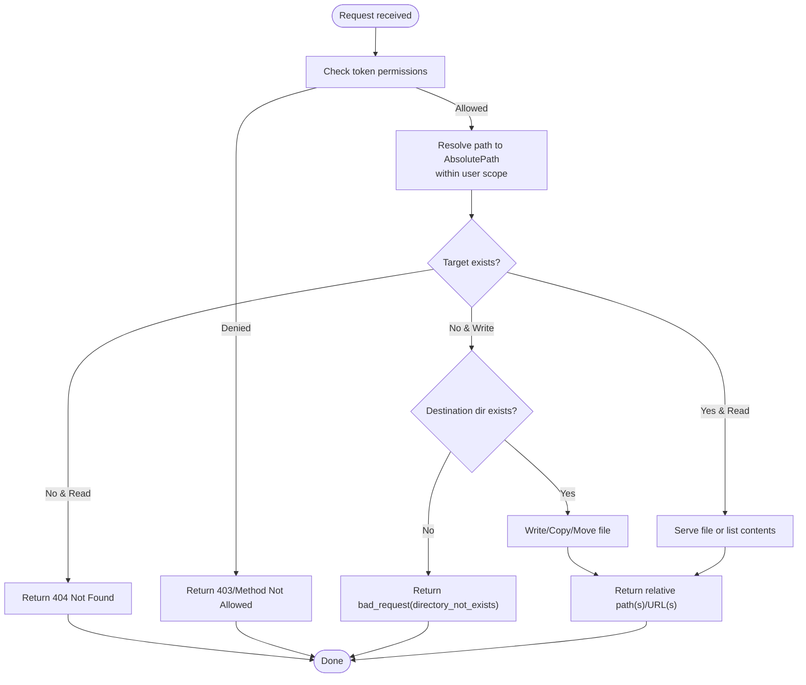
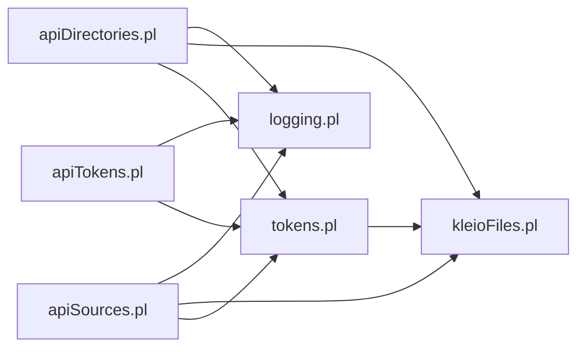

# File Security and Permissions

<cite>
**Referenced Files in This Document**
- [kleioFiles.pl](file://src/kleioFiles.pl)
- [tokens.pl](file://src/tokens.pl)
- [apiTokens.pl](file://src/apiTokens.pl)
- [apiSources.pl](file://src/apiSources.pl)
- [apiDirectories.pl](file://src/apiDirectories.pl)
- [logging.pl](file://src/logging.pl)
</cite>

## Table of Contents
1. [Introduction](#introduction)
2. [Project Structure](#project-structure)
3. [Core Components](#core-components)
4. [Architecture Overview](#architecture-overview)
5. [Detailed Component Analysis](#detailed-component-analysis)
6. [Dependency Analysis](#dependency-analysis)
7. [Performance Considerations](#performance-considerations)
8. [Troubleshooting Guide](#troubleshooting-guide)
9. [Conclusion](#conclusion)
10. [Appendices](#appendices)

## Introduction
This document explains how Kleio secures file access and enforces permissions. It focuses on:
- Token-based access control for API endpoints
- User-specific directory isolation via user-scoped source and structure directories
- Path validation and secure resolution to prevent directory traversal
- The relationship between authentication tokens and filesystem paths
- Relative path generation for safe API responses
- Security considerations for upload/download, copy/move, and directory operations
- Guidance for custom permission models, audit logging, and production best practices

## Project Structure
The security-relevant code is primarily implemented in the following modules:
- kleioFiles.pl: Core file utilities, home/user/source/structure directory resolution, relative path conversion, and MIME type handling
- tokens.pl: Token lifecycle (create, decode, invalidate), token options (API permissions, data_dir, stru_dir), and admin token support
- apiTokens.pl: REST endpoints for token management
- apiSources.pl: File read/write/copy/move APIs with token checks and path resolution
- apiDirectories.pl: Directory listing, creation, deletion, and copy APIs with token checks and path resolution
- logging.pl: Centralized logging facility used across modules

**Diagram sources**
- [apiSources.pl:1-425](file://src/apiSources.pl#L1-L425)
- [apiDirectories.pl:1-168](file://src/apiDirectories.pl#L1-L168)
- [apiTokens.pl:1-125](file://src/apiTokens.pl#L1-L125)
- [kleioFiles.pl:1-1026](file://src/kleioFiles.pl#L1-L1026)
- [tokens.pl:1-426](file://src/tokens.pl#L1-L426)
- [logging.pl:1-161](file://src/logging.pl#L1-L161)

**Section sources**
- [kleioFiles.pl:1-1026](file://src/kleioFiles.pl#L1-L1026)
- [tokens.pl:1-426](file://src/tokens.pl#L1-L426)
- [apiTokens.pl:1-125](file://src/apiTokens.pl#L1-L125)
- [apiSources.pl:1-425](file://src/apiSources.pl#L1-L425)
- [apiDirectories.pl:1-168](file://src/apiDirectories.pl#L1-L168)
- [logging.pl:1-161](file://src/logging.pl#L1-L161)

## Core Components
- Token-based authorization: Tokens carry per-user options including allowed API endpoints and base directories for sources and structures. Admin tokens are supported via environment or file-based configuration.
- User-scoped directories: Each token can constrain a user’s effective root under KLEIO_HOME for both sources and structures, ensuring cross-user isolation.
- Secure path resolution: All external-facing APIs resolve user-supplied paths through centralized predicates that compute absolute paths within the user’s scope and return relative paths for safe exposure.
- API-level permission checks: Every mutating operation requires explicit permission flags in the token; read-only operations require a minimal set of permissions.

Key responsibilities by module:
- tokens.pl: Token CRUD, expiration, admin fallback, and option retrieval
- kleioFiles.pl: Home/user/source/structure directory computation, bidirectional path resolution, relative attribute mapping, MIME types
- apiSources.pl: File get/post/put/delete with token checks and path resolution
- apiDirectories.pl: Directory list/create/delete/copy with token checks and path resolution
- apiTokens.pl: REST endpoints for token management
- logging.pl: Structured logging facility

**Section sources**
- [tokens.pl:104-176](file://src/tokens.pl#L104-L176)
- [kleioFiles.pl:773-878](file://src/kleioFiles.pl#L773-L878)
- [apiSources.pl:89-173](file://src/apiSources.pl#L89-L173)
- [apiDirectories.pl:18-88](file://src/apiDirectories.pl#L18-L88)
- [apiTokens.pl:71-122](file://src/apiTokens.pl#L71-L122)
- [logging.pl:98-113](file://src/logging.pl#L98-L113)

## Architecture Overview
The system enforces security at multiple layers:
- Authentication layer: Validates tokens and resolves associated options (including user-scoped roots).
- Authorization layer: Checks whether the requested API endpoint is permitted by the token’s options.
- Path isolation layer: Resolves all user-provided paths into absolute paths constrained to the user’s scoped directories.
- Response sanitization: Returns only relative paths to clients to avoid leaking server internals.

**Diagram sources**
- [tokens.pl:141-176](file://src/tokens.pl#L141-L176)
- [kleioFiles.pl:800-878](file://src/kleioFiles.pl#L800-L878)
- [apiSources.pl:89-173](file://src/apiSources.pl#L89-L173)
- [apiDirectories.pl:18-88](file://src/apiDirectories.pl#L18-L88)
- [logging.pl:98-113](file://src/logging.pl#L98-L113)

## Detailed Component Analysis

### Token-Based Access Control
- Token generation associates a username with options such as allowed API endpoints and optional base directories for data and structures.
- Tokens can be invalidated individually or by user. Expiration is enforced based on created timestamp and life_span.
- An administrative token can be provided via environment variable or a dedicated file path.

Security implications:
- Only endpoints explicitly listed in the token’s options are allowed.
- Admin token grants broad capabilities and should be protected carefully.

**Section sources**
- [tokens.pl:104-176](file://src/tokens.pl#L104-L176)
- [tokens.pl:187-231](file://src/tokens.pl#L187-L231)
- [tokens.pl:249-281](file://src/tokens.pl#L249-L281)
- [apiTokens.pl:71-122](file://src/apiTokens.pl#L71-L122)

### User-Specific Directory Isolation
- kleio_user_source_dir/2 and kleio_user_structure_dir/2 compute the effective base directories for a user by combining KLEIO_HOME with the sources(S) and structures(S) options from the token.
- kleio_resolve_source_file/3 and kleio_resolve_structure_file/3 perform bidirectional resolution between relative and absolute paths within these scopes.

Security implications:
- Users cannot escape their scoped directories because all resolutions are anchored to KLEIO_HOME plus the token’s subpath.
- Relative path outputs are computed from absolute paths to ensure they remain within the user’s scope.

**Section sources**
- [kleioFiles.pl:773-797](file://src/kleioFiles.pl#L773-L797)
- [kleioFiles.pl:800-878](file://src/kleioFiles.pl#L800-L878)

### Path Validation and Traversal Prevention
- kleio_resolve_source_file/3 constructs absolute paths by concatenating KLEIO_HOME, the user’s sources subdirectory, and the supplied relative path, then normalizes via absolute_file_name/2.
- kleio_resolve_source_list/3 applies this resolution to lists of paths.
- file_attributes_relative/3 converts attributes containing paths to relative ones using kleio_resolve_source_file/3, preventing leakage of absolute server paths.

Security implications:
- Because resolution always starts from the user’s scoped base, attempts to traverse outside the scope are prevented unless the OS path normalization unexpectedly escapes the intended root. Ensure that the underlying platform’s absolute_file_name/2 does not allow escaping beyond the intended root. If necessary, add an explicit check that the resulting absolute path begins with the expected base.

**Section sources**
- [kleioFiles.pl:800-878](file://src/kleioFiles.pl#L800-L878)
- [kleioFiles.pl:440-457](file://src/kleioFiles.pl#L440-L457)

### Relationship Between Tokens and Filesystem Permissions
- Tokens carry options that include:
  - api([...]): Allowed endpoints
  - sources(...): Subdirectory under KLEIO_HOME for user sources
  - structures(...): Subdirectory under KLEIO_HOME for user structures
- These options determine where files are resolved and served from.
- Admin tokens bypass some restrictions and have broader permissions.

Operational guidance:
- Always create tokens with the narrowest possible api list and restrict sources/structures to the minimum required subtree.
- Avoid granting write-capable endpoints unless necessary.

**Section sources**
- [tokens.pl:104-176](file://src/tokens.pl#L104-L176)
- [kleioFiles.pl:773-797](file://src/kleioFiles.pl#L773-L797)

### Secure Path Resolution and Relative Path Generation
- kleio_resolve_source_file/3 and kleio_resolve_structure_file/3 provide bidirectional mapping between relative and absolute paths within the user’s scope.
- kleio_file_set_relative/3 returns file metadata with paths converted to relative values using file_attributes_relative/3, which relies on kleio_resolve_source_file/3.

Security implications:
- Clients receive only relative paths, reducing information disclosure risk.
- All internal operations use absolute paths derived from the same resolution logic.

**Section sources**
- [kleioFiles.pl:115-130](file://src/kleioFiles.pl#L115-L130)
- [kleioFiles.pl:440-457](file://src/kleioFiles.pl#L440-L457)
- [kleioFiles.pl:800-878](file://src/kleioFiles.pl#L800-L878)

### File Upload/Download Operations
- Download: GET /sources/{path} resolves the path to an absolute location within the user’s scope and serves the file if it exists. JSON mode returns a relative URL instead of raw content.
- Upload: POST/PUT with multipart uploads writes to the resolved destination after validating existence rules and directory presence.
- Copy/Move: POST/PUT with origin parameter performs copy/move within the user’s scope, enforcing non-existence of destination and existence of source.

Security considerations:
- All operations require appropriate token permissions (files, upload, delete).
- Destination directories must exist before writing; otherwise, requests are rejected.
- Responses contain only relative paths or URLs.

**Diagram sources**
- [apiSources.pl:89-173](file://src/apiSources.pl#L89-L173)
- [apiSources.pl:212-233](file://src/apiSources.pl#L212-L233)
- [apiSources.pl:333-382](file://src/apiSources.pl#L333-L382)
- [apiSources.pl:391-410](file://src/apiSources.pl#L391-L410)
- [kleioFiles.pl:800-878](file://src/kleioFiles.pl#L800-L878)

**Section sources**
- [apiSources.pl:89-173](file://src/apiSources.pl#L89-L173)
- [apiSources.pl:212-233](file://src/apiSources.pl#L212-L233)
- [apiSources.pl:333-382](file://src/apiSources.pl#L333-L382)
- [apiSources.pl:391-410](file://src/apiSources.pl#L391-L410)

### Directory Manipulation APIs
- List: GET /directories/{path} lists immediate or recursive subdirectories within the user’s scope.
- Create: POST /directories/{path} creates a directory if it does not already exist.
- Delete: DELETE /directories/{path} removes a directory; optionally force removal of contents.
- Copy: POST /directories/{path} with origin copies a directory tree within the user’s scope.

Security considerations:
- Requires mkdir permission for creation/copy; delete permission for removal.
- All paths are resolved within the user’s scope before any filesystem operation.

**Section sources**
- [apiDirectories.pl:18-88](file://src/apiDirectories.pl#L18-L88)
- [apiDirectories.pl:101-147](file://src/apiDirectories.pl#L101-L147)

### Cross-User Data Isolation
- Each token defines a sources subdirectory under KLEIO_HOME. All file operations are confined to this subtree.
- Structures are similarly isolated via the structures subdirectory.
- Admin tokens may have empty strings for these options, effectively operating at the KLEIO_HOME root; treat admin tokens with highest caution.

Best practice:
- Assign each user a distinct sources and structures subtree.
- Use short-lived tokens and revoke them when no longer needed.

**Section sources**
- [tokens.pl:104-176](file://src/tokens.pl#L104-L176)
- [kleioFiles.pl:773-797](file://src/kleioFiles.pl#L773-L797)

## Dependency Analysis
The following diagram shows key dependencies among security-related modules:

**Diagram sources**
- [tokens.pl:1-426](file://src/tokens.pl#L1-426)
- [kleioFiles.pl:1-1026](file://src/kleioFiles.pl#L1-L1026)
- [apiTokens.pl:1-125](file://src/apiTokens.pl#L1-L125)
- [apiSources.pl:1-425](file://src/apiSources.pl#L1-L425)
- [apiDirectories.pl:1-168](file://src/apiDirectories.pl#L1-L168)
- [logging.pl:1-161](file://src/logging.pl#L1-L161)

**Section sources**
- [tokens.pl:1-426](file://src/tokens.pl#L1-L426)
- [kleioFiles.pl:1-1026](file://src/kleioFiles.pl#L1-L1026)
- [apiTokens.pl:1-125](file://src/apiTokens.pl#L1-L125)
- [apiSources.pl:1-425](file://src/apiSources.pl#L1-L425)
- [apiDirectories.pl:1-168](file://src/apiDirectories.pl#L1-L168)
- [logging.pl:1-161](file://src/logging.pl#L1-L161)

## Performance Considerations
- Path resolution uses absolute_file_name/2 and string concatenation; keep user paths short and normalized.
- Directory listings may scan large trees; prefer non-recursive listing and paginate results on the client side.
- Logging overhead can be tuned via log level; avoid excessive debug logs in production.

[No sources needed since this section provides general guidance]

## Troubleshooting Guide
Common issues and mitigations:
- 403 Method Not Allowed: The token lacks the required permission for the endpoint. Verify the token’s api list includes the requested action.
- 404 Not Found: The resolved absolute path does not exist. Confirm the path exists under the user’s sources subtree.
- bad_request(directory_not_exists): The target directory for upload/copy/move does not exist. Create it first or adjust the destination path.
- Permission denied at OS level: Ensure the process running Kleio has sufficient filesystem permissions for the KLEIO_HOME subtree assigned to the user.

Logging tips:
- Enable debug logs temporarily around file operations to trace path resolution and permission checks.
- Inspect service logs written to the configured log directory.

**Section sources**
- [apiSources.pl:89-173](file://src/apiSources.pl#L89-L173)
- [apiSources.pl:212-233](file://src/apiSources.pl#L212-L233)
- [apiSources.pl:333-382](file://src/apiSources.pl#L333-L382)
- [apiDirectories.pl:18-88](file://src/apiDirectories.pl#L18-L88)
- [logging.pl:98-113](file://src/logging.pl#L98-L113)

## Conclusion
Kleio implements a layered security model for file operations:
- Tokens define who can do what and where.
- Path resolution confines all operations to user-scoped subtrees.
- API endpoints enforce permissions and sanitize responses to relative paths.
To harden deployments, minimize token privileges, isolate users’ directories, enable structured logging, and monitor for unauthorized access attempts.

[No sources needed since this section summarizes without analyzing specific files]

## Appendices

### Implementing Custom Permission Models
- Extend token options with additional fields (e.g., roles, resource tags) and update is_api_allowed/2 to evaluate custom policies.
- Introduce middleware that augments token options with runtime context (e.g., IP whitelist, time windows).
- Persist extended options and validate them consistently across all API handlers.

[No sources needed since this section provides general guidance]

### Audit Logging for File Operations
- Add structured audit entries for critical actions (upload, delete, move, copy, mkdir, rmdir) including token id, user, action, path, and result.
- Route audit logs to a separate file or external sink for tamper-evident retention.
- Correlate audit events with request ids propagated through parameters.

[No sources needed since this section provides general guidance]

### Production Best Practices
- Use short-lived tokens and rotate them regularly.
- Restrict sources/structures to the smallest necessary subtrees.
- Run the server under a least-privilege OS user and mount KLEIO_HOME with restrictive permissions.
- Enable HTTPS and protect admin tokens via secure channels and restricted storage.
- Regularly review and revoke unused tokens.

[No sources needed since this section provides general guidance]