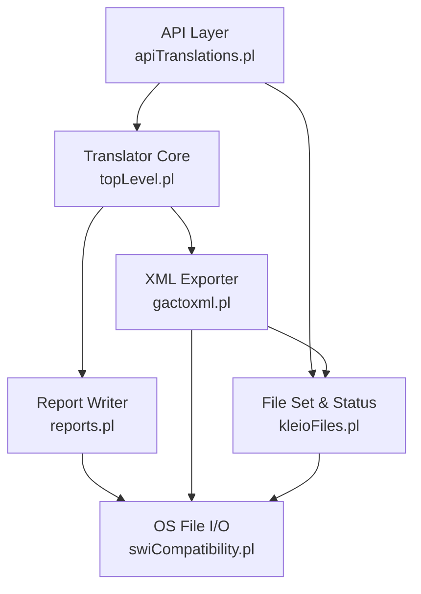
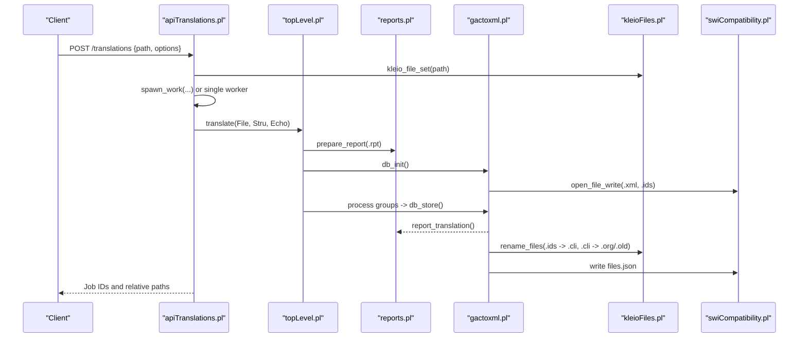
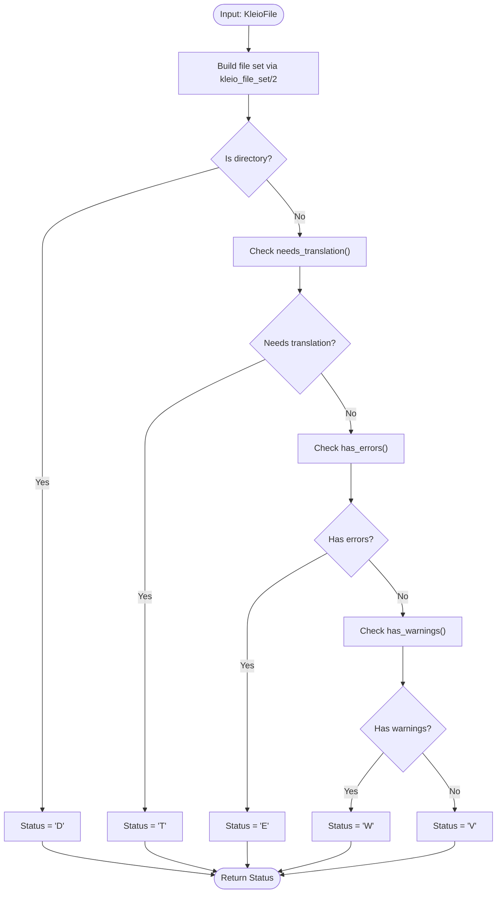
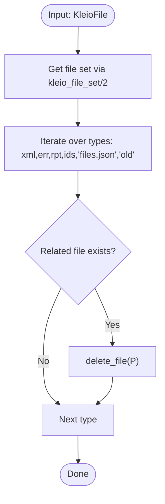
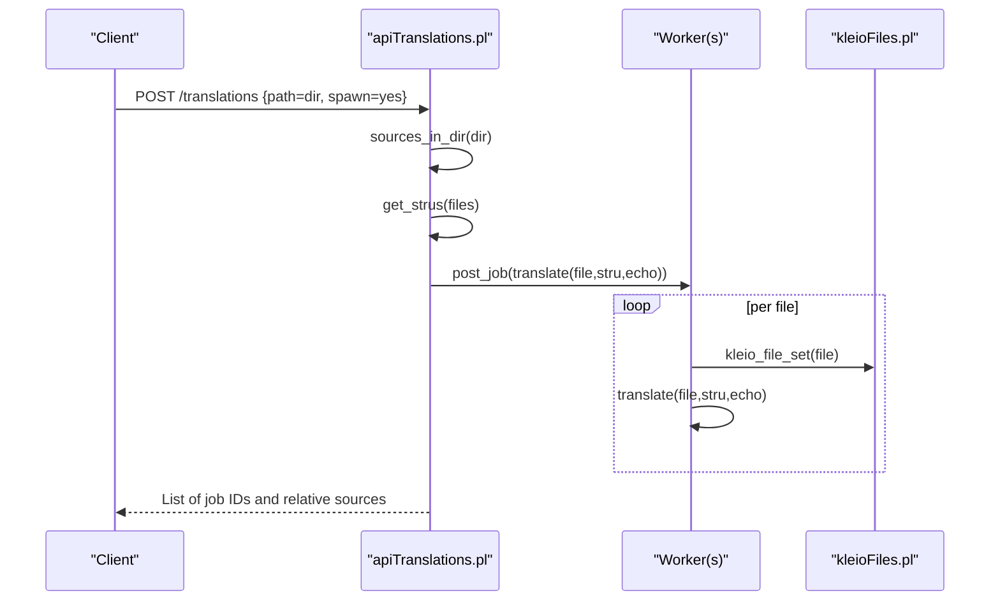
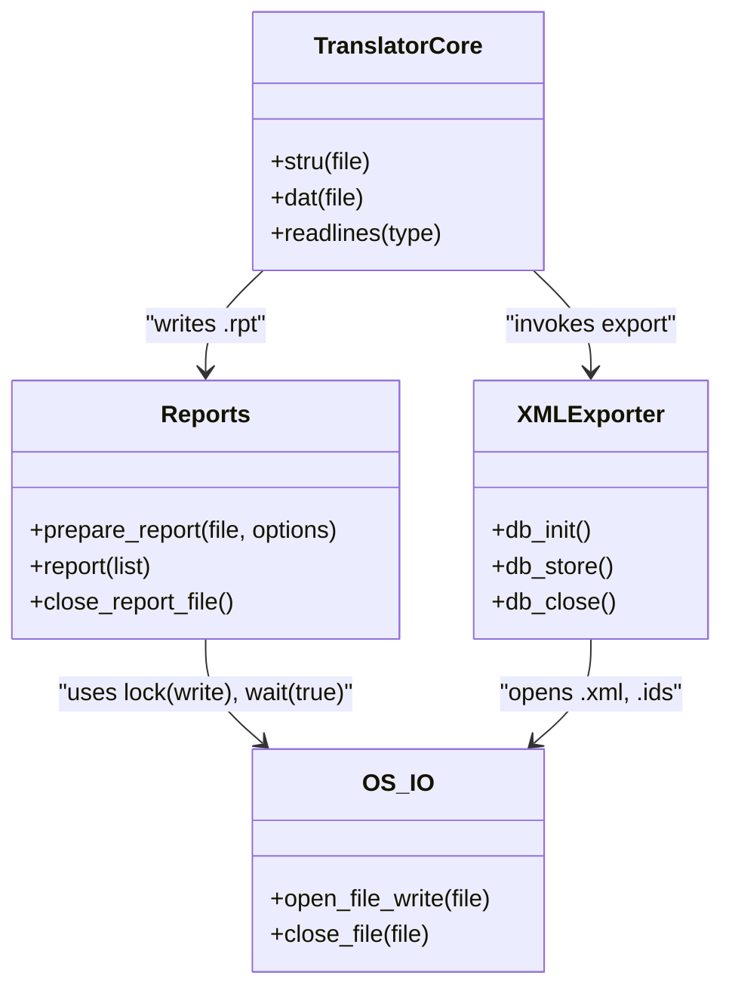
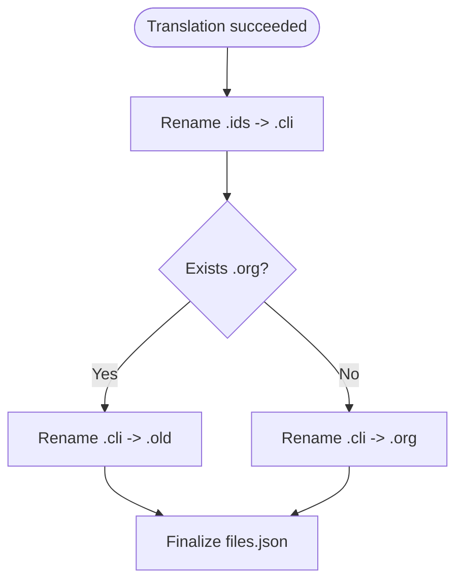
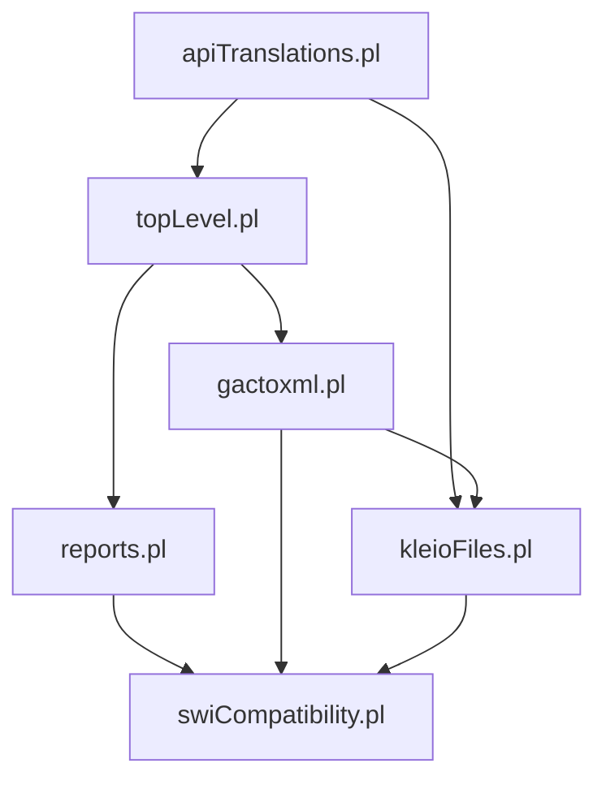

# Output File Generation

<cite>
**Referenced Files in This Document**
- [kleioFiles.pl](file://src/kleioFiles.pl)
- [apiTranslations.pl](file://src/apiTranslations.pl)
- [gactoxml.pl](file://src/gactoxml.pl)
- [reports.pl](file://src/reports.pl)
- [topLevel.pl](file://src/topLevel.pl)
- [swiCompatibility.pl](file://src/swiCompatibility.pl)
- [test_kleiofiles.pl](file://src/test_kleiofiles.pl)
</cite>

## Table of Contents
1. [Introduction](#introduction)
2. [Project Structure](#project-structure)
3. [Core Components](#core-components)
4. [Architecture Overview](#architecture-overview)
5. [Detailed Component Analysis](#detailed-component-analysis)
6. [Dependency Analysis](#dependency-analysis)
7. [Performance Considerations](#performance-considerations)
8. [Troubleshooting Guide](#troubleshooting-guide)
9. [Conclusion](#conclusion)
10. [Appendices](#appendices)

## Introduction
This document explains how Kleio generates and manages output files during translation, including XML exports for database import, human-readable RPT reports, machine-readable ERR summaries, ORG originals, IDS temporary files, OLD backups, and FILES.json metadata. It covers file naming conventions, attribute extraction via file_attributes/2, status tracking via kleio_file_status/2, cleanup operations with kleio_file_clean/1, batch processing workflows, integration points, locking and concurrency safeguards, and backup strategies.

## Project Structure
The output generation pipeline spans several modules:
- API orchestration and job scheduling (apiTranslations.pl)
- Translation core and report writer (topLevel.pl, reports.pl)
- XML exporter and derived file management (gactoxml.pl)
- File set discovery, attributes, and status (kleioFiles.pl)
- Low-level file I/O with OS locks (swiCompatibility.pl)
- Tests validating file sets and statuses (test_kleiofiles.pl)

**Diagram sources**
- [apiTranslations.pl:440-483](file://src/apiTranslations.pl#L440-L483)
- [topLevel.pl:142-163](file://src/topLevel.pl#L142-L163)
- [reports.pl:27-126](file://src/reports.pl#L27-L126)
- [gactoxml.pl:129-188](file://src/gactoxml.pl#L129-L188)
- [kleioFiles.pl:69-113](file://src/kleioFiles.pl#L69-L113)
- [swiCompatibility.pl:222-230](file://src/swiCompatibility.pl#L222-L230)

**Section sources**
- [apiTranslations.pl:440-483](file://src/apiTranslations.pl#L440-L483)
- [kleioFiles.pl:69-113](file://src/kleioFiles.pl#L69-L113)

## Core Components
- File set enumeration and status:
  - kleio_file_set/2 builds a structured list of related files for a source (.cli), including rpt, err, xml, org, old, ids, and files.json.
  - kleio_file_status/2 returns the effective translation status T/E/W/V/D based on timestamps and error counts.
  - file_attributes/2 extracts comprehensive metadata (name, path, base, extension, modification times, size) and augments .err-specific fields (errors, warnings, version, translated timestamp).
- Translation execution and reporting:
  - apiTranslations.pl coordinates translation jobs, spawns workers, and exposes REST endpoints to start, query, and delete translations.
  - topLevel.pl orchestrates structure and data processing, while reports.pl writes human-readable reports to .rpt files.
- XML export and derived files:
  - gactoxml.pl initializes outputs, writes XML, maintains an intermediate .ids file, and finalizes by renaming to .cli/.org/.old and generating files.json.

**Section sources**
- [kleioFiles.pl:69-113](file://src/kleioFiles.pl#L69-L113)
- [kleioFiles.pl:167-186](file://src/kleioFiles.pl#L167-L186)
- [kleioFiles.pl:333-415](file://src/kleioFiles.pl#L333-L415)
- [apiTranslations.pl:440-483](file://src/apiTranslations.pl#L440-L483)
- [topLevel.pl:142-163](file://src/topLevel.pl#L142-L163)
- [reports.pl:27-126](file://src/reports.pl#L27-L126)
- [gactoxml.pl:129-188](file://src/gactoxml.pl#L129-L188)

## Architecture Overview
End-to-end flow from API request to generated artifacts:

**Diagram sources**
- [apiTranslations.pl:440-483](file://src/apiTranslations.pl#L440-L483)
- [topLevel.pl:142-163](file://src/topLevel.pl#L142-L163)
- [reports.pl:27-126](file://src/reports.pl#L27-L126)
- [gactoxml.pl:129-188](file://src/gactoxml.pl#L129-L188)
- [gactoxml.pl:259-328](file://src/gactoxml.pl#L259-L328)
- [kleioFiles.pl:69-113](file://src/kleioFiles.pl#L69-L113)
- [swiCompatibility.pl:222-230](file://src/swiCompatibility.pl#L222-L230)

## Detailed Component Analysis

### Output File Types and Naming Conventions
For a source file named Base.cli, the following artifacts are produced alongside it:
- Base.rpt: Human-readable translation report.
- Base.err: Machine-readable summary with error/warning counts, translator version, and translation timestamp.
- Base.xml: Exported data suitable for database import.
- Base.ids: Temporary pretty-printed file used during translation.
- Base.org: Original source before first successful translation.
- Base.old: Backup of the last successfully translated .cli.
- Base.files.json: Metadata describing related files and counts.

These names are constructed by replacing the original extension with the appropriate suffix using file_name_extension/3 within kleio_file_set/2.

**Section sources**
- [kleioFiles.pl:88-113](file://src/kleioFiles.pl#L88-L113)
- [gactoxml.pl:129-188](file://src/gactoxml.pl#L129-L188)
- [gactoxml.pl:259-328](file://src/gactoxml.pl#L259-L328)

### Attribute Extraction via file_attributes/2
file_attributes/2 returns a rich attribute list for any file, including:
- name, path, directory, base, base_path, extension
- is_directory, modified timestamps (float, formatted string, RFC1123, ISO8601), size
- For .err files: errors, warnings, version, translated timestamps

Additional helpers:
- get_file_attribute/3 retrieves a specific attribute.
- file_attributes_relative/3 converts absolute paths to token-aware relative paths for safe API responses.

**Section sources**
- [kleioFiles.pl:333-415](file://src/kleioFiles.pl#L333-L415)
- [kleioFiles.pl:440-457](file://src/kleioFiles.pl#L440-L457)
- [kleioFiles.pl:460-466](file://src/kleioFiles.pl#L460-L466)

### Status Tracking via kleio_file_status/2
Status values:
- T: Needs translation (missing rpt/err/xml or source newer than rpt/err)
- E: Last translation had errors
- W: Last translation had warnings
- V: Valid translation ready for import
- D: Path is a directory

Status computation uses timestamps and error/warning counts from .err attributes.

**Diagram sources**
- [kleioFiles.pl:69-113](file://src/kleioFiles.pl#L69-L113)
- [kleioFiles.pl:167-206](file://src/kleioFiles.pl#L167-L206)

**Section sources**
- [kleioFiles.pl:167-206](file://src/kleioFiles.pl#L167-L206)

### Cleanup Operations via kleio_file_clean/1
Cleans translation results for a given source by deleting:
- .xml, .err, .rpt, .ids, .old, and files.json

Note: .org is not deleted because it represents the original source prior to first successful translation.

**Diagram sources**
- [kleioFiles.pl:132-147](file://src/kleioFiles.pl#L132-L147)

**Section sources**
- [kleioFiles.pl:132-147](file://src/kleioFiles.pl#L132-L147)

### Batch Processing of Translation Results
Batching is supported through:
- Directory-based translation: API resolves all sources under a directory and schedules jobs.
- Spawning parallel workers: Option spawn=yes distributes work across multiple workers; otherwise, a single worker processes files sequentially.
- Job tracking: Jobs are recorded and returned with relative paths for safe consumption.

**Diagram sources**
- [apiTranslations.pl:53-83](file://src/apiTranslations.pl#L53-L83)
- [apiTranslations.pl:242-260](file://src/apiTranslations.pl#L242-L260)
- [kleioFiles.pl:69-113](file://src/kleioFiles.pl#L69-L113)

**Section sources**
- [apiTranslations.pl:53-83](file://src/apiTranslations.pl#L53-L83)
- [apiTranslations.pl:242-260](file://src/apiTranslations.pl#L242-L260)

### Integration with External Systems
- REST endpoints expose translation control and result retrieval.
- Relative path conversion ensures secure exposure of file references.
- URLs for reports and exports are computed for downstream consumers.

Key behaviors:
- kleio_translation_status/3 merges file set info with processing state and constructs URLs for rpt and xml.
- convert_jobs_to_relative_paths/3 maps absolute paths back to token-scoped relative paths.

**Section sources**
- [apiTranslations.pl:494-577](file://src/apiTranslations.pl#L494-L577)
- [apiTranslations.pl:485-491](file://src/apiTranslations.pl#L485-L491)

### File Locking Mechanisms and Concurrent Access
- Report writer opens files with write locks and waits for availability.
- Translation core uses mutexes around structure and data processing to prevent concurrent modifications.
- Thread-local properties isolate state per worker.

**Diagram sources**
- [reports.pl:51-66](file://src/reports.pl#L51-L66)
- [swiCompatibility.pl:222-230](file://src/swiCompatibility.pl#L222-L230)
- [apiTranslations.pl:446-456](file://src/apiTranslations.pl#L446-L456)
- [gactoxml.pl:129-188](file://src/gactoxml.pl#L129-L188)

**Section sources**
- [reports.pl:51-66](file://src/reports.pl#L51-L66)
- [swiCompatibility.pl:222-230](file://src/swiCompatibility.pl#L222-L230)
- [apiTranslations.pl:446-456](file://src/apiTranslations.pl#L446-L456)

### Backup Strategies
- Successful translation triggers renaming:
  - .ids becomes the new .cli
  - Existing .cli becomes .old (backup)
  - If no .org exists, previous .cli becomes .org (original snapshot)
- The .old file holds the last successfully translated version; .org preserves the original input before first success.

**Diagram sources**
- [gactoxml.pl:259-328](file://src/gactoxml.pl#L259-L328)

**Section sources**
- [gactoxml.pl:259-328](file://src/gactoxml.pl#L259-L328)

## Dependency Analysis
High-level dependencies among key components:

**Diagram sources**
- [apiTranslations.pl:440-483](file://src/apiTranslations.pl#L440-L483)
- [kleioFiles.pl:69-113](file://src/kleioFiles.pl#L69-L113)
- [topLevel.pl:142-163](file://src/topLevel.pl#L142-L163)
- [reports.pl:27-126](file://src/reports.pl#L27-L126)
- [gactoxml.pl:129-188](file://src/gactoxml.pl#L129-L188)
- [swiCompatibility.pl:222-230](file://src/swiCompatibility.pl#L222-L230)

**Section sources**
- [apiTranslations.pl:440-483](file://src/apiTranslations.pl#L440-L483)
- [kleioFiles.pl:69-113](file://src/kleioFiles.pl#L69-L113)

## Performance Considerations
- Caching of status queries:
  - Status cache avoids repeated expensive computations for large sets.
  - Cache age adapts to set size to balance freshness and load.
- Mutex synchronization:
  - Protects shared resources like structure processing and data file handling.
- Efficient attribute extraction:
  - Shared property caching for .err parsing reduces redundant reads.

Recommendations:
- Use spawn=no in multi-user environments to share workers efficiently.
- Prefer relative path conversions for API responses to minimize overhead.
- Monitor cache invalidation thresholds when frequent updates occur.

[No sources needed since this section provides general guidance]

## Troubleshooting Guide
Common issues and diagnostics:
- Missing or stale outputs:
  - Verify kleio_file_status/2 returns T if rpt/err/xml missing or source newer.
  - Inspect .err for error/warning counts and translator version.
- Permission problems:
  - Ensure write permissions for .xml and .ids; chmod is attempted after creation.
- Concurrency conflicts:
  - Check mutex usage around stru/dat processing; ensure only one worker modifies the same resource at a time.
- Cleanup failures:
  - Confirm kleio_file_clean/1 targets correct types and that .org is intentionally preserved.

Actions:
- Use kleio_file_delete/1 to remove both source and all derived files.
- Query kleio_translation_status/3 for detailed status and URLs.
- Validate files.json for consistency between expected artifacts and actual files.

**Section sources**
- [kleioFiles.pl:149-165](file://src/kleioFiles.pl#L149-L165)
- [kleioFiles.pl:167-206](file://src/kleioFiles.pl#L167-L206)
- [gactoxml.pl:129-188](file://src/gactoxml.pl#L129-L188)
- [apiTranslations.pl:494-577](file://src/apiTranslations.pl#L494-L577)

## Conclusion
Kleio’s output generation produces a well-defined set of artifacts per source file, with robust status tracking, safe path handling, and clear backup semantics. The system supports batch processing and concurrent access through careful locking and worker coordination. Integrators can rely on kleio_file_set/2, kleio_file_status/2, and kleio_file_clean/1 to manage lifecycle operations and maintain consistent state across external systems.

[No sources needed since this section summarizes without analyzing specific files]

## Appendices

### Validation Examples
- Unit tests assert presence of file set members and tstatus values for known sources.

**Section sources**
- [test_kleiofiles.pl:6-26](file://src/test_kleiofiles.pl#L6-L26)