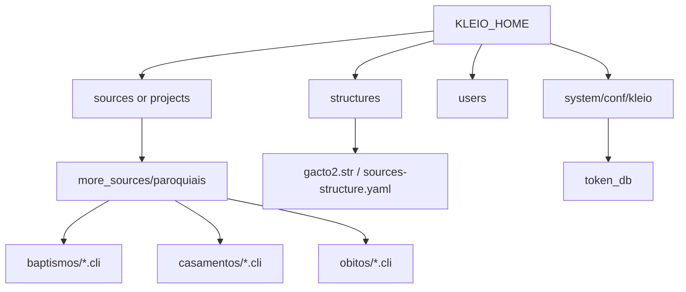
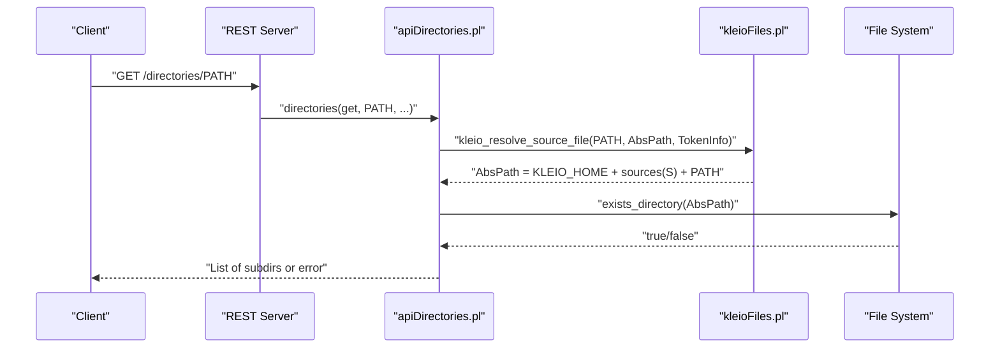
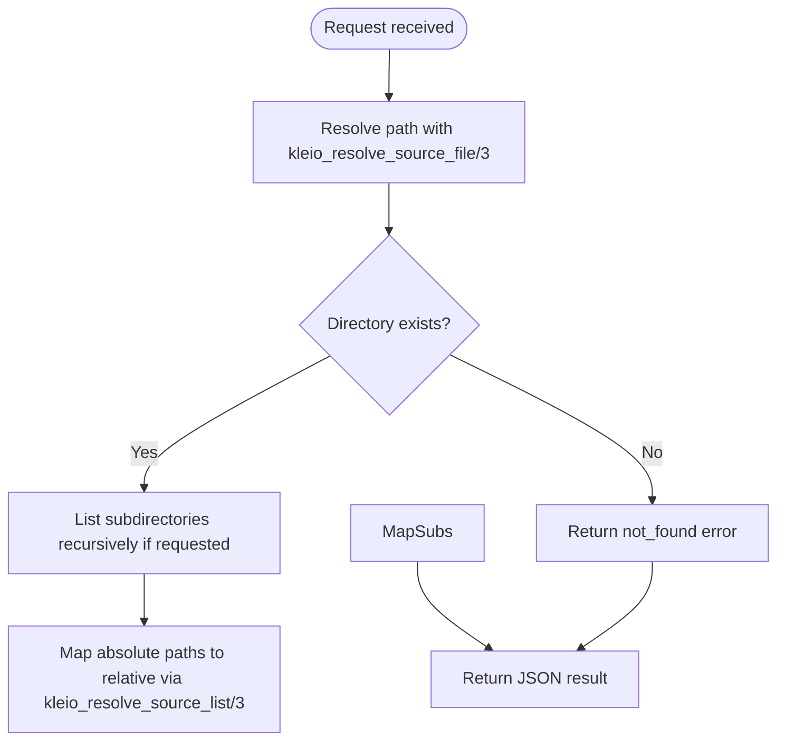
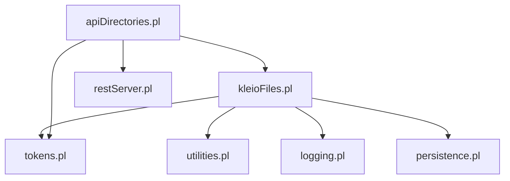

# Source File Organization

<cite>
**Referenced Files in This Document**
- [kleioFiles.pl](file://src/kleioFiles.pl)
- [apiDirectories.pl](file://src/apiDirectories.pl)
- [tokens.pl](file://src/tokens.pl)
- [stru_file_location.md](file://docs/doc/stru_file_location.md)
- [bap-com-celebrantes.cli](file://tests/kleio-home/sources/more_sources/paroquiais/baptismos/bap-com-celebrantes.cli)
- [cas1714-1722.cli](file://tests/kleio-home/sources/more_sources/paroquiais/casamentos/cas1714-1722.cli)
- [ob1688.cli](file://tests/kleio-home/sources/more_sources/paroquiais/obitos/ob1688.cli)
</cite>

## Table of Contents
1. [Introduction](#introduction)
2. [Project Structure](#project-structure)
3. [Core Components](#core-components)
4. [Architecture Overview](#architecture-overview)
5. [Detailed Component Analysis](#detailed-component-analysis)
6. [Dependency Analysis](#dependency-analysis)
7. [Performance Considerations](#performance-considerations)
8. [Troubleshooting Guide](#troubleshooting-guide)
9. [Conclusion](#conclusion)
10. [Appendices](#appendices)

## Introduction
This document explains how source files are organized and resolved in the Kleio translation system. It covers:
- The standard directory layout under KLEIO_HOME, including sources and user-specific directories
- Project-based organization patterns for historical records by type (e.g., baptismos, casamentos, obitos)
- File naming conventions for .cli files
- Path resolution mechanisms, including relative vs absolute paths and the kleio_resolve_source_file/3 predicate
- Security considerations for file access controls and permission management

## Project Structure
Kleio expects a well-defined home directory structure that separates configuration, structures, logs, and data. The most relevant parts for source organization are:
- KLEIO_HOME/system/conf/kleio: configuration and token database
- KLEIO_HOME/sources or KLEIO_HOME/projects: base directory for source files
- KLEIO_HOME/users: per-user overrides (e.g., custom structures)
- KLEIO_HOME/structures: shared structure definitions

Within KLEIO_HOME/sources, collections are typically organized by project and then by record type. Examples from the repository show:
- KLEIO_HOME/sources/more_sources/paroquiais/baptismos/*.cli
- KLEIO_HOME/sources/more_sources/paroquiais/casamentos/*.cli
- KLEIO_HOME/sources/more_sources/paroquiais/obitos/*.cli

Structure files (.str or YAML) can be colocated with sources to support different formats per collection or subdirectory.

**Diagram sources**
- [kleioFiles.pl:468-597](file://src/kleioFiles.pl#L468-L597)
- [kleioFiles.pl:647-658](file://src/kleioFiles.pl#L647-L658)
- [kleioFiles.pl:687-713](file://src/kleioFiles.pl#L687-L713)
- [stru_file_location.md:15-31](file://docs/doc/stru_file_location.md#L15-L31)

**Section sources**
- [kleioFiles.pl:468-597](file://src/kleioFiles.pl#L468-L597)
- [kleioFiles.pl:647-658](file://src/kleioFiles.pl#L647-L658)
- [kleioFiles.pl:687-713](file://src/kleioFiles.pl#L687-L713)
- [stru_file_location.md:15-31](file://docs/doc/stru_file_location.md#L15-L31)

## Core Components
- Directory discovery and path utilities:
  - kleio_home_dir/1: detects the root home directory using environment variables and filesystem heuristics
  - kleio_source_dir/1: resolves the sources base directory
  - kleio_stru_dir/1: resolves the structures base directory
  - kleio_user_source_dir/2 and kleio_user_structure_dir/2: resolve per-user directories based on token options
- Path resolution:
  - kleio_resolve_source_file/3: converts between relative and absolute paths within the user’s sources area
  - kleio_resolve_source_list/3: bidirectional mapping for lists of paths
  - kleio_resolve_structure_file/3: similar resolution for structure files
- API integration:
  - apiDirectories.pl uses kleio_resolve_source_file/3 to validate and operate on directories via REST endpoints

These components together enforce consistent location rules and isolate users’ data behind tokens.

**Section sources**
- [kleioFiles.pl:468-597](file://src/kleioFiles.pl#L468-L597)
- [kleioFiles.pl:647-658](file://src/kleioFiles.pl#L647-L658)
- [kleioFiles.pl:687-713](file://src/kleioFiles.pl#L687-L713)
- [kleioFiles.pl:773-797](file://src/kleioFiles.pl#L773-L797)
- [kleioFiles.pl:800-878](file://src/kleioFiles.pl#L800-L878)
- [apiDirectories.pl:18-35](file://src/apiDirectories.pl#L18-L35)

## Architecture Overview
The following diagram shows how Kleio locates and validates source files during an API request:

**Diagram sources**
- [apiDirectories.pl:18-35](file://src/apiDirectories.pl#L18-L35)
- [kleioFiles.pl:800-828](file://src/kleioFiles.pl#L800-L828)

## Detailed Component Analysis

### Standard Directory Layout and Environment Resolution
- Home detection order includes environment variables and common container paths, falling back to current working directory if it contains expected subdirectories (system, sources|projects, users).
- Sources base directory defaults to KLEIO_HOME/sources unless overridden by KLEIO_SOURCE_DIR.
- Structures base directory defaults to KLEIO_HOME/system/conf/kleio/stru unless overridden by KLEIO_STRU_DIR.
- User-scoped directories are derived from token options (sources(S), structures(S)) and combined with KLEIO_HOME.

Best practices:
- Keep KLEIO_HOME stable across deployments; prefer environment variables for overrides.
- Use KLEIO_HOME/sources for shared collections and KLEIO_HOME/users/<user>/... for per-user overrides.

**Section sources**
- [kleioFiles.pl:468-597](file://src/kleioFiles.pl#L468-L597)
- [kleioFiles.pl:647-658](file://src/kleioFiles.pl#L647-L658)
- [kleioFiles.pl:687-713](file://src/kleioFiles.pl#L687-L713)
- [kleioFiles.pl:773-797](file://src/kleioFiles.pl#L773-L797)

### Path Resolution Mechanisms
- kleio_resolve_source_file/3 supports both directions:
  - Relative to Absolute: concatenates KLEIO_HOME + sources(S) + RelativePath and normalizes to an absolute path
  - Absolute to Relative: strips KLEIO_HOME + sources(S) prefix to produce a relative path
- kleio_resolve_source_list/3 applies the same logic to lists of paths
- kleio_resolve_structure_file/3 mirrors this behavior for structure files under structures(S)

Relative vs absolute usage:
- Prefer passing relative paths through APIs and let kleio_resolve_source_file/3 compute absolute paths internally
- When returning paths to clients, use kleio_file_set_relative/3 to avoid leaking absolute filesystem paths

**Section sources**
- [kleioFiles.pl:800-878](file://src/kleioFiles.pl#L800-L878)
- [kleioFiles.pl:115-130](file://src/kleioFiles.pl#L115-L130)

### Naming Conventions for .cli Files
- Each historical record is represented by a .cli file
- Typical naming reflects the record type and date range or identifier:
  - Baptismal records: b*.cli (e.g., b1714.cli)
  - Marriage records: c*.cli (e.g., c1714-1722.cli)
  - Death records: o*.cli (e.g., ob1688.cli)
- Grouping by type improves navigation and processing:
  - sources/.../paroquiais/baptismos/*.cli
  - sources/.../paroquiais/casamentos/*.cli
  - sources/.../paroquiais/obitos/*.cli

Examples in the repository demonstrate these conventions and hierarchical grouping.

**Section sources**
- [bap-com-celebrantes.cli:1-79](file://tests/kleio-home/sources/more_sources/paroquiais/baptismos/bap-com-celebrantes.cli#L1-L79)
- [cas1714-1722.cli:1-800](file://tests/kleio-home/sources/more_sources/paroquiais/casamentos/cas1714-1722.cli#L1-L800)
- [ob1688.cli:1-720](file://tests/kleio-home/sources/more_sources/paroquiais/obitos/ob1688.cli#L1-L720)

### Hierarchical Organization by Record Type
Recommended pattern:
- KLEIO_HOME/sources/<collection>/<type>/*.cli
  - <collection>: e.g., more_sources/paroquiais
  - <type>: baptismos, casamentos, obitos
- Place type-specific structure files near their sources when needed:
  - structures/<collection>/<type>/gacto2.str or sources-structure.yaml
  - Or per-file: structures/<collection>/<type>/<name>.str

This approach allows different schemas per collection or even per file while keeping a clear hierarchy.

**Section sources**
- [stru_file_location.md:15-31](file://docs/doc/stru_file_location.md#L15-L31)

### Best Practices for Large Collections
- Split large datasets into multiple .cli files grouped by year or batch
- Maintain consistent naming and folder structure to simplify scanning and automation
- Use separate structure files per collection/type to avoid global schema conflicts
- Keep generated artifacts (rpt, err, xml, ids, files.json, old) alongside .cli files; they are produced automatically by the translator
- For very large sets, consider splitting by decade or parish to improve performance and manageability

[No sources needed since this section provides general guidance]

### API Integration and Directory Operations
- REST endpoints in apiDirectories.pl rely on kleio_resolve_source_file/3 to validate paths before listing, creating, copying, or deleting directories
- All operations require appropriate token permissions (files, mkdir, rmdir, delete)

**Diagram sources**
- [apiDirectories.pl:18-35](file://src/apiDirectories.pl#L18-L35)
- [kleioFiles.pl:830-846](file://src/kleioFiles.pl#L830-L846)

**Section sources**
- [apiDirectories.pl:18-35](file://src/apiDirectories.pl#L18-L35)
- [apiDirectories.pl:93-147](file://src/apiDirectories.pl#L93-L147)
- [kleioFiles.pl:830-846](file://src/kleioFiles.pl#L830-L846)

## Dependency Analysis
The following diagram illustrates key dependencies among modules involved in source file organization and resolution:

**Diagram sources**
- [kleioFiles.pl:35-39](file://src/kleioFiles.pl#L35-L39)
- [apiDirectories.pl:12-15](file://src/apiDirectories.pl#L12-L15)
- [tokens.pl:49-52](file://src/tokens.pl#L49-L52)

**Section sources**
- [kleioFiles.pl:35-39](file://src/kleioFiles.pl#L35-L39)
- [apiDirectories.pl:12-15](file://src/apiDirectories.pl#L12-L15)
- [tokens.pl:49-52](file://src/tokens.pl#L49-L52)

## Performance Considerations
- Avoid excessive recursion in directory listings for very large trees; use recursive flags judiciously
- Prefer relative paths in API responses to reduce payload size and avoid exposing internal filesystem details
- Cache frequently accessed metadata where possible (e.g., file attributes caching is implemented for error summaries)

[No sources needed since this section provides general guidance]

## Troubleshooting Guide
Common issues and resolutions:
- Path not found errors:
  - Ensure the requested path exists under the user’s resolved sources directory
  - Verify token options include the correct sources(S) scope
- Permission denied:
  - Confirm the token has the required API permissions (files, mkdir, rmdir, delete)
  - Check OS-level permissions on KLEIO_HOME and its subdirectories
- Unexpected absolute paths in responses:
  - Use kleio_file_set_relative/3 to convert absolute paths to relative ones before returning results

**Section sources**
- [apiDirectories.pl:18-35](file://src/apiDirectories.pl#L18-L35)
- [apiDirectories.pl:93-147](file://src/apiDirectories.pl#L93-L147)
- [kleioFiles.pl:115-130](file://src/kleioFiles.pl#L115-L130)

## Conclusion
Kleio’s source file organization centers around a predictable KLEIO_HOME layout, token-scoped user directories, and robust path resolution. By adhering to the recommended directory structure, naming conventions, and security practices, teams can scale their historical data collections efficiently and securely.

[No sources needed since this section summarizes without analyzing specific files]

## Appendices

### Appendix A: kleio_resolve_source_file/3 Behavior Summary
- Inputs:
  - RelativePath: string or atom relative to user’s sources area
  - Options: must include sources(S) indicating the user’s subdirectory under KLEIO_HOME
- Outputs:
  - AbsolutePath: normalized absolute path under KLEIO_HOME + S + RelativePath
- Bidirectional:
  - If given AbsolutePath, returns RelativePath by stripping KLEIO_HOME + S prefix

**Section sources**
- [kleioFiles.pl:800-828](file://src/kleioFiles.pl#L800-L828)

### Appendix B: Structure File Location Rules
- Default search order for a source at sources/SUBPATH/FILENAME.cli:
  - structures/SUBPATH/FILENAME.str
  - structures/SUBPATH2/gacto2.str (parent path)
  - structures/DIRNAME.str (where DIRNAME is a dir name in SUBPATH)
  - structures/gacto2.str or sources-structure.yaml as fallback

**Section sources**
- [stru_file_location.md:15-31](file://docs/doc/stru_file_location.md#L15-L31)