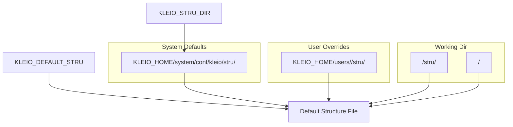
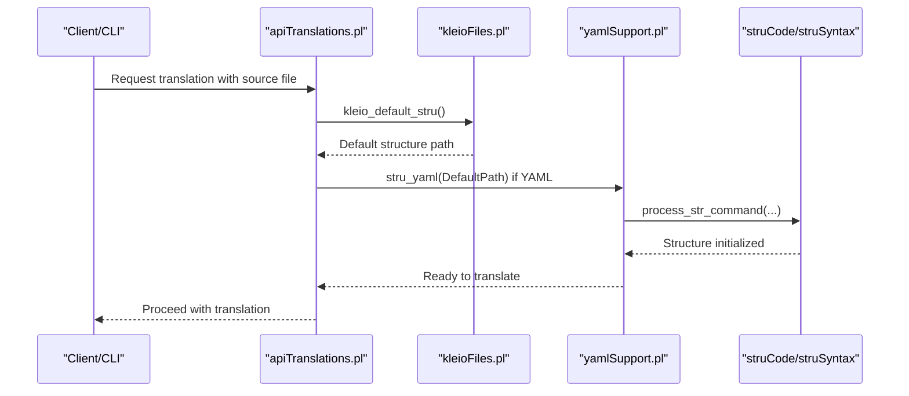
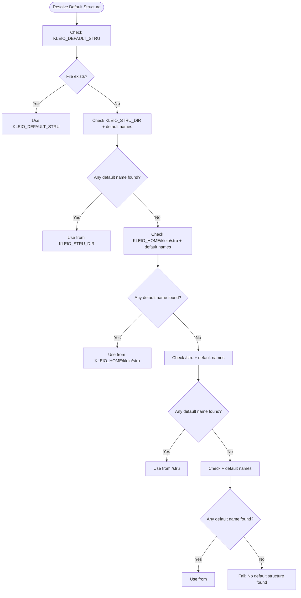
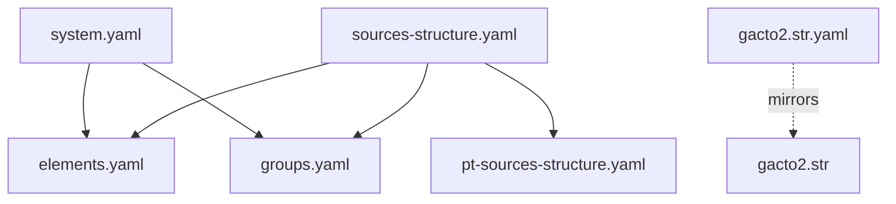
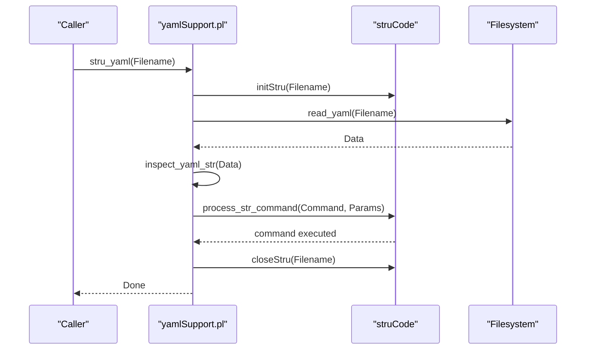
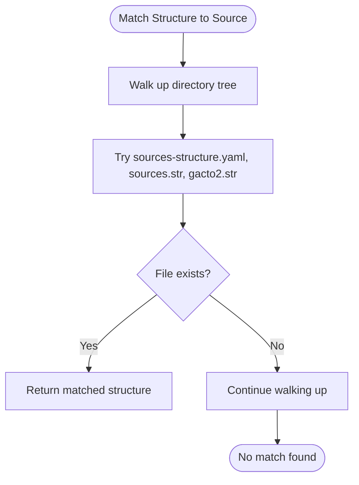
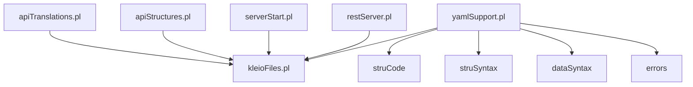

# Structure File Management

<cite>
**Referenced Files in This Document**
- [kleioFiles.pl](file://src/kleioFiles.pl)
- [yamlSupport.pl](file://src/yamlSupport.pl)
- [sources-structure.yaml](file://src/stru/sources-structure.yaml)
- [gacto2.str](file://src/stru/gacto2.str)
- [gacto2.str.yaml](file://src/stru/gacto2.str.yaml)
- [system.yaml](file://src/stru/system.yaml)
- [apiStructures.pl](file://src/apiStructures.pl)
- [apiTranslations.pl](file://src/apiTranslations.pl)
- [serverStart.pl](file://src/serverStart.pl)
- [restServer.pl](file://src/restServer.pl)
- [README.md](file://src/stru/README.md)
- [stru_file_location.md](file://docs/doc/stru_file_location.md)
</cite>

## Table of Contents
1. [Introduction](#introduction)
2. [Project Structure](#project-structure)
3. [Core Components](#core-components)
4. [Architecture Overview](#architecture-overview)
5. [Detailed Component Analysis](#detailed-component-analysis)
6. [Dependency Analysis](#dependency-analysis)
7. [Performance Considerations](#performance-considerations)
8. [Troubleshooting Guide](#troubleshooting-guide)
9. [Conclusion](#conclusion)
10. [Appendices](#appendices)

## Introduction
This document explains how Kleio manages structure files that define the schema for translating source data. It covers:
- Where structure files are located and how they are discovered
- The legacy .str format and modern YAML-based definitions (.yaml)
- Fallback mechanisms and environment variable overrides (KLEIO_STRU_DIR, KLEIO_DEFAULT_STRU)
- Organizing multiple structure definitions, versioning, and migration strategies
- Performance considerations for loading and caching

## Project Structure
Structure files live under several locations with a clear precedence:
- System-level defaults: KLEIO_HOME/system/conf/kleio/stru/
- User-specific structures: KLEIO_HOME/users/<user>/stru/
- Working directory fallbacks: <working_dir>/stru/ or <working_dir>/
- Environment overrides: KLEIO_STRU_DIR and KLEIO_DEFAULT_STRU

The default entry point for YAML-based structures is sources-structure.yaml, which includes modular pieces such as elements.yaml, groups.yaml, and domain-specific modules like pt-sources-structure.yaml. A legacy default gacto2.str remains supported for backward compatibility.

**Diagram sources**
- [kleioFiles.pl:687-713](file://src/kleioFiles.pl#L687-L713)
- [kleioFiles.pl:729-767](file://src/kleioFiles.pl#L729-L767)
- [serverStart.pl:130-132](file://src/serverStart.pl#L130-L132)
- [restServer.pl:111-113](file://src/restServer.pl#L111-L113)

**Section sources**
- [README.md:1-7](file://src/stru/README.md#L1-L7)
- [stru_file_location.md:1-34](file://docs/doc/stru_file_location.md#L1-L34)

## Core Components
- Directory resolution and default selection:
  - kleio_stru_dir/1 resolves the base structure directory with precedence: environment override, then standard system path, then source-relative paths.
  - kleio_default_stru/1 selects the default structure file using KLEIO_DEFAULT_STRU, then checks KLEIO_STRU_DIR, then KLEIO_HOME/kleio/stru/, then working directory variants.
  - kleio_default_stru_names/1 provides the ordered list of candidate names (e.g., sources-structure.yaml, gacto2.str).
- YAML processing:
  - yamlSupport module reads YAML structure files, tracks included files to avoid reprocessing, and dispatches commands to the core structure engine (struCode).
  - Supports include directives and file metadata via YAML entries.
- API discovery:
  - apiStructures.pl can recursively discover structure files by extension (.str, .yaml, .srpt).
  - apiTranslations.pl matches CLI files to nearby structure files using depth-first search patterns.

**Section sources**
- [kleioFiles.pl:687-713](file://src/kleioFiles.pl#L687-L713)
- [kleioFiles.pl:715-767](file://src/kleioFiles.pl#L715-L767)
- [yamlSupport.pl:28-72](file://src/yamlSupport.pl#L28-L72)
- [yamlSupport.pl:119-129](file://src/yamlSupport.pl#L119-L129)
- [apiStructures.pl:105-144](file://src/apiStructures.pl#L105-L144)
- [apiTranslations.pl:385-418](file://src/apiTranslations.pl#L385-L418)

## Architecture Overview
The structure file management spans three layers:
- Configuration and discovery: environment variables and directory resolution
- Schema parsing: legacy .str parser and modern YAML processor
- API integration: discovery and matching utilities used by translation workflows

**Diagram sources**
- [apiTranslations.pl:385-418](file://src/apiTranslations.pl#L385-L418)
- [kleioFiles.pl:729-767](file://src/kleioFiles.pl#L729-L767)
- [yamlSupport.pl:28-72](file://src/yamlSupport.pl#L28-L72)

## Detailed Component Analysis

### Directory Resolution and Default Selection
- kleio_stru_dir/1:
  - Checks KLEIO_STRU_DIR first; otherwise falls back to KLEIO_HOME/.../stru or source-relative directories.
- kleio_default_stru/1:
  - Respects KLEIO_DEFAULT_STRU if set and exists.
  - Otherwise iterates through kleio_default_stru_names/1 in configured directories:
    - KLEIO_STRU_DIR
    - KLEIO_HOME/kleio/stru
    - <working_dir>/stru
    - <working_dir>
- kleio_resolve_structure_file/3:
  - Maps relative structure paths to absolute paths based on user options (structures(S)).

**Diagram sources**
- [kleioFiles.pl:729-767](file://src/kleioFiles.pl#L729-L767)

**Section sources**
- [kleioFiles.pl:687-713](file://src/kleioFiles.pl#L687-L713)
- [kleioFiles.pl:715-767](file://src/kleioFiles.pl#L715-L767)
- [kleioFiles.pl:850-877](file://src/kleioFiles.pl#L850-L877)

### Legacy .str Format
- gacto2.str defines the canonical historical-source model and Portuguese extensions.
- Still recognized as a default candidate via kleio_default_stru_names/1.
- Useful for backward compatibility and incremental migration.

**Section sources**
- [gacto2.str:1-800](file://src/stru/gacto2.str#L1-L800)
- [kleioFiles.pl:715-721](file://src/kleioFiles.pl#L715-L721)

### Modern YAML Schema Definitions
- sources-structure.yaml acts as the primary orchestrator, including modular components:
  - elements.yaml
  - groups.yaml
  - pt-sources-structure.yaml
- system.yaml includes foundational groups and elements.
- gacto2.str.yaml is an auto-generated representation mirroring gacto2.str in YAML form.

**Diagram sources**
- [sources-structure.yaml:1-10](file://src/stru/sources-structure.yaml#L1-L10)
- [system.yaml:1-4](file://src/stru/system.yaml#L1-L4)
- [gacto2.str.yaml:1-800](file://src/stru/gacto2.str.yaml#L1-L800)
- [gacto2.str:1-800](file://src/stru/gacto2.str#L1-L800)

**Section sources**
- [sources-structure.yaml:1-10](file://src/stru/sources-structure.yaml#L1-L10)
- [system.yaml:1-4](file://src/stru/system.yaml#L1-L4)
- [gacto2.str.yaml:1-800](file://src/stru/gacto2.str.yaml#L1-L800)

### YAML Processing Pipeline
- Entry points:
  - stru_yaml/1 initializes state and delegates to new_yaml_str/2.
  - new_yaml_str/2 sets up the structure engine, reads YAML, inspects commands, and reports errors/warnings.
- Command handling:
  - inspect_yaml_str/1 iterates over YAML entries.
  - process_str_command/2 maps YAML commands to internal commands and executes parameters via struCode.
- Include mechanism:
  - include_yaml_str/2 normalizes paths and recursively reads included files while avoiding cycles.

**Diagram sources**
- [yamlSupport.pl:28-46](file://src/yamlSupport.pl#L28-L46)
- [yamlSupport.pl:74-91](file://src/yamlSupport.pl#L74-L91)
- [yamlSupport.pl:119-129](file://src/yamlSupport.pl#L119-L129)

**Section sources**
- [yamlSupport.pl:28-72](file://src/yamlSupport.pl#L28-L72)
- [yamlSupport.pl:94-100](file://src/yamlSupport.pl#L94-L100)
- [yamlSupport.pl:119-129](file://src/yamlSupport.pl#L119-L129)

### Discovery and Matching Utilities
- Recursive discovery:
  - apiStructures.pl finds all structure files by extension (.str, .yaml, .srpt) within a directory tree.
- Depth-first matching:
  - apiTranslations.pl attempts to match a given CLI file to a structure file by searching parent directories for candidates like sources-structure.yaml, sources.str, or gacto2.str.

**Diagram sources**
- [apiTranslations.pl:385-418](file://src/apiTranslations.pl#L385-L418)

**Section sources**
- [apiStructures.pl:105-144](file://src/apiStructures.pl#L105-L144)
- [apiTranslations.pl:385-418](file://src/apiTranslations.pl#L385-L418)

## Dependency Analysis
Key dependencies among modules:
- yamlSupport depends on persistence, reports, struCode, struSyntax, dataSyntax, errors, and kleioFiles.
- apiTranslations uses kleioFiles for default structure resolution and performs pattern-based matching.
- serverStart and restServer document environment variables and defaults for KLEIO_STRU_DIR and KLEIO_DEFAULT_STRU.

**Diagram sources**
- [yamlSupport.pl:1-26](file://src/yamlSupport.pl#L1-L26)
- [apiTranslations.pl:385-418](file://src/apiTranslations.pl#L385-L418)
- [apiStructures.pl:105-144](file://src/apiStructures.pl#L105-L144)
- [serverStart.pl:130-132](file://src/serverStart.pl#L130-L132)
- [restServer.pl:111-113](file://src/restServer.pl#L111-L113)

**Section sources**
- [yamlSupport.pl:1-26](file://src/yamlSupport.pl#L1-L26)
- [apiTranslations.pl:385-418](file://src/apiTranslations.pl#L385-L418)
- [apiStructures.pl:105-144](file://src/apiStructures.pl#L105-L144)
- [serverStart.pl:130-132](file://src/serverStart.pl#L130-L132)
- [restServer.pl:111-113](file://src/restServer.pl#L111-L113)

## Performance Considerations
- Avoid repeated includes:
  - yamlSupport tracks processed files and warns on duplicates to prevent redundant parsing.
- Prefer YAML orchestration:
  - Using sources-structure.yaml to include smaller modules reduces duplication and improves maintainability.
- Minimize disk I/O:
  - Keep commonly used structure files in KLEIO_STRU_DIR or KLEIO_HOME/kleio/stru to reduce traversal overhead.
- Leverage environment overrides:
  - Set KLEIO_DEFAULT_STRU to a single, well-known file when running batch translations to avoid discovery costs.

[No sources needed since this section provides general guidance]

## Troubleshooting Guide
Common issues and resolutions:
- No default structure found:
  - Ensure KLEIO_DEFAULT_STRU points to an existing file, or place sources-structure.yaml or gacto2.str in one of the expected directories.
- Duplicate includes:
  - yamlSupport warns when a file is already processed; review include chains to eliminate cycles.
- Wrong structure selected:
  - Verify KLEIO_STRU_DIR and KLEIO_DEFAULT_STRU settings; check working directory presence of structure files.
- Migration from .str to .yaml:
  - Use gacto2.str.yaml as a reference mapping; update sources-structure.yaml to include your YAML modules; keep gacto2.str temporarily for compatibility during transition.

**Section sources**
- [kleioFiles.pl:769-771](file://src/kleioFiles.pl#L769-L771)
- [yamlSupport.pl:54-72](file://src/yamlSupport.pl#L54-L72)
- [gacto2.str.yaml:1-800](file://src/stru/gacto2.str.yaml#L1-L800)

## Conclusion
Kleio’s structure file management supports both legacy .str and modern YAML schemas with robust discovery and fallback mechanisms. By organizing definitions into modular YAML files and leveraging environment overrides, teams can manage multiple structure versions, migrate incrementally, and optimize performance.

[No sources needed since this section summarizes without analyzing specific files]

## Appendices

### Environment Variables Reference
- KLEIO_STRU_DIR: Base directory for structure files; overrides default system path.
- KLEIO_DEFAULT_STRU: Absolute path to the default structure file; takes highest precedence.

**Section sources**
- [kleioFiles.pl:687-713](file://src/kleioFiles.pl#L687-L713)
- [kleioFiles.pl:729-767](file://src/kleioFiles.pl#L729-L767)
- [serverStart.pl:130-132](file://src/serverStart.pl#L130-L132)
- [restServer.pl:111-113](file://src/restServer.pl#L111-L113)

### Recommended Organization Patterns
- System defaults: KLEIO_HOME/system/conf/kleio/stru/
- User overrides: KLEIO_HOME/users/<user>/stru/
- Per-project defaults: <working_dir>/stru/ or <working_dir>/
- Orchestration: sources-structure.yaml includes domain-specific modules (e.g., pt-sources-structure.yaml)

**Section sources**
- [stru_file_location.md:1-34](file://docs/doc/stru_file_location.md#L1-L34)
- [sources-structure.yaml:1-10](file://src/stru/sources-structure.yaml#L1-L10)