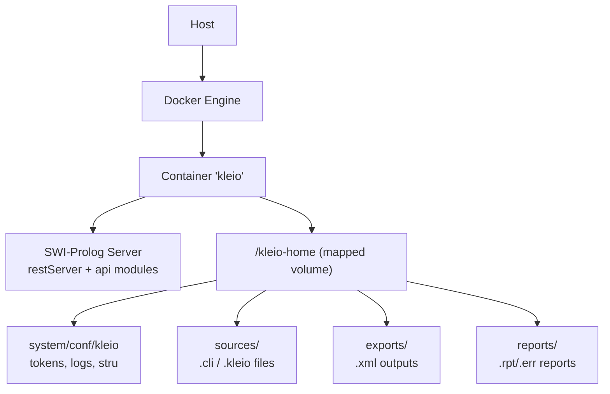
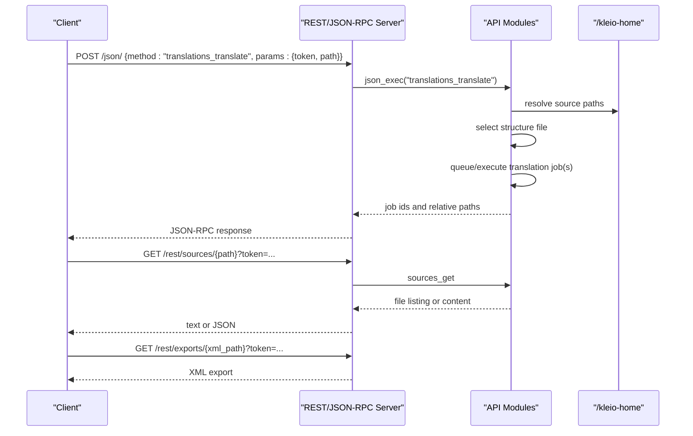
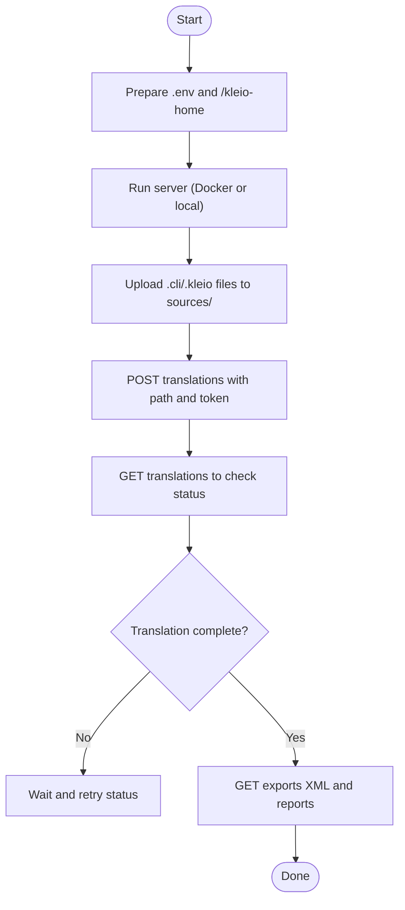
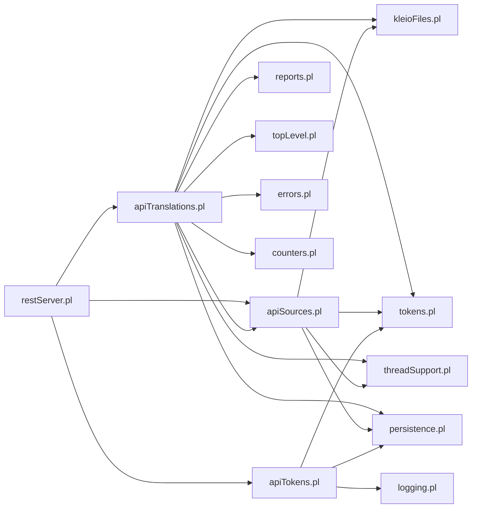

# Getting Started

<cite>
**Referenced Files in This Document**
- [README.md](file://README.md)
- [Dockerfile](file://Dockerfile)
- [docker-compose.yaml](file://docker-compose.yaml)
- [.env-sample](file://.env-sample)
- [Makefile](file://Makefile)
- [src/serverStart.pl](file://src/serverStart.pl)
- [src/restServer.pl](file://src/restServer.pl)
- [src/apiTokens.pl](file://src/apiTokens.pl)
- [src/apiTranslations.pl](file://src/apiTranslations.pl)
- [src/apiSources.pl](file://src/apiSources.pl)
- [docs/doc/client_setup.md](file://docs/doc/client_setup.md)
- [tests/README.md](file://tests/README.md)
</cite>

## Table of Contents
1. Introduction
2. Project Structure
3. Core Components
4. Architecture Overview
5. Detailed Component Analysis
6. Dependency Analysis
7. Performance Considerations
8. Troubleshooting Guide
9. Conclusion
10. Appendices

## Introduction
This guide helps you quickly install, configure, and run the Kleio translation services, upload sample Kleio files, perform translations, and access results. It covers Docker-based installation, local development with SWI-Prolog, environment configuration, token setup, and a basic workflow from source file to translated XML output. The content is designed for beginners while providing enough technical depth for experienced developers.

## Project Structure
At a high level:
- Docker image and compose definitions build and run the server.
- Environment variables control ports, tokens, workers, and paths.
- The Prolog server exposes REST and JSON-RPC endpoints for sources, translations, and tokens.
- Sample data and tests are provided under tests/.

**Diagram sources**
- [Dockerfile:1-22](file://Dockerfile#L1-L22)
- [docker-compose.yaml:1-22](file://docker-compose.yaml#L1-L22)
- [src/restServer.pl:330-350](file://src/restServer.pl#L330-L350)

**Section sources**
- [README.md:68-146](file://README.md#L68-L146)
- [Dockerfile:1-22](file://Dockerfile#L1-L22)
- [docker-compose.yaml:1-22](file://docker-compose.yaml#L1-L22)
- [.env-sample:1-119](file://.env-sample#L1-L119)

## Core Components
- REST/JSON-RPC server: starts HTTP servers, handles requests, dispatches to API modules, manages tokens and workers.
- API modules:
  - Sources: list, download, upload, copy, move, delete files.
  - Translations: start translation jobs, get status, clean results.
  - Tokens: generate, invalidate tokens; manage users.
- Configuration and persistence:
  - Token database, admin token bootstrap, runtime config written to .kleio.json.
  - Paths for home, conf, sources, structures.

Key responsibilities:
- Authentication via bearer tokens.
- File operations within KLEIO_SOURCE_DIR.
- Translation orchestration using structure definitions (.str or YAML).
- Exported XML and reports.

**Section sources**
- [src/restServer.pl:107-128](file://src/restServer.pl#L107-L128)
- [src/restServer.pl:330-350](file://src/restServer.pl#L330-L350)
- [src/restServer.pl:389-422](file://src/restServer.pl#L389-L422)
- [src/apiSources.pl:28-88](file://src/apiSources.pl#L28-L88)
- [src/apiTranslations.pl:35-84](file://src/apiTranslations.pl#L35-L84)
- [src/apiTokens.pl:18-88](file://src/apiTokens.pl#L18-L88)

## Architecture Overview
The server runs inside a container, exposing REST and JSON-RPC endpoints. Clients authenticate with tokens and interact with sources and translations.

**Diagram sources**
- [src/restServer.pl:656-748](file://src/restServer.pl#L656-L748)
- [src/apiTranslations.pl:146-164](file://src/apiTranslations.pl#L146-L164)
- [src/apiSources.pl:179-200](file://src/apiSources.pl#L179-L200)

## Detailed Component Analysis

### Installation with Docker
- Run latest image with a mapped working directory and port mapping.
- Optionally set an admin token via environment variable.
- If not provided, the server generates a bootstrap token and writes it to a file.

Steps:
1. Create a local directory for your Kleio workspace (e.g., my-kleio-home).
2. Start the server:
   - Use docker run or docker compose.
   - Map your host directory to /kleio-home.
   - Expose the server port (default 8088).
3. Configure environment variables:
   - KLEIO_ADMIN_TOKEN (optional but recommended).
   - KLEIO_HOME_DIR (if not using default).
   - KLEIO_SERVER_PORT and KLEIO_EXTERNAL_PORT.
   - KLEIO_DEBUG, KLEIO_SERVER_WORKERS, etc.
4. Retrieve the admin token if not set:
   - Check .kleio.json at the root of your mapped directory.
   - Or use the generated bootstrap token file path.

Notes:
- On Linux, run as current user to avoid permission issues.
- CORS can be configured via KLEIO_CORS_SITES.

**Section sources**
- [README.md:68-146](file://README.md#L68-L146)
- [docker-compose.yaml:1-22](file://docker-compose.yaml#L1-L22)
- [.env-sample:18-50](file://.env-sample#L18-L50)
- [src/restServer.pl:389-422](file://src/restServer.pl#L389-L422)
- [docs/doc/client_setup.md:15-88](file://docs/doc/client_setup.md#L15-L88)

### Local Development with SWI-Prolog
- Install SWI-Prolog and optionally VSCode with VSC-Prolog extension.
- Load serverStart.pl and start the debug or normal server.
- Set KLEIO_ADMIN_TOKEN in the Prolog session or via environment.
- Access the server on the configured port.

Useful commands:
- Start debug server and print configuration.
- Start production server and hold process.
- Stop servers by port.

**Section sources**
- [README.md:195-212](file://README.md#L195-L212)
- [src/serverStart.pl:13-26](file://src/serverStart.pl#L13-L26)
- [src/serverStart.pl:50-67](file://src/serverStart.pl#L50-L67)
- [src/serverStart.pl:189-201](file://src/serverStart.pl#L189-L201)

### Environment Configuration
Key variables:
- KLEIO_HOME_DIR: root working directory (mapped to /kleio-home in container).
- KLEIO_CONF_DIR: configuration directory (defaults inside system/conf/kleio).
- KLEIO_SOURCE_DIR: base directory for source files.
- KLEIO_STRU_DIR: global structure files directory.
- KLEIO_DEFAULT_STRU: default structure file.
- KLEIO_TOKEN_DB: token database path.
- KLEIO_SERVER_PORT: internal server port.
- KLEIO_EXTERNAL_PORT: exposed port when running Docker.
- KLEIO_ADMIN_TOKEN: initial admin token.
- KLEIO_SERVER_WORKERS: number of worker threads.
- KLEIO_IDLE_TIMEOUT: connection idle timeout.
- KLEIO_DEBUG: enable debug logging.
- KLEIO_CORS_SITES: allowed CORS sites.

Tips:
- Use .env with docker compose to centralize settings.
- For MHK integration, ensure mhk.kleio.service points to the correct URL.

**Section sources**
- [.env-sample:18-119](file://.env-sample#L18-L119)
- [src/restServer.pl:107-128](file://src/restServer.pl#L107-L128)
- [docs/doc/client_setup.md:151-209](file://docs/doc/client_setup.md#L151-L209)

### Initial Token Setup
- If KLEIO_ADMIN_TOKEN is set, it is used directly.
- Otherwise, the server bootstraps a temporary admin token and writes it to a file.
- You can generate a new token via the tokens API using the bootstrap token.
- Invalidate tokens or users as needed.

Workflow:
1. Start server without KLEIO_ADMIN_TOKEN to auto-generate bootstrap token.
2. Read the generated token from the file path indicated in .kleio.json.
3. Call tokens_generate to create a long-lived token with desired permissions.
4. Optionally invalidate the bootstrap token.

**Section sources**
- [src/restServer.pl:389-422](file://src/restServer.pl#L389-L422)
- [src/apiTokens.pl:41-88](file://src/apiTokens.pl#L41-L88)
- [docs/doc/client_setup.md:31-88](file://docs/doc/client_setup.md#L31-L88)

### Quick Start Examples

#### Run the server
- Using docker compose with .env:
  - Copy .env-sample to .env and adjust variables.
  - Run make kleio-run-latest or docker compose up.
- Using docker run:
  - Map a host directory to /kleio-home.
  - Set KLEIO_ADMIN_TOKEN if desired.
  - Map external port to internal server port.

**Section sources**
- [README.md:68-146](file://README.md#L68-L146)
- [Makefile:165-204](file://Makefile#L165-L204)
- [docker-compose.yaml:1-22](file://docker-compose.yaml#L1-L22)

#### Upload sample Kleio files
- Use the sources API to upload or copy files into KLEIO_SOURCE_DIR.
- Ensure your token has upload permission.
- Supported methods:
  - POST multipart to upload.
  - PUT multipart to update existing file.
  - POST with origin to copy.
  - PUT with origin to move.

**Section sources**
- [src/apiSources.pl:125-177](file://src/apiSources.pl#L125-L177)

#### Perform translations
- Start a translation job:
  - POST translations with path pointing to a file or directory.
  - Optional parameters: structure, echo, recurse, spawn, status.
- Get translation status:
  - GET translations with path and optional filters.
- Clean translation results:
  - DELETE translations for a file or directory.

**Section sources**
- [src/apiTranslations.pl:35-84](file://src/apiTranslations.pl#L35-L84)
- [src/apiTranslations.pl:87-140](file://src/apiTranslations.pl#L87-L140)

#### Access results
- Download exported XML:
  - GET /rest/exports/{xml_path} with token.
- View reports:
  - GET /rest/reports/{rpt_path} with token.
- List sources:
  - GET /rest/sources/{path} with token.

**Section sources**
- [src/apiTranslations.pl:529-577](file://src/apiTranslations.pl#L529-L577)
- [src/apiSources.pl:89-107](file://src/apiSources.pl#L89-L107)

### Basic Workflow: Source File to Translated XML

[No sources needed since this diagram shows conceptual workflow, not actual code structure]

## Dependency Analysis
High-level dependencies among core components:
- restServer depends on api modules (sources, translations, tokens), utilities, persistence, logging, tokens, threadSupport.
- apiTranslations uses apiSources, kleioFiles, tokens, threadSupport, reports, persistence, topLevel, errors, counters.
- apiSources uses kleioFiles, tokens, threadSupport, persistence.
- apiTokens uses tokens, persistence, logging.

**Diagram sources**
- [src/restServer.pl:151-166](file://src/restServer.pl#L151-L166)
- [src/apiTranslations.pl:22-33](file://src/apiTranslations.pl#L22-L33)
- [src/apiSources.pl:19-26](file://src/apiSources.pl#L19-L26)
- [src/apiTokens.pl:7-9](file://src/apiTokens.pl#L7-L9)

**Section sources**
- [src/restServer.pl:151-166](file://src/restServer.pl#L151-L166)
- [src/apiTranslations.pl:22-33](file://src/apiTranslations.pl#L22-L33)
- [src/apiSources.pl:19-26](file://src/apiSources.pl#L19-L26)
- [src/apiTokens.pl:7-9](file://src/apiTokens.pl#L7-L9)

## Performance Considerations
- Workers: Adjust KLEIO_SERVER_WORKERS to balance concurrency and resource usage.
- Idle timeout: Increase KLEIO_IDLE_TIMEOUT for large file downloads or slow clients.
- Spawn mode: In translations, spawn=yes distributes work across workers; spawn=no processes with a single worker and shared structure processing.
- Cache: Translation status responses may be cached internally to reduce overhead on repeated calls.

[No sources needed since this section provides general guidance]

## Troubleshooting Guide
Common issues and resolutions:
- Permission errors on Linux:
  - Run container as current user to avoid root-owned files.
- Missing admin token:
  - Provide KLEIO_ADMIN_TOKEN or read the bootstrap token from .kleio.json or the generated file path.
- CORS errors:
  - Set KLEIO_CORS_SITES appropriately.
- Port conflicts:
  - Change KLEIO_EXTERNAL_PORT and KLEIO_SERVER_PORT in .env.
- Debugging locally:
  - Use serverStart.pl to start debug server and inspect logs.
- Testing:
  - Use semantic and API tests to validate behavior.

**Section sources**
- [README.md:113-146](file://README.md#L113-L146)
- [README.md:195-212](file://README.md#L195-L212)
- [tests/README.md:102-112](file://tests/README.md#L102-L112)

## Conclusion
You now have the essentials to install, configure, and operate the Kleio translation services. With Docker or local SWI-Prolog, you can upload Kleio files, trigger translations, and retrieve XML outputs and reports. Use the provided environment variables and Make targets to streamline setup and testing.

[No sources needed since this section summarizes without analyzing specific files]

## Appendices

### Make Targets for Running and Testing
- Build and run:
  - make build-local
  - make kleio-run-latest
  - make kleio-run-current
- Stop:
  - make kleio-stop
- Tests:
  - make test-semantics
  - make test-api

**Section sources**
- [Makefile:165-204](file://Makefile#L165-L204)
- [Makefile:256-271](file://Makefile#L256-L271)