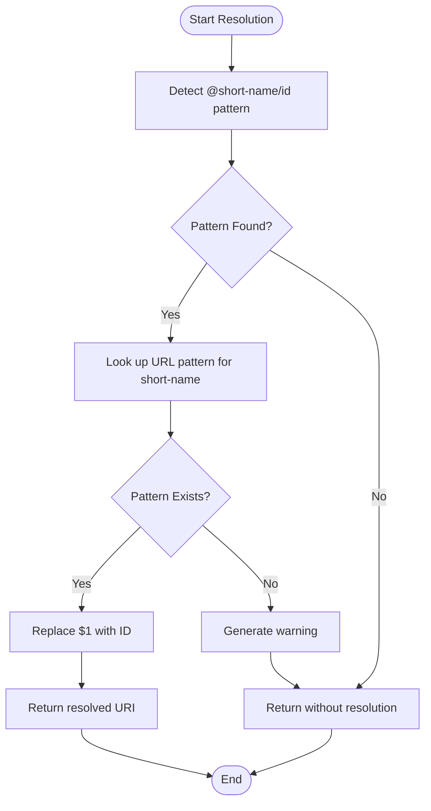

# Linked Data Integration

<cite>
**Referenced Files in This Document**   
- [linkedData.pl](file://src/linkedData.pl)
- [dehergne-a.cli](file://tests/kleio-home/sources/reference_sources/linked_data/dehergne-a.cli)
- [linked-datanw.cli](file://tests/kleio-home/sources/reference_sources/linked_data/linked-datanw.cli)
- [multiplelinks.cli](file://tests/kleio-home/sources/reference_sources/linked_data/multiplelinks.cli)
- [dehergne-locations-1644.cli](file://tests/kleio-home/sources/reference_sources/linked_data/dehergne-locations-1644.cli)
</cite>

## Table of Contents
1. [Introduction](#introduction)
2. [Linked Data Configuration](#linked-data-configuration)
3. [Resolution Algorithm](#resolution-algorithm)
4. [Caching Strategy](#caching-strategy)
5. [Error Handling](#error-handling)
6. [Test Cases and Examples](#test-cases-and-examples)
7. [Performance Considerations](#performance-considerations)
8. [Troubleshooting](#troubleshooting)

## Introduction
The timelink-kleio system provides robust linked data capabilities that enable the resolution of external references in Kleio files to entities in knowledge bases such as Wikidata. This functionality allows historical data to be enriched with connections to authoritative sources, enhancing data interoperability and semantic richness. The implementation is centered around the `linkedData.pl` module, which handles the detection, resolution, and generation of URIs for external references. This document comprehensively explains the system's architecture, configuration options, resolution algorithms, caching mechanisms, error handling, and performance characteristics.

**Section sources**
- [linkedData.pl](file://src/linkedData.pl#L1-L116)

## Linked Data Configuration
The linked data functionality in timelink-kleio is configured through special attributes in Kleio files that define external data sources. These configurations follow a specific syntax pattern using the `link$` directive, which establishes a mapping between a short name and a URL pattern containing a placeholder (`$1`) for entity identifiers.

In a Kleio file, the configuration appears as:
```
link$short-name/url-pattern
```

Where:
- `short-name` is an identifier for the external source
- `url-pattern` is a URL template with `$1` as a placeholder for specific entity IDs

Multiple external sources can be defined within the same document, enabling references to various knowledge bases. For example, a document can simultaneously configure links to Wikidata, the Portuguese National Library (BNPortugal), and Internet Archive:

```text
link$wikidata/"https://www.wikidata.org/wiki/$1"
link$bnportugal/"http://id.bnportugal.gov.pt/aut/catbnp/$1"
link$iarchive/"https://archive.org/details/$1"
```

These configurations are stored dynamically using Prolog's `xlink_pattern/2` predicate, which maintains a mapping between short names and their corresponding URL patterns. When a new pattern is stored, any existing pattern with the same short name is automatically replaced, ensuring that the most recent configuration takes precedence.

**Section sources**
- [linkedData.pl](file://src/linkedData.pl#L16-L30)
- [multiplelinks.cli](file://tests/kleio-home/sources/reference_sources/linked_data/multiplelinks.cli#L2-L4)

## Resolution Algorithm
The resolution algorithm in timelink-kleio follows a two-step process for handling linked data annotations in Kleio files. The first step involves detecting external link annotations in the text, while the second step generates the corresponding URIs using the configured URL patterns.

External link annotations follow the format `@short-name/id`, where `short-name` corresponds to a previously defined external source, and `id` is the specific identifier of the entity in that source. The detection process uses regular expressions to identify these annotations within text values. The `detect_xlink/3` predicate extracts both the short name and the ID from the annotation.

Once detected, the `generate_xlink/4` predicate processes the annotation by:
1. Extracting the short name and ID using `detect_xlink/3`
2. Looking up the corresponding URL pattern via `xlink_pattern/2`
3. Replacing the `$1` placeholder in the URL pattern with the actual ID using `replace_xid/3`
4. Returning the fully resolved URI

The algorithm is designed to be fault-tolerant. When a referenced short name has no corresponding URL pattern defined, the system generates a warning rather than failing completely. This graceful degradation ensures that documents with incomplete linked data configurations can still be processed while alerting users to potential configuration issues.



**Diagram sources**
- [linkedData.pl](file://src/linkedData.pl#L68-L108)

**Section sources**
- [linkedData.pl](file://src/linkedData.pl#L68-L108)

## Caching Strategy
The timelink-kleio system implements a dynamic caching mechanism for linked data through Prolog's built-in database predicates. The system uses two dynamic predicates: `xlink_pattern/2` for storing URL patterns and `xlink_data/2` for storing resolved links.

The `xlink_pattern/2` predicate maintains the mapping between short names and URL patterns, allowing for efficient lookup during the resolution process. This cache is thread-local, meaning that each processing thread maintains its own copy of the patterns, preventing conflicts in multi-threaded environments.

The `xlink_data/2` predicate is designed to store resolved links (URI and corresponding text), though its usage is currently commented out in the code. This suggests a potential caching mechanism for resolved entities that could improve performance by avoiding repeated resolution of the same references.

The system provides explicit predicates for cache management:
- `clear_xlink_patterns/0`: Removes all stored URL patterns
- `clear_xlink_data/0`: Clears all stored linked data links
- `store_xlink_pattern/2`: Stores or updates a URL pattern for a given short name

This caching strategy enables efficient resolution of multiple references to the same external source within a document or across multiple documents processed in sequence. The dynamic nature of the predicates allows for runtime configuration changes, making the system adaptable to different data sources and requirements.

**Section sources**
- [linkedData.pl](file://src/linkedData.pl#L44-L45)
- [linkedData.pl](file://src/linkedData.pl#L65-L66)
- [linkedData.pl](file://src/linkedData.pl#L111-L116)

## Error Handling
The timelink-kleio system implements comprehensive error handling for linked data operations, prioritizing graceful degradation over failure. When encountering issues with linked data resolution, the system generates warnings rather than halting processing, ensuring that documents can still be parsed and utilized even with incomplete or incorrect linked data configurations.

The primary error scenario occurs when a document contains a linked data annotation referencing a short name that has no corresponding URL pattern defined. In this case, the `generate_xlink/4` predicate triggers a warning message that includes:
- The text containing the unresolved reference
- An indication that the link definition is missing
- The specific short name that could not be resolved

This informative warning helps users identify and correct configuration issues. The error handling is implemented in the conditional logic within `generate_xlink/4`, which checks for the existence of a URL pattern before attempting resolution. If no pattern is found, the system calls `warning_out/1` with a descriptive message rather than failing.

The system also includes defensive programming practices, such as using `retractall/1` with a disjunction to ensure that previous patterns are removed before storing new ones, and employing cuts (`!`) to prevent backtracking in critical operations. These practices enhance the reliability and predictability of the linked data resolution process.

**Section sources**
- [linkedData.pl](file://src/linkedData.pl#L103-L108)
- [linked-datanw.cli](file://tests/kleio-home/sources/reference_sources/linked_data/linked-datanw.cli#L6)

## Test Cases and Examples
The timelink-kleio repository includes several test files that demonstrate the linked data functionality in practice. These examples illustrate various configurations and usage patterns, providing insight into how the system handles real-world scenarios.

The `multiplelinks.cli` test file demonstrates a document configured with multiple external sources (Wikidata, BNPortugal, and Internet Archive). It shows how a single entity can be linked to multiple knowledge bases simultaneously:

```text
link$wikidata/"https://www.wikidata.org/wiki/$1"
link$bnportugal/"http://id.bnportugal.gov.pt/aut/catbnp/$1"
link$iarchive/"https://archive.org/details/$1"
...
#Sobre o autor @wikidata:Q17057616 @bnportugal:129297
```

The `dehergne-a.cli` file provides a comprehensive example of linked data usage in a biographical context, with numerous references to Wikidata entities for people, locations, and historical events. For instance:

```text
ls$jesuita-entrada/Goa, Índia# @wikidata:Q1171/15791200
ls$jesuita-votos-local/Negapattinam, Índia%Negapatami (Négapatam)# @wikidata:Q695585/16040106
```

The `linked-datanw.cli` file specifically tests error handling by including a reference to a non-existent external source (`bdcconline`), which triggers the system's warning mechanism:

```text
n$Giulio Aleni/id=deh-giulio-aleni#@bdcconline:aleni-giulio
```

These test cases validate the system's ability to handle multiple concurrent links, resolve complex annotations with additional metadata (dates, qualifiers), and gracefully manage missing configurations through informative warnings.

**Section sources**
- [multiplelinks.cli](file://tests/kleio-home/sources/reference_sources/linked_data/multiplelinks.cli)
- [dehergne-a.cli](file://tests/kleio-home/sources/reference_sources/linked_data/dehergne-a.cli)
- [linked-datanw.cli](file://tests/kleio-home/sources/reference_sources/linked_data/linked-datanw.cli)

## Performance Considerations
The linked data implementation in timelink-kleio is designed with performance in mind, particularly regarding network-dependent operations. Since the system resolves references to external knowledge bases like Wikidata, it must balance the need for accurate data with the potential latency of network requests.

The current implementation focuses on URI generation rather than real-time data retrieval from external sources. By only constructing URLs rather than fetching data from them, the system minimizes network dependencies during the parsing process. This approach enables offline operation, as the resolution process does not require immediate connectivity to the external knowledge bases.

The caching mechanism using Prolog's dynamic predicates ensures that URL pattern lookups are performed efficiently, with O(1) complexity for pattern retrieval. This is particularly beneficial when processing documents with numerous references to the same external source.

For applications requiring actual data from the linked sources, the generated URIs can be used in subsequent processing stages, potentially with additional caching, rate limiting, and fallback strategies implemented at the application level. The separation of URI generation from data retrieval allows for flexible performance optimization strategies depending on the specific use case and deployment environment.

**Section sources**
- [linkedData.pl](file://src/linkedData.pl#L80-L90)

## Troubleshooting
Common issues with linked data in timelink-kleio typically involve configuration errors, resolution failures, and data consistency problems. Understanding these issues and their solutions is essential for maintaining reliable linked data functionality.

**Resolution Failures**: The most common issue occurs when a document contains a linked data annotation with a short name that has no corresponding URL pattern defined. This results in warning messages during processing. To resolve this, ensure that all referenced short names are properly defined using the `link$` directive before they are used in annotations.

**Rate Limiting**: When applications built on timelink-kleio retrieve data from external sources like Wikidata, they may encounter rate limiting. Implement client-side rate limiting, request batching, and appropriate retry mechanisms with exponential backoff to handle this gracefully.

**Data Consistency Problems**: Differences between the identifiers used in Kleio files and those in external knowledge bases can lead to broken links. Maintain up-to-date mappings and consider implementing a validation step that checks the existence of referenced entities in the target knowledge bases.

**Offline Operation**: For environments with limited or no internet connectivity, implement a local cache of frequently accessed entities from external knowledge bases. This allows the system to function effectively offline while maintaining access to essential linked data.

**Configuration Validation**: Regularly validate linked data configurations by testing with sample documents and verifying that all expected URIs are generated correctly. The test files in the repository serve as excellent validation tools for this purpose.

**Section sources**
- [linked-datanw.cli](file://tests/kleio-home/sources/reference_sources/linked_data/linked-datanw.cli#L6)
- [linkedData.pl](file://src/linkedData.pl#L103-L108)