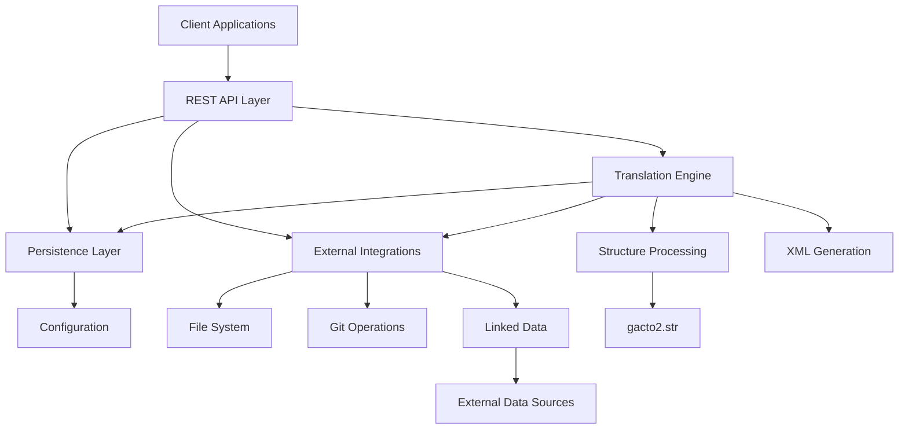

# Project Overview

<cite>
**Referenced Files in This Document**   
- [README.md](file://README.md)
- [restServer.pl](file://src/restServer.pl)
- [gactoxml.pl](file://src/gactoxml.pl)
- [persistence.pl](file://src/persistence.pl)
- [linkedData.pl](file://src/linkedData.pl)
- [apiTranslations.pl](file://src/apiTranslations.pl)
- [apiSources.pl](file://src/apiSources.pl)
- [apiDirectories.pl](file://src/apiDirectories.pl)
- [serverStart.pl](file://src/serverStart.pl)
- [topLevel.pl](file://src/topLevel.pl)
- [kleioFiles.pl](file://src/kleioFiles.pl)
- [threadSupport.pl](file://src/threadSupport.pl)
- [apiCommon.pl](file://src/apiCommon.pl)
- [externals.pl](file://src/externals.pl)
</cite>

## Table of Contents
1. [Introduction](#introduction)
2. [Core Architecture](#core-architecture)
3. [Key Features](#key-features)
4. [Component Relationships](#component-relationships)
5. [Practical Use Cases](#practical-use-cases)
6. [System Constraints and Design Trade-offs](#system-constraints-and-design-trade-offs)
7. [Scalability Considerations](#scalability-considerations)

## Introduction
The timelink-kleio project is a specialized translation server written in SWI-Prolog that processes historical document transcriptions in Kleio notation and provides REST API services to translate them into normalized XML for integration with the Timelink database system. The Kleio notation, originally developed by Manfred Thaller for historical source transcription, provides a concise way to represent complex historical documents. The timelink-kleio server implements a subset of this notation specifically designed for the Timelink database system, which focuses on person-oriented information collected from historical documents.

The server provides intelligent translation capabilities that normalize source information by inferring context, thereby reducing the overhead of producing normalized data. This translation process enables the Timelink database system to perform functions such as person identification, biography reconstruction, personal network inference, and other analytical capabilities. The server is designed to decouple Kleio source handling from other software components, providing a clean API interface for file management, translation services, and basic Git operations.

**Section sources**
- [README.md](file://README.md#L1-L503)

## Core Architecture
The timelink-kleio server features a modular component-based architecture with thread-safe operations and configuration-driven behavior. The system is built on SWI-Prolog and follows a layered design pattern with clear separation of concerns. The core architectural components include a REST API layer, translation engine, persistence layer, and external integrations.

The server's architecture is designed to be configuration-driven, with environment variables controlling key aspects of behavior such as port numbers, worker threads, and directory locations. The system supports multiple deployment methods, including Docker containers and local development environments. The server can be configured through environment variables or a `.env` file when using Docker Compose, allowing for flexible deployment across different environments.

Thread safety is achieved through the use of SWI-Prolog's threading capabilities and message queues. The server implements a worker pool pattern with configurable numbers of worker threads that process translation jobs from a message queue. This design allows for concurrent processing of multiple translation requests while maintaining data integrity through proper synchronization mechanisms.

**Section sources**
- [README.md](file://README.md#L1-L503)
- [restServer.pl](file://src/restServer.pl#L1-L1802)
- [serverStart.pl](file://src/serverStart.pl#L1-L442)
- [threadSupport.pl](file://src/threadSupport.pl#L1-L153)

## Key Features
The timelink-kleio server provides several key features that enhance its functionality for processing historical document transcriptions. The most significant feature is intelligent translation, which operates a normalization of source information by inferring context from the data. This intelligent processing reduces the overhead of producing normalized data by automatically generating kinship relations around the main actor of each act and validating information based on contextual understanding.

Structure processing is another critical feature, enabled by the generic Kleio structure (schema) definition called *gacto2.str*. This structure describes a source as a document containing acts, which in turn contain references to persons or objects. The schema includes abstract groups for persons (male and female) that allow the system to understand gender-specific information and generate appropriate kinship relationships. When creating structure files for specific source documents, concrete person groups are created with names that describe the function of persons in the source, connected to the abstract groups through inheritance.

Linked data integration is a powerful feature that allows mapping Kleio data items to external data sources. This is achieved through a two-step process: declaring external sources with URL patterns and annotating element values with external IDs. For example, a location can be linked to Wikidata by declaring a link pattern and annotating the location value with a Wikidata ID, which is then transformed into a full URI during translation.

Git version control integration provides basic Git operations (fetch, pull, commit, push) through the API, allowing the server to isolate other software components from directly handling file-related operations. This integration enables version control of historical document transcriptions without requiring clients to implement Git functionality.

**Section sources**
- [README.md](file://README.md#L1-L503)
- [gactoxml.pl](file://src/gactoxml.pl#L1-L2781)
- [linkedData.pl](file://src/linkedData.pl#L1-L116)

## Component Relationships
The timelink-kleio server consists of several interconnected components that work together to provide translation services. The primary components include the REST API layer, translation engine, persistence layer, and external integrations. These components are organized in a modular fashion with well-defined interfaces and dependencies.

The REST API layer serves as the entry point for all client interactions, handling HTTP requests and responses. It is implemented in `restServer.pl` and uses SWI-Prolog's HTTP library to provide both REST and JSON-RPC endpoints. The API layer delegates operations to specialized modules based on the requested entity (sources, directories, translations, etc.). Each API module (e.g., `apiSources.pl`, `apiTranslations.pl`) implements specific functionality while adhering to a consistent pattern of request processing, authorization checking, and response formatting.

The translation engine, implemented primarily in `gactoxml.pl`, is responsible for processing Kleio source files according to structure definitions and generating normalized XML output. This component uses a callback mechanism where the core translator processes the syntax and calls export modules when data for a group is available. The export modules can then request data from the translator, creating a bidirectional interaction that enables complex data transformations.

The persistence layer, implemented in `persistence.pl`, provides mechanisms for storing and retrieving values and properties with thread-safe operations. This layer supports both thread-local and shared storage, allowing components to maintain state across different parts of the system. The persistence layer is used extensively throughout the application for configuration, caching, and state management.

External integrations include file system operations, Git operations, and linked data processing. These components interact with the core system through well-defined interfaces, allowing for extensibility and maintainability. The component relationships are designed to minimize coupling while maximizing cohesion, with each component having a single responsibility and clear boundaries.

**Diagram sources**
- [restServer.pl](file://src/restServer.pl#L1-L1802)
- [gactoxml.pl](file://src/gactoxml.pl#L1-L2781)
- [persistence.pl](file://src/persistence.pl#L1-L380)
- [apiSources.pl](file://src/apiSources.pl#L1-L425)
- [apiTranslations.pl](file://src/apiTranslations.pl#L1-L779)

**Section sources**
- [restServer.pl](file://src/restServer.pl#L1-L1802)
- [gactoxml.pl](file://src/gactoxml.pl#L1-L2781)
- [persistence.pl](file://src/persistence.pl#L1-L380)
- [apiSources.pl](file://src/apiSources.pl#L1-L425)
- [apiTranslations.pl](file://src/apiTranslations.pl#L1-L779)

## Practical Use Cases
The timelink-kleio server supports several practical use cases for processing historical document transcriptions. One common use case is uploading Kleio files through the REST API. Clients can upload files using multipart POST requests to the `/sources/` endpoint, with proper authentication via bearer tokens. The server validates file permissions and processes the upload, making the file available for translation.

Another important use case is translating with contextual normalization. Clients can initiate translations by sending POST requests to the `/translations/` endpoint with parameters specifying the source path, structure file, and other options. The server processes the request by first resolving the source file path, checking permissions, and then queuing the translation job. During translation, the system applies intelligent normalization, inferring information from context and generating appropriate XML output with proper relationships and attributes.

Exporting structured XML is a key use case that enables integration with the Timelink database system. After successful translation, clients can retrieve the normalized XML through the `/exports/` endpoint. The XML output follows a standardized format that preserves the hierarchical structure of the original document while normalizing data for database import. The system also generates auxiliary files such as translation reports, error summaries, and metadata files that provide additional context about the translation process.

Additional use cases include managing source directories, retrieving translation status, and handling linked data. The API provides comprehensive file management capabilities, allowing clients to create, delete, and list directories and files. Translation status can be queried to determine whether files need reprocessing due to changes or to monitor the progress of ongoing translations. Linked data annotations in source files are processed to create connections with external data sources, enriching the exported XML with references to entities in systems like Wikidata.

**Section sources**
- [README.md](file://README.md#L1-L503)
- [apiSources.pl](file://src/apiSources.pl#L1-L425)
- [apiTranslations.pl](file://src/apiTranslations.pl#L1-L779)
- [gactoxml.pl](file://src/gactoxml.pl#L1-L2781)

## System Constraints and Design Trade-offs
The timelink-kleio server operates within several system constraints that have influenced its design decisions. One primary constraint is the use of SWI-Prolog as the implementation language, which affects performance characteristics, deployment options, and developer accessibility. While Prolog provides excellent capabilities for symbolic processing and rule-based systems, it may present a learning curve for developers more familiar with mainstream programming languages.

A significant design trade-off is the balance between flexibility and complexity in the translation process. The system supports multiple ways to specify structure files (default, per-request, and file-based discovery), which increases flexibility but adds complexity to the translation workflow. Similarly, the support for various file location strategies (container-mounted volumes, home directory conventions, and environment variable overrides) enhances deployment flexibility but requires careful configuration management.

Security considerations have led to design decisions around file path resolution and access control. The system implements token-based authentication with role-based permissions, but the file system operations require careful path validation to prevent directory traversal attacks. The use of relative paths in API responses and the resolution of absolute paths through token information help mitigate some of these risks.

Performance trade-offs exist between memory usage and processing speed. The system caches frequently accessed data such as structure file information and translation status to improve response times, but this increases memory consumption. The worker pool design allows for concurrent processing but requires careful tuning of thread counts and queue sizes to balance resource utilization and responsiveness.

**Section sources**
- [README.md](file://README.md#L1-L503)
- [restServer.pl](file://src/restServer.pl#L1-L1802)
- [kleioFiles.pl](file://src/kleioFiles.pl#L1-L933)
- [persistence.pl](file://src/persistence.pl#L1-L380)

## Scalability Considerations
The timelink-kleio server includes several features designed to support scalability in various deployment scenarios. The worker pool architecture with configurable thread counts allows the system to handle multiple concurrent translation requests, with performance scaling based on available CPU resources. The message queue-based job distribution ensures that translation tasks are processed efficiently without overwhelming system resources.

Horizontal scaling is supported through stateless operation, where multiple server instances can be deployed behind a load balancer. Since the system primarily operates on files stored in a shared volume, multiple instances can process different files simultaneously without coordination. However, care must be taken to avoid race conditions when multiple instances process the same file, which can be mitigated through proper file locking or by ensuring that each file is processed by only one instance.

Caching strategies contribute to scalability by reducing redundant processing. The system caches translation status information with configurable time-to-live values, preventing expensive file system operations when checking the status of large numbers of files. Structure file processing is also optimized through caching, with the system ensuring that each structure file is processed only once even when multiple translation jobs use the same structure.

Resource utilization can be tuned through configuration parameters such as the number of worker threads, idle timeout, and memory limits. These settings allow administrators to optimize the server for different workloads, from low-memory environments with infrequent translations to high-performance systems handling large volumes of concurrent requests. The Docker-based deployment model further enhances scalability by enabling container orchestration and resource isolation.

**Section sources**
- [README.md](file://README.md#L1-L503)
- [restServer.pl](file://src/restServer.pl#L1-L1802)
- [threadSupport.pl](file://src/threadSupport.pl#L1-L153)
- [apiTranslations.pl](file://src/apiTranslations.pl#L1-L779)