# Architecture Overview

<cite>
**Referenced Files in This Document**
- [restServer.pl](file://src/restServer.pl)
- [serverStart.pl](file://src/serverStart.pl)
- [Dockerfile](file://Dockerfile)
- [docker-compose.yaml](file://docker-compose.yaml)
- [Makefile](file://Makefile)
- [apiTranslations.pl](file://src/apiTranslations.pl)
- [apiSources.pl](file://src/apiSources.pl)
- [logging.pl](file://src/logging.pl)
- [tokens.pl](file://src/tokens.pl)
- [kleioFiles.pl](file://src/kleioFiles.pl)
- [threadSupport.pl](file://src/threadSupport.pl)
- [topLevel.pl](file://src/topLevel.pl)
- [utilities.pl](file://src/utilities.pl)
- [apiCommon.pl](file://src/apiCommon.pl)
- [reports.pl](file://src/reports.pl)
</cite>

## Table of Contents
1. [Introduction](#introduction)
2. [Project Structure](#project-structure)
3. [Core Components](#core-components)
4. [Architecture Overview](#architecture-overview)
5. [Detailed Component Analysis](#detailed-component-analysis)
6. [Dependency Analysis](#dependency-analysis)
7. [Performance Considerations](#performance-considerations)
8. [Troubleshooting Guide](#troubleshooting-guide)
9. [Conclusion](#conclusion)
10. [Appendices](#appendices)

## Introduction
This document describes the architecture of the Timelink Kleio system, focusing on the SWI-Prolog-based server that exposes REST and JSON-RPC APIs for managing Kleio source files, performing translations, and serving exports and reports. The system is designed with clear separation of concerns:
- Presentation layer: REST and JSON-RPC server
- Business logic layer: translation engine and API modules
- Data access layer: file system operations and token-based permissions

It covers infrastructure requirements, containerization with Docker, deployment topology, cross-cutting concerns (authentication, logging, error handling), and extensibility via pluggable API modules.

## Project Structure
The repository organizes code by functional areas:
- src/: Prolog modules implementing the REST server, API handlers, translation engine, file utilities, threading, logging, and support libraries
- tests/: test harness, fixtures, and scripts for validating functionality
- docs/: generated API documentation and supporting materials
- Root configuration: Dockerfile, docker-compose.yaml, Makefile, environment samples

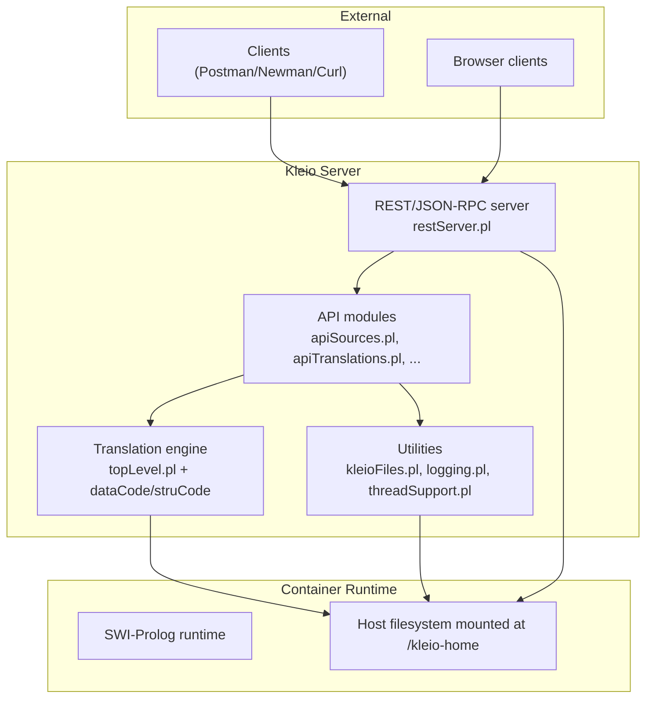

**Diagram sources**
- [restServer.pl](file://src/restServer.pl#L1-L120)
- [apiSources.pl](file://src/apiSources.pl#L1-L80)
- [apiTranslations.pl](file://src/apiTranslations.pl#L1-L60)
- [topLevel.pl](file://src/topLevel.pl#L1-L60)
- [kleioFiles.pl](file://src/kleioFiles.pl#L1-L60)
- [Dockerfile](file://Dockerfile#L1-L22)

**Section sources**
- [restServer.pl](file://src/restServer.pl#L1-L120)
- [Dockerfile](file://Dockerfile#L1-L22)
- [docker-compose.yaml](file://docker-compose.yaml#L1-L22)

## Core Components
- REST/JSON-RPC server: routes HTTP and JSON-RPC requests, enforces CORS, decodes tokens, and dispatches to API modules
- API modules: implement domain-specific operations (sources, translations, directories, exports, reports, tokens)
- Translation engine: processes structure and data files, generates reports and exports
- File utilities: resolve paths, manage derived files, and maintain file metadata
- Threading and job queue: worker pools for parallel translation jobs
- Logging and persistence: structured logs, token database, shared counters

**Section sources**
- [restServer.pl](file://src/restServer.pl#L120-L226)
- [apiCommon.pl](file://src/apiCommon.pl#L1-L89)
- [apiTranslations.pl](file://src/apiTranslations.pl#L1-L60)
- [apiSources.pl](file://src/apiSources.pl#L1-L80)
- [topLevel.pl](file://src/topLevel.pl#L34-L71)
- [kleioFiles.pl](file://src/kleioFiles.pl#L1-L60)
- [threadSupport.pl](file://src/threadSupport.pl#L1-L60)
- [logging.pl](file://src/logging.pl#L1-L40)

## Architecture Overview
The system follows a layered architecture:
- Presentation Layer: HTTP server with CORS and JSON-RPC endpoints
- Business Logic Layer: API modules orchestrating file operations and delegating translation tasks
- Data Access Layer: file system utilities and token database

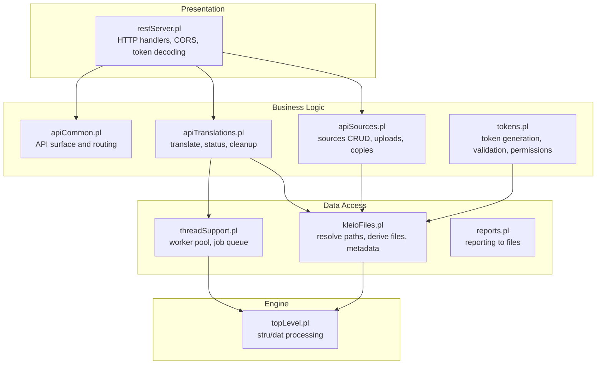

**Diagram sources**
- [restServer.pl](file://src/restServer.pl#L296-L350)
- [apiSources.pl](file://src/apiSources.pl#L28-L120)
- [apiTranslations.pl](file://src/apiTranslations.pl#L34-L120)
- [apiCommon.pl](file://src/apiCommon.pl#L28-L77)
- [tokens.pl](file://src/tokens.pl#L104-L140)
- [kleioFiles.pl](file://src/kleioFiles.pl#L53-L120)
- [threadSupport.pl](file://src/threadSupport.pl#L33-L63)
- [reports.pl](file://src/reports.pl#L27-L57)
- [topLevel.pl](file://src/topLevel.pl#L88-L160)

## Detailed Component Analysis

### REST Server and Request Routing
The REST server registers HTTP handlers for REST and JSON-RPC endpoints, applies CORS, decodes tokens, and dispatches to API modules. It supports:
- REST endpoints under /rest/*
- JSON-RPC under /json/*
- File upload via multipart/form-data
- Token-based authorization via Authorization: Bearer header

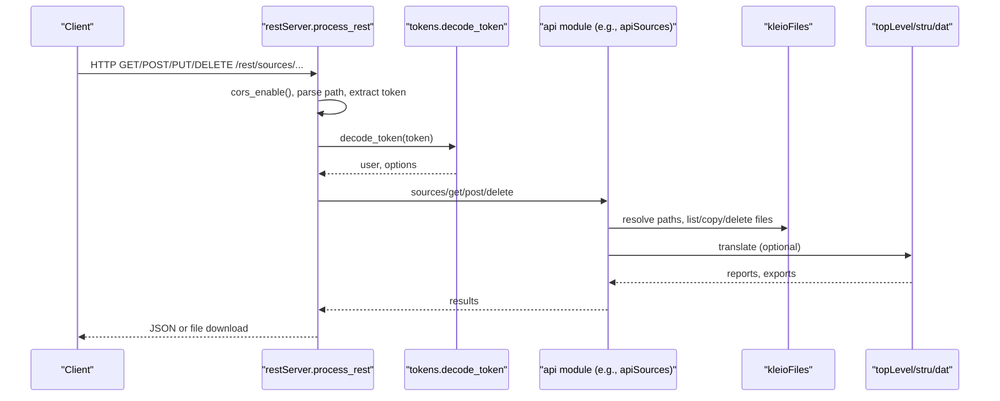

**Diagram sources**
- [restServer.pl](file://src/restServer.pl#L498-L546)
- [restServer.pl](file://src/restServer.pl#L553-L579)
- [tokens.pl](file://src/tokens.pl#L141-L151)
- [apiSources.pl](file://src/apiSources.pl#L89-L124)
- [kleioFiles.pl](file://src/kleioFiles.pl#L753-L800)
- [topLevel.pl](file://src/topLevel.pl#L102-L160)

**Section sources**
- [restServer.pl](file://src/restServer.pl#L296-L350)
- [restServer.pl](file://src/restServer.pl#L498-L546)
- [restServer.pl](file://src/restServer.pl#L553-L579)

### API Modules: Sources and Translations
- Sources API: retrieves, uploads, moves, copies, and deletes source files; supports recursive directory listing and URL generation for downloads
- Translations API: starts translations, queries status, cleans results; supports spawning jobs across workers and caching status

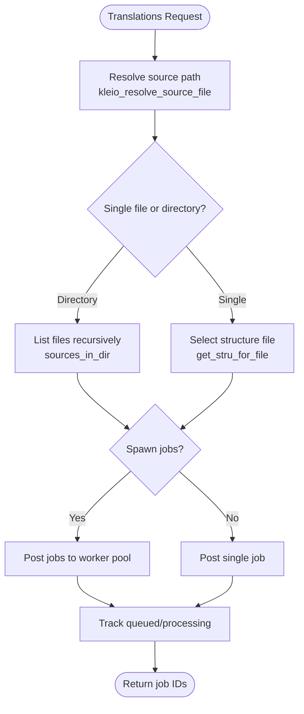

**Diagram sources**
- [apiTranslations.pl](file://src/apiTranslations.pl#L52-L82)
- [apiTranslations.pl](file://src/apiTranslations.pl#L241-L260)
- [apiTranslations.pl](file://src/apiTranslations.pl#L428-L432)
- [kleioFiles.pl](file://src/kleioFiles.pl#L753-L800)
- [threadSupport.pl](file://src/threadSupport.pl#L104-L125)

**Section sources**
- [apiSources.pl](file://src/apiSources.pl#L28-L124)
- [apiTranslations.pl](file://src/apiTranslations.pl#L34-L120)
- [apiTranslations.pl](file://src/apiTranslations.pl#L241-L260)
- [kleioFiles.pl](file://src/kleioFiles.pl#L257-L285)

### Translation Engine and Reporting
The translation engine processes structure and data files, writing reports and exports. It initializes the environment, processes lines, and manages report files.

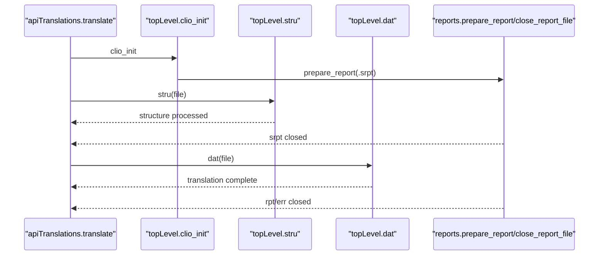

**Diagram sources**
- [apiTranslations.pl](file://src/apiTranslations.pl#L439-L455)
- [topLevel.pl](file://src/topLevel.pl#L89-L160)
- [reports.pl](file://src/reports.pl#L51-L66)

**Section sources**
- [topLevel.pl](file://src/topLevel.pl#L88-L160)
- [reports.pl](file://src/reports.pl#L27-L66)

### File System Operations and Derived Artifacts
File utilities resolve relative paths to absolute locations based on token options, manage derived files (rpt, err, xml, org, old, ids, files.json), and compute file metadata.

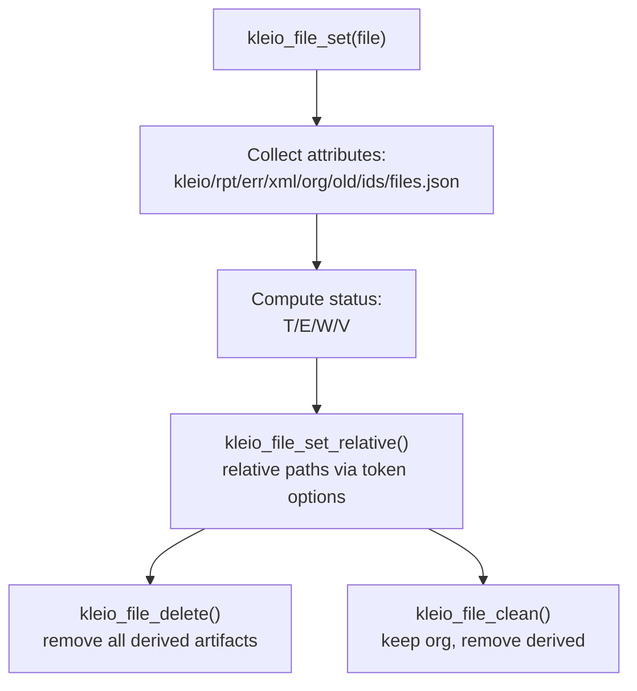

**Diagram sources**
- [kleioFiles.pl](file://src/kleioFiles.pl#L53-L120)
- [kleioFiles.pl](file://src/kleioFiles.pl#L111-L144)
- [kleioFiles.pl](file://src/kleioFiles.pl#L312-L384)

**Section sources**
- [kleioFiles.pl](file://src/kleioFiles.pl#L53-L120)
- [kleioFiles.pl](file://src/kleioFiles.pl#L111-L144)
- [kleioFiles.pl](file://src/kleioFiles.pl#L312-L384)

### Threading and Parallel Processing
The system uses a configurable worker pool or message queue to execute translation jobs concurrently, tracking queued and processing jobs.

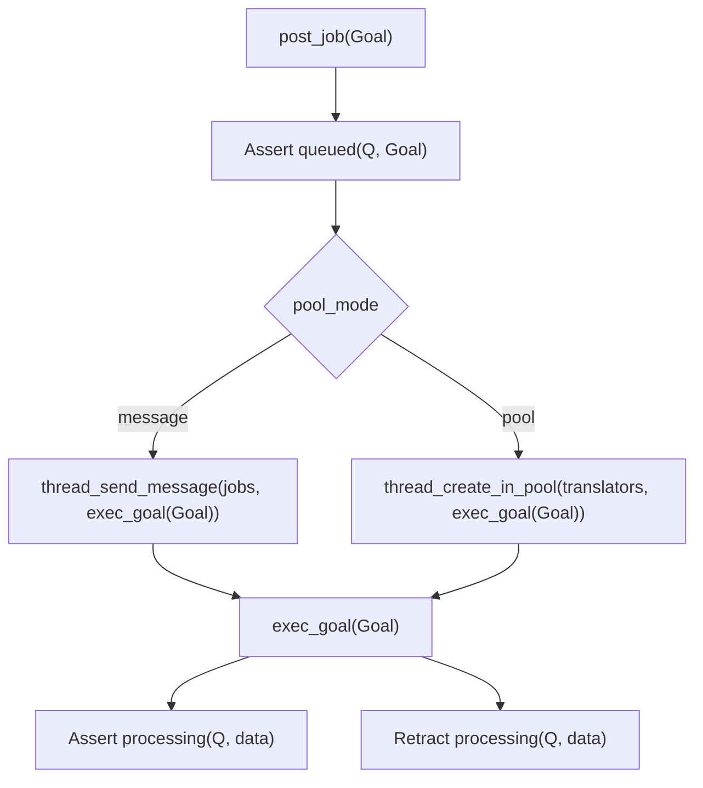

**Diagram sources**
- [threadSupport.pl](file://src/threadSupport.pl#L104-L125)
- [threadSupport.pl](file://src/threadSupport.pl#L70-L102)

**Section sources**
- [threadSupport.pl](file://src/threadSupport.pl#L33-L63)
- [threadSupport.pl](file://src/threadSupport.pl#L104-L125)

### Authentication and Authorization
Access to the API requires a valid token. Tokens carry permissions and can be short-lived. The server validates tokens and enforces API permissions per endpoint.

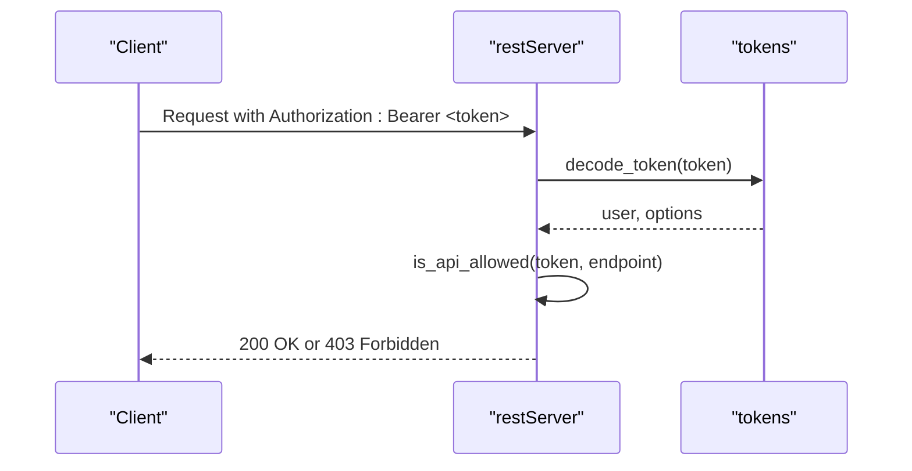

**Diagram sources**
- [restServer.pl](file://src/restServer.pl#L560-L600)
- [tokens.pl](file://src/tokens.pl#L141-L151)
- [tokens.pl](file://src/tokens.pl#L249-L258)

**Section sources**
- [restServer.pl](file://src/restServer.pl#L560-L600)
- [tokens.pl](file://src/tokens.pl#L104-L140)
- [tokens.pl](file://src/tokens.pl#L249-L258)

### Logging and Diagnostics
Structured logging supports multiple levels and destinations. Logs are written to a configured directory or stdout, and include timestamps and severity.

**Section sources**
- [logging.pl](file://src/logging.pl#L27-L40)
- [logging.pl](file://src/logging.pl#L98-L120)

## Dependency Analysis
The system exhibits clear modularity with explicit imports and reexports among modules.

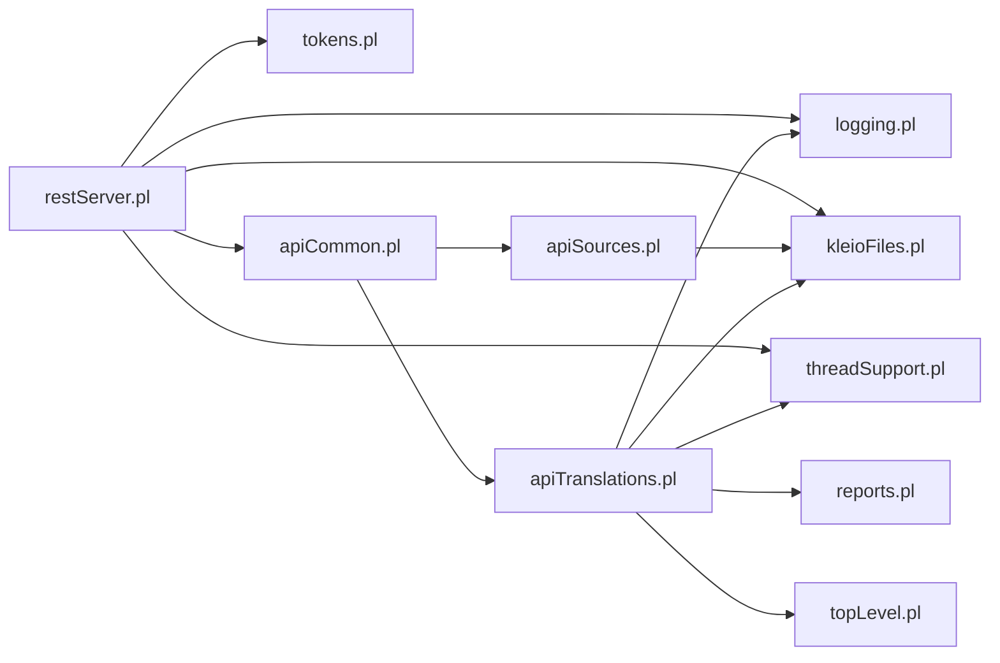

**Diagram sources**
- [restServer.pl](file://src/restServer.pl#L151-L162)
- [apiCommon.pl](file://src/apiCommon.pl#L79-L88)
- [apiSources.pl](file://src/apiSources.pl#L14-L27)
- [apiTranslations.pl](file://src/apiTranslations.pl#L21-L32)
- [kleioFiles.pl](file://src/kleioFiles.pl#L1-L33)
- [threadSupport.pl](file://src/threadSupport.pl#L1-L25)
- [reports.pl](file://src/reports.pl#L1-L19)
- [topLevel.pl](file://src/topLevel.pl#L34-L58)

**Section sources**
- [restServer.pl](file://src/restServer.pl#L151-L162)
- [apiCommon.pl](file://src/apiCommon.pl#L79-L88)

## Performance Considerations
- Worker pool sizing: configure KLEIO_SERVER_WORKERS to balance throughput and resource usage
- Parallel translations: enable spawn for distributing work across workers
- Status caching: translations_get caches results for large sets to reduce repeated computation
- File I/O: leverage kleioFiles utilities to minimize redundant filesystem scans
- Logging overhead: adjust log level to reduce verbosity in production

[No sources needed since this section provides general guidance]

## Troubleshooting Guide
Common issues and remedies:
- Authentication failures: ensure Authorization: Bearer header matches a valid token; verify token permissions for the requested endpoint
- File not found: confirm relative paths resolve under the user’s sources directory; check token options for sources base
- Translation errors/warnings: inspect generated .err and .rpt files; review logs for stack traces
- Worker starvation: increase KLEIO_SERVER_WORKERS; monitor queued vs processing jobs
- CORS errors: verify KLEIO_CORS_SITES environment variable and preflight OPTIONS handling

**Section sources**
- [restServer.pl](file://src/restServer.pl#L560-L600)
- [kleioFiles.pl](file://src/kleioFiles.pl#L753-L800)
- [logging.pl](file://src/logging.pl#L98-L120)
- [threadSupport.pl](file://src/threadSupport.pl#L137-L149)

## Conclusion
The Timelink Kleio system integrates a SWI-Prolog-based REST/JSON-RPC server with a robust translation engine and file utilities. Its layered design, token-based security, and pluggable API modules enable scalable and maintainable operations for managing Kleio sources, performing translations, and serving derived artifacts. Containerization simplifies deployment and scaling, while worker pools and caching optimize performance.

[No sources needed since this section summarizes without analyzing specific files]

## Appendices

### Infrastructure Requirements
- Operating system: Linux/macOS/Windows (tested environments)
- Runtime: SWI-Prolog
- Storage: Mounted volume at /kleio-home for persistent data
- Ports: Default REST port 8088; configurable via KLEIO_SERVER_PORT

**Section sources**
- [Dockerfile](file://Dockerfile#L1-L22)
- [docker-compose.yaml](file://docker-compose.yaml#L1-L22)

### Containerization and Deployment
- Build image: Dockerfile installs SWI-Prolog and copies src
- Orchestration: docker-compose.yaml mounts KLEIO_HOME_DIR and exposes port
- Make targets: build-local, build-multi, run-latest, run-current, stop

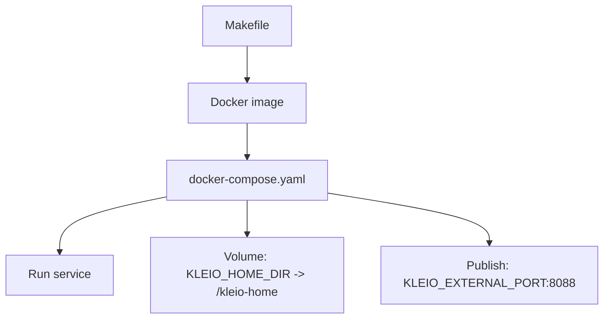

**Diagram sources**
- [Dockerfile](file://Dockerfile#L1-L22)
- [docker-compose.yaml](file://docker-compose.yaml#L1-L22)
- [Makefile](file://Makefile#L103-L127)

**Section sources**
- [Dockerfile](file://Dockerfile#L1-L22)
- [docker-compose.yaml](file://docker-compose.yaml#L1-L22)
- [Makefile](file://Makefile#L161-L200)

### Technology Stack
- Backend: SWI-Prolog
- Web server: SWI-Prolog HTTP library (http_dispatch, http_json)
- Containerization: Docker
- Orchestration: docker-compose
- Testing: Postman/Newman collections and scripts

**Section sources**
- [restServer.pl](file://src/restServer.pl#L131-L149)
- [Dockerfile](file://Dockerfile#L1-L22)
- [Makefile](file://Makefile#L255-L264)

### System Context and Ecosystem Fit
The kleio-server operates as a backend service within the Timelink ecosystem:
- Receives requests from clients (web apps, scripts, Postman)
- Manages Kleio sources and derived artifacts on the filesystem
- Integrates with Git utilities for versioning operations
- Supports export and report generation for downstream consumers

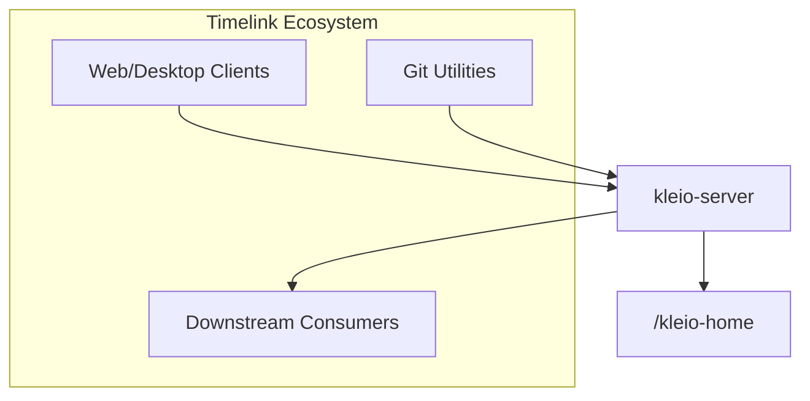

[No sources needed since this diagram shows conceptual workflow, not actual code structure]