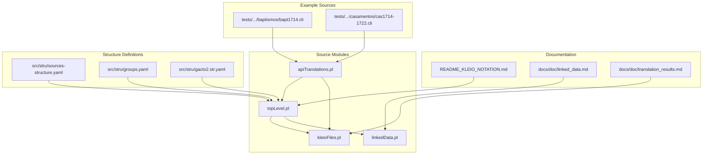
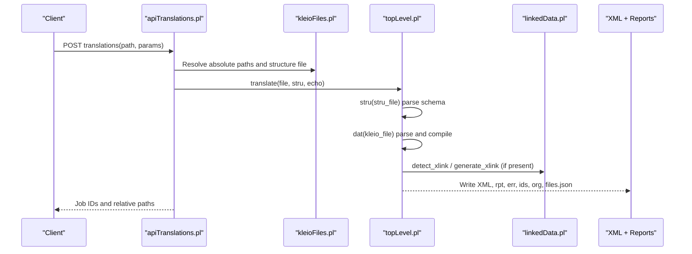
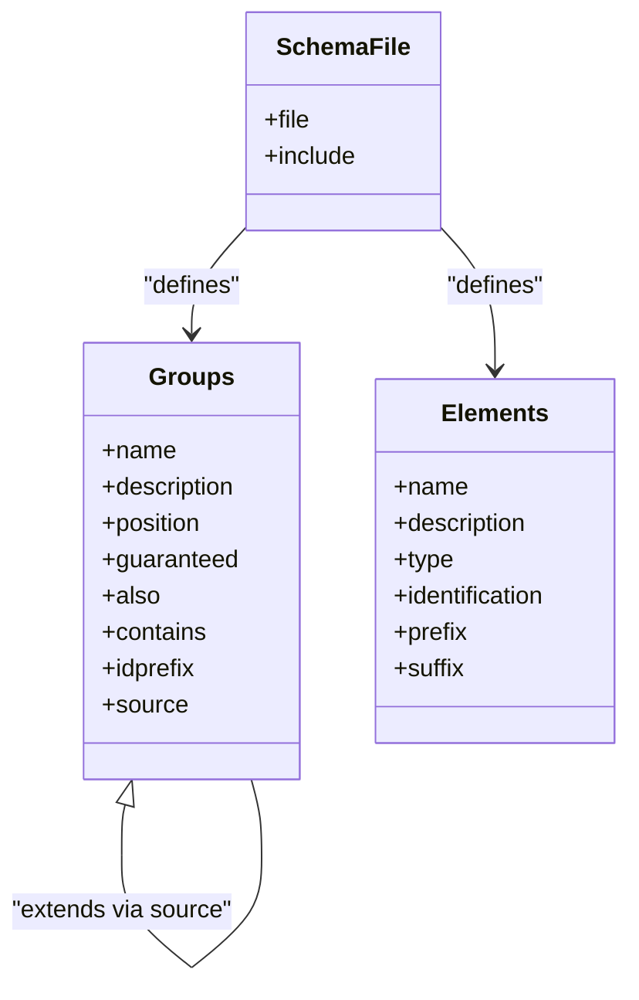
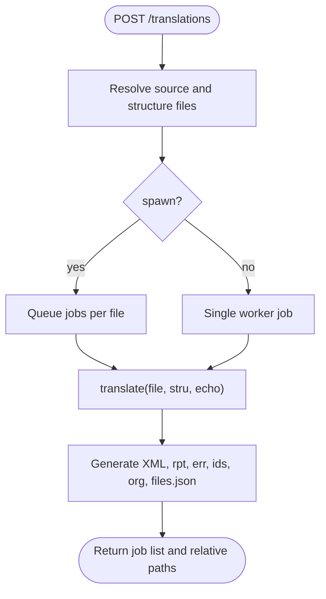
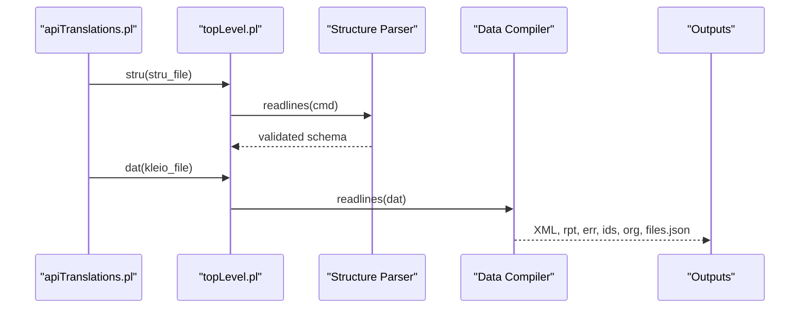
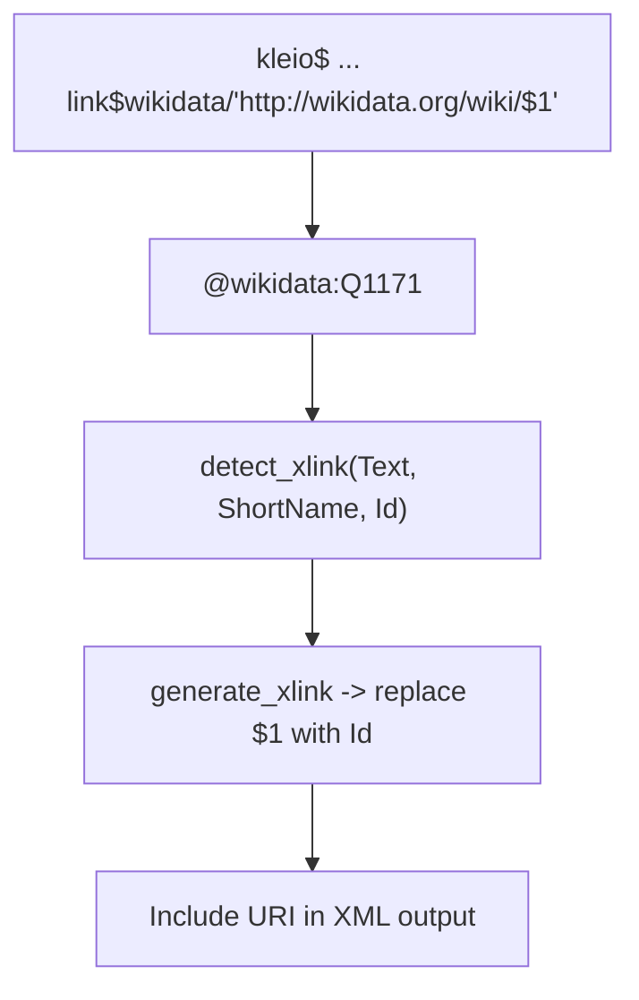
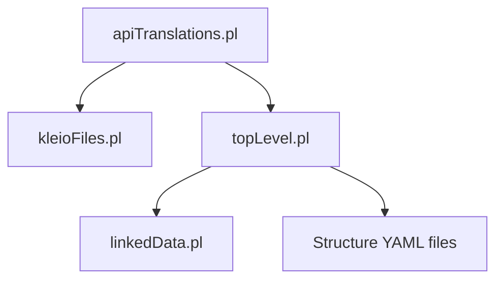

# Core Concepts

<cite>
**Referenced Files in This Document**
- [README_KLEIO_NOTATION.md](file://README_KLEIO_NOTATION.md)
- [linked_data.md](file://docs/doc/linked_data.md)
- [kleioFiles.pl](file://src/kleioFiles.pl)
- [apiTranslations.pl](file://src/apiTranslations.pl)
- [topLevel.pl](file://src/topLevel.pl)
- [gacto2.str.yaml](file://src/stru/gacto2.str.yaml)
- [sources-structure.yaml](file://src/stru/sources-structure.yaml)
- [groups.yaml](file://src/stru/groups.yaml)
- [bapt1714.cli](file://tests/kleio-home/sources/more_sources/paroquiais/baptismos/bapt1714.cli)
- [cas1714-1722.cli](file://tests/kleio-home/sources/more_sources/paroquiais/casamentos/cas1714-1722.cli)
- [translation_results.md](file://docs/doc/translation_results.md)
</cite>

## Table of Contents
1. [Introduction](#introduction)
2. [Project Structure](#project-structure)
3. [Core Components](#core-components)
4. [Architecture Overview](#architecture-overview)
5. [Detailed Component Analysis](#detailed-component-analysis)
6. [Dependency Analysis](#dependency-analysis)
7. [Performance Considerations](#performance-considerations)
8. [Troubleshooting Guide](#troubleshooting-guide)
9. [Conclusion](#conclusion)
10. [Appendices](#appendices)

## Introduction
This document explains the fundamental concepts of the Kleio translation system and how it transforms historical documents into structured, importable data. It covers:
- What Kleio notation is and why it exists for historical transcription
- How Kleio files differ from standard text formats
- The translation pipeline from Kleio files through structure definitions to XML output
- Key concepts: kleio files, structure definitions, translation service, linked data, normalization
- Examples using baptism records and marriage certificates
- The relationship between Kleio notation, the Timelink database system, and intelligent normalization that reduces manual data entry overhead

Kleio provides a compact, annotation-rich notation designed to capture both the original wording and normalized values while preserving provenance and context. The system then translates these annotations into a person-oriented model suitable for import into Timelink.

## Project Structure
At a high level, the repository contains:
- Documentation describing notation and results
- Source modules implementing file management, API endpoints, top-level processing, and linked data utilities
- Structure definitions (YAML-based schemas) defining groups, elements, and constraints
- Example Kleio source files for parish records (baptisms and marriages)

**Diagram sources**
- [kleioFiles.pl](file://src/kleioFiles.pl)
- [apiTranslations.pl](file://src/apiTranslations.pl)
- [topLevel.pl](file://src/topLevel.pl)
- [linkedData.pl](file://src/linkedData.pl)
- [sources-structure.yaml](file://src/stru/sources-structure.yaml)
- [groups.yaml](file://src/stru/groups.yaml)
- [gacto2.str.yaml](file://src/stru/gacto2.str.yaml)
- [bapt1714.cli](file://tests/kleio-home/sources/more_sources/paroquiais/baptismos/bapt1714.cli)
- [cas1714-1722.cli](file://tests/kleio-home/sources/more_sources/paroquiais/casamentos/cas1714-1722.cli)
- [README_KLEIO_NOTATION.md](file://README_KLEIO_NOTATION.md)
- [linked_data.md](file://docs/doc/linked_data.md)
- [translation_results.md](file://docs/doc/translation_results.md)

**Section sources**
- [README_KLEIO_NOTATION.md](file://README_KLEIO_NOTATION.md)
- [translation_results.md](file://docs/doc/translation_results.md)

## Core Components
- Kleio files (.cli or .kleio): Plain-text documents annotated with special characters to mark groups, elements, aspects (original, core, comment), multiple values, and links. They are not plain prose; they encode structured information alongside the original wording.
- Structure definitions: YAML-based schema files that define allowed groups, elements, nesting, positional fields, and constraints. They guide parsing and validation.
- Translation service: REST API endpoints that orchestrate translation jobs, resolve structure files, queue work, and return status/results.
- Linked data: A mechanism to annotate element values with external identifiers (e.g., Wikidata) and generate URIs based on declared patterns.
- Normalization: The process by which original wording is preserved while producing clean, machine-readable values for import into Timelink. Aspects like “original” and “comment” support this separation.

Key behaviors:
- Groups represent entities; elements represent attributes; aspects capture different representations (core value, original wording, comments).
- Multiple values can be specified per element.
- Positional named elements allow shorthand syntax when order is defined in the schema.
- The translator produces XML output suitable for import into Timelink, along with reports and intermediate artifacts.

**Section sources**
- [README_KLEIO_NOTATION.md](file://README_KLEIO_NOTATION.md)
- [groups.yaml](file://src/stru/groups.yaml)
- [gacto2.str.yaml](file://src/stru/gacto2.str.yaml)
- [linked_data.md](file://docs/doc/linked_data.md)
- [translation_results.md](file://docs/doc/translation_results.md)

## Architecture Overview
The translation pipeline connects user-provided Kleio files and structure definitions to an internal processing engine that emits XML and auxiliary outputs.

**Diagram sources**
- [apiTranslations.pl](file://src/apiTranslations.pl)
- [kleioFiles.pl](file://src/kleioFiles.pl)
- [topLevel.pl](file://src/topLevel.pl)
- [linkedData.pl](file://src/linkedData.pl)
- [translation_results.md](file://docs/doc/translation_results.md)

## Detailed Component Analysis

### Kleio Notation and Syntax
Kleio notation uses special characters to annotate text:
- Group names and element names follow naming rules and can be positional if defined in the schema.
- Aspects:
  - core: main value used for import
  - original: original wording (optional)
  - comment: human notes (optional)
- Multiple values separated by a configurable delimiter.
- Strings can be delimited to include spaces and special characters.
- Multi-line strings supported via triple quotes.

Examples of usage appear in the documentation and example files. These examples demonstrate how to declare a source, record events (baptisms, marriages), and attach attributes to people and places.

**Section sources**
- [README_KLEIO_NOTATION.md](file://README_KLEIO_NOTATION.md)
- [bapt1714.cli](file://tests/kleio-home/sources/more_sources/paroquiais/baptismos/bapt1714.cli)
- [cas1714-1722.cli](file://tests/kleio-home/sources/more_sources/paroquiais/casamentos/cas1714-1722.cli)

### Structure Definitions (Schemas)
Structure definitions specify:
- Allowed groups and their hierarchy
- Elements permitted within each group
- Positional elements and guaranteed fields
- Aliases and inheritance (source) relationships
- ID prefixes and containment rules

The default composite structure includes core groups and Portuguese-specific extensions. The gacto2 schema defines many common groups and elements used across parish records.

**Diagram sources**
- [groups.yaml](file://src/stru/groups.yaml)
- [gacto2.str.yaml](file://src/stru/gacto2.str.yaml)
- [sources-structure.yaml](file://src/stru/sources-structure.yaml)

**Section sources**
- [sources-structure.yaml](file://src/stru/sources-structure.yaml)
- [groups.yaml](file://src/stru/groups.yaml)
- [gacto2.str.yaml](file://src/stru/gacto2.str.yaml)

### Translation Service (REST API)
The translation service exposes endpoints to:
- Start translations for one or more Kleio files
- Retrieve translation status and results
- Clean translation artifacts

It resolves structure files using a priority strategy:
- Explicitly provided structure path
- File-local reference at the first line
- Matching structure file next to the source or under structures directory
- Default structure file from configuration

Jobs can be executed sequentially or spawned across workers. Status caching avoids repeated expensive computations for large sets.

**Diagram sources**
- [apiTranslations.pl](file://src/apiTranslations.pl)
- [kleioFiles.pl](file://src/kleioFiles.pl)

**Section sources**
- [apiTranslations.pl](file://src/apiTranslations.pl)
- [kleioFiles.pl](file://src/kleioFiles.pl)

### Top-Level Processing Engine
The top-level module initializes the environment, processes structure definitions, and compiles data files:
- clio_init sets up reporting and error counters
- stru(Filename) parses and validates structure definitions, generating JSON/YAML artifacts and reports
- dat(Filename) reads and compiles Kleio data lines into the internal representation and writes outputs

**Diagram sources**
- [topLevel.pl](file://src/topLevel.pl)
- [apiTranslations.pl](file://src/apiTranslations.pl)

**Section sources**
- [topLevel.pl](file://src/topLevel.pl)
- [apiTranslations.pl](file://src/apiTranslations.pl)

### Linked Data Integration
Linked data allows annotating element values with external identifiers and generating URIs based on declared patterns:
- Declare link$short-name/"url-pattern" in the kleio$ group
- Annotate values with # @short-name:id in comments
- The system detects annotations and generates full URIs for export

**Diagram sources**
- [linked_data.md](file://docs/doc/linked_data.md)
- [linkedData.pl](file://src/linkedData.pl)

**Section sources**
- [linked_data.md](file://docs/doc/linked_data.md)
- [linkedData.pl](file://src/linkedData.pl)

### Normalization and Aspects
Normalization separates original wording from cleaned values:
- core aspect holds the normalized value used for import
- original aspect preserves original spelling, abbreviations, units
- comment aspect captures human notes
- Multiple values per element are supported
- Positional elements reduce verbosity when order is known

This approach minimizes manual re-entry by allowing transcribers to focus on faithful transcription while the system extracts normalized fields automatically.

**Section sources**
- [README_KLEIO_NOTATION.md](file://README_KLEIO_NOTATION.md)
- [groups.yaml](file://src/stru/groups.yaml)

### Examples: Baptism Records and Marriage Certificates
Baptism records demonstrate:
- Source declaration and metadata
- Event grouping with date and location
- Person roles (child, parents, godparents) and attributes
- Relationships and references

Marriage certificates show:
- Spouses and their families
- Witnesses and officials
- Attributes such as civil status and residence
- Optional remarks and observations

These examples illustrate how Kleio notation encodes rich relational data that the translator converts into a structured XML model for Timelink.

**Section sources**
- [bapt1714.cli](file://tests/kleio-home/sources/more_sources/paroquiais/baptismos/bapt1714.cli)
- [cas1714-1722.cli](file://tests/kleio-home/sources/more_sources/paroquiais/casamentos/cas1714-1722.cli)

## Dependency Analysis
High-level dependencies among key components:
- apiTranslations.pl depends on kleioFiles.pl for file resolution and status, and on topLevel.pl for actual translation
- topLevel.pl orchestrates structure parsing and data compilation, optionally using linkedData.pl for URI generation
- Structure definitions (YAML) drive parsing behavior and validation

**Diagram sources**
- [apiTranslations.pl](file://src/apiTranslations.pl)
- [kleioFiles.pl](file://src/kleioFiles.pl)
- [topLevel.pl](file://src/topLevel.pl)
- [linkedData.pl](file://src/linkedData.pl)
- [groups.yaml](file://src/stru/groups.yaml)

**Section sources**
- [apiTranslations.pl](file://src/apiTranslations.pl)
- [kleioFiles.pl](file://src/kleioFiles.pl)
- [topLevel.pl](file://src/topLevel.pl)
- [linkedData.pl](file://src/linkedData.pl)
- [groups.yaml](file://src/stru/groups.yaml)

## Performance Considerations
- Status caching: The API caches translation status for large sets to avoid recomputation on frequent queries.
- Parallel processing: When spawn is enabled, jobs are distributed across workers for faster throughput.
- Mutexed resource access: Structure and data processing are synchronized to prevent conflicts in multi-user environments.
- Minimal I/O: Intermediate artifacts (ids, org, old) help maintain consistency and speed up subsequent runs.

[No sources needed since this section provides general guidance]

## Troubleshooting Guide
Common issues and diagnostics:
- Check the .err file for counts of errors and warnings, including version and translation timestamp
- Review the .rpt report for detailed error locations and messages
- Inspect .files.json for the exact structure file used and associated artifacts
- Ensure the correct structure file is resolved; verify the priority rules and presence of matching files
- If linked data URIs are missing, confirm link$ declarations and proper @shortcut:id annotations

**Section sources**
- [translation_results.md](file://docs/doc/translation_results.md)
- [apiTranslations.pl](file://src/apiTranslations.pl)
- [kleioFiles.pl](file://src/kleioFiles.pl)
- [linked_data.md](file://docs/doc/linked_data.md)

## Conclusion
Kleio notation offers a powerful, expressive way to transcribe historical documents while capturing both fidelity and normalization. The translation pipeline—driven by robust structure definitions and a flexible API—converts annotated texts into structured XML ready for Timelink. Linked data integration enriches records with external identifiers, and intelligent normalization reduces manual data entry overhead. Together, these features enable efficient, scalable digitization and analysis of historical sources.

[No sources needed since this section summarizes without analyzing specific files]

## Appendices

### Glossary
- Kleio file: A plain-text document using Kleio notation (.cli or .kleio)
- Structure definition: A YAML schema specifying groups, elements, and constraints
- Translation service: REST API endpoints managing translation jobs and results
- Linked data: External identifier annotations and URI generation
- Normalization: Separation of original wording from cleaned values for import

[No sources needed since this section provides general guidance]