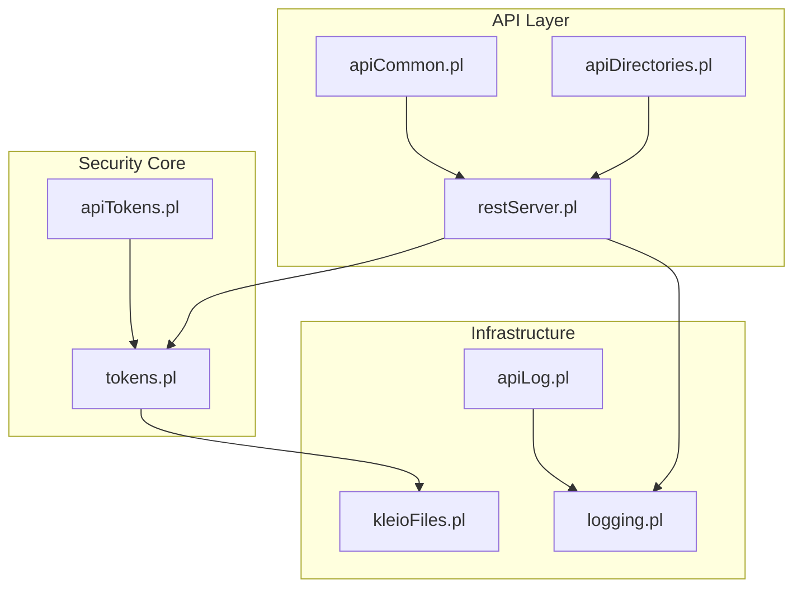
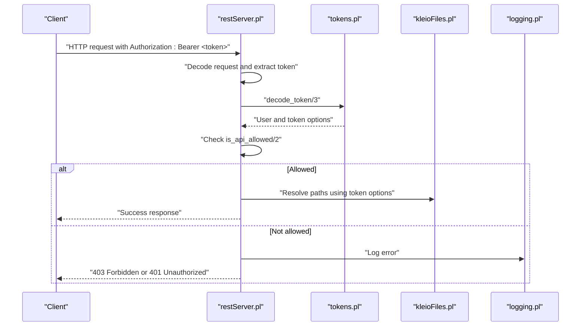
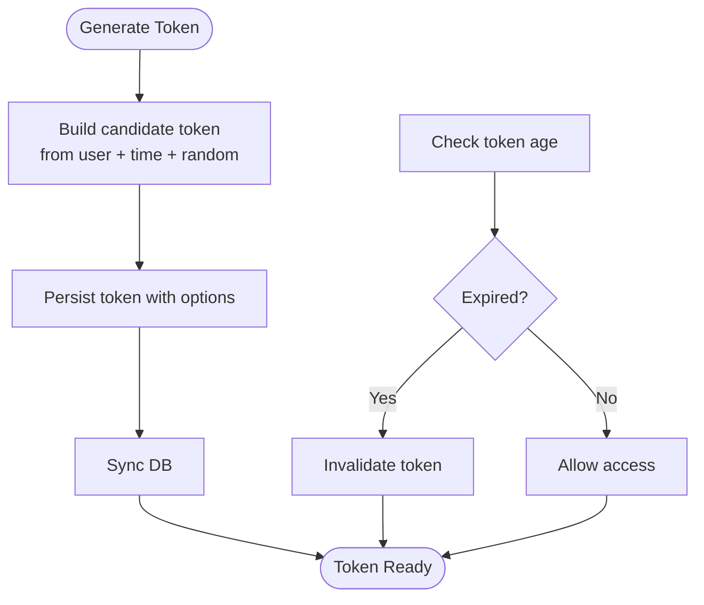
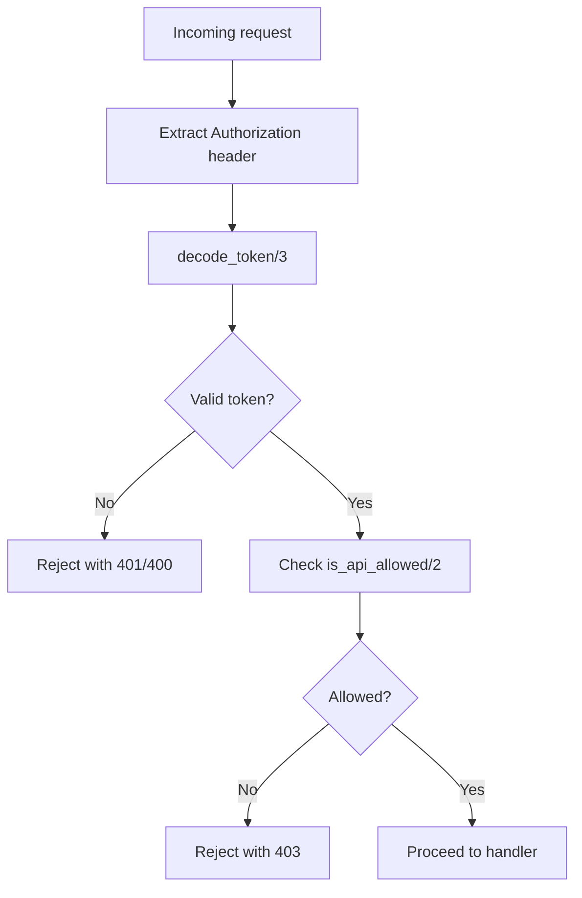
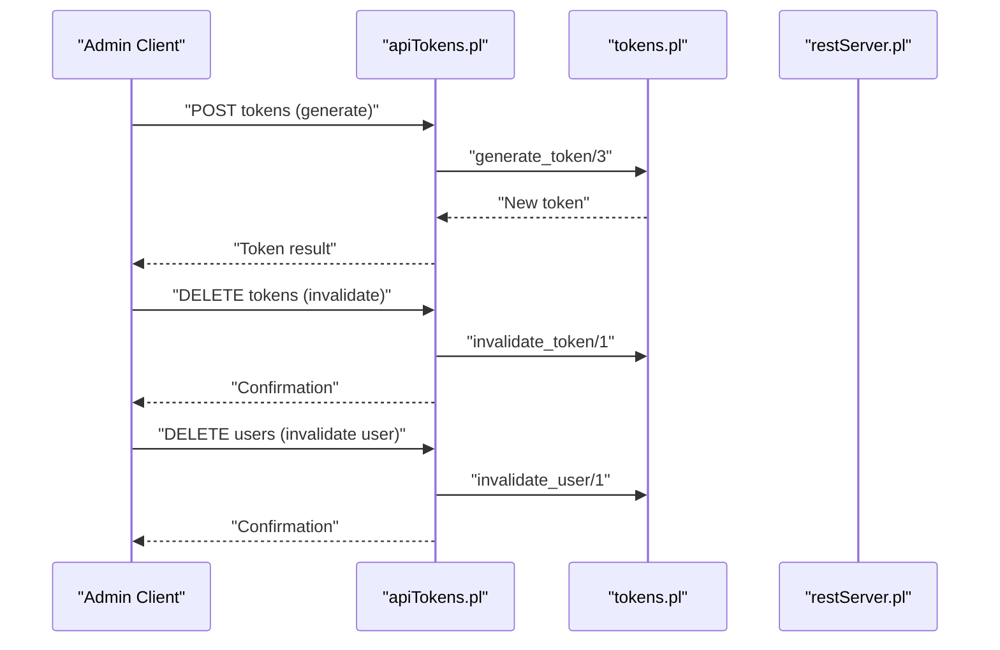
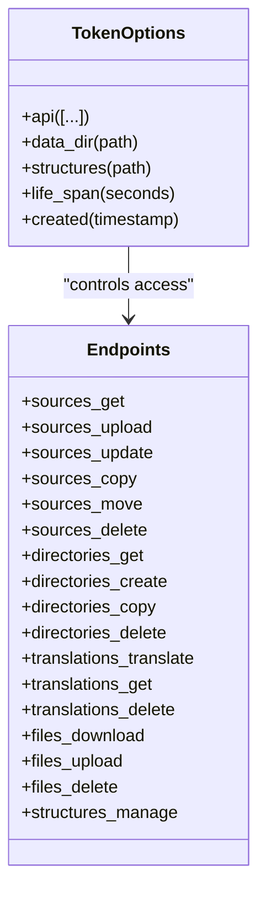
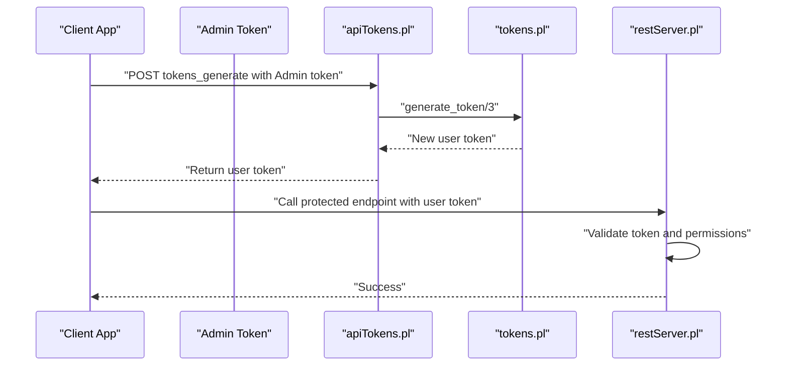
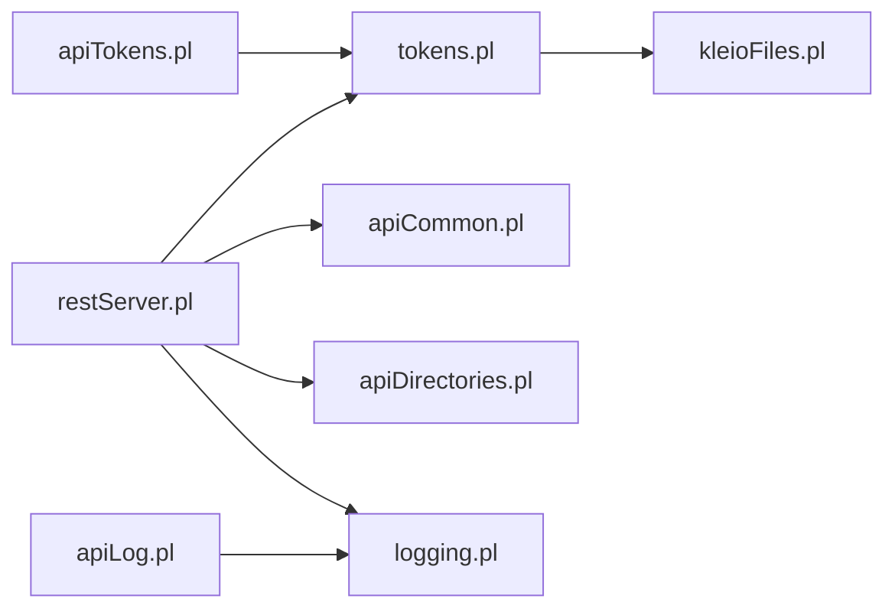

# Authentication and Authorization

<cite>
**Referenced Files in This Document**
- [apiTokens.pl](file://src/apiTokens.pl)
- [tokens.pl](file://src/tokens.pl)
- [restServer.pl](file://src/restServer.pl)
- [apiCommon.pl](file://src/apiCommon.pl)
- [apiDirectories.pl](file://src/apiDirectories.pl)
- [kleioFiles.pl](file://src/kleioFiles.pl)
- [logging.pl](file://src/logging.pl)
- [apiLog.pl](file://src/apiLog.pl)
- [api.json](file://api/postman/api.json)
- [index.html](file://docs/api/index.html)
- [client_setup.md](file://docs/doc/client_setup.md)
</cite>

## Table of Contents
1. [Introduction](#introduction)
2. [Project Structure](#project-structure)
3. [Core Components](#core-components)
4. [Architecture Overview](#architecture-overview)
5. [Detailed Component Analysis](#detailed-component-analysis)
6. [Dependency Analysis](#dependency-analysis)
7. [Performance Considerations](#performance-considerations)
8. [Troubleshooting Guide](#troubleshooting-guide)
9. [Conclusion](#conclusion)
10. [Appendices](#appendices)

## Introduction
This document explains the authentication and authorization system of the kleio-server with a focus on token-based security. It covers how access tokens are generated, validated, and managed; how permissions are enforced across API endpoints; and how the system integrates with the broader Timelink ecosystem. Practical guidance is provided for administrators and developers on configuring tokens, rotating credentials, auditing activity, and integrating client applications.

## Project Structure
The authentication subsystem centers on three primary modules:
- Token storage and validation: tokens.pl
- REST and JSON-RPC request decoding and enforcement: restServer.pl
- Token management API: apiTokens.pl

Additional supporting modules:
- Permission mapping and endpoint exposure: apiCommon.pl
- Endpoint-specific permission checks: apiDirectories.pl
- File path resolution and token-scoped access: kleioFiles.pl
- Logging and audit trail: logging.pl
- Debug logging via API: apiLog.pl
- Client usage examples and environment setup: api.json, index.html, client_setup.md

**Diagram sources**
- [restServer.pl](file://src/restServer.pl#L469-L580)
- [apiCommon.pl](file://src/apiCommon.pl#L28-L46)
- [apiDirectories.pl](file://src/apiDirectories.pl#L17-L70)
- [tokens.pl](file://src/tokens.pl#L1-L47)
- [apiTokens.pl](file://src/apiTokens.pl#L1-L125)
- [kleioFiles.pl](file://src/kleioFiles.pl#L726-L782)
- [logging.pl](file://src/logging.pl#L1-L161)
- [apiLog.pl](file://src/apiLog.pl#L1-L33)

**Section sources**
- [restServer.pl](file://src/restServer.pl#L469-L580)
- [apiCommon.pl](file://src/apiCommon.pl#L28-L46)
- [apiDirectories.pl](file://src/apiDirectories.pl#L17-L70)
- [tokens.pl](file://src/tokens.pl#L1-L47)
- [apiTokens.pl](file://src/apiTokens.pl#L1-L125)
- [kleioFiles.pl](file://src/kleioFiles.pl#L726-L782)
- [logging.pl](file://src/logging.pl#L1-L161)
- [apiLog.pl](file://src/apiLog.pl#L1-L33)

## Core Components
- Token generation and persistence: tokens.pl manages token creation, storage, and retrieval using SWI-Prolog’s persistent database. Tokens carry user identity and permission options.
- Token validation and enforcement: restServer.pl decodes incoming requests, extracts the Authorization header, validates the token, and enforces endpoint permissions via tokens.pl.
- Token management API: apiTokens.pl exposes endpoints to generate, invalidate single tokens, and invalidate all tokens for a user.
- Permission model: tokens.pl defines allowed API endpoints per token and supports optional lifetimes and scoped directories for sources and structures.
- Audit and logging: logging.pl centralizes logging with configurable levels; apiLog.pl enables clients to submit log entries with token validation.

**Section sources**
- [tokens.pl](file://src/tokens.pl#L104-L139)
- [restServer.pl](file://src/restServer.pl#L551-L579)
- [apiTokens.pl](file://src/apiTokens.pl#L22-L28)
- [apiTokens.pl](file://src/apiTokens.pl#L94-L105)
- [apiTokens.pl](file://src/apiTokens.pl#L111-L122)
- [logging.pl](file://src/logging.pl#L98-L113)
- [apiLog.pl](file://src/apiLog.pl#L15-L27)

## Architecture Overview
The token-based security architecture enforces authorization at two layers:
- Transport-level: REST requests must include a Bearer token in the Authorization header.
- Endpoint-level: Each API call is validated against the token’s allowed operations.

**Diagram sources**
- [restServer.pl](file://src/restServer.pl#L551-L579)
- [restServer.pl](file://src/restServer.pl#L590-L601)
- [tokens.pl](file://src/tokens.pl#L141-L151)
- [tokens.pl](file://src/tokens.pl#L249-L257)
- [kleioFiles.pl](file://src/kleioFiles.pl#L752-L782)
- [logging.pl](file://src/logging.pl#L98-L113)

## Detailed Component Analysis

### Token Generation and Lifecycle
- Generation: tokens:generate_token/3 creates a unique token derived from user, timestamp, and randomness, persists it, and attaches the token database if needed.
- Validation: tokens:decode_token/3 verifies the token and ensures it is not expired.
- Expiration: tokens:expired_token/1 checks token age and invalidates expired tokens automatically.
- Persistence: tokens:attach_token_db/1 and tokens:ensure_db/0 manage the token database file location and initialization.

**Diagram sources**
- [tokens.pl](file://src/tokens.pl#L104-L139)
- [tokens.pl](file://src/tokens.pl#L259-L267)

**Section sources**
- [tokens.pl](file://src/tokens.pl#L104-L139)
- [tokens.pl](file://src/tokens.pl#L259-L267)

### Token Validation and Enforcement
- REST decoding: restServer:rest_decode_command/4 extracts the Authorization header, validates the token, and populates token metadata for downstream handlers.
- Permission checks: restServer:upload_allowed/2 and apiDirectories.pl enforce that the token includes the required API action (e.g., upload, files, delete, mkdir, rmdir).
- JSON-RPC decoding: restServer:json_decode_command/4 performs the same validation for JSON-RPC requests.

**Diagram sources**
- [restServer.pl](file://src/restServer.pl#L551-L579)
- [restServer.pl](file://src/restServer.pl#L590-L601)
- [apiDirectories.pl](file://src/apiDirectories.pl#L17-L25)

**Section sources**
- [restServer.pl](file://src/restServer.pl#L551-L579)
- [restServer.pl](file://src/restServer.pl#L590-L601)
- [apiDirectories.pl](file://src/apiDirectories.pl#L17-L25)

### Token Management API
The token management API provides:
- Generate a token for a user with associated permissions and directories.
- Invalidate a single token.
- Invalidate all tokens for a user.

**Diagram sources**
- [apiTokens.pl](file://src/apiTokens.pl#L22-L28)
- [apiTokens.pl](file://src/apiTokens.pl#L94-L105)
- [apiTokens.pl](file://src/apiTokens.pl#L111-L122)
- [tokens.pl](file://src/tokens.pl#L104-L139)
- [tokens.pl](file://src/tokens.pl#L187-L198)
- [tokens.pl](file://src/tokens.pl#L193-L198)

**Section sources**
- [apiTokens.pl](file://src/apiTokens.pl#L22-L28)
- [apiTokens.pl](file://src/apiTokens.pl#L94-L105)
- [apiTokens.pl](file://src/apiTokens.pl#L111-L122)
- [tokens.pl](file://src/tokens.pl#L104-L139)
- [tokens.pl](file://src/tokens.pl#L187-L198)
- [tokens.pl](file://src/tokens.pl#L193-L198)

### Permission Levels and Endpoint Mapping
- Permission model: tokens:is_api_allowed/2 enumerates allowed operations for a token. Operations include sources, files, structures, translations, upload, delete, mkdir, rmdir, generate_token, invalidate_token, invalidate_user, and others.
- Endpoint mapping: apiCommon.pl documents the REST and JSON-RPC endpoints and their required permissions.
- Directory scoping: tokens:get_data_dir/2 and tokens:get_stru_dir/2 derive base directories from token options to constrain file access.

**Diagram sources**
- [tokens.pl](file://src/tokens.pl#L249-L257)
- [apiCommon.pl](file://src/apiCommon.pl#L28-L46)
- [tokens.pl](file://src/tokens.pl#L233-L247)

**Section sources**
- [tokens.pl](file://src/tokens.pl#L249-L257)
- [apiCommon.pl](file://src/apiCommon.pl#L28-L46)
- [tokens.pl](file://src/tokens.pl#L233-L247)

### Security Model and Best Practices
- Transport security: Use HTTPS to protect tokens in transit.
- Token scope minimization: Grant only required API actions per token.
- Directory scoping: Limit sources and structures paths via token options to reduce blast radius.
- Token rotation: Regularly invalidate and regenerate tokens; use invalidate_token and invalidate_user for remediation.
- Administrative controls: KLEIO_ADMIN_TOKEN environment variable or bootstrap token enables privileged operations during setup.
- Audit logging: Enable logging and review logs for authentication failures and permission denials.

**Section sources**
- [restServer.pl](file://src/restServer.pl#L107-L118)
- [restServer.pl](file://src/restServer.pl#L408-L421)
- [logging.pl](file://src/logging.pl#L98-L113)

### Practical Examples and Client Integration
- Client setup: Obtain kleio_home, kleio_url, and kleio_admin_token from the server’s runtime configuration or environment.
- Example requests: Postman collection and API docs demonstrate token generation and usage for various endpoints.

**Diagram sources**
- [api.json](file://api/postman/api.json#L111-L126)
- [index.html](file://docs/api/index.html#L199-L230)
- [client_setup.md](file://docs/doc/client_setup.md#L36-L51)
- [apiTokens.pl](file://src/apiTokens.pl#L71-L88)
- [tokens.pl](file://src/tokens.pl#L104-L139)
- [restServer.pl](file://src/restServer.pl#L551-L579)

**Section sources**
- [client_setup.md](file://docs/doc/client_setup.md#L36-L51)
- [api.json](file://api/postman/api.json#L111-L126)
- [index.html](file://docs/api/index.html#L199-L230)

## Dependency Analysis
The following diagram shows key dependencies among modules involved in authentication and authorization.

**Diagram sources**
- [restServer.pl](file://src/restServer.pl#L151-L162)
- [tokens.pl](file://src/tokens.pl#L1-L47)
- [apiCommon.pl](file://src/apiCommon.pl#L79-L88)
- [apiDirectories.pl](file://src/apiDirectories.pl#L12-L15)
- [apiTokens.pl](file://src/apiTokens.pl#L7-L9)
- [kleioFiles.pl](file://src/kleioFiles.pl#L1-L40)
- [logging.pl](file://src/logging.pl#L1-L23)
- [apiLog.pl](file://src/apiLog.pl#L7-L9)

**Section sources**
- [restServer.pl](file://src/restServer.pl#L151-L162)
- [tokens.pl](file://src/tokens.pl#L1-L47)
- [apiCommon.pl](file://src/apiCommon.pl#L79-L88)
- [apiDirectories.pl](file://src/apiDirectories.pl#L12-L15)
- [apiTokens.pl](file://src/apiTokens.pl#L7-L9)
- [kleioFiles.pl](file://src/kleioFiles.pl#L1-L40)
- [logging.pl](file://src/logging.pl#L1-L23)
- [apiLog.pl](file://src/apiLog.pl#L7-L9)

## Performance Considerations
- Token database synchronization: Ensure token database is attached and synchronized efficiently; avoid frequent re-attachment.
- Token validation cost: decode_token and is_api_allowed are lightweight but invoked per request; cache where appropriate at the application layer.
- Logging overhead: Enable appropriate log levels to balance observability and performance.

[No sources needed since this section provides general guidance]

## Troubleshooting Guide
Common issues and resolutions:
- Missing or invalid token:
  - Symptom: 400 Bad Request or 401 Unauthorized.
  - Cause: Missing Authorization header or invalid token.
  - Resolution: Verify token presence and validity; regenerate if needed.
- Insufficient permissions:
  - Symptom: 403 Forbidden.
  - Cause: Token lacks required API action.
  - Resolution: Regenerate token with expanded permissions.
- Token expired:
  - Symptom: Access denied after token age exceeds configured lifetime.
  - Cause: expired_token/1 invalidated the token.
  - Resolution: Generate a new token or adjust life_span option.
- Token database issues:
  - Symptom: Startup or token operations fail.
  - Cause: Missing or inaccessible token_db file.
  - Resolution: Confirm KLEIO_TOKEN_DB environment variable or default location; ensure file permissions.

**Section sources**
- [restServer.pl](file://src/restServer.pl#L560-L562)
- [restServer.pl](file://src/restServer.pl#L594-L600)
- [tokens.pl](file://src/tokens.pl#L259-L267)
- [tokens.pl](file://src/tokens.pl#L88-L102)

## Conclusion
The kleio-server employs a robust, token-based security model with clear separation of concerns between token generation, validation, and enforcement. Administrators can tightly control permissions and scope via token options, while clients integrate seamlessly using bearer tokens. Proper logging and auditing support operational oversight, and the system’s modular design facilitates maintenance and extension.

[No sources needed since this section summarizes without analyzing specific files]

## Appendices

### API Endpoints for Token Management
- Generate token: POST tokens (JSON-RPC) with params including user, info, and admin token.
- Invalidate token: DELETE tokens with user_token parameter.
- Invalidate user tokens: DELETE users with admin token.

**Section sources**
- [apiCommon.pl](file://src/apiCommon.pl#L39-L41)
- [apiTokens.pl](file://src/apiTokens.pl#L22-L28)
- [apiTokens.pl](file://src/apiTokens.pl#L94-L105)
- [apiTokens.pl](file://src/apiTokens.pl#L111-L122)

### Environment Variables and Configuration
- KLEIO_ADMIN_TOKEN: Admin token enabling privileged operations.
- KLEIO_TOKEN_DB: Path to the token database file.
- KLEIO_HOME_DIR, KLEIO_SOURCE_DIR, KLEIO_CONF_DIR, KLEIO_STRU_DIR, KLEIO_LOG_DIR: Paths controlling server directories.

**Section sources**
- [restServer.pl](file://src/restServer.pl#L107-L118)
- [kleioFiles.pl](file://src/kleioFiles.pl#L579-L589)