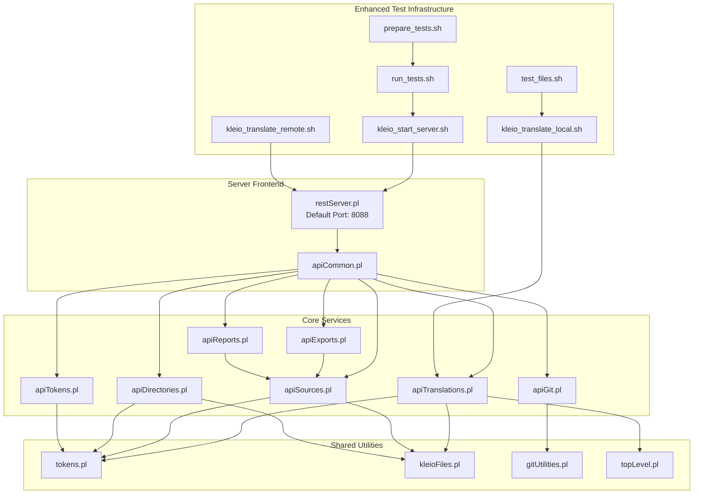
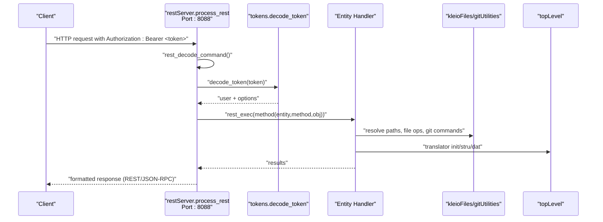
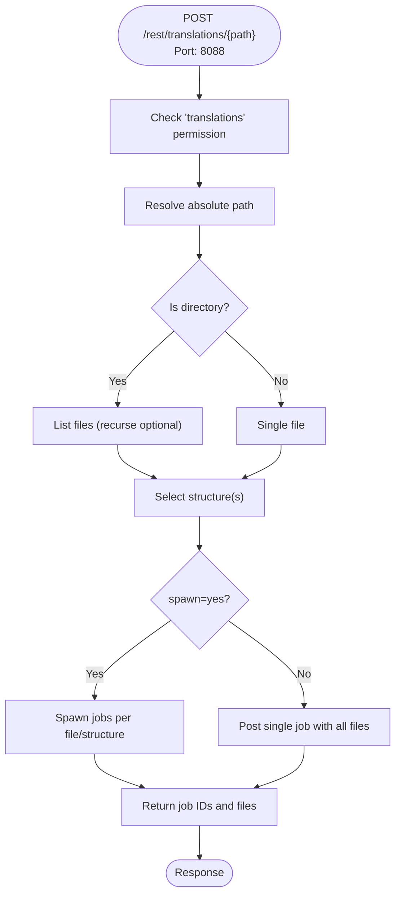
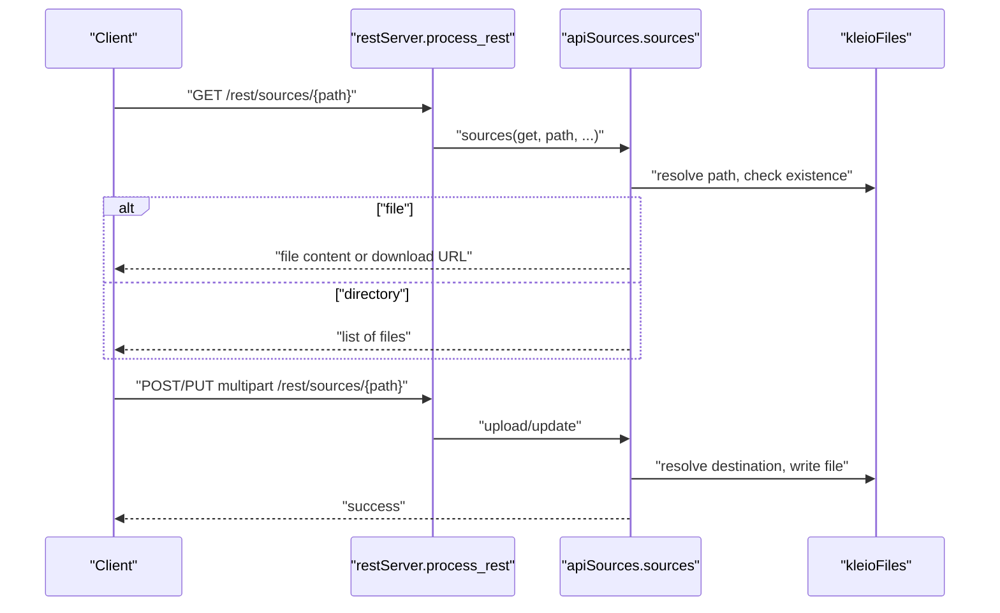
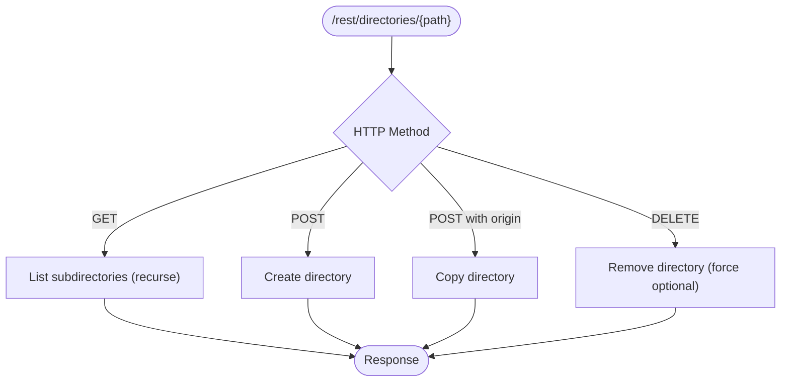
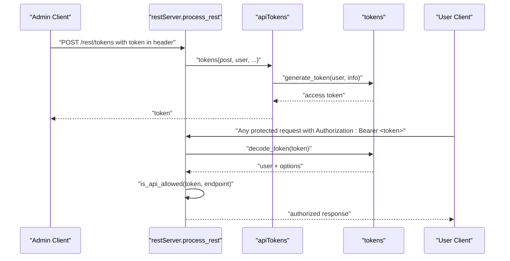
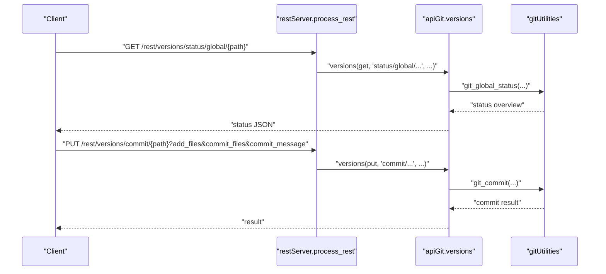
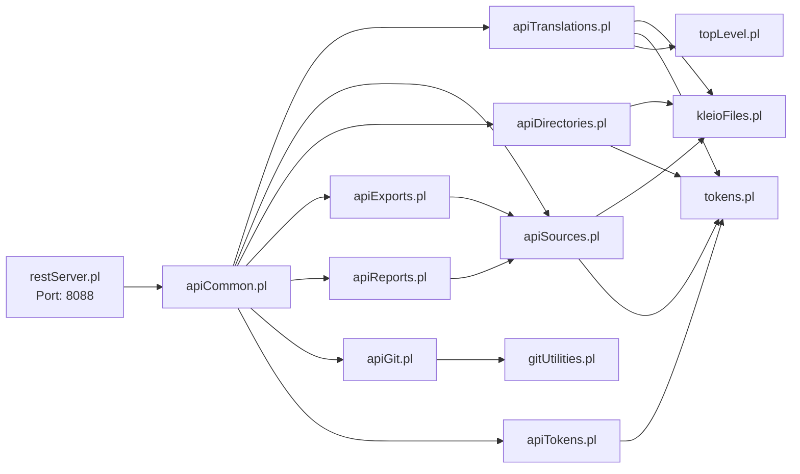
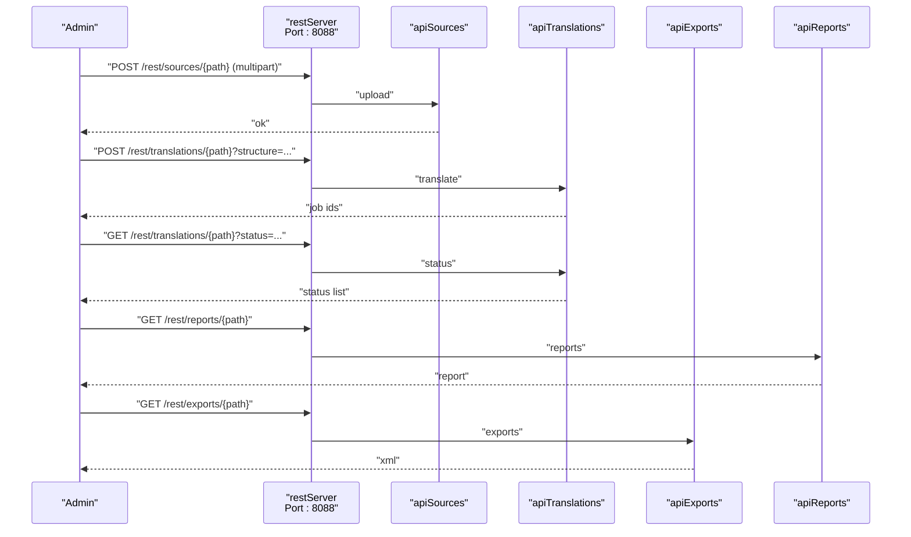
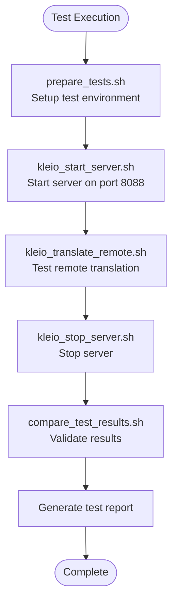

# Core Services

<cite>
**Referenced Files in This Document**
- [restServer.pl](file://src/restServer.pl)
- [apiCommon.pl](file://src/apiCommon.pl)
- [apiTranslations.pl](file://src/apiTranslations.pl)
- [apiSources.pl](file://src/apiSources.pl)
- [apiDirectories.pl](file://src/apiDirectories.pl)
- [apiExports.pl](file://src/apiExports.pl)
- [apiReports.pl](file://src/apiReports.pl)
- [apiTokens.pl](file://src/apiTokens.pl)
- [apiGit.pl](file://src/apiGit.pl)
- [tokens.pl](file://src/tokens.pl)
- [kleioFiles.pl](file://src/kleioFiles.pl)
- [gitUtilities.pl](file://src/gitUtilities.pl)
- [topLevel.pl](file://src/topLevel.pl)
- [api.json](file://api/postman/api.json)
- [kleio_start_server.sh](file://tests/scripts/kleio_start_server.sh)
- [run_tests.sh](file://tests/scripts/run_tests.sh)
- [prepare_tests.sh](file://tests/scripts/prepare_tests.sh)
- [kleio_translate_remote.sh](file://tests/scripts/kleio_translate_remote.sh)
- [kleio_translate_local.sh](file://tests/scripts/kleio_translate_local.sh)
- [test_files.sh](file://tests/scripts/test_files.sh)
</cite>

## Update Summary
**Changes Made**
- Updated server configuration section to reflect default REST port change from 8087 to 8088
- Enhanced server startup script documentation with improved test infrastructure
- Added documentation for enhanced translation pipeline and test automation
- Updated practical workflows to reflect new port configuration and improved test scripts

## Table of Contents
1. [Introduction](#introduction)
2. [Project Structure](#project-structure)
3. [Core Components](#core-components)
4. [Architecture Overview](#architecture-overview)
5. [Detailed Component Analysis](#detailed-component-analysis)
6. [Dependency Analysis](#dependency-analysis)
7. [Performance Considerations](#performance-considerations)
8. [Troubleshooting Guide](#troubleshooting-guide)
9. [Conclusion](#conclusion)
10. [Appendices](#appendices)

## Introduction
This document describes the core services provided by the kleio-server API. The system exposes a unified REST and JSON-RPC interface for:
- Translating Kleio source files with intelligent normalization and inference
- Managing available source files and directories
- Performing file CRUD operations
- Token-based authentication and authorization
- Basic Git operations for repository integration

It explains the intelligent translation workflow, provides concrete request/response patterns, enumerates REST endpoints, and demonstrates how services integrate in typical workflows such as uploading sources, requesting translations, and managing file operations.

**Updated** The server now defaults to port 8088 instead of 8087, and includes enhanced test infrastructure with improved translation pipeline automation.

## Project Structure
The server is implemented as a layered Prolog application with:
- A REST/JSON-RPC server front-end
- Domain-specific API modules for each service category
- Shared utilities for tokens, file resolution, and Git operations
- Integration with the underlying Kleio translator engine
- Enhanced test infrastructure with automated translation pipeline

**Diagram sources**
- [restServer.pl](file://src/restServer.pl#L172-L184)
- [kleio_start_server.sh](file://tests/scripts/kleio_start_server.sh#L1-L22)
- [run_tests.sh](file://tests/scripts/run_tests.sh#L1-L39)
- [prepare_tests.sh](file://tests/scripts/prepare_tests.sh#L1-L33)
- [kleio_translate_remote.sh](file://tests/scripts/kleio_translate_remote.sh#L1-L14)
- [kleio_translate_local.sh](file://tests/scripts/kleio_translate_local.sh#L1-L24)
- [test_files.sh](file://tests/scripts/test_files.sh#L1-L14)

**Section sources**
- [restServer.pl](file://src/restServer.pl#L300-L350)
- [apiCommon.pl](file://src/apiCommon.pl#L78-L89)

## Core Components
This section outlines the five primary service categories and their responsibilities.

- Translations service
  - Purpose: Start, query, and clean translations for Kleio sources
  - Key endpoints: POST/GET/DELETE /rest/translations/{path}
  - Intelligent workflow: Normalizes structure selection, supports parallel processing, caches status for performance, and computes derived URLs for reports and exports
  - **Updated** Enhanced with improved test automation and validation pipeline

- Sources service
  - Purpose: Retrieve, upload, copy, move, and delete source files
  - Key endpoints: GET/POST/PUT/DELETE /rest/sources/{path}
  - Features: Directory listing, recursive traversal, URL generation for downloads, and strict permission enforcement

- File management service
  - Purpose: Manage directories and perform CRUD-like operations on directories
  - Key endpoints: GET/POST/DELETE /rest/directories/{path}
  - Capabilities: Create, copy, remove directories with optional force-delete

- Token-based authentication and authorization
  - Purpose: Issue, validate, and revoke tokens; enforce API permissions
  - Key endpoints: POST /rest/tokens and DELETE /rest/tokens/{token}; DELETE /rest/users/{token}
  - Model: JWT-like tokens with embedded claims validated against a persistent token database

- Git operations service
  - Purpose: Integrate with Git repositories for status, fetch, pull, push, commit, and reset
  - Key endpoints: GET/PUT/DELETE /rest/versions/{path} with pseudo-paths for operations
  - Scope: Repository status overview, branch information, and controlled changes

**Section sources**
- [apiTranslations.pl](file://src/apiTranslations.pl#L34-L164)
- [apiSources.pl](file://src/apiSources.pl#L28-L175)
- [apiDirectories.pl](file://src/apiDirectories.pl#L18-L71)
- [apiTokens.pl](file://src/apiTokens.pl#L18-L40)
- [apiGit.pl](file://src/apiGit.pl#L23-L155)

## Architecture Overview
The server routes requests through a central dispatcher that:
- Extracts and validates the Authorization Bearer token
- Resolves entity/method/object paths
- Enforces API permissions via token policies
- Invokes domain-specific handlers
- Formats results in REST or JSON-RPC formats

**Updated** The server now defaults to port 8088, providing better integration with modern development environments and container orchestration systems.

**Diagram sources**
- [restServer.pl](file://src/restServer.pl#L547-L590)
- [tokens.pl](file://src/tokens.pl#L141-L151)
- [kleioFiles.pl](file://src/kleioFiles.pl#L753-L782)
- [gitUtilities.pl](file://src/gitUtilities.pl#L38-L82)
- [topLevel.pl](file://src/topLevel.pl#L89-L96)

## Detailed Component Analysis

### Translations Service
- Purpose: Translate Kleio sources with intelligent structure selection and parallel processing
- Key behaviors:
  - Structure resolution: prioritizes request parameter, per-file structure hint, or default structure
  - Parallelization: spawns worker jobs when requested; otherwise batches files under a single structure
  - Status reporting: caches translation status for directories to reduce overhead
  - Derived artifacts: cleans/returns reports, exports, and metadata
  - **Enhanced** Improved test automation with automated validation against reference translations

**Diagram sources**
- [apiTranslations.pl](file://src/apiTranslations.pl#L52-L83)
- [apiTranslations.pl](file://src/apiTranslations.pl#L295-L337)
- [apiTranslations.pl](file://src/apiTranslations.pl#L241-L260)

Typical request/response patterns:
- POST /rest/translations/{path}?structure={file}&recurse={yes|no}&spawn={yes|no}&echo={yes|no}
  - Request body: token in Authorization header
  - Response: list of job descriptors with relative file paths

- GET /rest/translations/{path}?status={T|V|E|W|Q|P}&recurse={yes|no}
  - Response: list of files with status and derived artifact URLs

- DELETE /rest/translations/{path}
  - Response: list of cleaned files

Security and permissions:
- Requires "translations" API permission; enforced via token policy

**Section sources**
- [apiTranslations.pl](file://src/apiTranslations.pl#L34-L164)
- [apiTranslations.pl](file://src/apiTranslations.pl#L168-L233)
- [apiTranslations.pl](file://src/apiTranslations.pl#L295-L400)
- [apiTranslations.pl](file://src/apiTranslations.pl#L528-L577)

### Sources Service
- Purpose: Retrieve, upload, copy, move, and delete source files and directories
- Key behaviors:
  - GET: returns file content or directory listing; supports URL generation for downloads
  - POST/PUT multipart: upload/update files
  - POST/PUT with origin: copy/move semantics
  - DELETE: remove files or entire directories (with recursion and safety checks)

**Diagram sources**
- [apiSources.pl](file://src/apiSources.pl#L89-L143)
- [apiSources.pl](file://src/apiSources.pl#L212-L233)
- [kleioFiles.pl](file://src/kleioFiles.pl#L753-L782)

Typical request/response patterns:
- GET /rest/sources/{path}?recurse={yes|no}&url={yes|no}
  - Response: file content or list of files; when url=yes returns relative URLs

- POST/PUT multipart /rest/sources/{path}
  - Request: Content-Type: multipart/form-data with file field
  - Response: success

- POST /rest/sources?origin={path}
  - Response: copy result

- PUT /rest/sources?origin={path}
  - Response: move result

- DELETE /rest/sources/{path}?recurse={yes|no}
  - Response: list of deleted items

Security and permissions:
- Requires "files" for GET; "upload" for POST/PUT; "delete" for DELETE

**Section sources**
- [apiSources.pl](file://src/apiSources.pl#L28-L175)
- [apiSources.pl](file://src/apiSources.pl#L257-L286)
- [kleioFiles.pl](file://src/kleioFiles.pl#L753-L800)

### File Management Service (Directories)
- Purpose: Manage directories (list, create, copy, delete)
- Key behaviors:
  - GET: list subdirectories (supports recursion)
  - POST: create directory
  - POST with origin: copy directory
  - DELETE: remove directory (force-delete supported)

**Diagram sources**
- [apiDirectories.pl](file://src/apiDirectories.pl#L18-L71)
- [apiDirectories.pl](file://src/apiDirectories.pl#L119-L148)

Typical request/response patterns:
- GET /rest/directories/{path}?recurse={yes|no}
  - Response: list of subdirectories

- POST /rest/directories/{path}
  - Response: creation result

- POST /rest/directories/{path}?origin={src}
  - Response: copy result

- DELETE /rest/directories/{path}?contents={yes|no}
  - Response: deletion result

Security and permissions:
- Requires "files" for GET; "mkdir" for POST; "rmdir" for DELETE

**Section sources**
- [apiDirectories.pl](file://src/apiDirectories.pl#L18-L71)
- [apiDirectories.pl](file://src/apiDirectories.pl#L93-L148)

### Token-Based Authentication and Authorization
- Purpose: Issue, validate, and revoke tokens; enforce API permissions
- Key behaviors:
  - Generate tokens with embedded permissions and optional user directories
  - Validate tokens via Authorization header
  - Enforce permissions per endpoint
  - Invalidate tokens or entire users

**Diagram sources**
- [apiTokens.pl](file://src/apiTokens.pl#L18-L40)
- [apiTokens.pl](file://src/apiTokens.pl#L71-L89)
- [tokens.pl](file://src/tokens.pl#L141-L151)
- [tokens.pl](file://src/tokens.pl#L249-L258)

Typical request/response patterns:
- POST /rest/tokens
  - Body: user, info (permissions, optional directories), token (admin token)
  - Response: new access token

- DELETE /rest/tokens/{token}
  - Body: token (admin token)
  - Response: invalidated token

- DELETE /rest/users/{token}
  - Body: token (admin token)
  - Response: invalidated user

Security and permissions:
- Admin token required to generate/invalidate tokens
- Per-endpoint permissions enforced via token options

**Section sources**
- [apiTokens.pl](file://src/apiTokens.pl#L18-L40)
- [apiTokens.pl](file://src/apiTokens.pl#L71-L123)
- [tokens.pl](file://src/tokens.pl#L104-L139)
- [tokens.pl](file://src/tokens.pl#L249-L258)

### Git Operations Service
- Purpose: Integrate with Git repositories for status, fetch, pull, push, commit, and reset
- Key behaviors:
  - GET /rest/versions/status/global/{path}: repository status overview
  - GET /rest/versions/remotes/branches/{path}: remote branches info
  - GET /rest/versions/user-info/{path}: configured user info
  - GET /rest/versions/pull/{path}: pull from remote
  - PUT /rest/versions/push/{path}: push to remote
  - PUT /rest/versions/commit/{path}: commit staged/selected files
  - PUT /rest/versions/set-user-info/{path}: configure user name/email
  - DELETE /rest/versions/reset/{path}: reset repository state

**Diagram sources**
- [apiGit.pl](file://src/apiGit.pl#L23-L155)
- [gitUtilities.pl](file://src/gitUtilities.pl#L24-L82)
- [gitUtilities.pl](file://src/gitUtilities.pl#L371-L425)

Typical request/response patterns:
- GET /rest/versions/status/global/{path}
  - Response: repository status, logs, diffs, and user info

- GET /rest/versions/remotes/branches/{path}
  - Response: list of remote branches with ahead/behind metrics

- PUT /rest/versions/commit/{path}?add_files={...}&commit_files={...}&commit_message={...}
  - Response: commit result

- PUT /rest/versions/set-user-info/{path}?user_name={...}&user_email={...}
  - Response: set result

- GET /rest/versions/pull/{path}
  - Response: pull result

- PUT /rest/versions/push/{path}
  - Response: push result

- DELETE /rest/versions/reset/{path}?reset_mode={--soft|--mixed|--hard}&commit_ref={...}
  - Response: reset result

Security and permissions:
- Requires "files" permission for most operations

**Section sources**
- [apiGit.pl](file://src/apiGit.pl#L23-L155)
- [gitUtilities.pl](file://src/gitUtilities.pl#L24-L82)
- [gitUtilities.pl](file://src/gitUtilities.pl#L186-L265)
- [gitUtilities.pl](file://src/gitUtilities.pl#L291-L314)
- [gitUtilities.pl](file://src/gitUtilities.pl#L315-L370)
- [gitUtilities.pl](file://src/gitUtilities.pl#L426-L478)
- [gitUtilities.pl](file://src/gitUtilities.pl#L528-L549)
- [gitUtilities.pl](file://src/gitUtilities.pl#L612-L630)

## Dependency Analysis
The following diagram shows key dependencies among core modules and shared utilities.

**Diagram sources**
- [restServer.pl](file://src/restServer.pl#L151-L163)
- [apiCommon.pl](file://src/apiCommon.pl#L78-L89)
- [apiTranslations.pl](file://src/apiTranslations.pl#L21-L33)
- [apiSources.pl](file://src/apiSources.pl#L19-L27)
- [apiDirectories.pl](file://src/apiDirectories.pl#L12-L16)
- [apiExports.pl](file://src/apiExports.pl#L6-L7)
- [apiReports.pl](file://src/apiReports.pl#L6-L7)
- [apiGit.pl](file://src/apiGit.pl#L17-L22)
- [kleioFiles.pl](file://src/kleioFiles.pl#L1-L40)
- [gitUtilities.pl](file://src/gitUtilities.pl#L1-L25)
- [tokens.pl](file://src/tokens.pl#L1-L20)
- [topLevel.pl](file://src/topLevel.pl#L34-L55)

**Section sources**
- [restServer.pl](file://src/restServer.pl#L151-L163)
- [apiCommon.pl](file://src/apiCommon.pl#L78-L89)

## Performance Considerations
- Translation status caching: The translations service caches status results for directories to reduce repeated computation when listing large sets of files.
- Parallel translation: When spawn is enabled, files are distributed across workers to improve throughput; otherwise, a single structure is processed once to minimize contention.
- File listing: Directory traversal supports recursion; use sparingly for large trees to avoid heavy scans.
- Git operations: Fetch/pull can be slow; consider batching and avoiding unnecessary network calls.
- **Updated** Server now defaults to port 8088, improving compatibility with modern development environments and reducing port conflicts.

## Troubleshooting Guide
Common issues and resolutions:
- Missing or invalid token
  - Symptom: 400 Bad Request or 403 Forbidden
  - Resolution: Ensure Authorization header contains a valid Bearer token; verify permissions for the requested endpoint

- Unauthorized operation
  - Symptom: Forbidden response
  - Resolution: Confirm token has required API permissions (e.g., "translations", "upload", "delete")

- Not found resource
  - Symptom: 404 Not Found
  - Resolution: Verify path resolves to an existing file or directory under the user's sources scope

- Translation failures
  - Symptom: Errors/warnings in report; status indicates E/W
  - Resolution: Inspect reports and exports; correct structure or source issues; retry translation

- Git connectivity issues
  - Symptom: Fetch/Pull errors
  - Resolution: Check network connectivity, remote URL, and credentials; review returned error messages

- **Updated** Port conflicts with default server port
  - Symptom: Server fails to start or connection refused
  - Resolution: Check if port 8088 is available; use KLEIO_SERVER_PORT environment variable to change port; verify firewall settings

**Section sources**
- [restServer.pl](file://src/restServer.pl#L560-L600)
- [apiTranslations.pl](file://src/apiTranslations.pl#L528-L577)
- [gitUtilities.pl](file://src/gitUtilities.pl#L201-L224)

## Conclusion
The kleio-server API provides a cohesive set of services for translating, managing, and integrating Kleio sources with Git. Its token-based security model enforces granular permissions, while intelligent translation workflows and caching optimize performance. The enhanced test infrastructure with improved translation pipeline and automated validation ensures reliable operation across development and production environments. Together, these services enable robust workflows for uploading sources, requesting translations, and managing file operations within the Timelink ecosystem.

**Updated** The migration to port 8088 improves deployment flexibility and reduces configuration complexity in modern development environments.

## Appendices

### REST API Endpoints Summary
- Translations
  - POST /rest/translations/{path}?structure={file}&recurse={yes|no}&spawn={yes|no}&echo={yes|no}
  - GET /rest/translations/{path}?status={T|V|E|W|Q|P}&recurse={yes|no}
  - DELETE /rest/translations/{path}

- Sources
  - GET /rest/sources/{path}?recurse={yes|no}&url={yes|no}
  - POST/PUT multipart /rest/sources/{path}
  - POST /rest/sources?origin={path}
  - PUT /rest/sources?origin={path}
  - DELETE /rest/sources/{path}?recurse={yes|no}

- Directories
  - GET /rest/directories/{path}?recurse={yes|no}
  - POST /rest/directories/{path}
  - POST /rest/directories/{path}?origin={src}
  - DELETE /rest/directories/{path}?contents={yes|no}

- Exports and Reports
  - GET /rest/exports/{path}
  - GET /rest/reports/{path}

- Tokens
  - POST /rest/tokens
  - DELETE /rest/tokens/{token}
  - DELETE /rest/users/{token}

- Git
  - GET /rest/versions/status/global/{path}
  - GET /rest/versions/remotes/branches/{path}
  - GET /rest/versions/user-info/{path}
  - GET /rest/versions/pull/{path}
  - PUT /rest/versions/push/{path}
  - PUT /rest/versions/commit/{path}?add_files&commit_files&commit_message
  - PUT /rest/versions/set-user-info/{path}?user_name&user_email
  - DELETE /rest/versions/reset/{path}?reset_mode&commit_ref

**Section sources**
- [apiCommon.pl](file://src/apiCommon.pl#L48-L77)
- [apiTranslations.pl](file://src/apiTranslations.pl#L34-L164)
- [apiSources.pl](file://src/apiSources.pl#L28-L175)
- [apiDirectories.pl](file://src/apiDirectories.pl#L18-L71)
- [apiExports.pl](file://src/apiExports.pl#L14-L20)
- [apiReports.pl](file://src/apiReports.pl#L14-L20)
- [apiGit.pl](file://src/apiGit.pl#L23-L155)
- [apiTokens.pl](file://src/apiTokens.pl#L18-L40)

### Practical Workflows

#### Uploading Sources and Requesting Translations
- Step 1: Authenticate and obtain a token with upload and translations permissions
- Step 2: Upload a source file via multipart POST to /rest/sources/{path}
- Step 3: Request translation via POST to /rest/translations/{path}?structure={file}&spawn={yes|no}
- Step 4: Poll or check status via GET to /rest/translations/{path}?status={T|V|E|W|Q|P}
- Step 5: Download reports and exports via GET to /rest/reports/{path} and /rest/exports/{path}

**Diagram sources**
- [apiSources.pl](file://src/apiSources.pl#L125-L143)
- [apiTranslations.pl](file://src/apiTranslations.pl#L52-L83)
- [apiTranslations.pl](file://src/apiTranslations.pl#L86-L123)
- [apiExports.pl](file://src/apiExports.pl#L14-L20)
- [apiReports.pl](file://src/apiReports.pl#L14-L20)

#### Managing File Operations
- Create directory: POST /rest/directories/{path}
- Copy directory: POST /rest/directories/{path}?origin={src}
- Remove directory: DELETE /rest/directories/{path}?contents={yes|no}
- List directory: GET /rest/directories/{path}?recurse={yes|no}

**Section sources**
- [apiDirectories.pl](file://src/apiDirectories.pl#L18-L71)

#### Git Integration
- Check status: GET /rest/versions/status/global/{path}
- Fetch/pull: GET /rest/versions/pull/{path}
- Push: PUT /rest/versions/push/{path}
- Commit: PUT /rest/versions/commit/{path}?add_files&commit_files&commit_message
- Configure user: PUT /rest/versions/set-user-info/{path}?user_name&user_email
- Reset: DELETE /rest/versions/reset/{path}?reset_mode&commit_ref

**Section sources**
- [apiGit.pl](file://src/apiGit.pl#L23-L155)
- [gitUtilities.pl](file://src/gitUtilities.pl#L226-L265)
- [gitUtilities.pl](file://src/gitUtilities.pl#L291-L314)
- [gitUtilities.pl](file://src/gitUtilities.pl#L371-L425)
- [gitUtilities.pl](file://src/gitUtilities.pl#L528-L549)

#### Enhanced Test Infrastructure and Translation Pipeline
**Updated** The enhanced test infrastructure provides comprehensive automation for validating translation workflows:

- **Server Startup**: `./tests/scripts/kleio_start_server.sh` launches the server on port 8088 with configurable startup goals
- **Automated Testing**: `./tests/scripts/run_tests.sh` orchestrates comprehensive translation validation against reference implementations
- **Environment Setup**: `./tests/scripts/prepare_tests.sh` configures test environments with reference sources and translation targets
- **Remote Translation**: `./tests/scripts/kleio_translate_remote.sh` validates translation pipeline against the running server
- **Local Translation**: `./tests/scripts/kleio_translate_local.sh` provides standalone translation testing capabilities
- **File Discovery**: `./tests/scripts/test_files.sh` identifies and processes test files systematically

**Diagram sources**
- [run_tests.sh](file://tests/scripts/run_tests.sh#L1-L39)
- [prepare_tests.sh](file://tests/scripts/prepare_tests.sh#L1-L33)
- [kleio_start_server.sh](file://tests/scripts/kleio_start_server.sh#L1-L22)
- [kleio_translate_remote.sh](file://tests/scripts/kleio_translate_remote.sh#L1-L14)

**Section sources**
- [kleio_start_server.sh](file://tests/scripts/kleio_start_server.sh#L1-L22)
- [run_tests.sh](file://tests/scripts/run_tests.sh#L1-L39)
- [prepare_tests.sh](file://tests/scripts/prepare_tests.sh#L1-L33)
- [kleio_translate_remote.sh](file://tests/scripts/kleio_translate_remote.sh#L1-L14)
- [kleio_translate_local.sh](file://tests/scripts/kleio_translate_local.sh#L1-L24)
- [test_files.sh](file://tests/scripts/test_files.sh#L1-L14)