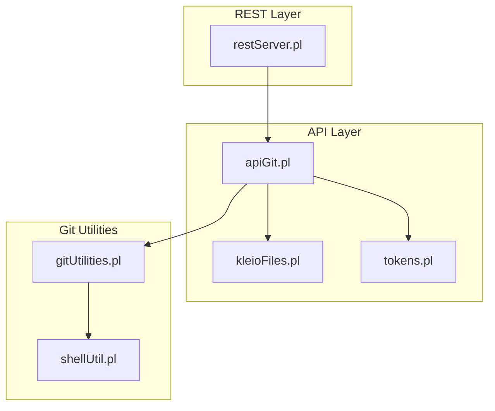
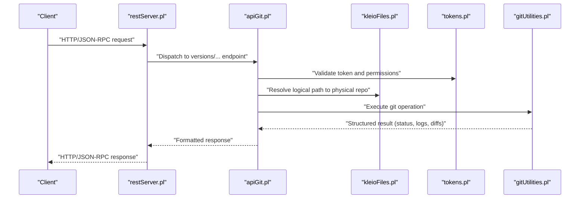
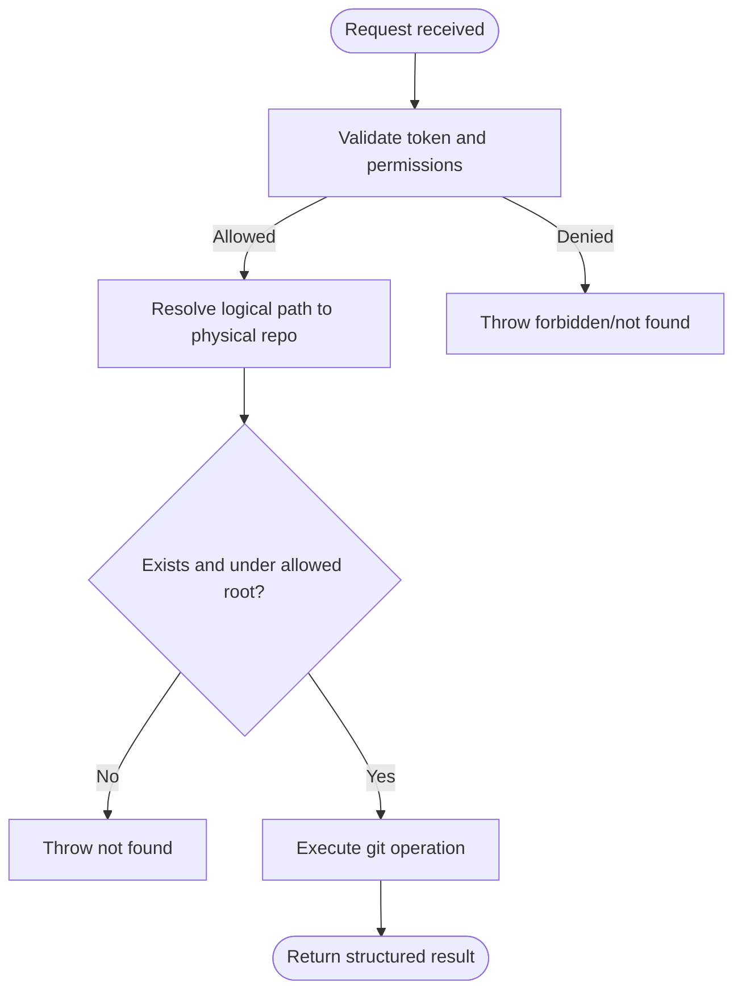
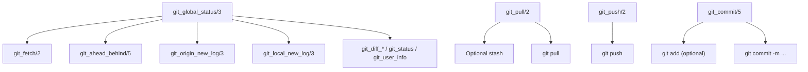
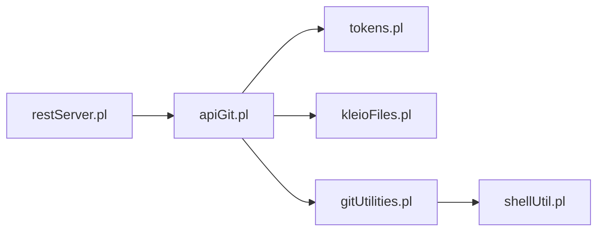

# Git Integration

<cite>
**Referenced Files in This Document**
- [apiGit.pl](file://src/apiGit.pl)
- [gitUtilities.pl](file://src/gitUtilities.pl)
- [restServer.pl](file://src/restServer.pl)
- [kleioFiles.pl](file://src/kleioFiles.pl)
- [tokens.pl](file://src/tokens.pl)
- [shellUtil.pl](file://src/shellUtil.pl)
- [api.json](file://api/postman/api.json)
- [index.html](file://docs/api/index.html)
</cite>

## Table of Contents
1. [Introduction](#introduction)
2. [Project Structure](#project-structure)
3. [Core Components](#core-components)
4. [Architecture Overview](#architecture-overview)
5. [Detailed Component Analysis](#detailed-component-analysis)
6. [Dependency Analysis](#dependency-analysis)
7. [Performance Considerations](#performance-considerations)
8. [Troubleshooting Guide](#troubleshooting-guide)
9. [Conclusion](#conclusion)
10. [Appendices](#appendices)

## Introduction
This document describes the git integration services that power version control within the kleio-server. It covers the REST and JSON-RPC APIs for retrieving repository status, listing remote branches, setting user identity, and performing collaborative operations such as fetch, pull, commit, and push. It also explains how these operations integrate with the file management system, how conflicts are handled conceptually, and provides best practices for repository organization, branching, and backups.

## Project Structure
The git integration is implemented as a layered service:
- REST/JSON-RPC entry points dispatch to API modules.
- The API module validates permissions and resolves logical paths to physical repositories.
- Utility modules encapsulate git operations and provide structured reporting.
- The server integrates with token-based authorization and file-path resolution.

**Diagram sources**
- [restServer.pl](file://src/restServer.pl#L34-L83)
- [apiGit.pl](file://src/apiGit.pl#L1-L22)
- [kleioFiles.pl](file://src/kleioFiles.pl#L1-L33)
- [tokens.pl](file://src/tokens.pl#L1-L17)
- [gitUtilities.pl](file://src/gitUtilities.pl#L1-L15)
- [shellUtil.pl](file://src/shellUtil.pl#L1-L5)

**Section sources**
- [restServer.pl](file://src/restServer.pl#L23-L128)
- [apiGit.pl](file://src/apiGit.pl#L1-L22)
- [kleioFiles.pl](file://src/kleioFiles.pl#L1-L33)
- [tokens.pl](file://src/tokens.pl#L1-L17)
- [gitUtilities.pl](file://src/gitUtilities.pl#L1-L15)
- [shellUtil.pl](file://src/shellUtil.pl#L1-L5)

## Core Components
- API entry points for git operations:
  - GET versions/status/global/:path — repository-wide status and comparison with remote.
  - GET versions/remotes/branches/:path — remote branch information.
  - GET versions/user-info/:path — configured user identity.
  - PUT versions/push/:path — push changes to remote.
  - PUT versions/commit/:path — stage and commit files.
  - PUT versions/set-user-info/:path — configure user identity.
  - DELETE versions/reset/:path — reset working tree or index.
- JSON-RPC helpers for programmatic invocation of the same endpoints.
- Utility functions for git operations, status computation, and diff/log extraction.
- Path resolution and permission enforcement via tokens.

Key behaviors:
- Authentication: All endpoints require a valid bearer token with appropriate permissions.
- Path safety: Logical paths are resolved to physical locations under user-accessible directories.
- Output modes: REST and JSON-RPC modes produce structured results; human-readable summaries are also available.

**Section sources**
- [apiGit.pl](file://src/apiGit.pl#L23-L198)
- [gitUtilities.pl](file://src/gitUtilities.pl#L24-L81)
- [kleioFiles.pl](file://src/kleioFiles.pl#L26-L26)
- [tokens.pl](file://src/tokens.pl#L13-L13)

## Architecture Overview
The git integration follows a clear separation of concerns:
- REST/JSON-RPC server handles transport and dispatch.
- API module enforces permissions and resolves paths.
- Git utilities encapsulate low-level git commands and produce structured reports.
- Shell utilities execute commands and capture outputs.

**Diagram sources**
- [restServer.pl](file://src/restServer.pl#L43-L83)
- [apiGit.pl](file://src/apiGit.pl#L34-L154)
- [kleioFiles.pl](file://src/kleioFiles.pl#L26-L26)
- [tokens.pl](file://src/tokens.pl#L13-L13)
- [gitUtilities.pl](file://src/gitUtilities.pl#L186-L264)

## Detailed Component Analysis

### API Surface and Endpoints
- GET versions/status/global/:path
  - Purpose: Retrieve a global status report comparing local branch with remote, including ahead/behind counts, recent logs, and diffs.
  - Options: compare_to_branch, include_files, recurse, and others supported by underlying utilities.
  - Output: Structured dictionary including branch, remote, ahead/behind, logs, diffs, and working directory status.
- GET versions/remotes/branches/:path
  - Purpose: List remote branches and compute ahead/behind against current branch.
  - Output: Array of remote branches with metadata.
- GET versions/user-info/:path
  - Purpose: Return configured user name and email for the repository.
- PUT versions/push/:path
  - Purpose: Push local commits to remote.
  - Options: git_params for additional flags.
  - Output: Command output, error lines, and exit status.
- PUT versions/commit/:path
  - Purpose: Stage files (add) and commit with a message; optional extra parameters.
  - Inputs: commit_files, add_files, commit_message, git_params.
  - Output: Combined output/error/status.
- PUT versions/set-user-info/:path
  - Purpose: Configure user.name and user.email for the repository.
- DELETE versions/reset/:path
  - Purpose: Reset to a specific commit with configurable mode.
  - Inputs: reset_mode, commit_ref.
  - Output: Command output, error lines, and exit status.

Response handling:
- REST mode returns arrays or raw report text depending on endpoint.
- JSON-RPC mode returns structured dictionaries suitable for clients.

**Section sources**
- [apiGit.pl](file://src/apiGit.pl#L34-L198)
- [gitUtilities.pl](file://src/gitUtilities.pl#L24-L81)
- [gitUtilities.pl](file://src/gitUtilities.pl#L426-L477)
- [gitUtilities.pl](file://src/gitUtilities.pl#L291-L313)
- [gitUtilities.pl](file://src/gitUtilities.pl#L371-L424)
- [gitUtilities.pl](file://src/gitUtilities.pl#L266-L289)
- [gitUtilities.pl](file://src/gitUtilities.pl#L315-L369)

### Authorization and Path Resolution
- Authorization: Each endpoint checks permissions using tokens. The files permission group controls access to git operations.
- Path resolution: Logical paths are resolved to absolute filesystem locations under user-accessible roots, preventing traversal outside allowed areas.

**Diagram sources**
- [apiGit.pl](file://src/apiGit.pl#L34-L48)
- [kleioFiles.pl](file://src/kleioFiles.pl#L26-L26)
- [tokens.pl](file://src/tokens.pl#L13-L13)

**Section sources**
- [apiGit.pl](file://src/apiGit.pl#L34-L48)
- [kleioFiles.pl](file://src/kleioFiles.pl#L26-L26)
- [tokens.pl](file://src/tokens.pl#L13-L13)

### Git Operations Internals
- Status and comparison:
  - Fetch remote state, compute ahead/behind, collect recent logs, and diffs for both directions.
  - Print human-readable summary and return structured data.
- Pull:
  - Optionally stash local changes, then pull with optional parameters.
- Push:
  - Execute push with optional parameters.
- Commit:
  - Stage files, then commit with message and optional parameters.
- Reset:
  - Reset to a specified commit with configurable mode.

**Diagram sources**
- [gitUtilities.pl](file://src/gitUtilities.pl#L38-L81)
- [gitUtilities.pl](file://src/gitUtilities.pl#L226-L264)
- [gitUtilities.pl](file://src/gitUtilities.pl#L291-L313)
- [gitUtilities.pl](file://src/gitUtilities.pl#L371-L424)

**Section sources**
- [gitUtilities.pl](file://src/gitUtilities.pl#L38-L81)
- [gitUtilities.pl](file://src/gitUtilities.pl#L226-L264)
- [gitUtilities.pl](file://src/gitUtilities.pl#L291-L313)
- [gitUtilities.pl](file://src/gitUtilities.pl#L371-L424)

### API Workflows and Examples
Below are typical workflows mapped to endpoints and parameters. Replace placeholders with actual values and ensure a valid bearer token is provided.

- Synchronize with remote (fetch and pull):
  - GET versions/status/global/:path
  - If behind > 0, perform:
    - PUT versions/pull/:path
  - If ahead > 0, perform:
    - PUT versions/push/:path

- Manage local changes:
  - Stage and commit:
    - PUT versions/commit/:path
    - Parameters: add_files, commit_files, commit_message, git_params
  - Set user identity:
    - PUT versions/set-user-info/:path
    - Parameters: user_name, user_email

- Coordinate updates across team members:
  - Inspect remote branches:
    - GET versions/remotes/branches/:path
  - Review recent changes:
    - GET versions/status/global/:path
    - Use compare_to_branch to compare with upstream or other refs

- Reset problematic state:
  - DELETE versions/reset/:path
  - Parameters: reset_mode, commit_ref

Notes:
- Use recurse and compare_to_branch where supported by endpoints.
- For JSON-RPC, use the json variants of each endpoint.

**Section sources**
- [apiGit.pl](file://src/apiGit.pl#L34-L198)
- [gitUtilities.pl](file://src/gitUtilities.pl#L38-L81)

### Integration with File Management
- Path resolution ensures operations occur within user-accessible directories.
- Working directory status reflects staged and unstaged changes, aiding decision-making before committing or pushing.
- First-line-only change detection helps avoid noisy logs caused by automated translation updates.

**Section sources**
- [kleioFiles.pl](file://src/kleioFiles.pl#L26-L26)
- [gitUtilities.pl](file://src/gitUtilities.pl#L528-L549)
- [gitUtilities.pl](file://src/gitUtilities.pl#L568-L594)

### Conflict Resolution Mechanisms
- Pull behavior:
  - Optional stash allows preserving local changes before pulling.
  - After pull, review working directory status and resolve conflicts manually; then commit.
- Push behavior:
  - Push may fail if remote requires fast-forward; in such cases, pull first (possibly with merge or rebase) and then push again.
- Reset:
  - Use reset to undo unwanted commits locally; ensure to coordinate with collaborators.

**Section sources**
- [gitUtilities.pl](file://src/gitUtilities.pl#L240-L264)
- [gitUtilities.pl](file://src/gitUtilities.pl#L266-L289)

## Dependency Analysis
The following diagram shows key dependencies among modules involved in git operations.

**Diagram sources**
- [restServer.pl](file://src/restServer.pl#L34-L83)
- [apiGit.pl](file://src/apiGit.pl#L17-L21)
- [gitUtilities.pl](file://src/gitUtilities.pl#L23-L23)
- [shellUtil.pl](file://src/shellUtil.pl#L1-L5)

**Section sources**
- [restServer.pl](file://src/restServer.pl#L34-L83)
- [apiGit.pl](file://src/apiGit.pl#L17-L21)
- [gitUtilities.pl](file://src/gitUtilities.pl#L23-L23)
- [shellUtil.pl](file://src/shellUtil.pl#L1-L5)

## Performance Considerations
- Prefer targeted status queries by specifying a subdirectory path to reduce log and diff computation scope.
- Use compare_to_branch to focus on specific refs (e.g., upstream/main) rather than entire history.
- Batch operations where possible; avoid frequent fetches by leveraging cached remote info.
- Limit recursion depth with recurse parameters when listing or scanning large trees.

## Troubleshooting Guide
Common issues and resolutions:
- Permission denied:
  - Ensure the token has the files permission group; otherwise, endpoints will reject the request.
- Not found:
  - The logical path may not resolve to an existing directory under allowed roots.
- Pull failures:
  - Conflicts or non-fast-forward merges require manual resolution; stash local changes if needed, pull, resolve, then commit.
- Push failures:
  - Remote requires pull first; perform a pull and retry.
- Empty or unexpected status:
  - Verify the repository is initialized and has a tracked remote; ensure credentials are configured if required.

Operational diagnostics:
- Use versions/status/global to inspect ahead/behind and recent logs.
- Use versions/remotes/branches to confirm remote availability and branch presence.

**Section sources**
- [apiGit.pl](file://src/apiGit.pl#L34-L48)
- [gitUtilities.pl](file://src/gitUtilities.pl#L38-L81)
- [gitUtilities.pl](file://src/gitUtilities.pl#L226-L264)
- [gitUtilities.pl](file://src/gitUtilities.pl#L291-L313)

## Conclusion
The git integration in kleio-server provides a robust, permission-enforced interface for collaborative version control of source files and configurations. By combining REST/JSON-RPC entry points with structured git utilities, teams can synchronize repositories, manage local changes, and coordinate updates safely. Proper use of path resolution, authorization, and status reporting enables reliable workflows for historical document collections.

## Appendices

### API Reference Summary
- GET versions/status/global/:path
  - Purpose: Global repository status and comparisons.
  - Options: compare_to_branch, include_files, recurse.
- GET versions/remotes/branches/:path
  - Purpose: Remote branch information and ahead/behind metrics.
- GET versions/user-info/:path
  - Purpose: User identity configured for the repository.
- PUT versions/push/:path
  - Purpose: Push local commits to remote.
  - Options: git_params.
- PUT versions/commit/:path
  - Purpose: Stage and commit files.
  - Inputs: add_files, commit_files, commit_message, git_params.
- PUT versions/set-user-info/:path
  - Purpose: Configure user.name and user.email.
- DELETE versions/reset/:path
  - Purpose: Reset to a specific commit.
  - Inputs: reset_mode, commit_ref.

**Section sources**
- [apiGit.pl](file://src/apiGit.pl#L34-L198)
- [gitUtilities.pl](file://src/gitUtilities.pl#L24-L81)
- [gitUtilities.pl](file://src/gitUtilities.pl#L291-L313)
- [gitUtilities.pl](file://src/gitUtilities.pl#L371-L424)
- [gitUtilities.pl](file://src/gitUtilities.pl#L266-L289)

### Practical Workflow Examples
- Sync with remote:
  - GET versions/status/global/:path
  - If behind: PUT versions/pull/:path
  - If ahead: PUT versions/push/:path
- Commit changes:
  - PUT versions/commit/:path with add_files, commit_files, commit_message
- Coordinate with team:
  - GET versions/remotes/branches/:path
  - GET versions/status/global/:path with compare_to_branch=upstream/<branch>
- Reset problematic state:
  - DELETE versions/reset/:path with reset_mode and commit_ref

**Section sources**
- [apiGit.pl](file://src/apiGit.pl#L34-L198)
- [gitUtilities.pl](file://src/gitUtilities.pl#L38-L81)

### Best Practices
- Repository organization:
  - Keep related sources grouped under user-accessible directories; use clear subfolder hierarchies.
- Branching:
  - Use feature branches for major changes; merge upstream regularly to minimize conflicts.
- Backup:
  - Maintain offsite remote backups; ensure credentials and SSH/Git credentials are properly configured.
- Collaboration:
  - Communicate before force-pushing or resetting shared branches; use pull requests or reviews where applicable.

[No sources needed since this section provides general guidance]