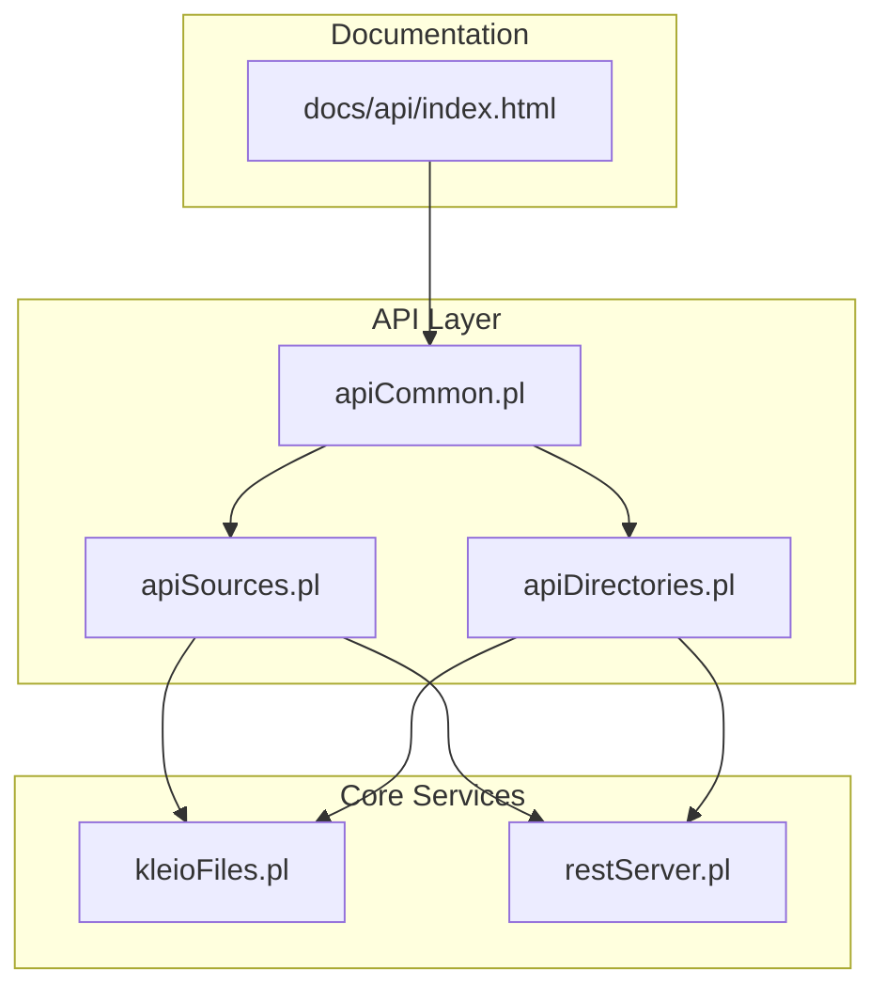
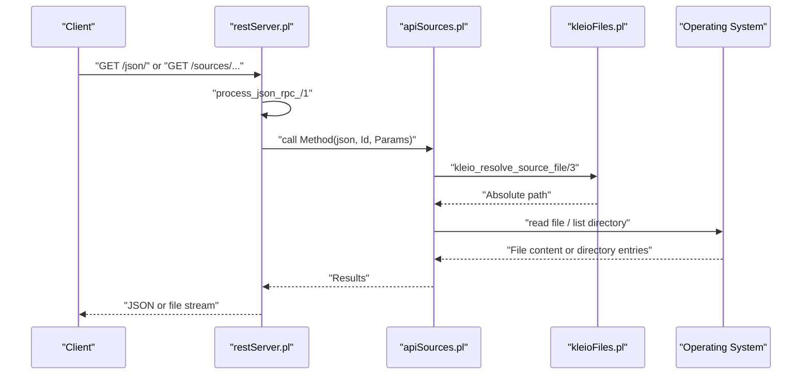
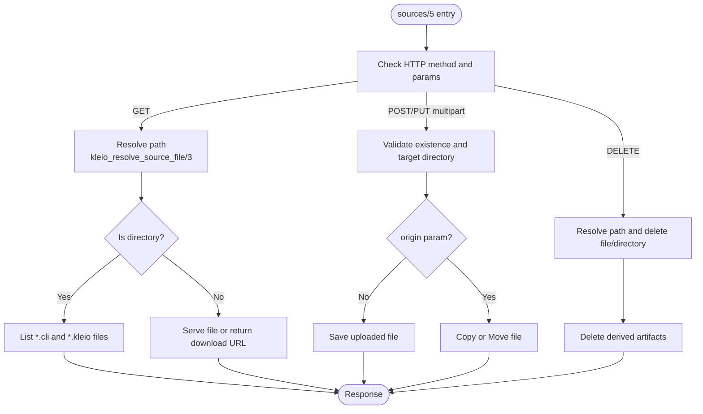
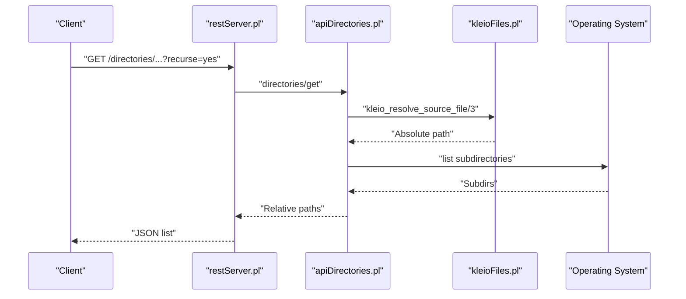
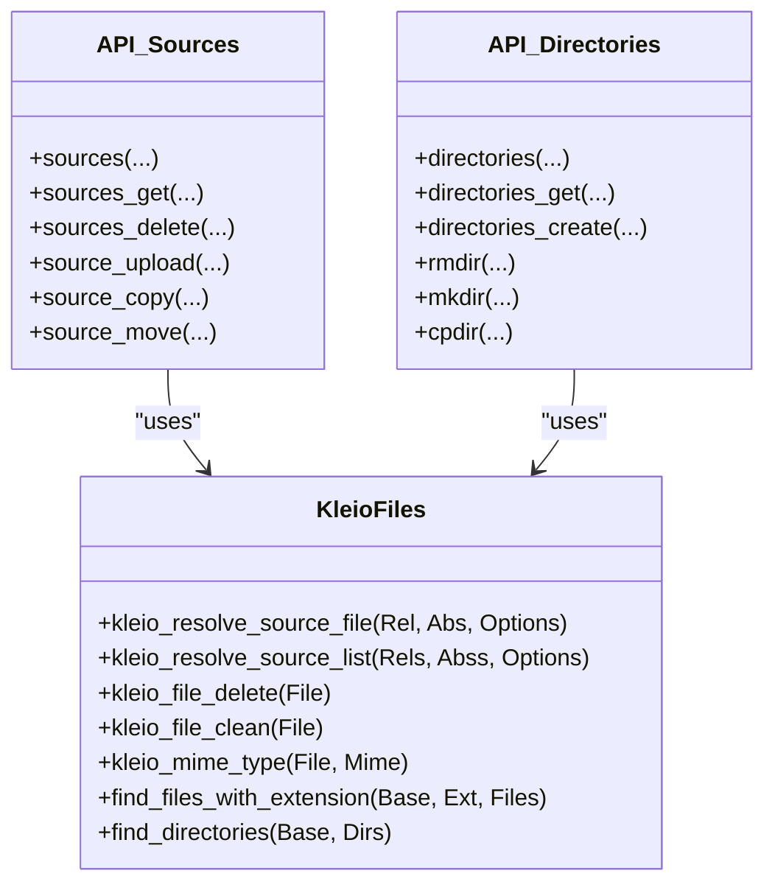
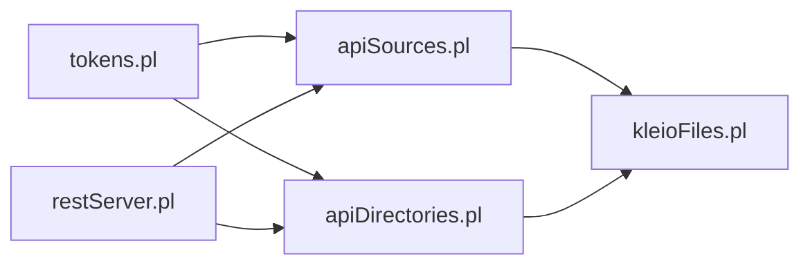

# Source Management

<cite>
**Referenced Files in This Document**
- [apiSources.pl](file://src/apiSources.pl)
- [apiDirectories.pl](file://src/apiDirectories.pl)
- [kleioFiles.pl](file://src/kleioFiles.pl)
- [restServer.pl](file://src/restServer.pl)
- [apiCommon.pl](file://src/apiCommon.pl)
- [index.html](file://docs/api/index.html)
</cite>

## Table of Contents
1. [Introduction](#introduction)
2. [Project Structure](#project-structure)
3. [Core Components](#core-components)
4. [Architecture Overview](#architecture-overview)
5. [Detailed Component Analysis](#detailed-component-analysis)
6. [Dependency Analysis](#dependency-analysis)
7. [Performance Considerations](#performance-considerations)
8. [Troubleshooting Guide](#troubleshooting-guide)
9. [Conclusion](#conclusion)
10. [Appendices](#appendices)

## Introduction
This document describes the source management subsystem of the kleio-server, focusing on file and directory operations for Kleio source collections. It covers:
- Listing available Kleio files and managing source collections
- Directory management (listing, creating, copying, moving, deleting)
- File operations (upload, update, copy, move, delete)
- API endpoints and request/response semantics
- Security considerations and integration with the underlying file system
- Bulk operations, validation, and best practices for organizing sources

## Project Structure
The source management functionality is implemented across several modules:
- API entry points for sources and directories
- File system utilities and path resolution
- REST server infrastructure and JSON-RPC dispatch
- Common API documentation and routing

**Diagram sources**
- [apiSources.pl](file://src/apiSources.pl#L1-L425)
- [apiDirectories.pl](file://src/apiDirectories.pl#L1-L168)
- [kleioFiles.pl](file://src/kleioFiles.pl#L1-L933)
- [restServer.pl](file://src/restServer.pl#L1-L200)
- [apiCommon.pl](file://src/apiCommon.pl#L30-L89)
- [index.html](file://docs/api/index.html#L1-L200)

**Section sources**
- [apiSources.pl](file://src/apiSources.pl#L1-L425)
- [apiDirectories.pl](file://src/apiDirectories.pl#L1-L168)
- [kleioFiles.pl](file://src/kleioFiles.pl#L1-L933)
- [restServer.pl](file://src/restServer.pl#L1-L200)
- [apiCommon.pl](file://src/apiCommon.pl#L30-L89)
- [index.html](file://docs/api/index.html#L1-L200)

## Core Components
- Sources API: Provides listing, downloading, uploading, updating, copying, moving, and deleting of source files and directories. Supports both REST and JSON-RPC.
- Directories API: Lists, creates, copies, and deletes directories under the user’s source space.
- File utilities: Path resolution, MIME type detection, file set management (including derived artifacts), and directory traversal helpers.
- REST/JSON-RPC server: Dispatches requests, handles multipart uploads, and formats responses.

Key responsibilities:
- Enforce permissions via tokens
- Resolve relative paths to absolute locations under the user’s sources directory
- Return safe, relative paths in API responses
- Manage derived artifacts (translation reports, XML exports, error summaries, etc.)

**Section sources**
- [apiSources.pl](file://src/apiSources.pl#L28-L177)
- [apiDirectories.pl](file://src/apiDirectories.pl#L18-L89)
- [kleioFiles.pl](file://src/kleioFiles.pl#L69-L144)
- [kleioFiles.pl](file://src/kleioFiles.pl#L753-L800)
- [restServer.pl](file://src/restServer.pl#L43-L106)

## Architecture Overview
The system routes HTTP requests to API modules, which validate permissions, resolve paths, and delegate to file utilities. Responses are either raw file downloads or JSON structures depending on the endpoint.

**Diagram sources**
- [restServer.pl](file://src/restServer.pl#L43-L106)
- [apiSources.pl](file://src/apiSources.pl#L89-L104)
- [kleioFiles.pl](file://src/kleioFiles.pl#L753-L781)

## Detailed Component Analysis

### Sources API
The sources API supports:
- GET: Download a file or list files in a directory
- POST (multipart): Upload a new file
- PUT (multipart): Update an existing file
- POST with origin: Copy a file
- PUT with origin: Move a file
- DELETE: Delete a file or directory (with recursion and derived artifacts)

Behavior highlights:
- Path resolution: Relative paths are resolved against the user’s sources directory using token information.
- Derived artifacts: Deleting a source file also removes related artifacts (reports, XML, error summaries, IDs, old, files.json).
- URL generation: For directory listings, optional parameters can return direct download URLs.

**Diagram sources**
- [apiSources.pl](file://src/apiSources.pl#L89-L177)
- [apiSources.pl](file://src/apiSources.pl#L228-L285)
- [apiSources.pl](file://src/apiSources.pl#L324-L353)
- [apiSources.pl](file://src/apiSources.pl#L354-L410)
- [kleioFiles.pl](file://src/kleioFiles.pl#L128-L144)

**Section sources**
- [apiSources.pl](file://src/apiSources.pl#L28-L177)
- [apiSources.pl](file://src/apiSources.pl#L183-L210)
- [apiSources.pl](file://src/apiSources.pl#L228-L285)
- [apiSources.pl](file://src/apiSources.pl#L324-L410)
- [kleioFiles.pl](file://src/kleioFiles.pl#L128-L144)

### Directories API
The directories API supports:
- GET: List directories under a path (optionally recursive)
- POST: Create a directory
- POST with origin: Copy a directory
- DELETE: Remove a directory (with force flag to delete non-empty)

**Diagram sources**
- [apiDirectories.pl](file://src/apiDirectories.pl#L18-L35)
- [apiDirectories.pl](file://src/apiDirectories.pl#L119-L147)
- [kleioFiles.pl](file://src/kleioFiles.pl#L800-L831)

**Section sources**
- [apiDirectories.pl](file://src/apiDirectories.pl#L18-L89)
- [apiDirectories.pl](file://src/apiDirectories.pl#L119-L147)
- [kleioFiles.pl](file://src/kleioFiles.pl#L800-L831)

### File Utilities and Path Resolution
- Path resolution: Converts relative paths to absolute paths under the user’s sources directory and vice versa.
- MIME type detection: Maps file extensions to appropriate MIME types for serving.
- Derived file sets: Enumerates related artifacts (rpt, err, xml, org, old, ids, files.json) for a given source file.
- Directory traversal: Helpers to list directories and files with optional recursion.

**Diagram sources**
- [kleioFiles.pl](file://src/kleioFiles.pl#L753-L800)
- [kleioFiles.pl](file://src/kleioFiles.pl#L832-L850)
- [kleioFiles.pl](file://src/kleioFiles.pl#L69-L144)
- [apiSources.pl](file://src/apiSources.pl#L28-L177)
- [apiDirectories.pl](file://src/apiDirectories.pl#L18-L89)

**Section sources**
- [kleioFiles.pl](file://src/kleioFiles.pl#L69-L144)
- [kleioFiles.pl](file://src/kleioFiles.pl#L753-L800)
- [kleioFiles.pl](file://src/kleioFiles.pl#L832-L850)

## Dependency Analysis
- API modules depend on:
  - Token validation and permissions
  - File system utilities for path resolution and file operations
  - REST server for request routing and multipart handling
- File utilities encapsulate OS-level operations and provide safe relative-path exposure to clients.

**Diagram sources**
- [apiSources.pl](file://src/apiSources.pl#L19-L26)
- [apiDirectories.pl](file://src/apiDirectories.pl#L12-L15)
- [restServer.pl](file://src/restServer.pl#L131-L162)
- [kleioFiles.pl](file://src/kleioFiles.pl#L1-L33)

**Section sources**
- [apiSources.pl](file://src/apiSources.pl#L19-L26)
- [apiDirectories.pl](file://src/apiDirectories.pl#L12-L15)
- [restServer.pl](file://src/restServer.pl#L131-L162)
- [kleioFiles.pl](file://src/kleioFiles.pl#L1-L33)

## Performance Considerations
- Directory listing: Recursive directory traversal can be expensive. Prefer non-recursive listing when possible.
- File operations: Bulk operations (copy/move/delete) iterate over matched files; ensure appropriate use of filters and recursion.
- MIME detection and derived artifact enumeration: These are lightweight but should be avoided unnecessarily in hot paths.
- Upload/update: Multipart handling is delegated to the HTTP library; ensure adequate memory and disk space for large files.

[No sources needed since this section provides general guidance]

## Troubleshooting Guide
Common issues and resolutions:
- Forbidden access: Ensure the request includes a valid token with appropriate scopes (files, upload, delete, mkdir).
- Not found: Verify the relative path resolves to an existing file or directory under the user’s sources directory.
- Directory not empty: Use the force flag for deletion to remove non-empty directories.
- Upload conflicts: POST fails if the destination exists; PUT fails if the destination does not exist.
- Copy/Move failures: Destination must not exist; ensure the destination directory exists and is writable.

**Section sources**
- [apiSources.pl](file://src/apiSources.pl#L92-L100)
- [apiSources.pl](file://src/apiSources.pl#L129-L136)
- [apiSources.pl](file://src/apiSources.pl#L341-L348)
- [apiDirectories.pl](file://src/apiDirectories.pl#L101-L116)

## Conclusion
The source management subsystem provides a robust, permission-aware interface for managing Kleio source files and directories. It integrates tightly with the file system, enforces security boundaries, and exposes both REST and JSON-RPC endpoints for flexible client integration. Following the best practices outlined below will help maintain organized, secure, and efficient source collections.

[No sources needed since this section summarizes without analyzing specific files]

## Appendices

### API Reference

- Sources
  - GET /json/ (sources_get): Retrieve a file or list files in a directory. Optional parameters:
    - path: Target path (relative to user sources)
    - url: yes to return download URLs for files
    - recurse: yes to recurse into subdirectories
  - POST /json/ (sources_upload): Upload a new file (multipart). Requires destination directory to exist.
  - PUT /json/ (sources_update): Update an existing file (multipart).
  - POST /json/ (sources_copy): Copy a file to a new location (requires origin parameter).
  - PUT /json/ (sources_move): Move a file to a new location (requires origin parameter).
  - DELETE /json/ (sources_delete): Delete a file or directory (with derived artifacts).

- Directories
  - GET /json/ (directories_get): List directories under a path. Optional parameters:
    - path: Target path
    - recurse: yes to recurse into subdirectories
  - POST /json/ (directories_create): Create a directory.
  - POST /json/ (directories_copy): Copy a directory (requires origin parameter).
  - DELETE /json/ (directories_delete): Remove a directory. Optional parameters:
    - force: yes to delete non-empty directories

- Notes
  - All endpoints support JSON-RPC invocation via the /json/ endpoint.
  - For directory listing, optional parameters can return direct download URLs for files.

**Section sources**
- [apiCommon.pl](file://src/apiCommon.pl#L32-L76)
- [apiSources.pl](file://src/apiSources.pl#L28-L177)
- [apiDirectories.pl](file://src/apiDirectories.pl#L18-L89)
- [index.html](file://docs/api/index.html#L791-L1065)

### Practical Workflows

- Organizing sources
  - Create a hierarchical directory structure under the user’s sources directory.
  - Use directories_get with recurse=yes to enumerate and audit the structure.

- Creating backup copies
  - Use sources_copy to duplicate files to a backup directory.
  - Ensure the destination directory exists and is writable.

- Maintaining source hierarchies
  - Use directories_create to establish new categories.
  - Use directories_copy to replicate templates or reference structures.

- Bulk operations
  - Use directory listing to identify targets, then perform copy/move/delete operations per file.
  - For deletions, leverage the automatic cleanup of derived artifacts.

- File validation
  - After upload/update, verify translation status via the translations API.
  - Check error summaries and reports for validation feedback.

- Security considerations
  - Always pass a valid token with appropriate scopes.
  - Avoid exposing absolute paths in responses; rely on relative paths returned by APIs.
  - Restrict directory creation and deletion to authorized users.

[No sources needed since this section provides general guidance]