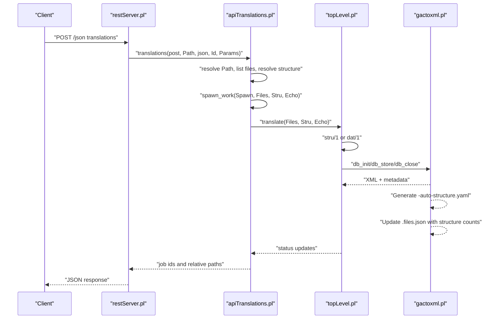
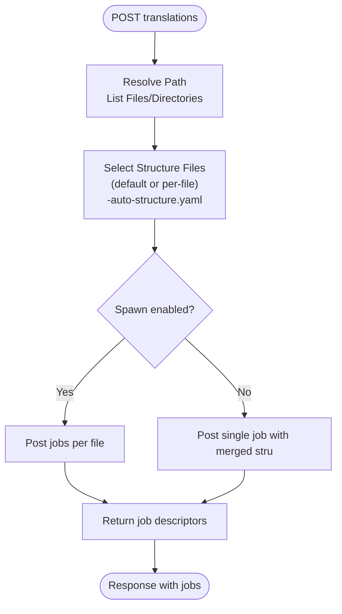
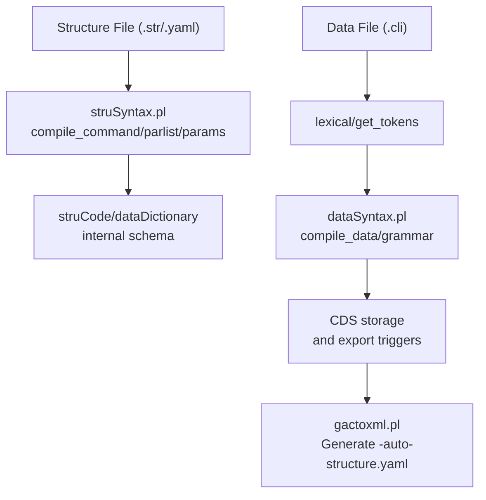
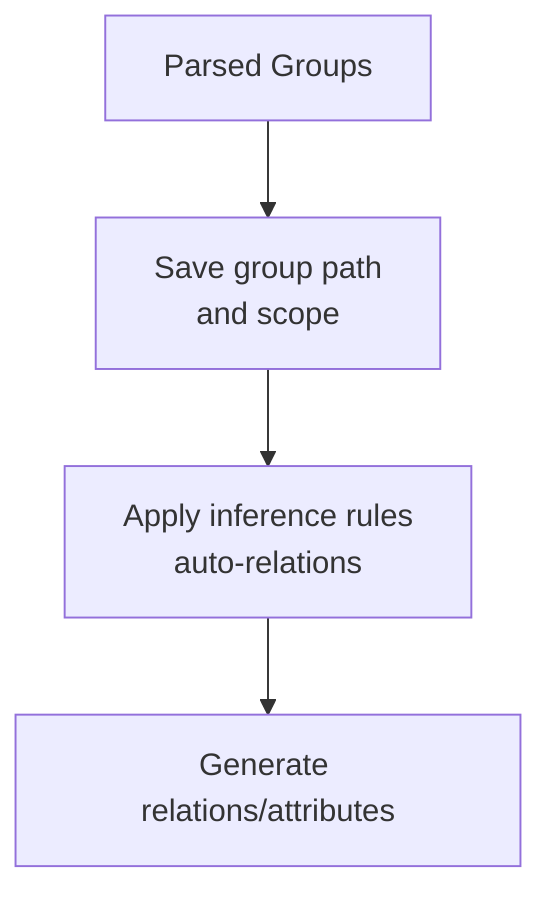
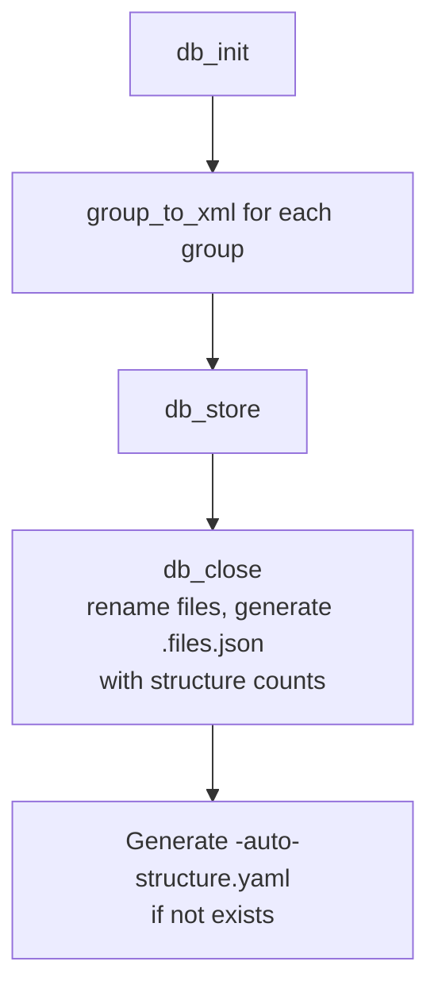
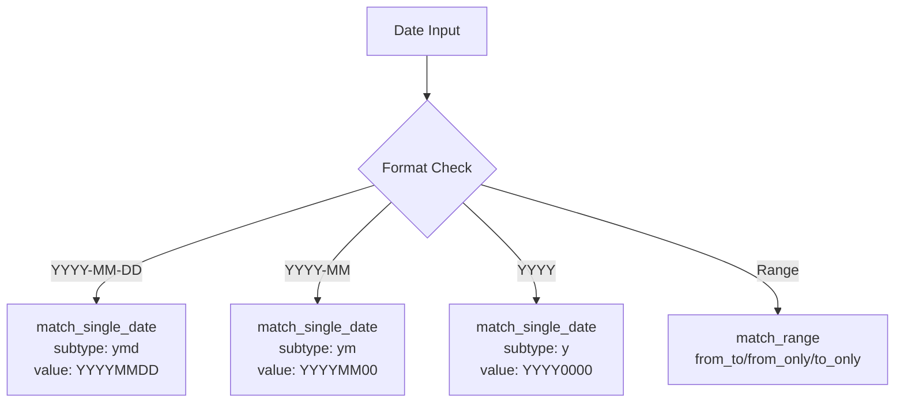
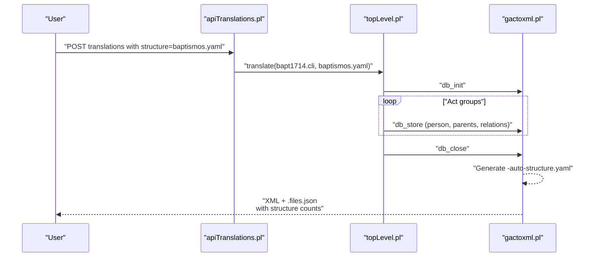
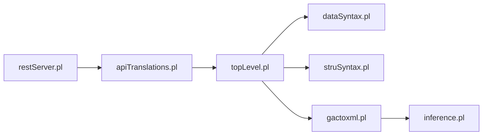

# Translation Services

<cite>
**Referenced Files in This Document**
- [apiTranslations.pl](file://src/apiTranslations.pl)
- [restServer.pl](file://src/restServer.pl)
- [topLevel.pl](file://src/topLevel.pl)
- [dataSyntax.pl](file://src/dataSyntax.pl)
- [struSyntax.pl](file://src/struSyntax.pl)
- [gactoxml.pl](file://src/gactoxml.pl)
- [inference.pl](file://src/inference.pl)
- [apiExports.pl](file://src/apiExports.pl)
- [tests/kleio-home/sources/test_translations/paroquiais/baptismos/bapt1714.cli](file://tests/kleio-home/sources/test_translations/paroquiais/baptismos/bapt1714.cli)
- [tests/kleio-home/structures/baptismos.yaml](file://tests/kleio-home/structures/baptismos.yaml)
- [src/stru/gacto2.str](file://src/stru/gacto2.str)
- [tests/kleio-home/sources/reference_translations/paroquiais/baptismos/bapt1714.files.json](file://tests/kleio-home/sources/reference_translations/paroquiais/baptismos/bapt1714.files.json)
- [tests/kleio-home/sources/reference_translations/linked_data/dehergne-a.files.json](file://tests/kleio-home/sources/reference_translations/linked_data/dehergne-a.files.json)
- [tests/kleio-home/sources/more_sources/varia/auc-alunos-264605-A-140337-140771-auto-structure.yaml](file://tests/kleio-home/sources/more_sources/varia/auc-alunos-264605-A-140337-140771-auto-structure.yaml)
- [tests/kleio-home/sources/reference_translations/paroquiais/baptismos/bap-com-celebrantes.files.json](file://tests/kleio-home/sources/reference_translations/paroquiais/baptismos/bap-com-celebrantes.files.json)
</cite>

## Update Summary
**Changes Made**
- Updated structure file naming convention documentation to reflect the transition from -structure.yaml to -auto-structure.yaml
- Added documentation for enhanced .files.json output format with structure error and warning counts
- Updated date parsing capabilities documentation to include YYYY-MM-DD format support
- Enhanced export and reporting system documentation with new structure file naming and counting features

## Table of Contents
1. [Introduction](#introduction)
2. [Project Structure](#project-structure)
3. [Core Components](#core-components)
4. [Architecture Overview](#architecture-overview)
5. [Detailed Component Analysis](#detailed-component-analysis)
6. [Dependency Analysis](#dependency-analysis)
7. [Performance Considerations](#performance-considerations)
8. [Troubleshooting Guide](#troubleshooting-guide)
9. [Conclusion](#conclusion)
10. [Appendices](#appendices)

## Introduction
This document explains the translation services of kleio-server with a focus on the intelligent translation process that parses Kleio source files, normalizes structure and syntax, infers contextual information from historical documents, and produces structured outputs. It covers the translation workflow from upload to processing and structured output generation, details the REST and JSON-RPC APIs for translation operations, and documents supported formats, error handling, and integration patterns with other Timelink services.

**Updated** Enhanced with improved structure file naming conventions (-auto-structure.yaml), expanded .files.json output with structure error/warning counts, and enhanced date parsing capabilities supporting YYYY-MM-DD format.

## Project Structure
The translation subsystem is implemented as a layered stack:
- REST/JSON-RPC entry points dispatch requests to translation handlers.
- Translation handlers orchestrate file resolution, structure selection, and job distribution.
- The CLIO engine performs syntax parsing and compilation for both structure (.str/.yaml) and data (.cli) files.
- Export modules transform parsed data into standardized outputs (XML and related metadata).
- Inference rules enrich relational and attribute data based on document semantics.

```mermaid
graph TB
subgraph "REST Layer"
RS["restServer.pl"]
end
subgraph "Translation Orchestrator"
AT["apiTranslations.pl"]
end
subgraph "CLIO Engine"
TL["topLevel.pl"]
DS["dataSyntax.pl"]
SS["struSyntax.pl"]
end
subgraph "Export & Inference"
GX["gactoxml.pl"]
IF["inference.pl"]
end
subgraph "Outputs"
XML[".xml"]
ERR[".err/.rpt"]
META[".files.json"]
AUTO["-auto-structure.yaml"]
END
RS --> AT
AT --> TL
TL --> DS
TL --> SS
TL --> GX
GX --> IF
GX --> XML
GX --> ERR
GX --> META
GX --> AUTO
```

**Diagram sources**
- [restServer.pl](file://src/restServer.pl#L34-L84)
- [apiTranslations.pl](file://src/apiTranslations.pl#L34-L82)
- [topLevel.pl](file://src/topLevel.pl#L102-L160)
- [dataSyntax.pl](file://src/dataSyntax.pl#L38-L62)
- [struSyntax.pl](file://src/struSyntax.pl#L48-L58)
- [gactoxml.pl](file://src/gactoxml.pl#L129-L188)
- [inference.pl](file://src/inference.pl#L1-L35)

**Section sources**
- [restServer.pl](file://src/restServer.pl#L23-L128)
- [apiTranslations.pl](file://src/apiTranslations.pl#L1-L33)
- [topLevel.pl](file://src/topLevel.pl#L1-L70)

## Core Components
- REST/JSON-RPC server: routes requests, decodes JSON payloads, and invokes API methods.
- Translation API: starts translation jobs, queries statuses, and cleans results.
- CLIO engine: compiles structure and data files with robust syntax analysis and error reporting.
- Export module: generates XML output, metadata, and pretty-printed IDs with enhanced structure file management.
- Inference module: derives relations and attributes from document patterns.

**Updated** Enhanced export module now generates -auto-structure.yaml files and includes structure error/warning counts in .files.json output.

**Section sources**
- [restServer.pl](file://src/restServer.pl#L43-L106)
- [apiTranslations.pl](file://src/apiTranslations.pl#L34-L82)
- [topLevel.pl](file://src/topLevel.pl#L102-L160)
- [gactoxml.pl](file://src/gactoxml.pl#L129-L188)
- [inference.pl](file://src/inference.pl#L1-L35)

## Architecture Overview
The translation workflow is request-driven and supports both single-file and directory-based processing with optional parallelization.



**Diagram sources**
- [restServer.pl](file://src/restServer.pl#L43-L106)
- [apiTranslations.pl](file://src/apiTranslations.pl#L52-L82)
- [topLevel.pl](file://src/topLevel.pl#L102-L160)
- [gactoxml.pl](file://src/gactoxml.pl#L129-L188)

## Detailed Component Analysis

### Translation API and Workflow
- Entry points:
  - POST translations: start translation jobs for a file or directory.
  - GET translations: query translation status and results.
  - DELETE translations: clean derived files for a path.
- Parameters:
  - structure: override default structure file.
  - echo: include source lines in report.
  - recurse: traverse subdirectories.
  - status: filter by status (queued, processing, translated).
  - spawn: distribute work across workers for parallel processing.
- Behavior:
  - Resolves absolute paths, selects structure files per file, spawns jobs, and returns job descriptors with relative paths.



**Diagram sources**
- [apiTranslations.pl](file://src/apiTranslations.pl#L52-L82)
- [apiTranslations.pl](file://src/apiTranslations.pl#L241-L253)

**Section sources**
- [apiTranslations.pl](file://src/apiTranslations.pl#L34-L82)
- [apiTranslations.pl](file://src/apiTranslations.pl#L263-L293)
- [apiTranslations.pl](file://src/apiTranslations.pl#L295-L312)
- [apiTranslations.pl](file://src/apiTranslations.pl#L420-L425)

### Syntax Parsing and Normalization
- Structure files (.str/.yaml):
  - Parsed via struSyntax.pl grammar and compiled into internal dictionaries.
  - Supports English keywords and normalized parameter validation.
  - **Updated** Now generates -auto-structure.yaml files when structure files don't exist locally.
- Data files (.cli):
  - Tokenized and parsed by dataSyntax.pl with support for triple/double quotes, escaped sequences, and element grouping.
  - Line-by-line compilation drives storage into a temporary structure (CDS) and subsequent export.



**Diagram sources**
- [struSyntax.pl](file://src/struSyntax.pl#L48-L58)
- [struSyntax.pl](file://src/struSyntax.pl#L103-L121)
- [dataSyntax.pl](file://src/dataSyntax.pl#L38-L62)
- [dataSyntax.pl](file://src/dataSyntax.pl#L65-L66)
- [gactoxml.pl](file://src/gactoxml.pl#L227-L236)

**Section sources**
- [struSyntax.pl](file://src/struSyntax.pl#L12-L36)
- [dataSyntax.pl](file://src/dataSyntax.pl#L38-L62)

### Intelligent Inference of Contextual Information
- Inference rules derive kinship relations, marital ties, and other semantic links from document patterns.
- Rules operate over group paths and scopes to generate relations and attributes automatically.



**Diagram sources**
- [gactoxml.pl](file://src/gactoxml.pl#L386-L401)
- [inference.pl](file://src/inference.pl#L37-L52)

**Section sources**
- [inference.pl](file://src/inference.pl#L1-L35)
- [gactoxml.pl](file://src/gactoxml.pl#L342-L367)

### Export and Structured Output Generation
- Export module writes XML output, pretty-printed IDs, and metadata files.
- **Updated** Enhanced .files.json output now includes structure-specific error and warning counts (stru_errors, stru_warnings).
- **Updated** Automatically generates -auto-structure.yaml files when they don't exist locally.
- Generates .xml, .rpt, .err, .ids, and .files.json for downstream consumption and integration.



**Diagram sources**
- [gactoxml.pl](file://src/gactoxml.pl#L129-L188)
- [gactoxml.pl](file://src/gactoxml.pl#L237-L255)
- [gactoxml.pl](file://src/gactoxml.pl#L227-L236)

**Section sources**
- [gactoxml.pl](file://src/gactoxml.pl#L129-L188)
- [gactoxml.pl](file://src/gactoxml.pl#L192-L252)

### Enhanced Date Parsing Capabilities
- **Updated** Improved date parsing now supports YYYY-MM-DD format in addition to existing formats.
- Supports various date formats including YYYY, YYYY-MM, YYYY-MM-DD, and relative dates.
- Enhanced precision handling for date ranges and individual dates.



**Diagram sources**
- [gactoxml.pl](file://src/gactoxml.pl#L1342-L1371)
- [gactoxml.pl](file://src/gactoxml.pl#L1373-L1437)

**Section sources**
- [gactoxml.pl](file://src/gactoxml.pl#L1342-L1371)
- [gactoxml.pl](file://src/gactoxml.pl#L1373-L1437)

### Practical Examples: Historical Documents
- Baptisms (Lousa corpus):
  - Structure: baptismos.yaml defines groups and elements for "bap" and "b".
  - Data: bapt1714.cli demonstrates typical baptism act entries with persons, parents, godparents, and relations.
  - Processing: structure selected per file or default; translation produces XML and metadata.
  - **Updated** Automatic generation of -auto-structure.yaml files for documentation and future reference.



**Diagram sources**
- [tests/kleio-home/structures/baptismos.yaml](file://tests/kleio-home/structures/baptismos.yaml#L22-L42)
- [tests/kleio-home/sources/test_translations/paroquiais/baptismos/bapt1714.cli](file://tests/kleio-home/sources/test_translations/paroquiais/baptismos/bapt1714.cli#L1-L50)
- [gactoxml.pl](file://src/gactoxml.pl#L129-L188)

**Section sources**
- [tests/kleio-home/structures/baptismos.yaml](file://tests/kleio-home/structures/baptismos.yaml#L1-L42)
- [tests/kleio-home/sources/test_translations/paroquiais/baptismos/bapt1714.cli](file://tests/kleio-home/sources/test_translations/paroquiais/baptismos/bapt1714.cli#L1-L80)
- [src/stru/gacto2.str](file://src/stru/gacto2.str#L420-L450)

## Dependency Analysis
Translation services depend on:
- REST server for request routing and JSON decoding.
- Translation orchestrator for job management and status caching.
- CLIO engine for syntax parsing and compilation.
- Export module for output generation.
- Inference module for contextual enrichment.



**Diagram sources**
- [restServer.pl](file://src/restServer.pl#L34-L84)
- [apiTranslations.pl](file://src/apiTranslations.pl#L21-L32)
- [topLevel.pl](file://src/topLevel.pl#L43-L57)
- [gactoxml.pl](file://src/gactoxml.pl#L93-L104)

**Section sources**
- [apiTranslations.pl](file://src/apiTranslations.pl#L21-L32)
- [topLevel.pl](file://src/topLevel.pl#L43-L57)
- [gactoxml.pl](file://src/gactoxml.pl#L93-L104)

## Performance Considerations
- Parallelization:
  - Use spawn=yes to distribute files across workers for throughput.
  - spawn=no consolidates structure processing for multi-user friendliness.
- Caching:
  - Status cache reduces repeated computation for GET translations with configurable thresholds and sizes.
- Batch processing:
  - REST JSON-RPC supports batch requests for multiple operations.
- Worker threads:
  - Configurable via environment variable for server concurrency.
- **Updated** Enhanced structure file management reduces redundant processing by automatically generating -auto-structure.yaml files.

**Section sources**
- [apiTranslations.pl](file://src/apiTranslations.pl#L46-L49)
- [apiTranslations.pl](file://src/apiTranslations.pl#L168-L203)
- [restServer.pl](file://src/restServer.pl#L178-L183)

## Troubleshooting Guide
- Forbidden access:
  - Unauthorized tokens trigger HTTP 403 with request-id included.
- Missing structure files:
  - Validation throws errors when requested or default structure files do not exist.
  - **Updated** System now automatically generates -auto-structure.yaml files when structure files are missing.
- File resolution:
  - Ensure paths resolve under configured source directories; otherwise, not_found responses are returned.
- Error and report files:
  - .err and .rpt files capture translation diagnostics; review for syntax and validation issues.
  - **Updated** .files.json now includes structure-specific error and warning counts for better debugging.
- **Updated** Structure file naming:
  - Local structure files are now named -auto-structure.yaml instead of -structure.yaml for clarity.

**Section sources**
- [apiTranslations.pl](file://src/apiTranslations.pl#L55-L63)
- [apiTranslations.pl](file://src/apiTranslations.pl#L272-L293)
- [apiTranslations.pl](file://src/apiTranslations.pl#L756-L758)
- [gactoxml.pl](file://src/gactoxml.pl#L179-L188)

## Conclusion
The kleio-server translation services provide a robust, extensible pipeline for transforming historical documents into structured, linked data. The system integrates REST/JSON-RPC orchestration, intelligent inference, and standardized export formats, enabling scalable batch processing and seamless integration with Timelink services. **Updated** Recent enhancements include improved structure file management with automatic -auto-structure.yaml generation, enhanced .files.json output with structure error/warning counts, and expanded date parsing capabilities supporting YYYY-MM-DD format.

## Appendices

### API Reference: Translation Endpoints
- POST /json translations
  - Purpose: Start translation for a file or directory.
  - Parameters:
    - path: source path (file or directory).
    - structure: optional structure file override.
    - echo: include source lines in report (yes/no).
    - recurse: traverse subdirectories (yes/no).
    - status: filter by status (queued, processing, translated).
    - spawn: parallelize jobs (yes/no).
  - Response: job descriptors with relative paths.
- GET /json translations
  - Purpose: Retrieve translation status and results.
  - Parameters: same as POST plus status filtering.
  - Response: list of files with status, timestamps, and URLs to reports and exports.
- DELETE /json translations
  - Purpose: Clean derived files for a path.
  - Response: list of cleaned files.

**Section sources**
- [apiTranslations.pl](file://src/apiTranslations.pl#L34-L82)
- [apiTranslations.pl](file://src/apiTranslations.pl#L86-L123)
- [apiTranslations.pl](file://src/apiTranslations.pl#L124-L138)

### Supported Formats and Outputs
- Input formats:
  - Structure: .str or .yaml (compiled to internal schema).
  - Data: .cli (Kleio notation).
- Output formats:
  - XML (.xml) via export module.
  - Reports: .rpt and .err.
  - Metadata: .files.json with related file references and structure error/warning counts.
  - Pretty-printed IDs: .ids (optional).
  - **Updated** Local structure files: -auto-structure.yaml (automatically generated).
- **Updated** Enhanced .files.json structure:
  - Includes stru_errors and stru_warnings for structure-specific diagnostics.
  - Provides comprehensive file relationship tracking.

**Section sources**
- [struSyntax.pl](file://src/struSyntax.pl#L106-L130)
- [topLevel.pl](file://src/topLevel.pl#L109-L130)
- [gactoxml.pl](file://src/gactoxml.pl#L141-L155)
- [gactoxml.pl](file://src/gactoxml.pl#L238-L255)
- [tests/kleio-home/sources/reference_translations/paroquiais/baptismos/bapt1714.files.json](file://tests/kleio-home/sources/reference_translations/paroquiais/baptismos/bapt1714.files.json#L1-L11)

### Integration Patterns with Timelink Services
- Exports endpoint:
  - GET exports mirrors sources listing for retrieving exported artifacts.
- Linked data:
  - Link declarations and cross-reference patterns enable external linkage during export.
- Authority registers:
  - Identifications and authority-register groups support entity normalization and linking.
- **Updated** Enhanced integration with structure management:
  - Automatic -auto-structure.yaml generation improves documentation and future processing.
  - Structure error/warning counts in .files.json enable better quality assurance workflows.

**Section sources**
- [apiExports.pl](file://src/apiExports.pl#L14-L19)
- [gactoxml.pl](file://src/gactoxml.pl#L172-L188)
- [src/stru/gacto2.str](file://src/stru/gacto2.str#L144-L167)

### Structure File Naming Conventions
- **Updated** Local structure files are now named with -auto-structure.yaml suffix for clarity and distinction.
- Automatic generation occurs when structure files don't exist locally.
- **Updated** .files.json output now includes structure-specific error and warning counts (stru_errors, stru_warnings).

**Section sources**
- [gactoxml.pl](file://src/gactoxml.pl#L218-L236)
- [gactoxml.pl](file://src/gactoxml.pl#L239-L250)
- [tests/kleio-home/sources/more_sources/varia/auc-alunos-264605-A-140337-140771-auto-structure.yaml](file://tests/kleio-home/sources/more_sources/varia/auc-alunos-264605-A-140337-140771-auto-structure.yaml#L1-L10)

### Date Parsing Enhancements
- **Updated** Enhanced date parsing now supports YYYY-MM-DD format with proper precision handling.
- Supports comprehensive date formats: YYYY, YYYY-MM, YYYY-MM-DD, and relative date ranges.
- Improved error handling and validation for date inputs.

**Section sources**
- [gactoxml.pl](file://src/gactoxml.pl#L1342-L1371)
- [gactoxml.pl](file://src/gactoxml.pl#L1373-L1437)