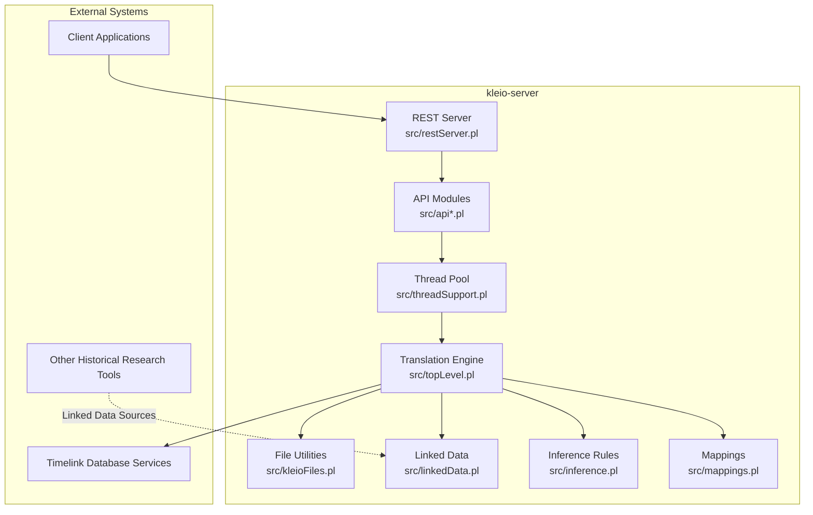
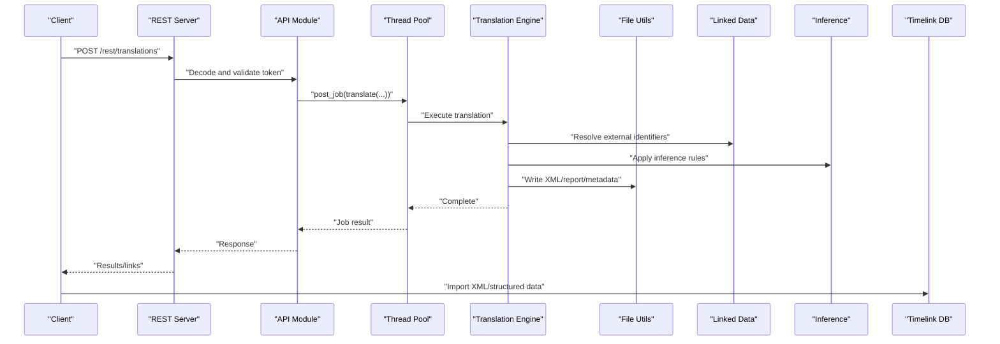
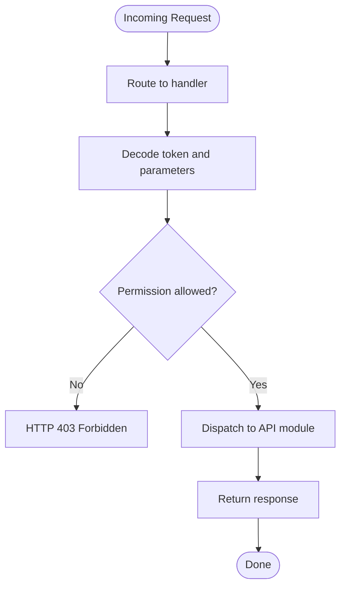
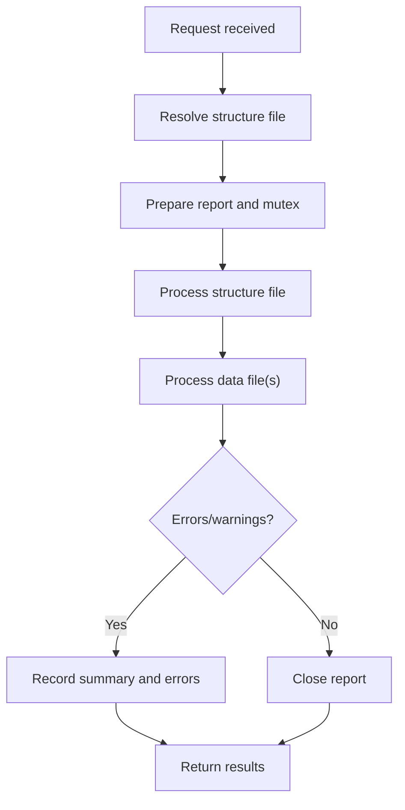
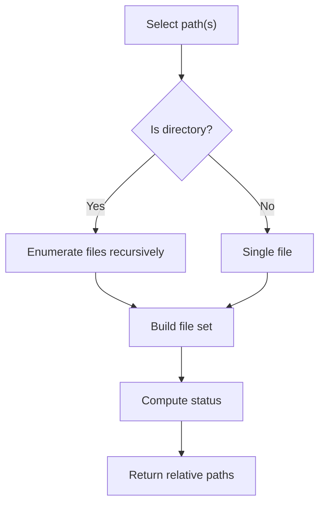
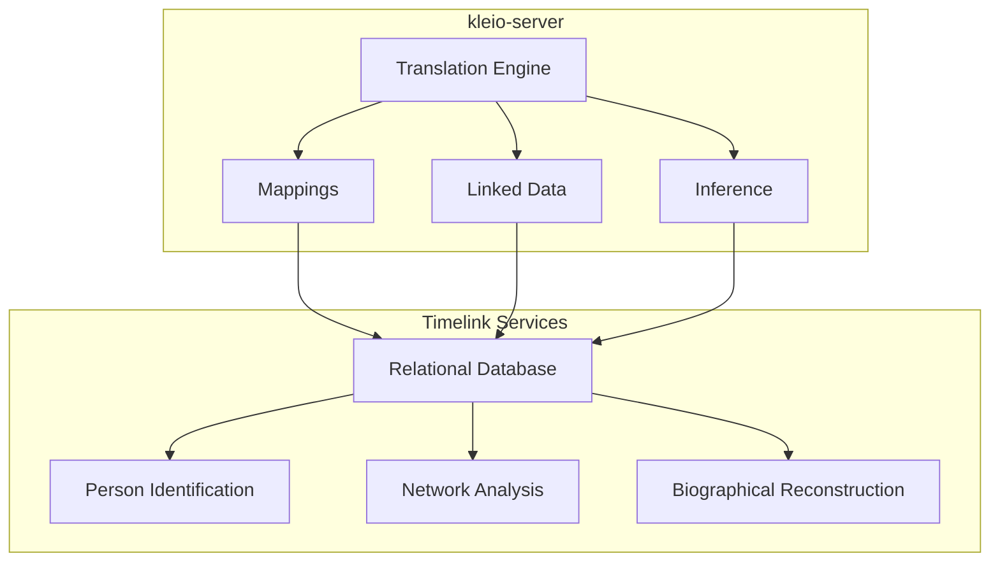
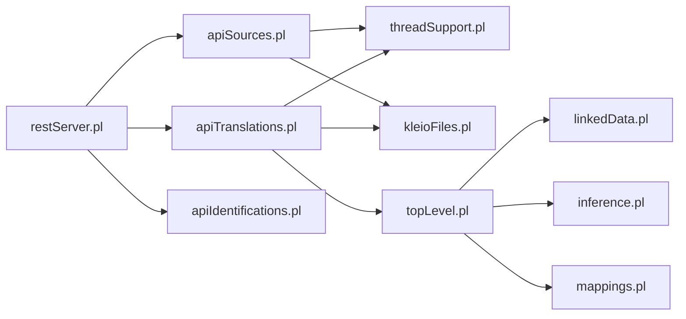

# Ecosystem Integration

<cite>
**Referenced Files in This Document**
- [README.md](file://README.md)
- [AGENTS.md](file://AGENTS.md)
- [restServer.pl](file://src/restServer.pl)
- [apiTranslations.pl](file://src/apiTranslations.pl)
- [apiSources.pl](file://src/apiSources.pl)
- [apiIdentifications.pl](file://src/apiIdentifications.pl)
- [topLevel.pl](file://src/topLevel.pl)
- [kleioFiles.pl](file://src/kleioFiles.pl)
- [threadSupport.pl](file://src/threadSupport.pl)
- [serverStart.pl](file://src/serverStart.pl)
- [linkedData.pl](file://src/linkedData.pl)
- [inference.pl](file://src/inference.pl)
- [mappings.pl](file://src/mappings.pl)
</cite>

## Table of Contents
1. [Introduction](#introduction)
2. [Project Structure](#project-structure)
3. [Core Components](#core-components)
4. [Architecture Overview](#architecture-overview)
5. [Detailed Component Analysis](#detailed-component-analysis)
6. [Dependency Analysis](#dependency-analysis)
7. [Performance Considerations](#performance-considerations)
8. [Troubleshooting Guide](#troubleshooting-guide)
9. [Conclusion](#conclusion)
10. [Appendices](#appendices)

## Introduction
This document explains how the kleio-server integrates into the broader Timelink ecosystem and interacts with related tools and services. It focuses on:
- How translated data flows from Kleio notation into Timelink relational models
- Integration points with Timelink services for person identification, network analysis, and biographical reconstruction
- Agent-like components that operate independently within the system
- Client setup requirements and integration patterns with external applications
- Distributed workflows and data sharing scenarios
- Migration paths from legacy Kleio systems and compatibility considerations

## Project Structure
The kleio-server is implemented in SWI-Prolog and exposes a REST/JSON-RPC API for managing Kleio source files, triggering translations, and retrieving results. The system organizes its runtime behavior around:
- A REST server with CORS support and token-based authentication
- A translation engine that parses Kleio notation and generates XML/structured outputs
- A thread pool for asynchronous processing
- File management utilities for source and structure files
- Linked data and inference engines for enrichment and normalization
- Mapping definitions that align Kleio constructs to Timelink relational models

**Diagram sources**
- [restServer.pl](file://src/restServer.pl#L1-L128)
- [threadSupport.pl](file://src/threadSupport.pl#L1-L153)
- [topLevel.pl](file://src/topLevel.pl#L1-L286)
- [apiTranslations.pl](file://src/apiTranslations.pl#L1-L779)
- [kleioFiles.pl](file://src/kleioFiles.pl#L1-L933)
- [linkedData.pl](file://src/linkedData.pl#L1-L116)
- [inference.pl](file://src/inference.pl#L1-L800)
- [mappings.pl](file://src/mappings.pl#L1-L518)

**Section sources**
- [README.md](file://README.md#L1-L503)
- [restServer.pl](file://src/restServer.pl#L1-L128)

## Core Components
- REST Server: Provides endpoints for translations, sources, files, exports, and Git operations. Supports CORS and JSON-RPC.
- API Modules: Implement specific operations (translations, sources, identifications) and enforce token-based permissions.
- Translation Engine: Parses Kleio structure and data files, applies normalization and inference, and produces XML and metadata.
- Thread Pool: Manages asynchronous translation jobs with queuing and processing tracking.
- File Utilities: Resolve paths, manage file sets, and maintain translation status.
- Linked Data: Resolves external identifiers and maintains caches.
- Inference: Applies rules for geographic entities, dates, and relational inferences.
- Mappings: Define how Kleio constructs map to Timelink relational models.

**Section sources**
- [restServer.pl](file://src/restServer.pl#L1-L128)
- [apiTranslations.pl](file://src/apiTranslations.pl#L1-L779)
- [apiSources.pl](file://src/apiSources.pl#L1-L425)
- [apiIdentifications.pl](file://src/apiIdentifications.pl#L1-L105)
- [topLevel.pl](file://src/topLevel.pl#L1-L286)
- [threadSupport.pl](file://src/threadSupport.pl#L1-L153)
- [kleioFiles.pl](file://src/kleioFiles.pl#L1-L933)
- [linkedData.pl](file://src/linkedData.pl#L1-L116)
- [inference.pl](file://src/inference.pl#L1-L800)
- [mappings.pl](file://src/mappings.pl#L1-L518)

## Architecture Overview
The kleio-server orchestrates a pipeline:
- Clients submit translation requests via REST/JSON-RPC
- API modules validate tokens and permissions
- Jobs are queued and executed asynchronously by worker threads
- The translation engine processes structure and data files, applying inference and linked data resolution
- Results are persisted as XML, reports, and metadata
- Clients can retrieve results and coordinate with Timelink services for downstream processing

**Diagram sources**
- [restServer.pl](file://src/restServer.pl#L491-L515)
- [apiTranslations.pl](file://src/apiTranslations.pl#L52-L82)
- [threadSupport.pl](file://src/threadSupport.pl#L109-L124)
- [topLevel.pl](file://src/topLevel.pl#L139-L160)
- [kleioFiles.pl](file://src/kleioFiles.pl#L111-L144)
- [linkedData.pl](file://src/linkedData.pl#L92-L108)
- [inference.pl](file://src/inference.pl#L1-L800)

## Detailed Component Analysis

### REST Server and API Layer
- Endpoint routing and CORS configuration
- Token decoding and permission checks
- JSON-RPC and REST request handling
- File upload/download and directory operations
- Git operations for synchronization

**Diagram sources**
- [restServer.pl](file://src/restServer.pl#L547-L579)
- [restServer.pl](file://src/restServer.pl#L615-L624)

**Section sources**
- [restServer.pl](file://src/restServer.pl#L107-L128)
- [restServer.pl](file://src/restServer.pl#L491-L515)
- [restServer.pl](file://src/restServer.pl#L547-L579)
- [restServer.pl](file://src/restServer.pl#L615-L624)

### Translation Pipeline
- Structure file processing and caching
- Data file translation with echo/report options
- Synchronization via mutexes to prevent concurrent writes
- Status computation and caching for large result sets

**Diagram sources**
- [apiTranslations.pl](file://src/apiTranslations.pl#L433-L482)
- [apiTranslations.pl](file://src/apiTranslations.pl#L168-L232)
- [topLevel.pl](file://src/topLevel.pl#L102-L130)
- [topLevel.pl](file://src/topLevel.pl#L139-L160)

**Section sources**
- [apiTranslations.pl](file://src/apiTranslations.pl#L34-L82)
- [apiTranslations.pl](file://src/apiTranslations.pl#L168-L232)
- [topLevel.pl](file://src/topLevel.pl#L89-L160)

### File Management and Status Tracking
- Bidirectional path resolution for security
- File set composition (kleio, rpt, err, xml, org, old, ids, files.json)
- Status computation (needs translation, errors, warnings, valid)
- Recursive directory traversal and filtering

**Diagram sources**
- [kleioFiles.pl](file://src/kleioFiles.pl#L53-L92)
- [kleioFiles.pl](file://src/kleioFiles.pl#L146-L185)
- [kleioFiles.pl](file://src/kleioFiles.pl#L257-L285)

**Section sources**
- [kleioFiles.pl](file://src/kleioFiles.pl#L53-L110)
- [kleioFiles.pl](file://src/kleioFiles.pl#L146-L185)
- [kleioFiles.pl](file://src/kleioFiles.pl#L257-L285)

### Agent-like Components
The system includes autonomous components that operate independently:
- Translation Engine: Parses Kleio notation, applies normalization, and generates XML
- File Watcher/Monitor: Monitors source and structure files for changes
- Background Processing Threads: Handle asynchronous translation tasks
- Git Integration Agent: Commits and pulls changes after successful translations
- Linked Data Handler: Resolves external identifiers and updates references
- Inference Engine: Applies rules for geographic entities, dates, and relationships
- API Service Agents: Specialized handlers for translations, sources, directories, and exports

**Section sources**
- [AGENTS.md](file://AGENTS.md#L1-L144)
- [topLevel.pl](file://src/topLevel.pl#L1-L286)
- [linkedData.pl](file://src/linkedData.pl#L1-L116)
- [inference.pl](file://src/inference.pl#L1-L800)
- [restServer.pl](file://src/restServer.pl#L107-L128)

### Integration with Timelink Services
- Person Identification: Identification files are managed via dedicated API endpoints and can be retrieved for downstream processing
- Network Analysis: Translated XML and structured data can be imported into Timelink relational models for relationship extraction
- Biographical Reconstruction: Inference rules enrich person attributes and relationships, supporting biographical summaries
- Linked Data Enrichment: External identifiers resolve to Wikidata and similar sources, improving cross-referencing

**Diagram sources**
- [apiIdentifications.pl](file://src/apiIdentifications.pl#L20-L38)
- [linkedData.pl](file://src/linkedData.pl#L1-L116)
- [inference.pl](file://src/inference.pl#L1-L800)
- [mappings.pl](file://src/mappings.pl#L1-L518)

**Section sources**
- [apiIdentifications.pl](file://src/apiIdentifications.pl#L1-L105)
- [README.md](file://README.md#L40-L46)

### Client Setup and Integration Patterns
- Authentication: Use bearer tokens for API access; admin tokens can be configured via environment variables
- Ports and Workers: Configure server port, worker threads, and idle timeouts
- Docker Deployment: Use Docker Compose with environment variables for customization
- Client Integration: Clients can trigger translations, retrieve results, and coordinate with Timelink services

**Section sources**
- [restServer.pl](file://src/restServer.pl#L186-L226)
- [serverStart.pl](file://src/serverStart.pl#L145-L187)
- [README.md](file://README.md#L68-L146)

### Distributed Workflows and Data Sharing
- Queuing and Parallel Execution: Jobs are queued and executed by worker threads; supports parallel processing for large batches
- Status Caching: Caches translation status for directories to reduce repeated computations
- File Deletion and Cleanup: Removes derived artifacts and original files when requested

**Section sources**
- [threadSupport.pl](file://src/threadSupport.pl#L41-L63)
- [threadSupport.pl](file://src/threadSupport.pl#L109-L124)
- [apiTranslations.pl](file://src/apiTranslations.pl#L168-L232)
- [kleioFiles.pl](file://src/kleioFiles.pl#L111-L144)

### Migration Paths and Compatibility
- Legacy Kleio Systems: The server provides compatibility with Kleio notation subsets used by Timelink
- Structure Files: Supports YAML and STR structure definitions; default structure files are resolved from configuration directories
- Linked Data Notation: Supports external identifier annotations for Wikidata and similar sources
- Versioning and Releases: Semantic versioning and release notes track compatibility changes

**Section sources**
- [README.md](file://README.md#L322-L503)
- [kleioFiles.pl](file://src/kleioFiles.pl#L668-L724)
- [linkedData.pl](file://src/linkedData.pl#L18-L41)

## Dependency Analysis
The system exhibits modular dependencies:
- REST server depends on API modules for request handling
- API modules depend on file utilities and thread support
- Translation engine depends on structure/data parsers, inference, and linked data modules
- Mappings define the schema alignment for relational import

**Diagram sources**
- [restServer.pl](file://src/restServer.pl#L151-L162)
- [apiTranslations.pl](file://src/apiTranslations.pl#L21-L32)
- [apiSources.pl](file://src/apiSources.pl#L19-L26)
- [apiIdentifications.pl](file://src/apiIdentifications.pl#L8-L11)
- [threadSupport.pl](file://src/threadSupport.pl#L1-L25)
- [kleioFiles.pl](file://src/kleioFiles.pl#L1-L38)
- [topLevel.pl](file://src/topLevel.pl#L43-L57)
- [linkedData.pl](file://src/linkedData.pl#L1-L10)
- [inference.pl](file://src/inference.pl#L1-L7)
- [mappings.pl](file://src/mappings.pl#L1-L18)

**Section sources**
- [restServer.pl](file://src/restServer.pl#L151-L162)
- [apiTranslations.pl](file://src/apiTranslations.pl#L21-L32)
- [apiSources.pl](file://src/apiSources.pl#L19-L26)
- [apiIdentifications.pl](file://src/apiIdentifications.pl#L8-L11)
- [threadSupport.pl](file://src/threadSupport.pl#L1-L25)
- [kleioFiles.pl](file://src/kleioFiles.pl#L1-L38)
- [topLevel.pl](file://src/topLevel.pl#L43-L57)
- [linkedData.pl](file://src/linkedData.pl#L1-L10)
- [inference.pl](file://src/inference.pl#L1-L7)
- [mappings.pl](file://src/mappings.pl#L1-L18)

## Performance Considerations
- Worker Threads: Tune the number of workers based on CPU and memory capacity
- Parallel Processing: Use spawn options for distributing translations across workers
- Status Caching: Leverage cached status for directories to reduce repeated scans
- File Operations: Use mutexes to serialize writes to structure and data files
- Logging: Enable appropriate logging levels to avoid overhead in production

## Troubleshooting Guide
- Authentication Failures: Verify bearer tokens and admin token configuration
- Permission Issues: Ensure correct file ownership and permissions when running in containers
- Memory Limitations: Monitor resource usage during large translations and adjust worker counts
- Network Connectivity: Confirm access to external linked data sources
- Status Caching: Invalidate cache when parameters change or files are modified

**Section sources**
- [AGENTS.md](file://AGENTS.md#L121-L134)
- [restServer.pl](file://src/restServer.pl#L270-L292)

## Conclusion
The kleio-server serves as a central integration point for Kleio data within the Timelink ecosystem. Its agent-like components enable autonomous processing, while its REST/JSON-RPC API facilitates seamless integration with external applications and Timelink services. By leveraging inference, linked data, and mappings, the system transforms historical Kleio notation into structured, relational data suitable for person identification, network analysis, and biographical reconstruction. The modular architecture and robust file management support distributed workflows and scalable deployments.

## Appendices
- Client Setup Examples: Use environment variables to configure ports, workers, and admin tokens; deploy via Docker Compose
- API Endpoints: Consult the API documentation and Postman collections for endpoint details and examples
- Migration Notes: Review release notes and compatibility guidelines for legacy systems

**Section sources**
- [README.md](file://README.md#L68-L146)
- [serverStart.pl](file://src/serverStart.pl#L145-L187)