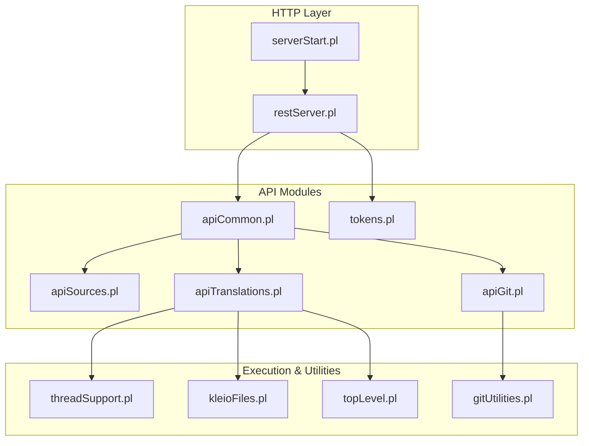
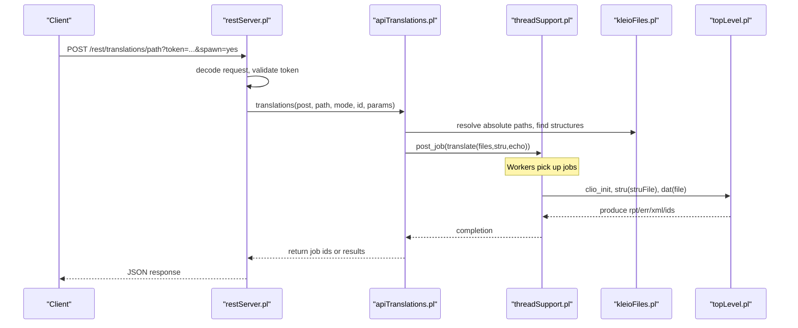
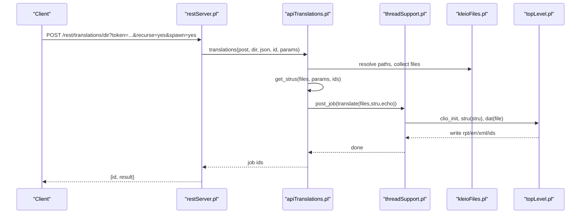
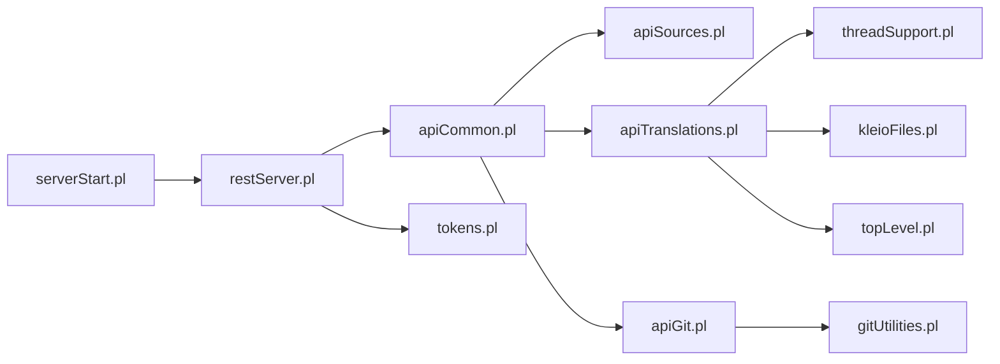

# Features Overview

<cite>
**Referenced Files in This Document**
- [README.md](file://README.md)
- [serverStart.pl](file://src/serverStart.pl)
- [restServer.pl](file://src/restServer.pl)
- [apiCommon.pl](file://src/apiCommon.pl)
- [apiTranslations.pl](file://src/apiTranslations.pl)
- [apiSources.pl](file://src/apiSources.pl)
- [apiGit.pl](file://src/apiGit.pl)
- [threadSupport.pl](file://src/threadSupport.pl)
- [tokens.pl](file://src/tokens.pl)
- [kleioFiles.pl](file://src/kleioFiles.pl)
- [topLevel.pl](file://src/topLevel.pl)
- [gitUtilities.pl](file://src/gitUtilities.pl)
</cite>

## Table of Contents
1. [Introduction](#introduction)
2. [Project Structure](#project-structure)
3. [Core Components](#core-components)
4. [Architecture Overview](#architecture-overview)
5. [Detailed Component Analysis](#detailed-component-analysis)
6. [Dependency Analysis](#dependency-analysis)
7. [Performance Considerations](#performance-considerations)
8. [Troubleshooting Guide](#troubleshooting-guide)
9. [Conclusion](#conclusion)
10. [Appendices](#appendices)

## Introduction
This document provides a comprehensive overview of the Kleio translation services, focusing on major features and capabilities:
- Core translation engine for Kleio notation files
- File management operations (sources, directories, uploads, downloads)
- Authentication system using tokens with API permissions
- Git integration for repository status, pull/push/commit/reset
- Parallel processing via worker threads and job queues
- REST API and JSON-RPC endpoints and service boundaries
- Plugin architecture and extension points
- Performance characteristics, scalability, and monitoring
- Feature comparison matrix and real-world use cases

The server is implemented in SWI-Prolog and exposes both REST and JSON-RPC interfaces to orchestrate translation workflows over historical source documents.

## Project Structure
At a high level, the server consists of:
- A web server layer that handles HTTP requests and dispatches them to API modules
- API modules implementing entities such as sources, translations, structures, exports, reports, versions (Git), tokens, and users
- A parallel execution subsystem managing jobs and workers
- File utilities and configuration resolution
- The core translator top-level predicates invoked by the translation pipeline

**Diagram sources**
- [serverStart.pl:1-120](file://src/serverStart.pl#L1-L120)
- [restServer.pl:300-360](file://src/restServer.pl#L300-L360)
- [apiCommon.pl:1-100](file://src/apiCommon.pl#L1-L100)
- [apiSources.pl:1-60](file://src/apiSources.pl#L1-L60)
- [apiTranslations.pl:1-60](file://src/apiTranslations.pl#L1-L60)
- [apiGit.pl:1-40](file://src/apiGit.pl#L1-L40)
- [threadSupport.pl:1-60](file://src/threadSupport.pl#L1-L60)
- [kleioFiles.pl:1-60](file://src/kleioFiles.pl#L1-L60)
- [topLevel.pl:1-60](file://src/topLevel.pl#L1-L60)
- [gitUtilities.pl:1-40](file://src/gitUtilities.pl#L1-L40)

**Section sources**
- [README.md:50-66](file://README.md#L50-L66)
- [serverStart.pl:1-60](file://src/serverStart.pl#L1-L60)
- [restServer.pl:130-170](file://src/restServer.pl#L130-L170)
- [apiCommon.pl:1-100](file://src/apiCommon.pl#L1-L100)

## Core Components
- REST and JSON-RPC server:
  - Registers handlers for /rest/* and /json/*
  - Decodes requests, validates tokens, and dispatches to entity-specific handlers
  - Supports CORS and multipart uploads
- API modules:
  - sources: list, upload, update, copy, move, delete
  - translations: start translation, get status/results, clean results
  - structures: retrieve structure definitions and resolve per-file structures
  - exports/reports: access generated XML and human-readable reports
  - versions (Git): status, branches, pull, push, commit, reset, user info
  - tokens/users: generate, invalidate tokens; invalidate user tokens
- Execution and concurrency:
  - Worker pool/message queue to execute translation jobs in parallel
  - Job tracking for queued and processing states
- File utilities:
  - Resolve home, conf, sources, structures, logs, token DB paths
  - Manage derived translation artifacts (.rpt, .err, .xml, .ids, etc.)
- Translator core:
  - Top-level predicates to process structure and data files

**Section sources**
- [restServer.pl:300-360](file://src/restServer.pl#L300-L360)
- [apiCommon.pl:22-88](file://src/apiCommon.pl#L22-L88)
- [threadSupport.pl:30-70](file://src/threadSupport.pl#L30-L70)
- [kleioFiles.pl:468-520](file://src/kleioFiles.pl#L468-L520)
- [topLevel.pl:85-135](file://src/topLevel.pl#L85-L135)

## Architecture Overview
The server exposes two primary interfaces:
- REST API at /rest/<entity>/<path>
- JSON-RPC 2.0 at /json/

Requests are authenticated via Bearer tokens and authorized based on token-scoped API permissions. Translation jobs can be executed in parallel across multiple workers.

**Diagram sources**
- [restServer.pl:490-560](file://src/restServer.pl#L490-L560)
- [apiTranslations.pl:53-84](file://src/apiTranslations.pl#L53-L84)
- [threadSupport.pl:104-125](file://src/threadSupport.pl#L104-L125)
- [kleioFiles.pl:468-520](file://src/kleioFiles.pl#L468-L520)
- [topLevel.pl:100-165](file://src/topLevel.pl#L100-L165)

**Section sources**
- [restServer.pl:300-360](file://src/restServer.pl#L300-L360)
- [apiCommon.pl:22-88](file://src/apiCommon.pl#L22-L88)

## Detailed Component Analysis

### REST and JSON-RPC Endpoints
- REST endpoints:
  - /rest/sources, /rest/directories, /rest/structures, /rest/translations, /rest/exports, /rest/reports, /rest/identifications, /rest/versions, /rest/tokens, /rest/users
- JSON-RPC methods:
  - sources_get, sources_upload, sources_update, sources_copy, sources_move, sources_delete
  - directories_get, directories_create, directories_copy, directories_delete
  - structures_get
  - translations_translate, translations_get, translations_delete
  - exports_get, reports_get, identifications_get
  - versions_get_remotes_branches, versions_get_global_status, versions_get_user_info, versions_pull, versions_push, versions_commit, versions_set_user_info, versions_reset
  - tokens_generate, tokens_invalidate, users_invalidate

Authentication and authorization:
- Token-based authentication via Authorization header or JSON-RPC params
- Permissions enforced per token (e.g., translations, files, upload, delete)

CORS support:
- Configurable allowed origins

Multipart file handling:
- Upload/update via multipart/form-data

**Section sources**
- [apiCommon.pl:22-88](file://src/apiCommon.pl#L22-L88)
- [restServer.pl:300-360](file://src/restServer.pl#L300-L360)
- [restServer.pl:490-560](file://src/restServer.pl#L490-L560)
- [restServer.pl:656-740](file://src/restServer.pl#L656-L740)

### Translation Engine
Capabilities:
- Translate Kleio .cli/.kleio files into normalized data and XML
- Generate human-readable reports (.rpt) and error summaries (.err)
- Support structure selection per file or default structure
- Optional echo of source lines in report
- Status inspection and filtering by translation state
- Cleaning translation outputs

Parallel processing:
- spawn=yes distributes work across workers
- spawn=no runs single worker with shared structure context

Structure resolution:
- Priority: inline kleio$ directive, per-file -structure.yaml, matching structures directory, default structure

Status and caching:
- Cached status responses for large sets with configurable max age

**Section sources**
- [apiTranslations.pl:35-84](file://src/apiTranslations.pl#L35-L84)
- [apiTranslations.pl:264-418](file://src/apiTranslations.pl#L264-L418)
- [apiTranslations.pl:434-456](file://src/apiTranslations.pl#L434-L456)
- [apiTranslations.pl:494-577](file://src/apiTranslations.pl#L494-L577)
- [apiTranslations.pl:169-233](file://src/apiTranslations.pl#L169-L233)
- [kleioFiles.pl:53-113](file://src/kleioFiles.pl#L53-L113)
- [topLevel.pl:100-165](file://src/topLevel.pl#L100-L165)

#### Sequence Diagram: Start Translation

**Diagram sources**
- [apiTranslations.pl:53-84](file://src/apiTranslations.pl#L53-L84)
- [threadSupport.pl:104-125](file://src/threadSupport.pl#L104-L125)
- [kleioFiles.pl:468-520](file://src/kleioFiles.pl#L468-L520)
- [topLevel.pl:100-165](file://src/topLevel.pl#L100-L165)

### File Management Operations
- List sources recursively with optional URL links
- Upload new sources (POST multipart)
- Update existing sources (PUT multipart)
- Copy/move sources within the sources tree
- Delete sources and associated translation artifacts
- Directory operations: create, copy, delete

Permissions:
- Requires appropriate token scopes (files, upload, delete)

**Section sources**
- [apiSources.pl:28-178](file://src/apiSources.pl#L28-L178)
- [apiSources.pl:179-200](file://src/apiSources.pl#L179-L200)

### Authentication System
Token lifecycle:
- Generate token with user name and options (API permissions, data/stru dirs, life span)
- Decode token to obtain user and options
- Invalidate token or all tokens for a user
- Admin bootstrap token generation if no tokens exist and environment allows

Security:
- Tokens persist in a database file under KLEIO_CONF_DIR/token_db
- Admin token from environment or file
- Expiration enforcement

**Section sources**
- [tokens.pl:104-176](file://src/tokens.pl#L104-L176)
- [tokens.pl:178-231](file://src/tokens.pl#L178-L231)
- [tokens.pl:249-282](file://src/tokens.pl#L249-L282)
- [restServer.pl:389-422](file://src/restServer.pl#L389-L422)

### Git Integration
Operations:
- Global repository status including ahead/behind counts, logs, diffs
- Fetch remote state
- Pull changes
- Push local commits
- Commit staged/unstaged files
- Reset working directory to a reference
- Set/get user info

Endpoints:
- GET /rest/versions/status/global
- GET /rest/versions/remotes/branches
- GET /rest/versions/user-info
- GET /rest/versions/pull
- PUT /rest/versions/push
- PUT /rest/versions/commit
- PUT /rest/versions/set-user-info
- DELETE /rest/versions/reset

**Section sources**
- [apiGit.pl:23-155](file://src/apiGit.pl#L23-L155)
- [gitUtilities.pl:24-82](file://src/gitUtilities.pl#L24-L82)
- [gitUtilities.pl:148-200](file://src/gitUtilities.pl#L148-L200)

### Parallel Processing Features
Worker modes:
- message queue: workers listen on a named queue
- thread pool: uses SWI thread pool
- debug: executes directly without workers

Job lifecycle:
- post_job enqueues goal with metadata
- Worker picks up job, asserts processing state, executes goal, clears processing state
- Shared counters track total jobs, queued, and processing

**Section sources**
- [threadSupport.pl:30-70](file://src/threadSupport.pl#L30-L70)
- [threadSupport.pl:104-125](file://src/threadSupport.pl#L104-L125)
- [threadSupport.pl:137-149](file://src/threadSupport.pl#L137-L149)

### Service Boundaries and Entities
Entities exposed:
- sources, directories, structures, translations, exports, reports, identifications, versions, tokens, users

Boundaries:
- Each entity module implements method handlers and JSON-RPC entry points
- Common utilities handle output formatting and error responses
- File and token utilities enforce security and path resolution

**Section sources**
- [apiCommon.pl:1-100](file://src/apiCommon.pl#L1-L100)
- [restServer.pl:635-649](file://src/restServer.pl#L635-L649)

### Plugin Architecture and Extension Points
Extension points:
- Add new API endpoints by defining entity handlers and JSON-RPC entry points
- Implement custom structure processors or inference rules
- Extend agent-like components following threading and safety patterns

Guidance:
- Follow existing patterns for token validation, permission checks, and job posting
- Use shared properties and mutexes for safe concurrent access

**Section sources**
- [AGENTS.md:136-144](file://AGENTS.md#L136-L144)
- [apiCommon.pl:1-100](file://src/apiCommon.pl#L1-L100)

## Dependency Analysis
High-level dependencies among key modules:

**Diagram sources**
- [serverStart.pl:1-20](file://src/serverStart.pl#L1-L20)
- [restServer.pl:130-170](file://src/restServer.pl#L130-L170)
- [apiCommon.pl:90-100](file://src/apiCommon.pl#L90-L100)
- [apiTranslations.pl:22-34](file://src/apiTranslations.pl#L22-L34)
- [apiSources.pl:19-27](file://src/apiSources.pl#L19-L27)
- [apiGit.pl:17-22](file://src/apiGit.pl#L17-L22)
- [threadSupport.pl:20-26](file://src/threadSupport.pl#L20-L26)
- [kleioFiles.pl:35-40](file://src/kleioFiles.pl#L35-L40)
- [topLevel.pl:43-58](file://src/topLevel.pl#L43-L58)
- [gitUtilities.pl:23-24](file://src/gitUtilities.pl#L23-L24)

**Section sources**
- [apiCommon.pl:90-100](file://src/apiCommon.pl#L90-L100)
- [restServer.pl:130-170](file://src/restServer.pl#L130-L170)

## Performance Considerations
- Parallelism:
  - Configure number of workers via environment variable
  - Use spawn=yes for distributed translation across workers
  - Prefer spawn=no in multi-user environments to share structure context efficiently
- Caching:
  - Translation status cache reduces repeated expensive computations for large sets
- I/O:
  - Multipart uploads handled via temporary files
  - Report and error parsing cached per file attributes
- Concurrency safety:
  - Mutexes protect critical sections during structure and data processing
- Monitoring:
  - Shared counters for request counts, queued, and processing jobs
  - Home page shows server activity and configuration

[No sources needed since this section provides general guidance]

## Troubleshooting Guide
Common issues and diagnostics:
- Missing or invalid token:
  - Ensure Authorization header includes Bearer token or JSON-RPC params include token
  - Check token expiration and permissions
- Forbidden errors:
  - Verify token has required API permissions (e.g., translations, files, upload, delete)
- Not found:
  - Confirm resolved absolute paths exist and are accessible
- Translation failures:
  - Inspect .err and .rpt files for details
  - Validate structure file existence and correctness
- Git operations:
  - Ensure repository initialized and remote configured
  - Review fetch/push/commit outputs and exit statuses

Operational tips:
- Use server idle detection to auto-stop when no jobs remain
- Print server configuration to verify ports, workers, and token DB status

**Section sources**
- [restServer.pl:553-579](file://src/restServer.pl#L553-L579)
- [restServer.pl:389-422](file://src/restServer.pl#L389-L422)
- [apiTranslations.pl:494-577](file://src/apiTranslations.pl#L494-L577)
- [apiGit.pl:23-155](file://src/apiGit.pl#L23-L155)

## Conclusion
Kleio translation services provide a robust, extensible platform for translating historical documents, managing related files, integrating with Git workflows, and orchestrating parallel processing. The dual REST/JSON-RPC interface supports diverse clients, while token-based authorization ensures secure operation. With clear extension points and strong performance controls, the system scales effectively for batch processing and collaborative workflows.

[No sources needed since this section summarizes without analyzing specific files]

## Appendices

### Feature Comparison Matrix
- REST API:
  - Sources: list, upload, update, copy, move, delete
  - Translations: start, get status/results, clean
  - Structures: retrieve and resolve
  - Exports/Reports: access generated artifacts
  - Versions (Git): status, branches, pull, push, commit, reset, user info
  - Tokens/Users: manage tokens and invalidate users
- JSON-RPC:
  - Equivalent methods mapped to REST endpoints
- Parallel Processing:
  - Configurable workers, job queue, status tracking
- Authentication:
  - Token-based with scoped permissions and expiration
- File Management:
  - Full CRUD over sources and directories with recursive operations

[No sources needed since this section aggregates previously analyzed features]

### Real-World Use Cases
- Batch processing of historical documents:
  - Use translations endpoint with recurse=yes and spawn=yes to translate large directories in parallel
  - Monitor status via translations_get and inspect reports/errors
- Collaborative workflows:
  - Integrate Git operations to synchronize changes, review diffs, and coordinate pushes/pulls
  - Use token scoping to restrict team members to specific directories and actions

[No sources needed since this section provides conceptual examples]