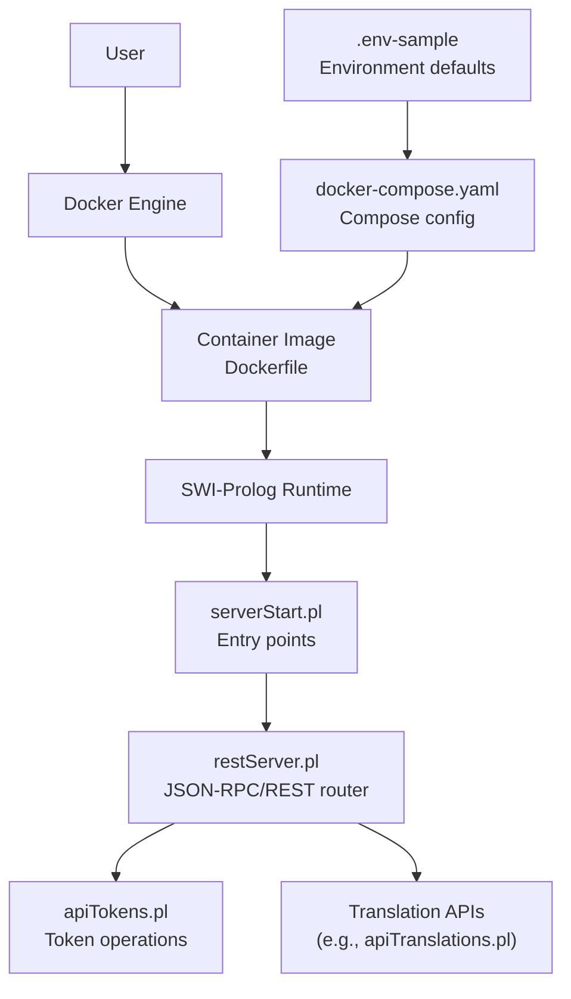
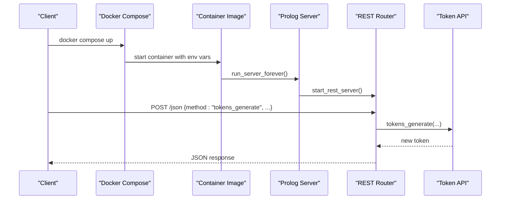
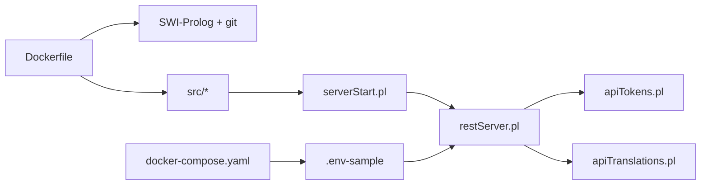

# Getting Started

<cite>
**Referenced Files in This Document**
- [README.md](file://README.md)
- [Dockerfile](file://Dockerfile)
- [docker-compose.yaml](file://docker-compose.yaml)
- [.env-sample](file://.env-sample)
- [Makefile](file://Makefile)
- [src/serverStart.pl](file://src/serverStart.pl)
- [src/restServer.pl](file://src/restServer.pl)
- [src/apiTokens.pl](file://src/apiTokens.pl)
- [docs/doc/client_setup.md](file://docs/doc/client_setup.md)
</cite>

## Table of Contents
1. [Introduction](#introduction)
2. [Project Structure](#project-structure)
3. [Core Components](#core-components)
4. [Architecture Overview](#architecture-overview)
5. [Detailed Component Analysis](#detailed-component-analysis)
6. [Dependency Analysis](#dependency-analysis)
7. [Performance Considerations](#performance-considerations)
8. [Troubleshooting Guide](#troubleshooting-guide)
9. [Conclusion](#conclusion)
10. [Appendices](#appendices)

## Introduction
This guide helps you quickly set up and run the Kleio translation services using Docker, configure essential options, manage admin tokens, and make your first API calls. You will learn how to:
- Run the latest image from Docker Hub
- Build and run locally
- Configure environment variables (KLEIO_HOME, KLEIO_ADMIN_TOKEN, ports)
- Start under current user permissions
- Manage tokens and access basic APIs

## Project Structure
The repository provides everything needed to build a containerized server, configure it via environment variables, and interact with its JSON-RPC/REST API. Key files for getting started include:
- Container runtime configuration and entrypoint
- Compose setup for local development
- Environment variable samples
- Server startup and REST routing
- Token management API

**Diagram sources**
- [Dockerfile:1-22](file://Dockerfile#L1-L22)
- [src/serverStart.pl:1-66](file://src/serverStart.pl#L1-L66)
- [src/restServer.pl:175-184](file://src/restServer.pl#L175-L184)
- [src/apiTokens.pl:1-25](file://src/apiTokens.pl#L1-L25)
- [docker-compose.yaml:1-22](file://docker-compose.yaml#L1-L22)
- [.env-sample:1-119](file://.env-sample#L1-L119)

**Section sources**
- [README.md:68-146](file://README.md#L68-L146)
- [Dockerfile:1-22](file://Dockerfile#L1-L22)
- [docker-compose.yaml:1-22](file://docker-compose.yaml#L1-L22)
- [.env-sample:1-119](file://.env-sample#L1-L119)

## Core Components
- Container image and entrypoint: The image is based on SWI-Prolog, installs git, copies source code, sets logging to stdout, and runs the server forever.
- Compose service: Maps host directories into the container, exposes ports, and injects environment variables.
- Server startup: Provides debug and production modes, reads environment variables for ports, workers, timeouts, CORS, and admin token.
- Token API: Generates, invalidates tokens, and supports user-level invalidation.

Key environment variables:
- KLEIO_HOME_DIR: Root working directory mapped to /kleio-home inside the container.
- KLEIO_SERVER_PORT: Port used by the server inside the container.
- KLEIO_EXTERNAL_PORT: Host port exposed to clients.
- KLEIO_ADMIN_TOKEN: Optional initial admin token; if unset, a bootstrap token may be generated and persisted.
- KLEIO_DEBUG: Enable debug logs.
- KLEIO_SERVER_WORKERS: Number of worker threads.
- KLEIO_IDLE_TIMEOUT: Connection idle timeout.
- KLEIO_CORS_SITES: Allowed sites for CORS.

**Section sources**
- [Dockerfile:1-22](file://Dockerfile#L1-L22)
- [docker-compose.yaml:1-22](file://docker-compose.yaml#L1-L22)
- [src/serverStart.pl:52-66](file://src/serverStart.pl#L52-L66)
- [src/restServer.pl:175-184](file://src/restServer.pl#L175-L184)
- [.env-sample:18-50](file://.env-sample#L18-L50)
- [.env-sample:52-119](file://.env-sample#L52-L119)

## Architecture Overview
High-level flow when running via Docker Compose:
- Compose reads .env and starts the image.
- The container runs the Prolog server, which initializes REST endpoints and loads configuration from environment variables.
- Clients call the JSON-RPC endpoint over HTTP.

**Diagram sources**
- [docker-compose.yaml:1-22](file://docker-compose.yaml#L1-L22)
- [Dockerfile:19-22](file://Dockerfile#L19-L22)
- [src/serverStart.pl:56-66](file://src/serverStart.pl#L56-L66)
- [src/restServer.pl:175-184](file://src/restServer.pl#L175-L184)
- [src/apiTokens.pl:71-88](file://src/apiTokens.pl#L71-L88)

## Detailed Component Analysis

### Quick Setup with Docker
Run the latest image from Docker Hub:
- Map a host directory to /kleio-home and expose port 8088.
- Optionally set an admin token via environment variable.

Build and run locally:
- Build a local image tagged kleio-server.
- Run the container mapping your working directory to /kleio-home.

Change external port:
- Map a different host port to the container’s internal server port.

Run under current user:
- Use -u $(id -u):$(id -g) on Linux to avoid root-owned files.

Useful Make targets:
- kleio-run-latest, kleio-run-current, kleio-stop, gen-token, bootstrap-token.

**Section sources**
- [README.md:68-146](file://README.md#L68-L146)
- [Makefile:165-227](file://Makefile#L165-L227)
- [Makefile:155-163](file://Makefile#L155-L163)

### Configuration Options
Essential environment variables:
- KLEIO_HOME_DIR: Directory containing Kleio data and configuration.
- KLEIO_SERVER_PORT: Internal server port (default 8088).
- KLEIO_EXTERNAL_PORT: Host-facing port (default 8088).
- KLEIO_ADMIN_TOKEN: Initial admin token (optional).
- KLEIO_DEBUG: Set to true for debug logs.
- KLEIO_SERVER_WORKERS: Worker thread count.
- KLEIO_IDLE_TIMEOUT: Idle connection timeout.
- KLEIO_CORS_SITES: CORS allowed sites.

Defaults and behavior:
- If KLEIO_ADMIN_TOKEN is not provided, the server may generate a bootstrap token and persist it for later use.
- Ports and workers are read from environment variables at startup.

**Section sources**
- [.env-sample:18-50](file://.env-sample#L18-L50)
- [.env-sample:52-119](file://.env-sample#L52-L119)
- [src/restServer.pl:175-184](file://src/restServer.pl#L175-L184)
- [README.md:92-112](file://README.md#L92-L112)

### Practical Startup Scenarios
- Set admin token: Provide KLEIO_ADMIN_TOKEN when starting the container.
- Change ports: Adjust KLEIO_EXTERNAL_PORT and/or KLEIO_SERVER_PORT.
- Run under current user: Pass user ID and group ID to the container.
- Use Compose: Copy .env-sample to .env, adjust values, then run via Make or Compose.

**Section sources**
- [README.md:84-123](file://README.md#L84-L123)
- [docker-compose.yaml:1-22](file://docker-compose.yaml#L1-L22)
- [.env-sample:18-50](file://.env-sample#L18-L50)

### Token Management
Overview:
- Generate a token for a user with desired API permissions.
- Invalidate a specific token or all tokens for a user.
- Bootstrap token behavior: When no tokens exist and the server has been running briefly, a temporary bootstrap token can be used to create a permanent admin token.

API methods:
- tokens_generate: Create a new token with associated info (permissions, lifespan).
- tokens_invalidate: Revoke a specific token.
- users_invalidate: Revoke all tokens for a user.

Security notes:
- Ensure tokens are stored securely and rotated regularly.
- Limit API permissions to the minimum required.

**Section sources**
- [src/apiTokens.pl:41-122](file://src/apiTokens.pl#L41-L122)
- [README.md:92-112](file://README.md#L92-L112)

### Basic API Access Examples
Endpoints:
- JSON-RPC base path: /json
- Authentication: Include Authorization header with bearer token.

Common operations:
- List available sources
- Translate a file
- Download translation results
- Manage tokens

For detailed examples and request/response formats, see the client setup documentation and Postman collection.

**Section sources**
- [docs/doc/client_setup.md:1-88](file://docs/doc/client_setup.md#L1-L88)
- [README.md:50-66](file://README.md#L50-L66)

## Dependency Analysis
Runtime dependencies and relationships:
- Docker image depends on SWI-Prolog and git.
- Server startup depends on restServer and utilities modules.
- Token API depends on persistence and logging modules.
- Compose orchestrates environment variables and volume mounts.

**Diagram sources**
- [Dockerfile:1-22](file://Dockerfile#L1-L22)
- [src/serverStart.pl:1-66](file://src/serverStart.pl#L1-L66)
- [src/restServer.pl:175-184](file://src/restServer.pl#L175-L184)
- [src/apiTokens.pl:1-25](file://src/apiTokens.pl#L1-L25)
- [docker-compose.yaml:1-22](file://docker-compose.yaml#L1-L22)
- [.env-sample:1-119](file://.env-sample#L1-L119)

**Section sources**
- [Dockerfile:1-22](file://Dockerfile#L1-L22)
- [src/serverStart.pl:1-66](file://src/serverStart.pl#L1-L66)
- [src/restServer.pl:175-184](file://src/restServer.pl#L175-L184)
- [src/apiTokens.pl:1-25](file://src/apiTokens.pl#L1-L25)
- [docker-compose.yaml:1-22](file://docker-compose.yaml#L1-L22)
- [.env-sample:1-119](file://.env-sample#L1-L119)

## Performance Considerations
- Workers: Increase KLEIO_SERVER_WORKERS for higher concurrency.
- Idle timeout: Tune KLEIO_IDLE_TIMEOUT for large downloads or long-running translations.
- Logging: Disable debug logs in production to reduce overhead.
- Ports: Ensure adequate network throughput and avoid port conflicts.

[No sources needed since this section provides general guidance]

## Troubleshooting Guide
Common issues and resolutions:
- Permission errors on host files: Run the container under the current user or adjust volume ownership.
- Admin token missing: Provide KLEIO_ADMIN_TOKEN or retrieve the bootstrap token from the generated configuration file.
- Port conflicts: Change KLEIO_EXTERNAL_PORT or KLEIO_SERVER_PORT.
- Debugging: Enable KLEIO_DEBUG=true and inspect logs.

Helpful commands:
- Stop server: Use Make target or docker compose stop.
- Show environment: Use Make target to print active KLEIO_* variables.
- Generate token: Use Make target to produce a secure token string.

**Section sources**
- [README.md:113-146](file://README.md#L113-L146)
- [Makefile:205-227](file://Makefile#L205-L227)
- [Makefile:155-163](file://Makefile#L155-L163)

## Conclusion
You now have the essentials to run Kleio translation services with Docker, configure key options, manage tokens, and perform basic API operations. For deeper customization, refer to the environment sample and server startup modules.

[No sources needed since this section summarizes without analyzing specific files]

## Appendices

### Appendix A: Environment Variables Reference
- KLEIO_HOME_DIR: Root working directory mapped to /kleio-home.
- KLEIO_SERVER_PORT: Internal server port.
- KLEIO_EXTERNAL_PORT: Host-facing port.
- KLEIO_ADMIN_TOKEN: Initial admin token.
- KLEIO_DEBUG: Enable debug logs.
- KLEIO_SERVER_WORKERS: Worker threads.
- KLEIO_IDLE_TIMEOUT: Idle timeout seconds.
- KLEIO_CORS_SITES: CORS allowed sites.

**Section sources**
- [.env-sample:18-50](file://.env-sample#L18-L50)
- [.env-sample:52-119](file://.env-sample#L52-L119)

### Appendix B: Client Discovery
Clients can discover server parameters from the .kleio.json file generated at runtime, including URL and admin token location.

**Section sources**
- [docs/doc/client_setup.md:31-88](file://docs/doc/client_setup.md#L31-L88)