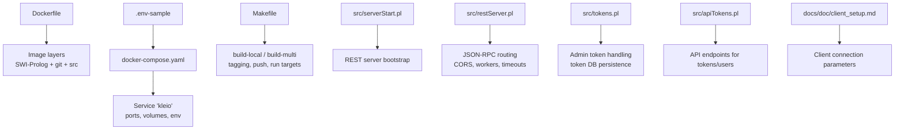
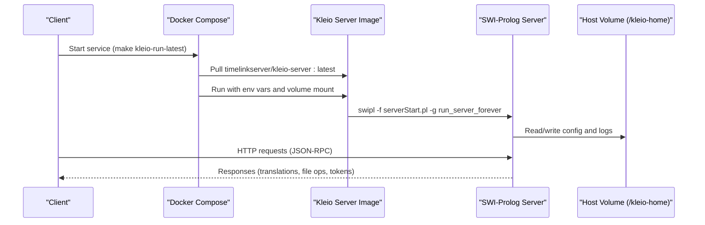
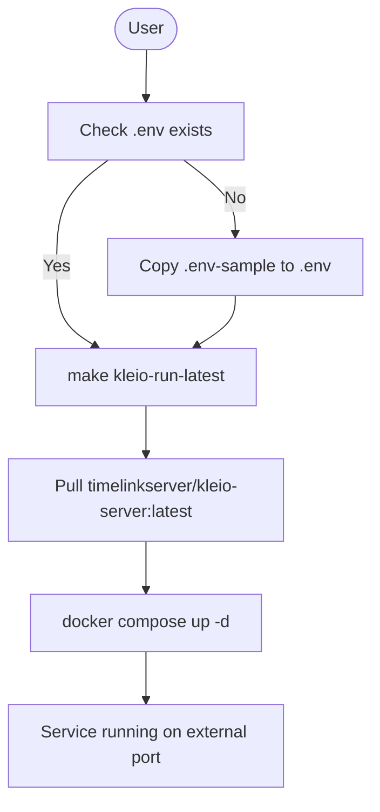
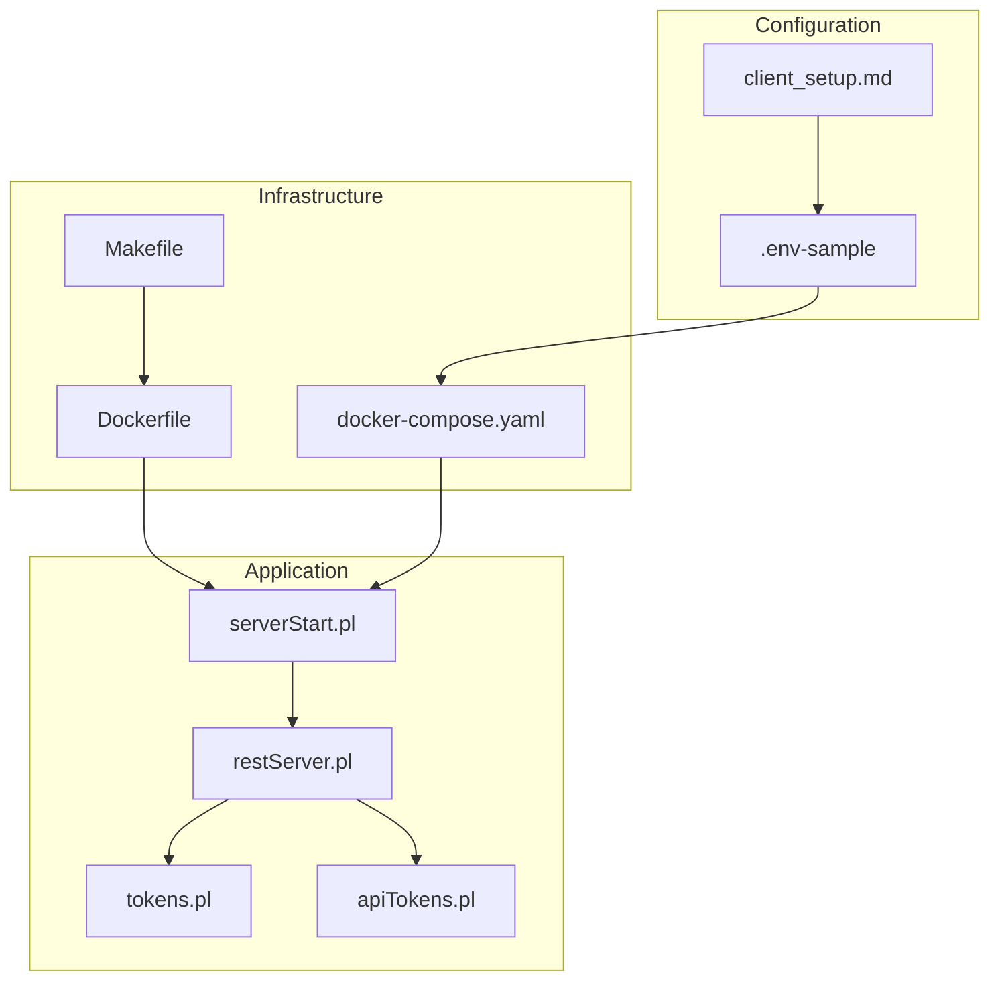

# Installation and Deployment

<cite>
**Referenced Files in This Document**
- [Dockerfile](file://Dockerfile)
- [docker-compose.yaml](file://docker-compose.yaml)
- [Makefile](file://Makefile)
- [.env-sample](file://.env-sample)
- [README.md](file://README.md)
- [README_DEV.md](file://README_DEV.md)
- [devcontainer.json](file://.devcontainer/devcontainer.json)
- [serverStart.pl](file://src/serverStart.pl)
- [restServer.pl](file://src/restServer.pl)
- [tokens.pl](file://src/tokens.pl)
- [apiTokens.pl](file://src/apiTokens.pl)
- [client_setup.md](file://docs/doc/client_setup.md)
</cite>

## Table of Contents
1. [Introduction](#introduction)
2. [Project Structure](#project-structure)
3. [Core Components](#core-components)
4. [Architecture Overview](#architecture-overview)
5. [Detailed Component Analysis](#detailed-component-analysis)
6. [Dependency Analysis](#dependency-analysis)
7. [Performance Considerations](#performance-considerations)
8. [Troubleshooting Guide](#troubleshooting-guide)
9. [Conclusion](#conclusion)
10. [Appendices](#appendices)

## Introduction
This document provides comprehensive installation and deployment guidance for the Kleio translation server, covering:
- Docker-based deployment (running from Docker Hub, building local images, multi-architecture builds)
- Development setup with SWI-Prolog and VSCode integration
- Environment variable configuration and security with admin tokens
- Production deployment considerations
- Troubleshooting common issues (permissions, network, environment)
- Build process, testing procedures, and release management using Make targets
- Container orchestration with docker-compose and scaling considerations

## Project Structure
Key files relevant to installation and deployment:
- Docker image definition and entrypoint
- Compose service configuration
- Makefile automation for build, run, test, and release
- Environment sample file for configuration
- Server startup and REST API modules
- Token management and authentication logic
- Client setup documentation for connecting clients



**Diagram sources**
- [Dockerfile:1-22](file://Dockerfile#L1-L22)
- [docker-compose.yaml:1-22](file://docker-compose.yaml#L1-L22)
- [Makefile:107-147](file://Makefile#L107-L147)
- [serverStart.pl:50-66](file://src/serverStart.pl#L50-L66)
- [restServer.pl:175-185](file://src/restServer.pl#L175-L185)
- [tokens.pl:153-176](file://src/tokens.pl#L153-L176)
- [apiTokens.pl:1-24](file://src/apiTokens.pl#L1-L24)
- [client_setup.md:1-29](file://docs/doc/client_setup.md#L1-L29)

**Section sources**
- [Dockerfile:1-22](file://Dockerfile#L1-L22)
- [docker-compose.yaml:1-22](file://docker-compose.yaml#L1-L22)
- [Makefile:107-147](file://Makefile#L107-L147)
- [serverStart.pl:50-66](file://src/serverStart.pl#L50-L66)
- [restServer.pl:175-185](file://src/restServer.pl#L175-L185)
- [tokens.pl:153-176](file://src/tokens.pl#L153-L176)
- [apiTokens.pl:1-24](file://src/apiTokens.pl#L1-L24)
- [client_setup.md:1-29](file://docs/doc/client_setup.md#L1-L29)

## Core Components
- Docker image: Base SWI-Prolog image, installs git, copies source, sets log output to stdout, runs server forever.
- Compose service: Configures image, user mapping, volume mount, port exposure, environment variables, restart policy.
- Makefile: Provides build, tag, run, stop, test, docs, and release helpers; supports multi-arch builds via buildx.
- Environment variables: Control ports, workers, idle timeout, CORS, admin token, home directory, debug mode.
- Server startup: Supports debug and production modes, reads environment variables for configuration.
- REST server: JSON-RPC endpoint, worker threads, idle timeout, CORS sites, default values.
- Tokens: Admin token resolution from environment or file, token database persistence, API permissions.

**Section sources**
- [Dockerfile:1-22](file://Dockerfile#L1-L22)
- [docker-compose.yaml:1-22](file://docker-compose.yaml#L1-L22)
- [Makefile:107-147](file://Makefile#L107-L147)
- [.env-sample:1-119](file://.env-sample#L1-L119)
- [serverStart.pl:50-66](file://src/serverStart.pl#L50-L66)
- [restServer.pl:175-185](file://src/restServer.pl#L175-L185)
- [tokens.pl:153-176](file://src/tokens.pl#L153-L176)

## Architecture Overview
The system is a containerized REST/JSON-RPC service built on SWI-Prolog. Clients connect over HTTP to perform translations, file operations, and token management. The server persists tokens and configuration under a mapped home directory.



**Diagram sources**
- [Makefile:165-176](file://Makefile#L165-L176)
- [docker-compose.yaml:1-22](file://docker-compose.yaml#L1-L22)
- [Dockerfile:17-22](file://Dockerfile#L17-L22)
- [serverStart.pl:50-66](file://src/serverStart.pl#L50-L66)

## Detailed Component Analysis

### Docker-based Deployment
- Running from Docker Hub: Use the provided image tag and map a host directory to /kleio-home.
- Building local images: Use make targets to prepare and build locally, tagging with version/build numbers.
- Multi-architecture support: Use buildx to build and push linux/arm64 and linux/amd64 images.

Key commands and flows:
- Pull and run latest image with compose
- Build local image and run with current patch tag
- Tag images as latest/stable and push to repository



**Diagram sources**
- [Makefile:165-176](file://Makefile#L165-L176)
- [docker-compose.yaml:1-22](file://docker-compose.yaml#L1-L22)

**Section sources**
- [Dockerfile:1-22](file://Dockerfile#L1-L22)
- [docker-compose.yaml:1-22](file://docker-compose.yaml#L1-L22)
- [Makefile:107-147](file://Makefile#L107-L147)
- [Makefile:165-176](file://Makefile#L165-L176)
- [README.md:68-146](file://README.md#L68-L146)

### Development Setup with SWI-Prolog and VSCode
- Requirements: Install SWI-Prolog locally and use VSCode with VSC-Prolog extension.
- Local debugging: Load serverStart.pl, set environment variables, start debug server.
- DevContainer: Preconfigured container with Docker-in-Docker, Node.js, Python, and VSCode extensions.

Steps:
- Install SWI-Prolog and VSCode extension
- Open serverStart.pl and load it
- Set admin token and start debug server
- Use devcontainer for consistent development environment

**Section sources**
- [README.md:147-212](file://README.md#L147-L212)
- [README_DEV.md:82-111](file://README_DEV.md#L82-L111)
- [devcontainer.json:1-54](file://.devcontainer/devcontainer.json#L1-L54)

### Environment Variable Configuration
Critical environment variables:
- KLEIO_SERVER_IMAGE: Image to run (default stable)
- KLEIO_HOME_DIR: Root working directory mapped to /kleio-home
- KLEIO_SERVER_PORT: Internal server port (default 8088)
- KLEIO_EXTERNAL_PORT: Host port exposed by Docker
- KLEIO_ADMIN_TOKEN: Admin token for full privileges
- KLEIO_DEBUG: Enable debug logging
- KLEIO_CORS_SITES: Allowed CORS sites
- KLEIO_SERVER_WORKERS: Number of parallel workers
- KLEIO_IDLE_TIMEOUT: Connection keep-alive time

Configuration flow:
- Copy .env-sample to .env and modify settings
- Use make targets that source .env automatically
- Compose reads .env to configure service

**Section sources**
- [.env-sample:1-119](file://.env-sample#L1-L119)
- [Makefile:165-176](file://Makefile#L165-L176)
- [docker-compose.yaml:16-21](file://docker-compose.yaml#L16-L21)

### Security Setup with Admin Tokens
Token management:
- Admin token can be set via KLEIO_ADMIN_TOKEN environment variable
- If not set, server generates a bootstrap token written to a file
- Token database persists user tokens and permissions
- API endpoints allow generating and invalidating tokens

Security considerations:
- Always set KLEIO_ADMIN_TOKEN in production
- Restrict CORS sites appropriately
- Use proper file permissions for mounted directories
- Consider network isolation and reverse proxy for HTTPS

**Section sources**
- [tokens.pl:153-176](file://src/tokens.pl#L153-L176)
- [apiTokens.pl:1-24](file://src/apiTokens.pl#L1-L24)
- [client_setup.md:31-61](file://docs/doc/client_setup.md#L31-L61)

### Production Deployment Considerations
- Use specific image tags instead of latest for stability
- Configure appropriate number of workers based on CPU resources
- Set reasonable idle timeout for large file transfers
- Mount persistent storage for /kleio-home with proper permissions
- Use reverse proxy (nginx, caddy) for HTTPS termination
- Monitor logs and implement log rotation
- Implement health checks and auto-restart policies

**Section sources**
- [restServer.pl:175-185](file://src/restServer.pl#L175-L185)
- [docker-compose.yaml:1-22](file://docker-compose.yaml#L1-L22)

### Build Process and Release Management
Build workflow:
- Prepare build artifacts with version substitution
- Build local image with semantic versioning
- Create multi-architecture images using buildx
- Tag images as latest/stable for distribution
- Push to Docker Hub repository

Release process:
- Increment version numbers
- Build and test multi-platform images
- Tag and push to repository
- Update release notes and commit changes

**Section sources**
- [Makefile:56-80](file://Makefile#L56-L80)
- [Makefile:107-147](file://Makefile#L107-L147)
- [README.md:305-324](file://README.md#L305-L324)

### Testing Procedures
Two types of tests:
- Semantic tests: Compare translation outputs against reference results
- API tests: Validate REST endpoints functionality

Test execution:
- Run semantic tests with make target
- Run API tests requiring newman CLI tool
- Use development scripts for individual test steps

**Section sources**
- [Makefile:256-271](file://Makefile#L256-L271)
- [README.md:274-282](file://README.md#L274-L282)

### Container Orchestration with Docker Compose
Compose configuration:
- Single service 'kleio' with configurable image
- User mapping to avoid permission issues
- Volume mounting for persistent data
- Port exposure and environment variable injection
- Automatic restart policy

Scaling considerations:
- Horizontal scaling requires stateless design
- Shared storage for /kleio-home across instances
- Load balancer in front of multiple containers
- Database sharding for token persistence if needed

**Section sources**
- [docker-compose.yaml:1-22](file://docker-compose.yaml#L1-L22)

## Dependency Analysis
The system has clear separation between infrastructure (Docker, Compose), application logic (Prolog modules), and configuration management.



**Diagram sources**
- [Dockerfile:1-22](file://Dockerfile#L1-L22)
- [docker-compose.yaml:1-22](file://docker-compose.yaml#L1-L22)
- [Makefile:107-147](file://Makefile#L107-L147)
- [serverStart.pl:50-66](file://src/serverStart.pl#L50-L66)
- [restServer.pl:175-185](file://src/restServer.pl#L175-L185)
- [tokens.pl:153-176](file://src/tokens.pl#L153-L176)
- [apiTokens.pl:1-24](file://src/apiTokens.pl#L1-L24)
- [.env-sample:1-119](file://.env-sample#L1-L119)
- [client_setup.md:1-29](file://docs/doc/client_setup.md#L1-L29)

**Section sources**
- [Dockerfile:1-22](file://Dockerfile#L1-L22)
- [docker-compose.yaml:1-22](file://docker-compose.yaml#L1-L22)
- [Makefile:107-147](file://Makefile#L107-L147)
- [serverStart.pl:50-66](file://src/serverStart.pl#L50-L66)
- [restServer.pl:175-185](file://src/restServer.pl#L175-L185)
- [tokens.pl:153-176](file://src/tokens.pl#L153-L176)
- [apiTokens.pl:1-24](file://src/apiTokens.pl#L1-L24)
- [.env-sample:1-119](file://.env-sample#L1-L119)
- [client_setup.md:1-29](file://docs/doc/client_setup.md#L1-L29)

## Performance Considerations
- Worker threads: Configure KLEIO_SERVER_WORKERS based on available CPU cores
- Idle timeout: Adjust KLEIO_IDLE_TIMEOUT for large file operations
- Memory usage: Monitor Prolog heap size and adjust accordingly
- Storage I/O: Use fast storage for /kleio-home to improve translation performance
- Network optimization: Enable connection pooling and compression at reverse proxy level

## Troubleshooting Guide

### Common Installation Issues
- Missing .env file: Ensure .env-sample is copied to .env before running
- Permission errors: Set KLEIO_USER in compose or run with correct user ID
- Port conflicts: Change KLEIO_EXTERNAL_PORT if default port is in use
- Network connectivity: Verify host.docker.internal works in your environment

### Permission Problems
- Linux systems: Use user mapping to avoid root-owned files
- Volume mounts: Ensure proper read/write permissions for /kleio-home
- File ownership: Match container user with host user IDs

### Network Configuration
- CORS issues: Configure KLEIO_CORS_SITES appropriately
- Reverse proxy: Ensure proper header forwarding and SSL termination
- Firewall rules: Allow traffic on configured external port

### Debugging Steps
- Enable debug logging with KLEIO_DEBUG=true
- Check server logs in mounted directory
- Use docker logs command for container output
- Test API endpoints directly with curl or Postman

**Section sources**
- [Makefile:101-103](file://Makefile#L101-L103)
- [docker-compose.yaml:7-10](file://docker-compose.yaml#L7-L10)
- [.env-sample:42-50](file://.env-sample#L42-L50)
- [restServer.pl:183-184](file://src/restServer.pl#L183-L184)

## Conclusion
The Kleio translation server provides a robust, containerized solution for historical document processing. With comprehensive Docker support, flexible configuration options, and strong security features, it can be deployed effectively in both development and production environments. The extensive Makefile automation simplifies build, testing, and release processes, while the modular architecture allows for easy customization and scaling.

## Appendices

### Quick Start Commands
```bash
# Copy environment configuration
cp .env-sample .env

# Build and run latest image
make kleio-run-latest

# Build local image and run
make build-local
make kleio-run-current

# Stop server
make kleio-stop
```

### Key Environment Variables Reference
- KLEIO_SERVER_IMAGE: Docker image to use
- KLEIO_HOME_DIR: Persistent data directory
- KLEIO_ADMIN_TOKEN: Administrative access token
- KLEIO_SERVER_PORT: Internal service port
- KLEIO_EXTERNAL_PORT: Host-facing port
- KLEIO_DEBUG: Enable debug logging
- KLEIO_CORS_SITES: Cross-origin resource sharing configuration

**Section sources**
- [Makefile:165-227](file://Makefile#L165-L227)
- [.env-sample:1-119](file://.env-sample#L1-L119)