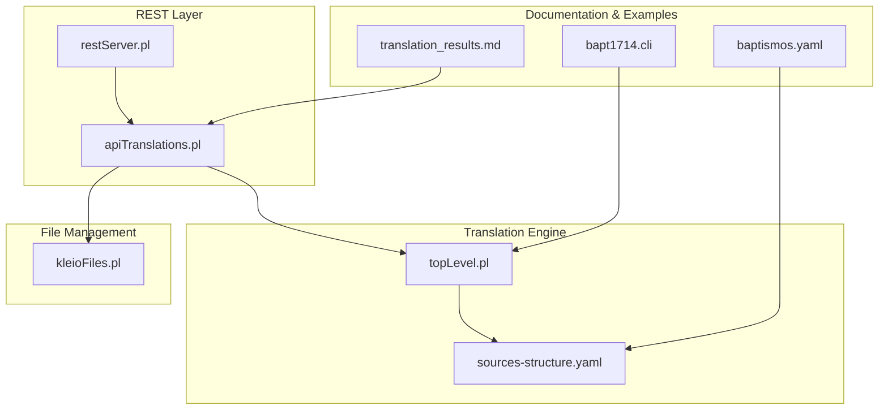
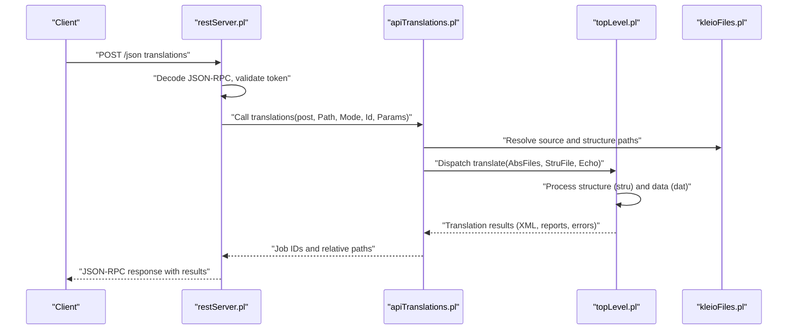
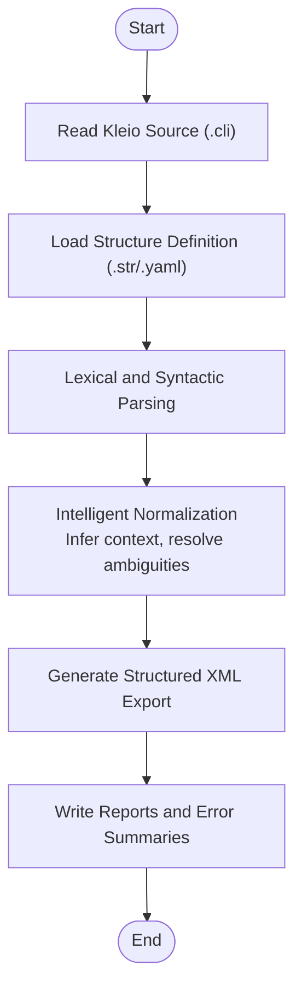
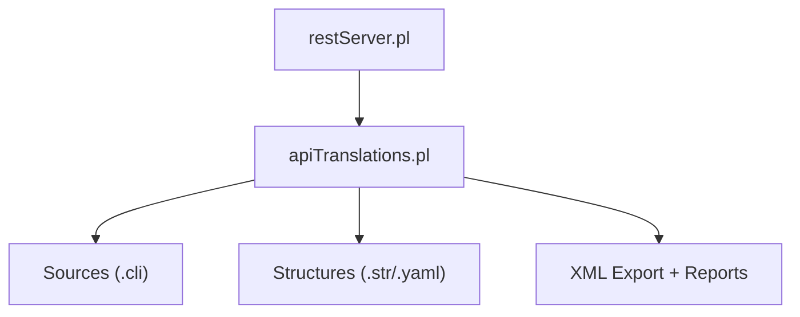
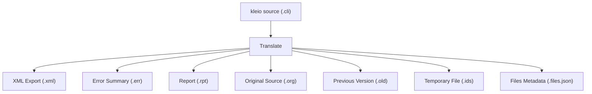
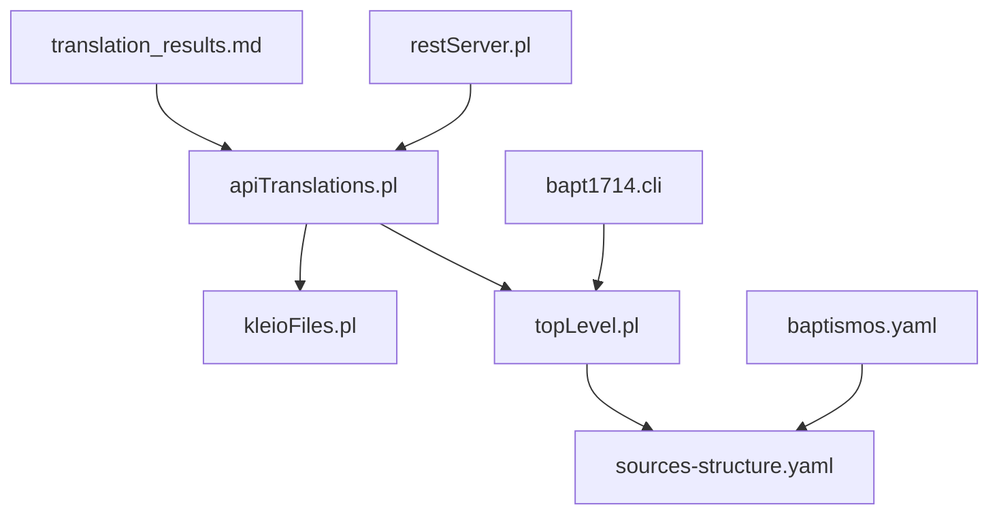

# Introduction and Purpose

<cite>
**Referenced Files in This Document**
- [README.md](file://README.md)
- [topLevel.pl](file://src/topLevel.pl)
- [restServer.pl](file://src/restServer.pl)
- [apiTranslations.pl](file://src/apiTranslations.pl)
- [kleioFiles.pl](file://src/kleioFiles.pl)
- [translation_results.md](file://docs/doc/translation_results.md)
- [sources-structure.yaml](file://src/stru/sources-structure.yaml)
- [baptismos.yaml](file://tests/kleio-home/structures/baptismos.yaml)
- [bapt1714.cli](file://tests/kleio-home/sources/reference_sources/paroquiais/baptismos/bapt1714.cli)
</cite>

## Table of Contents
1. [Introduction](#introduction)
2. [Project Structure](#project-structure)
3. [Core Components](#core-components)
4. [Architecture Overview](#architecture-overview)
5. [Detailed Component Analysis](#detailed-component-analysis)
6. [Dependency Analysis](#dependency-analysis)
7. [Performance Considerations](#performance-considerations)
8. [Troubleshooting Guide](#troubleshooting-guide)
9. [Conclusion](#conclusion)

## Introduction
Timelink Kleio is a specialized system for transforming historical source documents into structured data for the Timelink database ecosystem. At its core, it provides a REST API service—called the kleio-server—that accepts historical source files encoded in Kleio notation and performs intelligent translation to produce normalized, import-ready data.

Kleio notation, originally developed by Manfred Thaller for the Kleio historical database system, is a compact, text-based notation designed to transcribe complex historical documents. In Timelink’s implementation, this notation is adapted to a subset tailored for person-oriented data modeling, enabling efficient capture of events, actors, places, and relationships from archival sources.

The kleio-server exposes a REST API that:
- Translates Kleio files into structured XML exports suitable for database import
- Inspects translation results for errors and warnings
- Manages source and structure files
- Supports token-based authorization and Git operations for file lifecycle management

The “intelligent” part of the translation lies in the normalization process: the system infers missing contextual information, resolves ambiguities, and reduces the manual effort required to produce normalized datasets. This dramatically lowers the overhead of preparing historical data for downstream applications such as person identification, biography reconstruction, and network inference within Timelink.

Practical value:
- Researchers can upload historical sources in Kleio notation and receive structured XML outputs ready for ingestion into Timelink databases.
- Developers can integrate the kleio-server into larger pipelines to automate transcription and normalization tasks.
- Administrators can manage permissions, monitor translation status, and orchestrate file operations through a simple REST interface.

## Project Structure
The repository organizes code into modules that implement the REST server, translation engine, file management, and supporting utilities. The key areas include:
- REST server and API handlers
- Translation engine and structure processing
- File management utilities
- Documentation and examples

**Diagram sources**
- [restServer.pl](file://src/restServer.pl#L1-L120)
- [apiTranslations.pl](file://src/apiTranslations.pl#L1-L120)
- [topLevel.pl](file://src/topLevel.pl#L1-L120)
- [kleioFiles.pl](file://src/kleioFiles.pl#L1-L120)
- [translation_results.md](file://docs/doc/translation_results.md#L1-L81)
- [sources-structure.yaml](file://src/stru/sources-structure.yaml#L1-L120)
- [baptismos.yaml](file://tests/kleio-home/structures/baptismos.yaml#L1-L42)
- [bapt1714.cli](file://tests/kleio-home/sources/reference_sources/paroquiais/baptismos/bapt1714.cli#L1-L60)

**Section sources**
- [README.md](file://README.md#L1-L120)
- [restServer.pl](file://src/restServer.pl#L1-L120)
- [apiTranslations.pl](file://src/apiTranslations.pl#L1-L120)
- [topLevel.pl](file://src/topLevel.pl#L1-L120)
- [kleioFiles.pl](file://src/kleioFiles.pl#L1-L120)
- [translation_results.md](file://docs/doc/translation_results.md#L1-L81)
- [sources-structure.yaml](file://src/stru/sources-structure.yaml#L1-L120)
- [baptismos.yaml](file://tests/kleio-home/structures/baptismos.yaml#L1-L42)
- [bapt1714.cli](file://tests/kleio-home/sources/reference_sources/paroquiais/baptismos/bapt1714.cli#L1-L60)

## Core Components
- kleio-server REST API: Exposes endpoints for translations, source listing, file management, token-based permissions, and basic Git operations. It decouples source handling from other software components and centralizes access control and file lifecycle management.
- Translation engine: Processes structure files (YAML or classic .str) and data files (.cli) to produce normalized XML exports and auxiliary files (reports, error summaries, etc.). It supports intelligent normalization that reduces manual overhead by inferring context and resolving ambiguities.
- File management utilities: Resolve, list, and clean translation artifacts; map relative paths to absolute locations; and track file attributes and statuses.
- Documentation and examples: Provide practical guidance on translation outputs, structure file formats, and representative historical sources.

**Section sources**
- [README.md](file://README.md#L50-L120)
- [restServer.pl](file://src/restServer.pl#L107-L128)
- [apiTranslations.pl](file://src/apiTranslations.pl#L34-L123)
- [kleioFiles.pl](file://src/kleioFiles.pl#L53-L127)
- [translation_results.md](file://docs/doc/translation_results.md#L1-L81)

## Architecture Overview
The kleio-server orchestrates REST requests, validates tokens, resolves file paths, and dispatches translation jobs. The translation engine consumes structure definitions and historical data to produce structured XML and diagnostic outputs.

**Diagram sources**
- [restServer.pl](file://src/restServer.pl#L43-L100)
- [apiTranslations.pl](file://src/apiTranslations.pl#L52-L123)
- [topLevel.pl](file://src/topLevel.pl#L102-L160)
- [kleioFiles.pl](file://src/kleioFiles.pl#L753-L800)

## Detailed Component Analysis

### Kleio Notation and Intelligent Normalization
Kleio notation encodes historical sources as plain text files with a compact syntax. The system interprets groups, elements, and aspects (core/original/comment) to extract structured information. Intelligent normalization reduces manual effort by inferring context and standardizing values.

Representative example:
- A Portuguese baptism record uses group names (e.g., bap) and elements (e.g., celebrante, n) to describe persons, dates, and locations. The system normalizes these into a structured XML export suitable for Timelink.

**Diagram sources**
- [topLevel.pl](file://src/topLevel.pl#L102-L160)
- [baptismos.yaml](file://tests/kleio-home/structures/baptismos.yaml#L22-L42)
- [bapt1714.cli](file://tests/kleio-home/sources/reference_sources/paroquiais/baptismos/bapt1714.cli#L1-L60)

**Section sources**
- [README.md](file://README.md#L5-L47)
- [translation_results.md](file://docs/doc/translation_results.md#L1-L81)
- [baptismos.yaml](file://tests/kleio-home/structures/baptismos.yaml#L1-L42)
- [bapt1714.cli](file://tests/kleio-home/sources/reference_sources/paroquiais/baptismos/bapt1714.cli#L1-L60)

### REST API and Translation Services
The kleio-server provides a REST API for:
- Translating kleio files
- Listing available sources
- Managing files and directories
- Token-based authorization
- Basic Git operations

Key endpoints and capabilities are documented in the repository and exposed by the REST server.

**Diagram sources**
- [restServer.pl](file://src/restServer.pl#L304-L306)
- [apiTranslations.pl](file://src/apiTranslations.pl#L52-L123)

**Section sources**
- [README.md](file://README.md#L50-L120)
- [restServer.pl](file://src/restServer.pl#L304-L306)
- [apiTranslations.pl](file://src/apiTranslations.pl#L34-L123)

### Translation Outputs and File Lifecycle
After translation, the system produces multiple files with standardized extensions. These include the XML export, error summaries, human-readable reports, and auxiliary files that track the translation process and metadata.

**Diagram sources**
- [translation_results.md](file://docs/doc/translation_results.md#L21-L81)

**Section sources**
- [translation_results.md](file://docs/doc/translation_results.md#L1-L81)

## Dependency Analysis
The kleio-server integrates several modules:
- REST server handles HTTP requests and JSON-RPC
- API translation module coordinates file resolution, structure selection, and job distribution
- Translation engine processes structure and data files
- File management utilities resolve paths and track file attributes
- Documentation and examples guide usage and demonstrate outputs

**Diagram sources**
- [restServer.pl](file://src/restServer.pl#L1-L120)
- [apiTranslations.pl](file://src/apiTranslations.pl#L1-L120)
- [topLevel.pl](file://src/topLevel.pl#L1-L120)
- [kleioFiles.pl](file://src/kleioFiles.pl#L1-L120)
- [translation_results.md](file://docs/doc/translation_results.md#L1-L81)
- [sources-structure.yaml](file://src/stru/sources-structure.yaml#L1-L120)
- [baptismos.yaml](file://tests/kleio-home/structures/baptismos.yaml#L1-L42)
- [bapt1714.cli](file://tests/kleio-home/sources/reference_sources/paroquiais/baptismos/bapt1714.cli#L1-L60)

**Section sources**
- [restServer.pl](file://src/restServer.pl#L1-L120)
- [apiTranslations.pl](file://src/apiTranslations.pl#L1-L120)
- [topLevel.pl](file://src/topLevel.pl#L1-L120)
- [kleioFiles.pl](file://src/kleioFiles.pl#L1-L120)
- [translation_results.md](file://docs/doc/translation_results.md#L1-L81)
- [sources-structure.yaml](file://src/stru/sources-structure.yaml#L1-L120)
- [baptismos.yaml](file://tests/kleio-home/structures/baptismos.yaml#L1-L42)
- [bapt1714.cli](file://tests/kleio-home/sources/reference_sources/paroquiais/baptismos/bapt1714.cli#L1-L60)

## Performance Considerations
- Parallel translation: The translation API supports distributing workloads across multiple workers to improve throughput for large batches of files.
- Caching: Status caches reduce repeated computation when listing translation results for directories.
- Worker threads: The REST server can be configured with a specified number of worker threads to balance responsiveness and resource usage.

[No sources needed since this section provides general guidance]

## Troubleshooting Guide
- Translation status inspection: Use the translation API to query file status, errors, and warnings. The system tracks whether files need translation, have errors, warnings, or are valid.
- File cleanup: Remove translation artifacts or entire source files with dedicated APIs to keep environments tidy.
- Token management: Ensure valid tokens are included in requests; bootstrap tokens are generated automatically when no tokens exist, and administrators can manage tokens via the API.

**Section sources**
- [kleioFiles.pl](file://src/kleioFiles.pl#L146-L186)
- [apiTranslations.pl](file://src/apiTranslations.pl#L723-L767)
- [restServer.pl](file://src/restServer.pl#L394-L422)

## Conclusion
Timelink Kleio bridges historical source transcription and database integration by offering a robust REST API service that intelligently transforms Kleio notation into structured XML exports. Its architecture separates concerns between REST handling, translation processing, and file management, while its intelligent normalization reduces manual overhead. For researchers and developers, this enables scalable ingestion of historical data into Timelink ecosystems, supporting advanced analyses such as person identification, biography reconstruction, and network inference.