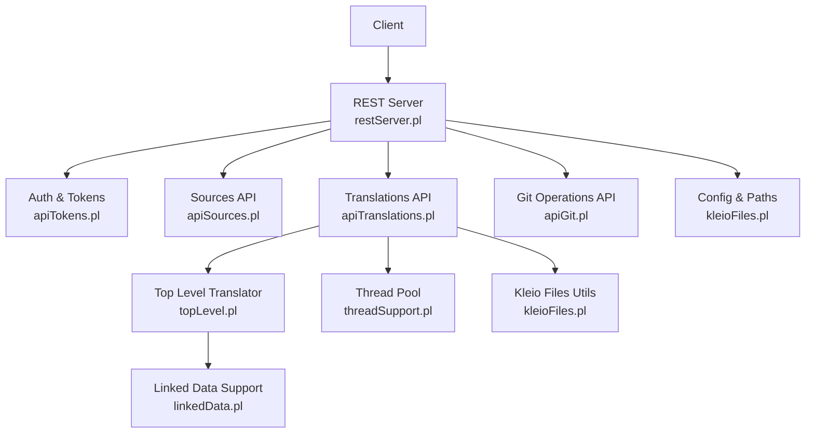
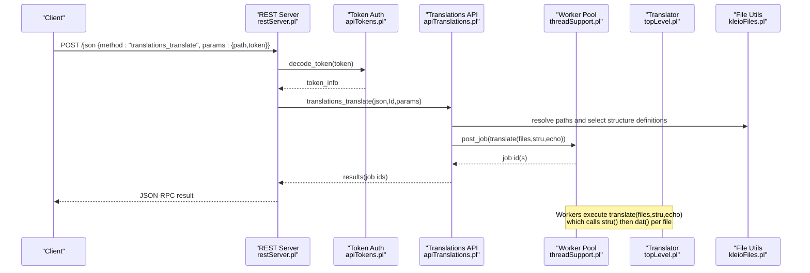
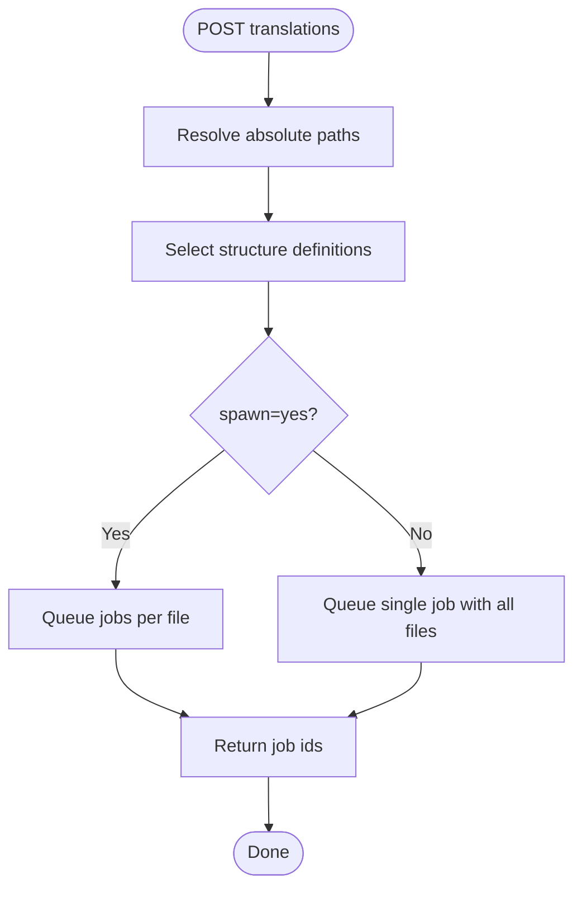
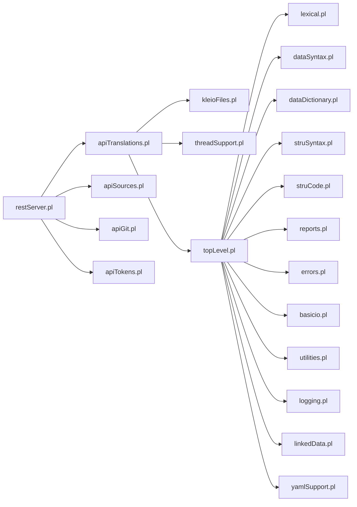

# Project Overview

<cite>
**Referenced Files in This Document**
- [README.md](file://README.md)
- [README_KLEIO_NOTATION.md](file://README_KLEIO_NOTATION.md)
- [serverStart.pl](file://src/serverStart.pl)
- [restServer.pl](file://src/restServer.pl)
- [apiTranslations.pl](file://src/apiTranslations.pl)
- [apiSources.pl](file://src/apiSources.pl)
- [apiTokens.pl](file://src/apiTokens.pl)
- [apiGit.pl](file://src/apiGit.pl)
- [kleioFiles.pl](file://src/kleioFiles.pl)
- [threadSupport.pl](file://src/threadSupport.pl)
- [topLevel.pl](file://src/topLevel.pl)
- [linkedData.pl](file://src/linkedData.pl)
- [linked_data.md](file://docs/doc/linked_data.md)
</cite>

## Table of Contents
1. [Introduction](#introduction)
2. [Project Structure](#project-structure)
3. [Core Components](#core-components)
4. [Architecture Overview](#architecture-overview)
5. [Detailed Component Analysis](#detailed-component-analysis)
6. [Dependency Analysis](#dependency-analysis)
7. [Performance Considerations](#performance-considerations)
8. [Troubleshooting Guide](#troubleshooting-guide)
9. [Conclusion](#conclusion)
10. [Appendices](#appendices)

## Introduction
Kleio translation services provide a REST API server built with SWI-Prolog that translates Kleio files into structured, normalized data for the Timelink database system. The service exposes endpoints to translate historical documents written in Kleio notation, manage structure definitions (schema), perform file operations, authenticate via tokens, integrate with Git repositories, and process translations in parallel using worker threads. It also supports linked data annotations to connect values in Kleio files to external identifiers such as Wikidata.

The project is designed to decouple source handling from downstream components by offering:
- Translation of Kleio files into XML and reports
- Schema management for Kleio structures
- File upload, download, copy, move, and delete operations
- Token-based authentication and authorization
- Basic Git operations (status, fetch, pull, commit, push)
- Parallel processing of translation jobs

This document provides both conceptual overviews for beginners and technical details for experienced developers, using terminology consistent with the codebase such as Kleio files, translation service, structure definitions, and linked data.

## Project Structure
At a high level, the repository contains:
- src/: Core Prolog modules implementing the REST server, APIs, translation pipeline, file utilities, threading, and linked data support
- docs/: Documentation including API documentation and linked data usage notes
- tests/: Test suites, reference sources, and scripts for running semantic and API tests
- syntax/: Grammar and parser references for Kleio notation
- Root configuration and build files for Docker, Make targets, and environment setup

**Diagram sources**
- [restServer.pl:300-350](file://src/restServer.pl#L300-L350)
- [apiTokens.pl:18-40](file://src/apiTokens.pl#L18-L40)
- [apiSources.pl:28-88](file://src/apiSources.pl#L28-L88)
- [apiTranslations.pl:35-84](file://src/apiTranslations.pl#L35-L84)
- [apiGit.pl:23-50](file://src/apiGit.pl#L23-L50)
- [topLevel.pl:100-163](file://src/topLevel.pl#L100-L163)
- [threadSupport.pl:33-60](file://src/threadSupport.pl#L33-L60)
- [kleioFiles.pl:468-506](file://src/kleioFiles.pl#L468-L506)
- [linkedData.pl:11-41](file://src/linkedData.pl#L11-L41)

**Section sources**
- [README.md:1-66](file://README.md#L1-L66)
- [README_KLEIO_NOTATION.md:1-20](file://README_KLEIO_NOTATION.md#L1-L20)

## Core Components
- REST Server: Provides JSON-RPC and REST endpoints, handles CORS, token decoding, request routing, and response formatting.
- Authentication: Token generation, validation, and permission checks for API methods.
- Sources API: Lists, downloads, uploads, copies, moves, and deletes Kleio files and directories.
- Translations API: Starts translation jobs, retrieves translation status, cleans results, and manages parallel execution.
- Git Integration: Exposes Git operations like status, branches, pull, push, commit, reset, and user info.
- File Utilities: Resolves paths, computes file attributes, determines translation status, and manages derived artifacts.
- Threading: Worker pool or message queue to execute translation jobs concurrently.
- Top-Level Translator: Initializes translator, processes structure definitions (.str/.yaml), and parses Kleio data files.
- Linked Data: Declares external link patterns and annotates element values with external IDs to generate URIs.

**Section sources**
- [restServer.pl:130-168](file://src/restServer.pl#L130-L168)
- [apiTokens.pl:18-40](file://src/apiTokens.pl#L18-L40)
- [apiSources.pl:28-88](file://src/apiSources.pl#L28-L88)
- [apiTranslations.pl:35-84](file://src/apiTranslations.pl#L35-L84)
- [apiGit.pl:23-50](file://src/apiGit.pl#L23-L50)
- [kleioFiles.pl:53-113](file://src/kleioFiles.pl#L53-L113)
- [threadSupport.pl:33-60](file://src/threadSupport.pl#L33-L60)
- [topLevel.pl:100-163](file://src/topLevel.pl#L100-L163)
- [linkedData.pl:11-41](file://src/linkedData.pl#L11-L41)

## Architecture Overview
The server starts an HTTP dispatcher and registers handlers for REST and JSON-RPC endpoints. Requests are decoded, authenticated, routed to entity-specific API modules, executed, and responses formatted. Translation jobs can be queued and processed by workers.

**Diagram sources**
- [restServer.pl:656-743](file://src/restServer.pl#L656-L743)
- [apiTokens.pl:71-88](file://src/apiTokens.pl#L71-L88)
- [apiTranslations.pl:146-164](file://src/apiTranslations.pl#L146-L164)
- [threadSupport.pl:104-125](file://src/threadSupport.pl#L104-L125)
- [topLevel.pl:100-163](file://src/topLevel.pl#L100-L163)
- [kleioFiles.pl:468-506](file://src/kleioFiles.pl#L468-L506)

## Detailed Component Analysis

### REST Server and Routing
- Registers handlers for /rest/* and /json/* endpoints.
- Decodes requests, extracts method/entity/object, validates tokens, and dispatches to API modules.
- Supports CORS preflight and content-type negotiation.
- Maintains shared counters and idle detection for auto-stop scenarios.

Key responsibilities:
- Request parsing and error handling
- Authorization token extraction and validation
- Dispatching to entity handlers (sources, translations, git, tokens)
- Response formatting for REST and JSON-RPC

**Section sources**
- [restServer.pl:300-350](file://src/restServer.pl#L300-L350)
- [restServer.pl:469-515](file://src/restServer.pl#L469-L515)
- [restServer.pl:547-580](file://src/restServer.pl#L547-L580)
- [restServer.pl:656-743](file://src/restServer.pl#L656-L743)

### Authentication and Tokens
- Generates tokens with associated permissions (files, translations, upload, etc.).
- Validates tokens on each request; enforces allowed API methods per token.
- Supports bootstrap token creation when no tokens exist and admin token is not set.

Permissions include:
- files, structures, translations, upload, sources, kleioset, generate_token, invalidate_token, invalidate_user, delete, mkdir, rmdir

**Section sources**
- [apiTokens.pl:18-40](file://src/apiTokens.pl#L18-L40)
- [apiTokens.pl:71-88](file://src/apiTokens.pl#L71-L88)
- [restServer.pl:389-422](file://src/restServer.pl#L389-L422)

### Sources API
- GET: List files/directories, return file contents or download links.
- POST/PUT: Upload files (multipart).
- POST with origin: Copy files.
- PUT with origin: Move files.
- DELETE: Delete files or directories recursively.

Path resolution uses token information to restrict access to user-scoped directories.

**Section sources**
- [apiSources.pl:28-88](file://src/apiSources.pl#L28-L88)
- [apiSources.pl:89-177](file://src/apiSources.pl#L89-L177)
- [apiSources.pl:257-286](file://src/apiSources.pl#L257-L286)
- [apiSources.pl:324-425](file://src/apiSources.pl#L324-L425)

### Translations API
- POST: Start translation for one or multiple Kleio files, optionally recursing directories.
- GET: Retrieve translation status for files, with caching for large sets.
- DELETE: Clean translation artifacts (rpt, err, xml, ids, files.json, old).

Features:
- Structure selection priority: explicit parameter, per-file match, default structure.
- Parallel processing via spawn=yes to distribute jobs across workers.
- Status includes URLs for reports and exports.

**Diagram sources**
- [apiTranslations.pl:53-84](file://src/apiTranslations.pl#L53-L84)
- [apiTranslations.pl:242-260](file://src/apiTranslations.pl#L242-L260)

**Section sources**
- [apiTranslations.pl:35-84](file://src/apiTranslations.pl#L35-L84)
- [apiTranslations.pl:87-124](file://src/apiTranslations.pl#L87-L124)
- [apiTranslations.pl:146-164](file://src/apiTranslations.pl#L146-L164)
- [apiTranslations.pl:264-307](file://src/apiTranslations.pl#L264-L307)
- [apiTranslations.pl:309-418](file://src/apiTranslations.pl#L309-L418)
- [apiTranslations.pl:434-456](file://src/apiTranslations.pl#L434-L456)
- [apiTranslations.pl:494-577](file://src/apiTranslations.pl#L494-L577)
- [apiTranslations.pl:724-767](file://src/apiTranslations.pl#L724-L767)

### Git Integration
- GET versions/status/global: Repository status report.
- GET versions/remotes/branches: List remote branches.
- GET versions/user-info: Current Git user name/email.
- PUT versions/push: Push changes.
- PUT versions/commit: Add and commit files.
- PUT versions/set-user-info: Configure Git user.
- DELETE versions/reset: Reset repository state.

All operations require appropriate token permissions and path resolution.

**Section sources**
- [apiGit.pl:23-50](file://src/apiGit.pl#L23-L50)
- [apiGit.pl:51-96](file://src/apiGit.pl#L51-L96)
- [apiGit.pl:97-154](file://src/apiGit.pl#L97-L154)
- [apiGit.pl:156-190](file://src/apiGit.pl#L156-L190)

### File Utilities and Path Resolution
- Computes file attributes and translation status (needs translation, errors, warnings, valid).
- Manages derived artifacts produced by translation.
- Resolves relative paths based on token context to prevent exposing absolute filesystem paths.

Status determination logic:
- Directory vs file
- Needs translation if rpt/err/xml missing or source newer than outputs
- Errors/warnings counts parsed from err file metadata

**Section sources**
- [kleioFiles.pl:53-113](file://src/kleioFiles.pl#L53-L113)
- [kleioFiles.pl:167-206](file://src/kleioFiles.pl#L167-L206)
- [kleioFiles.pl:393-427](file://src/kleioFiles.pl#L393-L427)
- [kleioFiles.pl:440-457](file://src/kleioFiles.pl#L440-L457)

### Threading and Job Execution
- Creates worker pool or message queue depending on mode.
- Posts jobs to queue; workers pick up and execute goals.
- Tracks queued and processing jobs with timestamps and thread info.

Modes:
- message: Uses SWI message queues
- pool: Uses thread pools
- debug: Executes directly without workers

**Section sources**
- [threadSupport.pl:33-60](file://src/threadSupport.pl#L33-L60)
- [threadSupport.pl:64-101](file://src/threadSupport.pl#L64-L101)
- [threadSupport.pl:104-125](file://src/threadSupport.pl#L104-L125)
- [threadSupport.pl:137-149](file://src/threadSupport.pl#L137-L149)

### Top-Level Translator
- clio_init initializes translator settings and error counters.
- stru(F) processes structure definition files (.str or .yaml), generating JSON/YAML representations.
- dat(F) processes Kleio data files, performing lexical analysis, parsing, and compilation into internal database.

Processing flow:
- readlines reads input line-by-line
- get_tokens performs lexical analysis
- processLine routes to compile_data or compile_command

**Section sources**
- [topLevel.pl:85-95](file://src/topLevel.pl#L85-L95)
- [topLevel.pl:100-133](file://src/topLevel.pl#L100-L133)
- [topLevel.pl:142-163](file://src/topLevel.pl#L142-L163)
- [topLevel.pl:272-289](file://src/topLevel.pl#L272-L289)

### Linked Data Support
- Declares external link patterns in kleio$ group using link$ short-name/url-pattern.
- Annotates element values with @short-name:id comments.
- Generates additional attributes with full URIs during translation.

Example annotation:
- ls$jesuita-entrada/Goa, Índia# @wikidata:Q1171/15791200

Produces attribute:
- ls$ jesuita-entrada@/https://www.wikidata.org/wiki/Q1171/15791200/obs=%Goa, Índia

**Section sources**
- [linkedData.pl:11-41](file://src/linkedData.pl#L11-L41)
- [linkedData.pl:51-108](file://src/linkedData.pl#L51-L108)
- [linked_data.md:1-55](file://docs/doc/linked_data.md#L1-L55)

## Dependency Analysis
The system exhibits clear separation between web layer, business logic, and data processing:
- restServer.pl depends on api* modules and utilities
- apiTranslations.pl depends on kleioFiles, threadSupport, topLevel
- apiSources.pl depends on kleioFiles and threadSupport
- apiTokens.pl depends on persistence and logging
- apiGit.pl depends on gitUtilities and kleioFiles
- kleioFiles depends on shellUtil and persistence
- topLevel depends on lexical, dataSyntax, dataDictionary, struSyntax, struCode, reports, errors, basicio, utilities, logging, linkedData, yamlSupport

Potential circular dependencies are avoided through modular design and explicit imports.

**Diagram sources**
- [restServer.pl:151-168](file://src/restServer.pl#L151-L168)
- [apiTranslations.pl:22-33](file://src/apiTranslations.pl#L22-L33)
- [apiSources.pl:19-26](file://src/apiSources.pl#L19-L26)
- [apiGit.pl:17-21](file://src/apiGit.pl#L17-L21)
- [topLevel.pl:43-57](file://src/topLevel.pl#L43-L57)

**Section sources**
- [restServer.pl:151-168](file://src/restServer.pl#L151-L168)
- [apiTranslations.pl:22-33](file://src/apiTranslations.pl#L22-L33)
- [apiSources.pl:19-26](file://src/apiSources.pl#L19-L26)
- [apiGit.pl:17-21](file://src/apiGit.pl#L17-L21)
- [topLevel.pl:43-57](file://src/topLevel.pl#L43-L57)

## Performance Considerations
- Parallel processing: Use spawn=yes to distribute translation jobs across workers for improved throughput.
- Caching: Translation status queries cache results for large file sets to reduce overhead.
- Worker pool sizing: Adjust KLEIO_SERVER_WORKERS based on available CPU cores and workload characteristics.
- Idle timeout: Configure KLEIO_IDLE_TIMEOUT to auto-stop server when idle for testing environments.
- Logging: Enable debug logging selectively to avoid performance impact in production.

[No sources needed since this section provides general guidance]

## Troubleshooting Guide
Common issues and resolutions:
- Token missing or invalid: Ensure Authorization header contains Bearer token; verify token permissions.
- Structure file not found: Check structure parameter or default structure path; ensure file exists in configured locations.
- Permission denied on file operations: Verify token has required permissions (upload, delete, etc.).
- Translation errors: Inspect .err and .rpt files generated alongside Kleio files; use translations_get to retrieve status and URLs.
- Git operations failing: Confirm repository path exists and user has proper Git configuration.

**Section sources**
- [restServer.pl:547-580](file://src/restServer.pl#L547-L580)
- [apiTranslations.pl:264-307](file://src/apiTranslations.pl#L264-L307)
- [apiSources.pl:109-177](file://src/apiSources.pl#L109-L177)
- [kleioFiles.pl:167-206](file://src/kleioFiles.pl#L167-L206)

## Conclusion
The Kleio translation services project delivers a robust REST API for translating historical documents written in Kleio notation into structured data suitable for the Timelink database system. Its architecture separates concerns across web routing, authentication, file management, translation orchestration, and Git integration. With support for parallel processing, linked data annotations, and comprehensive schema management, it provides a flexible foundation for digitizing and analyzing historical records.

[No sources needed since this section summarizes without analyzing specific files]

## Appendices

### Practical Examples

#### Translating a Baptism Record
1. Upload a Kleio file representing a baptism record to the sources directory.
2. Call translations API with path pointing to the file and optional structure parameter.
3. Monitor translation status using translations_get until status indicates completion.
4. Download the translated XML export and review the report for any warnings or errors.

#### Managing Structure Definitions
1. Place structure definition files (.str or .yaml) in the structures directory or specify them explicitly in translation requests.
2. Use sources API to list and manage structure files.
3. Validate structure definitions by checking generated JSON/YAML representations.

#### Using Linked Data Annotations
1. Declare external link patterns in the kleio$ group of your Kleio file.
2. Annotate element values with @short-name:id comments.
3. Translate the file to generate additional attributes containing full URIs.

**Section sources**
- [README.md:14-46](file://README.md#L14-L46)
- [README_KLEIO_NOTATION.md:79-125](file://README_KLEIO_NOTATION.md#L79-L125)
- [linked_data.md:10-55](file://docs/doc/linked_data.md#L10-L55)