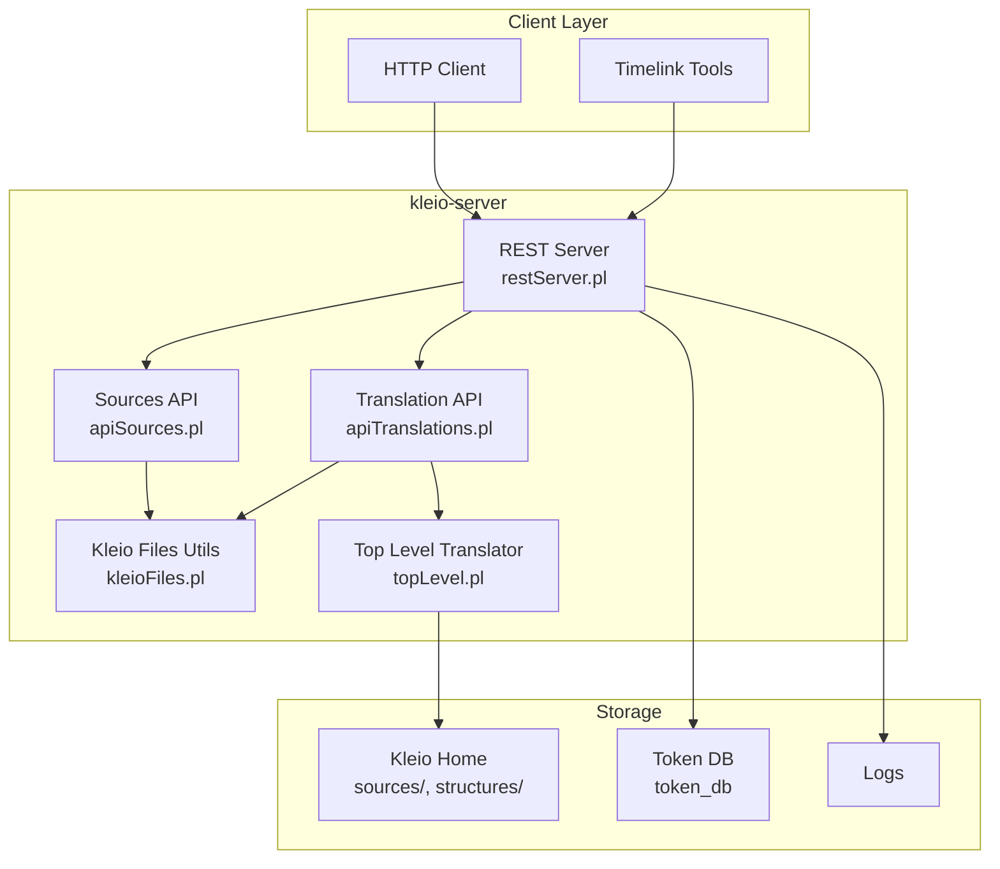
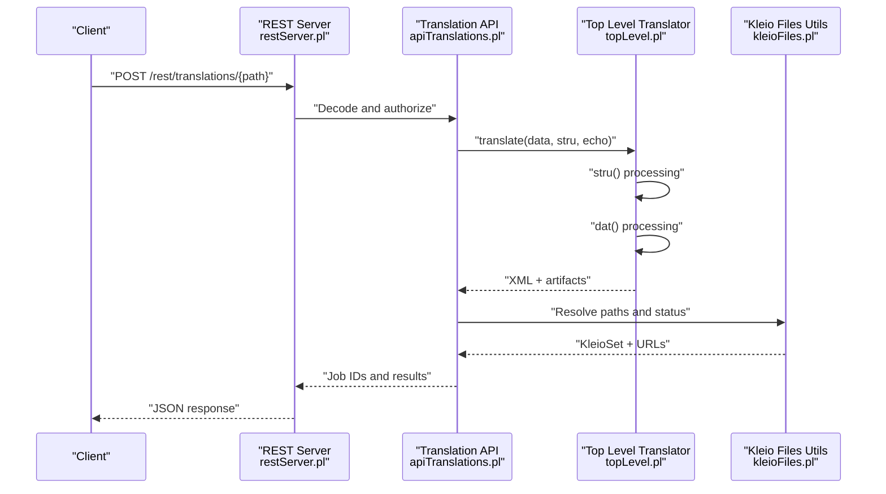
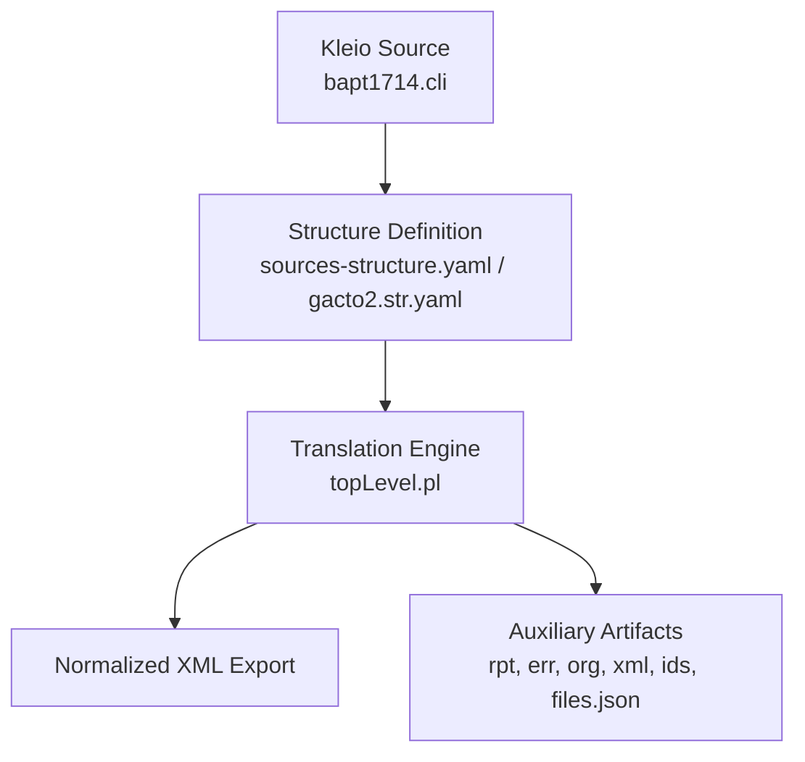
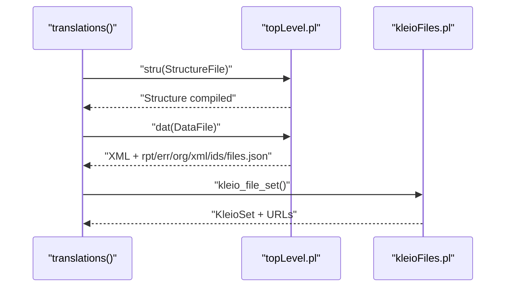
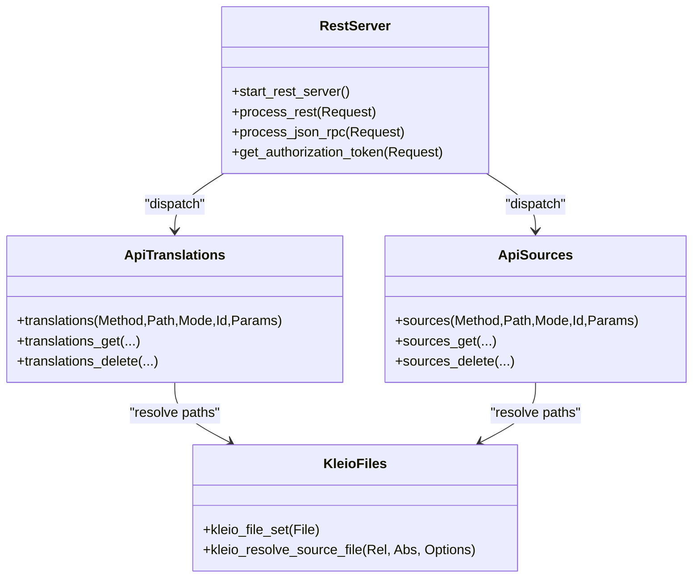
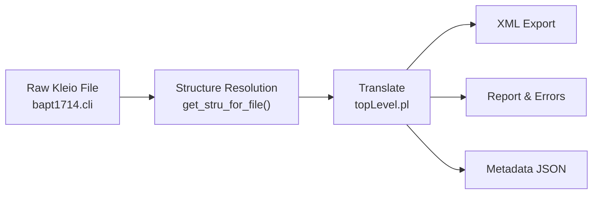
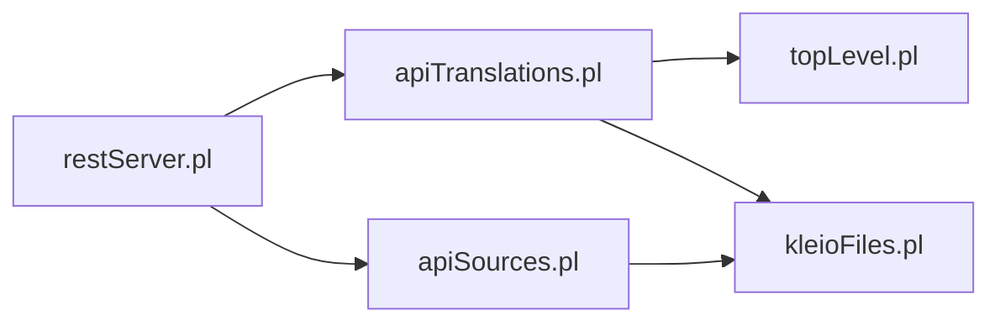

# Project Overview

<cite>
**Referenced Files in This Document**
- [README.md](file://README.md)
- [restServer.pl](file://src/restServer.pl)
- [apiTranslations.pl](file://src/apiTranslations.pl)
- [kleioFiles.pl](file://src/kleioFiles.pl)
- [apiSources.pl](file://src/apiSources.pl)
- [topLevel.pl](file://src/topLevel.pl)
- [serverStart.pl](file://src/serverStart.pl)
- [translation_results.md](file://docs/doc/translation_results.md)
- [client_setup.md](file://docs/doc/client_setup.md)
- [stru/README.md](file://src/stru/README.md)
- [sources-structure.yaml](file://src/stru/sources-structure.yaml)
- [gacto2.str.yaml](file://src/stru/gacto2.str.yaml)
- [bapt1714.cli](file://tests/kleio-home/sources/api/paroquiais/baptismos/bapt1714.cli)
</cite>

## Table of Contents
1. [Introduction](#introduction)
2. [Project Structure](#project-structure)
3. [Core Components](#core-components)
4. [Architecture Overview](#architecture-overview)
5. [Detailed Component Analysis](#detailed-component-analysis)
6. [Dependency Analysis](#dependency-analysis)
7. [Performance Considerations](#performance-considerations)
8. [Troubleshooting Guide](#troubleshooting-guide)
9. [Conclusion](#conclusion)

## Introduction
The Timelink Kleio translation services system provides a REST API service for transforming historical document data expressed in Kleio notation into structured, normalized datasets suitable for the Timelink ecosystem. The kleio-server exposes translation services that intelligently process Kleio files, performing intelligent normalization and contextual inference to reduce manual effort and ensure consistent, import-ready data. The system integrates tightly with the Timelink database model, enabling downstream capabilities such as person identification, biography reconstruction, and network inference.

At its core, the system offers:
- A REST API for translating Kleio files, listing available sources, managing files and directories, and inspecting translation results.
- Intelligent translation that normalizes source information and infers contextual metadata.
- Structured exports (XML) and auxiliary artifacts (reports, error summaries, JSON metadata) for traceability and validation.
- Token-based permission management and optional Git operations for source lifecycle management.

## Project Structure
High-level organization:
- API surface: REST endpoints and JSON-RPC handlers for translation, sources, files, tokens, and reports.
- Translation engine: Prolog-based processing pipeline invoked by the API to parse Kleio notation, apply structure definitions, and generate normalized outputs.
- Configuration and storage: Kleio home directory structure, default structure files, token database, and logs.
- Documentation and examples: API docs, client setup guidance, and representative Kleio files and structure definitions.

**Diagram sources**
- [restServer.pl](file://src/restServer.pl#L300-L350)
- [apiTranslations.pl](file://src/apiTranslations.pl#L34-L83)
- [apiSources.pl](file://src/apiSources.pl#L28-L104)
- [kleioFiles.pl](file://src/kleioFiles.pl#L422-L725)
- [topLevel.pl](file://src/topLevel.pl#L88-L160)

**Section sources**
- [README.md](file://README.md#L1-L66)
- [restServer.pl](file://src/restServer.pl#L107-L128)

## Core Components
- kleio-server REST API: Exposes endpoints for translations, sources, file management, tokens, and reports. It validates tokens, resolves relative paths against the configured Kleio home, and orchestrates translation jobs.
- Translation services: Translate Kleio files using structure definitions (STR/YAML), synchronize processing via mutexes, and produce XML exports plus auxiliary artifacts.
- Sources management: List, upload, copy, move, and delete sources; resolve paths relative to user contexts; and integrate with translation status.
- Kleio files utilities: Manage translation artifacts (XML, reports, error summaries, originals, etc.), compute translation status, and maintain relative path safety.
- Top-level translator: Initializes the translation engine, processes structure and data files, and coordinates compilation and reporting.

Practical outcomes:
- Intelligent normalization reduces manual transcription overhead by standardizing fields and inferring missing context.
- Structured XML exports enable downstream ingestion into Timelink and related systems.
- Comprehensive reporting and metadata support validation and debugging.

**Section sources**
- [README.md](file://README.md#L40-L66)
- [apiTranslations.pl](file://src/apiTranslations.pl#L34-L164)
- [kleioFiles.pl](file://src/kleioFiles.pl#L42-L93)
- [topLevel.pl](file://src/topLevel.pl#L88-L160)

## Architecture Overview
The system’s architecture centers on a REST server that dispatches requests to specialized handlers. Handlers validate permissions, resolve paths, and schedule translation jobs. The translation engine parses Kleio notation against structure definitions and emits normalized XML and auxiliary files.

**Diagram sources**
- [restServer.pl](file://src/restServer.pl#L498-L515)
- [apiTranslations.pl](file://src/apiTranslations.pl#L141-L164)
- [topLevel.pl](file://src/topLevel.pl#L102-L160)
- [kleioFiles.pl](file://src/kleioFiles.pl#L493-L576)

## Detailed Component Analysis

### Kleio Notation and Structure Definitions
Kleio notation is a compact textual syntax for encoding historical sources. The system supports both classic STR and modern YAML structure definitions. Structure files describe element types, semantics, and constraints that guide translation.

Representative structure elements include identifiers, dates, locations, and descriptive fields. The system can auto-generate JSON/YAML representations of structure definitions for tooling and documentation.

**Diagram sources**
- [bapt1714.cli](file://tests/kleio-home/sources/api/paroquiais/baptismos/bapt1714.cli#L1-L50)
- [sources-structure.yaml](file://src/stru/sources-structure.yaml#L1-L200)
- [gacto2.str.yaml](file://src/stru/gacto2.str.yaml#L1-L200)
- [topLevel.pl](file://src/topLevel.pl#L102-L160)

**Section sources**
- [README.md](file://README.md#L14-L46)
- [stru/README.md](file://src/stru/README.md#L1-L4)
- [sources-structure.yaml](file://src/stru/sources-structure.yaml#L1-L200)
- [gacto2.str.yaml](file://src/stru/gacto2.str.yaml#L1-L200)
- [bapt1714.cli](file://tests/kleio-home/sources/api/paroquiais/baptismos/bapt1714.cli#L1-L50)

### Translation Workflow
The translation workflow transforms raw historical notation into structured data:
- Resolve structure file (explicitly provided or inferred from the source).
- Initialize the translator and process the structure definition.
- Process the data file, applying structure semantics and normalization.
- Produce XML export and auxiliary files for validation and auditing.

**Diagram sources**
- [apiTranslations.pl](file://src/apiTranslations.pl#L295-L455)
- [topLevel.pl](file://src/topLevel.pl#L102-L160)
- [kleioFiles.pl](file://src/kleioFiles.pl#L69-L126)

**Section sources**
- [apiTranslations.pl](file://src/apiTranslations.pl#L295-L455)
- [topLevel.pl](file://src/topLevel.pl#L102-L160)
- [kleioFiles.pl](file://src/kleioFiles.pl#L69-L126)

### REST API and Permission Model
The REST server enforces token-based authorization for all operations. It supports:
- Translations: start, list, and delete translation results.
- Sources: list, upload, copy, move, delete, and retrieve source content.
- Tokens: generate, invalidate, and manage permissions.
- Reports and exports: fetch reports and XML exports via generated URLs.

**Diagram sources**
- [restServer.pl](file://src/restServer.pl#L300-L350)
- [apiTranslations.pl](file://src/apiTranslations.pl#L34-L164)
- [apiSources.pl](file://src/apiSources.pl#L28-L104)
- [kleioFiles.pl](file://src/kleioFiles.pl#L753-L800)

**Section sources**
- [restServer.pl](file://src/restServer.pl#L547-L625)
- [apiTranslations.pl](file://src/apiTranslations.pl#L34-L164)
- [apiSources.pl](file://src/apiSources.pl#L28-L104)

### Practical Examples: From Raw Historical Notation to Structured Data
- Input: A Kleio file containing a Portuguese baptism record with persons, roles, and locations.
- Process: The server resolves the appropriate structure (YAML or STR), initializes the translator, and processes the file.
- Output: An XML export suitable for Timelink ingestion, alongside a report and error summary.

**Diagram sources**
- [bapt1714.cli](file://tests/kleio-home/sources/api/paroquiais/baptismos/bapt1714.cli#L1-L50)
- [apiTranslations.pl](file://src/apiTranslations.pl#L314-L417)
- [topLevel.pl](file://src/topLevel.pl#L102-L160)
- [translation_results.md](file://docs/doc/translation_results.md#L1-L81)

**Section sources**
- [bapt1714.cli](file://tests/kleio-home/sources/api/paroquiais/baptismos/bapt1714.cli#L1-L50)
- [translation_results.md](file://docs/doc/translation_results.md#L1-L81)

### System Role in the Timelink Ecosystem
The kleio-server is a foundational component in the Timelink ecosystem:
- It normalizes heterogeneous historical sources into a person-oriented data model.
- It enables downstream services such as identity resolution, biographical reconstruction, and social network inference.
- It integrates with external tools and clients via a documented REST API and JSON-RPC endpoints.

**Section sources**
- [README.md](file://README.md#L40-L46)

## Dependency Analysis
The system exhibits clear separation of concerns:
- REST server depends on translation APIs and file utilities.
- Translation APIs depend on the top-level translator and file utilities.
- File utilities depend on path resolution and environment configuration.

**Diagram sources**
- [restServer.pl](file://src/restServer.pl#L151-L168)
- [apiTranslations.pl](file://src/apiTranslations.pl#L1-L33)
- [apiSources.pl](file://src/apiSources.pl#L1-L27)
- [kleioFiles.pl](file://src/kleioFiles.pl#L1-L40)
- [topLevel.pl](file://src/topLevel.pl#L1-L58)

**Section sources**
- [restServer.pl](file://src/restServer.pl#L151-L168)
- [apiTranslations.pl](file://src/apiTranslations.pl#L1-L33)
- [apiSources.pl](file://src/apiSources.pl#L1-L27)
- [kleioFiles.pl](file://src/kleioFiles.pl#L1-L40)
- [topLevel.pl](file://src/topLevel.pl#L1-L58)

## Performance Considerations
- Parallelization: The translation API supports spawning multiple workers to process files concurrently, improving throughput for large batches.
- Caching: Translation status results are cached to reduce repeated filesystem scans for directory listings.
- Resource limits: The server applies timeouts and worker counts configurable via environment variables.

[No sources needed since this section provides general guidance]

## Troubleshooting Guide
- Translation status: Use the translations GET endpoint to inspect status, errors, and warnings for a file or directory.
- Artifact inspection: Review the generated report and error summary files to diagnose parsing or normalization issues.
- Paths and permissions: Ensure paths are relative to the configured Kleio home and that tokens have appropriate permissions.
- Client setup: Use the generated configuration file to obtain server URL and admin token when connecting from a client.

**Section sources**
- [apiTranslations.pl](file://src/apiTranslations.pl#L86-L123)
- [kleioFiles.pl](file://src/kleioFiles.pl#L146-L186)
- [translation_results.md](file://docs/doc/translation_results.md#L1-L81)
- [client_setup.md](file://docs/doc/client_setup.md#L1-L284)

## Conclusion
The Timelink Kleio translation services system delivers a robust, REST-driven platform for transforming historical documents into normalized, structured data. By combining intelligent normalization, flexible structure definitions, and comprehensive artifact generation, it enables seamless integration with the Timelink ecosystem and supports advanced historical research workflows. The modular architecture, strong permission model, and extensive documentation make it suitable for both beginners and experienced developers.