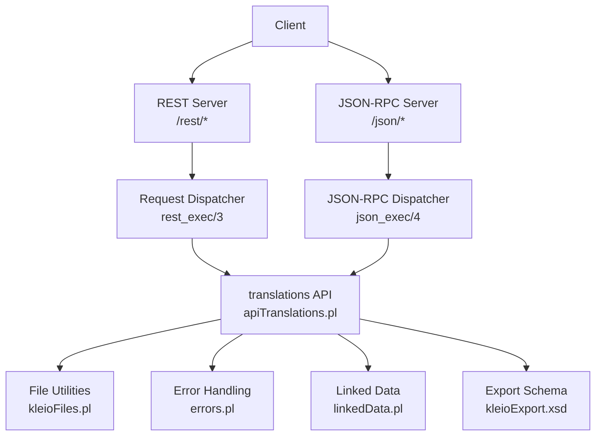
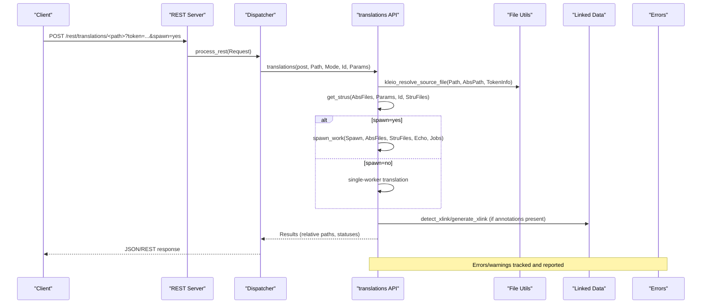
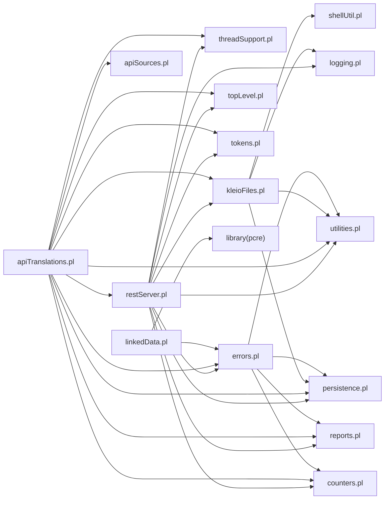

# Reference Materials

<cite>
**Referenced Files in This Document**
- [README.md](file://README.md)
- [.env-sample](file://.env-sample)
- [serverStart.pl](file://src/serverStart.pl)
- [restServer.pl](file://src/restServer.pl)
- [apiTranslations.pl](file://src/apiTranslations.pl)
- [kleioFiles.pl](file://src/kleioFiles.pl)
- [linkedData.pl](file://src/linkedData.pl)
- [errors.pl](file://src/errors.pl)
- [kleioExport.xsd](file://src/kleioExport.xsd)
- [translation_results.md](file://docs/doc/translation_results.md)
- [stru_file_location.md](file://docs/doc/stru_file_location.md)
- [linked_data.md](file://docs/doc/linked_data.md)
- [README_KLEIO_NOTATION.md](file://README_KLEIO_NOTATION.md)
- [api.json](file://api/postman/api.json)
</cite>

## Table of Contents
1. [Introduction](#introduction)
2. [Project Structure](#project-structure)
3. [Core Components](#core-components)
4. [Architecture Overview](#architecture-overview)
5. [Detailed Component Analysis](#detailed-component-analysis)
6. [Dependency Analysis](#dependency-analysis)
7. [Performance Considerations](#performance-considerations)
8. [Troubleshooting Guide](#troubleshooting-guide)
9. [Conclusion](#conclusion)
10. [Appendices](#appendices)

## Introduction
This document provides comprehensive reference materials for the Kleio translation system, including configuration options, environment variables, command-line parameters, API response schemas, error message catalog, file format specifications, glossary, technical specifications for Kleio notation, XSD schema for export formats, linked data integration patterns, location handling, translation result formats, troubleshooting guides, performance considerations, and compatibility notes.

The Kleio server exposes REST and JSON-RPC endpoints to translate Kleio source files (.cli/.kleio), manage sources and structures, handle tokens and users, and produce normalized XML output conforming to an XSD schema. It also supports linked data annotations to connect values to external identifiers (e.g., Wikidata).

## Project Structure
At a high level:
- Server entry points and runtime configuration are implemented in Prolog modules under src/.
- Documentation is provided under docs/doc/.
- Postman API collection and tests are under api/postman/.
- XSD schema for exported XML is at src/kleioExport.xsd.
- Notation specification is at README_KLEIO_NOTATION.md.

**Diagram sources**
- [restServer.pl:300-360](file://src/restServer.pl#L300-L360)
- [apiTranslations.pl:35-84](file://src/apiTranslations.pl#L35-L84)
- [kleioFiles.pl:53-113](file://src/kleioFiles.pl#L53-L113)
- [errors.pl:77-113](file://src/errors.pl#L77-L113)
- [linkedData.pl:51-108](file://src/linkedData.pl#L51-L108)
- [kleioExport.xsd:1-78](file://src/kleioExport.xsd#L1-L78)

**Section sources**
- [README.md:50-66](file://README.md#L50-L66)
- [serverStart.pl:13-26](file://src/serverStart.pl#L13-L26)
- [restServer.pl:107-128](file://src/restServer.pl#L107-L128)

## Core Components
- Server startup and configuration:
  - Entry points for debug and production servers, environment defaults, worker pool setup, CORS, token database initialization, and config persistence.
- REST and JSON-RPC dispatchers:
  - Route /rest/* and /json/* requests, decode commands, enforce authorization via tokens, parse multipart uploads, and call domain handlers.
- Translation API:
  - Start translations, list translation status, delete results; resolve structure files per source; spawn parallel workers; return relative paths safely.
- File utilities:
  - Compute related file sets (.xml, .rpt, .err, .org, .old, .ids, .files.json), determine translation status, clean/delete artifacts.
- Linked data:
  - Declare link$ patterns and annotate values with @short-name:id to generate attributes with resolved URIs.
- Error reporting:
  - Centralized error/warning output with context (file, line numbers, surrounding lines), counters, and max-error abort behavior.
- Export schema:
  - XSD defining the exported XML structure for classes, groups, elements, and attributes.

**Section sources**
- [serverStart.pl:13-26](file://src/serverStart.pl#L13-L26)
- [restServer.pl:175-185](file://src/restServer.pl#L175-L185)
- [restServer.pl:330-349](file://src/restServer.pl#L330-L349)
- [restServer.pl:491-515](file://src/restServer.pl#L491-L515)
- [restServer.pl:656-743](file://src/restServer.pl#L656-L743)
- [apiTranslations.pl:35-84](file://src/apiTranslations.pl#L35-L84)
- [apiTranslations.pl:87-124](file://src/apiTranslations.pl#L87-L124)
- [kleioFiles.pl:53-113](file://src/kleioFiles.pl#L53-L113)
- [kleioFiles.pl:167-200](file://src/kleioFiles.pl#L167-L200)
- [linkedData.pl:51-108](file://src/linkedData.pl#L51-L108)
- [errors.pl:77-113](file://src/errors.pl#L77-L113)
- [kleioExport.xsd:1-78](file://src/kleioExport.xsd#L1-L78)

## Architecture Overview
The server runs on SWI-Prolog with HTTP/JSON support. Clients interact via REST or JSON-RPC. The dispatcher validates tokens, decodes requests, and delegates to module-specific handlers. Translation jobs may be spawned across workers. Results include XML conforming to kleioExport.xsd and auxiliary reports.

**Diagram sources**
- [restServer.pl:491-515](file://src/restServer.pl#L491-L515)
- [apiTranslations.pl:53-84](file://src/apiTranslations.pl#L53-L84)
- [kleioFiles.pl:53-113](file://src/kleioFiles.pl#L53-L113)
- [linkedData.pl:92-108](file://src/linkedData.pl#L92-L108)
- [errors.pl:77-113](file://src/errors.pl#L77-L113)

## Detailed Component Analysis

### Configuration and Environment Variables
Key environment variables (defaults shown where applicable):
- KLEIO_HOME_DIR: Root working directory (default varies by detection logic).
- KLEIO_SOURCE_DIR: Base directory for Kleio sources (default KLEIO_HOME/sources).
- KLEIO_CONF_DIR: Configuration directory (default KLEIO_HOME/system/conf/kleio).
- KLEIO_STRU_DIR: Global structure files directory (default KLEIO_CONF_DIR/stru).
- KLEIO_TOKEN_DB: Token database path (default KLEIO_CONF_DIR/token_db).
- KLEIO_DEFAULT_STRU: Default structure file (default KLEIO_CONF_DIR/stru/gacto2.str).
- KLEIO_SERVER_PORT: REST server port (default 8088).
- KLEIO_DEBUGGER_PORT: Debug server port (default 4000).
- KLEIO_SERVER_WORKERS: Number of worker threads (default 3).
- KLEIO_IDLE_TIMEOUT: Connection timeout seconds (default 900).
- KLEIO_ADMIN_TOKEN: Admin token string (optional).
- KLEIO_CORS_SITES: Allowed CORS sites (default "*").
- KLEIO_DEBUG: Enable debug logging (default false).

These are read by default_value predicates and used during server startup and request processing.

**Section sources**
- [.env-sample:1-119](file://.env-sample#L1-L119)
- [restServer.pl:175-185](file://src/restServer.pl#L175-L185)
- [restServer.pl:107-128](file://src/restServer.pl#L107-L128)

### Command-Line Parameters and Startup Modes
- run_debug_server: Starts both debug and REST servers; prints configuration.
- run_server: Starts REST server only.
- run_from_mhk_home(MH, P): Starts server using MHK home layout and optional port.
- setup_and_run_server(RunCommand, Setup): Applies env/home/source/conf/strus/tokens/dstru/port/workers before running a server predicate.
- stop_server/stop_debug_server: Stops running servers.

**Section sources**
- [serverStart.pl:13-26](file://src/serverStart.pl#L13-L26)
- [serverStart.pl:41-48](file://src/serverStart.pl#L41-L48)
- [serverStart.pl:145-188](file://src/serverStart.pl#L145-L188)
- [serverStart.pl:189-201](file://src/serverStart.pl#L189-L201)

### REST API Endpoints
Base path: /rest/
Authentication: Authorization header Bearer <token> or parameter token in JSON-RPC.

Common entities and operations:
- translations
  - POST translations/<path>: Start translation(s). Options include structure, echo, recurse, spawn, status.
  - GET translations/<path>: List translation status for files/directories.
  - DELETE translations/<path>: Delete translation results.
- sources, structures, files, upload, delete, mkdir, rmdir, kleioset, tokens, users (via JSON-RPC primarily).

Notes:
- Multipart POST supported for uploads.
- JSON output requested via Accept: application/json or json=true.

For full endpoint definitions and examples, see the Postman collection.

**Section sources**
- [restServer.pl:491-515](file://src/restServer.pl#L491-L515)
- [restServer.pl:547-579](file://src/restServer.pl#L547-L579)
- [api.json:1-200](file://api/postman/api.json#L1-L200)

### JSON-RPC API
Base path: /json/
Protocol: JSON-RPC 2.0
Methods include:
- generate_token(params: {user, info, token})
- invalidate_token(params: {token})
- invalidate_user(params: {user, token})
- translations_translate(params: {path, ...})
- translations_get(params: {path, ...})
- translations_delete(params: {path, ...})
- Other methods for sources, structures, files, etc.

Responses follow JSON-RPC 2.0 with id, method, params, result fields.

**Section sources**
- [restServer.pl:656-743](file://src/restServer.pl#L656-L743)
- [api.json:1-200](file://api/postman/api.json#L1-L200)

### Translation API Details
- POST translations/<path>
  - Options:
    - structure: explicit stru file path
    - echo: yes/no to include source lines in rpt
    - recurse: descend into subdirectories
    - status: filter by translation status
    - spawn: distribute work across workers
  - Behavior:
    - Resolves absolute paths based on token permissions.
    - Determines appropriate structure file(s) per source.
    - Optionally spawns parallel workers.
    - Returns relative paths for safety.
- GET translations/<path>
  - Lists translation status with caching for large sets.
- DELETE translations/<path>
  - Cleans translation artifacts.

**Section sources**
- [apiTranslations.pl:35-84](file://src/apiTranslations.pl#L35-L84)
- [apiTranslations.pl:87-124](file://src/apiTranslations.pl#L87-L124)
- [apiTranslations.pl:125-140](file://src/apiTranslations.pl#L125-L140)

### File Formats and Artifacts
After translating a Kleio file, the following artifacts may be produced alongside the original:
- .xml: Normalized person-oriented data for import.
- .rpt: Human-readable translation report.
- .err: Summary counts of errors and warnings.
- .org: Original source snapshot before first translation.
- .old: Previous version if ids regeneration failed.
- .ids: Intermediate file with explicit ids.
- .files.json: Manifest of files involved and counts.

Status determination considers timestamps and presence of artifacts.

**Section sources**
- [translation_results.md:1-81](file://docs/doc/translation_results.md#L1-L81)
- [kleioFiles.pl:53-113](file://src/kleioFiles.pl#L53-L113)
- [kleioFiles.pl:167-200](file://src/kleioFiles.pl#L167-L200)

### Linked Data Integration Patterns
- Declaration:
  - In kleio$ group, define link$short-name/"url-pattern" with $1 placeholder.
- Annotation:
  - Use # @short-name:id in element comments to link values.
- Output:
  - Generates additional attribute with resolved URI and observation text.

**Section sources**
- [linked_data.md:1-55](file://docs/doc/linked_data.md#L1-L55)
- [linkedData.pl:51-108](file://src/linkedData.pl#L51-L108)

### Location Handling for Structure Files
Structure files can be located near sources to support multiple schemas:
- For sources/SUBPATH/FILENAME.cli, default stru resolution order includes:
  - structures/SUBPATH/FILENAME.str
  - structures/SUBPATH2/gacto2.str (parent directories)
  - structures/DIRNAME.str
  - structures/gacto2.str (or sources.str)

**Section sources**
- [stru_file_location.md:1-34](file://docs/doc/stru_file_location.md#L1-L34)

### Kleio Notation Technical Specification
- Groups represent entities; Elements represent attributes; Aspects include core, original, comment.
- Special characters: $, =, /, %, #, |, ;, ", """.
- Group and element names start with a letter and allow digits, hyphens, underscores.
- Whitespace collapsed except within quoted strings.
- Schema files define allowed groups, hierarchy, elements, and positional named elements.

**Section sources**
- [README_KLEIO_NOTATION.md:1-125](file://README_KLEIO_NOTATION.md#L1-L125)

### API Response Schemas
- JSON-RPC responses:
  - Standard fields: jsonrpc, id, result or error.
  - Methods return structured results depending on operation (e.g., lists of file sets, statuses).
- REST responses:
  - Content-Type application/json when requested; otherwise HTML/text.
  - Errors returned as HTTP replies with context.

For concrete examples and payloads, refer to the Postman collection.

**Section sources**
- [api.json:1-200](file://api/postman/api.json#L1-L200)
- [restServer.pl:518-543](file://src/restServer.pl#L518-L543)

### Error Message Catalog
- Errors and warnings are emitted with context:
  - Source file, line number, current and previous lines.
- Counters track total errors and warnings; translation aborts after max_errors (default 100).
- Common categories:
  - Parse errors, missing tokens, forbidden access, invalid parameters, maximum errors reached.

**Section sources**
- [errors.pl:77-113](file://src/errors.pl#L77-L113)
- [errors.pl:181-199](file://src/errors.pl#L181-L199)

### XSD Schema for Exported XML
The exported XML conforms to kleioExport.xsd, defining:
- Root element KLEIO with attributes (STRUCTURE, SOURCE, TRANSLATOR, WHEN, OBS, SPACE).
- CLASS elements with ATTRIBUTE children and attributes (NAME, COLUMN, CLASS, TYPE, SIZE, PRECISION, PKEY).
- GROUP elements with ELEMENT and ATTRIBUTE children and attributes (ID, NAME, CLASS, ORDER, LEVEL, LINE, SUPER, TABLE, GROUP).

**Section sources**
- [kleioExport.xsd:1-78](file://src/kleioExport.xsd#L1-L78)

## Dependency Analysis
High-level dependencies among key modules:
- restServer.pl depends on threadSupport, reports, kleioFiles, utilities, persistence, logging, topLevel, tokens, errors, counters, apiCommon.
- apiTranslations.pl depends on apiSources, restServer, logging, kleioFiles, tokens, threadSupport, reports, utilities, persistence, topLevel, errors, counters.
- kleioFiles.pl depends on shellUtil, persistence, utilities, logging.
- linkedData.pl depends on library(pcre), errors.
- errors.pl depends on utilities, counters, persistence, reports.

**Diagram sources**
- [restServer.pl:151-163](file://src/restServer.pl#L151-L163)
- [apiTranslations.pl:22-33](file://src/apiTranslations.pl#L22-L33)
- [kleioFiles.pl:35-39](file://src/kleioFiles.pl#L35-L39)
- [linkedData.pl:42-45](file://src/linkedData.pl#L42-L45)
- [errors.pl:57-60](file://src/errors.pl#L57-L60)

**Section sources**
- [restServer.pl:151-163](file://src/restServer.pl#L151-L163)
- [apiTranslations.pl:22-33](file://src/apiTranslations.pl#L22-L33)
- [kleioFiles.pl:35-39](file://src/kleioFiles.pl#L35-L39)
- [linkedData.pl:42-45](file://src/linkedData.pl#L42-L45)
- [errors.pl:57-60](file://src/errors.pl#L57-L60)

## Performance Considerations
- Worker threads:
  - Controlled by KLEIO_SERVER_WORKERS; higher values increase concurrency but require sufficient resources.
- Idle timeout:
  - KLEIO_IDLE_TIMEOUT controls connection keep-alive; increase for large XML downloads.
- Spawn mode:
  - spawn=yes distributes translation jobs across workers; use spawn=no in multi-user environments to share workers more evenly.
- Status caching:
  - translations_get caches status results for large sets with configurable max ages to reduce overhead.
- Logging:
  - KLEIO_DEBUG enables detailed logs; disable in production for performance.

[No sources needed since this section provides general guidance]

## Troubleshooting Guide
- Authentication issues:
  - Ensure Authorization header contains Bearer token or pass token in JSON-RPC params.
  - Check token permissions for requested API methods.
- Forbidden access:
  - Verify token has required API permissions (e.g., translations, upload, delete).
- Token database:
  - On startup, server initializes token DB; bootstrap token may be generated if no tokens exist and admin token not set.
- Translation failures:
  - Inspect .rpt and .err files; check .files.json for summary.
  - Validate structure file selection and syntax.
- Linked data warnings:
  - If link$ definition missing, warnings indicate unresolved short-name.
- Max errors:
  - Translation aborts after reaching max_errors; fix top errors first.

**Section sources**
- [restServer.pl:389-422](file://src/restServer.pl#L389-L422)
- [apiTranslations.pl:53-84](file://src/apiTranslations.pl#L53-L84)
- [translation_results.md:1-81](file://docs/doc/translation_results.md#L1-L81)
- [linkedData.pl:92-108](file://src/linkedData.pl#L92-L108)
- [errors.pl:181-199](file://src/errors.pl#L181-L199)

## Conclusion
The Kleio translation system provides robust REST and JSON-RPC services for translating historical source documents into normalized XML. It supports flexible configuration, secure token-based access, linked data integration, and clear error reporting. By adhering to the documented environment variables, API contracts, and file formats, integrators can reliably automate transcription workflows and maintain consistent data quality.

[No sources needed since this section summarizes without analyzing specific files]

## Appendices

### Glossary of Terms
- Kleio: A notation for transcribing historical sources.
- Group: An entity in Kleio notation.
- Element: An attribute of a group.
- Aspect: Representation variants (core, original, comment).
- Structure (str): Schema file defining allowed groups, elements, and hierarchy.
- Translation: Process converting Kleio files to normalized XML and reports.
- Linked data: External identifier annotations linking values to authoritative sources.

[No sources needed since this section provides general definitions]

### Compatibility Notes
- Platform: SWI-Prolog-based server; Docker images available.
- Dependencies: SWI-Prolog HTTP libraries, PCRE for linked data parsing.
- Ports: Default REST port 8088; debug port 4000.
- CORS: Configurable via KLEIO_CORS_SITES.

**Section sources**
- [README.md:147-161](file://README.md#L147-L161)
- [restServer.pl:175-185](file://src/restServer.pl#L175-L185)
- [linkedData.pl:42-45](file://src/linkedData.pl#L42-L45)