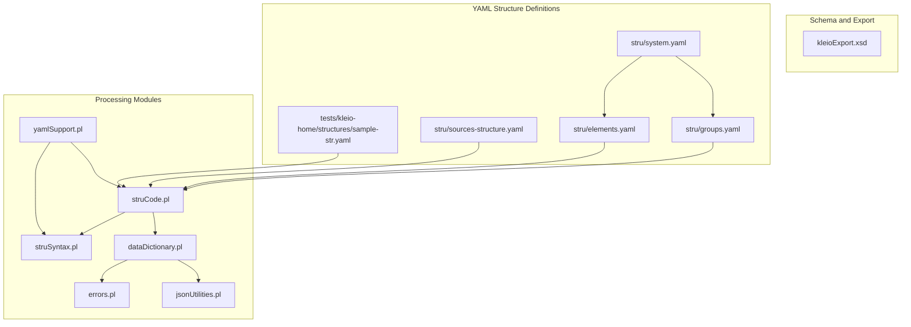
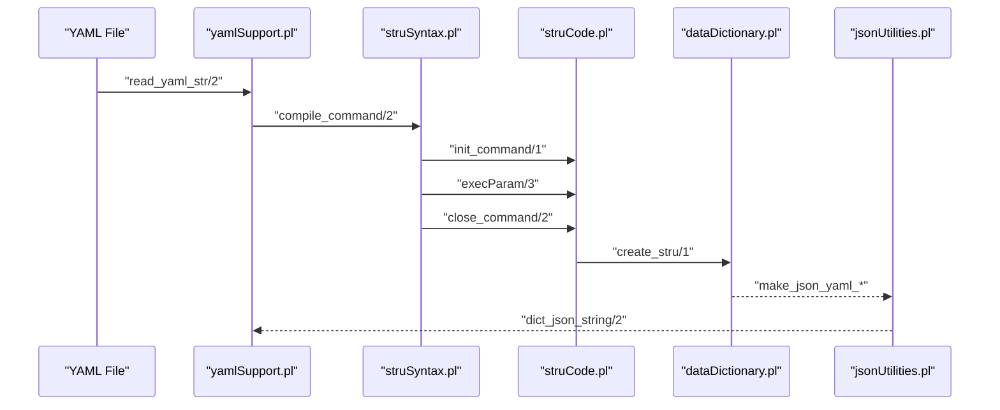
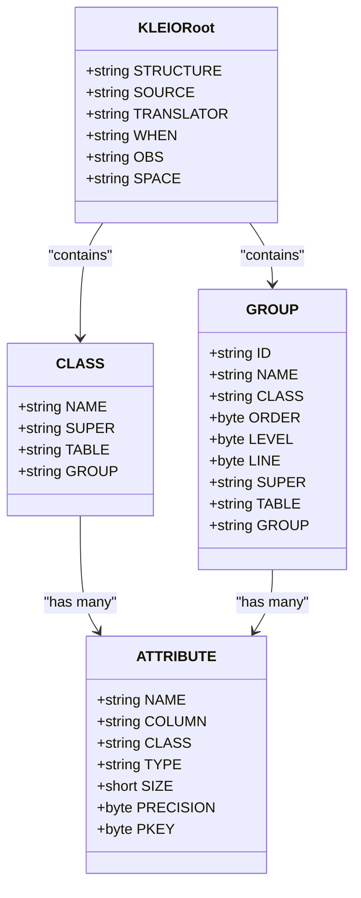
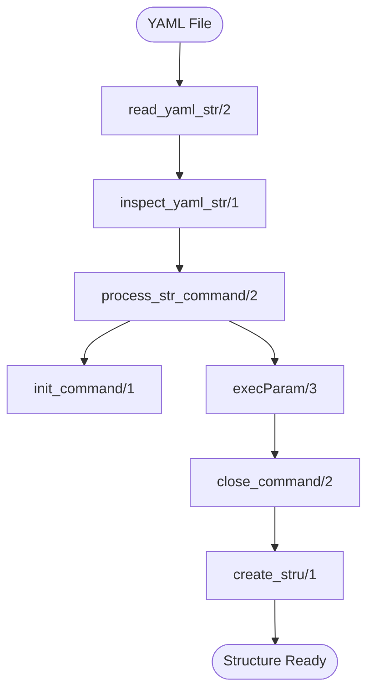
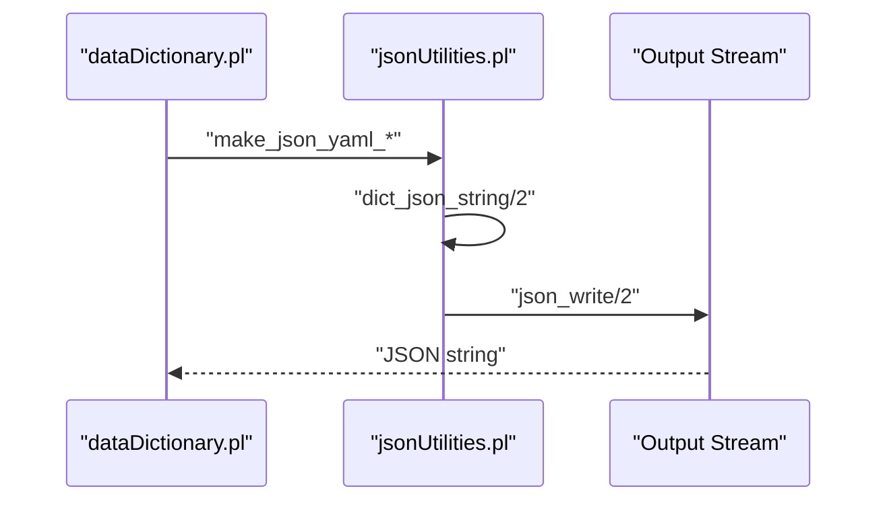
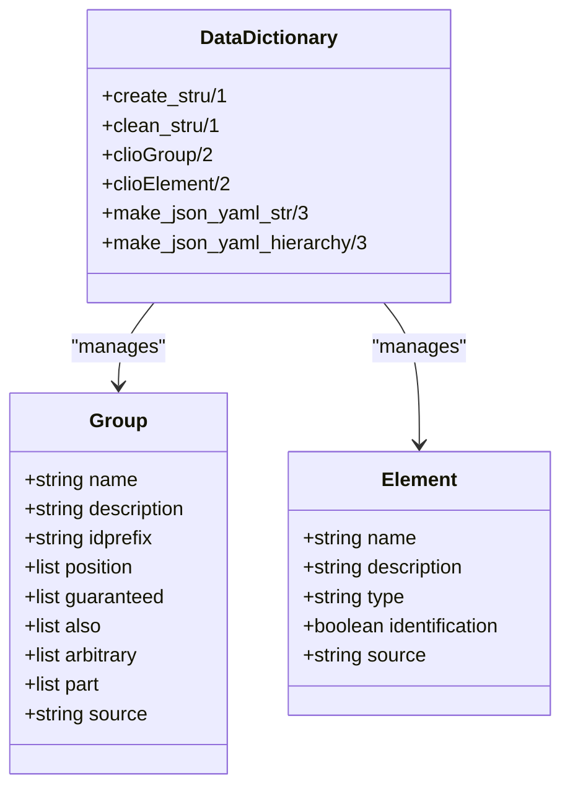
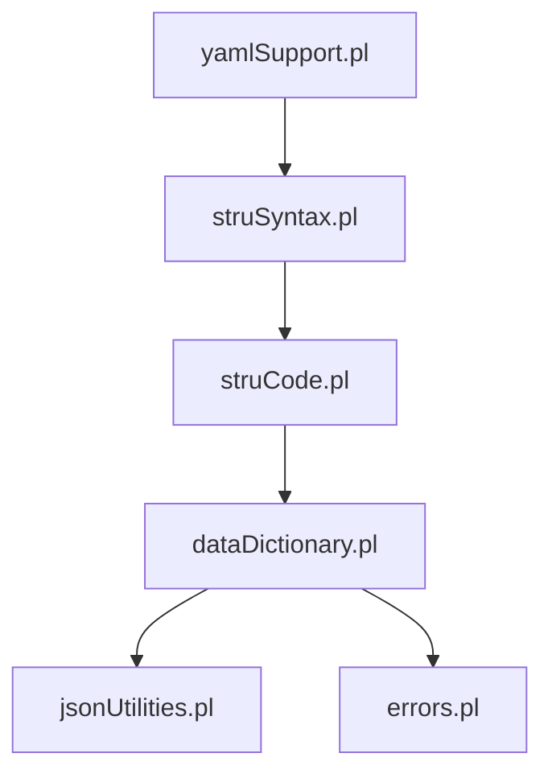

# Reference Materials

<cite>
**Referenced Files in This Document**
- [kleioExport.xsd](file://src/kleioExport.xsd)
- [yamlSupport.pl](file://src/yamlSupport.pl)
- [jsonUtilities.pl](file://src/jsonUtilities.pl)
- [dataDictionary.pl](file://src/dataDictionary.pl)
- [errors.pl](file://src/errors.pl)
- [stru/system.yaml](file://src/stru/system.yaml)
- [stru/groups.yaml](file://src/stru/groups.yaml)
- [stru/elements.yaml](file://src/stru/elements.yaml)
- [stru/sources-structure.yaml](file://src/stru/sources-structure.yaml)
- [struCode.pl](file://src/struCode.pl)
- [struSyntax.pl](file://src/struSyntax.pl)
- [tests/kleio-home/structures/sample-str.yaml](file://tests/kleio-home/structures/sample-str.yaml)
</cite>

## Table of Contents
1. [Introduction](#introduction)
2. [Project Structure](#project-structure)
3. [Core Components](#core-components)
4. [Architecture Overview](#architecture-overview)
5. [Detailed Component Analysis](#detailed-component-analysis)
6. [Dependency Analysis](#dependency-analysis)
7. [Performance Considerations](#performance-considerations)
8. [Troubleshooting Guide](#troubleshooting-guide)
9. [Conclusion](#conclusion)
10. [Appendices](#appendices)

## Introduction
This document provides comprehensive reference materials for the Timelink Kleio system. It focuses on:
- XSD schema for Kleio export formats, including data types, validation rules, and structure definitions
- YAML configuration format for structure definitions, including supported options, syntax rules, and validation requirements
- JSON utilities and data conversion processes for different output formats
- Data dictionary definitions, field descriptions, and data type specifications
- Error codes, warning messages, and diagnostic information with explanations and resolution steps
- Migration guidance for version upgrades, breaking changes, and deprecated features
- Glossary of specialized terminology
- Configuration file formats, environment variable specifications, and system property definitions
- Data format specifications, encoding requirements, and internationalization considerations
- Quick reference guides for common operations, frequently used commands, and standard configurations

## Project Structure
The repository organizes Kleio-related artifacts into modules and structure definitions:
- XSD schema for export validation
- YAML-based structure definitions for groups and elements
- Prolog modules for YAML processing, JSON utilities, data dictionary, and error reporting
- Sample structure files demonstrating typical usage

**Diagram sources**
- [kleioExport.xsd](file://src/kleioExport.xsd#L1-L78)
- [stru/system.yaml](file://src/stru/system.yaml#L1-L4)
- [stru/groups.yaml](file://src/stru/groups.yaml#L1-L259)
- [stru/elements.yaml](file://src/stru/elements.yaml#L1-L221)
- [stru/sources-structure.yaml](file://src/stru/sources-structure.yaml#L1-L800)
- [tests/kleio-home/structures/sample-str.yaml](file://tests/kleio-home/structures/sample-str.yaml#L1-L25)
- [yamlSupport.pl](file://src/yamlSupport.pl#L1-L273)
- [struCode.pl](file://src/struCode.pl#L1-L200)
- [struSyntax.pl](file://src/struSyntax.pl#L1-L200)
- [dataDictionary.pl](file://src/dataDictionary.pl#L1-L800)
- [errors.pl](file://src/errors.pl#L1-L220)
- [jsonUtilities.pl](file://src/jsonUtilities.pl#L1-L89)

**Section sources**
- [kleioExport.xsd](file://src/kleioExport.xsd#L1-L78)
- [stru/system.yaml](file://src/stru/system.yaml#L1-L4)
- [stru/groups.yaml](file://src/stru/groups.yaml#L1-L259)
- [stru/elements.yaml](file://src/stru/elements.yaml#L1-L221)
- [stru/sources-structure.yaml](file://src/stru/sources-structure.yaml#L1-L800)
- [tests/kleio-home/structures/sample-str.yaml](file://tests/kleio-home/structures/sample-str.yaml#L1-L25)
- [yamlSupport.pl](file://src/yamlSupport.pl#L1-L273)
- [struCode.pl](file://src/struCode.pl#L1-L200)
- [struSyntax.pl](file://src/struSyntax.pl#L1-L200)
- [dataDictionary.pl](file://src/dataDictionary.pl#L1-L800)
- [errors.pl](file://src/errors.pl#L1-L220)
- [jsonUtilities.pl](file://src/jsonUtilities.pl#L1-L89)

## Core Components
This section documents the primary building blocks used by Kleio for structure definition, processing, and export.

- XSD Schema for Export
  - Defines the XML structure for Kleio exports, including CLASS and GROUP elements, attributes, and validation constraints.
  - Provides a formal contract for export formats ensuring consistent serialization.

- YAML Structure Definitions
  - Groups and elements are defined via YAML files with hierarchical composition and inheritance.
  - Supports include directives, file metadata, and structured parameterization.

- YAML Processing Module
  - Reads and validates YAML structure files, processes commands, and manages includes and file contexts.
  - Sanitizes values and enforces command correctness.

- Structure Code and Syntax
  - Implements command parsing, parameter validation, and execution hooks for structure definitions.
  - Bridges YAML processing to internal data dictionary structures.

- Data Dictionary
  - Stores and manipulates structure definitions, groups, and elements.
  - Provides utilities for hierarchy traversal, containment checks, and JSON/YAML generation.

- JSON Utilities
  - Converts Prolog terms to JSON-compatible dictionaries and writes JSON output.
  - Includes deprecated conversion helpers retained for compatibility.

- Error Reporting
  - Centralized error and warning reporting with counts, context-aware messages, and optional termination thresholds.

**Section sources**
- [kleioExport.xsd](file://src/kleioExport.xsd#L1-L78)
- [stru/system.yaml](file://src/stru/system.yaml#L1-L4)
- [stru/groups.yaml](file://src/stru/groups.yaml#L1-L259)
- [stru/elements.yaml](file://src/stru/elements.yaml#L1-L221)
- [yamlSupport.pl](file://src/yamlSupport.pl#L1-L273)
- [struCode.pl](file://src/struCode.pl#L1-L200)
- [struSyntax.pl](file://src/struSyntax.pl#L1-L200)
- [dataDictionary.pl](file://src/dataDictionary.pl#L1-L800)
- [jsonUtilities.pl](file://src/jsonUtilities.pl#L1-L89)
- [errors.pl](file://src/errors.pl#L1-L220)

## Architecture Overview
The architecture integrates YAML-based structure definitions with Prolog modules that parse, validate, and transform them into internal data structures. Export and JSON utilities consume these structures for downstream processing.

**Diagram sources**
- [yamlSupport.pl](file://src/yamlSupport.pl#L46-L96)
- [struSyntax.pl](file://src/struSyntax.pl#L48-L101)
- [struCode.pl](file://src/struCode.pl#L91-L118)
- [dataDictionary.pl](file://src/dataDictionary.pl#L117-L125)
- [jsonUtilities.pl](file://src/jsonUtilities.pl#L11-L13)

## Detailed Component Analysis

### XSD Schema for Kleio Export Formats
The XSD defines the XML envelope for Kleio exports, including:
- Root element KLEIO with attributes for structure metadata
- CLASS elements for typed definitions with ATTRIBUTE children
- GROUP elements with ELEMENT and ATTRIBUTE children
- Validation constraints on attribute types and presence

Key characteristics:
- Root attributes: STRUCTURE, SOURCE, TRANSLATOR, WHEN, OBS, SPACE
- CLASS attributes: NAME, SUPER, TABLE, GROUP
- GROUP attributes: ID, NAME, CLASS, ORDER, LEVEL, LINE, SUPER, TABLE, GROUP
- ATTRIBUTE children support NAME, COLUMN, CLASS, TYPE, SIZE, PRECISION, PKEY

Validation rules:
- Choice of CLASS or GROUP at the root level
- Optional sequences of ATTRIBUTE within CLASS and GROUP
- SimpleContent extension for ATTRIBUTE values with string base type and typed attributes

**Diagram sources**
- [kleioExport.xsd](file://src/kleioExport.xsd#L1-L78)

**Section sources**
- [kleioExport.xsd](file://src/kleioExport.xsd#L1-L78)

### YAML Configuration Format
The YAML configuration format defines groups and elements with structured parameters and supports includes and file metadata.

Supported constructs:
- file: metadata block with name and description
- include: references to other YAML files
- group: group definitions with:
  - name, description, idprefix, position, guaranteed, also, arbitrary, part, source
- element: element definitions with:
  - name, description, type, identification, source

Processing pipeline:
- yamlSupport.pl reads YAML files, tracks include stacks, sanitizes values, and dispatches commands to struCode.pl
- struSyntax.pl compiles commands and validates parameters against predefined grammars
- struCode.pl executes command handlers, sets defaults, and persists structure definitions
- dataDictionary.pl maintains internal structures and provides hierarchy utilities

**Diagram sources**
- [yamlSupport.pl](file://src/yamlSupport.pl#L46-L96)
- [struSyntax.pl](file://src/struSyntax.pl#L48-L101)
- [struCode.pl](file://src/struCode.pl#L91-L118)
- [dataDictionary.pl](file://src/dataDictionary.pl#L117-L125)

**Section sources**
- [yamlSupport.pl](file://src/yamlSupport.pl#L1-L273)
- [stru/system.yaml](file://src/stru/system.yaml#L1-L4)
- [stru/groups.yaml](file://src/stru/groups.yaml#L1-L259)
- [stru/elements.yaml](file://src/stru/elements.yaml#L1-L221)
- [tests/kleio-home/structures/sample-str.yaml](file://tests/kleio-home/structures/sample-str.yaml#L1-L25)
- [struCode.pl](file://src/struCode.pl#L1-L200)
- [struSyntax.pl](file://src/struSyntax.pl#L1-L200)
- [dataDictionary.pl](file://src/dataDictionary.pl#L1-L800)

### JSON Utilities and Data Conversion
JSON utilities provide conversion and serialization capabilities:
- dict_json_string/2 converts a dictionary to a JSON string
- prolog_to_json/2 offers a deprecated conversion path for Prolog lists and terms
- Integration with SWI-Prolog JSON library for writing JSON output

Typical usage:
- Convert internal structures to JSON dictionaries
- Serialize dictionaries to strings for export or API responses

**Diagram sources**
- [jsonUtilities.pl](file://src/jsonUtilities.pl#L11-L13)
- [dataDictionary.pl](file://src/dataDictionary.pl#L34-L36)

**Section sources**
- [jsonUtilities.pl](file://src/jsonUtilities.pl#L1-L89)
- [dataDictionary.pl](file://src/dataDictionary.pl#L34-L36)

### Data Dictionary Definitions and Field Specifications
The data dictionary manages structure definitions and exposes utilities for hierarchy and JSON/YAML generation:
- create_stru/1, clean_stru/1, clioStru/1, clioGroup/2, clioElement/2
- contained_by/2, subgroups/2, element_of/2, group_elements/2
- set_group_prop/3, set_element_prop/3, get_group_prop/3, get_element_prop/3
- make_json_yaml_str/3, make_json_yaml_hierarchy/3, make_json_yaml_hierarchy/4

Field descriptions and data types:
- Elements commonly include identifiers (id), textual fields (name, description, obs), categorical fields (type, class), temporal fields (day, month, year, date), locational fields (loc), reference fields (ref, page, pages), and linkage fields (same_as, xsame_as, entity, origin, destination, destname)
- Groups define containment and positioning rules, inheritance via source, and identification prefixes

**Diagram sources**
- [dataDictionary.pl](file://src/dataDictionary.pl#L1-L800)
- [stru/groups.yaml](file://src/stru/groups.yaml#L1-L259)
- [stru/elements.yaml](file://src/stru/elements.yaml#L1-L221)

**Section sources**
- [dataDictionary.pl](file://src/dataDictionary.pl#L1-L800)
- [stru/groups.yaml](file://src/stru/groups.yaml#L1-L259)
- [stru/elements.yaml](file://src/stru/elements.yaml#L1-L221)

### Error Codes, Warning Messages, and Diagnostics
Error reporting provides:
- error_out/1, error_out/2 for fatal errors
- warning_out/1, warning_out/2 for warnings
- error_count/1, warning_count/1 for totals
- check_continuation/0 to enforce maximum error thresholds
- Context-aware messages with file, line number, and surrounding text

Diagnostic information:
- Messages include file context, command context, and line-level details
- Counts are maintained and printed via perror_count/0

**Section sources**
- [errors.pl](file://src/errors.pl#L1-L220)

### Migration and Version Upgrade Guidance
- YAML structure files support include directives and layered composition; ensure include paths resolve correctly across environments
- Structure definitions rely on group and element inheritance via source; verify inherited properties remain compatible
- JSON utilities include deprecated conversion helpers; prefer dictionary-based conversions using dict_json_string/2
- Error thresholds and reporting can be tuned via max_errors and related controls

[No sources needed since this section provides general guidance]

### Glossary
- CLASS: Typed definition container in the export XSD
- GROUP: Logical grouping of elements with containment rules
- ELEMENT: Atomic data field with type and semantics
- IDENTIFICATION: Flag indicating an element serves as an identifier
- POSITION: Ordered list of elements for positional parsing
- GUARANTEED: Required elements for a group
- ALSO: Optional elements for a group
- ARBITRARY: Additional elements allowed in a group
- SOURCE: Inheritance relationship for groups and elements
- INCLUDE: Directive to incorporate external YAML files
- FILE: Metadata block for YAML structure files

[No sources needed since this section provides general definitions]

### Configuration File Formats and System Properties
- YAML structure files:
  - file: name, description
  - include: path to other YAML files
  - group: name, description, idprefix, position, guaranteed, also, arbitrary, part, source
  - element: name, description, type, identification, source
- System-level properties:
  - Structure name and metadata are stored as properties during processing
  - Error and warning counts are tracked and can influence continuation behavior

**Section sources**
- [stru/system.yaml](file://src/stru/system.yaml#L1-L4)
- [stru/groups.yaml](file://src/stru/groups.yaml#L1-L259)
- [stru/elements.yaml](file://src/stru/elements.yaml#L1-L221)
- [yamlSupport.pl](file://src/yamlSupport.pl#L28-L43)
- [errors.pl](file://src/errors.pl#L62-L198)

### Data Format Specifications, Encoding, and Internationalization
- Date formats: YYYYMMDD or YYYY-MM-DD; ranges and relative dates supported
- String sizes: string64 and string256 for identifiers and names
- Text fields: text for longer descriptions
- Encoding: YAML and JSON are UTF-8 compatible; ensure source files are saved accordingly

**Section sources**
- [stru/elements.yaml](file://src/stru/elements.yaml#L69-L77)

### Quick Reference Guides
- Common YAML commands:
  - file: define metadata
  - include: import other YAML files
  - group: define groups with parameters
  - element: define elements with parameters
- Common Prolog predicates:
  - stru_yaml/1: load a YAML structure file
  - dict_json_string/2: serialize dictionary to JSON string
  - create_stru/1: finalize structure definition
  - error_out/1, warning_out/1: emit diagnostics

**Section sources**
- [yamlSupport.pl](file://src/yamlSupport.pl#L28-L43)
- [jsonUtilities.pl](file://src/jsonUtilities.pl#L11-L13)
- [struCode.pl](file://src/struCode.pl#L105-L118)
- [errors.pl](file://src/errors.pl#L85-L113)

## Dependency Analysis
This section maps dependencies among core modules and their roles in the processing pipeline.

**Diagram sources**
- [yamlSupport.pl](file://src/yamlSupport.pl#L1-L273)
- [struSyntax.pl](file://src/struSyntax.pl#L1-L200)
- [struCode.pl](file://src/struCode.pl#L1-L200)
- [dataDictionary.pl](file://src/dataDictionary.pl#L1-L800)
- [jsonUtilities.pl](file://src/jsonUtilities.pl#L1-L89)
- [errors.pl](file://src/errors.pl#L1-L220)

**Section sources**
- [yamlSupport.pl](file://src/yamlSupport.pl#L1-L273)
- [struSyntax.pl](file://src/struSyntax.pl#L1-L200)
- [struCode.pl](file://src/struCode.pl#L1-L200)
- [dataDictionary.pl](file://src/dataDictionary.pl#L1-L800)
- [jsonUtilities.pl](file://src/jsonUtilities.pl#L1-L89)
- [errors.pl](file://src/errors.pl#L1-L220)

## Performance Considerations
- YAML processing includes stack-based include handling; avoid deeply nested includes to prevent excessive recursion
- Structure validation and caching of containment relations reduce repeated computation
- JSON serialization leverages optimized SWI-Prolog JSON library for efficient output

[No sources needed since this section provides general guidance]

## Troubleshooting Guide
Common issues and resolutions:
- Unknown or misspelled YAML commands: Verify command names and parameters; check spelling and capitalization
- Missing required elements in groups: Ensure guaranteed elements are present according to group definitions
- Duplicate group or element definitions: Merge properties or adjust definitions to avoid conflicts
- Exceeded maximum errors: Review error counts and fix underlying issues; adjust max_errors if necessary
- JSON serialization failures: Ensure dictionaries are properly formed; use dict_json_string/2 for reliable serialization

**Section sources**
- [yamlSupport.pl](file://src/yamlSupport.pl#L149-L154)
- [errors.pl](file://src/errors.pl#L186-L198)
- [jsonUtilities.pl](file://src/jsonUtilities.pl#L11-L13)

## Conclusion
This reference consolidates the XSD export schema, YAML structure definitions, processing modules, and utilities that underpin the Timelink Kleio system. By adhering to the documented formats, validations, and procedures, users can reliably define structures, process data, and produce standardized exports with robust error handling and diagnostics.

[No sources needed since this section summarizes without analyzing specific files]

## Appendices
- Sample structure file demonstrating group and element definitions
- Additional structure examples for reference and testing

**Section sources**
- [tests/kleio-home/structures/sample-str.yaml](file://tests/kleio-home/structures/sample-str.yaml#L1-L25)
- [stru/sources-structure.yaml](file://src/stru/sources-structure.yaml#L1-L800)