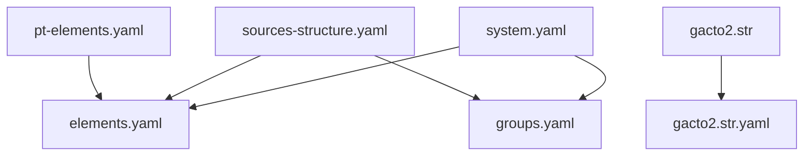
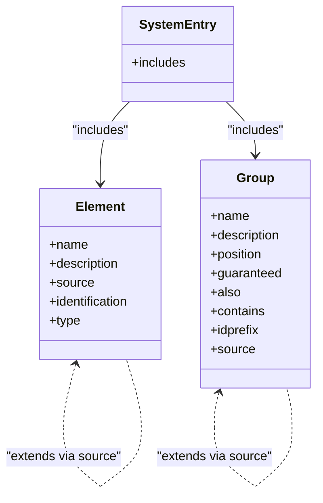
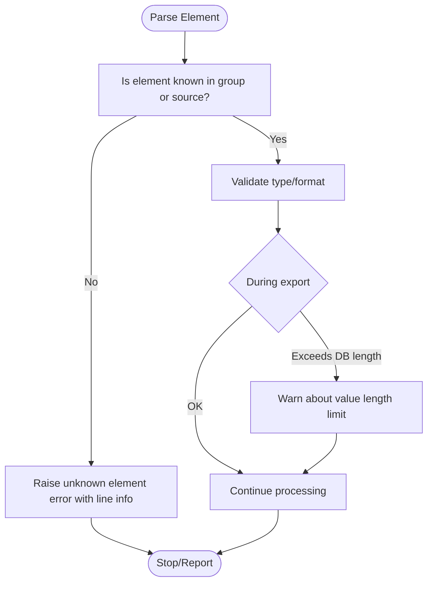

# Element Definitions

<cite>
**Referenced Files in This Document**
- [elements.yaml](file://src/stru/elements.yaml)
- [groups.yaml](file://src/stru/groups.yaml)
- [system.yaml](file://src/stru/system.yaml)
- [sources-structure.yaml](file://src/stru/sources-structure.yaml)
- [pt-elements.yaml](file://src/stru/pt-elements.yaml)
- [gacto2.str](file://src/stru/gacto2.str)
- [gacto2.str.yaml](file://src/stru/gacto2.str.yaml)
- [kleioExport.xsd](file://src/kleioExport.xsd)
- [dataCode.pl](file://src/dataCode.pl)
- [gactoxml.pl](file://src/gactoxml.pl)
- [kleio_data.ebnf](file://syntax/kleio_data.ebnf)
</cite>

## Table of Contents
1. [Introduction](#introduction)
2. [Project Structure](#project-structure)
3. [Core Components](#core-components)
4. [Architecture Overview](#architecture-overview)
5. [Detailed Component Analysis](#detailed-component-analysis)
6. [Dependency Analysis](#dependency-analysis)
7. [Performance Considerations](#performance-considerations)
8. [Troubleshooting Guide](#troubleshooting-guide)
9. [Conclusion](#conclusion)
10. [Appendices](#appendices)

## Introduction
This document explains element definitions in Kleio schemas. Elements are the building blocks for data models: they define names, types, constraints, and behaviors that govern how values are parsed, validated, and stored. The repository provides both YAML-based and legacy .str-based schema definitions, with a core set of reusable elements and groups that can be extended to model historical sources, entities, attributes, relations, and more.

## Project Structure
Kleio’s schema system is organized around:
- Core element definitions (types, identifiers, dates, references)
- Group definitions (containers for elements and sub-groups)
- System entry points that include core files
- Language-specific aliases (e.g., Portuguese synonyms)
- Legacy structure format (.str) and its YAML counterpart

**Diagram sources**
- [system.yaml:1-4](file://src/stru/system.yaml#L1-L4)
- [sources-structure.yaml:1-10](file://src/stru/sources-structure.yaml#L1-L10)
- [pt-elements.yaml:1-136](file://src/stru/pt-elements.yaml#L1-L136)
- [gacto2.str:1-200](file://src/stru/gacto2.str#L1-L200)
- [gacto2.str.yaml:1-800](file://src/stru/gacto2.str.yaml#L1-L800)

**Section sources**
- [system.yaml:1-4](file://src/stru/system.yaml#L1-L4)
- [sources-structure.yaml:1-10](file://src/stru/sources-structure.yaml#L1-L10)

## Core Components
- Elements: atomic fields such as number, string64, string256, text, date, id, same_as, xsame_as, entity, type, value, name, description, obs, ref, page, pages, title, loc, etc.
- Groups: named containers like kleio, historical-source, authority-register, identifications, person, object, geoentity, attribute, relation, link, property, etc.
- Inheritance via source: elements and groups can extend existing ones by referencing a source, enabling reuse and specialization.
- Identification flag: marks an element as an identifier used for linking entities.
- Positional and guaranteed lists: control required ordering and mandatory presence within groups.

Key responsibilities:
- Define canonical field semantics and types
- Provide reusable building blocks across schemas
- Support internationalization through aliasing (e.g., pt-elements.yaml)
- Enable composition via groups and inheritance

**Section sources**
- [elements.yaml:1-305](file://src/stru/elements.yaml#L1-L305)
- [groups.yaml:1-686](file://src/stru/groups.yaml#L1-L686)
- [pt-elements.yaml:1-136](file://src/stru/pt-elements.yaml#L1-L136)

## Architecture Overview
The schema architecture centers on two complementary formats:
- YAML-based definitions (modern): elements.yaml and groups.yaml compose the core model; sources-structure.yaml includes them; pt-elements.yaml adds language aliases.
- Legacy .str format: gacto2.str defines the same concepts using a different syntax; gacto2.str.yaml mirrors it in YAML.

**Diagram sources**
- [elements.yaml:1-305](file://src/stru/elements.yaml#L1-L305)
- [groups.yaml:1-686](file://src/stru/groups.yaml#L1-L686)
- [system.yaml:1-4](file://src/stru/system.yaml#L1-L4)

## Detailed Component Analysis

### Element Attributes and Semantics
Elements support the following attributes (as seen in the repository):
- name: unique identifier for the element
- description: human-readable explanation
- source: reference to another element or group to inherit behavior
- identification: boolean-like flag indicating if the element serves as an identifier
- type: explicit type mapping (used in some definitions)
- prefix/suffix: formatting hints (present in generated YAML)

Examples from the codebase:
- Basic types: number, string64, string256, text
- Date components: day, month, year, date
- Identifiers and references: id, same_as, xsame_as, entity, origin, destination
- Common fields: type, value, class, name, description, obs, ref, page, pages, title, loc
- Processing controls: replaces, replace, autorels, prefix, structure, translations, translator, urlpattern, shortname, inside
- Metadata: groupname, level, line, kleiofile

These elements form the vocabulary used by groups to describe records.

**Section sources**
- [elements.yaml:1-305](file://src/stru/elements.yaml#L1-L305)
- [gacto2.str.yaml:1-800](file://src/stru/gacto2.str.yaml#L1-L800)

### Defining Data Types
- Strings: string64 (short identifiers), string256 (names/descriptions), text (long texts)
- Numbers: number; also numeric date parts (day, month, year) and composite date
- Dates: date supports multiple formats including ranges and relative expressions
- References: id, same_as, xsame_as, entity, origin, destination

Usage patterns:
- Use string64 for IDs and short codes
- Use string256 for names and short descriptions
- Use text for multi-line notes and summaries
- Use date for temporal information with flexible parsing

**Section sources**
- [elements.yaml:37-83](file://src/stru/elements.yaml#L37-L83)
- [gacto2.str:34-55](file://src/stru/gacto2.str#L34-L55)

### Creating Reusable Element Templates
Reuse is achieved via the source attribute:
- Aliases: create localized or domain-specific names pointing to canonical elements
- Specializations: add description or additional metadata while inheriting behavior

Examples:
- Portuguese aliases: dia -> day, mes -> month, ano -> year, data -> date, tipo -> type, valor -> value, localizacao/local -> loc, cota -> ref, nome -> name, mesmo_que/xmesmo_que -> same_as/xsame_as, sexo -> sex, nomedest -> destname, sumario/descricao/desc -> summary, pagina/folio/folios -> page/pages, substitui -> replaces, titulo -> title, resumo -> summary

This pattern enables consistent modeling across languages and domains without duplicating logic.

**Section sources**
- [pt-elements.yaml:1-136](file://src/stru/pt-elements.yaml#L1-L136)
- [elements.yaml:1-305](file://src/stru/elements.yaml#L1-L305)

### Extending Existing Elements Through Inheritance
Both elements and groups support inheritance via source:
- Element inheritance: new element inherits type and behavior from a base element
- Group inheritance: specialized groups extend base groups, refining position, guaranteed, also, contains, and idprefix

Examples:
- Place extends geoentity
- Historical-source extends entity
- Person/object/geoentity extend entity
- Attribute/list variants (ls, atr, attr) extend attribute
- Relation variants (rel) extend relation

This approach centralizes common behavior and reduces duplication.

**Section sources**
- [groups.yaml:1-686](file://src/stru/groups.yaml#L1-L686)
- [gacto2.str:130-200](file://src/stru/gacto2.str#L130-L200)

### Element Validation and Error Handling
Validation occurs during parsing and processing:
- Unknown element detection: when an element is not recognized in the current group context, an error is raised with line context
- Length checks: during export, element values exceeding database field lengths generate warnings
- Identifier handling: identification-flagged elements participate in linking and uniqueness checks

Implementation highlights:
- Verification function checks whether an element exists in the current group or its inherited sources
- Export routine compares computed length against mapped database column size and warns if exceeded

**Diagram sources**
- [dataCode.pl:308-347](file://src/dataCode.pl#L308-L347)
- [gactoxml.pl:2428-2482](file://src/gactoxml.pl#L2428-L2482)

**Section sources**
- [dataCode.pl:308-347](file://src/dataCode.pl#L308-L347)
- [gactoxml.pl:2428-2482](file://src/gactoxml.pl#L2428-L2482)

### Syntax and Parsing Context
Element values are parsed according to Kleio’s grammar:
- Named elements use name=value syntax
- Values can be simple strings, quoted strings, or multiline strings
- Special markers delimit groups, assignments, separators, comments, and alternatives

This grammar underpins how elements are read and transformed into internal structures before validation and storage.

**Section sources**
- [kleio_data.ebnf:31-62](file://syntax/kleio_data.ebnf#L31-L62)

## Dependency Analysis
Schema dependencies follow inclusion and inheritance chains:
- system.yaml includes elements.yaml and groups.yaml
- sources-structure.yaml includes elements.yaml, groups.yaml, and pt-sources-structure.yaml
- pt-elements.yaml includes elements.yaml and adds aliases
- gacto2.str defines the legacy structure; gacto2.str.yaml mirrors it

**Diagram sources**
- [system.yaml:1-4](file://src/stru/system.yaml#L1-L4)
- [sources-structure.yaml:1-10](file://src/stru/sources-structure.yaml#L1-L10)
- [pt-elements.yaml:1-136](file://src/stru/pt-elements.yaml#L1-L136)
- [gacto2.str:1-200](file://src/stru/gacto2.str#L1-L200)
- [gacto2.str.yaml:1-800](file://src/stru/gacto2.str.yaml#L1-L800)

**Section sources**
- [system.yaml:1-4](file://src/stru/system.yaml#L1-L4)
- [sources-structure.yaml:1-10](file://src/stru/sources-structure.yaml#L1-L10)

## Performance Considerations
When working with large numbers of elements:
- Prefer inheritance via source to minimize duplication and reduce schema complexity
- Use appropriate string sizes (string64 vs string256 vs text) to avoid unnecessary memory overhead
- Leverage identification flags judiciously; excessive identification may increase linking checks
- Monitor export-time length warnings to prevent costly truncation or errors downstream
- Organize schemas with clear group hierarchies to improve parser efficiency and maintainability

[No sources needed since this section provides general guidance]

## Troubleshooting Guide
Common issues and resolutions:
- Unknown element errors: ensure the element is defined in the current group or inherited via source; check spelling and case
- Value length warnings: verify database column mappings and consider using larger types or splitting fields
- Identifier conflicts: confirm uniqueness of ids and proper use of prefixes to avoid collisions across files
- Date parsing problems: validate date formats and ranges; consult documentation links referenced in element descriptions

Operational references:
- Element verification and error reporting
- Export-time length checks and warnings

**Section sources**
- [dataCode.pl:308-347](file://src/dataCode.pl#L308-L347)
- [gactoxml.pl:2428-2482](file://src/gactoxml.pl#L2428-L2482)

## Conclusion
Kleio’s element system provides a robust foundation for defining data models through reusable, extensible building blocks. By leveraging inheritance, aliases, and well-defined types, you can construct expressive schemas that support validation, linking, and efficient processing. Adhering to best practices around naming, sizing, and organization will help maintain clarity and performance at scale.

[No sources needed since this section summarizes without analyzing specific files]

## Appendices

### Schema XSD Reference
The export schema outlines structural expectations for groups and elements, including attributes like NAME, CLASS, TYPE, SIZE, PRECISION, PKEY, and relationships between GROUP and ELEMENT constructs.

**Section sources**
- [kleioExport.xsd:25-78](file://src/kleioExport.xsd#L25-L78)