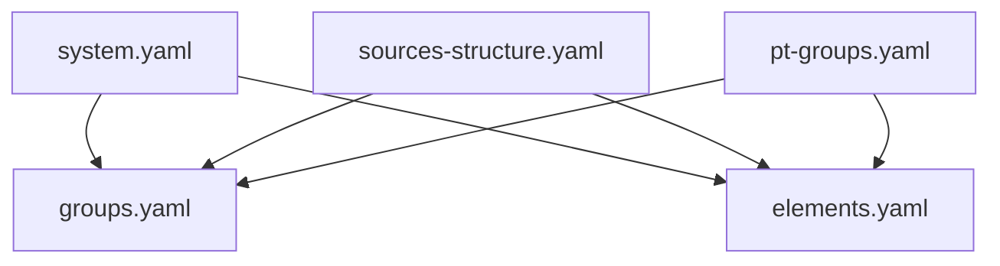
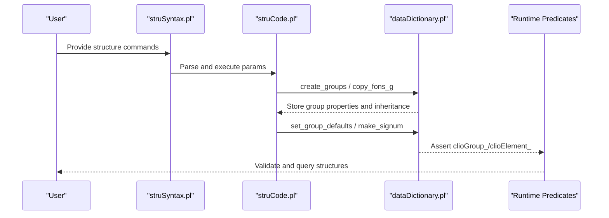
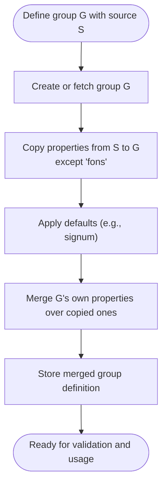
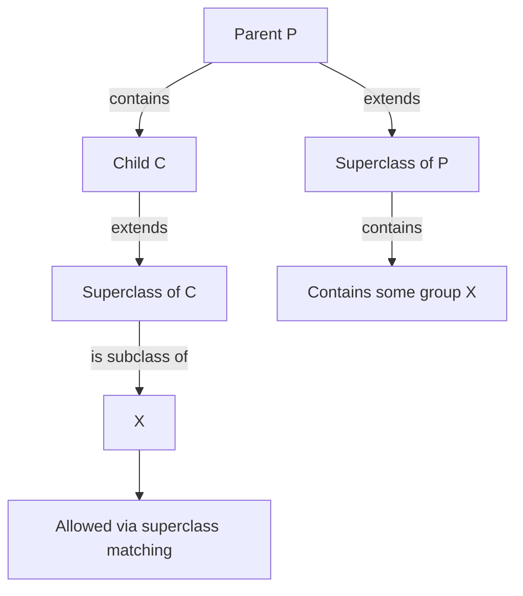
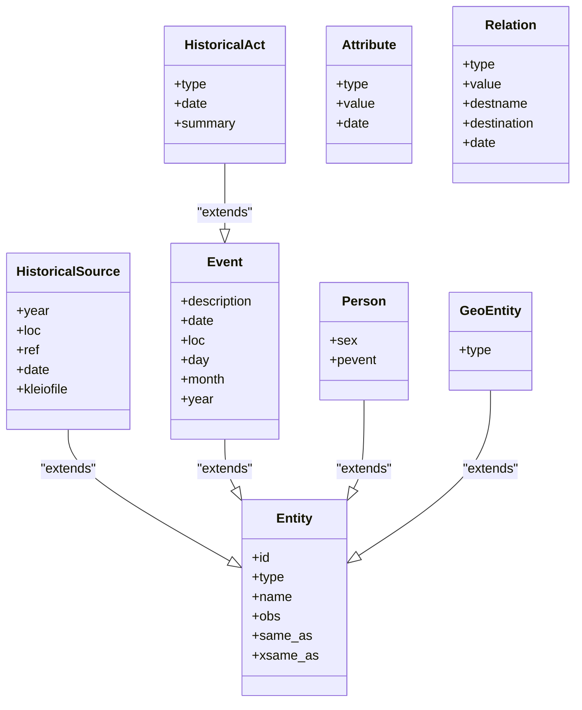
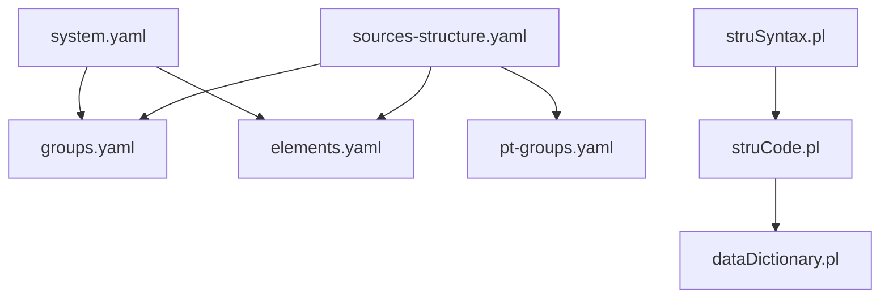

# Group Hierarchies

<cite>
**Referenced Files in This Document**
- [groups.yaml](file://src/stru/groups.yaml)
- [elements.yaml](file://src/stru/elements.yaml)
- [system.yaml](file://src/stru/system.yaml)
- [sources-structure.yaml](file://src/stru/sources-structure.yaml)
- [pt-groups.yaml](file://src/stru/pt-groups.yaml)
- [dataDictionary.pl](file://src/dataDictionary.pl)
- [struSyntax.pl](file://src/struSyntax.pl)
- [struCode.pl](file://src/struCode.pl)
- [dataCode.pl](file://src/dataCode.pl)
</cite>

## Table of Contents
1. [Introduction](#introduction)
2. [Project Structure](#project-structure)
3. [Core Components](#core-components)
4. [Architecture Overview](#architecture-overview)
5. [Detailed Component Analysis](#detailed-component-analysis)
6. [Dependency Analysis](#dependency-analysis)
7. [Performance Considerations](#performance-considerations)
8. [Troubleshooting Guide](#troubleshooting-guide)
9. [Conclusion](#conclusion)
10. [Appendices](#appendices)

## Introduction
This document explains how group hierarchies work in Kleio schemas, focusing on:
- How groups organize elements into logical collections
- How inheritance (source) enables reuse and specialization
- The syntax for defining groups and their attributes
- Parent-child relationships via containment
- Attribute inheritance mechanisms
- Practical examples for historical documents (parish records, notarial acts, administrative records)
- Design guidance to build efficient hierarchies and avoid circular dependencies
- Validation behavior and troubleshooting common issues

## Project Structure
Kleio schema definitions are primarily YAML files that declare groups and elements. A system entry point composes these files into a working structure.

**Diagram sources**
- [system.yaml:1-4](file://src/stru/system.yaml#L1-L4)
- [sources-structure.yaml:1-10](file://src/stru/sources-structure.yaml#L1-L10)
- [groups.yaml:1-686](file://src/stru/groups.yaml#L1-L686)
- [elements.yaml:1-305](file://src/stru/elements.yaml#L1-L305)
- [pt-groups.yaml:1-238](file://src/stru/pt-groups.yaml#L1-L238)

**Section sources**
- [system.yaml:1-4](file://src/stru/system.yaml#L1-L4)
- [sources-structure.yaml:1-10](file://src/stru/sources-structure.yaml#L1-L10)

## Core Components
- Groups define named containers with:
  - name: identifier
  - description: human-readable documentation
  - position: ordered list of elements allowed without explicit names
  - guaranteed: required elements
  - also: optional elements
  - contains/part: allowed child groups
  - idprefix: default ID prefix for instances
  - source: parent group to inherit from
- Elements define atomic data fields used by groups.

Key core groups include kleio, historical-source, authority-register, identifications, event, historical-act, cevent, entity, person, geoentity, attribute/relation, end, and specialized variants like female/male, kin-* roles, abstraction/topic, geodesc hierarchy, etc.

**Section sources**
- [groups.yaml:1-686](file://src/stru/groups.yaml#L1-L686)
- [elements.yaml:1-305](file://src/stru/elements.yaml#L1-L305)

## Architecture Overview
The runtime processes YAML structure definitions through a parser and code generator, then stores the resulting dictionary in Prolog predicates for validation and translation.

**Diagram sources**
- [struSyntax.pl:1-417](file://src/struSyntax.pl#L1-L417)
- [struCode.pl:1-402](file://src/struCode.pl#L1-L402)
- [dataDictionary.pl:1-800](file://src/dataDictionary.pl#L1-L800)

## Detailed Component Analysis

### Group Definition Syntax and Semantics
Groups are defined using a YAML list of dictionaries. Each group supports:
- name: string
- description: text
- position: list of element names
- guaranteed: list of required element names
- also: list of optional element names
- contains/part: list of allowed child group names
- idprefix: string prefix for generated IDs
- source: parent group name for inheritance

Inheritance copies non-conflicting properties from the source group before processing the current group’s own properties. This includes position, guaranteed, also, contains, and idprefix unless overridden.

Practical implications:
- Specialization is achieved by extending a base group and overriding only what changes.
- Position ordering affects implicit parsing when element names are omitted.
- Guaranteed ensures mandatory fields; missing values trigger validation errors.
- Also allows additional fields beyond position.
- contains/part controls valid nesting and containment checks.

**Section sources**
- [groups.yaml:1-686](file://src/stru/groups.yaml#L1-L686)
- [dataDictionary.pl:618-646](file://src/dataDictionary.pl#L618-L646)

### Inheritance Mechanism and Property Copying
When a group specifies source, the system:
- Creates the group if needed
- Copies properties from the source group (excluding fons/source itself)
- Applies defaults such as signum/idprefix based on name
- Stores the final merged property set

Containment checks consider both direct parts and superclasses, enabling flexible containment rules across hierarchies.

**Diagram sources**
- [dataDictionary.pl:618-646](file://src/dataDictionary.pl#L618-L646)
- [dataDictionary.pl:467-526](file://src/dataDictionary.pl#L467-L526)

**Section sources**
- [dataDictionary.pl:618-646](file://src/dataDictionary.pl#L618-L646)
- [dataDictionary.pl:467-526](file://src/dataDictionary.pl#L467-L526)

### Parent-Child Relationships and Containment
A group can contain other groups via contains/part. The system validates whether a child group is allowed either directly or via superclass relationships.

Containment logic:
- Direct containment: child listed in parent’s contains/part
- Superclass containment: a superclass of the child is contained in the parent
- Cross-superclass containment: a superclass of the parent contains a superclass of the child

Caching improves performance by remembering containment decisions.

**Diagram sources**
- [dataDictionary.pl:225-261](file://src/dataDictionary.pl#L225-L261)

**Section sources**
- [dataDictionary.pl:225-261](file://src/dataDictionary.pl#L225-L261)

### Attribute Inheritance and Element Specialization
Elements can specialize existing elements via source. For example, urlpattern extends string256. This allows consistent typing and mapping while enabling domain-specific semantics.

Groups reference elements by name; inherited elements propagate through group inheritance.

**Section sources**
- [elements.yaml:1-305](file://src/stru/elements.yaml#L1-L305)
- [groups.yaml:196-199](file://src/stru/groups.yaml#L196-L199)

### Practical Domain-Specific Examples

#### Parish Records
Parish records often model baptisms, marriages, burials, and related events. You can extend historical-act to define specific act types with required fields and allowed participants.

- Base: historical-act provides id, type, date, location, references, and standard children (person, object, geoentity, abstraction, ls, atr, rel, cevent, end).
- Specialize: Define baptism, marriage, burial groups with position/guaranteed tailored to parish norms.
- Participants: Use actorf/actorm or kin-* roles to capture roles like celebrant, witnesses, parents.
- Attributes: Use ls/attribute for life story entries (residence, profession) and relations for kinship.

Design tips:
- Keep position aligned with typical transcription order to reduce verbosity.
- Use guaranteed to enforce critical fields (e.g., date, participants).
- Leverage end to delimit complex lists and trigger inference at appropriate boundaries.

**Section sources**
- [groups.yaml:219-231](file://src/stru/groups.yaml#L219-L231)
- [groups.yaml:373-451](file://src/stru/groups.yaml#L373-L451)
- [groups.yaml:524-568](file://src/stru/groups.yaml#L524-L568)

#### Notarial Documents
Notarial acts involve parties, beneficiaries, agents, and legal objects. Extend historical-act to model notarial acts with richer role sets and property lists.

- Roles: actorf/actorm plus custom roles (e.g., beneficiario, procurador) modeled as specialized person groups.
- Objects: bem/object for assets, contracts, deeds.
- Attributes: ls/attribute for dates, locations, amounts; relation for legal ties.
- Lists: Use ulist or custom list groups for enumerations (e.g., multiple beneficiaries).

Design tips:
- Use also for optional metadata (folio, page numbers).
- Employ end to segment long lists of parties or clauses.
- Maintain clear separation between act-level metadata and party-level details.

**Section sources**
- [groups.yaml:219-231](file://src/stru/groups.yaml#L219-L231)
- [groups.yaml:454-479](file://src/stru/groups.yaml#L454-L479)
- [groups.yaml:614-638](file://src/stru/groups.yaml#L614-L638)

#### Administrative Records
Administrative records (e.g., council minutes, household rolls) benefit from structured items and topics.

- Items: item/group for agenda items, motions, resolutions.
- Topics: topic/abstraction for subjects and themes.
- Events: evento/event for narrative descriptions outside formal acts.
- Hierarchical geography: geodesc/geo1..geo4 for place hierarchies.

Design tips:
- Use arbitrary/part to allow flexible nested content where needed.
- Apply guaranteed to ensure essential identifiers and titles.
- Use same_as/xsame_as to link entities across files.

**Section sources**
- [pt-groups.yaml:116-138](file://src/stru/pt-groups.yaml#L116-L138)
- [groups.yaml:473-479](file://src/stru/groups.yaml#L473-L479)
- [groups.yaml:639-686](file://src/stru/groups.yaml#L639-L686)

### Class Diagram of Core Groups

**Diagram sources**
- [groups.yaml:84-93](file://src/stru/groups.yaml#L84-L93)
- [groups.yaml:110-133](file://src/stru/groups.yaml#L110-L133)
- [groups.yaml:69-83](file://src/stru/groups.yaml#L69-L83)
- [groups.yaml:219-231](file://src/stru/groups.yaml#L219-L231)
- [groups.yaml:373-381](file://src/stru/groups.yaml#L373-L381)
- [groups.yaml:353-366](file://src/stru/groups.yaml#L353-L366)
- [groups.yaml:524-530](file://src/stru/groups.yaml#L524-L530)
- [groups.yaml:545-568](file://src/stru/groups.yaml#L545-L568)

## Dependency Analysis
- YAML composition:
  - system.yaml includes groups.yaml and elements.yaml
  - sources-structure.yaml includes elements.yaml, groups.yaml, and pt-groups.yaml
- Processing pipeline:
  - struSyntax.pl parses structure commands
  - struCode.pl executes parameter handling and triggers dictionary operations
  - dataDictionary.pl creates groups/elements, applies inheritance, and maintains containment checks

**Diagram sources**
- [system.yaml:1-4](file://src/stru/system.yaml#L1-L4)
- [sources-structure.yaml:1-10](file://src/stru/sources-structure.yaml#L1-L10)
- [struSyntax.pl:1-417](file://src/struSyntax.pl#L1-L417)
- [struCode.pl:1-402](file://src/struCode.pl#L1-L402)
- [dataDictionary.pl:1-800](file://src/dataDictionary.pl#L1-L800)

**Section sources**
- [system.yaml:1-4](file://src/stru/system.yaml#L1-L4)
- [sources-structure.yaml:1-10](file://src/stru/sources-structure.yaml#L1-L10)
- [struSyntax.pl:1-417](file://src/struSyntax.pl#L1-L417)
- [struCode.pl:1-402](file://src/struCode.pl#L1-L402)
- [dataDictionary.pl:1-800](file://src/dataDictionary.pl#L1-L800)

## Performance Considerations
- Containment caching: The system caches containment results to avoid repeated computations during validation.
- Topological ordering: Hierarchy utilities compute topological order for classes to support efficient traversal.
- Avoid deep recursion: Ensure group containment does not form cycles; use end to segment large lists and limit context propagation.

[No sources needed since this section provides general guidance]

## Troubleshooting Guide
Common issues and remedies:
- Missing required elements: If guaranteed fields are absent, validation will fail. Ensure all required elements are present according to position/guaranteed.
- Unknown element in group: If an element is not declared in locus/ceteri/certe (or inherited), it will be flagged. Add the element to the group’s position/also or extend the element hierarchy appropriately.
- Circular containment: Recursion detection prevents infinite loops. Break cycles by refactoring groups or using end to terminate contexts.
- Undefined source group: If a group’s source is not defined, a warning is issued. Verify the source exists and is included in the structure composition.
- Containment mismatch: If a child group is not allowed under a parent (directly or via superclasses), adjust contains/part or refine inheritance.

Operational hints:
- Use show_group/show_stru to inspect definitions and verify inheritance and containment.
- Check logs for recursion warnings and containment cache updates.

**Section sources**
- [dataCode.pl:269-310](file://src/dataCode.pl#L269-L310)
- [dataDictionary.pl:618-646](file://src/dataDictionary.pl#L618-L646)
- [dataDictionary.pl:225-261](file://src/dataDictionary.pl#L225-L261)

## Conclusion
Kleio’s group hierarchy system provides a powerful, extensible way to model historical documents. By leveraging inheritance (source), precise element declarations (position/guaranteed/also), and controlled containment (contains/part), you can design robust schemas for parish records, notarial acts, and administrative documents. Follow best practices to keep hierarchies shallow, avoid cycles, and use end strategically to manage context and inference.

[No sources needed since this section summarizes without analyzing specific files]

## Appendices

### Quick Reference: Key Group Properties
- name: unique identifier
- description: documentation
- position: ordered elements for concise notation
- guaranteed: required elements
- also: optional elements
- contains/part: allowed child groups
- idprefix: default ID prefix
- source: parent group for inheritance

**Section sources**
- [groups.yaml:1-686](file://src/stru/groups.yaml#L1-L686)

### Example Composition Paths
- system.yaml -> groups.yaml, elements.yaml
- sources-structure.yaml -> elements.yaml, groups.yaml, pt-groups.yaml

**Section sources**
- [system.yaml:1-4](file://src/stru/system.yaml#L1-L4)
- [sources-structure.yaml:1-10](file://src/stru/sources-structure.yaml#L1-L10)