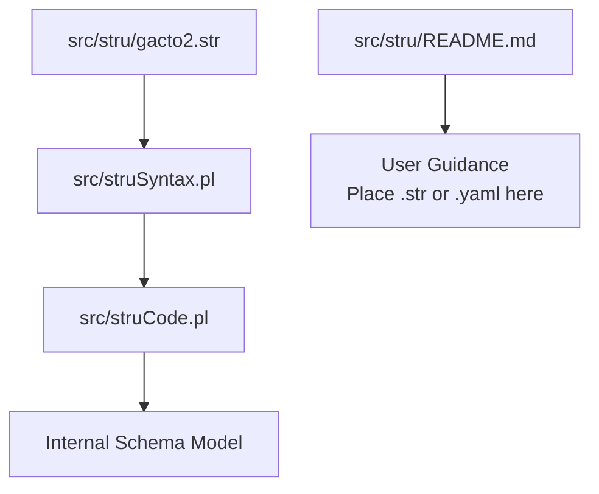
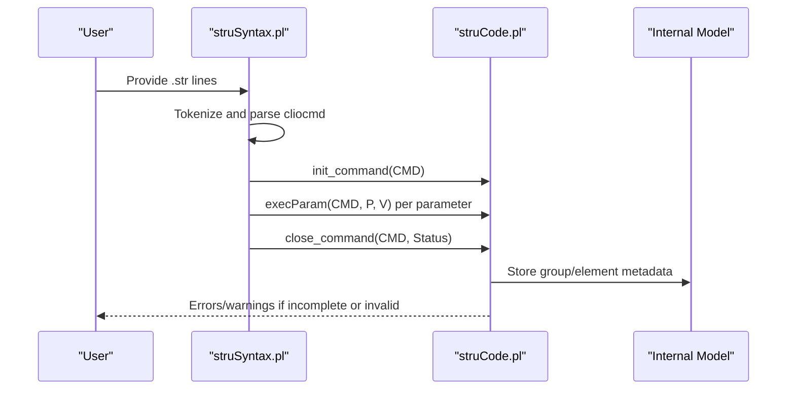
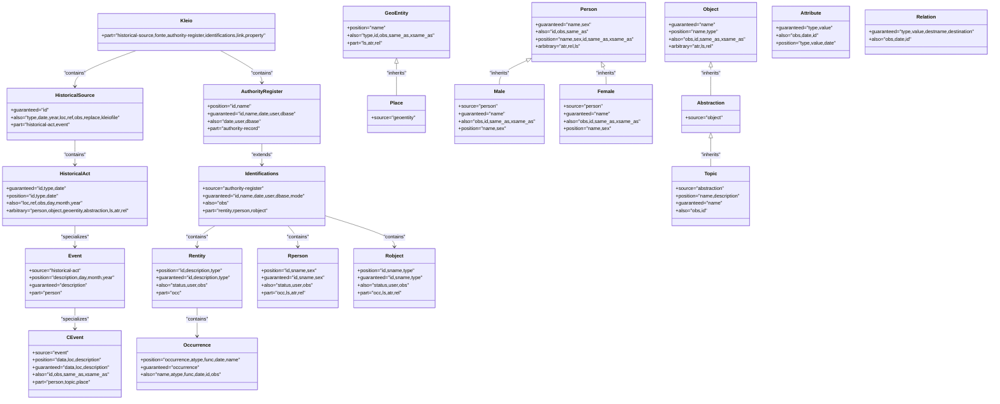
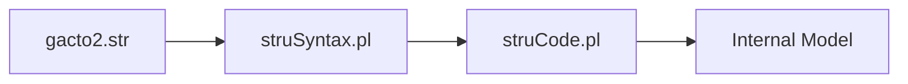

# Legacy .str Format

<cite>
**Referenced Files in This Document**
- [gacto2.str](file://src/stru/gacto2.str)
- [README.md](file://src/stru/README.md)
- [struSyntax.pl](file://src/struSyntax.pl)
- [struCode.pl](file://src/struCode.pl)
</cite>

## Table of Contents
1. [Introduction](#introduction)
2. [Project Structure](#project-structure)
3. [Core Components](#core-components)
4. [Architecture Overview](#architecture-overview)
5. [Detailed Component Analysis](#detailed-component-analysis)
6. [Dependency Analysis](#dependency-analysis)
7. [Performance Considerations](#performance-considerations)
8. [Troubleshooting Guide](#troubleshooting-guide)
9. [Conclusion](#conclusion)
10. [Appendices](#appendices)

## Introduction
This document explains the legacy .str format used by Kleio for schema definitions. It covers syntax, structure, and command vocabulary; element and group definitions; inheritance patterns; validation rules; and practical examples for modeling persons, locations, events, and relationships. It also provides migration guidance to YAML, common pitfalls, error messages, and debugging techniques specific to .str files.

The .str format is a text-based schema language that defines:
- Base elements (data types and primitives)
- Groups (hierarchical containers with ordering and repetition)
- Inheritance via source/fons parameters
- Validation constraints such as guaranteed fields and position ordering
- File-level configuration via database and other commands

Kleio’s parser compiles these definitions into an internal representation used during translation and export.

## Project Structure
The legacy .str schema is primarily defined in a single large file and parsed by Prolog modules. The repository also includes a README indicating where to place structure files and noting that YAML is preferred.

**Diagram sources**
- [gacto2.str:1-120](file://src/stru/gacto2.str#L1-L120)
- [struSyntax.pl:1-120](file://src/struSyntax.pl#L1-L120)
- [struCode.pl:1-120](file://src/struCode.pl#L1-L120)
- [README.md:1-7](file://src/stru/README.md#L1-L7)

**Section sources**
- [gacto2.str:1-120](file://src/stru/gacto2.str#L1-L120)
- [README.md:1-7](file://src/stru/README.md#L1-L7)

## Core Components
- Commands:
  - database: sets top-level group and identification behavior
  - note/doc: documentation comments
  - element: declares base elements and aliases
  - part: declares groups with inheritance, ordering, repetition, and containment
- Parameters commonly used:
  - name: identifier for element or group
  - source/fons: inheritance target
  - type: data type for elements
  - position: ordered list of allowed sub-elements
  - also: unordered additional allowed sub-elements
  - guaranteed: required sub-elements
  - repeat/arbitrary: repeated sub-elements
  - identification: marks an element as an identifier
  - pars: nested group composition
- English/Latin keyword support: many Latin keywords have English equivalents recognized by the parser.

Key behaviors:
- Inheritance via source/fons allows specialization of groups and elements.
- Position enforces ordering; also allows unordered presence; guaranteed enforces presence.
- Repeat/arbitrary allow multiple occurrences.
- Identification flags mark identity-bearing elements.

**Section sources**
- [gacto2.str:28-120](file://src/stru/gacto2.str#L28-L120)
- [gacto2.str:33-120](file://src/stru/gacto2.str#L33-L120)
- [gacto2.str:110-170](file://src/stru/gacto2.str#L110-L170)
- [gacto2.str:260-420](file://src/stru/gacto2.str#L260-L420)
- [struSyntax.pl:355-416](file://src/struSyntax.pl#L355-L416)
- [struCode.pl:148-280](file://src/struCode.pl#L148-L280)

## Architecture Overview
The .str parsing pipeline consists of lexical analysis, syntactic compilation, and execution of semantic actions.

**Diagram sources**
- [struSyntax.pl:48-120](file://src/struSyntax.pl#L48-L120)
- [struCode.pl:85-120](file://src/struCode.pl#L85-L120)
- [struCode.pl:148-280](file://src/struCode.pl#L148-L280)

## Detailed Component Analysis

### Command Vocabulary and Syntax
- Database command:
  - Sets top-level group and identification mode.
  - Example usage pattern appears at the beginning of the schema.
- Note/doc:
  - Documentation comments; doc annotations can be attached to groups and elements.
- Element declarations:
  - Define primitive types and aliases.
  - Support type assignment and identification flag.
- Group declarations:
  - Use part with name and optional source/fons for inheritance.
  - Specify position, also, guaranteed, repeat/arbitrary, pars, and identification.

Keyword mapping:
- The parser recognizes both Latin and English keywords for parameters like nomen/name, fons/source, etc.

**Section sources**
- [gacto2.str:28-120](file://src/stru/gacto2.str#L28-L120)
- [gacto2.str:33-120](file://src/stru/gacto2.str#L33-L120)
- [gacto2.str:110-170](file://src/stru/gacto2.str#L110-L170)
- [struSyntax.pl:355-416](file://src/struSyntax.pl#L355-L416)
- [struCode.pl:148-280](file://src/struCode.pl#L148-L280)

### Element Definitions
- Base types include numbers, strings, and text.
- Common elements include identifiers, names, dates, references, and observation fields.
- Elements can be typed and flagged as identification-bearing.

Examples from the schema:
- Numeric date components and composite date element.
- Identifier and alias elements.
- Textual and reference elements.

**Section sources**
- [gacto2.str:33-120](file://src/stru/gacto2.str#L33-L120)

### Group Hierarchies and Inheritance
- Top-level kleio group contains structural parts.
- Historical-source and geoentity are foundational groups.
- Authority-register and identifications extend authority concepts.
- Person, male, female, object, abstraction form core entity hierarchies.
- Attribute and relation define generic content structures.

Inheritance pattern:
- Use source/fons to specialize existing groups.
- Override position, also, guaranteed, repeat/arbitrary to refine behavior.

**Section sources**
- [gacto2.str:90-170](file://src/stru/gacto2.str#L90-L170)
- [gacto2.str:260-420](file://src/stru/gacto2.str#L260-L420)

### Validation Rules
- Guaranteed fields must be present.
- Position constrains order; also allows unordered presence.
- Repeat/arbitrary permit multiple occurrences.
- Identification flags mark identity-bearing elements.

Parser enforcement:
- Missing required parameters trigger errors.
- Unknown parameters produce warnings/errors.
- Completeness checks occur on command finalization.

**Section sources**
- [struCode.pl:296-346](file://src/struCode.pl#L296-L346)
- [struSyntax.pl:77-120](file://src/struSyntax.pl#L77-L120)

### Practical Examples

#### Persons
- person: base class requiring name and sex; supports attributes, relations, and lists.
- male/female: specialized persons with explicit gender semantics.
- actorm/actorf: actor roles with extensive kinship and relational slots.

Use cases:
- Define individuals with attributes and relationships.
- Specialize for gender-specific contexts.

**Section sources**
- [gacto2.str:308-360](file://src/stru/gacto2.str#L308-L360)
- [gacto2.str:1720-1860](file://src/stru/gacto2.str#L1720-L1860)
- [gacto2.str:2496-2660](file://src/stru/gacto2.str#L2496-L2660)

#### Locations
- geoentity: spatial entities with name, type, id, and observations.
- place: specialization of geoentity.
- geodesc and hierarchical levels (geo1..geo4): structured geographic descriptions.

Use cases:
- Model places and administrative hierarchies.
- Attach attributes and relations to locations.

**Section sources**
- [gacto2.str:118-170](file://src/stru/gacto2.str#L118-L170)
- [gacto2.str:1584-1623](file://src/stru/gacto2.str#L1584-L1623)

#### Events
- historical-act: acts with id, type, date, location, and arbitrary participants.
- event: similar to act but without id; includes description.
- cevent: chronology-style event with upfront date and place.

Use cases:
- Record formal acts and informal events.
- Chronological narratives with contextual details.

**Section sources**
- [gacto2.str:258-306](file://src/stru/gacto2.str#L258-L306)

#### Relationships
- attribute: key-value pairs with optional date and observation.
- relation: typed links between entities with destination name and id.
- ls/atr and rel: concrete implementations for attributes and relations.

Use cases:
- Annotate entities with properties.
- Link entities across records.

**Section sources**
- [gacto2.str:367-398](file://src/stru/gacto2.str#L367-L398)
- [gacto2.str:3041-3059](file://src/stru/gacto2.str#L3041-L3059)

### Class Diagram of Core Groups

**Diagram sources**
- [gacto2.str:90-170](file://src/stru/gacto2.str#L90-L170)
- [gacto2.str:258-306](file://src/stru/gacto2.str#L258-L306)
- [gacto2.str:308-360](file://src/stru/gacto2.str#L308-L360)
- [gacto2.str:367-398](file://src/stru/gacto2.str#L367-L398)

## Dependency Analysis
Parsing dependencies:
- struSyntax.pl implements the grammar and keyword recognition.
- struCode.pl executes semantic actions, validates completeness, and stores metadata.
- gacto2.str provides the actual schema definitions consumed by the parser.

**Diagram sources**
- [gacto2.str:1-120](file://src/stru/gacto2.str#L1-L120)
- [struSyntax.pl:1-120](file://src/struSyntax.pl#L1-L120)
- [struCode.pl:1-120](file://src/struCode.pl#L1-L120)

**Section sources**
- [struSyntax.pl:1-120](file://src/struSyntax.pl#L1-L120)
- [struCode.pl:1-120](file://src/struCode.pl#L1-L120)

## Performance Considerations
- Large schemas (e.g., gacto2.str) contain many group definitions and kinship expansions; keep hierarchies modular to reduce complexity.
- Prefer reuse via inheritance (source/fons) to avoid duplication.
- Limit overly deep nesting; use position and also judiciously to constrain parsing paths.
- Avoid excessive arbitrary/repeat unless necessary to prevent ambiguous parses.

[No sources needed since this section provides general guidance]

## Troubleshooting Guide
Common issues and diagnostics:
- Unknown command: indicates misspelled or unsupported directive.
- Bad parameter: wrong parameter name or value mismatch.
- Missing parameter: required parameter not provided.
- Equal sign expected: syntax error expecting “=” before a value.
- Completeness check failures: missing required parameters for commands.

Debugging tips:
- Inspect line numbers and last-line context reported by the parser.
- Validate parameter lists against known valid options.
- Ensure proper ordering of parameters when required.
- Use note/doc to annotate complex sections for clarity.

Error message origins:
- Parser emits errors for unknown commands, bad parameters, and missing equals signs.
- Completeness checks report missing required parameters and set status accordingly.

**Section sources**
- [struSyntax.pl:77-120](file://src/struSyntax.pl#L77-L120)
- [struCode.pl:296-346](file://src/struCode.pl#L296-L346)

## Conclusion
The legacy .str format provides a powerful, extensible schema language for defining elements, groups, inheritance, and validation rules. While YAML is now preferred for flexibility and ease of editing, understanding .str remains essential for maintaining and migrating existing schemas. By following best practices—modular design, clear inheritance, and careful validation—you can maintain robust and understandable schemas.

[No sources needed since this section summarizes without analyzing specific files]

## Appendices

### Migration Guidance: .str to YAML
- Preferred format: YAML structure files are recommended for greater flexibility and easier editing.
- Placement: Put structure files in the designated directory; default structure file is sources-structure.yaml.
- Mapping considerations:
  - element -> YAML element definitions
  - part -> YAML group definitions
  - source/fons -> inheritance mapping
  - position/also/guaranteed/repeat -> YAML field constraints
  - identification -> YAML identifier flags
- Compatibility:
  - Preserve semantics of validation rules and inheritance.
  - Maintain consistent naming conventions for elements and groups.
  - Keep documentation notes aligned with YAML comments.

**Section sources**
- [README.md:1-7](file://src/stru/README.md#L1-L7)