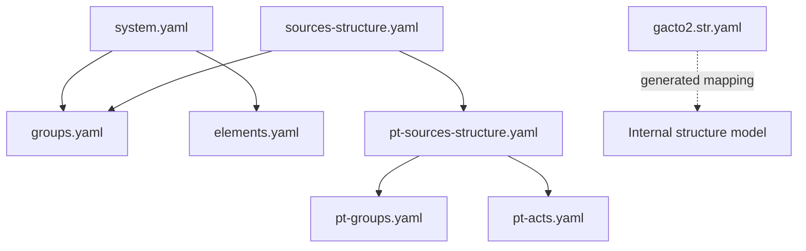
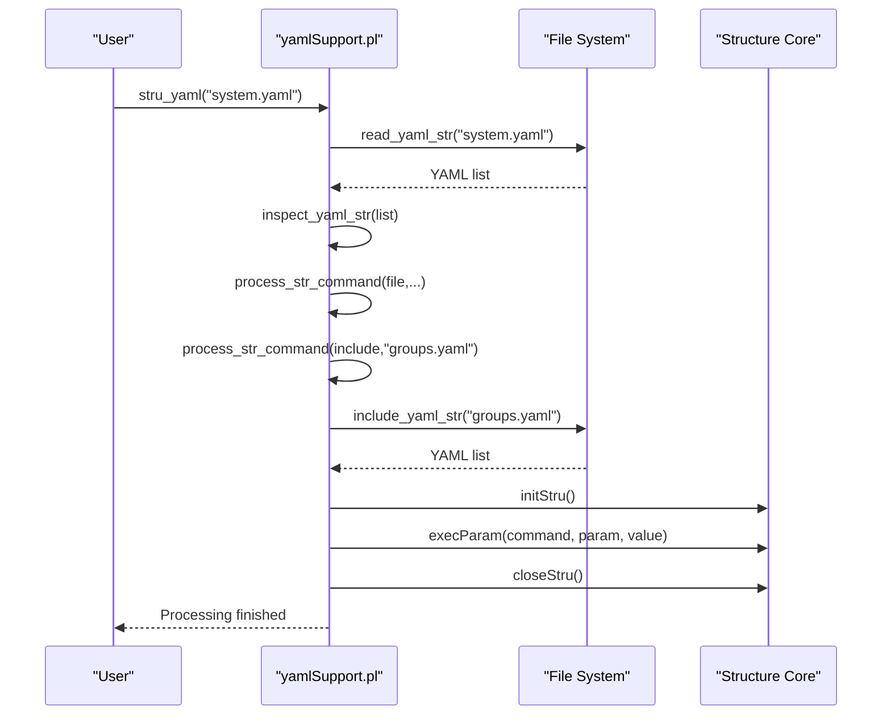
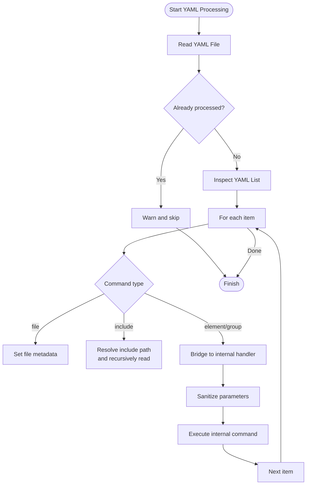
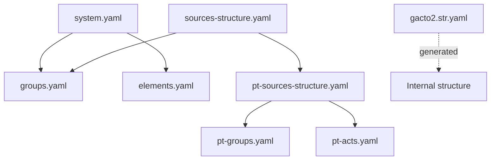

# Advanced Features and Extensions

<cite>
**Referenced Files in This Document**
- [yamlSupport.pl](file://src/yamlSupport.pl)
- [elements.yaml](file://src/stru/elements.yaml)
- [groups.yaml](file://src/stru/groups.yaml)
- [system.yaml](file://src/stru/system.yaml)
- [sources-structure.yaml](file://src/stru/sources-structure.yaml)
- [pt-sources-structure.yaml](file://src/stru/pt-sources-structure.yaml)
- [pt-groups.yaml](file://src/stru/pt-groups.yaml)
- [pt-acts.yaml](file://src/stru/pt-acts.yaml)
- [gacto2.str.yaml](file://src/stru/gacto2.str.yaml)
</cite>

## Table of Contents
1. [Introduction](#introduction)
2. [Project Structure](#project-structure)
3. [Core Components](#core-components)
4. [Architecture Overview](#architecture-overview)
5. [Detailed Component Analysis](#detailed-component-analysis)
6. [Dependency Analysis](#dependency-analysis)
7. [Performance Considerations](#performance-considerations)
8. [Troubleshooting Guide](#troubleshooting-guide)
9. [Conclusion](#conclusion)
10. [Appendices](#appendices)

## Introduction
This document explains advanced YAML schema features and extension mechanisms used by the project’s structure system. It focuses on:
- Conditional logic and validation constraints via group definitions
- Template patterns through element and group inheritance
- Dynamic includes for modular schemas
- Custom processing hooks bridging YAML commands to internal processing
- Integration with external systems (linked data links, properties)
- Custom validators enforced by guaranteed and position semantics
- Complex scenarios including inheritance, composition, and polymorphism
- Performance optimization techniques and troubleshooting guidance

The goal is to help you design robust, reusable, and high-performance schemas that model historical sources effectively.

## Project Structure
The schema system is implemented as a YAML-driven processor that reads structured YAML files, resolves includes, and dispatches commands to internal processing routines. Core schema components are organized into reusable modules:
- Base elements and groups
- Domain-specific extensions (e.g., Portuguese sources)
- Entry points that compose these modules

**Diagram sources**
- [system.yaml:1-4](file://src/stru/system.yaml#L1-L4)
- [sources-structure.yaml:1-10](file://src/stru/sources-structure.yaml#L1-L10)
- [pt-sources-structure.yaml:1-4](file://src/stru/pt-sources-structure.yaml#L1-L4)
- [gacto2.str.yaml:1-6](file://src/stru/gacto2.str.yaml#L1-L6)

**Section sources**
- [system.yaml:1-4](file://src/stru/system.yaml#L1-L4)
- [sources-structure.yaml:1-10](file://src/stru/sources-structure.yaml#L1-L10)
- [pt-sources-structure.yaml:1-4](file://src/stru/pt-sources-structure.yaml#L1-L4)

## Core Components
- YAML processor module: Reads YAML, manages include stack, normalizes values, and dispatches commands to internal handlers.
- Element definitions: Reusable building blocks with types, descriptions, and optional source inheritance.
- Group definitions: Compose elements, enforce required fields, control ordering, and define containment relationships.
- Extension layers: Regional or domain-specific schemas extend core groups and elements.

Key responsibilities:
- File-level metadata and description
- Include resolution and deduplication
- Command routing and parameter sanitization
- Bridging YAML constructs to internal structure processing

**Section sources**
- [yamlSupport.pl:28-46](file://src/yamlSupport.pl#L28-L46)
- [yamlSupport.pl:49-72](file://src/yamlSupport.pl#L49-L72)
- [yamlSupport.pl:94-100](file://src/yamlSupport.pl#L94-L100)
- [yamlSupport.pl:118-130](file://src/yamlSupport.pl#L118-L130)
- [yamlSupport.pl:132-141](file://src/yamlSupport.pl#L132-L141)
- [yamlSupport.pl:159-168](file://src/yamlSupport.pl#L159-L168)
- [yamlSupport.pl:174-178](file://src/yamlSupport.pl#L174-L178)
- [yamlSupport.pl:192-196](file://src/yamlSupport.pl#L192-L196)

## Architecture Overview
The YAML schema system follows a layered architecture:
- YAML layer: Declarative schema definitions using file, include, element, and group directives.
- Processor layer: Parses YAML, resolves includes, sanitizes parameters, and invokes internal handlers.
- Internal structure layer: Maintains structure state, validates constraints, and prepares data for downstream processing.

**Diagram sources**
- [yamlSupport.pl:28-46](file://src/yamlSupport.pl#L28-L46)
- [yamlSupport.pl:49-72](file://src/yamlSupport.pl#L49-L72)
- [yamlSupport.pl:94-100](file://src/yamlSupport.pl#L94-L100)
- [yamlSupport.pl:118-130](file://src/yamlSupport.pl#L118-L130)
- [yamlSupport.pl:132-141](file://src/yamlSupport.pl#L132-L141)
- [yamlSupport.pl:192-196](file://src/yamlSupport.pl#L192-L196)

## Detailed Component Analysis

### YAML Processor and Commands
The processor supports:
- file: Declares file metadata and description
- include: Dynamically includes other YAML files
- element/group: Bridges to internal command handlers for structure definition
- name/description: Contextual commands within file scope

Processing flow highlights:
- Deduplicates previously processed files and warns when re-included
- Normalizes string values to atoms for consistent handling
- Prepends specific parameters (e.g., source, name) to ensure correct order during execution

**Diagram sources**
- [yamlSupport.pl:49-72](file://src/yamlSupport.pl#L49-L72)
- [yamlSupport.pl:75-91](file://src/yamlSupport.pl#L75-L91)
- [yamlSupport.pl:94-100](file://src/yamlSupport.pl#L94-L100)
- [yamlSupport.pl:118-130](file://src/yamlSupport.pl#L118-L130)
- [yamlSupport.pl:159-168](file://src/yamlSupport.pl#L159-L168)
- [yamlSupport.pl:174-178](file://src/yamlSupport.pl#L174-L178)

**Section sources**
- [yamlSupport.pl:28-46](file://src/yamlSupport.pl#L28-L46)
- [yamlSupport.pl:49-72](file://src/yamlSupport.pl#L49-L72)
- [yamlSupport.pl:75-91](file://src/yamlSupport.pl#L75-L91)
- [yamlSupport.pl:94-100](file://src/yamlSupport.pl#L94-L100)
- [yamlSupport.pl:118-130](file://src/yamlSupport.pl#L118-L130)
- [yamlSupport.pl:132-141](file://src/yamlSupport.pl#L132-L141)
- [yamlSupport.pl:159-168](file://src/yamlSupport.pl#L159-L168)
- [yamlSupport.pl:174-178](file://src/yamlSupport.pl#L174-L178)
- [yamlSupport.pl:192-196](file://src/yamlSupport.pl#L192-L196)

### Elements and Types
Elements define reusable data primitives and semantic building blocks:
- Basic types: number, string64, string256, text, json
- Date-related: day, month, year, date, date_extra_info
- Identification and linking: id, same_as, xsame_as, entity, origin, destination
- Standard attributes: type, value, class, loc, name, description, destname, sname, sex
- Observations and summaries: obs, summary
- Source provenance: ref, page, pages, title
- Processing controls: replaces, replace, subs, autorels, prefix, structure, translations, translator, urlpattern, shortname, inside
- Metadata: groupname, level, line, kleiofile
- Authority record fields: atype, dbase, func, mode, occurrence, status, user

Inheritance pattern:
- Many elements use source to inherit from base types or specialized elements, enabling polymorphic reuse.

**Section sources**
- [elements.yaml:39-57](file://src/stru/elements.yaml#L39-L57)
- [elements.yaml:61-83](file://src/stru/elements.yaml#L61-L83)
- [elements.yaml:86-125](file://src/stru/elements.yaml#L86-L125)
- [elements.yaml:129-177](file://src/stru/elements.yaml#L129-L177)
- [elements.yaml:182-211](file://src/stru/elements.yaml#L182-L211)
- [elements.yaml:220-275](file://src/stru/elements.yaml#L220-L275)
- [elements.yaml:277-305](file://src/stru/elements.yaml#L277-L305)

### Groups and Composition
Groups define entities and their allowed contents:
- Top-level container: kleio
- Historical sources: historical-source, source alias
- Authority registers: authority-register, identifications
- Links and properties: link, property
- Events and acts: event, historical-act, cevent, pevent, ulist, text
- Entities: entity, geoentity/place, person/female/male, object/abstraction/topic
- Attributes and relations: attribute/ls/attr/atr, relation/rel
- Structural helpers: end, group-element, relation-type, attribute-list
- Hierarchical geography: geodesc, geo1..geo4

Composition features:
- position: Ordered elements without explicit names
- guaranteed: Required elements
- also: Optional elements
- contains/part/arbitrary: Allowed subgroups
- idprefix: Default ID prefixes
- source: Inheritance from another group

Polymorphism examples:
- female/male extend person
- place extends geoentity
- rperson/robject extend rentity
- pt-acto/evento/item/bem/fogo/viagem/pevento extend core groups

**Section sources**
- [groups.yaml:69-108](file://src/stru/groups.yaml#L69-L108)
- [groups.yaml:110-139](file://src/stru/groups.yaml#L110-L139)
- [groups.yaml:141-176](file://src/stru/groups.yaml#L141-L176)
- [groups.yaml:178-216](file://src/stru/groups.yaml#L178-L216)
- [groups.yaml:219-292](file://src/stru/groups.yaml#L219-L292)
- [groups.yaml:294-350](file://src/stru/groups.yaml#L294-L350)
- [groups.yaml:353-480](file://src/stru/groups.yaml#L353-L480)
- [groups.yaml:481-522](file://src/stru/groups.yaml#L481-L522)
- [groups.yaml:524-569](file://src/stru/groups.yaml#L524-L569)
- [groups.yaml:571-638](file://src/stru/groups.yaml#L571-L638)
- [groups.yaml:639-686](file://src/stru/groups.yaml#L639-L686)

### Conditional Logic and Validation
Conditional behavior and validation are expressed declaratively:
- guaranteed enforces presence of required fields
- position constrains ordering and allows shorthand notation
- also permits optional fields
- arbitrary lists allow flexible substructures where needed
- end triggers processing boundaries and inference rules

These constraints act as custom validators, ensuring schema conformance before data processing.

**Section sources**
- [groups.yaml:69-108](file://src/stru/groups.yaml#L69-L108)
- [groups.yaml:219-292](file://src/stru/groups.yaml#L219-L292)
- [groups.yaml:481-522](file://src/stru/groups.yaml#L481-L522)

### Template Patterns and Inheritance
Template patterns are achieved via:
- element.source: Reuse base types and specialized elements
- group.source: Extend core groups with additional fields and constraints
- Aliases: Provide convenient names (e.g., source for historical-source, place for geoentity)

Complex inheritance chains:
- person -> female/male -> kin-* actors
- entity -> geoentity -> place
- authority-register -> identifications -> rentity -> rperson/robject
- historical-source -> historical-act -> cevent/pevent -> domain-specific events

**Section sources**
- [elements.yaml:86-125](file://src/stru/elements.yaml#L86-L125)
- [groups.yaml:373-451](file://src/stru/groups.yaml#L373-L451)
- [groups.yaml:306-350](file://src/stru/groups.yaml#L306-L350)
- [groups.yaml:110-139](file://src/stru/groups.yaml#L110-L139)

### Dynamic Includes and Modular Schemas
Dynamic includes enable modular organization:
- system.yaml composes core modules
- sources-structure.yaml adds regional extensions
- pt-sources-structure.yaml further includes Portuguese-specific groups and acts

Includes are resolved relative to the current file context and normalized paths.

**Section sources**
- [system.yaml:1-4](file://src/stru/system.yaml#L1-L4)
- [sources-structure.yaml:1-10](file://src/stru/sources-structure.yaml#L1-L10)
- [pt-sources-structure.yaml:1-4](file://src/stru/pt-sources-structure.yaml#L1-L4)

### Custom Processing Hooks
Custom hooks bridge YAML commands to internal processing:
- process_str_command routes file/include/element/group/name/description
- process_str_params extracts and orders parameters
- sanitize_value ensures consistent atom/string handling
- prepend_if_member ensures critical parameters (source, name) are prioritized

These hooks allow extensibility while maintaining backward compatibility with legacy Latin commands.

**Section sources**
- [yamlSupport.pl:94-100](file://src/yamlSupport.pl#L94-L100)
- [yamlSupport.pl:118-130](file://src/yamlSupport.pl#L118-L130)
- [yamlSupport.pl:132-141](file://src/yamlSupport.pl#L132-L141)
- [yamlSupport.pl:159-168](file://src/yamlSupport.pl#L159-L168)
- [yamlSupport.pl:174-178](file://src/yamlSupport.pl#L174-L178)

### Integration with External Systems
Integration points:
- link group defines shortcuts for linked data targets with URL patterns
- property group configures parser behavior (not stored in database)
- urlpattern and shortname support dynamic linking annotations in comments

These features facilitate integration with external knowledge bases and linked data ecosystems.

**Section sources**
- [groups.yaml:178-216](file://src/stru/groups.yaml#L178-L216)

### Complex Scenarios: Inheritance, Composition, Polymorphism
Examples:
- Inheritance: female/male extend person; place extends geoentity; rperson/robject extend rentity
- Composition: historical-source contains historical-act, event, text; attribute-list contains multiple entities
- Polymorphism: Same element names across different contexts (e.g., ls/atr/rel reused widely), controlled by group constraints

```mermaid
classDiagram
class Person {
+position : [name, sex]
+guaranteed : [name, sex]
+also : [id, obs, same_as, xsame_as]
+contains : [attribute, relation, pevent]
}
class Female {
+source : person
+position : [name]
+guaranteed : [name]
}
class Male {
+source : person
+position : [name]
+guaranteed : [name]
}
class GeoEntity {
+source : entity
+position : [name, type]
+guaranteed : [name]
}
class Place {
+source : geoentity
}
class Rentity {
+source : authority-record
+contains : [occ]
}
class RPerson {
+source : rentity
+contains : [occ, ls, atr, rel, attribute, relation]
}
class RObject {
+source : rentity
+contains : [occ, ls, atr, rel, attribute, relation]
}
class HistoricalSource {
+source : entity
+contains : [historical-act, event, text]
}
class HistoricalAct {
+source : event
+contains : [person, object, geoentity, abstraction, ls, atr, rel, cevent, end]
}
class Event {
+position : [description, date]
+guaranteed : [description]
+contains : [person, object, geoentity, abstraction, ls, atr, rel, end]
}
class Attribute {
+position : [type, value, date]
+guaranteed : [type, value]
}
class Relation {
+position : [type, value, destname, destination, date]
+guaranteed : [type, value, destname, destination]
}
class Occurrence {
+position : [occurrence, atype, func, date, name]
+guaranteed : [occurrence]
}
Female --|> Person
Male --|> Person
Place --|> GeoEntity
RPerson --|> Rentity
RObject --|> Rentity
HistoricalAct --|> Event
HistoricalSource --|> Entity
Attribute <.. Person : "contained by"
Relation <.. Person : "contained by"
Occurrence <.. Rentity : "contained by"
```

**Diagram sources**
- [groups.yaml:373-451](file://src/stru/groups.yaml#L373-L451)
- [groups.yaml:353-372](file://src/stru/groups.yaml#L353-L372)
- [groups.yaml:306-350](file://src/stru/groups.yaml#L306-L350)
- [groups.yaml:219-292](file://src/stru/groups.yaml#L219-L292)
- [groups.yaml:524-569](file://src/stru/groups.yaml#L524-L569)
- [groups.yaml:524-569](file://src/stru/groups.yaml#L524-L569)
- [groups.yaml:524-569](file://src/stru/groups.yaml#L524-L569)

**Section sources**
- [groups.yaml:373-451](file://src/stru/groups.yaml#L373-L451)
- [groups.yaml:353-372](file://src/stru/groups.yaml#L353-L372)
- [groups.yaml:306-350](file://src/stru/groups.yaml#L306-L350)
- [groups.yaml:219-292](file://src/stru/groups.yaml#L219-L292)
- [groups.yaml:524-569](file://src/stru/groups.yaml#L524-L569)

### Regional Extensions: Portuguese Sources
Portuguese-specific schemas extend core groups:
- fonte extends historical-source with local conventions
- pt-acto/evento/item/bem/fogo/viagem/pevento provide domain-specific structures
- Acts like casamento, obito, escritura, devassa, etc., specialize generic acts

These extensions demonstrate how to adapt core schemas to regional documentation styles while preserving shared semantics.

**Section sources**
- [pt-groups.yaml:21-72](file://src/stru/pt-groups.yaml#L21-L72)
- [pt-groups.yaml:73-151](file://src/stru/pt-groups.yaml#L73-L151)
- [pt-groups.yaml:152-238](file://src/stru/pt-groups.yaml#L152-L238)
- [pt-acts.yaml:1-120](file://src/stru/pt-acts.yaml#L1-L120)
- [pt-acts.yaml:474-540](file://src/stru/pt-acts.yaml#L474-L540)
- [pt-acts.yaml:679-800](file://src/stru/pt-acts.yaml#L679-L800)

### Generated Mapping Example
The generated YAML mapping demonstrates how internal structure models can be exported back to YAML for reference and tooling:
- file metadata includes json_path, yaml_path, origin
- element and group definitions mirror internal structure

This illustrates round-trip capabilities and consistency between internal models and YAML representations.

**Section sources**
- [gacto2.str.yaml:1-6](file://src/stru/gacto2.str.yaml#L1-L6)
- [gacto2.str.yaml:209-234](file://src/stru/gacto2.str.yaml#L209-L234)
- [gacto2.str.yaml:269-292](file://src/stru/gacto2.str.yaml#L269-L292)
- [gacto2.str.yaml:333-352](file://src/stru/gacto2.str.yaml#L333-L352)
- [gacto2.str.yaml:360-385](file://src/stru/gacto2.str.yaml#L360-L385)
- [gacto2.str.yaml:393-405](file://src/stru/gacto2.str.yaml#L393-L405)
- [gacto2.str.yaml:420-433](file://src/stru/gacto2.str.yaml#L420-L433)
- [gacto2.str.yaml:434-454](file://src/stru/gacto2.str.yaml#L434-L454)
- [gacto2.str.yaml:469-491](file://src/stru/gacto2.str.yaml#L469-L491)
- [gacto2.str.yaml:499-521](file://src/stru/gacto2.str.yaml#L499-L521)
- [gacto2.str.yaml:522-542](file://src/stru/gacto2.str.yaml#L522-L542)
- [gacto2.str.yaml:564-594](file://src/stru/gacto2.str.yaml#L564-L594)
- [gacto2.str.yaml:595-626](file://src/stru/gacto2.str.yaml#L595-L626)
- [gacto2.str.yaml:627-659](file://src/stru/gacto2.str.yaml#L627-L659)
- [gacto2.str.yaml:660-681](file://src/stru/gacto2.str.yaml#L660-L681)
- [gacto2.str.yaml:682-701](file://src/stru/gacto2.str.yaml#L682-L701)
- [gacto2.str.yaml:702-721](file://src/stru/gacto2.str.yaml#L702-L721)
- [gacto2.str.yaml:722-740](file://src/stru/gacto2.str.yaml#L722-L740)
- [gacto2.str.yaml:741-759](file://src/stru/gacto2.str.yaml#L741-L759)
- [gacto2.str.yaml:761-779](file://src/stru/gacto2.str.yaml#L761-L779)
- [gacto2.str.yaml:780-795](file://src/stru/gacto2.str.yaml#L780-L795)
- [gacto2.str.yaml:796-800](file://src/stru/gacto2.str.yaml#L796-L800)

## Dependency Analysis
Schema dependencies form a clear hierarchy:
- system.yaml depends on groups.yaml and elements.yaml
- sources-structure.yaml depends on core modules and regional extensions
- pt-sources-structure.yaml composes Portuguese-specific modules
- gacto2.str.yaml reflects generated mappings aligned with internal structure

**Diagram sources**
- [system.yaml:1-4](file://src/stru/system.yaml#L1-L4)
- [sources-structure.yaml:1-10](file://src/stru/sources-structure.yaml#L1-L10)
- [pt-sources-structure.yaml:1-4](file://src/stru/pt-sources-structure.yaml#L1-L4)
- [gacto2.str.yaml:1-6](file://src/stru/gacto2.str.yaml#L1-L6)

**Section sources**
- [system.yaml:1-4](file://src/stru/system.yaml#L1-L4)
- [sources-structure.yaml:1-10](file://src/stru/sources-structure.yaml#L1-L10)
- [pt-sources-structure.yaml:1-4](file://src/stru/pt-sources-structure.yaml#L1-L4)

## Performance Considerations
Optimization strategies:
- Deduplicate includes to avoid redundant processing
- Normalize paths early to minimize filesystem lookups
- Use position and guaranteed to reduce validation overhead
- Prefer inheritance over duplication to keep schemas compact
- Limit arbitrary lists to necessary cases to constrain parsing complexity
- Batch parameter preprocessing (sanitize and reorder) to streamline execution

[No sources needed since this section provides general guidance]

## Troubleshooting Guide
Common issues and resolutions:
- Unknown command errors: Verify spelling and context of YAML commands
- Out-of-context name/description: Ensure they are placed within file command scope
- Duplicate includes: The processor warns and skips previously processed files; adjust include paths if unintended
- Parameter ordering: Critical parameters like source and name are prepended automatically; rely on this behavior rather than manual ordering
- Path resolution: Use normalize_str_path to resolve relative and system paths correctly

Diagnostic steps:
- Enable detailed logging via report predicates
- Check error and warning counts after processing
- Validate YAML syntax and indentation
- Review include stacks to understand nesting depth

**Section sources**
- [yamlSupport.pl:142-151](file://src/yamlSupport.pl#L142-L151)
- [yamlSupport.pl:153-158](file://src/yamlSupport.pl#L153-L158)
- [yamlSupport.pl:49-72](file://src/yamlSupport.pl#L49-L72)
- [yamlSupport.pl:192-196](file://src/yamlSupport.pl#L192-L196)

## Conclusion
The YAML schema system provides powerful mechanisms for defining complex, reusable, and validated structures. Through inheritance, composition, conditional constraints, and dynamic includes, it supports both broad modeling needs and domain-specific adaptations. Custom processing hooks enable seamless integration with internal logic and external systems. By following best practices for performance and troubleshooting, you can build robust schemas that scale effectively.

[No sources needed since this section summarizes without analyzing specific files]

## Appendices
- Glossary:
  - Position: Ordered elements without explicit names
  - Guaranteed: Required elements
  - Also: Optional elements
  - Contains/Part/Arbitrary: Allowed subgroups
  - Source: Inheritance target for elements and groups
  - Idprefix: Default ID prefix for entities
  - Link/Property: Integration and configuration constructs

[No sources needed since this section provides general guidance]