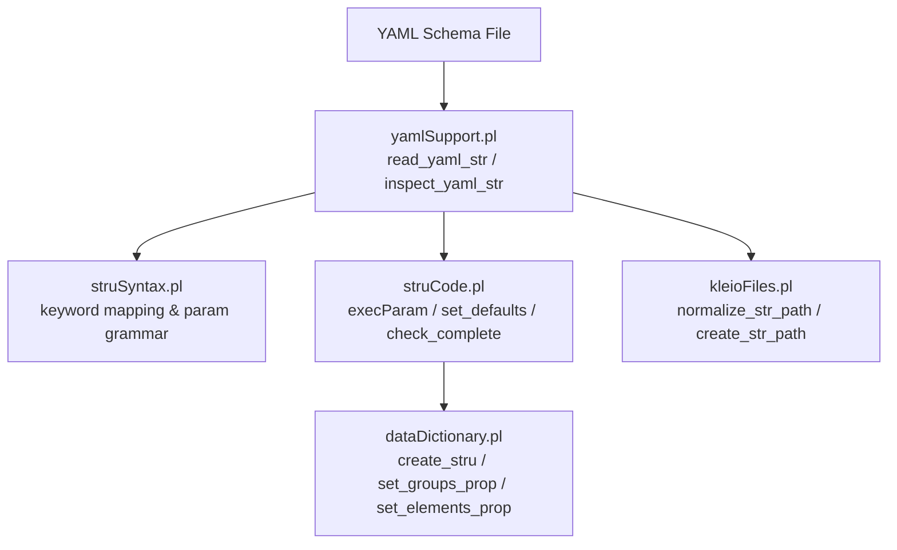
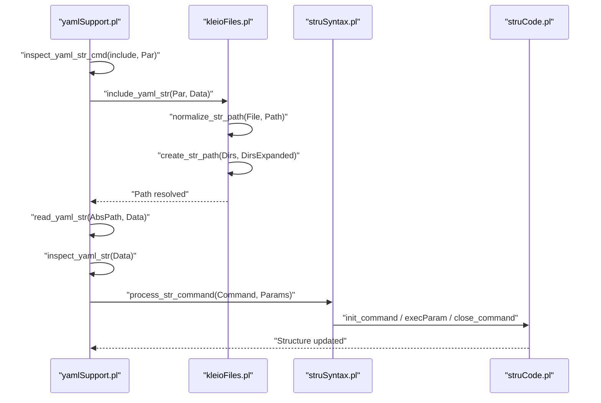
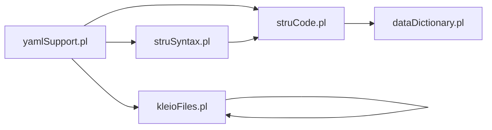

# Conditional Logic and Dynamic Processing

<cite>
**Referenced Files in This Document**
- [yamlSupport.pl](file://src/yamlSupport.pl)
- [kleioFiles.pl](file://src/kleioFiles.pl)
- [struSyntax.pl](file://src/struSyntax.pl)
- [struCode.pl](file://src/struCode.pl)
- [sources-structure.yaml](file://src/stru/sources-structure.yaml)
- [gacto2.str.yaml](file://src/stru/gacto2.str.yaml)
</cite>

## Table of Contents
1. [Introduction](#introduction)
2. [Project Structure](#project-structure)
3. [Core Components](#core-components)
4. [Architecture Overview](#architecture-overview)
5. [Detailed Component Analysis](#detailed-component-analysis)
6. [Dependency Analysis](#dependency-analysis)
7. [Performance Considerations](#performance-considerations)
8. [Troubleshooting Guide](#troubleshooting-guide)
9. [Conclusion](#conclusion)

## Introduction
This document explains how conditional logic and dynamic processing are implemented for YAML-based schema definitions in the project. It focuses on:
- How to implement conditional statements and runtime decision-making within schema definitions
- Environment-based configuration and path resolution
- Variable substitution and context-aware processing
- Practical patterns for conditional includes, parameter validation, and dynamic element generation based on external factors or user input

The system processes YAML structure files by parsing them into a command list, dispatching commands to a Prolog-based execution layer that can include other files, resolve paths relative to environment variables, and apply parameter validation and defaults.

## Project Structure
At a high level, YAML schemas are processed through a pipeline:
- YAML file is read and parsed
- Commands (like file, include, element, group) are inspected and executed
- File inclusion uses dynamic path resolution with environment-aware tokens
- Parameter values are sanitized and validated before being applied to internal structures

**Diagram sources**
- [yamlSupport.pl](file://src/yamlSupport.pl)
- [struSyntax.pl](file://src/struSyntax.pl)
- [struCode.pl](file://src/struCode.pl)
- [kleioFiles.pl](file://src/kleioFiles.pl)

**Section sources**
- [yamlSupport.pl](file://src/yamlSupport.pl)
- [kleioFiles.pl](file://src/kleioFiles.pl)

## Core Components
- YAML loader and inspector: reads YAML, tracks stack and duplicates, inspects commands, and delegates to execution layer
- Path resolver: resolves include paths using environment variables and current file context
- Command executor: validates parameters, applies defaults, and updates internal structures
- Keyword mapper: maps English/Latin keywords to canonical forms used by the executor

Key responsibilities:
- Conditional includes via include command and path normalization
- Environment-driven configuration via KLEIO_* variables
- Parameter validation and ordering constraints (e.g., name/source precedence)
- Context-aware processing using persistent values like yaml_file and stru_files_stack

**Section sources**
- [yamlSupport.pl](file://src/yamlSupport.pl)
- [kleioFiles.pl](file://src/kleioFiles.pl)
- [struSyntax.pl](file://src/struSyntax.pl)
- [struCode.pl](file://src/struCode.pl)

## Architecture Overview
The following sequence shows how an include directive triggers dynamic processing and path resolution:

**Diagram sources**
- [yamlSupport.pl](file://src/yamlSupport.pl)
- [kleioFiles.pl](file://src/kleioFiles.pl)
- [struSyntax.pl](file://src/struSyntax.pl)
- [struCode.pl](file://src/struCode.pl)

## Detailed Component Analysis

### YAML Loader and Inspector (Conditional Includes and Runtime Dispatch)
- Reads YAML and maintains a stack of files to avoid reprocessing and to provide context for relative paths
- Inspects each top-level item; supports file metadata and include directives
- For include, resolves the target path and recursively loads it
- Ensures deterministic parameter order by moving critical keys (name/source) to the front before execution

Practical implications:
- Use include to conditionally assemble schemas from multiple fragments
- Leverage path tokens (system, structures, sources, home) to select different fragments based on environment
- Avoid duplicate includes; the loader warns when encountering previously processed files

**Section sources**
- [yamlSupport.pl](file://src/yamlSupport.pl)

### Path Resolution and Environment-Based Configuration
- normalize_str_path handles two cases:
  - If the include path ends with .yaml/.yml, it is treated as relative to the current YAML file’s directory
  - Otherwise, it splits on dots and expands tokens via create_str_path
- create_str_path recognizes tokens:
  - system: resolves to the configured structures directory
  - structures: resolves to user-specific or local structures directory
  - sources: resolves to user-specific or local sources directory
  - home: resolves to the Kleio home directory
  - ~: resolves to the directory of the main YAML file
- kleio_home_dir and related predicates determine base directories using environment variables such as KLEIO_HOME_DIR, KLEIO_STRU_DIR, KLEIO_SOURCE_DIR, etc.

Practical implications:
- Compose include paths like system/foo.yaml or structures/bar.yaml to switch behavior across environments
- Override directories via environment variables without changing schema content
- Reference files relative to the current YAML file using dot-separated tokens ending with a filename

**Section sources**
- [kleioFiles.pl](file://src/kleioFiles.pl)

### Command Execution and Parameter Validation
- Keywords are normalized via struSyntax keyword mapping (English/Latin equivalents)
- Parameters are sanitized (strings converted to atoms) and ordered to ensure required keys precede dependent ones
- execParam enforces parameter validity and sets properties on groups/elements; defaults are applied where needed
- Completeness checks validate required parameters and propagate status back to the caller

Practical implications:
- Validate presence and type of parameters at parse time
- Enforce ordering constraints (e.g., name must be known before applying fons/source)
- Centralize default handling and error reporting

**Section sources**
- [struSyntax.pl](file://src/struSyntax.pl)
- [struCode.pl](file://src/struCode.pl)
- [yamlSupport.pl](file://src/yamlSupport.pl)

### Example: Conditional Includes Based on Environment
A root schema can include different fragments depending on environment tokens:
- Include core elements and groups unconditionally
- Include domain-specific parts only when certain tokens are present
- Use environment variables to point to alternate structures or sources

Example references:
- Root assembly file demonstrates include usage
- Large generated schema shows extensive use of element/group definitions and source inheritance

**Section sources**
- [sources-structure.yaml](file://src/stru/sources-structure.yaml)
- [gacto2.str.yaml](file://src/stru/gacto2.str.yaml)

## Dependency Analysis
The following diagram shows key dependencies between modules involved in conditional and dynamic processing:

**Diagram sources**
- [yamlSupport.pl](file://src/yamlSupport.pl)
- [struSyntax.pl](file://src/struSyntax.pl)
- [struCode.pl](file://src/struCode.pl)
- [kleioFiles.pl](file://src/kleioFiles.pl)

**Section sources**
- [yamlSupport.pl](file://src/yamlSupport.pl)
- [kleioFiles.pl](file://src/kleioFiles.pl)
- [struSyntax.pl](file://src/struSyntax.pl)
- [struCode.pl](file://src/struCode.pl)

## Performance Considerations
- Duplicate include detection prevents redundant parsing and reduces overhead
- Path resolution is tokenized and memoized implicitly by environment state; keep include graphs shallow to minimize recursion depth
- Parameter sanitization and ordering add minimal overhead but improve robustness
- Prefer modular includes to distribute complexity and enable selective loading

[No sources needed since this section provides general guidance]

## Troubleshooting Guide
Common issues and diagnostics:
- Unknown command in YAML: indicates misspelled or unsupported directive; verify against supported commands
- Missing required parameters: completeness checks report missing keys; ensure name and other required fields are provided
- Include path resolution failures: confirm tokens (system, structures, sources, home) and environment variables are correctly set; verify file existence
- Duplicate includes: warnings indicate previously processed files; adjust include graph to avoid cycles or redundant inclusions

Operational hints:
- Use logging/reporting predicates to trace reading and inspection steps
- Check environment variables controlling directories (KLEIO_HOME_DIR, KLEIO_STRU_DIR, KLEIO_SOURCE_DIR)
- Validate parameter ordering by ensuring name/source appear early in the dict

**Section sources**
- [yamlSupport.pl](file://src/yamlSupport.pl)
- [kleioFiles.pl](file://src/kleioFiles.pl)
- [struCode.pl](file://src/struCode.pl)

## Conclusion
The system implements conditional logic and dynamic processing in YAML schemas primarily through:
- Conditional includes driven by environment-aware path tokens
- Robust parameter validation and default application
- Context-aware processing using persistent values (current file, stack, environment)

These mechanisms allow flexible, maintainable schema composition that adapts to different environments and user inputs while preserving strong validation and clear error reporting.