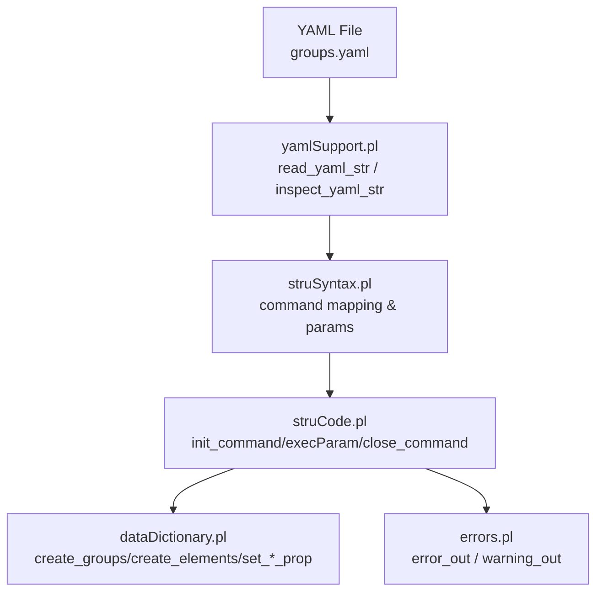
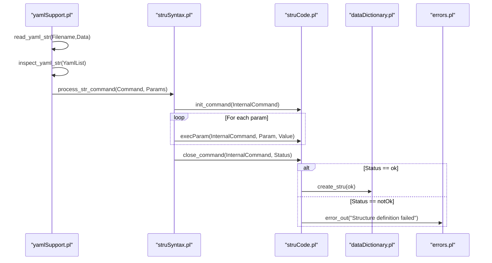
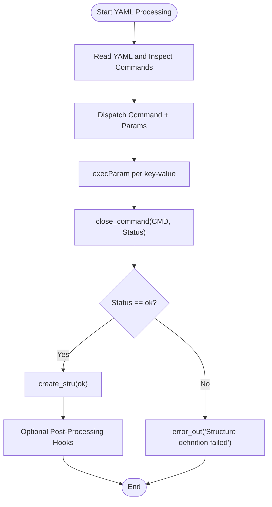
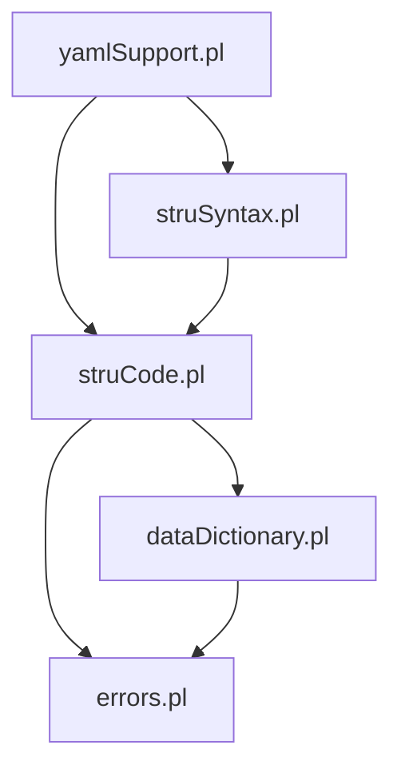

# Custom Validators and Hooks

<cite>
**Referenced Files in This Document**
- [yamlSupport.pl](file://src/yamlSupport.pl)
- [struCode.pl](file://src/struCode.pl)
- [struSyntax.pl](file://src/struSyntax.pl)
- [dataDictionary.pl](file://src/dataDictionary.pl)
- [errors.pl](file://src/errors.pl)
- [groups.yaml](file://src/stru/groups.yaml)
</cite>

## Table of Contents
1. [Introduction](#introduction)
2. [Project Structure](#project-structure)
3. [Core Components](#core-components)
4. [Architecture Overview](#architecture-overview)
5. [Detailed Component Analysis](#detailed-component-analysis)
6. [Dependency Analysis](#dependency-analysis)
7. [Performance Considerations](#performance-considerations)
8. [Troubleshooting Guide](#troubleshooting-guide)
9. [Conclusion](#conclusion)
10. [Appendices](#appendices)

## Introduction
This document explains how to implement custom validators and processing hooks for YAML-based Kleio schemas. It covers the hook architecture, validation lifecycle, and error reporting mechanisms. You will learn how to:
- Write custom validation predicates (predicates that return true/false)
- Integrate with existing validation frameworks
- Create domain-specific constraints
- Implement business rule validation, cross-field validation, and integration with external validation services

The system processes YAML structure files through a command-driven pipeline. Each YAML command is mapped to an internal command, parameterized, executed, and finalized. Validation can be attached at multiple points: during parameter execution, after command completion, or as post-processing steps over the data dictionary.

## Project Structure
At a high level, YAML schema processing involves:
- YAML parsing and traversal
- Command dispatch and parameter handling
- Execution of built-in commands (e.g., group and element definitions)
- Finalization and completeness checks
- Error/warning reporting

**Diagram sources**
- [yamlSupport.pl:48-91](file://src/yamlSupport.pl#L48-L91)
- [struSyntax.pl:48-101](file://src/struSyntax.pl#L48-L101)
- [struCode.pl:91-146](file://src/struCode.pl#L91-L146)
- [dataDictionary.pl:316-387](file://src/dataDictionary.pl#L316-L387)
- [errors.pl:85-113](file://src/errors.pl#L85-L113)

**Section sources**
- [yamlSupport.pl:48-91](file://src/yamlSupport.pl#L48-L91)
- [struSyntax.pl:48-101](file://src/struSyntax.pl#L48-L101)
- [struCode.pl:91-146](file://src/struCode.pl#L91-L146)
- [dataDictionary.pl:316-387](file://src/dataDictionary.pl#L316-L387)
- [errors.pl:85-113](file://src/errors.pl#L85-L113)

## Core Components
- YAML loader and inspector: reads YAML, tracks includes, and iterates commands.
- Syntax layer: maps YAML keys to internal commands and parameters.
- Command executor: initializes commands, executes parameters, finalizes commands, and performs completeness checks.
- Data dictionary: creates groups and elements, stores properties, supports inheritance via source/fons.
- Errors module: centralizes error and warning output with context.

Key responsibilities:
- yamlSupport.pl: orchestration of reading and inspecting YAML structures.
- struSyntax.pl: keyword normalization and grammar for commands and parameters.
- struCode.pl: command lifecycle and parameter execution.
- dataDictionary.pl: creation and property management for groups and elements.
- errors.pl: structured error and warning reporting.

**Section sources**
- [yamlSupport.pl:1-46](file://src/yamlSupport.pl#L1-L46)
- [struSyntax.pl:124-181](file://src/struSyntax.pl#L124-L181)
- [struCode.pl:148-280](file://src/struCode.pl#L148-L280)
- [dataDictionary.pl:316-387](file://src/dataDictionary.pl#L316-L387)
- [errors.pl:85-113](file://src/errors.pl#L85-L113)

## Architecture Overview
The validation and hook architecture centers on three extension points:
- Parameter-level hooks: invoked when a specific parameter is processed.
- Command-finalization hooks: invoked when a command completes.
- Post-processing hooks: invoked after the structure is created.

**Diagram sources**
- [yamlSupport.pl:48-91](file://src/yamlSupport.pl#L48-L91)
- [struSyntax.pl:77-101](file://src/struSyntax.pl#L77-L101)
- [struCode.pl:91-146](file://src/struCode.pl#L91-L146)
- [dataDictionary.pl:118-126](file://src/dataDictionary.pl#L118-L126)
- [errors.pl:118-167](file://src/errors.pl#L118-L167)

## Detailed Component Analysis

### Hook Architecture and Lifecycle
- Initialization: The YAML file is read and inspected; each YAML entry becomes a command invocation.
- Parameter processing: Parameters are normalized and executed via execParam.
- Finalization: Commands are closed; completeness checks run; successful commands persist structure into the data dictionary.
- Post-processing: After create_stru, you can attach additional validations.

**Diagram sources**
- [yamlSupport.pl:48-91](file://src/yamlSupport.pl#L48-L91)
- [struCode.pl:91-146](file://src/struCode.pl#L91-L146)
- [dataDictionary.pl:118-126](file://src/dataDictionary.pl#L118-L126)

**Section sources**
- [yamlSupport.pl:48-91](file://src/yamlSupport.pl#L48-L91)
- [struCode.pl:91-146](file://src/struCode.pl#L91-L146)
- [dataDictionary.pl:118-126](file://src/dataDictionary.pl#L118-L126)

### Writing Custom Validation Predicates
A validation predicate is a pure function-like predicate that returns success or failure. Use it to enforce business rules or cross-field constraints.

Guidelines:
- Predicate signature: validate_rule(Context) where Context contains relevant schema state (e.g., group/element properties).
- Return true to pass, fail to reject.
- On failure, call error_out or warning_out with contextual information.

Integration points:
- Within execParam handlers: validate a single parameter value immediately.
- In close_command handlers: validate aggregated command state before persistence.
- As post-processing hooks: run after create_stru to check global invariants.

Example patterns (conceptual):
- Business rule: ensure required fields are present based on group type.
- Cross-field: validate relationships between two fields within the same record.
- External service: call an API to verify values asynchronously or synchronously.

**Section sources**
- [struCode.pl:148-280](file://src/struCode.pl#L148-L280)
- [errors.pl:85-113](file://src/errors.pl#L85-L113)

### Integrating With Existing Validation Frameworks
The system already provides:
- Keyword normalization and English/Latin aliases for commands and parameters.
- Built-in commands for defining groups and elements with properties like guaranteed, position, source, etc.
- Property storage and retrieval utilities for groups and elements.

To integrate:
- Map new YAML keys to internal commands using the syntax layer.
- Add execParam clauses to handle new parameters.
- Extend close_command to perform additional checks.
- Use dataDictionary utilities to query and update group/element properties.

Relevant keywords and mappings include names like name, description, source, position, guaranteed, also, idprefix, contains/part, and more. These are defined in the syntax layer and used by the command executor.

**Section sources**
- [struSyntax.pl:355-416](file://src/struSyntax.pl#L355-L416)
- [struCode.pl:148-280](file://src/struCode.pl#L148-L280)
- [dataDictionary.pl:316-387](file://src/dataDictionary.pl#L316-L387)

### Creating Domain-Specific Constraints
Domain constraints often involve:
- Type enforcement (e.g., date formats, ID prefixes)
- Cardinality and ordering rules
- Referential integrity across groups/elements
- Conditional presence of fields

Implementation approach:
- Define execParam handlers for domain-specific parameters.
- Use set_group_prop/set_element_prop to store constraint metadata.
- In close_command, evaluate constraints against stored properties.
- Report violations via error_out/warning_out with file and command context.

**Section sources**
- [struCode.pl:148-280](file://src/struCode.pl#L148-L280)
- [dataDictionary.pl:398-460](file://src/dataDictionary.pl#L398-L460)
- [errors.pl:85-113](file://src/errors.pl#L85-L113)

### Examples

#### Business Rule Validation
Goal: Ensure that if a group defines a certain property, another related property must also be present.

Approach:
- In execParam for the triggering property, assert a flag in the group’s properties.
- In close_command for the group, check the flag and require the dependent property.
- If missing, emit an error with context.

**Section sources**
- [struCode.pl:148-280](file://src/struCode.pl#L148-L280)
- [errors.pl:85-113](file://src/errors.pl#L85-L113)

#### Cross-Field Validation
Goal: Validate consistency between two fields within the same record or group.

Approach:
- Store both fields in the group/element properties.
- In close_command, compare values and enforce constraints.
- Report detailed messages including field names and values.

**Section sources**
- [struCode.pl:148-280](file://src/struCode.pl#L148-L280)
- [errors.pl:85-113](file://src/errors.pl#L85-L113)

#### Integration With External Validation Services
Goal: Offload complex validation to an external service.

Approach:
- In execParam or close_command, call an external API (e.g., HTTP request) to validate values.
- Handle timeouts and errors gracefully; convert failures into warnings or errors with context.
- Cache results if appropriate to avoid repeated calls.

Note: The exact integration mechanism depends on available libraries and environment configuration.

[No sources needed since this section provides general guidance]

## Dependency Analysis
The following diagram shows core dependencies among modules involved in validation and hooks.

**Diagram sources**
- [yamlSupport.pl:1-46](file://src/yamlSupport.pl#L1-L46)
- [struSyntax.pl:37-42](file://src/struSyntax.pl#L37-L42)
- [struCode.pl:49-55](file://src/struCode.pl#L49-L55)
- [dataDictionary.pl:87-99](file://src/dataDictionary.pl#L87-L99)
- [errors.pl:57-60](file://src/errors.pl#L57-L60)

**Section sources**
- [yamlSupport.pl:1-46](file://src/yamlSupport.pl#L1-L46)
- [struSyntax.pl:37-42](file://src/struSyntax.pl#L37-L42)
- [struCode.pl:49-55](file://src/struCode.pl#L49-L55)
- [dataDictionary.pl:87-99](file://src/dataDictionary.pl#L87-L99)
- [errors.pl:57-60](file://src/errors.pl#L57-L60)

## Performance Considerations
- Avoid expensive operations inside tight loops (e.g., many execParam calls). Prefer batched validations.
- Cache external service responses when possible.
- Use incremental checks: validate early and fail fast to reduce downstream work.
- Minimize property copying and redundant computations in close_command.

[No sources needed since this section provides general guidance]

## Troubleshooting Guide
Common issues and remedies:
- Unknown command or parameter: ensure correct spelling and supported keywords.
- Missing required parameters: add required fields or adjust defaults.
- Duplicate definitions: expect warnings about merging properties; review intended overrides.
- External service failures: handle exceptions and convert to warnings/errors with clear context.

Use error_out and warning_out consistently to capture file and command context for easier debugging.

**Section sources**
- [struSyntax.pl:114-121](file://src/struSyntax.pl#L114-L121)
- [struCode.pl:201-236](file://src/struCode.pl#L201-L236)
- [errors.pl:85-113](file://src/errors.pl#L85-L113)

## Conclusion
Custom validators and hooks in YAML schemas are implemented by extending the command lifecycle:
- Add execParam handlers for parameter-level checks.
- Extend close_command for command-level validations.
- Optionally add post-processing hooks after create_stru for global invariants.
- Use the data dictionary APIs to query and update group/element properties.
- Report issues via the centralized error module for consistent diagnostics.

This approach enables robust business rule enforcement, cross-field validation, and integration with external services while maintaining clarity and traceability.

[No sources needed since this section summarizes without analyzing specific files]

## Appendices

### YAML Schema Keys Reference
The following keys are commonly used in YAML schema definitions for groups and elements. They map to internal parameters and influence validation behavior.

- name: identifier for the group or element
- description: human-readable documentation
- source: base group/element to inherit from
- position: ordered list of positional elements
- guaranteed: required elements
- also: optional elements
- idprefix: prefix for identifiers
- contains/part: nested groups allowed

These keys are documented in the schema definition files and mapped to internal commands and parameters.

**Section sources**
- [groups.yaml:1-30](file://src/stru/groups.yaml#L1-L30)
- [struSyntax.pl:355-416](file://src/struSyntax.pl#L355-L416)