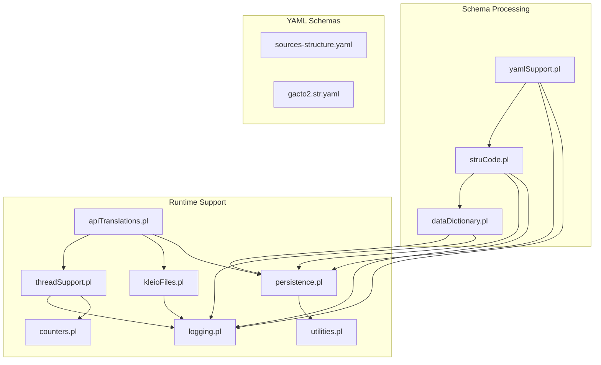
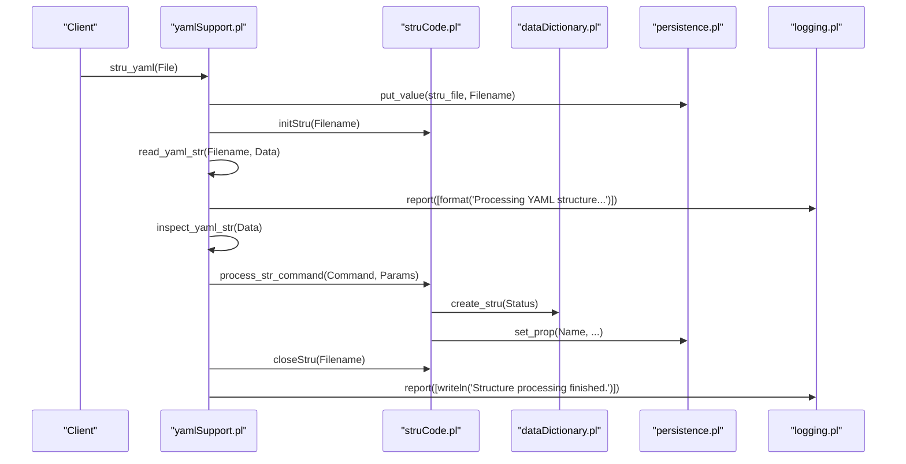
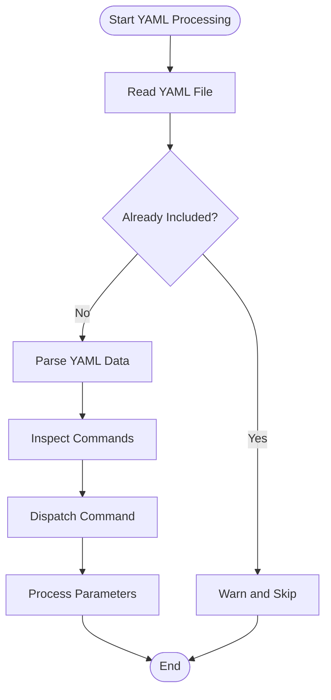
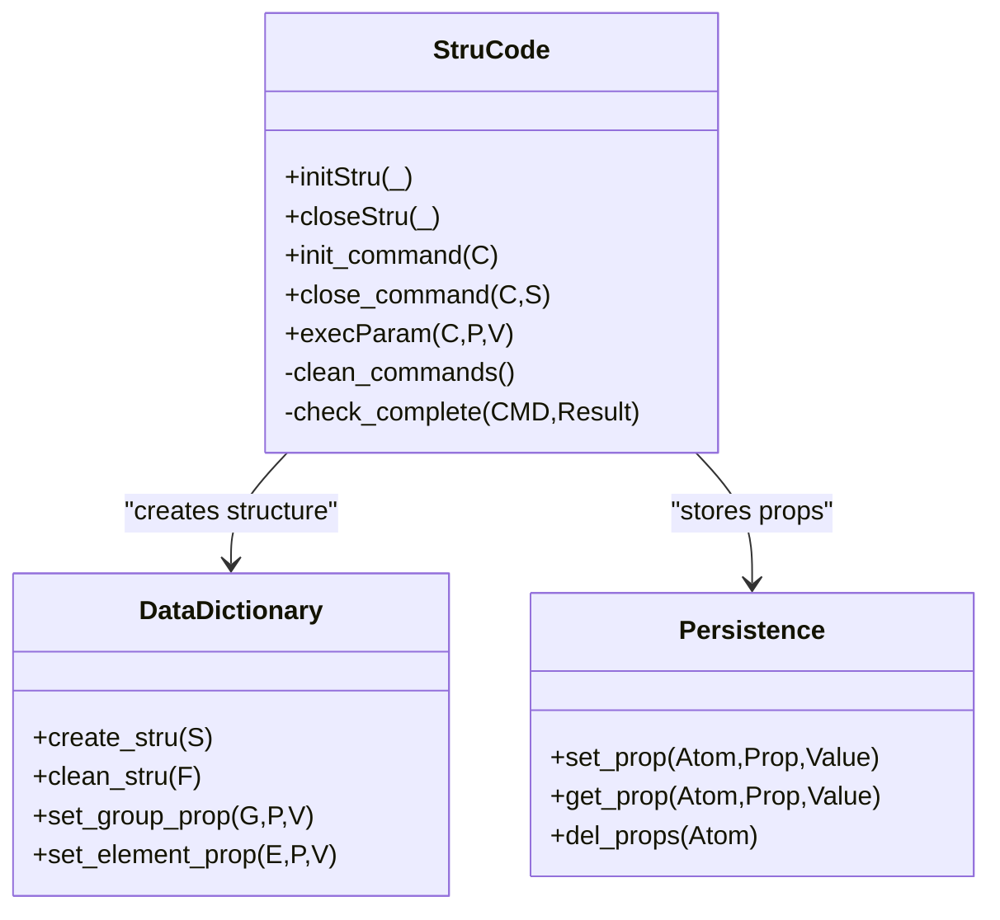
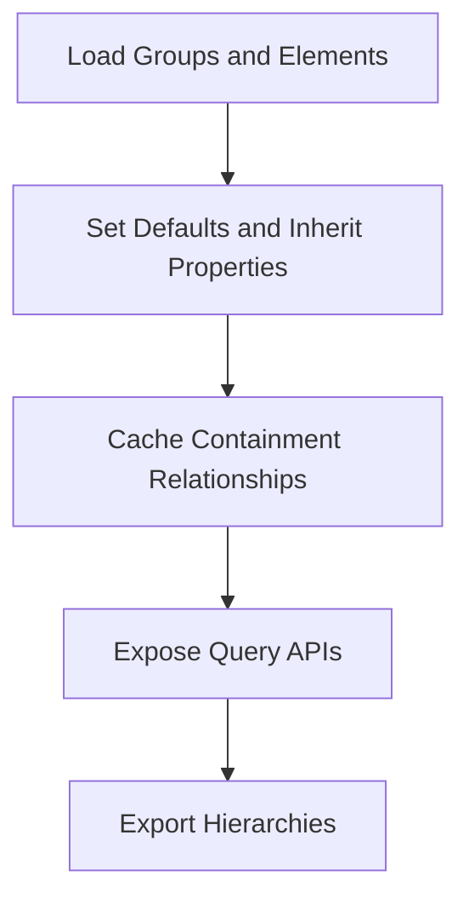
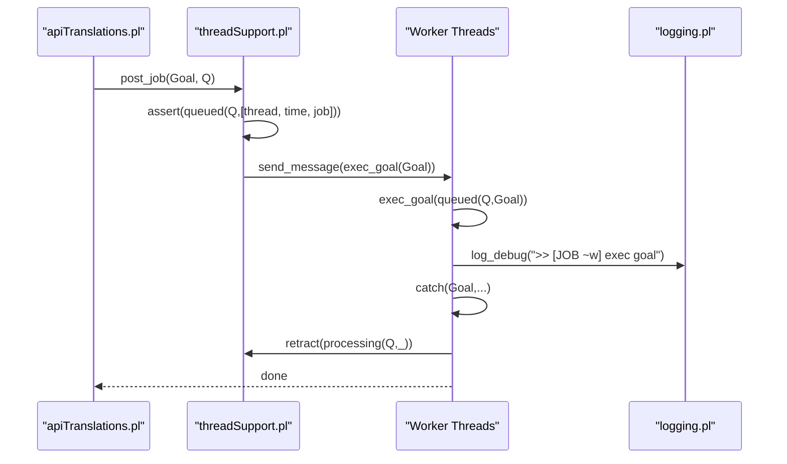
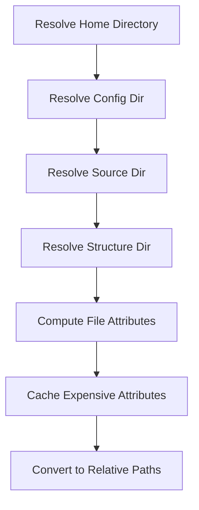
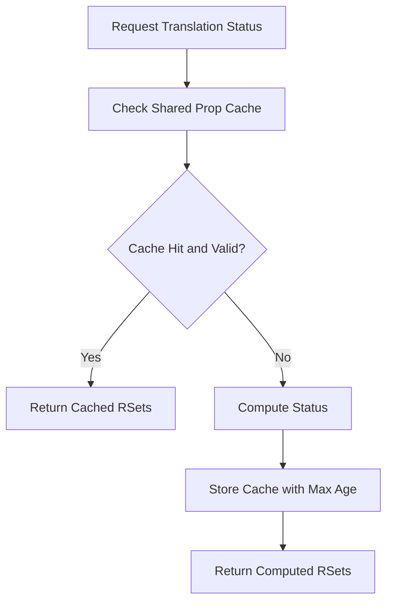
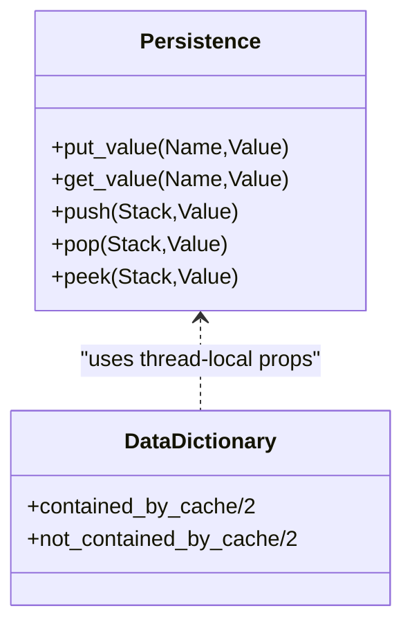
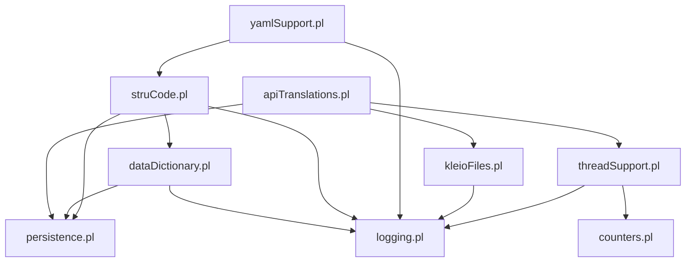

# Performance Optimization and Best Practices

<cite>
**Referenced Files in This Document**
- [yamlSupport.pl](file://src/yamlSupport.pl)
- [struCode.pl](file://src/struCode.pl)
- [dataDictionary.pl](file://src/dataDictionary.pl)
- [persistence.pl](file://src/persistence.pl)
- [threadSupport.pl](file://src/threadSupport.pl)
- [apiTranslations.pl](file://src/apiTranslations.pl)
- [kleioFiles.pl](file://src/kleioFiles.pl)
- [logging.pl](file://src/logging.pl)
- [counters.pl](file://src/counters.pl)
- [utilities.pl](file://src/utilities.pl)
- [sources-structure.yaml](file://src/stru/sources-structure.yaml)
- [gacto2.str.yaml](file://src/stru/gacto2.str.yaml)
</cite>

## Table of Contents
1. [Introduction](#introduction)
2. [Project Structure](#project-structure)
3. [Core Components](#core-components)
4. [Architecture Overview](#architecture-overview)
5. [Detailed Component Analysis](#detailed-component-analysis)
6. [Dependency Analysis](#dependency-analysis)
7. [Performance Considerations](#performance-considerations)
8. [Troubleshooting Guide](#troubleshooting-guide)
9. [Conclusion](#conclusion)
10. [Appendices](#appendices)

## Introduction
This document provides comprehensive guidance for optimizing YAML schema performance and following best practices in the project. It focuses on caching strategies, lazy loading techniques, memory management, parallel processing options, profiling tools, performance monitoring, bottleneck identification, large schema organization, incremental processing, and resource optimization techniques. The recommendations are grounded in the actual implementation details of the codebase.

## Project Structure
The system processes YAML-based structure (schema) files and translates them into internal representations used by the translation pipeline. Key modules include:
- YAML parsing and command dispatch
- Schema processing and validation
- Data dictionary and group/element management
- File utilities and path resolution
- Threading and job queueing
- Caching and shared state management
- Logging and counters for observability

**Diagram sources**
- [yamlSupport.pl:1-276](file://src/yamlSupport.pl#L1-L276)
- [struCode.pl:1-402](file://src/struCode.pl#L1-L402)
- [dataDictionary.pl:1-200](file://src/dataDictionary.pl#L1-L200)
- [persistence.pl:1-392](file://src/persistence.pl#L1-L392)
- [threadSupport.pl:1-153](file://src/threadSupport.pl#L1-L153)
- [apiTranslations.pl:169-722](file://src/apiTranslations.pl#L169-L722)
- [kleioFiles.pl:1-800](file://src/kleioFiles.pl#L1-L800)
- [logging.pl:1-161](file://src/logging.pl#L1-L161)
- [counters.pl:1-94](file://src/counters.pl#L1-L94)
- [utilities.pl:1-371](file://src/utilities.pl#L1-L371)
- [sources-structure.yaml:1-10](file://src/stru/sources-structure.yaml#L1-L10)
- [gacto2.str.yaml:1-800](file://src/stru/gacto2.str.yaml#L1-L800)

**Section sources**
- [yamlSupport.pl:1-276](file://src/yamlSupport.pl#L1-L276)
- [struCode.pl:1-402](file://src/struCode.pl#L1-L402)
- [dataDictionary.pl:1-200](file://src/dataDictionary.pl#L1-L200)
- [persistence.pl:1-392](file://src/persistence.pl#L1-L392)
- [threadSupport.pl:1-153](file://src/threadSupport.pl#L1-L153)
- [apiTranslations.pl:169-722](file://src/apiTranslations.pl#L169-L722)
- [kleioFiles.pl:1-800](file://src/kleioFiles.pl#L1-L800)
- [logging.pl:1-161](file://src/logging.pl#L1-L161)
- [counters.pl:1-94](file://src/counters.pl#L1-L94)
- [utilities.pl:1-371](file://src/utilities.pl#L1-L371)
- [sources-structure.yaml:1-10](file://src/stru/sources-structure.yaml#L1-L10)
- [gacto2.str.yaml:1-800](file://src/stru/gacto2.str.yaml#L1-L800)

## Core Components
- YAML support module parses YAML structure files, normalizes paths, includes referenced files, inspects commands, and bridges to schema processing.
- Schema code module initializes/cleans structure processing, validates parameters, stores temporary command info, and triggers data dictionary creation.
- Data dictionary manages groups and elements, caches containment relationships, and exposes query APIs for structure metadata.
- Persistence layer provides thread-local and shared storage, properties, stacks, and list-like value collections.
- Thread support implements worker pools and message queues, job posting, execution, and status tracking.
- API translations integrates with threading, file utilities, and caching to manage translation jobs and status.
- File utilities provide robust path resolution, attribute extraction, and caching of expensive computations.
- Logging and counters offer structured logging and metrics for performance monitoring.

**Section sources**
- [yamlSupport.pl:1-276](file://src/yamlSupport.pl#L1-L276)
- [struCode.pl:1-402](file://src/struCode.pl#L1-L402)
- [dataDictionary.pl:1-200](file://src/dataDictionary.pl#L1-L200)
- [persistence.pl:1-392](file://src/persistence.pl#L1-L392)
- [threadSupport.pl:1-153](file://src/threadSupport.pl#L1-L153)
- [apiTranslations.pl:169-722](file://src/apiTranslations.pl#L169-L722)
- [kleioFiles.pl:1-800](file://src/kleioFiles.pl#L1-L800)
- [logging.pl:1-161](file://src/logging.pl#L1-L161)
- [counters.pl:1-94](file://src/counters.pl#L1-L94)

## Architecture Overview
The YAML schema processing pipeline reads and includes YAML files, dispatches commands to schema handlers, constructs internal structures, and persists metadata. Parallel translation jobs leverage a worker pool or message queue, with caching and logging throughout.

**Diagram sources**
- [yamlSupport.pl:28-91](file://src/yamlSupport.pl#L28-L91)
- [struCode.pl:64-126](file://src/struCode.pl#L64-L126)
- [dataDictionary.pl:118-146](file://src/dataDictionary.pl#L118-L146)
- [persistence.pl:124-174](file://src/persistence.pl#L124-L174)
- [logging.pl:98-113](file://src/logging.pl#L98-L113)

## Detailed Component Analysis

### YAML Schema Parser and Dispatcher
- Reads YAML files, tracks included files to avoid reprocessing, and inspects commands sequentially.
- Normalizes string values and delegates parameter handling to schema code.
- Uses persistence to maintain stack and read lists for safe nested includes.

**Diagram sources**
- [yamlSupport.pl:49-91](file://src/yamlSupport.pl#L49-L91)
- [yamlSupport.pl:174-189](file://src/yamlSupport.pl#L174-L189)
- [persistence.pl:354-392](file://src/persistence.pl#L354-L392)

**Section sources**
- [yamlSupport.pl:28-91](file://src/yamlSupport.pl#L28-L91)
- [yamlSupport.pl:174-189](file://src/yamlSupport.pl#L174-L189)
- [persistence.pl:354-392](file://src/persistence.pl#L354-L392)

### Schema Code and Validation
- Initializes and cleans structure processing, sets defaults, validates required parameters, and creates final structure definitions.
- Stores temporary command information using thread-local dynamic facts.

**Diagram sources**
- [struCode.pl:64-126](file://src/struCode.pl#L64-L126)
- [struCode.pl:306-346](file://src/struCode.pl#L306-L346)
- [dataDictionary.pl:118-146](file://src/dataDictionary.pl#L118-L146)
- [persistence.pl:124-174](file://src/persistence.pl#L124-L174)

**Section sources**
- [struCode.pl:64-126](file://src/struCode.pl#L64-L126)
- [struCode.pl:306-346](file://src/struCode.pl#L306-L346)
- [dataDictionary.pl:118-146](file://src/dataDictionary.pl#L118-L146)
- [persistence.pl:124-174](file://src/persistence.pl#L124-L174)

### Data Dictionary and Caching
- Manages groups and elements, supports inheritance via source parameters, and caches containment relationships to speed up queries.
- Provides topological ordering and hierarchical exports for inspection.

**Diagram sources**
- [dataDictionary.pl:118-146](file://src/dataDictionary.pl#L118-L146)
- [dataDictionary.pl:184-200](file://src/dataDictionary.pl#L184-L200)

**Section sources**
- [dataDictionary.pl:118-146](file://src/dataDictionary.pl#L118-L146)
- [dataDictionary.pl:184-200](file://src/dataDictionary.pl#L184-L200)

### Threading and Job Queueing
- Supports two modes: message queue and thread pool. Jobs are posted, executed by workers, and tracked with timestamps and job IDs.
- Integrates with logging and counters for observability.

**Diagram sources**
- [threadSupport.pl:109-125](file://src/threadSupport.pl#L109-L125)
- [threadSupport.pl:64-101](file://src/threadSupport.pl#L64-L101)
- [apiTranslations.pl:242-260](file://src/apiTranslations.pl#L242-L260)
- [logging.pl:98-113](file://src/logging.pl#L98-L113)

**Section sources**
- [threadSupport.pl:1-153](file://src/threadSupport.pl#L1-L153)
- [apiTranslations.pl:242-260](file://src/apiTranslations.pl#L242-L260)
- [logging.pl:98-113](file://src/logging.pl#L98-L113)

### File Utilities and Path Resolution
- Resolves Kleio home, config, source, and structure directories; computes file attributes; caches expensive computations like error/warning counts.
- Provides relative path conversion for secure API responses.

**Diagram sources**
- [kleioFiles.pl:507-597](file://src/kleioFiles.pl#L507-L597)
- [kleioFiles.pl:393-413](file://src/kleioFiles.pl#L393-L413)
- [kleioFiles.pl:445-457](file://src/kleioFiles.pl#L445-L457)

**Section sources**
- [kleioFiles.pl:507-597](file://src/kleioFiles.pl#L507-L597)
- [kleioFiles.pl:393-413](file://src/kleioFiles.pl#L393-L413)
- [kleioFiles.pl:445-457](file://src/kleioFiles.pl#L445-L457)

### Caching Strategies
- Status cache for translation results with configurable max age and size thresholds.
- Attribute cache for file metadata to avoid repeated I/O.
- Shared property-based cache keyed by path, recursion flag, and token.

**Diagram sources**
- [apiTranslations.pl:177-232](file://src/apiTranslations.pl#L177-L232)
- [kleioFiles.pl:393-413](file://src/kleioFiles.pl#L393-L413)

**Section sources**
- [apiTranslations.pl:177-232](file://src/apiTranslations.pl#L177-L232)
- [kleioFiles.pl:393-413](file://src/kleioFiles.pl#L393-L413)

### Memory Management and Lazy Loading
- Thread-local storage for transient state during schema processing.
- Lazy evaluation of containment relationships with explicit caches.
- Stack-based include tracking prevents redundant processing and excessive memory growth.

**Diagram sources**
- [persistence.pl:354-392](file://src/persistence.pl#L354-L392)
- [dataDictionary.pl:102-106](file://src/dataDictionary.pl#L102-L106)

**Section sources**
- [persistence.pl:354-392](file://src/persistence.pl#L354-L392)
- [dataDictionary.pl:102-106](file://src/dataDictionary.pl#L102-L106)

### Large Schema Organization
- Use modular YAML schemas with include directives to split large definitions.
- Maintain clear naming conventions and descriptions for maintainability.
- Leverage inheritance via source parameters to reduce duplication.

**Section sources**
- [sources-structure.yaml:1-10](file://src/stru/sources-structure.yaml#L1-L10)
- [gacto2.str.yaml:1-800](file://src/stru/gacto2.str.yaml#L1-L800)

### Incremental Processing
- Track processed files to skip reprocessing unchanged schemas.
- Use file modification times and cached attributes to determine if recomputation is needed.
- Integrate with translation status cache to avoid redundant work.

**Section sources**
- [yamlSupport.pl:49-72](file://src/yamlSupport.pl#L49-L72)
- [kleioFiles.pl:393-413](file://src/kleioFiles.pl#L393-L413)
- [apiTranslations.pl:177-232](file://src/apiTranslations.pl#L177-L232)

### Resource Optimization Techniques
- Configure worker pool sizes based on workload and hardware.
- Use message queue mode for fine-grained control over job distribution.
- Enable selective logging levels to reduce overhead in production.

**Section sources**
- [threadSupport.pl:41-62](file://src/threadSupport.pl#L41-L62)
- [logging.pl:89-96](file://src/logging.pl#L89-L96)

## Dependency Analysis
The core dependencies form a layered architecture where YAML parsing depends on schema code, which depends on the data dictionary and persistence. Threading and file utilities support the translation API, while logging and counters provide cross-cutting concerns.

**Diagram sources**
- [yamlSupport.pl:1-276](file://src/yamlSupport.pl#L1-L276)
- [struCode.pl:1-402](file://src/struCode.pl#L1-L402)
- [dataDictionary.pl:1-200](file://src/dataDictionary.pl#L1-L200)
- [persistence.pl:1-392](file://src/persistence.pl#L1-L392)
- [threadSupport.pl:1-153](file://src/threadSupport.pl#L1-L153)
- [apiTranslations.pl:169-722](file://src/apiTranslations.pl#L169-L722)
- [kleioFiles.pl:1-800](file://src/kleioFiles.pl#L1-L800)
- [logging.pl:1-161](file://src/logging.pl#L1-L161)
- [counters.pl:1-94](file://src/counters.pl#L1-L94)

**Section sources**
- [yamlSupport.pl:1-276](file://src/yamlSupport.pl#L1-L276)
- [struCode.pl:1-402](file://src/struCode.pl#L1-L402)
- [dataDictionary.pl:1-200](file://src/dataDictionary.pl#L1-L200)
- [persistence.pl:1-392](file://src/persistence.pl#L1-L392)
- [threadSupport.pl:1-153](file://src/threadSupport.pl#L1-L153)
- [apiTranslations.pl:169-722](file://src/apiTranslations.pl#L169-L722)
- [kleioFiles.pl:1-800](file://src/kleioFiles.pl#L1-L800)
- [logging.pl:1-161](file://src/logging.pl#L1-L161)
- [counters.pl:1-94](file://src/counters.pl#L1-L94)

## Performance Considerations
- Prefer message queue mode for high concurrency scenarios; use thread pool mode for simpler setups.
- Tune worker pool backlog and trail sizes based on expected job complexity.
- Enable attribute caching for large file sets to reduce I/O overhead.
- Use structured logging at appropriate levels to minimize runtime cost.
- Monitor job queues and processing states to identify bottlenecks.

[No sources needed since this section provides general guidance]

## Troubleshooting Guide
- Check logs for warnings about ignored previously processed files or unknown commands.
- Inspect queued and processing jobs to detect stalled tasks.
- Validate shared property caches for stale entries and adjust max ages.
- Review file attribute caches for outdated timestamps.

**Section sources**
- [yamlSupport.pl:54-72](file://src/yamlSupport.pl#L54-L72)
- [threadSupport.pl:137-149](file://src/threadSupport.pl#L137-L149)
- [apiTranslations.pl:177-232](file://src/apiTranslations.pl#L177-L232)
- [kleioFiles.pl:393-413](file://src/kleioFiles.pl#L393-L413)

## Conclusion
By leveraging built-in caching, lazy loading, and parallel processing capabilities, the system achieves efficient YAML schema processing and translation. Organizing large schemas modularly, enabling incremental updates, and tuning resource usage further enhance performance and scalability.

[No sources needed since this section summarizes without analyzing specific files]

## Appendices
- Example YAML schema structure and includes
- Configuration options for worker pools and logging levels
- Monitoring scripts and API endpoints for job status

[No sources needed since this section provides general guidance]