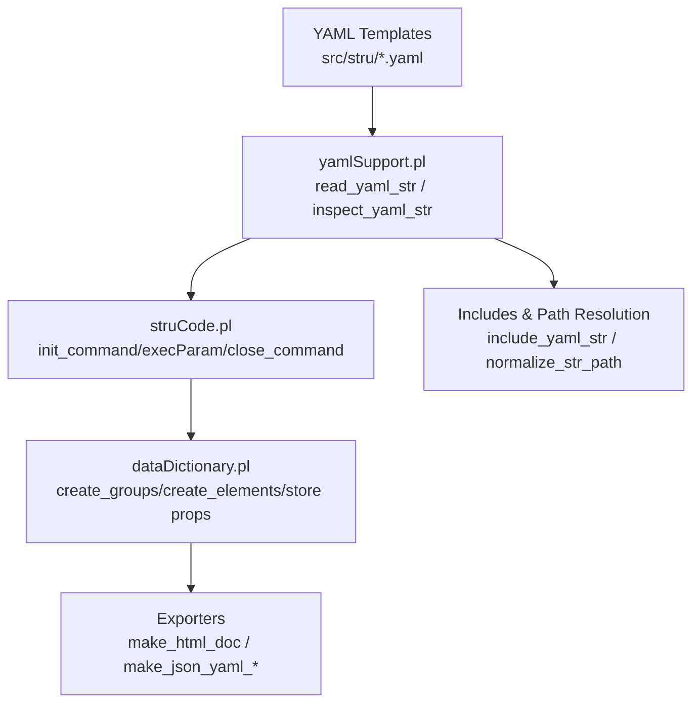
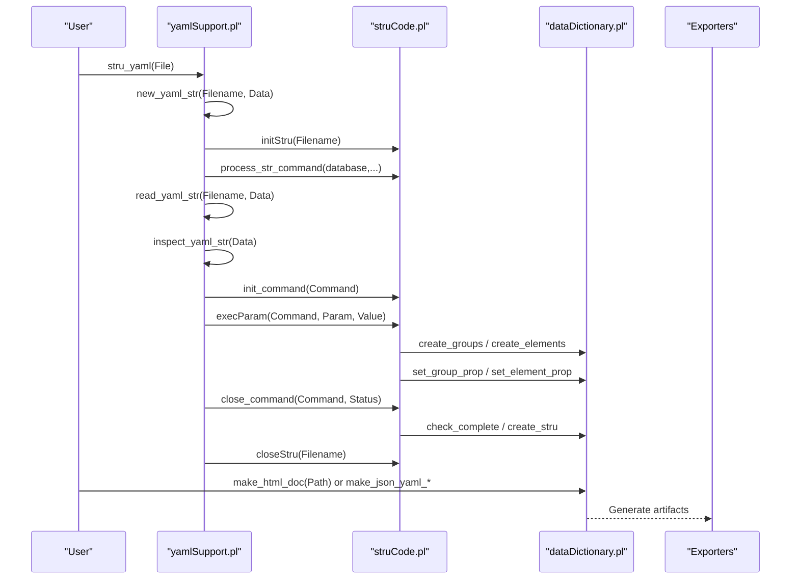
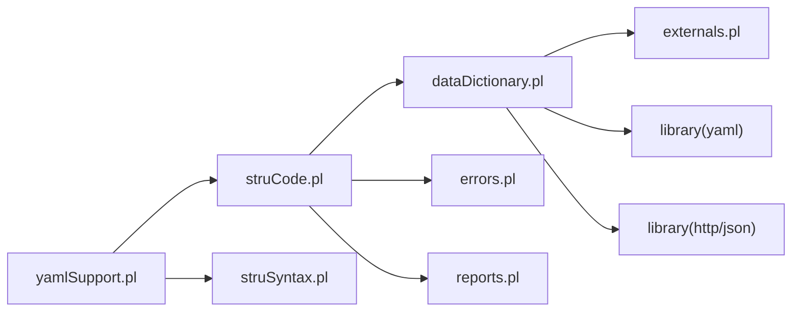

# Template System and Code Generation

<cite>
**Referenced Files in This Document**
- [src/yamlSupport.pl](file://src/yamlSupport.pl)
- [src/struCode.pl](file://src/struCode.pl)
- [src/struSyntax.pl](file://src/struSyntax.pl)
- [src/dataDictionary.pl](file://src/dataDictionary.pl)
- [src/stru/sources-structure.yaml](file://src/stru/sources-structure.yaml)
- [src/stru/system.yaml](file://src/stru/system.yaml)
- [src/stru/elements.yaml](file://src/stru/elements.yaml)
- [src/stru/groups.yaml](file://src/stru/groups.yaml)
- [tests/kleio-home/structures/api/yaml/pt-groups-structure.yaml](file://tests/kleio-home/structures/api/yaml/pt-groups-structure.yaml)
</cite>

## Table of Contents
1. [Introduction](#introduction)
2. [Project Structure](#project-structure)
3. [Core Components](#core-components)
4. [Architecture Overview](#architecture-overview)
5. [Detailed Component Analysis](#detailed-component-analysis)
6. [Dependency Analysis](#dependency-analysis)
7. [Performance Considerations](#performance-considerations)
8. [Troubleshooting Guide](#troubleshooting-guide)
9. [Conclusion](#conclusion)
10. [Appendices](#appendices)

## Introduction
This document explains the YAML-based template system used to define Kleio structure schemas and how it drives code generation for data processing and documentation. It covers:
- Template syntax and directives (file, include, element, group)
- Variable interpolation via placeholders
- Loop constructs through list-based definitions
- Output formatting and generated artifacts
- Reusable components via includes and inheritance
- Integration points with external generators and exporters

The system is implemented in Prolog and uses YAML as the authoring format. The runtime compiles YAML into an internal schema representation that powers parsing, validation, and export utilities.

## Project Structure
At a high level:
- YAML templates are located under src/stru/*.yaml
- The YAML loader and command dispatcher live in yamlSupport.pl
- Command execution and state management are handled by struCode.pl
- Syntax keywords and parameter validation are defined in struSyntax.pl
- The compiled schema is stored and queried by dataDictionary.pl
- Generated outputs include HTML docs and JSON/YAML structures

**Diagram sources**
- [src/yamlSupport.pl:28-72](file://src/yamlSupport.pl#L28-L72)
- [src/struCode.pl:91-146](file://src/struCode.pl#L91-L146)
- [src/dataDictionary.pl:118-146](file://src/dataDictionary.pl#L118-L146)

**Section sources**
- [src/yamlSupport.pl:1-72](file://src/yamlSupport.pl#L1-L72)
- [src/stru/sources-structure.yaml:1-10](file://src/stru/sources-structure.yaml#L1-L10)
- [src/stru/system.yaml:1-4](file://src/stru/system.yaml#L1-L4)

## Core Components
- YAML Loader and Inspector
  - Reads YAML files, tracks included files, and inspects top-level commands.
  - Supports file metadata and include directives.
- Command Execution Engine
  - Bridges YAML commands to the legacy Kleio command model (nomino/pars/terminus/exitus).
  - Manages initialization, parameter execution, and finalization.
- Schema Storage and Query
  - Creates groups and elements, stores properties, supports inheritance and containment checks.
  - Provides export predicates for HTML and JSON/YAML.
- Syntax and Keywords
  - Validates parameters and maps English/Latin keywords.

Key responsibilities:
- yamlSupport.pl: YAML parsing, include resolution, command dispatch
- struCode.pl: Command lifecycle, property storage, completeness checks
- struSyntax.pl: Keyword mapping, parameter grammar
- dataDictionary.pl: Schema store, hierarchy, exports

**Section sources**
- [src/yamlSupport.pl:28-195](file://src/yamlSupport.pl#L28-L195)
- [src/struCode.pl:91-146](file://src/struCode.pl#L91-L146)
- [src/struSyntax.pl:278-416](file://src/struSyntax.pl#L278-L416)
- [src/dataDictionary.pl:118-146](file://src/dataDictionary.pl#L118-L146)

## Architecture Overview
End-to-end flow from YAML template to generated output:

**Diagram sources**
- [src/yamlSupport.pl:28-72](file://src/yamlSupport.pl#L28-L72)
- [src/struCode.pl:91-146](file://src/struCode.pl#L91-L146)
- [src/dataDictionary.pl:118-146](file://src/dataDictionary.pl#L118-L146)

## Detailed Component Analysis

### YAML Template Syntax and Directives
- Top-level items are lists of commands. Supported commands:
  - file: metadata for the current file (name, description)
  - include: include another YAML file
  - element: define an element (terminus directive)
  - group: define a group (pars directive)
- Parameter keys are validated against known sets; both Latin and English forms are accepted.

Examples of usage patterns:
- File header and description
- Include reusable parts
- Element definitions with source inheritance
- Group definitions with position, guaranteed, also, contains, idprefix, and source

**Section sources**
- [src/stru/sources-structure.yaml:1-10](file://src/stru/sources-structure.yaml#L1-L10)
- [src/stru/elements.yaml:1-120](file://src/stru/elements.yaml#L1-L120)
- [src/stru/groups.yaml:1-120](file://src/stru/groups.yaml#L1-L120)
- [src/struSyntax.pl:124-181](file://src/struSyntax.pl#L124-L181)

### Variable Interpolation and Placeholders
- Placeholders such as @@VERSION@@, @@BUILD@@, @@DATE@@ can appear in descriptions or other string fields.
- These are typically replaced during build or configuration steps before YAML is processed.

Use cases:
- Embedding build metadata into generated documentation
- Versioning structure files

**Section sources**
- [src/stru/sources-structure.yaml:1-10](file://src/stru/sources-structure.yaml#L1-L10)

### Loop Constructs and List-Based Definitions
- YAML lists drive iteration over elements and groups.
- Each list item defines one entity; the loader iterates and executes corresponding commands.

Patterns:
- Define multiple elements in a single file
- Define many related groups with shared base via source inheritance

**Section sources**
- [src/stru/elements.yaml:1-120](file://src/stru/elements.yaml#L1-L120)
- [src/stru/groups.yaml:1-120](file://src/stru/groups.yaml#L1-L120)
- [src/yamlSupport.pl:74-91](file://src/yamlSupport.pl#L74-L91)

### Output Formatting and Generated Artifacts
- HTML documentation generator for the current schema
- JSON/YAML exporters for schema introspection and integration

Typical calls:
- make_html_doc(DocPath)
- make_json_yaml_str/3
- make_json_yaml_hierarchy/3 or /4

Outputs:
- Human-readable HTML docs
- Machine-readable JSON/YAML for downstream tools

**Section sources**
- [src/dataDictionary.pl:794-800](file://src/dataDictionary.pl#L794-L800)
- [src/dataDictionary.pl:1-37](file://src/dataDictionary.pl#L1-L37)

### Reusable Template Components
- Includes:
  - Use include: to compose larger schemas from smaller modules
  - Relative paths resolved relative to the including file or system directories
- Inheritance:
  - Groups and elements can extend a source using the source parameter
  - Properties are copied from the source unless overridden

Best practices:
- Split core types (elements.yaml) and domain-specific extensions
- Use aliases and specialized groups to reduce duplication

**Section sources**
- [src/stru/sources-structure.yaml:1-10](file://src/stru/sources-structure.yaml#L1-L10)
- [src/stru/groups.yaml:120-220](file://src/stru/groups.yaml#L120-L220)
- [src/stru/elements.yaml:80-120](file://src/stru/elements.yaml#L80-L120)
- [src/yamlSupport.pl:118-130](file://src/yamlSupport.pl#L118-L130)

### Template Inheritance and Specialization
- Source inheritance allows specialization without redefining common properties
- Containment rules propagate through inheritance for validation and navigation

Example patterns:
- Base group entity extended by historical-source, then further specialized
- Elements like id reused across many entities via source

**Section sources**
- [src/stru/groups.yaml:120-220](file://src/stru/groups.yaml#L120-L220)
- [src/dataDictionary.pl:518-526](file://src/dataDictionary.pl#L518-L526)

### Custom Template Functions and Extensions
- The system bridges YAML commands to the existing Kleio command model
- New behavior can be added by extending execParam handlers and parameter validators

Integration points:
- Add new commands or parameters by updating struCode.pl and struSyntax.pl
- Exporters in dataDictionary.pl can be extended to produce additional formats

**Section sources**
- [src/struCode.pl:148-280](file://src/struCode.pl#L148-L280)
- [src/struSyntax.pl:124-181](file://src/struSyntax.pl#L124-L181)

### Generating Complex Schema Structures from Data Sources
- The system can generate YAML/JSON representations of the current schema
- Useful for API consumption, tooling, and documentation

Workflow:
- Load schema via YAML
- Build internal representation
- Export to JSON/YAML or HTML

**Section sources**
- [src/dataDictionary.pl:1-37](file://src/dataDictionary.pl#L1-L37)
- [tests/kleio-home/structures/api/yaml/pt-groups-structure.yaml:1-609](file://tests/kleio-home/structures/api/yaml/pt-groups-structure.yaml#L1-L609)

### Integrating with External Code Generators
- Use exported JSON/YAML as input to external generators
- The generated artifacts capture full schema semantics (groups, elements, inheritance, constraints)

Typical integrations:
- Database schema generators
- UI form builders
- Validation libraries

**Section sources**
- [tests/kleio-home/structures/api/yaml/pt-groups-structure.yaml:1-609](file://tests/kleio-home/structures/api/yaml/pt-groups-structure.yaml#L1-L609)

## Dependency Analysis
High-level dependencies between modules:

**Diagram sources**
- [src/yamlSupport.pl:1-26](file://src/yamlSupport.pl#L1-L26)
- [src/struCode.pl:49-56](file://src/struCode.pl#L49-L56)
- [src/dataDictionary.pl:87-99](file://src/dataDictionary.pl#L87-L99)

**Section sources**
- [src/yamlSupport.pl:1-26](file://src/yamlSupport.pl#L1-L26)
- [src/struCode.pl:49-56](file://src/struCode.pl#L49-L56)
- [src/dataDictionary.pl:87-99](file://src/dataDictionary.pl#L87-L99)

## Performance Considerations
- Avoid deep include chains; prefer flat composition where possible
- Cache containment checks internally to reduce repeated computations
- Limit large lists in templates when not necessary; split into focused modules
- Use preprocessed placeholders instead of runtime string manipulation

[No sources needed since this section provides general guidance]

## Troubleshooting Guide
Common issues and resolutions:
- Unknown command in YAML: verify spelling and supported commands
- Missing required parameters: ensure all mandatory keys are present
- Circular includes: track included files and avoid cycles
- Property conflicts on redefinition: review merge behavior and override order

Diagnostic aids:
- Inspect current structure and included files
- Check error and warning counts after processing

**Section sources**
- [src/yamlSupport.pl:152-158](file://src/yamlSupport.pl#L152-L158)
- [src/struCode.pl:306-337](file://src/struCode.pl#L306-L337)
- [src/dataDictionary.pl:693-708](file://src/dataDictionary.pl#L693-L708)

## Conclusion
The YAML template system provides a flexible, composable way to define Kleio schemas. Through includes, inheritance, and list-driven definitions, it enables reuse and clarity. The runtime compiles these templates into a rich internal model that powers validation, querying, and export to multiple formats, facilitating integration with external tools and generators.

[No sources needed since this section summarizes without analyzing specific files]

## Appendices

### Appendix A: Key Directives and Parameters
- file: name, description
- include: path
- element: name, source, identification, note/description
- group: name, source, position, guaranteed, also, contains, idprefix

**Section sources**
- [src/stru/elements.yaml:1-120](file://src/stru/elements.yaml#L1-L120)
- [src/stru/groups.yaml:1-120](file://src/stru/groups.yaml#L1-L120)
- [src/struSyntax.pl:124-181](file://src/struSyntax.pl#L124-L181)

### Appendix B: Example Outputs
- HTML documentation of the schema
- JSON/YAML schema snapshots for API use

**Section sources**
- [src/dataDictionary.pl:794-800](file://src/dataDictionary.pl#L794-L800)
- [tests/kleio-home/structures/api/yaml/pt-groups-structure.yaml:1-609](file://tests/kleio-home/structures/api/yaml/pt-groups-structure.yaml#L1-L609)