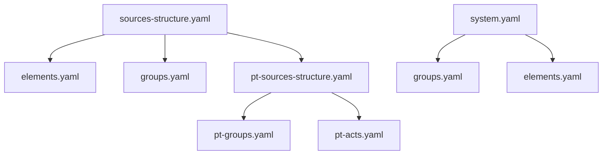
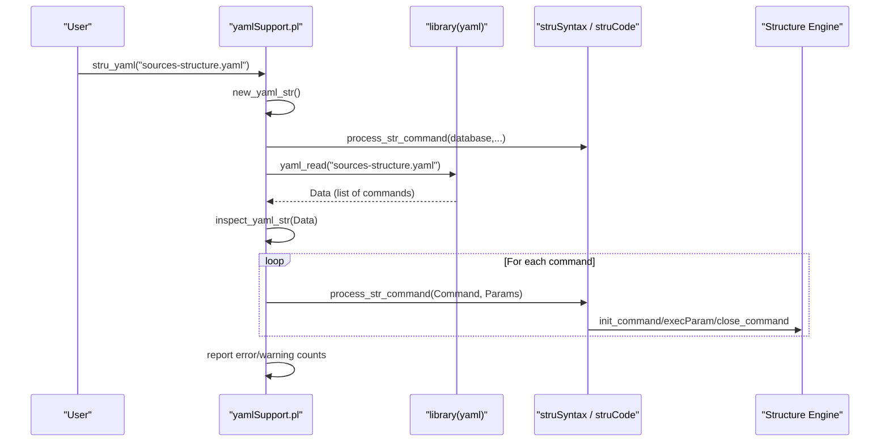
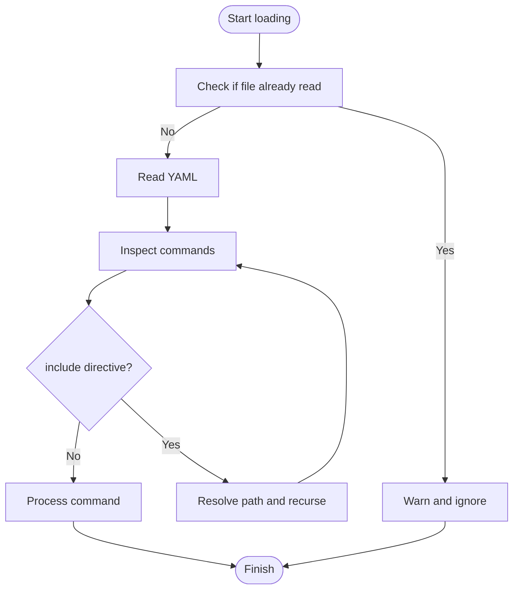

# Best Practices and Guidelines

<cite>
**Referenced Files in This Document**
- [README.md](file://src/stru/README.md)
- [system.yaml](file://src/stru/system.yaml)
- [elements.yaml](file://src/stru/elements.yaml)
- [groups.yaml](file://src/stru/groups.yaml)
- [sources-structure.yaml](file://src/stru/sources-structure.yaml)
- [pt-elements.yaml](file://src/stru/pt-elements.yaml)
- [pt-groups.yaml](file://src/stru/pt-groups.yaml)
- [pt-sources-structure.yaml](file://src/stru/pt-sources-structure.yaml)
- [yamlSupport.pl](file://src/yamlSupport.pl)
- [test_duplicate_1.yaml](file://tests/kleio-home/structures/in_process/test_duplicate_1.yaml)
- [test_duplicate_2.yaml](file://tests/kleio-home/structures/in_process/test_duplicate_2.yaml)
- [NEXT_STEPS.md](file://NEXT_STEPS.md)
</cite>

## Table of Contents
1. Introduction
2. Project Structure
3. Core Components
4. Architecture Overview
5. Detailed Component Analysis
6. Dependency Analysis
7. Performance Considerations
8. Security Guidelines
9. Testing Approaches
10. Collaboration, Code Review, and Maintenance Workflows
11. Common Anti-Patterns and Solutions
12. Conclusion

## Introduction
This document provides comprehensive guidelines for developing YAML schemas in this project. It covers naming conventions, code organization, documentation standards, versioning strategies, collaborative development practices, code review processes, maintenance workflows, performance considerations, security guidelines, testing approaches, and common anti-patterns with solutions grounded in real-world examples from the repository.

The goal is to help teams author maintainable, secure, performant, and testable YAML-based schema definitions that integrate cleanly with the system’s processing pipeline.

## Project Structure
YAML schemas are primarily located under src/stru and are composed using a modular include mechanism. The default entry point is sources-structure.yaml, which composes core elements, groups, and domain-specific extensions (e.g., Portuguese variants). A minimal system entrypoint is provided by system.yaml.

**Diagram sources**
- [sources-structure.yaml:1-10](file://src/stru/sources-structure.yaml#L1-L10)
- [system.yaml:1-4](file://src/stru/system.yaml#L1-L4)
- [pt-sources-structure.yaml:1-4](file://src/stru/pt-sources-structure.yaml#L1-L4)

**Section sources**
- [README.md:1-7](file://src/stru/README.md#L1-L7)
- [sources-structure.yaml:1-10](file://src/stru/sources-structure.yaml#L1-L10)
- [system.yaml:1-4](file://src/stru/system.yaml#L1-L4)

## Core Components
- Elements: Reusable building blocks representing data fields (e.g., identifiers, dates, text). They can be specialized via source inheritance and typed for database mapping.
- Groups: Compositions of elements and other groups defining entities and records (e.g., person, historical-source, event). Groups specify position ordering, guaranteed fields, optional fields, containment rules, and id prefixes.
- Composition files: Top-level files orchestrate includes to assemble complete schemas for different domains or languages.

Key responsibilities:
- elements.yaml defines foundational types and shared elements.
- groups.yaml defines core entity and record groups and their relationships.
- pt-elements.yaml and pt-groups.yaml provide localized aliases and domain-specific group definitions.
- sources-structure.yaml and system.yaml act as composition roots.

**Section sources**
- [elements.yaml:1-305](file://src/stru/elements.yaml#L1-L305)
- [groups.yaml:1-686](file://src/stru/groups.yaml#L1-L686)
- [pt-elements.yaml:1-136](file://src/stru/pt-elements.yaml#L1-L136)
- [pt-groups.yaml:1-238](file://src/stru/pt-groups.yaml#L1-L238)
- [sources-structure.yaml:1-10](file://src/stru/sources-structure.yaml#L1-L10)
- [system.yaml:1-4](file://src/stru/system.yaml#L1-L4)

## Architecture Overview
The YAML schema loader reads and validates structure files, resolves includes, and translates them into internal commands processed by the structure engine.

**Diagram sources**
- [yamlSupport.pl:28-46](file://src/yamlSupport.pl#L28-L46)
- [yamlSupport.pl:49-72](file://src/yamlSupport.pl#L49-L72)
- [yamlSupport.pl:119-140](file://src/yamlSupport.pl#L119-L140)

## Detailed Component Analysis

### YAML Loader and Processing Pipeline
Responsibilities:
- Initialize structure context and set file metadata.
- Read YAML and iterate through commands.
- Resolve includes safely and avoid duplicate processing.
- Translate YAML commands into internal structure commands.
- Sanitize values and enforce parameter order where needed.
- Report errors and warnings consistently.

Best practices derived from implementation:
- Always define a file header with name and description for traceability.
- Use include judiciously; rely on built-in duplicate detection to prevent cycles and redundant work.
- Keep element and group names stable; use source inheritance to specialize behavior rather than duplicating definitions.
- Prefer short, descriptive names and consistent prefixes for ids to aid navigation and debugging.

**Section sources**
- [yamlSupport.pl:28-46](file://src/yamlSupport.pl#L28-L46)
- [yamlSupport.pl:49-72](file://src/yamlSupport.pl#L49-L72)
- [yamlSupport.pl:119-140](file://src/yamlSupport.pl#L119-L140)
- [yamlSupport.pl:159-177](file://src/yamlSupport.pl#L159-L177)

### Elements and Types
Guidelines:
- Define reusable base elements for common data types (e.g., identifiers, strings, numbers, text).
- Specialize elements via source inheritance to adapt to domain needs while preserving semantics.
- Provide clear descriptions and usage notes to guide authors.
- Avoid ad-hoc duplication; prefer extending existing elements.

Examples in repository:
- Base types and identifiers defined centrally.
- Date-related elements and composite date handling.
- Control elements for processing directives.

**Section sources**
- [elements.yaml:37-125](file://src/stru/elements.yaml#L37-L125)
- [elements.yaml:126-201](file://src/stru/elements.yaml#L126-L201)
- [elements.yaml:202-305](file://src/stru/elements.yaml#L202-L305)

### Groups and Inheritance
Guidelines:
- Use groups to model entities and records with clear position ordering and guaranteed fields.
- Leverage source inheritance to create domain-specific variants without repeating definitions.
- Specify contains/part lists to constrain nesting and ensure predictable parsing.
- Choose meaningful idprefixes to keep generated ids readable and scoped.

Examples in repository:
- Core groups like entity, event, historical-source, person, object, relation.
- Domain-specific groups such as Portuguese acts and events.
- Hierarchical geoentity levels for geographic modeling.

**Section sources**
- [groups.yaml:69-133](file://src/stru/groups.yaml#L69-L133)
- [groups.yaml:141-176](file://src/stru/groups.yaml#L141-L176)
- [groups.yaml:219-244](file://src/stru/groups.yaml#L219-L244)
- [groups.yaml:353-372](file://src/stru/groups.yaml#L353-L372)
- [groups.yaml:373-479](file://src/stru/groups.yaml#L373-L479)
- [groups.yaml:524-568](file://src/stru/groups.yaml#L524-L568)
- [groups.yaml:640-686](file://src/stru/groups.yaml#L640-L686)

### Localization and Aliases
Guidelines:
- Provide localized aliases for core elements and groups to support multilingual authoring.
- Maintain a single canonical definition and alias it across language-specific files.
- Ensure aliases preserve semantics by referencing the original source element/group.

Examples in repository:
- Portuguese aliases for elements (e.g., dia/mes/ano/data/tipo/valor/localizacao).
- Portuguese group definitions extending core groups with localized positions and guarantees.

**Section sources**
- [pt-elements.yaml:1-136](file://src/stru/pt-elements.yaml#L1-L136)
- [pt-groups.yaml:1-238](file://src/stru/pt-groups.yaml#L1-L238)

### Composition Roots
Guidelines:
- Centralize composition in top-level files that include elements, groups, and domain extensions.
- Keep composition files small and focused; delegate complexity to included modules.
- Use descriptive names and comments to clarify purpose and dependencies.

Examples in repository:
- Default structure composition including core and Portuguese extensions.
- Minimal system composition for quick starts.

**Section sources**
- [sources-structure.yaml:1-10](file://src/stru/sources-structure.yaml#L1-L10)
- [system.yaml:1-4](file://src/stru/system.yaml#L1-L4)
- [pt-sources-structure.yaml:1-4](file://src/stru/pt-sources-structure.yaml#L1-L4)

## Dependency Analysis
Schema files compose via include directives. The loader tracks read files to avoid duplicates and warns when encountering previously processed files.

**Diagram sources**
- [yamlSupport.pl:49-72](file://src/yamlSupport.pl#L49-L72)
- [yamlSupport.pl:119-129](file://src/yamlSupport.pl#L119-L129)

**Section sources**
- [yamlSupport.pl:49-72](file://src/yamlSupport.pl#L49-L72)
- [test_duplicate_1.yaml:1-10](file://tests/kleio-home/structures/in_process/test_duplicate_1.yaml#L1-L10)
- [test_duplicate_2.yaml:1-9](file://tests/kleio-home/structures/in_process/test_duplicate_2.yaml#L1-L9)

## Performance Considerations
- Minimize deep include chains and circular references; the loader detects duplicates but repeated resolution adds overhead.
- Prefer composition over duplication: reuse elements and groups via source inheritance to reduce memory footprint and parsing time.
- Keep large structures modular; split into focused files to improve cache locality during development and reduce reprocessing costs.
- Avoid excessive nested contains/part lists unless necessary; overly complex hierarchies increase validation cost.

[No sources needed since this section provides general guidance]

## Security Guidelines
- Validate all inputs at the schema level: use guaranteed fields and type constraints to reject malformed data early.
- Restrict external includes to trusted paths; rely on the loader’s normalization and absolute path resolution to prevent directory traversal.
- Do not embed secrets or sensitive configuration in schema files; keep credentials out of version control.
- Treat urlpattern and linked data shortcuts carefully; validate patterns and sanitize user-provided values before use.

[No sources needed since this section provides general guidance]

## Testing Approaches
- Unit tests for loader utilities: value sanitization, list handling, and include logic.
- Integration tests for full schema load: verify zero errors and acceptable warning counts.
- Duplicate inclusion tests: ensure cycles and repeated includes are handled gracefully with warnings.
- Semantic regression tests: compare outputs across versions to detect unintended changes.

Practical references:
- Placeholder tests for loader functions exist in the module.
- Duplicate inclusion scenarios are covered by dedicated test files.
- Regression runs and diff analysis are documented in project instructions.

**Section sources**
- [yamlSupport.pl:199-275](file://src/yamlSupport.pl#L199-L275)
- [test_duplicate_1.yaml:1-10](file://tests/kleio-home/structures/in_process/test_duplicate_1.yaml#L1-L10)
- [test_duplicate_2.yaml:1-9](file://tests/kleio-home/structures/in_process/test_duplicate_2.yaml#L1-L9)
- [NEXT_STEPS.md:178-197](file://NEXT_STEPS.md#L178-L197)

## Collaboration, Code Review, and Maintenance Workflows
- Naming conventions:
  - Use lowercase, hyphenated names for files and snake_case or lowercase names for elements/groups.
  - Keep idprefixes consistent within domains to produce readable ids.
- Documentation standards:
  - Add file headers with name and description.
  - Provide concise descriptions for elements and groups; note special behaviors and constraints.
- Versioning strategies:
  - Track schema versions in composition file headers or metadata.
  - Maintain backward compatibility by extending groups rather than replacing them.
- Collaborative development:
  - Split responsibilities by domain (core vs. localization vs. domain-specific).
  - Use includes to compose feature branches incrementally.
- Code review processes:
  - Verify no unknown commands and correct parameter ordering.
  - Confirm guaranteed fields and position lists align with intended parsing behavior.
  - Check for duplicate definitions and unnecessary nesting.
- Maintenance workflows:
  - Run loader tests after changes; address warnings promptly.
  - Use semantic regression tests to catch unintended side effects.

**Section sources**
- [sources-structure.yaml:1-10](file://src/stru/sources-structure.yaml#L1-L10)
- [groups.yaml:1-68](file://src/stru/groups.yaml#L1-L68)
- [NEXT_STEPS.md:159-197](file://NEXT_STEPS.md#L159-L197)

## Common Anti-Patterns and Solutions
- Anti-pattern: Circular includes leading to repeated processing.
  - Symptom: Warnings about ignoring previously processed files.
  - Solution: Refactor includes to form a DAG; rely on loader’s duplicate detection and adjust composition.
  - Evidence: Loader warns on duplicate reads; test files demonstrate mutual includes.

- Anti-pattern: Duplicate group or element definitions.
  - Symptom: Conflicts or unexpected overrides.
  - Solution: Consolidate definitions; use source inheritance to specialize instead of duplicating.
  - Evidence: Guidance in NEXT_STEPS to fix duplicates and malformed entries.

- Anti-pattern: Overly broad contains/part lists causing ambiguity.
  - Symptom: Parsing ambiguity or incorrect nesting.
  - Solution: Narrow containment lists; use explicit position ordering and guaranteed fields.
  - Evidence: Group definitions emphasize position/guaranteed/contains/part semantics.

- Anti-pattern: Missing required fields.
  - Symptom: Validation failures during import.
  - Solution: Define guaranteed lists and leverage position ordering to enforce presence.
  - Evidence: Groups specify guaranteed fields and position lists.

- Anti-pattern: Unvalidated external links.
  - Symptom: Unsafe or broken linked data references.
  - Solution: Validate urlpattern and sanitize inputs; restrict link providers.
  - Evidence: Link group and urlpattern element usage.

**Section sources**
- [yamlSupport.pl:49-72](file://src/yamlSupport.pl#L49-L72)
- [test_duplicate_1.yaml:1-10](file://tests/kleio-home/structures/in_process/test_duplicate_1.yaml#L1-L10)
- [test_duplicate_2.yaml:1-9](file://tests/kleio-home/structures/in_process/test_duplicate_2.yaml#L1-L9)
- [NEXT_STEPS.md:159-197](file://NEXT_STEPS.md#L159-L197)
- [groups.yaml:69-133](file://src/stru/groups.yaml#L69-L133)

## Conclusion
Adopting these best practices ensures YAML schemas remain modular, well-documented, secure, and performant. By leveraging composition, inheritance, and strict validation, teams can collaborate effectively, streamline reviews, and maintain robust schemas over time. Continuous testing and regression checks further safeguard against regressions and promote confidence in schema evolution.