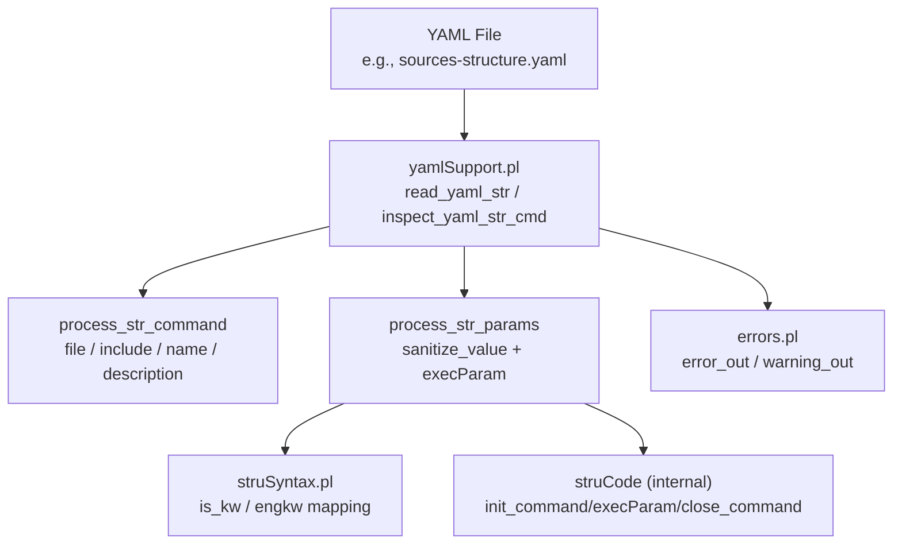
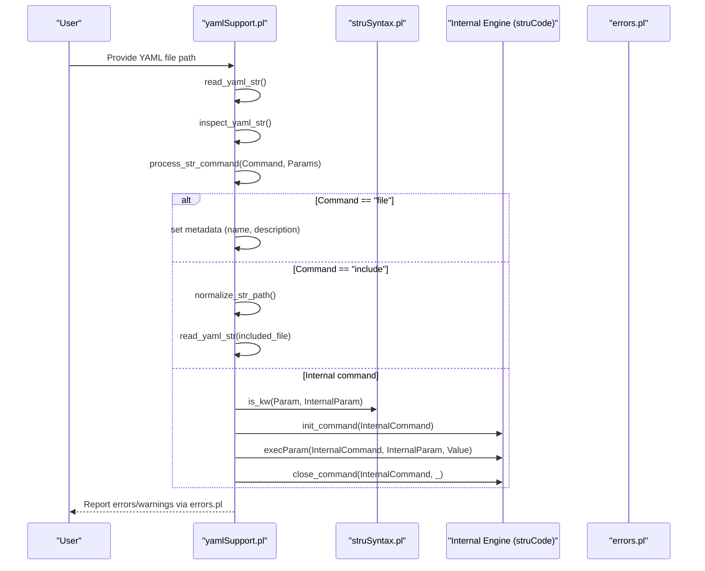
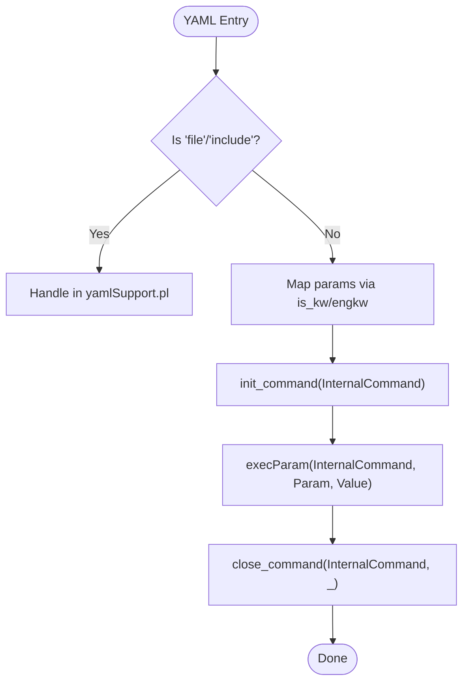
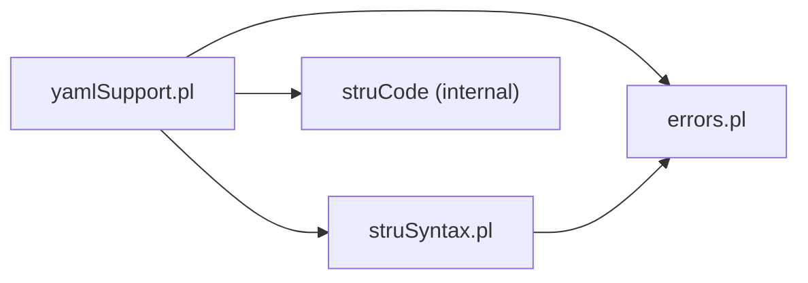

# Command Syntax and Parameters

<cite>
**Referenced Files in This Document**
- [yamlSupport.pl](file://src/yamlSupport.pl)
- [struSyntax.pl](file://src/struSyntax.pl)
- [elements.yaml](file://src/stru/elements.yaml)
- [groups.yaml](file://src/stru/groups.yaml)
- [sources-structure.yaml](file://src/stru/sources-structure.yaml)
- [errors.pl](file://src/errors.pl)
</cite>

## Table of Contents
1. [Introduction](#introduction)
2. [Project Structure](#project-structure)
3. [Core Components](#core-components)
4. [Architecture Overview](#architecture-overview)
5. [Detailed Component Analysis](#detailed-component-analysis)
6. [Dependency Analysis](#dependency-analysis)
7. [Performance Considerations](#performance-considerations)
8. [Troubleshooting Guide](#troubleshooting-guide)
9. [Conclusion](#conclusion)

## Introduction
This document explains the YAML command syntax used to define Kleio structure files (schemas). It covers all supported top-level commands, their parameters, types, validation rules, defaults, and provides real-world usage examples. It also maps YAML commands to internal Kleio commands and includes error handling and debugging techniques for YAML syntax issues.

## Project Structure
The YAML structure system is implemented primarily in a Prolog module that reads YAML, validates commands, and bridges them to the internal Kleio structure engine. Supporting modules provide keyword mapping and error reporting.

**Diagram sources**
- [yamlSupport.pl:28-100](file://src/yamlSupport.pl#L28-L100)
- [struSyntax.pl:278-416](file://src/struSyntax.pl#L278-L416)
- [errors.pl:85-167](file://src/errors.pl#L85-L167)

**Section sources**
- [yamlSupport.pl:28-100](file://src/yamlSupport.pl#L28-L100)
- [struSyntax.pl:278-416](file://src/struSyntax.pl#L278-L416)
- [errors.pl:85-167](file://src/errors.pl#L85-L167)

## Core Components
- YAML entry point and file processing:
  - Reads YAML, tracks included files, inspects commands, and delegates to internal commands.
- Command dispatcher:
  - Handles special YAML-only commands (file, include) and forwards others to internal Kleio commands via parameter processing.
- Keyword mapping:
  - Maps English keywords to internal Latin equivalents and validates allowed parameters per command.
- Error handling:
  - Produces contextual errors/warnings with file and command context.

Key responsibilities:
- yamlSupport.pl: YAML parsing orchestration, command dispatch, path normalization, sanitization.
- struSyntax.pl: Keyword equivalence and validation helpers.
- errors.pl: Centralized error and warning output with context.

**Section sources**
- [yamlSupport.pl:28-100](file://src/yamlSupport.pl#L28-L100)
- [struSyntax.pl:278-416](file://src/struSyntax.pl#L278-L416)
- [errors.pl:85-167](file://src/errors.pl#L85-L167)

## Architecture Overview
The YAML-to-Kleio pipeline converts YAML structures into internal structure definitions. The flow ensures safe inclusion of files, validates commands, and maps YAML keys to internal parameters.

**Diagram sources**
- [yamlSupport.pl:28-100](file://src/yamlSupport.pl#L28-L100)
- [struSyntax.pl:278-416](file://src/struSyntax.pl#L278-L416)
- [errors.pl:85-167](file://src/errors.pl#L85-L167)

## Detailed Component Analysis

### Supported YAML Commands and Parameters

#### file
Purpose:
- Declares the current structure file and its metadata.

Parameters:
- name (string): Required. Identifier or display name for the structure file.
- description (string): Optional. Human-readable description; default none.

Validation rules:
- Must be present at the top level before other commands that depend on file context.
- If name is missing, an error is raised.

Defaults:
- description defaults to none when omitted.

Mapping to internal commands:
- Handled directly by the YAML processor; no direct internal command invocation.

Example usage:
- See [sources-structure.yaml:1-6](file://src/stru/sources-structure.yaml#L1-L6) for a minimal file declaration.

**Section sources**
- [yamlSupport.pl:102-116](file://src/yamlSupport.pl#L102-L116)
- [sources-structure.yaml:1-6](file://src/stru/sources-structure.yaml#L1-L6)

#### include
Purpose:
- Includes another YAML structure file into the current one.

Parameters:
- Path (string): Required. Relative or absolute path to the included YAML file.

Validation rules:
- Resolves paths using normalization logic; prevents duplicate inclusion and warns if already processed.

Defaults:
- None.

Mapping to internal commands:
- Processed by the YAML processor; recursively reads and inspects the included file.

Example usage:
- See [sources-structure.yaml:7-9](file://src/stru/sources-structure.yaml#L7-L9) including elements.yaml and groups.yaml.

**Section sources**
- [yamlSupport.pl:119-129](file://src/yamlSupport.pl#L119-L129)
- [yamlSupport.pl:192-195](file://src/yamlSupport.pl#L192-L195)
- [sources-structure.yaml:7-9](file://src/stru/sources-structure.yaml#L7-L9)

#### name
Purpose:
- Sets the name within a file context.

Parameters:
- value (string): Required. Name value.

Validation rules:
- Must appear inside a file block; otherwise, an out-of-context error is raised.

Defaults:
- None.

Mapping to internal commands:
- Handled by the YAML processor; enforces context and reports errors if misplaced.

Example usage:
- Refer to element definitions in [elements.yaml:39-51](file://src/stru/elements.yaml#L39-L51) where name is used within element blocks.

**Section sources**
- [yamlSupport.pl:142-145](file://src/yamlSupport.pl#L142-L145)
- [elements.yaml:39-51](file://src/stru/elements.yaml#L39-L51)

#### description
Purpose:
- Provides a human-readable description within a file context.

Parameters:
- value (string): Required. Description text.

Validation rules:
- Must appear inside a file block; otherwise, an out-of-context error is raised.

Defaults:
- None.

Mapping to internal commands:
- Handled by the YAML processor; enforces context and reports errors if misplaced.

Example usage:
- See [elements.yaml:39-51](file://src/stru/elements.yaml#L39-L51) where descriptions are provided for elements.

**Section sources**
- [yamlSupport.pl:147-150](file://src/yamlSupport.pl#L147-L150)
- [elements.yaml:39-51](file://src/stru/elements.yaml#L39-L51)

### Parameter Types and Validation Rules

General behavior:
- All values from YAML are sanitized: strings are converted to atoms; lists are recursively sanitized.
- Parameters are validated against allowed names for each internal command using keyword mapping.

Keyword mapping:
- English keywords are mapped to internal Latin equivalents (e.g., guaranteed -> certe, source -> fons, type -> modus).
- Allowed parameters per command are enforced during parsing.

Sanitization:
- Atomic values are converted to atoms; list elements are sanitized recursively.

Error handling:
- Unknown commands produce errors with file and command context.
- Out-of-context commands (e.g., name/description outside file) raise specific errors.

Examples of mappings:
- guaranteed -> certe
- also -> ceteri
- source -> fons
- type -> modus
- position -> locus
- idprefix -> signum
- contains -> pars
- arbitrary -> repetitio

These mappings are defined in the keyword table and used during parameter processing.

**Section sources**
- [yamlSupport.pl:174-189](file://src/yamlSupport.pl#L174-L189)
- [struSyntax.pl:357-416](file://src/struSyntax.pl#L357-L416)
- [errors.pl:155-167](file://src/errors.pl#L155-L167)

### Real-World Usage Patterns

Top-level structure assembly:
- Use file to declare the structure file and description.
- Use include to compose multiple YAML fragments (elements, groups, domain-specific extensions).

Elements and groups:
- Define reusable elements (types, identifiers, standard fields) in elements.yaml.
- Compose groups (entities, acts, attributes, relations) in groups.yaml.
- Reference these in domain-specific YAML files via include.

Concrete references:
- Top-level composition: [sources-structure.yaml:1-10](file://src/stru/sources-structure.yaml#L1-L10)
- Elements definition: [elements.yaml:1-305](file://src/stru/elements.yaml#L1-L305)
- Groups definition: [groups.yaml:1-686](file://src/stru/groups.yaml#L1-L686)

**Section sources**
- [sources-structure.yaml:1-10](file://src/stru/sources-structure.yaml#L1-L10)
- [elements.yaml:1-305](file://src/stru/elements.yaml#L1-L305)
- [groups.yaml:1-686](file://src/stru/groups.yaml#L1-L686)

### Mapping Between YAML Commands and Internal Kleio Commands

Overview:
- Special YAML commands (file, include, name, description) are handled by the YAML processor.
- Other YAML entries map to internal commands via keyword equivalence and parameter execution.

Flow:
- YAML command -> process_str_command -> (if internal) init_command -> execParam -> close_command.
- Parameter names are normalized via is_kw and engkw mappings.

**Diagram sources**
- [yamlSupport.pl:132-140](file://src/yamlSupport.pl#L132-L140)
- [struSyntax.pl:278-416](file://src/struSyntax.pl#L278-L416)

**Section sources**
- [yamlSupport.pl:132-140](file://src/yamlSupport.pl#L132-L140)
- [struSyntax.pl:278-416](file://src/struSyntax.pl#L278-L416)

## Dependency Analysis
- yamlSupport.pl depends on:
  - library(yaml) for reading YAML.
  - persistence and kleioFiles for environment and file management.
  - struCode and struSyntax for internal command initialization and keyword mapping.
  - errors for reporting.
- struSyntax.pl provides:
  - Keyword equivalence (engkw) and validation helpers.
- errors.pl centralizes error and warning output with context.

**Diagram sources**
- [yamlSupport.pl:1-26](file://src/yamlSupport.pl#L1-L26)
- [struSyntax.pl:1-43](file://src/struSyntax.pl#L1-L43)
- [errors.pl:1-60](file://src/errors.pl#L1-L60)

**Section sources**
- [yamlSupport.pl:1-26](file://src/yamlSupport.pl#L1-L26)
- [struSyntax.pl:1-43](file://src/struSyntax.pl#L1-L43)
- [errors.pl:1-60](file://src/errors.pl#L1-L60)

## Performance Considerations
- Avoid deep nesting of includes to prevent excessive recursion and repeated inspections.
- Reuse common elements and groups via include to minimize duplication and speed up processing.
- Keep YAML files modular and well-organized to reduce inspection overhead.

[No sources needed since this section provides general guidance]

## Troubleshooting Guide

Common issues and diagnostics:
- Unknown command in YAML:
  - Cause: Misspelled or unsupported command.
  - Action: Verify command spelling and ensure it is supported at the top level.
- Out-of-context command:
  - Cause: Using name or description outside a file block.
  - Action: Ensure these commands are placed within a file context.
- Duplicate inclusion:
  - Behavior: Previously processed files are ignored with a warning.
  - Action: Review include paths and avoid redundant includes.
- Parameter validation errors:
  - Cause: Invalid parameter name or value for a command.
  - Action: Check allowed parameters and use correct keyword mappings.

Error reporting features:
- Contextual messages include file name, command, and surrounding lines for data files.
- Errors increment counters and can abort translation after a threshold.

Debugging tips:
- Enable verbose logging by reviewing report outputs during structure processing.
- Inspect warnings about previously processed files to identify include loops.
- Validate YAML syntax independently before running the full translation.

**Section sources**
- [yamlSupport.pl:153-157](file://src/yamlSupport.pl#L153-L157)
- [yamlSupport.pl:54-71](file://src/yamlSupport.pl#L54-L71)
- [errors.pl:85-167](file://src/errors.pl#L85-L167)

## Conclusion
The YAML structure system provides a clear, composable way to define Kleio schemas. By using file, include, name, and description commands alongside robust parameter validation and keyword mapping, users can build maintainable and extensible structure definitions. Proper error handling and contextual reporting aid in diagnosing issues quickly.

[No sources needed since this section summarizes without analyzing specific files]