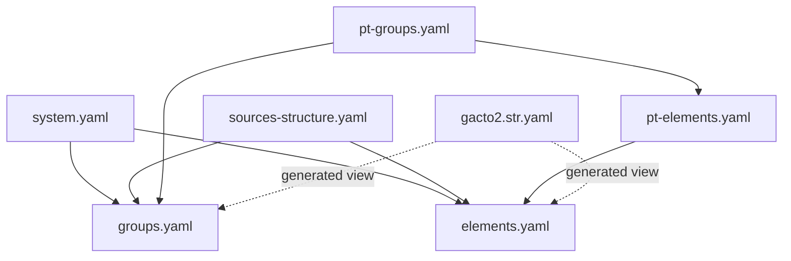
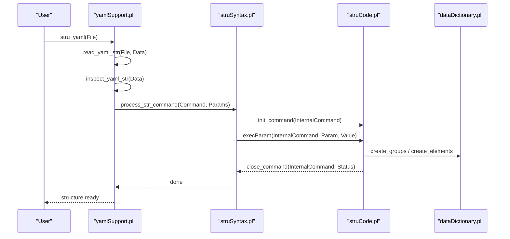
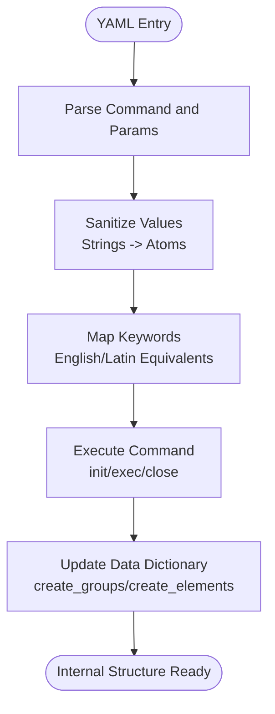
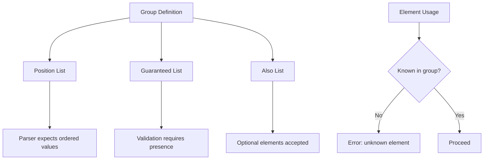
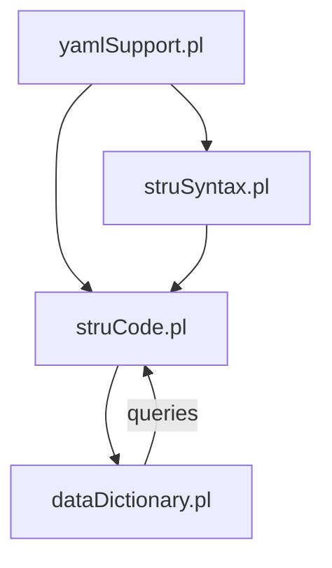

# Element Definition Syntax

<cite>
**Referenced Files in This Document**
- [elements.yaml](file://src/stru/elements.yaml)
- [groups.yaml](file://src/stru/groups.yaml)
- [system.yaml](file://src/stru/system.yaml)
- [sources-structure.yaml](file://src/stru/sources-structure.yaml)
- [pt-elements.yaml](file://src/stru/pt-elements.yaml)
- [pt-groups.yaml](file://src/stru/pt-groups.yaml)
- [gacto2.str.yaml](file://src/stru/gacto2.str.yaml)
- [yamlSupport.pl](file://src/yamlSupport.pl)
- [struSyntax.pl](file://src/struSyntax.pl)
- [dataDictionary.pl](file://src/dataDictionary.pl)
</cite>

## Table of Contents
1. [Introduction](#introduction)
2. [Project Structure](#project-structure)
3. [Core Components](#core-components)
4. [Architecture Overview](#architecture-overview)
5. [Detailed Component Analysis](#detailed-component-analysis)
6. [Dependency Analysis](#dependency-analysis)
7. [Performance Considerations](#performance-considerations)
8. [Troubleshooting Guide](#troubleshooting-guide)
9. [Conclusion](#conclusion)
10. [Appendices](#appendices)

## Introduction
This document explains the YAML element definition syntax used to define Kleio structures (schemas). It covers supported element types, their properties and configuration options, how YAML definitions map to internal Kleio element structures, inheritance patterns, grouping, reuse strategies, validation rules, and best practices. Examples illustrate simple elements, complex nested groups, and elements with validation constraints.

## Project Structure
Kleio structure definitions are authored as YAML files that declare elements and groups. The core building blocks are:
- Elements: atomic data fields with names, descriptions, types, and behaviors.
- Groups: composite containers that specify allowed elements, required fields, ordering, containment, and id prefixes.
- Includes: modular composition via include directives.

**Diagram sources**
- [system.yaml:1-4](file://src/stru/system.yaml#L1-L4)
- [sources-structure.yaml:1-10](file://src/stru/sources-structure.yaml#L1-L10)
- [elements.yaml:1-305](file://src/stru/elements.yaml#L1-L305)
- [groups.yaml:1-686](file://src/stru/groups.yaml#L1-L686)
- [pt-elements.yaml:1-136](file://src/stru/pt-elements.yaml#L1-L136)
- [pt-groups.yaml:1-238](file://src/stru/pt-groups.yaml#L1-L238)
- [gacto2.str.yaml:1-800](file://src/stru/gacto2.str.yaml#L1-L800)

**Section sources**
- [system.yaml:1-4](file://src/stru/system.yaml#L1-L4)
- [sources-structure.yaml:1-10](file://src/stru/sources-structure.yaml#L1-L10)

## Core Components
- Element definitions:
  - Declared using a list item with key element.
  - Common keys: name, description, source, type, identification.
  - source enables specialization by referencing another element; type can override or refine the underlying storage type.
- Group definitions:
  - Declared using a list item with key group.
  - Common keys: name, description, position, guaranteed, also, contains (alias part), source, idprefix.
  - position defines ordered shorthand parsing order.
  - guaranteed lists required elements.
  - also lists optional elements.
  - contains/part enumerates allowed child groups.
  - source enables group inheritance from another group.
  - idprefix sets default id prefix for instances of this group.

Examples of these constructs appear throughout the core schema files.

**Section sources**
- [elements.yaml:1-305](file://src/stru/elements.yaml#L1-L305)
- [groups.yaml:1-686](file://src/stru/groups.yaml#L1-L686)

## Architecture Overview
The YAML structure is parsed and transformed into an internal representation used by Kleio. The processing pipeline includes:
- YAML reading and command dispatching.
- Parameter normalization and keyword mapping.
- Execution of commands to build internal structures.
- Validation and storage in the data dictionary.

**Diagram sources**
- [yamlSupport.pl:28-177](file://src/yamlSupport.pl#L28-L177)
- [struSyntax.pl:48-101](file://src/struSyntax.pl#L48-L101)
- [struCode.pl:91-118](file://src/struCode.pl#L91-L118)
- [dataDictionary.pl:118-146](file://src/dataDictionary.pl#L118-L146)

## Detailed Component Analysis

### YAML Commands and Keys
- file: metadata about the current file (name, description).
- include: import another YAML structure file.
- element: define an element with name, description, source, type, identification.
- group: define a group with name, description, position, guaranteed, also, contains/part, source, idprefix.

These commands are recognized and dispatched by the YAML processor and mapped to internal commands.

**Section sources**
- [yamlSupport.pl:102-177](file://src/yamlSupport.pl#L102-L177)
- [struSyntax.pl:355-416](file://src/struSyntax.pl#L355-L416)

### Element Types and Properties
Supported basic element types and common properties:
- Basic types: number, string64, string256, text, control, json.
- Date-related: day, month, year, date, date_extra_info.
- Identification and linking: id, same_as, xsame_as, entity, origin, destination.
- Standard attributes: type, value, class, loc, name, description, destname, sname, sex, obs, summary, ref, page, pages, title.
- Processing controls: replaces, replace, subs, autorels, prefix, structure, translations, translator, urlpattern, shortname, inside.
- Source provenance: groupname, level, line, kleiofile.
- Authority record helpers: atype, dbase, func, mode, occurrence, status, user.

Properties:
- name: unique identifier of the element within the schema.
- description: human-readable documentation.
- source: reference to another element to inherit behavior/type.
- type: explicit storage type override.
- identification: marks an element as an identifier (e.g., yes/no).

Examples of these definitions exist in the core element set.

**Section sources**
- [elements.yaml:37-305](file://src/stru/elements.yaml#L37-L305)

### Group Definitions and Inheritance
Groups compose elements and other groups:
- position: ordered list of elements for compact notation.
- guaranteed: required elements.
- also: optional elements.
- contains/part: allowed child groups.
- source: parent group to extend.
- idprefix: default id prefix for instances.

Inheritance allows specialized groups to reuse and refine base behavior. For example, historical-source extends entity; person extends entity; female/male extend person; many domain-specific groups extend these bases.

**Section sources**
- [groups.yaml:69-686](file://src/stru/groups.yaml#L69-L686)

### Localization and Aliases
Portuguese aliases for core elements and groups enable localized schemas without duplicating logic. These alias elements point back to English core elements via source.

**Section sources**
- [pt-elements.yaml:1-136](file://src/stru/pt-elements.yaml#L1-L136)
- [pt-groups.yaml:1-238](file://src/stru/pt-groups.yaml#L1-L238)

### Generated View of Internal Structures
A generated YAML view mirrors the internal structure after compilation, showing normalized forms and resolved inheritance. This aids inspection and debugging.

**Section sources**
- [gacto2.str.yaml:1-800](file://src/stru/gacto2.str.yaml#L1-L800)

### Mapping Between YAML and Internal Structures
- YAML element/group entries are converted to internal commands.
- Parameters are sanitized (strings to atoms) and validated against known keywords.
- Command execution updates the data dictionary, creating predicates for groups and elements.
- Containment relationships and defaults are computed and cached.

**Diagram sources**
- [yamlSupport.pl:174-177](file://src/yamlSupport.pl#L174-L177)
- [struSyntax.pl:291-313](file://src/struSyntax.pl#L291-L313)
- [dataDictionary.pl:118-146](file://src/dataDictionary.pl#L118-L146)

**Section sources**
- [yamlSupport.pl:174-177](file://src/yamlSupport.pl#L174-L177)
- [struSyntax.pl:291-313](file://src/struSyntax.pl#L291-L313)
- [dataDictionary.pl:118-146](file://src/dataDictionary.pl#L118-L146)

### Validation Rules and Constraints
- Required elements: enforced via guaranteed lists in groups.
- Positional shorthand: enforced via position lists.
- Unknown elements: detected during parsing and reported with context.
- Identification markers: certain elements marked as identifiers influence linking and uniqueness checks.

**Diagram sources**
- [groups.yaml:69-686](file://src/stru/groups.yaml#L69-L686)
- [dataCode.pl:308-321](file://src/dataCode.pl#L308-L321)

**Section sources**
- [groups.yaml:69-686](file://src/stru/groups.yaml#L69-L686)
- [dataCode.pl:308-321](file://src/dataCode.pl#L308-L321)

### Examples

#### Simple Elements
- Basic types and identifiers are defined as elements with descriptive names and types.
- Example references:
  - [elements.yaml:37-125](file://src/stru/elements.yaml#L37-L125)

#### Complex Elements with Nested Structures
- Groups like historical-source, event, person, attribute, relation compose multiple elements and subgroups.
- Example references:
  - [groups.yaml:110-133](file://src/stru/groups.yaml#L110-L133)
  - [groups.yaml:373-381](file://src/stru/groups.yaml#L373-L381)
  - [groups.yaml:524-568](file://src/stru/groups.yaml#L524-L568)

#### Elements with Validation Rules
- Guaranteed and position lists enforce presence and order.
- Identification flags mark critical fields.
- Example references:
  - [groups.yaml:84-93](file://src/stru/groups.yaml#L84-L93)
  - [elements.yaml:86-93](file://src/stru/elements.yaml#L86-L93)

### Inheritance Patterns
- Groups extend other groups via source to reuse and specialize behavior.
- Elements specialize via source to reuse type and semantics.
- Example references:
  - [groups.yaml:110-133](file://src/stru/groups.yaml#L110-L133)
  - [groups.yaml:373-381](file://src/stru/groups.yaml#L373-L381)
  - [elements.yaml:86-125](file://src/stru/elements.yaml#L86-L125)

### Element Grouping and Reuse Strategies
- Use includes to modularize schemas across files.
- Define reusable base groups (entity, historical-source) and specialize them.
- Use aliases (Portuguese elements) to support localization without duplication.
- Example references:
  - [system.yaml:1-4](file://src/stru/system.yaml#L1-L4)
  - [sources-structure.yaml:1-10](file://src/stru/sources-structure.yaml#L1-L10)
  - [pt-elements.yaml:1-136](file://src/stru/pt-elements.yaml#L1-L136)
  - [pt-groups.yaml:1-238](file://src/stru/pt-groups.yaml#L1-L238)

### Best Practices
- Prefer specialization via source over redefining elements from scratch.
- Keep position lists minimal and aligned with typical usage patterns.
- Use guaranteed lists to enforce essential fields.
- Leverage idprefix to avoid id collisions across modules.
- Organize schemas with includes for clarity and maintainability.

[No sources needed since this section provides general guidance]

## Dependency Analysis
The YAML structure system depends on several modules:
- yamlSupport.pl orchestrates reading and dispatching YAML commands.
- struSyntax.pl maps keywords and validates parameters.
- struCode.pl executes commands and manages lifecycle.
- dataDictionary.pl stores and queries internal structures.

**Diagram sources**
- [yamlSupport.pl:28-177](file://src/yamlSupport.pl#L28-L177)
- [struSyntax.pl:48-101](file://src/struSyntax.pl#L48-L101)
- [struCode.pl:91-118](file://src/struCode.pl#L91-L118)
- [dataDictionary.pl:118-146](file://src/dataDictionary.pl#L118-L146)

**Section sources**
- [yamlSupport.pl:28-177](file://src/yamlSupport.pl#L28-L177)
- [struSyntax.pl:48-101](file://src/struSyntax.pl#L48-L101)
- [struCode.pl:91-118](file://src/struCode.pl#L91-L118)
- [dataDictionary.pl:118-146](file://src/dataDictionary.pl#L118-L146)

## Performance Considerations
- Include only necessary modules to reduce parsing overhead.
- Avoid deep nesting unless required; large hierarchies increase validation time.
- Use idprefix strategically to minimize id collision checks.
- Prefer reuse via source to limit redundant definitions.

[No sources needed since this section provides general guidance]

## Troubleshooting Guide
Common issues and diagnostics:
- Unknown command in YAML: check spelling and supported keys.
- Unknown element in group: ensure the element is declared and allowed by the group’s position/guaranteed/also lists.
- Missing required elements: verify guaranteed lists.
- Circular includes: the processor warns when previously processed files are included again.

Relevant error handling paths:
- Unrecognized YAML commands.
- Unknown elements during validation.
- Duplicate file inclusion warnings.

**Section sources**
- [yamlSupport.pl:152-157](file://src/yamlSupport.pl#L152-L157)
- [dataCode.pl:308-321](file://src/dataCode.pl#L308-L321)
- [yamlSupport.pl:54-72](file://src/yamlSupport.pl#L54-L72)

## Conclusion
Kleio’s YAML element definition syntax provides a clear, extensible way to model structured data. By leveraging elements, groups, inheritance, and includes, you can build robust schemas with strong validation and localization support. Following best practices ensures maintainable and efficient structures.

[No sources needed since this section summarizes without analyzing specific files]

## Appendices

### Appendix A: Supported YAML Keys Summary
- file: name, description
- include: path
- element: name, description, source, type, identification
- group: name, description, position, guaranteed, also, contains/part, source, idprefix

**Section sources**
- [elements.yaml:1-305](file://src/stru/elements.yaml#L1-L305)
- [groups.yaml:1-686](file://src/stru/groups.yaml#L1-L686)

### Appendix B: Keyword Mappings
English and Latin equivalents are mapped internally to unify processing.

**Section sources**
- [struSyntax.pl:355-416](file://src/struSyntax.pl#L355-L416)