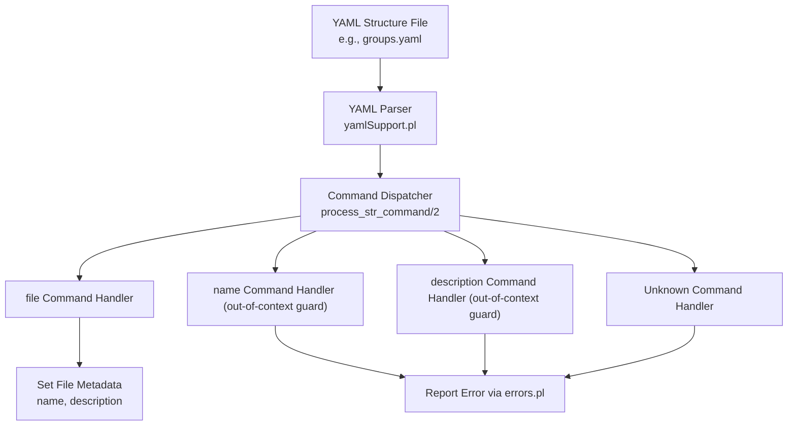
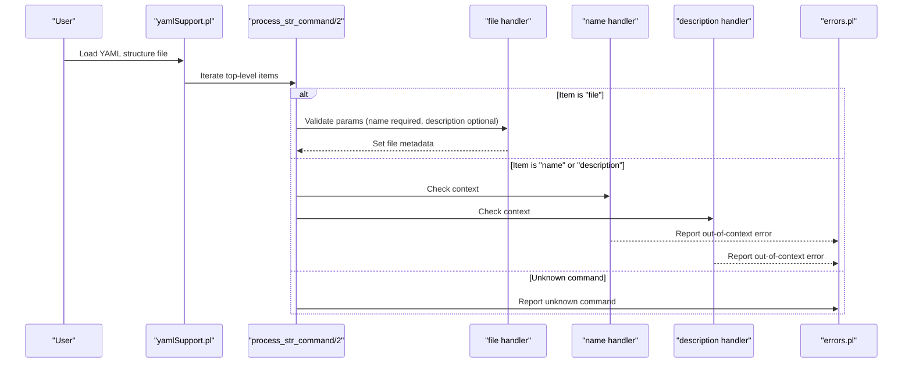
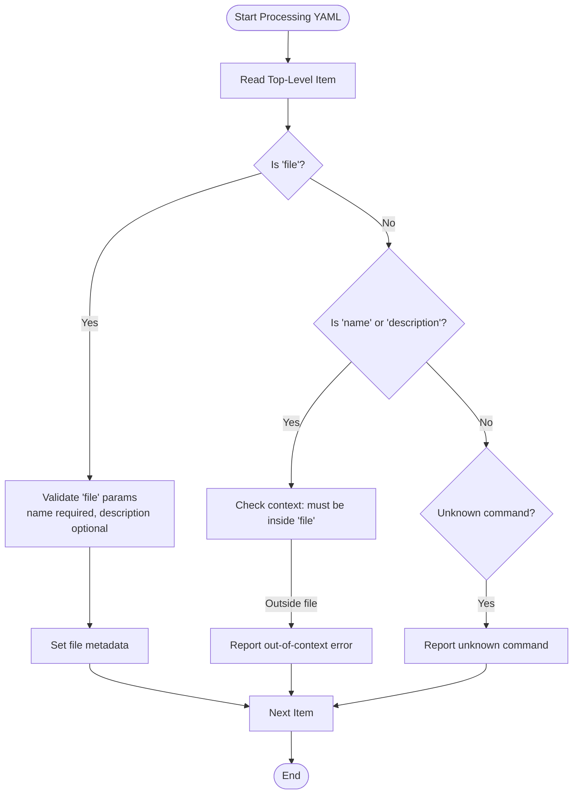
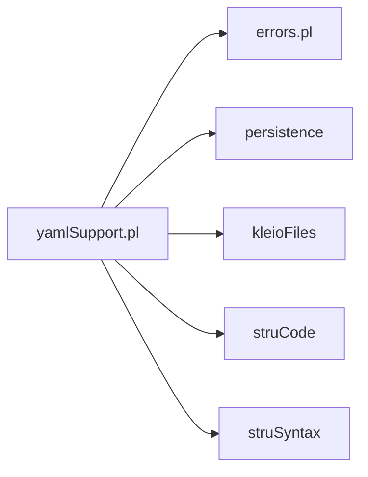

# File Management Commands

<cite>
**Referenced Files in This Document**
- [yamlSupport.pl](file://src/yamlSupport.pl)
- [errors.pl](file://src/errors.pl)
- [groups.yaml](file://src/stru/groups.yaml)
- [gacto2.str.yaml](file://src/stru/gacto2.str.yaml)
</cite>

## Table of Contents
1. [Introduction](#introduction)
2. [Project Structure](#project-structure)
3. [Core Components](#core-components)
4. [Architecture Overview](#architecture-overview)
5. [Detailed Component Analysis](#detailed-component-analysis)
6. [Dependency Analysis](#dependency-analysis)
7. [Performance Considerations](#performance-considerations)
8. [Troubleshooting Guide](#troubleshooting-guide)
9. [Conclusion](#conclusion)

## Introduction
This document explains the YAML file management commands used to declare structure metadata and context: file, name, and description. It covers command syntax, required and optional parameters, validation rules, usage patterns, error handling for out-of-context usage, and parameter validation failures. The goal is to help users author correct YAML structure files that define file-level metadata and integrate with the Kleio processing pipeline.

## Project Structure
The YAML structure parser is implemented in a dedicated module that reads YAML files, inspects top-level commands, and dispatches them to handlers. The relevant implementation resides in the YAML support module, while error reporting is centralized in an errors module. Example YAML structure files demonstrate how the file command is used at the top level of schema definitions.

**Diagram sources**
- [yamlSupport.pl:101-116](file://src/yamlSupport.pl#L101-L116)
- [yamlSupport.pl:142-157](file://src/yamlSupport.pl#L142-L157)
- [errors.pl:89-113](file://src/errors.pl#L89-L113)

**Section sources**
- [yamlSupport.pl:1-46](file://src/yamlSupport.pl#L1-L46)
- [errors.pl:1-60](file://src/errors.pl#L1-L60)

## Core Components
- YAML structure entry point: loads and processes YAML structure files, initializes state, and iterates over top-level commands.
- Command dispatcher: routes each YAML command to its handler.
- file command handler: validates presence of name, accepts optional description, and sets file metadata.
- name and description handlers: enforce context by raising errors when used outside a file block.
- Unknown command handler: reports spelling or unsupported commands.
- Error reporting: centralizes error and warning output with context information.

Key responsibilities:
- Validate command context (file vs non-file).
- Enforce required parameters (name for file).
- Accept optional parameters (description for file).
- Report clear errors for invalid usage.

**Section sources**
- [yamlSupport.pl:101-116](file://src/yamlSupport.pl#L101-L116)
- [yamlSupport.pl:142-157](file://src/yamlSupport.pl#L142-L157)
- [errors.pl:89-113](file://src/errors.pl#L89-L113)

## Architecture Overview
The YAML structure processing flow begins with reading a YAML file, inspecting each top-level item, and invoking the appropriate command handler. For file-related metadata, the file command must be present and include a name; description is optional. Using name or description outside a file block triggers an out-of-context error.

**Diagram sources**
- [yamlSupport.pl:101-116](file://src/yamlSupport.pl#L101-L116)
- [yamlSupport.pl:142-157](file://src/yamlSupport.pl#L142-L157)
- [errors.pl:89-113](file://src/errors.pl#L89-L113)

## Detailed Component Analysis

### file Command
Purpose:
- Declares a structure file and provides metadata.

Syntax:
- Top-level YAML list item with key file.
- Required parameter: name (string).
- Optional parameter: description (string).

Validation rules:
- Must appear at the top level of the YAML structure file.
- name is required; missing name results in a validation failure.
- description is optional; if omitted, defaults are applied internally.

Usage pattern:
- Place file at the beginning of a structure YAML file to set metadata.
- Combine with other top-level commands like include and group/element definitions.

Example references:
- See example usage in structure files where file includes name and description.

**Section sources**
- [yamlSupport.pl:101-116](file://src/yamlSupport.pl#L101-L116)
- [groups.yaml:1-6](file://src/stru/groups.yaml#L1-L6)
- [gacto2.str.yaml:1-5](file://src/stru/gacto2.str.yaml#L1-L5)

### name Command
Purpose:
- Intended to set a name within a specific context.

Context requirement:
- Must be used inside a file block.

Error behavior:
- If used outside a file block, an out-of-context error is reported.

Validation rules:
- Requires being nested under file; otherwise rejected.

Example references:
- Out-of-context usage leads to error reporting.

**Section sources**
- [yamlSupport.pl:142-145](file://src/yamlSupport.pl#L142-L145)
- [errors.pl:89-113](file://src/errors.pl#L89-L113)

### description Command
Purpose:
- Intended to set a description within a specific context.

Context requirement:
- Must be used inside a file block.

Error behavior:
- If used outside a file block, an out-of-context error is reported.

Validation rules:
- Requires being nested under file; otherwise rejected.

Example references:
- Out-of-context usage leads to error reporting.

**Section sources**
- [yamlSupport.pl:146-150](file://src/yamlSupport.pl#L146-L150)
- [errors.pl:89-113](file://src/errors.pl#L89-L113)

### Unknown Command Handling
Behavior:
- Any unrecognized command at the top level triggers an error indicating unknown command and suggests checking spelling.

Impact:
- Helps catch typos and unsupported keys early during structure processing.

**Section sources**
- [yamlSupport.pl:152-157](file://src/yamlSupport.pl#L152-L157)
- [errors.pl:89-113](file://src/errors.pl#L89-L113)

### Context Flowchart

**Diagram sources**
- [yamlSupport.pl:101-116](file://src/yamlSupport.pl#L101-L116)
- [yamlSupport.pl:142-157](file://src/yamlSupport.pl#L142-L157)
- [errors.pl:89-113](file://src/errors.pl#L89-L113)

## Dependency Analysis
- yamlSupport.pl depends on:
  - persistence utilities for storing values and properties.
  - kleioFiles for path normalization and resolution.
  - struCode and struSyntax for command bridging and keyword equivalence.
  - errors for consistent error reporting.
- errors.pl centralizes error and warning outputs and integrates with report formatting.

**Diagram sources**
- [yamlSupport.pl:1-26](file://src/yamlSupport.pl#L1-L26)
- [errors.pl:1-60](file://src/errors.pl#L1-L60)

**Section sources**
- [yamlSupport.pl:1-26](file://src/yamlSupport.pl#L1-L26)
- [errors.pl:1-60](file://src/errors.pl#L1-L60)

## Performance Considerations
- YAML parsing occurs once per structure file; avoid redundant includes to prevent repeated processing warnings.
- Keep file metadata minimal and declarative to reduce overhead.
- Use include judiciously to compose large schemas without duplicating content.

[No sources needed since this section provides general guidance]

## Troubleshooting Guide
Common issues and resolutions:
- Out-of-context usage of name or description:
  - Ensure these commands are placed inside a file block.
  - If they appear at the top level outside file, expect an out-of-context error.
- Missing required parameter name in file:
  - Add the name parameter to the file block.
- Unknown command:
  - Verify spelling and supported keys; only file, include, and recognized structure commands are valid at the top level.

Error reporting details:
- Errors include context such as current command and source file, aiding diagnosis.

**Section sources**
- [yamlSupport.pl:142-157](file://src/yamlSupport.pl#L142-L157)
- [errors.pl:89-113](file://src/errors.pl#L89-L113)

## Conclusion
The file, name, and description commands provide a structured way to declare YAML structure file metadata and context. The file command requires a name and optionally accepts a description. The name and description commands must be used within a file block; otherwise, they trigger out-of-context errors. Proper usage ensures clear metadata and robust integration with the Kleio processing pipeline.